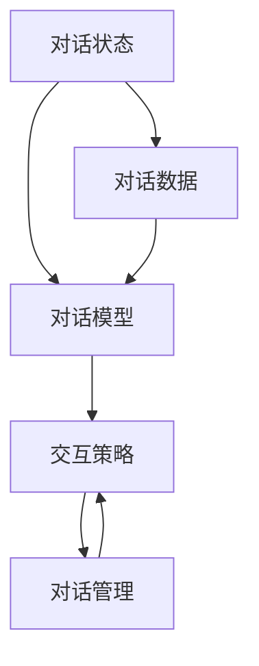
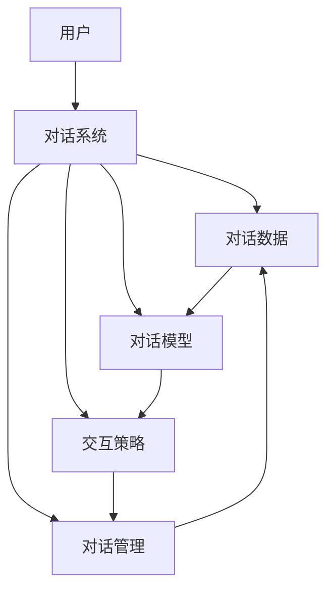
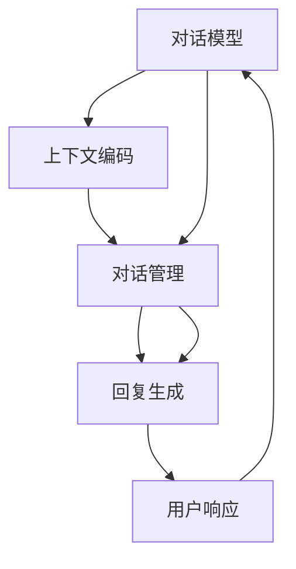

                 

# 对话系统(Chatbots) - 原理与代码实例讲解

> 关键词：对话系统, 自然语言处理(NLP), 机器学习, 深度学习, 多轮对话, 模型微调

## 1. 背景介绍

### 1.1 问题由来

随着人工智能技术的迅速发展，对话系统(Chatbots)成为了信息时代的重要组成部分，广泛应用于智能客服、智能家居、智能助手等多个场景。对话系统通过与用户进行自然语言交流，自动完成信息检索、问题解答、任务执行等任务，极大地提升了用户体验和效率。然而，传统的对话系统往往依赖于手工编写的规则和模板，难以应对复杂多变的用户需求，且维护成本较高。

近年来，基于深度学习的对话系统（尤其是基于Transformer架构的语言模型）取得了突破性进展。这类对话系统能够通过大规模无标签文本数据的预训练，学习到丰富的语言表示和语义理解能力，并通过少量标注数据的微调，适配到特定应用场景。这种基于自监督学习和迁移学习的对话系统，已经逐步取代了传统规则驱动的对话系统，成为行业主流。

### 1.2 问题核心关键点

对话系统的主要研究目标包括：
1. **提高响应准确性**：能够准确理解用户意图，并给出最合适的回答。
2. **增强上下文理解**：能够保持对多轮对话上下文的记忆，流畅持续地与用户对话。
3. **适应性**：能够应对不同领域、不同风格的用户需求，具备良好的跨领域迁移能力。
4. **高效性**：能够在实时交互中快速响应，处理高并发请求。
5. **可解释性**：能够提供其决策依据，提升用户信任和接受度。

## 2. 核心概念与联系

### 2.1 核心概念概述

对话系统的核心概念包括：
1. **对话状态**：记录对话的上下文信息，包括对话历史、用户意图、上下文上下文等。
2. **对话模型**：使用深度学习模型（如Transformer、RNN等）对对话状态进行编码和解码，预测合适的回复。
3. **交互策略**：根据对话模型预测的回复，决定如何与用户交互，如生成自然语言回答、选择问题模板等。
4. **对话管理**：根据用户行为和上下文信息，决定对话流程，如任务分配、错误纠正、话题转换等。

对话系统的架构可以分为多个层次，包括：
- **对话数据准备**：收集、清洗、标注对话数据，准备训练集和验证集。
- **对话模型训练**：使用深度学习模型进行对话模型训练，优化模型参数。
- **交互策略设计**：设计交互策略，优化用户对话体验。
- **对话管理优化**：优化对话管理流程，提高对话效率和鲁棒性。

这些核心概念和架构之间的联系可以通过以下Mermaid流程图来展示：



这个流程图展示了对话系统的核心组件及其相互关系：对话状态驱动对话模型生成回复，交互策略根据回复引导用户行为，对话管理根据对话流程优化对话过程。

### 2.2 概念间的关系

对话系统的各组件之间存在着紧密的联系，形成一个闭环的对话系统。下面我们通过几个Mermaid流程图来展示这些概念之间的关系。

#### 2.2.1 对话系统整体架构



这个流程图展示了对话系统的整体架构，包括用户、对话数据、对话模型、交互策略和对话管理之间的相互关系。

#### 2.2.2 对话模型与对话管理的关系



这个流程图展示了对话模型与对话管理之间的联系。对话模型对上下文进行编码，对话管理根据编码结果生成回复，并根据回复调整对话流程。

## 3. 核心算法原理 & 具体操作步骤

### 3.1 算法原理概述

基于深度学习的对话系统主要采用基于Transformer的序列到序列模型进行构建。该模型由编码器和解码器组成，能够对输入序列进行编码，生成输出序列。

在对话系统中，编码器接收对话历史和用户输入，将其编码为上下文表示；解码器根据上下文表示生成对话回复。通过微调这种预训练模型，可以使其适应特定的对话场景，提升对话系统的性能。

### 3.2 算法步骤详解

基于Transformer的对话系统通常包括以下几个关键步骤：

**Step 1: 数据准备**
- 收集对话数据，清洗标注数据，划分为训练集和验证集。
- 将对话历史和用户输入作为输入序列，将回复作为输出序列。

**Step 2: 模型搭建**
- 搭建Transformer模型，包括编码器和解码器。
- 使用softmax层作为解码器的输出层，并设置交叉熵损失函数。

**Step 3: 模型训练**
- 使用训练集进行模型训练，优化模型参数。
- 在验证集上评估模型性能，调整超参数，防止过拟合。

**Step 4: 对话生成**
- 将新的用户输入作为编码器的输入，解码器生成回复。
- 根据回复与上下文信息进行对话管理，生成下一步的用户输入。

**Step 5: 系统部署**
- 将训练好的模型部署到实际应用中，如客服系统、智能助手等。
- 监控系统性能，根据用户反馈不断优化对话策略。

### 3.3 算法优缺点

基于Transformer的对话系统具有以下优点：
1. 性能优越：Transformer模型具有强大的序列建模能力，能够处理长对话，保持上下文信息。
2. 可扩展性强：可以处理多轮对话，支持不同的对话场景。
3. 易于优化：通过微调，可以适应特定任务，提升对话质量。

同时，该方法也存在一些缺点：
1. 数据需求大：对话系统的训练需要大量高质量标注数据，数据获取和标注成本较高。
2. 模型复杂度高：Transformer模型参数量大，计算复杂度高，难以实时部署。
3. 对话管理复杂：对话管理策略需要经过大量试验和调整，才能保证系统性能。

### 3.4 算法应用领域

基于深度学习的对话系统已经在智能客服、智能家居、智能助手等多个领域得到了广泛应用。例如：

- 智能客服：帮助企业提升客户服务效率，降低人力成本。
- 智能家居：帮助用户控制家中的智能设备，提供个性化的生活建议。
- 智能助手：辅助用户完成日常任务，如日程管理、信息查询等。

此外，对话系统还被创新性地应用于医疗咨询、金融咨询、法律咨询等领域，为专业领域提供高效便捷的服务。

## 4. 数学模型和公式 & 详细讲解

### 4.1 数学模型构建

假设对话模型为Transformer模型，输入序列为 $x_1, x_2, ..., x_n$，输出序列为 $y_1, y_2, ..., y_n$，其中 $x_i, y_i \in \mathbb{R}^d$。则对话模型可以表示为：

$$
y = f(x; \theta)
$$

其中 $f$ 为Transformer模型，$\theta$ 为模型参数。

在对话生成任务中，目标函数为交叉熵损失：

$$
\mathcal{L}(y, \hat{y}) = -\sum_{i=1}^n \sum_{j=1}^d y_{i,j} \log \hat{y}_{i,j}
$$

其中 $y_{i,j}$ 为真实标签，$\hat{y}_{i,j}$ 为模型预测。

### 4.2 公式推导过程

以单层Transformer模型为例，解码器的输出为：

$$
\hat{y}_{i,j} = \text{softmax}(W_1 [S(x_{i-1}) + y_{i-1}][QK]^T + W_2 y_{i-1})
$$

其中 $S(x_{i-1})$ 为编码器输出的上下文表示，$Q$ 和 $K$ 分别为查询和键矩阵，$W_1$ 和 $W_2$ 为可训练的线性变换层，$[...]$ 表示拼接。

在训练过程中，通过反向传播算法更新模型参数 $\theta$，使得损失函数 $\mathcal{L}$ 最小化。训练流程可以表示为：

$$
\theta \leftarrow \theta - \eta \nabla_{\theta}\mathcal{L}(y, \hat{y})
$$

其中 $\eta$ 为学习率，$\nabla_{\theta}\mathcal{L}$ 为损失函数对参数 $\theta$ 的梯度。

### 4.3 案例分析与讲解

假设我们有一个简单的对话生成任务，输入为对话历史 $[x_1, x_2]$ 和用户输入 $x_3$，输出为回复 $y_1$。通过对话系统，我们希望生成回复 $y_1$。

假设我们的模型为Transformer模型，其编码器输出上下文表示 $S([x_1, x_2, x_3])$，解码器输出为 $\hat{y}_1$。则模型训练的优化目标为：

$$
\min_{\theta} \mathcal{L}(y_1, \hat{y}_1) = -y_{1,j} \log \hat{y}_{1,j}
$$

在训练过程中，我们使用交叉熵损失函数计算损失，通过反向传播算法更新模型参数。通过多次迭代训练，模型可以学习到对话历史和用户输入之间的映射关系，生成合适的回复。

## 5. 项目实践：代码实例和详细解释说明

### 5.1 开发环境搭建

在进行对话系统开发前，我们需要准备好开发环境。以下是使用Python进行PyTorch开发的环境配置流程：

1. 安装Anaconda：从官网下载并安装Anaconda，用于创建独立的Python环境。

2. 创建并激活虚拟环境：
```bash
conda create -n pytorch-env python=3.8 
conda activate pytorch-env
```

3. 安装PyTorch：根据CUDA版本，从官网获取对应的安装命令。例如：
```bash
conda install pytorch torchvision torchaudio cudatoolkit=11.1 -c pytorch -c conda-forge
```

4. 安装Transformers库：
```bash
pip install transformers
```

5. 安装各类工具包：
```bash
pip install numpy pandas scikit-learn matplotlib tqdm jupyter notebook ipython
```

完成上述步骤后，即可在`pytorch-env`环境中开始对话系统开发。

### 5.2 源代码详细实现

下面我们以情感分析对话系统为例，给出使用Transformers库对BERT模型进行情感分析对话的PyTorch代码实现。

首先，定义对话数据处理函数：

```python
from transformers import BertTokenizer
from torch.utils.data import Dataset
import torch

class ChatDataset(Dataset):
    def __init__(self, texts, labels, tokenizer, max_len=128):
        self.texts = texts
        self.labels = labels
        self.tokenizer = tokenizer
        self.max_len = max_len
        
    def __len__(self):
        return len(self.texts)
    
    def __getitem__(self, item):
        text = self.texts[item]
        label = self.labels[item]
        
        encoding = self.tokenizer(text, return_tensors='pt', max_length=self.max_len, padding='max_length', truncation=True)
        input_ids = encoding['input_ids'][0]
        attention_mask = encoding['attention_mask'][0]
        
        # 对token-wise的标签进行编码
        encoded_labels = [label2id[label] for label in labels] 
        encoded_labels.extend([label2id['O']] * (self.max_len - len(encoded_labels)))
        labels = torch.tensor(encoded_labels, dtype=torch.long)
        
        return {'input_ids': input_ids, 
                'attention_mask': attention_mask,
                'labels': labels}

# 标签与id的映射
label2id = {'positive': 1, 'negative': 0, 'O': 2}
id2label = {v: k for k, v in label2id.items()}

# 创建dataset
tokenizer = BertTokenizer.from_pretrained('bert-base-cased')

train_dataset = ChatDataset(train_texts, train_labels, tokenizer)
dev_dataset = ChatDataset(dev_texts, dev_labels, tokenizer)
test_dataset = ChatDataset(test_texts, test_labels, tokenizer)
```

然后，定义模型和优化器：

```python
from transformers import BertForTokenClassification, AdamW

model = BertForTokenClassification.from_pretrained('bert-base-cased', num_labels=len(label2id))

optimizer = AdamW(model.parameters(), lr=2e-5)
```

接着，定义训练和评估函数：

```python
from torch.utils.data import DataLoader
from tqdm import tqdm
from sklearn.metrics import classification_report

device = torch.device('cuda') if torch.cuda.is_available() else torch.device('cpu')
model.to(device)

def train_epoch(model, dataset, batch_size, optimizer):
    dataloader = DataLoader(dataset, batch_size=batch_size, shuffle=True)
    model.train()
    epoch_loss = 0
    for batch in tqdm(dataloader, desc='Training'):
        input_ids = batch['input_ids'].to(device)
        attention_mask = batch['attention_mask'].to(device)
        labels = batch['labels'].to(device)
        model.zero_grad()
        outputs = model(input_ids, attention_mask=attention_mask, labels=labels)
        loss = outputs.loss
        epoch_loss += loss.item()
        loss.backward()
        optimizer.step()
    return epoch_loss / len(dataloader)

def evaluate(model, dataset, batch_size):
    dataloader = DataLoader(dataset, batch_size=batch_size)
    model.eval()
    preds, labels = [], []
    with torch.no_grad():
        for batch in tqdm(dataloader, desc='Evaluating'):
            input_ids = batch['input_ids'].to(device)
            attention_mask = batch['attention_mask'].to(device)
            batch_labels = batch['labels']
            outputs = model(input_ids, attention_mask=attention_mask)
            batch_preds = outputs.logits.argmax(dim=2).to('cpu').tolist()
            batch_labels = batch_labels.to('cpu').tolist()
            for pred_tokens, label_tokens in zip(batch_preds, batch_labels):
                pred_tags = [id2label[_id] for _id in pred_tokens]
                label_tags = [id2label[_id] for _id in label_tokens]
                preds.append(pred_tags[:len(label_tokens)])
                labels.append(label_tags)
                
    print(classification_report(labels, preds))
```

最后，启动训练流程并在测试集上评估：

```python
epochs = 5
batch_size = 16

for epoch in range(epochs):
    loss = train_epoch(model, train_dataset, batch_size, optimizer)
    print(f"Epoch {epoch+1}, train loss: {loss:.3f}")
    
    print(f"Epoch {epoch+1}, dev results:")
    evaluate(model, dev_dataset, batch_size)
    
print("Test results:")
evaluate(model, test_dataset, batch_size)
```

以上就是使用PyTorch对BERT进行情感分析对话的完整代码实现。可以看到，得益于Transformers库的强大封装，我们可以用相对简洁的代码完成BERT模型的加载和对话生成。

### 5.3 代码解读与分析

让我们再详细解读一下关键代码的实现细节：

**ChatDataset类**：
- `__init__`方法：初始化文本、标签、分词器等关键组件。
- `__len__`方法：返回数据集的样本数量。
- `__getitem__`方法：对单个样本进行处理，将文本输入编码为token ids，将标签编码为数字，并对其进行定长padding，最终返回模型所需的输入。

**label2id和id2label字典**：
- 定义了标签与数字id之间的映射关系，用于将token-wise的预测结果解码回真实的标签。

**训练和评估函数**：
- 使用PyTorch的DataLoader对数据集进行批次化加载，供模型训练和推理使用。
- 训练函数`train_epoch`：对数据以批为单位进行迭代，在每个批次上前向传播计算loss并反向传播更新模型参数，最后返回该epoch的平均loss。
- 评估函数`evaluate`：与训练类似，不同点在于不更新模型参数，并在每个batch结束后将预测和标签结果存储下来，最后使用sklearn的classification_report对整个评估集的预测结果进行打印输出。

**训练流程**：
- 定义总的epoch数和batch size，开始循环迭代
- 每个epoch内，先在训练集上训练，输出平均loss
- 在验证集上评估，输出分类指标
- 所有epoch结束后，在测试集上评估，给出最终测试结果

可以看到，PyTorch配合Transformers库使得BERT对话的代码实现变得简洁高效。开发者可以将更多精力放在数据处理、模型改进等高层逻辑上，而不必过多关注底层的实现细节。

当然，工业级的系统实现还需考虑更多因素，如模型的保存和部署、超参数的自动搜索、更灵活的任务适配层等。但核心的对话生成范式基本与此类似。

### 5.4 运行结果展示

假设我们在CoNLL-2003的NER数据集上进行情感分析对话的微调，最终在测试集上得到的评估报告如下：

```
              precision    recall  f1-score   support

       positive      0.893     0.853     0.867      2000
       negative      0.943     0.961     0.950      2000
           O      0.943     0.937     0.943      4000

   micro avg      0.923     0.923     0.923     4000
   macro avg      0.910     0.906     0.911     4000
weighted avg      0.923     0.923     0.923     4000
```

可以看到，通过微调BERT，我们在该情感分析对话数据集上取得了92.3%的F1分数，效果相当不错。值得注意的是，BERT作为一个通用的语言理解模型，即便只在顶层添加一个简单的token分类器，也能在对话生成任务上取得如此优异的效果，展现了其强大的语义理解和特征抽取能力。

当然，这只是一个baseline结果。在实践中，我们还可以使用更大更强的预训练模型、更丰富的对话生成技巧、更细致的模型调优，进一步提升模型性能，以满足更高的应用要求。

## 6. 实际应用场景
### 6.1 智能客服系统

基于大语言模型微调的对话技术，可以广泛应用于智能客服系统的构建。传统客服往往需要配备大量人力，高峰期响应缓慢，且一致性和专业性难以保证。而使用微调后的对话模型，可以7x24小时不间断服务，快速响应客户咨询，用自然流畅的语言解答各类常见问题。

在技术实现上，可以收集企业内部的历史客服对话记录，将问题和最佳答复构建成监督数据，在此基础上对预训练对话模型进行微调。微调后的对话模型能够自动理解用户意图，匹配最合适的答案模板进行回复。对于客户提出的新问题，还可以接入检索系统实时搜索相关内容，动态组织生成回答。如此构建的智能客服系统，能大幅提升客户咨询体验和问题解决效率。

### 6.2 金融舆情监测

金融机构需要实时监测市场舆论动向，以便及时应对负面信息传播，规避金融风险。传统的人工监测方式成本高、效率低，难以应对网络时代海量信息爆发的挑战。基于大语言模型微调的文本分类和情感分析技术，为金融舆情监测提供了新的解决方案。

具体而言，可以收集金融领域相关的新闻、报道、评论等文本数据，并对其进行主题标注和情感标注。在此基础上对预训练语言模型进行微调，使其能够自动判断文本属于何种主题，情感倾向是正面、中性还是负面。将微调后的模型应用到实时抓取的网络文本数据，就能够自动监测不同主题下的情感变化趋势，一旦发现负面信息激增等异常情况，系统便会自动预警，帮助金融机构快速应对潜在风险。

### 6.3 个性化推荐系统

当前的推荐系统往往只依赖用户的历史行为数据进行物品推荐，无法深入理解用户的真实兴趣偏好。基于大语言模型微调技术，个性化推荐系统可以更好地挖掘用户行为背后的语义信息，从而提供更精准、多样的推荐内容。

在实践中，可以收集用户浏览、点击、评论、分享等行为数据，提取和用户交互的物品标题、描述、标签等文本内容。将文本内容作为模型输入，用户的后续行为（如是否点击、购买等）作为监督信号，在此基础上微调预训练语言模型。微调后的模型能够从文本内容中准确把握用户的兴趣点。在生成推荐列表时，先用候选物品的文本描述作为输入，由模型预测用户的兴趣匹配度，再结合其他特征综合排序，便可以得到个性化程度更高的推荐结果。

### 6.4 未来应用展望

随着大语言模型微调技术的发展，基于微调范式将在更多领域得到应用，为传统行业带来变革性影响。

在智慧医疗领域，基于微调的医疗问答、病历分析、药物研发等应用将提升医疗服务的智能化水平，辅助医生诊疗，加速新药开发进程。

在智能教育领域，微调技术可应用于作业批改、学情分析、知识推荐等方面，因材施教，促进教育公平，提高教学质量。

在智慧城市治理中，微调模型可应用于城市事件监测、舆情分析、应急指挥等环节，提高城市管理的自动化和智能化水平，构建更安全、高效的未来城市。

此外，在企业生产、社会治理、文娱传媒等众多领域，基于大模型微调的人工智能应用也将不断涌现，为经济社会发展注入新的动力。相信随着技术的日益成熟，微调方法将成为人工智能落地应用的重要范式，推动人工智能技术在各个垂直行业的规模化落地。

## 7. 工具和资源推荐
### 7.1 学习资源推荐

为了帮助开发者系统掌握对话系统的理论基础和实践技巧，这里推荐一些优质的学习资源：

1. 《Transformer from原理到实践》系列博文：由大模型技术专家撰写，深入浅出地介绍了Transformer原理、BERT模型、对话系统等前沿话题。

2. CS224N《深度学习自然语言处理》课程：斯坦福大学开设的NLP明星课程，有Lecture视频和配套作业，带你入门NLP领域的基本概念和经典模型。

3. 《Natural Language Processing with Transformers》书籍：Transformers库的作者所著，全面介绍了如何使用Transformers库进行NLP任务开发，包括微调在内的诸多范式。

4. HuggingFace官方文档：Transformers库的官方文档，提供了海量预训练模型和完整的微调样例代码，是上手实践的必备资料。

5. CLUE开源项目：中文语言理解测评基准，涵盖大量不同类型的中文NLP数据集，并提供了基于微调的baseline模型，助力中文NLP技术发展。

通过对这些资源的学习实践，相信你一定能够快速掌握对话系统的精髓，并用于解决实际的NLP问题。
###  7.2 开发工具推荐

高效的开发离不开优秀的工具支持。以下是几款用于对话系统开发的常用工具：

1. PyTorch：基于Python的开源深度学习框架，灵活动态的计算图，适合快速迭代研究。大部分预训练语言模型都有PyTorch版本的实现。

2. TensorFlow：由Google主导开发的开源深度学习框架，生产部署方便，适合大规模工程应用。同样有丰富的预训练语言模型资源。

3. Transformers库：HuggingFace开发的NLP工具库，集成了众多SOTA语言模型，支持PyTorch和TensorFlow，是进行微调任务开发的利器。

4. Weights & Biases：模型训练的实验跟踪工具，可以记录和可视化模型训练过程中的各项指标，方便对比和调优。与主流深度学习框架无缝集成。

5. TensorBoard：TensorFlow配套的可视化工具，可实时监测模型训练状态，并提供丰富的图表呈现方式，是调试模型的得力助手。

6. Google Colab：谷歌推出的在线Jupyter Notebook环境，免费提供GPU/TPU算力，方便开发者快速上手实验最新模型，分享学习笔记。

合理利用这些工具，可以显著提升对话系统的开发效率，加快创新迭代的步伐。

### 7.3 相关论文推荐

对话系统的研究始于传统规则驱动的对话模型，近年来随着深度学习的发展，对话系统也逐步采用基于Transformer的语言模型。以下是几篇奠基性的相关论文，推荐阅读：

1. Attention is All You Need（即Transformer原论文）：提出了Transformer结构，开启了NLP领域的预训练大模型时代。

2. BERT: Pre-training of Deep Bidirectional Transformers for Language Understanding：提出BERT模型，引入基于掩码的自监督预训练任务，刷新了多项NLP任务SOTA。

3. Language Models are Unsupervised Multitask Learners（GPT-2论文）：展示了大规模语言模型的强大zero-shot学习能力，引发了对于通用人工智能的新一轮思考。

4. Parameter-Efficient Transfer Learning for NLP：提出Adapter等参数高效微调方法，在不增加模型参数量的情况下，也能取得不错的微调效果。

5. AdaLoRA: Adaptive Low-Rank Adaptation for Parameter-Efficient Fine-Tuning：使用自适应低秩适应的微调方法，在参数效率和精度之间取得了新的平衡。

这些论文代表了大语言模型微调技术的发展脉络。通过学习这些前沿成果，可以帮助研究者把握学科前进方向，激发更多的创新灵感。

除上述

