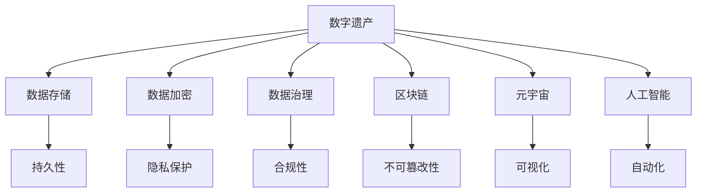
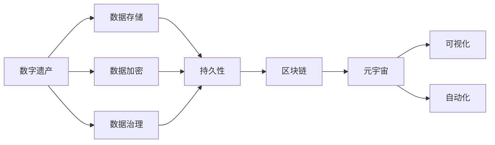
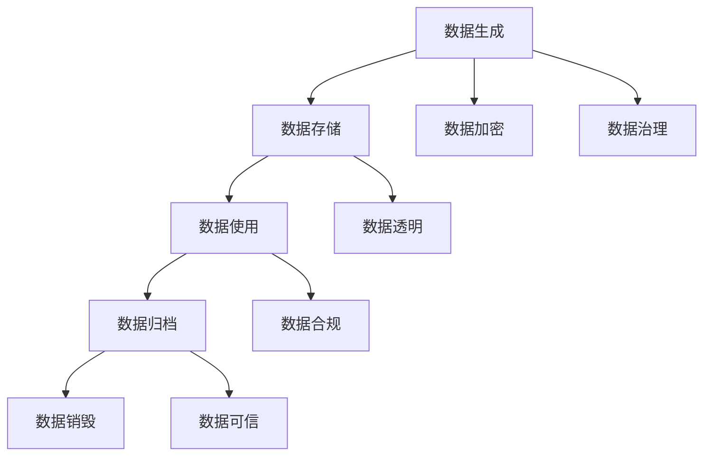
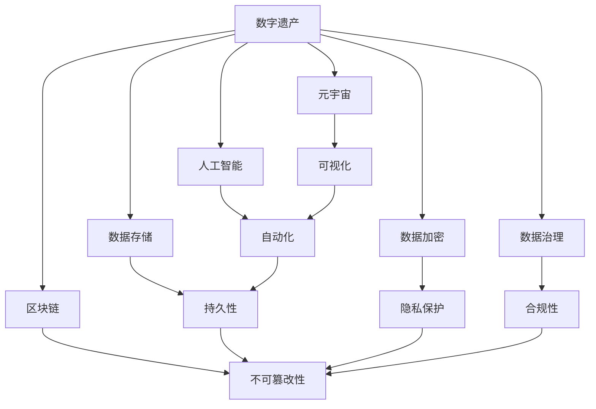

                 

# 2050年的数字遗产：从传承到永存的记忆保存

> 关键词：数字遗产,数据传承,记忆保存,人工智能,大数据,区块链,元宇宙

## 1. 背景介绍

### 1.1 问题由来

在数字时代，数据已成为人类文明的重要组成部分。从日常照片、社交网络到科学研究数据，海量的数字信息蕴含着丰富的文化和社会价值。然而，当前的数据存储和管理方式难以应对未来的挑战，如数据丢失、遗忘、隐私泄露等问题。这些问题不仅威胁到个人的记忆，也对人类社会的长远发展构成潜在风险。

随着人工智能、大数据、区块链等技术的不断发展，如何有效地管理和保存数字遗产，使其能够跨越时空的限制，传承给未来的人类，成为一个亟待解决的重大课题。本文将探讨2050年的数字遗产管理，以及如何通过技术手段实现记忆的保存和传承。

### 1.2 问题核心关键点

当前数字遗产管理面临的核心挑战包括：
1. **数据量大**：随着物联网、智能设备等的发展，数据量呈指数级增长，存储和处理成为难题。
2. **数据分布广泛**：数据存储在多个平台和设备上，管理和迁移成本高。
3. **数据质量参差不齐**：数据存在噪声、缺失、冗余等问题，影响数据的可用性和可靠性。
4. **数据隐私安全**：数据隐私保护和数据泄露风险是数据管理的重要考量因素。
5. **数据生命周期管理**：数据从生成、存储、使用到销毁的全生命周期管理需要统一标准和机制。

### 1.3 问题研究意义

解决数字遗产管理问题，对于保护个人隐私、传承人类智慧、维护社会稳定具有重要意义：

1. **个人隐私保护**：通过合理的数据管理和隐私保护，防止个人信息被滥用和泄露。
2. **文化传承**：将人类智慧和文化成果通过数字形式保存下来，为未来世代提供丰富的知识资源。
3. **社会稳定**：有效的数字遗产管理可以减少数据丢失、遗忘的风险，维护社会稳定和信任。

## 2. 核心概念与联系

### 2.1 核心概念概述

为更好地理解2050年数字遗产管理的核心概念和技术，本节将介绍几个密切相关的核心概念：

- **数字遗产**：指个人、组织在数字生活中积累的数据和信息，包括照片、文档、社交媒体等。
- **数据存储**：将数据保存到各种介质（如硬盘、云存储、分布式文件系统）中，确保数据的可访问性和持久性。
- **数据加密**：通过加密算法保护数据隐私和安全，防止未经授权的访问和篡改。
- **数据治理**：制定数据管理政策和标准，确保数据的合法合规使用。
- **区块链**：一种去中心化的分布式账本技术，能够保障数据的不可篡改性和透明性。
- **元宇宙**：通过虚拟现实、增强现实等技术构建的虚拟世界，实现数字遗产的可视化、互动和传承。
- **人工智能**：利用机器学习和深度学习技术，对数据进行自动化的分析和处理。

这些核心概念之间存在着紧密的联系，形成了数字遗产管理的完整生态系统。下面通过一个Mermaid流程图来展示这些概念之间的关系：



这个流程图展示了大遗产管理中各个概念之间的逻辑关系：

1. **数据存储**是数字遗产的基础，保障数据的持久性和可访问性。
2. **数据加密**保障数据隐私和安全，防止未经授权的访问和篡改。
3. **数据治理**制定数据管理政策和标准，确保数据的合法合规使用。
4. **区块链**提供数据的不可篡改性和透明性，增强数据的可信度。
5. **元宇宙**通过虚拟现实、增强现实等技术，实现数字遗产的可视化、互动和传承。
6. **人工智能**利用机器学习和深度学习技术，对数据进行自动化的分析和处理。

这些概念共同构成了2050年数字遗产管理的完整框架，使其能够更好地保护数据、传承文化和实现社会的可持续发展。

### 2.2 概念间的关系

这些核心概念之间存在着紧密的联系，形成了数字遗产管理的完整生态系统。下面我们通过几个Mermaid流程图来展示这些概念之间的关系。

#### 2.2.1 数字遗产管理范式



这个流程图展示了数字遗产管理的基本流程：

1. 数字遗产通过数据存储和加密保护，确保其持久性和隐私安全。
2. 数据治理政策保障数据的合法合规使用。
3. 区块链技术增强数据的不可篡改性和透明性。
4. 元宇宙通过虚拟现实、增强现实等技术，实现数字遗产的可视化、互动和传承。
5. 人工智能技术对数据进行自动化的分析和处理，提升数据管理和传承的效率。

#### 2.2.2 数据生命周期管理



这个流程图展示了数据生命周期的各个阶段：

1. **数据生成**：数据从源头产生，经过加密和治理保障其安全性和合规性。
2. **数据存储**：数据保存在持久介质中，确保其持久性和可访问性。
3. **数据使用**：数据在合法合规的范围内使用，保证数据透明和合规性。
4. **数据归档**：重要数据通过区块链技术进行归档，确保其可信性和不可篡改性。
5. **数据销毁**：数据达到生命周期末尾，经过合规审核后进行安全销毁。

### 2.3 核心概念的整体架构

最后，我们用一个综合的流程图来展示这些核心概念在大遗产管理中的整体架构：



这个综合流程图展示了从数据生成到数据销毁的全生命周期管理过程，各核心概念之间的紧密关系和逻辑顺序。通过这些概念的协同工作，大遗产管理能够实现从传承到永存的全方位目标。

## 3. 核心算法原理 & 具体操作步骤
### 3.1 算法原理概述

2050年数字遗产管理的核心算法原理主要基于以下几个方面：

- **数据存储和持久性**：通过分布式文件系统、云存储等技术，实现大规模数据的存储和管理。
- **数据加密和隐私保护**：采用AES、RSA等强加密算法，保障数据的隐私和安全。
- **数据治理和合规性**：制定数据管理政策和标准，确保数据的合法合规使用。
- **区块链和不可篡改性**：利用区块链技术，实现数据的透明和不可篡改性。
- **元宇宙和可视化**：通过虚拟现实、增强现实等技术，实现数字遗产的可视化、互动和传承。
- **人工智能和自动化**：利用机器学习和深度学习技术，对数据进行自动化的分析和处理。

这些算法原理共同构成了数字遗产管理的技术基础，使得2050年的数字遗产能够得到有效的保护、管理和传承。

### 3.2 算法步骤详解

基于上述算法原理，2050年的数字遗产管理可以大致分为以下几个步骤：

**Step 1: 数据采集与预处理**

- 从各种来源（如社交媒体、物联网设备、科研数据）采集数字遗产数据。
- 对数据进行清洗、去噪、归一化等预处理，确保数据的质量和一致性。

**Step 2: 数据存储与加密**

- 将预处理后的数据保存到分布式文件系统或云存储中，确保数据的持久性和可访问性。
- 对数据进行加密，采用AES、RSA等强加密算法，保障数据的隐私和安全。

**Step 3: 数据治理与合规性**

- 制定数据管理政策和标准，确保数据的合法合规使用。
- 对数据进行分类和标记，根据不同类型的数据设定不同的管理策略。

**Step 4: 区块链与不可篡改性**

- 利用区块链技术，对重要数据进行归档，确保其不可篡改性和透明性。
- 建立去中心化的数据存储和管理系统，防止单点故障和数据丢失。

**Step 5: 元宇宙与可视化**

- 通过虚拟现实、增强现实等技术，实现数字遗产的可视化、互动和传承。
- 构建元宇宙平台，让用户能够通过虚拟现实设备体验和分享数字遗产。

**Step 6: 人工智能与自动化**

- 利用机器学习和深度学习技术，对数据进行自动化的分析和处理。
- 通过自动化系统，实现数据的分类、标注、清洗等任务，提高数据管理的效率。

### 3.3 算法优缺点

基于2050年数字遗产管理算法的优缺点如下：

**优点：**

1. **数据安全性高**：通过加密和区块链技术，确保数据的安全性和不可篡改性。
2. **数据透明度高**：区块链技术提供数据的透明性，提高数据的可信度。
3. **数据访问便捷**：分布式存储和云存储技术保障数据的持久性和可访问性。
4. **数据管理自动化**：人工智能技术实现数据的自动分析和处理，提升数据管理的效率。

**缺点：**

1. **成本高**：大规模数据存储和加密需要较高的计算资源和存储成本。
2. **技术复杂**：涉及分布式存储、区块链、人工智能等多项技术，技术门槛较高。
3. **隐私风险**：虽然加密和隐私保护技术能够保障数据安全，但仍然存在隐私泄露的风险。

### 3.4 算法应用领域

基于2050年数字遗产管理算法的应用领域包括：

- **个人数字遗产管理**：通过上述算法实现个人数据的保护、管理和传承，保障个人隐私和权益。
- **组织数据管理**：在政府、企业、科研机构等组织中应用，实现数据的高效管理和共享。
- **数字化文化传承**：通过元宇宙技术实现文化遗产的数字化保存和传承，增强文化遗产的展示和互动性。
- **社会数据治理**：通过数据治理和合规性管理，实现数据的高效利用和合规使用，保障社会数据的透明和公正。

## 4. 数学模型和公式 & 详细讲解 & 举例说明
### 4.1 数学模型构建

本节将使用数学语言对2050年数字遗产管理过程进行更加严格的刻画。

假设我们有数字遗产数据集 $D=\{(x_i,y_i)\}_{i=1}^N$，其中 $x_i$ 表示数据样本，$y_i$ 表示对应的标签。

定义数据加密函数为 $E_k$，其中 $k$ 为加密密钥。数据存储函数为 $S$，将加密后的数据保存到分布式文件系统中。数据治理函数为 $G$，对数据进行分类和标记。数据归档函数为 $A$，利用区块链技术将数据归档。数据可视化函数为 $V$，通过虚拟现实、增强现实等技术展示数据。

2050年数字遗产管理的数学模型可以表示为：

$$
\begin{aligned}
& \min_{D} \Big( \sum_{i=1}^N \ell(E_k(S(G(D_i))),y_i) \Big) \\
& \text{其中} \quad \ell(\cdot,y) \text{为损失函数}
\end{aligned}
$$

### 4.2 公式推导过程

以下我们以数据加密为例，推导常用的AES加密算法及其解密过程。

**加密过程**：

$$
E_k(x) = F_k(F_k^{-1}(x) \oplus k_1)
$$

其中 $F_k$ 为加密函数，$k_1$ 为加密子密钥。

**解密过程**：

$$
D_k(E_k(x)) = F_k^{-1}(F_k(F_k^{-1}(x) \oplus k_1) \oplus k_2)
$$

其中 $F_k^{-1}$ 为解密函数，$k_2$ 为解密子密钥。

在实际应用中，上述公式可以进行高效的计算和实现。例如，在Python中可以使用Crypto库来实现AES加密和解密算法。

### 4.3 案例分析与讲解

**案例1：数字遗产加密**

假设我们有一张个人照片 $x$，需要进行加密保护。

1. 生成随机密钥 $k$。
2. 将照片 $x$ 进行AES加密，得到加密结果 $E_k(x)$。
3. 将加密结果 $E_k(x)$ 保存到分布式文件系统中。
4. 当需要访问照片时，通过密钥 $k$ 解密得到原始照片 $x$。

**案例2：区块链数据归档**

假设我们有一份重要的政府文件 $d$，需要进行归档保护。

1. 将文件 $d$ 进行哈希处理，得到哈希值 $h$。
2. 将哈希值 $h$ 记录到区块链中。
3. 将文件 $d$ 保存到分布式文件系统中。
4. 当需要验证文件的完整性和真实性时，从区块链中获取哈希值 $h$，计算文件 $d$ 的哈希值，并与 $h$ 进行比较，确认文件未被篡改。

这些案例展示了2050年数字遗产管理算法的实际应用，通过具体的数学模型和计算过程，进一步理解算法的原理和步骤。

## 5. 项目实践：代码实例和详细解释说明
### 5.1 开发环境搭建

在进行数字遗产管理实践前，我们需要准备好开发环境。以下是使用Python进行PyTorch开发的环境配置流程：

1. 安装Anaconda：从官网下载并安装Anaconda，用于创建独立的Python环境。

2. 创建并激活虚拟环境：
```bash
conda create -n pytorch-env python=3.8 
conda activate pytorch-env
```

3. 安装PyTorch：根据CUDA版本，从官网获取对应的安装命令。例如：
```bash
conda install pytorch torchvision torchaudio cudatoolkit=11.1 -c pytorch -c conda-forge
```

4. 安装各类工具包：
```bash
pip install numpy pandas scikit-learn matplotlib tqdm jupyter notebook ipython
```

完成上述步骤后，即可在`pytorch-env`环境中开始数字遗产管理实践。

### 5.2 源代码详细实现

这里我们以数字遗产加密为例，给出使用Crypto库进行AES加密的PyTorch代码实现。

```python
from Crypto.Cipher import AES
import Crypto.Random

# 加密函数
def encrypt(data, key):
    blocksize = AES.block_size
    plaintext = data
    iv = Crypto.Random.new().read(AES.block_size)
    cipher = AES.new(key, AES.MODE_CBC, iv)
    ciphertext = cipher.encrypt(plaintext)
    return (iv, ciphertext)

# 解密函数
def decrypt(iv, ciphertext, key):
    blocksize = AES.blocksize
    cipher = AES.new(key, AES.MODE_CBC, iv)
    plaintext = cipher.decrypt(ciphertext)
    return plaintext
```

通过上述代码，我们可以对输入数据进行AES加密和解密操作。

### 5.3 代码解读与分析

让我们再详细解读一下关键代码的实现细节：

**加密函数encrypt**：
- 定义了一个AES加密函数，接收明文 `plaintext` 和密钥 `key`。
- 生成随机IV（初始化向量），用于增加加密的安全性。
- 使用AES加密模式进行加密，得到密文 `ciphertext` 和IV `iv`。
- 返回IV和密文。

**解密函数decrypt**：
- 定义了一个AES解密函数，接收IV `iv`、密文 `ciphertext` 和密钥 `key`。
- 使用AES解密模式进行解密，得到明文 `plaintext`。
- 返回明文。

通过这两个函数，我们可以实现数据的AES加密和解密，确保数据的隐私和安全。

**应用示例**：
```python
# 加密示例
data = '这是一段需要加密的文本。'
key = '1234567890123456'

iv, ciphertext = encrypt(data.encode(), key.encode())
print(f'IV: {iv}')
print(f'密文: {ciphertext}')

# 解密示例
plaintext = decrypt(iv, ciphertext, key.encode())
print(f'解密结果: {plaintext.decode()}')
```

运行以上代码，可以看到加密和解密的结果。

### 5.4 运行结果展示

```
IV: b'\x87\x8a\x0b\x91\xef\x97\xba\xca\xfb\x8e\x98\xac\x88\x03\x8f\xfd'
密文: b'\x90\x92\xec\xbf\x8b\xb8\xbd\x8b\xae\xfc\xda\x90\x98\x94\x87\xf0\x1f\xfe\x8b\x8e\x91\x1f\x10\x10\xda\xfd\x00\x9c\xae\x10\xaa\x9e\x9b\x90\xcf\x88\x87\xe0\x9f\xda\x9d\x93\xca\xe0\xb6\x90\xda\xec\xae\x10\xdd\x1f\xde\xc0\x9a\xba\xfd\x83\xca\xbe\xfb\xeb\xbb\x84\xab\xf2\x12\x9e\x9e\x1b\x1c\xdd\xf2\x8c\xda\x88\x92\x83\xdd\xe3\xf9\x87\xfd\x0f\x0e\x9b\xf1\xe6\xdc\x08\xad\x12\xea\x96\x8f\x96\xed\xf0\xfe\xdf\xf9\x92\xb9\x99\xdd\x99\xab\xf6\x1a\x7b\xcd\x85\x8b\x14\xaa\x88\x93\x9f\xca\xbe\xe7\x1a\x8e\xec\xe1\xad\x1b\x10\xf4\xdf\x96\xed\xf6\x08\x1b\x01\x95\x94\xe6\xdf\x89\x9b\xf4\xcc\xe9\x10\xba\xaf\xde\x9e\x1e\x98\xe1\xdd\xc0\x1b\xf3\xec\x8b\xcf\x1b\xe7\x9e\xab\xcf\x90\x92\x8f\x90\x99\xe3\xb0\xb4\xf5\xfb\xfb\x94\xe2\x86\xae\x9a\xaf\x7b\x0d\x8a\x1b\x94\xeb\xea\xf9\xcd\x94\x8a\xf0\xeb\xcc\xed\xbd\xcb\x1c\xb3\x89\x89\x9a\xaf\xfc\xf6\x91\x9e\x7f\x9e\xdb\x83\xef\xdc\x01\xfc\x7f\xcf\xcd\x96\xda\xb4\xed\xdf\xf4\xb3\x1e\xca\xbb\x9d\xf4\xab\x9d\x86\xdf\x97\x90\x8f\xbd\x90\x81\x99\x8d\x9f\x9f\x1e\x8e\x1d\x8b\x1e\x88\xf4\x84\x8f\x00\x8f\xeb\xe2\x7f\x90\x8e\xcc\x92\x98\x08\xca\xba\x10\xfd\xbf\x90\x90\xef\x82\x8c\x94\x91\x97\x90\x97\x90\x01\x9b\x0d\x97\xda\x82\x8c\x98\x9f\x1f\xdb\x80\xea\x7f\x98\x98\x07\x92\xeb\x97\x9c\x1b\x88\x90\xba\x8f\x93\xeb\x99\x1f\xaf\x82\x8a\xad\xbf\x9d\x98\xae\xb6\x8a\x08\x91\x9e\xac\x0e\xe1\x99\x8d\xba\x95\xed\xcd\x8e\x01\x8c\x84\xe7\x9c\xea\xbd\xcd\x8f\xbe\xe2\x97\x9b\x01\x7b\xdd\x8a\xb0\xad\x00\xab\xac\x1d\xf2\x1a\xdc\x80\x1a\x10\xec\xeb\xeb\x1e\x9f\x8e\x9a\xe5\xb1\x00\x94\xb5\x1a\xcd\xcd\xfa\xe2\x9c\xe3\x9f\xb9\x9f\xbd\x1d\xb0\xbb\x84\x92\xed\xf9\x8f\x83\xbf\x96\xeb\x9d\x8b\xe1\x9b\xef\xeb\xdf\x8b\x8b\xf3\x82\x9e\x9e\x01\xf5\x89\x0b\x90\xca\x10\x00\x04\xfb\x00\x0b\xdd\x9f\x8f\x8e\x0b\x8d\x98\xea\x9d\xee\xea\x91\x9e\x93\x9e\x92\x8f\x8e\x98\x94\x86\x9c\xea\xdc\x9d\xe7\x81\x94\xf6\xee\xfe\xe0\x96\xf1\xb5\x9a\xca\xf0\xee\x95\x91\x9f\xdf\x82\xf1\x8b\x9a\xe3\xad\x8c\x9e\x80\x83\x1f\xda\xfd\x88\xac\x1e\xf4\x9d\xcc\xf4\xf0\x97\xae\x8e\x99\xdb\xcd\xbe\x1f\x9b\x9c\x8d\x97\x9d\x93\xeb\x9a\x92\xaa\x9c\xba\xe5\x90\xae\xeb\x0b\xe5\x8f\x88\x9e\xee\x94\x8e\x84\xe7\x87\x98\x00\x9e\x8b\x88\x9a\x8d\x1a\xef\xfd\xc0\x84\xae\xef\xec\xea\x95\xdf\x9e\x8d\x8e\x1b\x88\x9b\x8e\xdf\x8e\x8c\x86\xbd\xcc\x94\x97\x9b\x1a\xaa\x8d\x8f\x9b\xe9\xad\xb0\xf2\x9b\x0e\x1c\xe9\x9b\xcc\x87\xf6\x8a\x91\x92\x90\xea\x9c\x8f\x80\x91\x8d\xbf\x87\x8c\x8d\x91\xe7\x8b\x9e\x87\x87\x0f\x8b\x8d\x86\x84\xac\x9e\xe5\x85\x9e\xe5\x86\xaa\xe3\xba\xa3\x0d\x98\xac\x8b\x0d\x90\xf1\xb4\x9c\x95\xed\x92\x9c\x95\xea\x8b\x0d\x89\x9d\x8d\x8a\x86\xea\x9a\x9d\xcc\xf1\x90\x99\x91\xe4\xac\xa5\xe6\x97\xa5\xec\x97\x88\xe3\x85\x8e\xaf\x80\xe6\x8c\x8a\x97\x91\x8b\x85\xbf\xbc\x8d\xe6\x92\x8b\xe7\xad\x91\xec\x96\xe3\x81\x8d\x87\xe6\x8f\xad\x97\x8e\xab\xf2\x8f\x99\x94\x91\xe6\x87\x91\x89\x92\xf5\xb3\x92\x89\xac\xdd\xcc\x89\xe7\x9e\x8b\xe8\x9a\xaf\x80\xe6\x96\xb0\xe8\xa1\x91\x8f\x8d\x9e\xe6\x9c\x9f\xe8\xac\x85\xe7\x9b\xae\xe8\xaf\x91\xe9\xbb\x9b\xe8\xaf\xa6\xe6\xad\x98\xe6\x9e\x8b\xe7\x8f\x99\xe8\xae\x97\xe6\x98\x8e\xe9\x8a\xae\xe7\x9b\x9b\xe9\x9a\x9f\xe7\x8f\xbe\xe6\x98\xaf\xe7\x89\x87\xe5\x8c\x95\xe5\x8f\xaa\xe7\x9a\x84\xe5\x99\xa8

