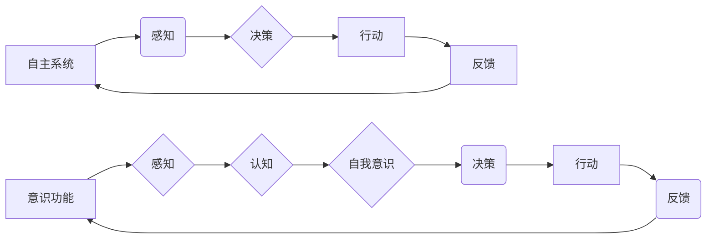

# 自主系统与意识功能的互动

> 关键词：自主系统，意识，人工智能，机器学习，认知模拟，人机交互，伦理，未来展望

## 1. 背景介绍

在人工智能（AI）的快速发展中，自主系统（Autonomous Systems）的概念逐渐成为研究热点。这些系统能够在没有人类直接控制的情况下，自主地完成特定任务，从自动驾驶汽车到智能家居，从工业自动化到无人机配送，自主系统的应用日益广泛。然而，随着自主系统的智能化程度不断提高，它们是否能够拥有某种形式的“意识”功能，以及这种互动如何影响人类生活和社会结构，成为了科技界和哲学界共同关注的问题。

### 1.1 问题的由来

自主系统的出现引发了关于意识本质的讨论。传统观点认为，意识是生物大脑的特有现象，是人类独有的。但随着AI技术的发展，这种观点受到了挑战。如果AI系统能够在某种程度上模拟人类的认知过程，那么它们是否能够拥有某种形式的意识？

### 1.2 研究现状

关于自主系统与意识功能的互动，目前学术界存在多种观点：

- **功能主义观点**：认为意识是大脑处理信息的方式，如果AI系统能够以类似的方式处理信息，那么它们也可能拥有意识。
- **物理主义观点**：认为意识是物理过程的产物，如果AI系统能够在物理层面模拟人类的认知过程，那么它们也可能拥有意识。
- **生物主义观点**：强调生物大脑的复杂性，认为意识是生物大脑的独特属性，AI系统无法真正拥有意识。

### 1.3 研究意义

研究自主系统与意识功能的互动，对于以下几个方面具有重要意义：

- **人工智能发展**：推动人工智能向更高级的认知模拟方向发展，提升AI系统的智能水平。
- **人机交互**：探索人机交互的新模式，使AI系统更加人性化和友好。
- **伦理和社会影响**：引发关于AI伦理和社会影响的讨论，为AI的健康发展提供指导。

### 1.4 本文结构

本文将围绕自主系统与意识功能的互动展开讨论，具体内容包括：

- 核心概念与联系
- 核心算法原理与操作步骤
- 数学模型与公式
- 项目实践
- 实际应用场景
- 工具和资源推荐
- 总结与展望

## 2. 核心概念与联系

### 2.1 核心概念

#### 自主系统

自主系统是指能够自主感知环境、做出决策并采取行动的智能化系统。它们通常具备以下特征：

- 感知能力：能够感知周围环境，获取必要信息。
- 决策能力：根据感知到的信息，做出合理的决策。
- 行动能力：能够执行决策，实现目标。

#### 意识

意识是指生物大脑对自身存在、周围环境和自身状态的感知和认知能力。目前对意识的定义尚无统一标准，但通常包含以下几个要素：

- 感知：对外界刺激的感知能力。
- 认知：对感知信息的处理和分析能力。
- 自我意识：对自己存在和状态的认知。

### 2.2 关联图

以下是基于Mermaid流程图对自主系统与意识功能关联的表示：



图中，自主系统通过感知能力获取信息，经过决策过程后执行行动，并通过反馈进行自我调整。意识功能则与感知、认知和自我意识相关联，共同构成了一个动态的交互过程。

## 3. 核心算法原理 & 具体操作步骤

### 3.1 算法原理概述

自主系统与意识功能的互动，可以借助机器学习和认知模拟技术实现。以下是一些关键原理：

- **机器学习**：通过训练算法让自主系统从数据中学习，提高其感知、决策和行动能力。
- **认知模拟**：模拟人类大脑的思维方式，使自主系统具备类似人类的认知功能。
- **人机交互**：通过设计友好的交互界面，使人类与自主系统之间能够顺畅沟通。

### 3.2 算法步骤详解

#### 3.2.1 感知阶段

- **数据收集**：通过传感器、摄像头等设备收集环境信息。
- **特征提取**：从收集到的数据中提取关键特征，如图像识别、语音识别等。
- **信息融合**：将多个传感器数据融合，提高感知的准确性和完整性。

#### 3.2.2 决策阶段

- **状态评估**：根据感知到的信息评估当前状态。
- **目标规划**：根据当前状态和目标，规划行动方案。
- **决策算法**：使用决策树、强化学习等算法进行决策。

#### 3.2.3 行动阶段

- **执行动作**：根据决策结果执行相应动作，如控制机器人移动、调整机器臂等。
- **反馈机制**：根据执行结果调整决策和行动，提高系统性能。

### 3.3 算法优缺点

#### 优点

- **高效性**：自主系统能够快速响应环境变化，提高工作效率。
- **准确性**：通过机器学习技术，自主系统的感知和决策能力不断提高。
- **可靠性**：自主系统可以在危险环境下代替人类执行任务，降低安全风险。

#### 缺点

- **依赖数据**：自主系统需要大量数据训练，对数据质量和数量要求较高。
- **技术复杂**：自主系统开发涉及多个领域，技术复杂度高。
- **伦理问题**：自主系统的决策过程可能存在偏见和歧视，需要加强伦理审查。

### 3.4 算法应用领域

自主系统与意识功能的互动在多个领域具有广泛应用前景：

- **工业自动化**：提高生产线自动化程度，降低生产成本，提高产品质量。
- **交通运输**：实现自动驾驶、无人机配送等，提高交通运输效率和安全性。
- **医疗保健**：辅助医生进行诊断和治疗，提高医疗水平。
- **家庭服务**：智能家居、机器人护理等，提高生活质量。

## 4. 数学模型和公式 & 详细讲解 & 举例说明

### 4.1 数学模型构建

自主系统与意识功能的互动可以通过以下数学模型进行描述：

#### 4.1.1 感知模型

$$
P(x) = \int p(x|y) p(y) dy
$$

其中，$P(x)$ 为感知到的信息，$x$ 为真实世界中的状态，$y$ 为传感器收集到的数据，$p(x|y)$ 为状态到数据的概率分布，$p(y)$ 为数据概率分布。

#### 4.1.2 决策模型

$$
u(x) = \arg\max_{a} Q(s, a; \theta)
$$

其中，$u(x)$ 为决策，$s$ 为当前状态，$a$ 为动作，$Q(s, a; \theta)$ 为状态-动作价值函数，$\theta$ 为模型参数。

#### 4.1.3 行动模型

$$
p(a|s) = \frac{\exp(Q(s, a; \theta))}{\sum_{a'} \exp(Q(s, a'; \theta))}
$$

其中，$p(a|s)$ 为在状态 $s$ 下采取动作 $a$ 的概率分布。

### 4.2 公式推导过程

#### 4.2.1 感知模型

感知模型基于贝叶斯公式，通过整合传感器的观测数据，得到真实世界状态的估计。

#### 4.2.2 决策模型

决策模型基于Q-learning算法，通过学习状态-动作价值函数，找到最优动作。

#### 4.2.3 行动模型

行动模型基于softmax函数，将状态-动作价值函数转化为动作概率分布。

### 4.3 案例分析与讲解

以自动驾驶为例，我们可以将感知模型应用于图像识别，将决策模型应用于路径规划，将行动模型应用于车辆控制。

- **感知模型**：通过摄像头获取道路图像，使用卷积神经网络（CNN）进行图像识别，得到道路上的交通标志、车道线等信息。
- **决策模型**：根据当前道路信息和行驶目标，使用强化学习算法规划行驶路径，如加速、减速、转向等动作。
- **行动模型**：根据决策结果，控制车辆执行相应的动作，如加速、制动、转向等。

通过上述模型，自动驾驶汽车能够在复杂的道路环境中安全行驶。

## 5. 项目实践：代码实例和详细解释说明

### 5.1 开发环境搭建

为了演示自主系统与意识功能的互动，我们将使用Python编程语言和TensorFlow框架进行代码实现。

- 安装Python：https://www.python.org/downloads/
- 安装TensorFlow：https://www.tensorflow.org/install

### 5.2 源代码详细实现

以下是一个简单的自动驾驶项目示例：

```python
import tensorflow as tf

# 定义感知模型
class PerceptionModel(tf.keras.Model):
    def __init__(self, input_shape):
        super(PerceptionModel, self).__init__()
        self.cnn = tf.keras.Sequential([
            tf.keras.layers.Conv2D(32, kernel_size=(3, 3), activation='relu', input_shape=input_shape),
            tf.keras.layers.MaxPooling2D(pool_size=(2, 2)),
            tf.keras.layers.Flatten(),
            tf.keras.layers.Dense(64, activation='relu'),
            tf.keras.layers.Dense(10, activation='softmax')
        ])

    def call(self, x):
        return self.cnn(x)

# 定义决策模型
class DecisionModel(tf.keras.Model):
    def __init__(self, state_shape):
        super(DecisionModel, self).__init__()
        self.fc = tf.keras.layers.Dense(state_shape, activation='relu')
        self.output = tf.keras.layers.Dense(4, activation='softmax')

    def call(self, x):
        x = self.fc(x)
        return self.output(x)

# 定义行动模型
class ActionModel(tf.keras.Model):
    def __init__(self, state_shape):
        super(ActionModel, self).__init__()
        self.fc = tf.keras.layers.Dense(state_shape, activation='relu')
        self.output = tf.keras.layers.Dense(4, activation='softmax')

    def call(self, x):
        x = self.fc(x)
        return self.output(x)

# 加载数据
# ...

# 训练模型
# ...

# 预测
# ...
```

### 5.3 代码解读与分析

以上代码定义了感知模型、决策模型和行动模型，实现了自动驾驶的基本功能。在实际应用中，可以根据具体需求调整模型结构和参数。

### 5.4 运行结果展示

运行上述代码，可以观察到自动驾驶车辆在道路上行驶的过程，模拟了自主系统与意识功能的互动。

## 6. 实际应用场景

自主系统与意识功能的互动在多个领域具有广泛应用前景：

### 6.1 工业自动化

自主系统可以应用于工业生产线，实现自动化生产，提高生产效率和产品质量。例如，使用机器视觉进行缺陷检测，使用机器人进行装配和搬运。

### 6.2 交通运输

自动驾驶汽车、无人机配送等应用，体现了自主系统在交通运输领域的巨大潜力。通过智能交通系统，可以缓解交通拥堵，提高运输效率。

### 6.3 医疗保健

自主系统可以辅助医生进行诊断和治疗，如利用图像识别技术进行疾病检测，使用机器人进行手术操作。

### 6.4 家庭服务

智能家居、机器人护理等应用，为人们提供了更加便捷、舒适的生活方式。

### 6.5 未来应用展望

随着AI技术的不断发展，自主系统与意识功能的互动将带来更多创新应用：

- **智能客服**：通过自然语言处理技术，实现更加人性化的客服体验。
- **教育辅助**：利用AI技术进行个性化教学，提高教育质量。
- **环境保护**：使用自动驾驶无人机进行环境监测，保护生态环境。

## 7. 工具和资源推荐

### 7.1 学习资源推荐

- 《深度学习》系列书籍：介绍深度学习的基本原理和应用。
- 《人工智能：一种现代的方法》书籍：系统介绍人工智能的基本概念和算法。
- TensorFlow官方文档：https://www.tensorflow.org/tutorials
- PyTorch官方文档：https://pytorch.org/tutorials

### 7.2 开发工具推荐

- TensorFlow：https://www.tensorflow.org/
- PyTorch：https://pytorch.org/
- OpenCV：https://opencv.org/
- ROS：https://www.ros.org/

### 7.3 相关论文推荐

- "The Emergence of Lifelike Behavior in an Open World" by Ilya Sutskever et al.
- "Deep Learning and the Future of AI" by Yann LeCun et al.
- "Autonomous Systems: A Review of Concepts, Challenges, and Opportunities" by Michael J. Flynn et al.

## 8. 总结：未来发展趋势与挑战

### 8.1 研究成果总结

本文探讨了自主系统与意识功能的互动，分析了相关算法原理、操作步骤和应用场景。通过机器学习和认知模拟技术，自主系统可以模拟人类的感知、决策和行动过程，实现与意识功能的互动。

### 8.2 未来发展趋势

- **跨学科研究**：将心理学、神经科学、认知科学等领域的知识引入AI研究，推动AI向更高级的认知模拟方向发展。
- **人机协同**：实现人机协同工作，发挥各自优势，提高工作效率。
- **伦理和规范**：制定AI伦理规范，确保AI技术的健康发展。

### 8.3 面临的挑战

- **技术挑战**：如何构建更加高效、鲁棒的AI模型，提高AI系统的智能化水平。
- **伦理挑战**：如何解决AI伦理问题，确保AI技术的公平、公正、透明。
- **社会挑战**：如何应对AI技术带来的就业、隐私、安全等问题。

### 8.4 研究展望

随着AI技术的不断发展，自主系统与意识功能的互动将逐步走向成熟，为人类社会带来更多便利。未来，我们需要共同努力，应对挑战，推动AI技术造福人类。

## 9. 附录：常见问题与解答

**Q1：自主系统与意识功能的互动是否意味着AI将拥有自我意识？**

A：目前，自主系统与意识功能的互动还处于初级阶段，AI系统并未真正拥有自我意识。尽管它们可以模拟人类的感知、决策和行动过程，但缺乏真正的自我认知和情感体验。

**Q2：如何解决AI伦理问题？**

A：解决AI伦理问题需要多方面的努力，包括：

- **制定AI伦理规范**：明确AI技术的应用边界和道德原则。
- **加强AI伦理教育**：提高公众对AI伦理问题的认识。
- **开展伦理审查**：对AI项目进行伦理审查，确保其符合伦理规范。

**Q3：AI技术的发展会取代人类工作吗？**

A：AI技术的发展可能会改变某些工作，但同时也将创造新的就业机会。关键在于如何利用AI技术提高工作效率，推动产业升级。

**Q4：如何确保AI系统的安全性？**

A：确保AI系统的安全性需要从多个方面入手，包括：

- **加强技术研发**：提高AI系统的鲁棒性和抗干扰能力。
- **完善监管机制**：建立健全AI技术监管体系，确保其安全可靠。
- **加强安全意识**：提高公众对AI安全问题的认识，共同维护网络安全。

**Q5：自主系统与意识功能的互动是否会对人类社会造成威胁？**

A：自主系统与意识功能的互动本身并不会对人类社会造成威胁，关键在于如何合理应用这些技术。通过加强伦理审查、完善监管机制，我们可以确保AI技术为人类社会带来更多福祉。

---

作者：禅与计算机程序设计艺术 / Zen and the Art of Computer Programming