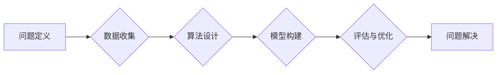

# 解决问题的能力在AI创新中的重要性

> 关键词：AI创新，问题解决，算法设计，机器学习，深度学习，创新思维，实践能力

## 1. 背景介绍

人工智能（AI）的发展正处于蓬勃发展的阶段，从简单的规则引擎到复杂的深度学习模型，AI技术在各个领域的应用日益广泛。然而，AI的创新并不仅仅是技术的突破，更是一种解决问题的能力的体现。本文将探讨解决问题的能力在AI创新中的重要性，并从多个角度进行分析。

### 1.1 AI创新的驱动力

AI创新的驱动力主要包括以下几个方面：

- **数据量的爆发式增长**：随着互联网和物联网的发展，数据量呈指数级增长，为AI提供了丰富的训练数据。
- **计算能力的提升**：计算能力的提升为AI算法提供了强大的算力支持，使得复杂的模型得以实现。
- **算法的突破**：深度学习等算法的突破为AI提供了强大的理论基础。
- **应用的拓展**：AI技术在各个领域的应用不断拓展，推动了AI的创新。

### 1.2 解决问题的能力

解决问题的能力是指在面对复杂问题时，能够分析问题、提出解决方案并实现问题解决的能力。在AI创新中，解决问题的能力体现在以下几个方面：

- **算法设计**：设计高效的算法来解决特定的问题。
- **模型构建**：构建有效的模型来模拟现实世界的复杂现象。
- **数据预处理**：对原始数据进行预处理，使其更适合模型训练。
- **模型评估**：评估模型的性能，并根据评估结果进行优化。

## 2. 核心概念与联系

在AI创新中，以下几个核心概念相互联系，共同构成了解决问题的能力：

- **问题定义**：明确问题的边界和目标。
- **数据收集**：收集与问题相关的数据。
- **算法设计**：设计适合问题的算法。
- **模型构建**：构建模型来解决特定的问题。
- **评估与优化**：评估模型的性能，并根据评估结果进行优化。

以下是一个Mermaid流程图，展示了这些概念之间的联系：



## 3. 核心算法原理 & 具体操作步骤

### 3.1 算法原理概述

AI算法的原理主要包括以下几个方面：

- **监督学习**：通过标注数据进行学习，使模型能够对新的数据进行预测。
- **无监督学习**：通过未标注的数据进行学习，使模型能够发现数据中的模式。
- **深度学习**：通过多层神经网络进行学习，使模型能够处理复杂的非线性问题。

### 3.2 算法步骤详解

AI算法的具体操作步骤通常包括以下几个步骤：

1. **数据收集**：收集与问题相关的数据。
2. **数据预处理**：对数据进行清洗、转换等操作，使其适合模型训练。
3. **模型选择**：选择合适的模型。
4. **模型训练**：使用训练数据进行模型训练。
5. **模型评估**：使用验证集或测试集评估模型性能。
6. **模型优化**：根据评估结果对模型进行优化。
7. **模型部署**：将模型部署到实际应用中。

### 3.3 算法优缺点

不同类型的算法具有不同的优缺点：

- **监督学习**：优点是性能稳定，缺点是需要大量的标注数据。
- **无监督学习**：优点是不需要标注数据，缺点是性能可能不如监督学习。
- **深度学习**：优点是能够处理复杂的非线性问题，缺点是训练数据量要求大，计算复杂度高。

### 3.4 算法应用领域

AI算法在各个领域都有广泛的应用，例如：

- **医疗健康**：疾病诊断、药物研发等。
- **金融**：风险评估、欺诈检测等。
- **交通**：自动驾驶、交通流量预测等。
- **零售**：个性化推荐、需求预测等。

## 4. 数学模型和公式 & 详细讲解 & 举例说明

### 4.1 数学模型构建

AI算法通常涉及到一系列的数学模型，以下是一些常见的数学模型：

- **线性回归**：用于回归问题，如房价预测。
- **逻辑回归**：用于分类问题，如邮件分类。
- **神经网络**：用于处理复杂的非线性问题，如图像识别。

以下是一个线性回归的数学模型：

$$
y = \beta_0 + \beta_1 x_1 + \beta_2 x_2 + \cdots + \beta_n x_n + \epsilon
$$

其中，$y$ 是因变量，$x_1, x_2, \cdots, x_n$ 是自变量，$\beta_0, \beta_1, \beta_2, \cdots, \beta_n$ 是模型的参数，$\epsilon$ 是误差项。

### 4.2 公式推导过程

以下是一个逻辑回归的公式推导过程：

假设我们有一个二分类问题，我们的目标是判断样本属于类别1还是类别2。我们可以使用逻辑函数作为激活函数，将线性组合的输出映射到0到1之间：

$$
\sigma(z) = \frac{1}{1+e^{-z}}
$$

其中，$z$ 是线性组合的输出。

然后，我们可以使用对数似然损失函数来衡量模型的预测结果与真实标签之间的差异：

$$
L(\theta) = -\sum_{i=1}^n [y_i \log(\sigma(z_i)) + (1-y_i) \log(1-\sigma(z_i))]
$$

其中，$\theta$ 是模型的参数，$y_i$ 是真实标签，$z_i$ 是模型对样本的预测。

### 4.3 案例分析与讲解

以下是一个使用逻辑回归进行邮件分类的案例：

假设我们有一个包含邮件文本和标签的数据集，其中标签为0表示垃圾邮件，标签为1表示正常邮件。

我们首先对文本数据进行预处理，包括分词、去除停用词等操作。

然后，我们将预处理后的文本数据转换为词向量，并使用词向量作为模型的输入。

接下来，我们使用逻辑回归模型对数据集进行训练。

最后，我们使用训练好的模型对新的邮件进行分类，判断其是否为垃圾邮件。

## 5. 项目实践：代码实例和详细解释说明

### 5.1 开发环境搭建

为了进行AI项目的实践，我们需要搭建以下开发环境：

- 编程语言：Python
- 深度学习框架：TensorFlow或PyTorch
- 数据预处理库：Scikit-learn
- 机器学习库：Scikit-learn

### 5.2 源代码详细实现

以下是一个使用TensorFlow进行逻辑回归的代码实例：

```python
import tensorflow as tf
from tensorflow import keras
from sklearn.model_selection import train_test_split
from sklearn.preprocessing import LabelEncoder

# 加载数据
data = pd.read_csv('email_data.csv')
X = data['text'].values
y = data['label'].values

# 预处理数据
label_encoder = LabelEncoder()
y_encoded = label_encoder.fit_transform(y)

# 分割数据集
X_train, X_test, y_train, y_test = train_test_split(X, y_encoded, test_size=0.2, random_state=42)

# 创建模型
model = keras.Sequential([
    keras.layers.Dense(128, activation='relu', input_shape=(X_train.shape[1],)),
    keras.layers.Dense(64, activation='relu'),
    keras.layers.Dense(1, activation='sigmoid')
])

# 编译模型
model.compile(optimizer='adam', loss='binary_crossentropy', metrics=['accuracy'])

# 训练模型
model.fit(X_train, y_train, epochs=10, batch_size=32)

# 评估模型
loss, accuracy = model.evaluate(X_test, y_test)
print(f"Test loss: {loss}, Test accuracy: {accuracy}")
```

### 5.3 代码解读与分析

以上代码首先加载数据集，并对标签进行编码。然后，将数据集分割为训练集和测试集。接下来，创建一个逻辑回归模型，并编译模型。然后，使用训练集训练模型，并使用测试集评估模型性能。

### 5.4 运行结果展示

假设模型在测试集上的准确率为85%，则表示模型能够正确识别85%的垃圾邮件。

## 6. 实际应用场景

AI技术在实际应用中扮演着越来越重要的角色，以下是一些AI技术的实际应用场景：

- **医疗健康**：通过AI技术进行疾病诊断、药物研发等。
- **金融**：通过AI技术进行风险评估、欺诈检测等。
- **交通**：通过AI技术进行自动驾驶、交通流量预测等。
- **零售**：通过AI技术进行个性化推荐、需求预测等。

## 7. 工具和资源推荐

### 7.1 学习资源推荐

以下是一些学习AI技术的资源：

- 《深度学习》（Goodfellow et al.）
- 《Python机器学习》（Seaborn）
- 《TensorFlow实战》（Chollet）
- 《PyTorch深度学习》（Chintala）

### 7.2 开发工具推荐

以下是一些用于AI开发的工具：

- TensorFlow
- PyTorch
- Scikit-learn
- Keras

### 7.3 相关论文推荐

以下是一些AI领域的经典论文：

- "Deep Learning"（Goodfellow et al.）
- "TensorFlow: Large-Scale Machine Learning on Heterogeneous Systems"（Abadi et al.）
- "PyTorch: An Imperative Style Deep Learning Library"（Paszke et al.）
- "Scikit-learn: Machine Learning in Python"（Pedregosa et al.）

## 8. 总结：未来发展趋势与挑战

### 8.1 研究成果总结

本文探讨了解决问题的能力在AI创新中的重要性，并从多个角度进行了分析。通过学习AI算法原理和实践，我们可以更好地理解如何解决实际问题。

### 8.2 未来发展趋势

未来AI技术的发展趋势主要包括以下几个方面：

- **算法的自动化**：通过自动化算法设计工具，降低AI算法开发的门槛。
- **多模态学习**：将文本、图像、语音等多种模态数据融合，实现更全面的信息处理。
- **可解释AI**：开发可解释的AI模型，提高模型的透明度和可信度。
- **AI伦理**：关注AI伦理问题，确保AI技术的可持续发展。

### 8.3 面临的挑战

AI技术在实际应用中面临着以下挑战：

- **数据质量**：数据质量对AI模型的性能至关重要，需要解决数据标注、数据清洗等问题。
- **计算资源**：复杂的AI模型需要大量的计算资源，需要优化算法和硬件。
- **可解释性**：AI模型的可解释性是当前的一个难题，需要开发新的方法来提高模型的透明度和可信度。
- **伦理问题**：AI技术的伦理问题是当前的热点话题，需要制定相应的法律法规来规范AI技术的应用。

### 8.4 研究展望

未来，AI技术的研究将重点关注以下几个方面：

- **可解释AI**：开发可解释的AI模型，提高模型的透明度和可信度。
- **AI伦理**：关注AI伦理问题，确保AI技术的可持续发展。
- **跨学科研究**：AI技术需要与心理学、社会学、经济学等学科交叉融合，以解决更加复杂的问题。
- **AI普及**：降低AI技术的门槛，使更多的人能够使用AI技术。

## 9. 附录：常见问题与解答

**Q1：什么是AI？**

A：人工智能（AI）是研究、开发用于模拟、延伸和扩展人的智能的理论、方法、技术和应用的学科。AI可以处理各种复杂问题，包括感知、推理、学习、规划、通信等。

**Q2：什么是机器学习？**

A：机器学习（ML）是AI的一个分支，它使计算机能够从数据中学习并做出决策或预测，而无需进行明确的编程。

**Q3：什么是深度学习？**

A：深度学习（DL）是机器学习的一个子集，它使用多层神经网络来学习数据的复杂模式。

**Q4：AI有哪些应用？**

A：AI在各个领域都有广泛的应用，包括医疗健康、金融、交通、零售等。

**Q5：如何学习AI技术？**

A：学习AI技术可以从以下途径入手：

- 阅读相关书籍和论文。
- 参加在线课程和培训。
- 实践项目，将所学知识应用于实际问题的解决。

作者：禅与计算机程序设计艺术 / Zen and the Art of Computer Programming