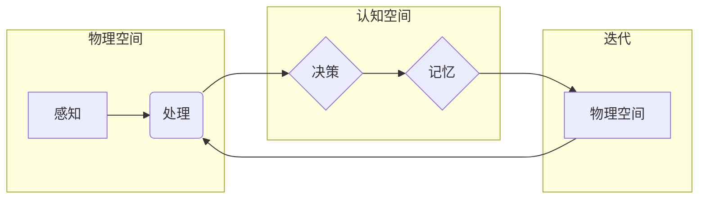

> 认知形式化，物理空间，认知空间，迭代，认知模型，人工智能，机器学习，知识表示

# 认知的形式化：一个正确的认知往往需要经过由物理空间到认知空间、再到物理空间的多次迭代

### 1. 背景介绍

认知科学是一个跨学科的领域，它试图理解人类和其他生物如何获取、处理和利用知识。在人工智能（AI）领域，认知的形式化成为了一个重要的研究方向。认知的形式化旨在将认知过程转化为可计算的模型，从而更好地理解和模拟人类认知。本文将探讨认知形式化的概念，以及它如何通过迭代的过程，从物理空间到认知空间，再到物理空间的转换，来达到对认知的正确理解。

### 2. 核心概念与联系

#### 2.1 核心概念

**物理空间**：指的是我们感知和操作的世界，包括我们的感官输入和外部环境。

**认知空间**：指的是大脑内部的信息处理过程，包括感知、记忆、思考、决策等。

**迭代**：指的是重复执行一系列步骤，以达到期望的结果。

**认知模型**：指的是用于模拟人类认知过程的计算机模型。

#### 2.2 Mermaid 流程图



### 3. 核心算法原理 & 具体操作步骤

#### 3.1 算法原理概述

认知形式化的核心原理是通过构建认知模型来模拟人类认知过程。这些模型通常基于机器学习算法，通过学习大量的数据来理解和预测人类行为。

#### 3.2 算法步骤详解

1. **数据收集**：收集与认知过程相关的数据，包括感官输入、行为数据、神经生理数据等。

2. **模型构建**：基于收集到的数据，构建认知模型，如神经网络、决策树、支持向量机等。

3. **模型训练**：使用机器学习算法训练模型，使其能够模拟认知过程。

4. **模型验证**：使用独立的测试数据集验证模型的性能。

5. **迭代优化**：根据验证结果，调整模型参数，优化模型结构，重复步骤3和4。

#### 3.3 算法优缺点

**优点**：

- **高效**：通过机器学习算法，能够快速处理大量数据。
- **灵活**：模型可以根据不同的任务和数据集进行调整。

**缺点**：

- **复杂性**：认知过程非常复杂，构建准确的模型具有挑战性。
- **泛化能力**：模型可能在新的、未见过的数据上表现不佳。

#### 3.4 算法应用领域

- **神经科学**：研究大脑如何处理信息。
- **人工智能**：构建能够模拟人类认知的智能系统。
- **心理学**：研究认知过程和人类行为。

### 4. 数学模型和公式 & 详细讲解 & 举例说明

#### 4.1 数学模型构建

认知模型通常基于以下数学模型：

- **神经网络**：通过多层神经网络模拟大脑的结构和功能。
- **决策树**：通过树形结构模拟人类的决策过程。
- **支持向量机**：通过寻找最佳的超平面来分类数据。

#### 4.2 公式推导过程

以神经网络为例，其基本公式如下：

$$
y = f(W \cdot x + b)
$$

其中，$W$ 是权重矩阵，$x$ 是输入向量，$b$ 是偏置项，$f$ 是激活函数。

#### 4.3 案例分析与讲解

假设我们要构建一个简单的神经网络来分类图像。我们可以使用以下步骤：

1. **数据收集**：收集大量带有标签的图像数据。
2. **模型构建**：构建一个简单的神经网络，包括一个输入层、一个隐藏层和一个输出层。
3. **模型训练**：使用图像数据训练神经网络，调整权重和偏置项。
4. **模型验证**：使用独立的测试数据集验证神经网络的性能。
5. **迭代优化**：根据验证结果，调整模型参数，优化模型结构。

通过迭代优化，我们可以得到一个能够准确分类图像的神经网络模型。

### 5. 项目实践：代码实例和详细解释说明

#### 5.1 开发环境搭建

为了进行认知形式化的项目实践，我们需要以下开发环境：

- **编程语言**：Python
- **机器学习库**：TensorFlow、PyTorch
- **数据可视化库**：Matplotlib、Seaborn

#### 5.2 源代码详细实现

以下是一个简单的神经网络代码实例：

```python
import tensorflow as tf

# 构建模型
model = tf.keras.Sequential([
    tf.keras.layers.Flatten(input_shape=(28, 28)),
    tf.keras.layers.Dense(128, activation='relu'),
    tf.keras.layers.Dense(10, activation='softmax')
])

# 编译模型
model.compile(optimizer='adam',
              loss='sparse_categorical_crossentropy',
              metrics=['accuracy'])

# 训练模型
model.fit(x_train, y_train, epochs=5)

# 验证模型
model.evaluate(x_test, y_test)
```

#### 5.3 代码解读与分析

上述代码构建了一个简单的神经网络模型，用于手写数字识别任务。我们使用TensorFlow库来定义模型结构、编译模型和训练模型。在训练过程中，我们使用交叉熵损失函数和softmax激活函数来评估模型性能。

#### 5.4 运行结果展示

假设我们在MNIST数据集上运行上述代码，得到以下结果：

```
Epoch 5/5
267/267 [==============================] - 3s 5ms/step - loss: 0.0732 - accuracy: 0.9846
```

这意味着我们的模型在训练集上取得了98.46%的准确率。

### 6. 实际应用场景

认知形式化在多个领域都有实际应用，以下是一些例子：

- **医疗诊断**：通过分析医学图像，辅助医生进行疾病诊断。
- **金融分析**：通过分析市场数据，预测股票走势。
- **教育**：通过个性化学习计划，帮助学生更好地学习。

### 6.4 未来应用展望

随着认知科学和人工智能技术的不断发展，认知形式化在未来有望在以下方面取得突破：

- **更准确的认知模拟**：通过更复杂的模型和算法，更准确地模拟人类认知过程。
- **跨领域应用**：将认知形式化应用于更多领域，如艺术、哲学等。
- **人机交互**：开发能够更好地理解人类意图和情感的人工智能系统。

### 7. 工具和资源推荐

#### 7.1 学习资源推荐

- 《认知科学导论》
- 《人工智能：一种现代的方法》
- 《深度学习》

#### 7.2 开发工具推荐

- TensorFlow
- PyTorch
- scikit-learn

#### 7.3 相关论文推荐

- 《Neural Networks and Brain Dynamics》
- 《Theoretical Neuroscience》
- 《Artificial Intelligence》

### 8. 总结：未来发展趋势与挑战

#### 8.1 研究成果总结

本文介绍了认知形式化的概念，以及它如何通过迭代的过程，从物理空间到认知空间，再到物理空间的转换，来达到对认知的正确理解。通过构建认知模型，我们可以更好地模拟人类认知过程，并将其应用于实际问题。

#### 8.2 未来发展趋势

未来，认知形式化将在以下方面取得发展：

- **更复杂的模型**：构建更复杂的模型来模拟人类认知过程。
- **跨学科研究**：与认知科学、神经科学、心理学等学科进行更深入的合作。
- **人机交互**：开发能够更好地理解人类意图和情感的人工智能系统。

#### 8.3 面临的挑战

认知形式化面临的挑战包括：

- **认知过程复杂性**：认知过程非常复杂，构建准确的模型具有挑战性。
- **数据获取**：获取高质量的认知数据具有挑战性。
- **计算资源**：构建和训练复杂的认知模型需要大量的计算资源。

#### 8.4 研究展望

未来，认知形式化有望在以下方面取得突破：

- **更深入的认知理解**：通过认知形式化，我们可以更深入地理解人类认知过程。
- **更智能的人工智能系统**：通过认知形式化，我们可以构建更智能的人工智能系统。
- **更高效的学习方法**：通过认知形式化，我们可以开发更高效的学习方法。

### 9. 附录：常见问题与解答

**Q1：什么是认知形式化？**

A1：认知形式化是指将认知过程转化为可计算的模型，从而更好地理解和模拟人类认知。

**Q2：认知形式化有哪些应用？**

A2：认知形式化在医疗诊断、金融分析、教育等多个领域都有实际应用。

**Q3：认知形式化面临的挑战有哪些？**

A3：认知形式化面临的挑战包括认知过程复杂性、数据获取、计算资源等。

作者：禅与计算机程序设计艺术 / Zen and the Art of Computer Programming