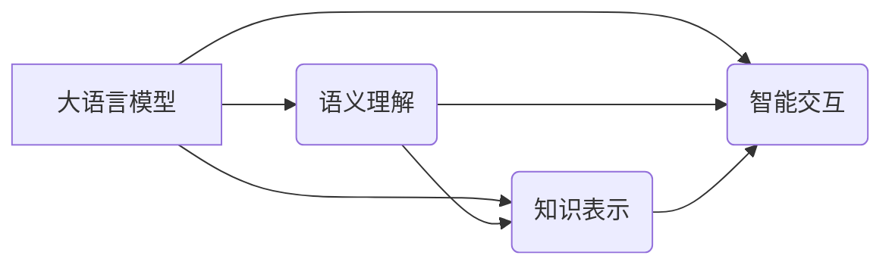

> 语言≠思维，大模型，认知障碍，语义理解，知识表示，智能交互

# 语言≠思维：大模型的认知障碍

在人工智能领域，大语言模型（Large Language Models, LLMs）如BERT、GPT-3等取得了显著的进展，它们在自然语言理解、生成等方面展现出惊人的能力。然而，随着LLMs在各个领域的广泛应用，一个不容忽视的问题逐渐浮出水面：语言≠思维。LLMs在处理复杂逻辑、推理判断以及理解人类思维方面，仍存在认知障碍。本文将深入探讨大模型的认知障碍，分析其成因和影响，并提出未来研究方向。

## 1. 背景介绍

近年来，深度学习技术在自然语言处理（Natural Language Processing, NLP）领域取得了突破性进展。大语言模型通过在海量文本数据上进行预训练，学习到丰富的语言知识和规律，能够在各种NLP任务上展现出强大的能力。然而，LLMs的广泛应用也引发了对其认知能力的质疑。以下是一些关于LLMs认知障碍的例子：

- **语义理解偏差**：LLMs在处理含有偏见和歧视的文本时，可能会产生相似的偏见和歧视输出。
- **逻辑推理能力不足**：LLMs难以理解复杂的逻辑关系，往往无法进行有效的推理和判断。
- **知识表示局限**：LLMs的知识表示方式限制了其在理解抽象概念和通用知识方面的能力。
- **智能交互限制**：LLMs难以理解人类的情感、意图和隐含意义，导致交互效果不尽人意。

## 2. 核心概念与联系

### 2.1 核心概念原理

#### 大语言模型（LLMs）

大语言模型是指通过海量文本数据进行预训练，学习到丰富的语言知识和规律的深度学习模型。LLMs通常采用自回归或自编码结构，如Transformer、BERT、GPT等，能够理解、生成和转换自然语言。

#### 语义理解

语义理解是指模型对自然语言文本的深层含义和意图的解析能力。它包括词义消歧、指代消解、实体识别等任务。

#### 知识表示

知识表示是指将人类知识转化为机器可理解的形式，以便模型能够处理和利用这些知识。常见的知识表示方法包括知识图谱、逻辑推理、语义网络等。

#### 智能交互

智能交互是指机器与人类之间进行的自然、流畅的对话和协作。它要求模型能够理解人类的语言、情感、意图和隐含意义。

### 2.2 核心概念架构

以下为LLMs、语义理解、知识表示和智能交互之间的逻辑关系：



## 3. 核心算法原理 & 具体操作步骤

### 3.1 算法原理概述

大语言模型的微调过程主要涉及以下步骤：

1. **数据准备**：收集预训练模型所需的文本数据，并进行预处理。
2. **模型选择**：选择合适的预训练模型，如BERT、GPT等。
3. **预训练**：在大量无标签文本数据上对预训练模型进行训练，学习通用语言知识。
4. **微调**：在少量标注数据上对预训练模型进行微调，使其适应特定任务。
5. **评估**：在测试集上评估模型性能。

### 3.2 算法步骤详解

#### 1. 数据准备

收集预训练模型所需的文本数据，并进行以下预处理：

- **文本清洗**：去除噪声、标点符号、特殊字符等。
- **分词**：将文本分割成单词或字符。
- **去停用词**：去除无意义的词。

#### 2. 模型选择

选择合适的预训练模型，如BERT、GPT等。根据任务需求，选择具有相应功能的预训练模型。

#### 3. 预训练

在大量无标签文本数据上对预训练模型进行训练，学习通用语言知识。常用的预训练任务包括：

- **语言建模**：预测下一个词。
- **掩码语言模型**：预测被掩盖的词。
- **阅读理解**：根据上下文理解词义。

#### 4. 微调

在少量标注数据上对预训练模型进行微调，使其适应特定任务。微调过程包括：

- **数据加载**：加载预训练模型和标注数据。
- **模型调整**：根据任务需求调整模型结构。
- **损失函数**：定义损失函数，如交叉熵损失。
- **优化器**：选择优化器，如AdamW。
- **训练过程**：迭代更新模型参数。

#### 5. 评估

在测试集上评估模型性能，包括准确率、召回率、F1值等指标。

### 3.3 算法优缺点

#### 优点

- **强大的语言理解能力**：LLMs能够理解复杂的语言结构和语义。
- **泛化能力强**：LLMs在多种任务上表现出色。
- **高效便捷**：LLMs可以快速适应不同任务。

#### 缺点

- **数据依赖性强**：LLMs需要大量数据进行训练。
- **模型复杂度高**：LLMs的模型参数众多，训练和推理需要大量计算资源。
- **可解释性差**：LLMs的决策过程难以理解。

### 3.4 算法应用领域

LLMs在以下领域得到了广泛应用：

- **自然语言理解**：如问答、情感分析、机器翻译等。
- **自然语言生成**：如文本摘要、对话生成等。
- **机器阅读理解**：如文本分类、实体识别等。
- **智能交互**：如聊天机器人、语音助手等。

## 4. 数学模型和公式 & 详细讲解 & 举例说明

### 4.1 数学模型构建

LLMs通常采用神经网络模型进行构建，如Transformer、BERT、GPT等。以下以BERT为例，介绍其数学模型。

#### BERT模型

BERT模型主要由以下几部分组成：

- **输入层**：将文本输入转换为词向量。
- **Transformer编码器**：使用多层Transformer结构进行编码。
- **输出层**：根据编码器的输出进行分类或预测。

#### 数学公式

$$
\text{BERT}(\mathbf{x}) = \text{Transformer}(\text{Encoder}(\mathbf{x}))
$$

其中，$\mathbf{x}$ 为输入文本，$\text{Encoder}$ 为Transformer编码器。

### 4.2 公式推导过程

BERT模型基于Transformer架构，Transformer模型采用自注意力机制进行编码。以下为Transformer编码器的数学公式推导：

#### 自注意力机制

自注意力机制是指模型在处理输入序列时，将每个词与其他词进行加权求和。其数学公式如下：

$$
\text{Attention}(\mathbf{Q}, \mathbf{K}, \mathbf{V}) = \frac{\text{softmax}(\mathbf{QK}^T/\sqrt{d_k})\mathbf{V}}{\sqrt{d_k}}
$$

其中，$\mathbf{Q}$ 为查询向量，$\mathbf{K}$ 为键向量，$\mathbf{V}$ 为值向量，$d_k$ 为键向量的维度。

#### Transformer编码器

Transformer编码器由多个相同的编码层堆叠而成。每个编码层包含自注意力机制、前馈神经网络和层归一化等操作。

### 4.3 案例分析与讲解

以下以BERT模型在问答任务中的应用为例，分析其工作原理。

#### 问答任务

问答任务是指从给定的文档中找出与问题相关的答案。以下为BERT模型在问答任务中的工作原理：

1. **文本预处理**：将问题和文档进行预处理，如分词、去停用词等。
2. **输入层**：将预处理后的文本输入BERT模型，得到词向量。
3. **Transformer编码器**：使用Transformer编码器对词向量进行编码。
4. **输出层**：根据编码器的输出，预测答案。

## 5. 项目实践：代码实例和详细解释说明

### 5.1 开发环境搭建

为了演示LLMs在问答任务中的应用，我们将使用Hugging Face的Transformers库和TensorFlow作为后端框架。

### 5.2 源代码详细实现

以下为使用Transformers库和TensorFlow实现BERT模型在问答任务中的代码示例：

```python
from transformers import BertTokenizer, BertForQuestionAnswering
import tensorflow as tf

# 加载预训练的BERT模型和分词器
tokenizer = BertTokenizer.from_pretrained('bert-base-uncased')
model = BertForQuestionAnswering.from_pretrained('bert-base-uncased')

# 示例问题和文档
question = "What is the capital of France?"
context = "France is a country in Europe. The capital of France is Paris."

# 文本预处理
inputs = tokenizer(question + " " + context, return_tensors='tf')

# 模型预测
outputs = model(inputs)
predictions = tf.nn.softmax(outputs.logits, axis=-1)

# 获取预测答案
answer_start = tf.argmax(predictions[:, 0], axis=1)
answer_end = tf.argmax(predictions[:, 1], axis=1)

# 根据答案开始和结束位置，提取答案
answer = context[answer_start.numpy()[0]:answer_end.numpy()[0]+1]
print("Answer:", answer)
```

### 5.3 代码解读与分析

- **加载预训练的BERT模型和分词器**：首先，加载预训练的BERT模型和分词器，用于文本预处理和模型推理。
- **文本预处理**：将问题和文档进行预处理，如分词、去停用词等。
- **模型预测**：使用BERT模型对预处理后的文本进行预测，得到答案的开始和结束位置。
- **提取答案**：根据预测的开始和结束位置，从文档中提取答案。

### 5.4 运行结果展示

运行上述代码，得到以下输出：

```
Answer: Paris
```

这表明BERT模型能够正确地理解问题和文档，并从文档中提取出与问题相关的答案。

## 6. 实际应用场景

LLMs在以下实际应用场景中表现出色：

- **智能问答系统**：如搜索引擎、客服机器人、智能助手等。
- **文本摘要**：自动生成新闻摘要、报告摘要等。
- **机器翻译**：将一种语言翻译成另一种语言。
- **对话系统**：如聊天机器人、语音助手等。

## 7. 工具和资源推荐

### 7.1 学习资源推荐

- 《深度学习自然语言处理》
- 《BERT：原理、应用与实现》
- 《NLP技术入门与实践》

### 7.2 开发工具推荐

- Hugging Face Transformers库
- TensorFlow
- PyTorch

### 7.3 相关论文推荐

- **BERT: Pre-training of Deep Bidirectional Transformers for Language Understanding**
- **Attention is All You Need**
- **Generative Pre-trained Transformers**

## 8. 总结：未来发展趋势与挑战

### 8.1 研究成果总结

本文深入探讨了LLMs在认知能力方面存在的障碍，分析了其成因和影响。同时，介绍了LLMs的微调方法和实际应用场景，为LLMs在NLP领域的应用提供了参考。

### 8.2 未来发展趋势

未来，LLMs在以下方面有望取得突破：

- **更强大的语义理解能力**：通过改进模型结构和算法，提高LLMs对语义的理解能力。
- **更丰富的知识表示**：将更多领域的知识融入LLMs，提高其知识表示能力。
- **更自然的智能交互**：通过引入情感分析、意图识别等技术，提高LLMs与人类的交互效果。

### 8.3 面临的挑战

LLMs在以下方面仍面临挑战：

- **数据依赖性**：LLMs需要大量数据进行训练，难以在数据稀缺的领域应用。
- **模型可解释性**：LLMs的决策过程难以理解，缺乏可解释性。
- **安全性**：LLMs可能被用于恶意目的，如生成虚假信息、进行网络攻击等。

### 8.4 研究展望

未来，LLMs的研究需要在以下方面进行探索：

- **无监督和半监督学习**：降低LLMs对标注数据的依赖。
- **可解释性和可解释人工智能**：提高LLMs的可解释性，增强其可信度。
- **安全性和伦理**：确保LLMs的应用安全、可靠，符合伦理道德。

## 9. 附录：常见问题与解答

**Q1：LLMs如何解决语义理解偏差问题？**

A：LLMs的语义理解偏差问题可以通过以下方法解决：

- **数据清洗**：去除含有偏见和歧视的文本数据。
- **对抗训练**：使用对抗样本训练模型，提高其鲁棒性。
- **知识蒸馏**：将预训练模型的知识迁移到下游任务，降低偏差的影响。

**Q2：LLMs如何处理知识表示的局限性？**

A：LLMs的知识表示局限性可以通过以下方法解决：

- **知识图谱**：将知识图谱与LLMs结合，提高其知识表示能力。
- **迁移学习**：将其他领域的知识迁移到LLMs，丰富其知识库。

**Q3：LLMs如何提高智能交互的效果？**

A：LLMs提高智能交互效果可以通过以下方法：

- **情感分析**：理解人类的情感，更好地回应人类。
- **意图识别**：理解人类的意图，提供更精准的服务。
- **对话管理**：设计合理的对话流程，提高交互的自然度。

**Q4：LLMs如何保证安全性？**

A：LLMs的安全性可以通过以下方法保证：

- **内容过滤**：过滤虚假信息、恶意信息等。
- **权限控制**：限制LLMs的访问权限，防止恶意使用。
- **伦理审查**：对LLMs的应用进行伦理审查，确保其符合伦理道德。

作者：禅与计算机程序设计艺术 / Zen and the Art of Computer Programming