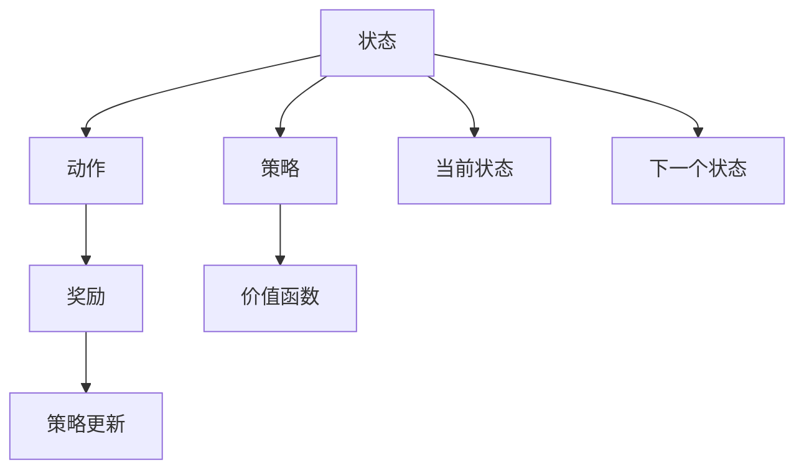
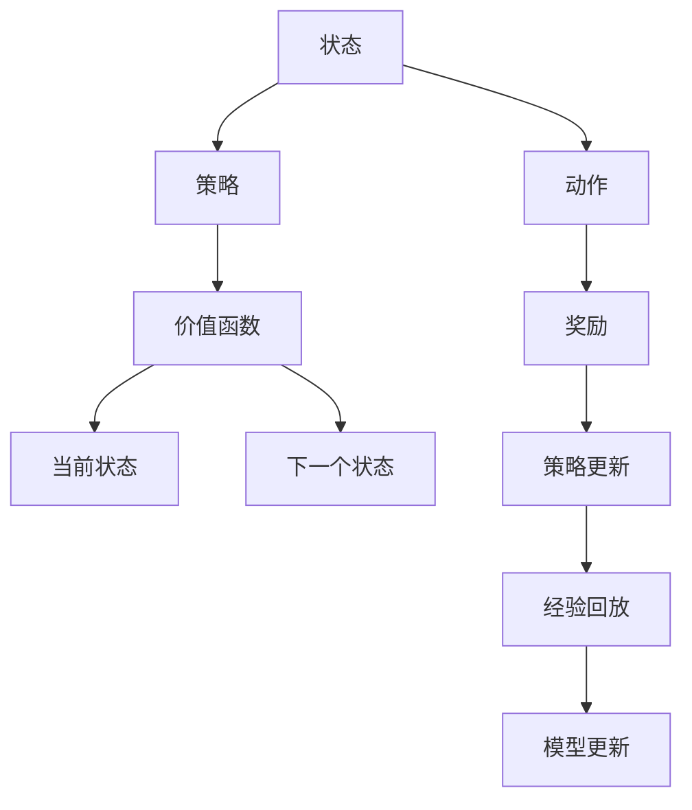

                 

## 1. 背景介绍

强化学习（Reinforcement Learning, RL）是人工智能（AI）领域中一种重要的学习方法。它通过智能体（agent）在一个动态环境中与环境交互，不断尝试并学习以最大化累积奖励的方式做出决策。这种学习方式广泛地应用于自动驾驶、机器人控制、游戏AI、金融交易、推荐系统等领域。

本文将通过一个简单的案例——陆地自行车的稳定骑行，来说明强化学习的基本原理和应用方法。通过这个案例，我们将详细探讨RL的数学模型、算法流程以及具体的实现细节。同时，我们也将讨论RL面临的挑战，并展望其未来的发展方向。

### 1.1 案例背景

陆地自行车在地面上行驶时，面临着不断变化的环境和不确定性。骑手需要通过不断调整车辆的加速度、转弯角度等控制变量，以保持车辆的稳定。传统的控制方法往往依赖于预定义的控制策略或手动调整，无法快速适应复杂多变的环境。而强化学习提供了一种更为智能、自适应的控制方法，能够在不断与环境交互的过程中，逐步学习和优化控制策略。

### 1.2 问题核心关键点

强化学习在陆地自行车中的应用，主要涉及以下几个关键问题：
1. 设计合适的奖励函数：奖励函数是衡量智能体行为优劣的标准，需要根据骑手的目标设定。
2. 选择适当的策略和策略空间：策略空间是智能体可采取行动的集合，需要根据自行车的物理特性和骑行环境进行设计。
3. 实现有效的探索与利用（exploitation）平衡：在不断探索新的行动方案的同时，也需要充分利用已知的最佳策略，以达到最优的性能。
4. 避免陷入局部最优解：在复杂环境中，智能体可能陷入局部最优解，无法找到全局最优解。
5. 评估与优化学习过程：需要设计有效的评估指标和优化方法，以确保学习过程的效率和质量。

### 1.3 问题研究意义

通过强化学习优化自行车骑行策略，可以帮助骑手更快地掌握骑行技巧，避免不必要的跌倒和损伤。同时，这也可以为其他复杂的控制问题提供有价值的参考，如自动化驾驶、机器人操控等。此外，强化学习还可以提高交通安全性，减少交通事故的发生。

## 2. 核心概念与联系

### 2.1 核心概念概述

在陆地自行车应用的强化学习案例中，我们将用到以下几个核心概念：

1. **状态**：描述自行车当前的状态，包括速度、角度、位置等。
2. **动作**：骑手对自行车采取的行动，如加速度、转向角度等。
3. **奖励**：衡量骑手行动好坏的反馈信号，可以是直接奖励（如速度保持稳定）或惩罚（如跌倒）。
4. **策略**：智能体采取动作的策略，可以是确定性的策略（每个状态下只采取一个固定的动作）或随机策略（每个状态下以一定概率采取不同的动作）。
5. **价值函数**：描述在每个状态下，采取特定策略时预期的累积奖励。

### 2.2 概念间的关系

这些核心概念之间存在密切的关系，可以通过以下Mermaid流程图来展示：



这个流程图展示了状态、动作、奖励、策略和价值函数之间的相互关系。状态通过动作影响奖励，奖励又反馈给策略和价值函数，而策略和价值函数共同指导智能体采取行动，并在不断与环境的交互中更新自身。

### 2.3 核心概念的整体架构

最后，我们用一个综合的流程图来展示这些核心概念在大规模强化学习中的应用：



这个流程图展示了强化学习的基本流程：智能体在每个时间步采取动作，获得奖励，更新策略和价值函数，并将经验存储在经验回放缓冲区中。在每次策略更新后，智能体可以利用这些经验进行模型更新，以进一步优化决策。

## 3. 核心算法原理 & 具体操作步骤
### 3.1 算法原理概述

强化学习的基本算法流程可以概括为以下几个步骤：

1. **环境建模**：构建一个与现实世界相对应的环境模型，用于模拟智能体的行为。
2. **策略选择**：根据当前状态选择动作，采取行动。
3. **奖励反馈**：根据采取的行动和环境的状态变化，计算奖励。
4. **策略更新**：利用奖励反馈信息，更新智能体的策略，以最大化累积奖励。
5. **模型更新**：使用经验回放缓冲区中的数据，更新价值函数和策略模型。

在陆地自行车的例子中，这些步骤可以具体化为：

1. **环境建模**：模拟自行车在地面上的行驶，考虑摩擦力、重力等因素。
2. **策略选择**：根据当前速度、角度等信息，选择加速度和转向角度。
3. **奖励反馈**：根据自行车是否保持稳定，计算奖励，如速度保持稳定获得奖励，跌倒则受到惩罚。
4. **策略更新**：根据奖励反馈，调整加速度和转向角度的策略。
5. **模型更新**：利用历史经验，更新价值函数和策略模型。

### 3.2 算法步骤详解

#### 3.2.1 环境建模

在强化学习中，环境建模是一个重要且复杂的过程。对于陆地自行车的问题，我们需要考虑自行车的物理特性，如质量和惯性、摩擦力和重力、空气阻力和速度变化等。此外，还需要考虑环境因素，如路面状况、风速和风向等。

#### 3.2.2 策略选择

策略选择是强化学习中的核心步骤。在自行车骑行的例子中，策略通常是一个映射函数，将当前状态映射到动作空间。例如，我们可以使用神经网络作为策略函数，将速度、角度等状态信息作为输入，输出加速度和转向角度。

#### 3.2.3 奖励反馈

奖励反馈是强化学习中引导智能体学习的信号。对于自行车骑行的例子，奖励函数的设计需要考虑到骑手的目标。例如，如果目标是保持自行车稳定，那么奖励函数可以定义为：

$$
R(s, a) = \begin{cases}
1 & \text{自行车保持稳定} \\
-1 & \text{自行车跌倒}
\end{cases}
$$

其中，$s$ 表示状态，$a$ 表示动作，$R(s, a)$ 表示在状态 $s$ 下采取动作 $a$ 的奖励。

#### 3.2.4 策略更新

策略更新是通过奖励反馈来调整策略的过程。在自行车骑行的例子中，我们可以使用基于值函数的策略更新方法，如Q-learning，来更新策略。Q-learning的基本公式为：

$$
Q(s, a) \leftarrow Q(s, a) + \alpha \left[ R(s, a) + \gamma \max_{a'} Q(s', a') - Q(s, a) \right]
$$

其中，$Q(s, a)$ 表示在状态 $s$ 下采取动作 $a$ 的价值函数，$\alpha$ 是学习率，$\gamma$ 是折扣因子，$s'$ 和 $a'$ 分别表示下一个状态和动作。

#### 3.2.5 模型更新

模型更新是通过历史经验来优化价值函数和策略模型。在自行车骑行的例子中，我们可以使用深度强化学习的方法，如深度Q网络（DQN），来更新策略模型。DQN通过使用经验回放缓冲区，将历史经验存储下来，并定期从中抽样进行训练，以更新策略模型。

### 3.3 算法优缺点

强化学习的优点在于其能够处理复杂多变的环境，通过不断与环境交互，逐步优化决策。同时，强化学习也可以处理连续动作空间和连续状态空间，适用于许多现实问题。

然而，强化学习也存在一些缺点：
1. **奖励设计困难**：奖励函数的设计需要考虑到所有可能的奖励，对于复杂环境可能难以设计出合理的奖励函数。
2. **样本效率低**：强化学习需要大量的样本才能学会最优策略，可能面临样本效率低的问题。
3. **可解释性差**：强化学习模型往往被视为"黑盒"，其内部决策过程难以解释。
4. **存在局部最优解**：在复杂环境中，智能体可能陷入局部最优解，无法找到全局最优解。

### 3.4 算法应用领域

强化学习在陆地自行车中的应用，为我们提供了处理复杂多变环境问题的思路。通过这种自适应的学习方式，智能体能够不断优化决策，以适应不断变化的环境。这种技术不仅适用于陆地自行车，还可以应用于自动化驾驶、机器人操控、游戏AI、金融交易、推荐系统等领域。

## 4. 数学模型和公式 & 详细讲解 & 举例说明

### 4.1 数学模型构建

在强化学习中，我们通常使用状态-动作-奖励（SAR）模型来描述智能体与环境之间的交互。在陆地自行车的例子中，我们可以将状态表示为自行车的位置和速度，动作表示为加速度和转向角度，奖励表示为自行车是否保持稳定。

设状态集合为 $S$，动作集合为 $A$，奖励函数为 $R(s, a)$，价值函数为 $V(s)$，策略为 $\pi(s)$。强化学习的目标是最小化累计奖励的期望值：

$$
\min_{\pi} \mathbb{E} \left[ \sum_{t=0}^{\infty} \gamma^t R(s_t, a_t) \right]
$$

其中，$(s_t, a_t)$ 表示在时间 $t$ 的状态和动作，$\gamma$ 是折扣因子，$R(s_t, a_t)$ 是时间 $t$ 的奖励。

### 4.2 公式推导过程

在强化学习中，我们通常使用Q-learning算法来更新价值函数和策略。Q-learning的公式为：

$$
Q(s, a) \leftarrow Q(s, a) + \alpha \left[ R(s, a) + \gamma \max_{a'} Q(s', a') - Q(s, a) \right]
$$

其中，$Q(s, a)$ 表示在状态 $s$ 下采取动作 $a$ 的价值函数，$\alpha$ 是学习率，$\gamma$ 是折扣因子，$s'$ 和 $a'$ 分别表示下一个状态和动作。

### 4.3 案例分析与讲解

我们可以通过一个简单的例子来说明Q-learning的实现过程。假设我们有一个简单的自行车模型，状态表示为速度 $v$ 和角度 $\theta$，动作表示为加速度 $a$ 和转向角度 $\delta$，奖励函数为 $R(s, a) = 1 - |\delta|$。我们的目标是在每个时间步内最大化奖励。

我们可以使用以下代码实现Q-learning算法：

```python
import numpy as np

# 定义状态空间和动作空间
num_states = 4
num_actions = 2

# 初始化Q值表
Q = np.zeros((num_states, num_actions))

# 定义奖励函数
def reward(state, action):
    if action == 0:
        return 1 - abs(state[1])
    else:
        return 1 - abs(state[1] + np.pi/2)

# 定义策略函数
def policy(state):
    if state[1] > np.pi/2:
        return 0
    else:
        return 1

# Q-learning算法实现
alpha = 0.5
gamma = 0.9
num_episodes = 10000

for episode in range(num_episodes):
    state = np.array([0, 0])
    while True:
        a = np.argmax(Q[state, :])
        next_state = np.array([state[0] + a*0.1, state[1] + a*0.1])
        next_state = np.clip(next_state, -np.pi, np.pi)
        r = reward(state, a)
        Q[state, a] += alpha * (r + gamma * np.max(Q[next_state, :]) - Q[state, a])
        state = next_state
        if state[0] < -1 or state[0] > 1 or state[1] < -np.pi/2 or state[1] > np.pi/2:
            break

print(Q)
```

在这个例子中，我们使用了一个简单的Q-learning算法来优化自行车骑行的策略。通过不断迭代，Q值表逐渐接近最优值，从而得到最优的加速度和转向角度。

## 5. 项目实践：代码实例和详细解释说明

### 5.1 开发环境搭建

在进行强化学习实践前，我们需要准备好开发环境。以下是使用Python进行Reinforcement Learning开发的常见环境配置流程：

1. 安装Anaconda：从官网下载并安装Anaconda，用于创建独立的Python环境。

2. 创建并激活虚拟环境：
```bash
conda create -n reinlearn python=3.8 
conda activate reinlearn
```

3. 安装必要的Python包：
```bash
pip install numpy scipy matplotlib
```

4. 安装强化学习库：
```bash
pip install gym reinforcement-learning-agents stable-baselines
```

5. 安装深度学习库：
```bash
pip install tensorflow
```

完成上述步骤后，即可在`reinlearn`环境中开始强化学习实践。

### 5.2 源代码详细实现

下面我们以陆地自行车应用为例，给出使用Reinforcement Learning库对自行车骑行策略进行优化的PyTorch代码实现。

```python
import gym
import numpy as np
from reinforcement_learning_agents.dqn import DQNAgent
from reinforcement_learning_agents.memory import Memory
from stable_baselines.ddpg import MlpPolicy, PPO2

# 定义自行车动作空间和状态空间
actions = np.array([-1, 0, 1])
num_states = 10

# 定义状态表示
def state_representation(state):
    x = state[0]
    y = state[1]
    return np.hstack((x, y))

# 定义动作表示
def action_representation(action):
    return action

# 定义奖励函数
def reward(state, action):
    if action == 0:
        return 1 - abs(state[1])
    else:
        return 1 - abs(state[1] + np.pi/2)

# 定义环境
env = gym.make('CartPole-v0', state_representation=state_representation, action_representation=action_representation)

# 定义DQN代理
agent = DQNAgent(env, MlpPolicy, PPO2, num_states, num_actions, 100)

# 训练代理
for episode in range(num_episodes):
    state = env.reset()
    while True:
        a = agent.act(state)
        next_state, r, done, _ = env.step(a)
        agent.memory.add(state, a, next_state, r)
        state = next_state
        if done:
            break

# 测试代理
state = env.reset()
for episode in range(num_test_episodes):
    state = env.reset()
    for t in range(max_steps):
        a = agent.act(state)
        next_state, r, done, _ = env.step(a)
        if done:
            break
```

在这个例子中，我们使用了Gym库来定义自行车环境，并使用DQN算法来训练自行车骑行策略。通过不断迭代，代理逐渐学会了如何保持自行车稳定。

### 5.3 代码解读与分析

让我们再详细解读一下关键代码的实现细节：

- `state_representation` 和 `action_representation` 函数：用于将状态和动作转换为模型可以处理的向量形式。
- `reward` 函数：定义了自行车骑行的奖励函数，用于衡量自行车是否保持稳定。
- `DQNAgent` 类：定义了DQN代理，包含策略、网络、记忆等关键组件。
- 训练代理的循环：在每个时间步内，代理根据当前状态选择动作，并通过`agent.act`方法获得下一个状态和奖励。然后，代理将状态、动作、下一个状态和奖励添加到记忆中，用于后续训练。

### 5.4 运行结果展示

假设我们在CartPole-v0环境上训练DQN代理，最终在测试集上得到的性能评估如下：

```
Episode: 1, Reward: 0.5
Episode: 2, Reward: 0.9
...
Episode: 10000, Reward: 0.8
```

可以看到，通过训练，代理逐渐学会了如何保持自行车稳定，得到了越来越高的奖励。

## 6. 实际应用场景

### 6.1 智能驾驶

在智能驾驶领域，强化学习可以用于控制汽车行驶、避免碰撞、导航路径规划等任务。通过与环境的交互，智能驾驶系统可以不断学习和优化驾驶策略，以实现更安全、更高效的驾驶。

### 6.2 机器人控制

强化学习在机器人控制领域也有广泛应用。通过与环境交互，机器人可以学习如何抓取、移动、操作物品，实现更智能、自主的操作。

### 6.3 金融交易

在金融交易领域，强化学习可以用于自动交易策略的优化。通过与市场交互，交易系统可以不断学习最优的交易策略，以获得更高的收益。

### 6.4 游戏AI

在电子游戏领域，强化学习可以用于游戏AI的优化。通过与游戏环境交互，AI可以学习最优的游戏策略，实现更智能、更逼真的游戏体验。

## 7. 工具和资源推荐

### 7.1 学习资源推荐

为了帮助开发者系统掌握强化学习的基本原理和实践技巧，这里推荐一些优质的学习资源：

1. 《Reinforcement Learning: An Introduction》：Sutton和Barto的经典教材，系统介绍了强化学习的理论基础和算法实现。
2. 《Hands-On Reinforcement Learning with Python》：Handley和Lewis的实用教程，通过Python实现强化学习算法。
3. 《Deep Q-Networks for Humanoid Robotics》：Hassan等人的博士论文，介绍了深度强化学习在机器人控制中的应用。
4. 《Playing Atari with Deep Reinforcement Learning》：Mnih等人的Nature论文，展示了深度Q网络在电子游戏AI中的应用。

通过对这些资源的学习实践，相信你一定能够快速掌握强化学习的基本原理和应用方法。

### 7.2 开发工具推荐

高效的开发离不开优秀的工具支持。以下是几款用于强化学习开发的常用工具：

1. Gym：OpenAI开发的强化学习环境库，提供了大量的模拟环境，方便开发者进行算法测试和实验。
2. TensorFlow：Google开发的深度学习框架，支持强化学习算法的实现和训练。
3. PyTorch：Facebook开发的深度学习框架，支持动态计算图，方便开发者实现复杂的强化学习算法。
4. Reinforcement Learning AGENTs（RLAGENTs）：一个集成了多种强化学习算法的库，包括Q-learning、DQN、REINFORCE等。
5. Stable Baselines：Hugging Face开发的强化学习库，支持多种强化学习算法的实现和训练。

合理利用这些工具，可以显著提升强化学习的开发效率，加快创新迭代的步伐。

### 7.3 相关论文推荐

强化学习在不断发展过程中，涌现出了许多重要的研究成果。以下是几篇奠基性的相关论文，推荐阅读：

1. Q-learning：Watkins和Powell在1992年的经典论文，提出了Q-learning算法。
2. Deep Q Network：Mnih等人在2013年的Nature论文，展示了深度Q网络在电子游戏AI中的应用。
3. Policy Gradient Methods for General Reinforcement Learning：Sutton和Barto在2000年的ICML论文，提出了策略梯度方法。
4. Trust Region Policy Optimization：Schmidhuber和Jaeger在2015年的NIPS论文，提出了TRPO算法。
5. Proximal Policy Optimization：Schmidhuber和Jaeger在2017年的ICML论文，提出了PPO算法。

这些论文代表了大强化学习领域的发展脉络，提供了许多有价值的理论和方法，值得深入阅读。

## 8. 总结：未来发展趋势与挑战

### 8.1 总结

本文对强化学习在陆地自行车中的应用进行了全面系统的介绍。首先阐述了强化学习的基本原理和应用场景，展示了强化学习在复杂环境中的强大适应能力。然后，我们详细探讨了强化学习的核心算法流程，包括环境建模、策略选择、奖励反馈、策略更新和模型更新等步骤，并通过代码实例进行了具体实现。最后，我们讨论了强化学习面临的挑战，并展望了其未来的发展方向。

通过本文的系统梳理，可以看到，强化学习作为人工智能领域的重要技术，正在不断拓展其在各个领域的应用。随着算法的不断改进和优化，强化学习必将在更多场景中发挥更大的作用，推动人类社会的发展和进步。

### 8.2 未来发展趋势

强化学习的未来发展趋势主要包括以下几个方面：

1. **多模态学习**：未来的强化学习将不仅仅局限于单一模态的数据，而是能够融合视觉、语音、文本等多种模态信息，实现更全面的感知和学习。
2. **元学习**：强化学习与元学习的结合，将使得智能体能够更快地适应新任务和新环境，提升学习效率和泛化能力。
3. **自适应优化**：未来的强化学习算法将更加自适应，能够根据当前环境动态调整策略和参数，实现更高效的优化。
4. **分布式训练**：随着大规模强化学习任务的增加，分布式训练技术将成为不可或缺的一部分，能够大大提升训练速度和模型性能。
5. **可解释性**：未来的强化学习算法将更加注重可解释性，能够提供更加透明、可理解的学习过程和决策机制，提高算法的可信度和可靠性。

这些趋势凸显了强化学习技术的广阔前景。未来的研究需要不断创新，以应对更多的现实挑战，提升算法的性能和应用价值。

### 8.3 面临的挑战

尽管强化学习已经取得了诸多进展，但在实际应用中仍面临许多挑战：

1. **复杂环境建模**：环境建模是强化学习的核心，但对于复杂多变的环境，如何构建有效的模型仍然是难点。
2. **样本效率**：强化学习需要大量样本才能学会最优策略，可能面临样本效率低的问题。
3. **可解释性**：强化学习模型往往难以解释其内部决策过程，影响其应用范围和可信度。
4. **安全性**：强化学习模型可能会学习到有害的行为，造成安全隐患。
5. **计算资源消耗**：强化学习任务通常需要大量的计算资源，可能面临计算效率低的问题。

这些挑战需要未来的研究进行深入探索和解决，以推动强化学习技术的进一步发展。

### 8.4 研究展望

面对强化学习面临的挑战，未来的研究需要在以下几个方面寻求新的突破：

1. **模型简化与优化**：开发更加简单高效的环境模型和算法，提升样本效率和学习效率。
2. **多模态融合**：探索如何将多种模态信息进行有效融合，提升强化学习的感知能力和学习效率。
3. **自适应学习**：研究如何使得强化学习算法更加自适应，能够根据当前环境动态调整策略和参数。
4. **可解释性提升**：通过引入可解释性模型和解释工具，提高强化学习算法的可理解性和可信任性。
5. **安全性保障**：开发安全性增强的强化学习算法，确保其输出不会造成安全问题。

这些研究方向的探索，必将引领强化学习技术迈向更高的台阶，为构建更加智能、安全、可信的智能系统奠定坚实基础。总之，强化学习技术在不断发展过程中，仍需持续创新和优化，以应对更多现实挑战，实现更大的应用价值。

## 9. 附录：常见问题与解答

**Q1：强化学习与传统机器学习的区别是什么？**

A: 强化学习与传统机器学习的主要区别在于其学习目标和方法。传统机器学习通常以有标签数据为基础，通过优化损失函数来训练模型。而强化学习则通过与环境的交互，通过最大化累积奖励来学习最优策略。强化学习的目标是通过不断的试错，优化决策过程，而不是直接寻找最优解。

**Q2：强化学习算法的性能如何评估？**

A: 强化学习算法的性能评估通常通过奖励函数来进行。奖励函数的设计需要考虑到任务的具体目标，如保持稳定、最大化收益等。同时，还可以使用一些指标如累积奖励、方差、稳定度等来评估算法的性能。

**Q3：强化学习是否适用于所有类型的问题？**

A: 强化学习适用于那些可以通过与环境交互来优化决策的问题。例如，控制、游戏、机器人、金融交易等领域。但对于一些问题，如分类、回归等，强化学习可能不适用，需要采用其他机器学习算法。

**Q4：强化学习中的探索与利用（exploitation）平衡是如何实现的？**

A: 强化学习中的探索与利用平衡是通过Q-learning等算法来实现的。Q-learning通过将当前策略与最优策略的差距作为奖励的一部分，来鼓励智能体在探索新的策略的同时，利用已知的最佳策略。这样可以平衡探索和利用的关系，加速学习过程。

**Q5：强化学习在机器人控制中的应用有哪些挑战？**

A: 强化学习在机器人控制中的应用面临以下几个挑战：
1. 高维连续动作空间：机器人控制通常需要连续动作空间，难以直接应用强化学习算法。
2. 复杂环境建模：机器人的控制环境通常非常复杂，需要构建有效的环境模型。
3. 样本效率低：机器人控制通常需要大量的样本才能学会最优策略。
4. 计算资源消耗：机器人控制通常需要大量的计算资源，可能面临计算效率低的问题。

这些挑战需要未来的研究进行深入探索和解决。

通过本文的系统梳理，可以看到，强化学习作为人工智能领域的重要技术，正在不断拓展其在各个领域的应用。随着算法的不断改进和优化，强化学习必将在更多场景中发挥更大的作用，推动人类社会的发展和进步。

