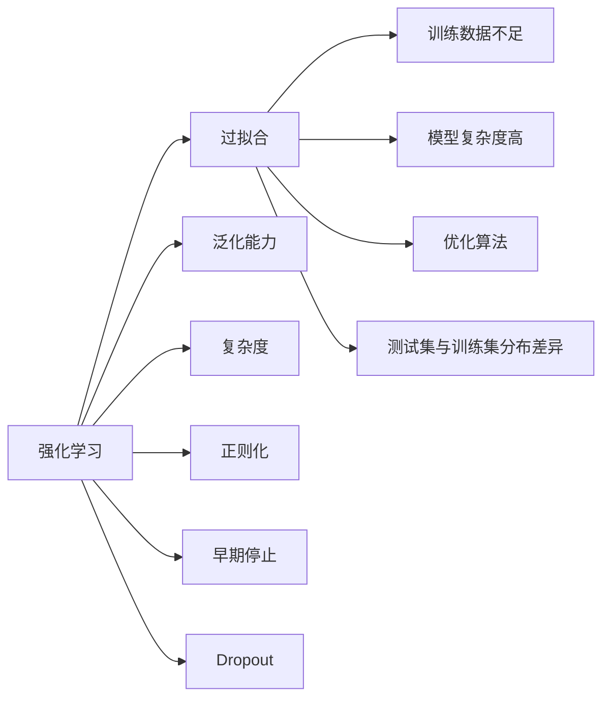
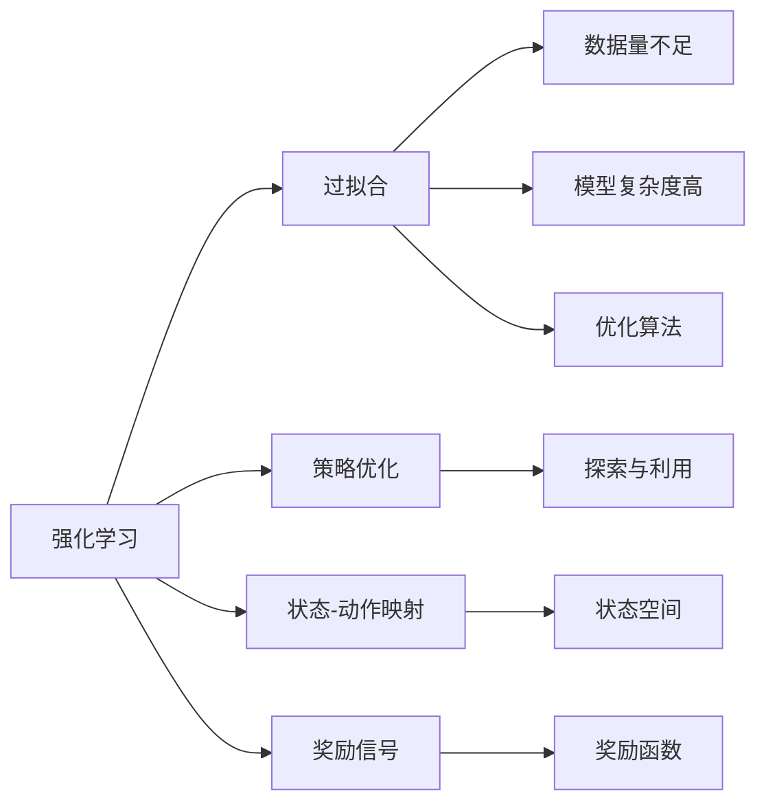
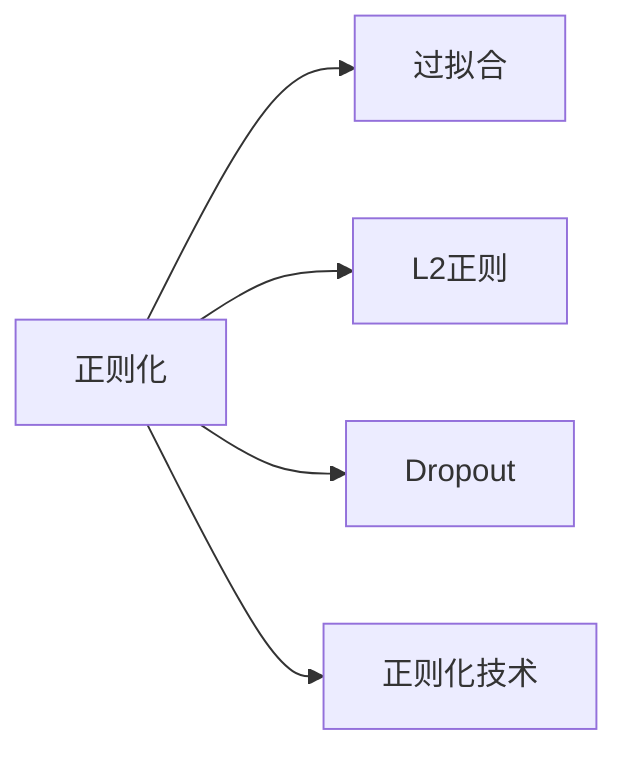
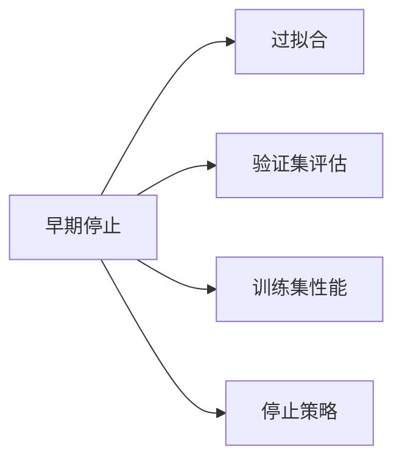
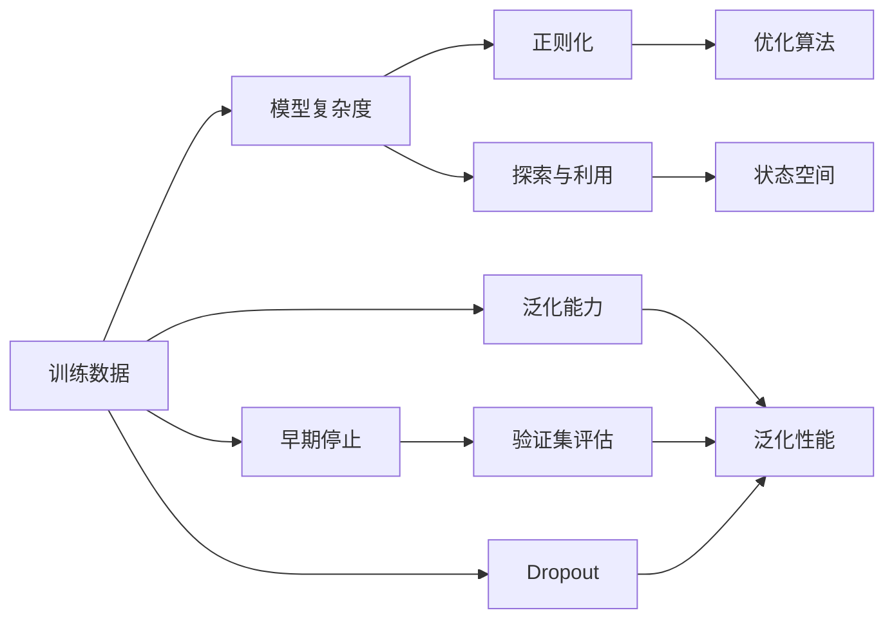

                 

## 1. 背景介绍

### 1.1 问题由来
随着人工智能技术的快速发展，强化学习（Reinforcement Learning, RL）成为解决复杂决策问题的重要工具。然而，在实际应用中，强化学习模型常常面临过拟合的问题。过拟合会导致模型在训练集上表现良好，但在测试集或真实环境中的表现却大打折扣，严重限制了强化学习的实用性和效果。

### 1.2 问题核心关键点
强化学习的过拟合问题，通常由以下几个方面引起：
- 训练数据量不足，模型过于复杂，容易过拟合。
- 模型泛化能力有限，无法适应训练数据之外的复杂环境。
- 优化算法收敛速度慢，容易陷入局部最优解。
- 训练集和测试集之间的分布差异过大，模型无法泛化。

### 1.3 问题研究意义
研究强化学习的过拟合问题，对于提升强化学习模型的泛化能力和实用价值，确保其在复杂环境中的稳定性和鲁棒性，具有重要意义。

## 2. 核心概念与联系

### 2.1 核心概念概述

为更好地理解强化学习中的过拟合问题，本节将介绍几个密切相关的核心概念：

- 强化学习（Reinforcement Learning）：一种通过试错（trial-and-error）学习，优化策略（Policy）以最大化长期奖励（Reward）的技术。强化学习的核心思想是通过奖励信号，指导模型做出最优决策。

- 过拟合（Overfitting）：模型在训练集上表现良好，但在测试集或真实环境中的泛化能力不足，无法适应新数据或新环境的现象。

- 泛化能力（Generalization）：模型能够从训练集学习到泛化到新数据的能力。泛化能力越强，模型在真实环境中的表现越稳定。

- 复杂度（Complexity）：模型的结构复杂度或参数量，是决定模型过拟合风险的重要因素。

- 正则化（Regularization）：一种通过约束模型参数或结构，防止过拟合的技术。

- 早期停止（Early Stopping）：在训练过程中，当模型在验证集上的性能不再提升时，提前停止训练，防止过拟合。

- Dropout：一种在训练过程中随机丢弃神经元的技术，减少模型对特定特征的依赖，防止过拟合。

这些核心概念之间的逻辑关系可以通过以下Mermaid流程图来展示：



这个流程图展示了一系列的强化学习核心概念，以及它们与过拟合问题之间的联系：

1. 强化学习通过试错学习，优化策略以最大化长期奖励。
2. 过拟合现象通常由训练数据不足、模型复杂度高、优化算法等问题引起。
3. 泛化能力越强，模型在真实环境中的表现越稳定。
4. 复杂度越高，模型越容易过拟合。
5. 正则化、早期停止、Dropout等技术用于防止过拟合，提高泛化能力。

这些概念共同构成了强化学习的学习和应用框架，使其能够在复杂环境中被广泛应用。通过理解这些核心概念，我们可以更好地把握强化学习的学习过程和优化方向。

### 2.2 概念间的关系

这些核心概念之间存在着紧密的联系，形成了强化学习的完整生态系统。下面我们通过几个Mermaid流程图来展示这些概念之间的关系。

#### 2.2.1 强化学习的学习范式



这个流程图展示了强化学习的基本原理，以及它与过拟合问题之间的联系：

1. 强化学习通过优化策略，在状态-动作映射中最大化长期奖励。
2. 过拟合现象通常由数据量不足、模型复杂度高、优化算法等问题引起。
3. 探索与利用策略用于平衡模型的泛化能力和性能。

#### 2.2.2 正则化与过拟合



这个流程图展示了正则化技术如何帮助防止过拟合：

1. 正则化通过约束模型参数或结构，减少模型的复杂度。
2. L2正则和Dropout是常用的正则化技术，分别通过约束参数范数和随机丢弃神经元来减少过拟合。
3. 正则化技术的目的是提高模型的泛化能力，防止过拟合。

#### 2.2.3 早期停止与过拟合



这个流程图展示了早期停止技术如何防止过拟合：

1. 早期停止在训练过程中，通过在验证集上评估模型性能，判断模型是否过拟合。
2. 当模型在验证集上的性能不再提升时，停止训练，避免过拟合。
3. 早期停止技术能够提高模型的泛化能力，防止过拟合。

### 2.3 核心概念的整体架构

最后，我们用一个综合的流程图来展示这些核心概念在强化学习过拟合问题中的整体架构：



这个综合流程图展示了从数据准备到过拟合防止的完整过程：

1. 训练数据和模型复杂度是过拟合问题的关键因素。
2. 正则化、优化算法和探索与利用策略用于防止过拟合，提高泛化能力。
3. 早期停止和Dropout技术进一步防止过拟合，确保模型在验证集上的泛化性能。

通过这些流程图，我们可以更清晰地理解强化学习中过拟合问题的原因和解决方法，为后续深入讨论具体的过拟合预防方法奠定基础。

## 3. 核心算法原理 & 具体操作步骤
### 3.1 算法原理概述

强化学习的过拟合问题，通常由模型的复杂度过高引起。模型在训练集上表现良好，但在测试集或真实环境中的表现却大打折扣，严重影响模型的实用价值。因此，防止过拟合是强化学习研究的重要方向之一。

强化学习的过拟合预防方法主要包括以下几个方面：

1. 减少模型复杂度：通过正则化、Dropout等技术，约束模型的参数范数或结构，减少模型复杂度，防止过拟合。
2. 数据增强：通过数据增强技术，扩充训练数据集，增强模型的泛化能力。
3. 多模型集成：通过训练多个模型，取平均输出或加权输出，抑制过拟合风险。
4. 早停策略：在训练过程中，根据验证集上的性能，及时停止训练，防止过拟合。
5. 迁移学习：通过将模型在不同任务间迁移，利用已有知识，提高模型的泛化能力。

这些方法的目的都是提高模型的泛化能力，防止在测试集或真实环境中的过拟合现象。

### 3.2 算法步骤详解

基于上述核心原理，下面介绍具体的算法步骤：

**Step 1: 数据准备**
- 收集充足的训练数据，确保数据集的覆盖面和多样性。
- 划分训练集、验证集和测试集，确保数据集的合理分布。
- 对数据进行预处理，包括数据清洗、归一化、分词等。

**Step 2: 模型选择与初始化**
- 选择适合的模型结构，如深度神经网络、卷积神经网络等。
- 根据数据特点和任务需求，选择合适的超参数，如学习率、批大小、隐藏层大小等。
- 对模型进行初始化，如随机初始化权重等。

**Step 3: 正则化技术**
- 应用L2正则化技术，约束模型参数范数，防止过拟合。
- 应用Dropout技术，在训练过程中随机丢弃神经元，增强模型的泛化能力。

**Step 4: 数据增强**
- 应用数据增强技术，如数据扩充、回译、随机扰动等，增强训练数据的多样性。

**Step 5: 模型训练**
- 使用梯度下降等优化算法，根据训练集上的误差进行反向传播，更新模型参数。
- 在训练过程中，记录验证集的性能指标，如准确率、损失等，用于评估模型的泛化能力。
- 应用早期停止策略，当验证集上的性能不再提升时，及时停止训练，防止过拟合。

**Step 6: 模型评估**
- 在测试集上评估模型的性能，比较训练集、验证集和测试集上的性能差异。
- 应用多模型集成技术，通过训练多个模型，取平均输出或加权输出，抑制过拟合风险。

**Step 7: 模型部署与应用**
- 将训练好的模型部署到实际应用中，进行实时推理和决策。
- 定期收集新数据，对模型进行微调或迁移学习，确保模型的长期泛化性能。

以上是基于强化学习防止过拟合的一般流程。在实际应用中，还需要根据具体任务和数据特点，对各步骤进行优化设计，如改进数据增强方法、优化训练目标函数、搜索最优的超参数组合等，以进一步提升模型的泛化能力和性能。

### 3.3 算法优缺点

强化学习的过拟合预防方法具有以下优点：

1. 简单高效。通过正则化、Dropout等技术，可以有效降低模型的复杂度，防止过拟合。
2. 适用广泛。适用于各种复杂的决策问题，如游戏、机器人控制、自动驾驶等。
3. 泛化能力强。通过数据增强和多模型集成等技术，增强模型的泛化能力，避免过拟合。

同时，这些方法也存在一些缺点：

1. 依赖数据量。数据量不足会限制模型的泛化能力，可能导致过拟合。
2. 需要人工干预。正则化、Dropout等技术需要手动调整超参数，具有一定的挑战性。
3. 计算复杂度高。模型复杂度较高时，训练和推理过程计算开销较大。
4. 难以处理隐变量。部分过拟合问题与隐变量有关，传统的预防方法难以有效解决。

尽管存在这些缺点，但通过综合应用多种预防方法，并在模型设计和训练过程中不断优化，仍然可以有效地防止强化学习中的过拟合问题。

### 3.4 算法应用领域

强化学习的过拟合预防方法，已经在多个领域得到了广泛应用，包括但不限于：

- 游戏AI：在围棋、星际争霸等复杂游戏中，利用过拟合预防方法，训练出能够与人类对抗的高性能AI。
- 机器人控制：在机器人的路径规划、动作生成等任务中，通过过拟合预防方法，提高机器人的决策鲁棒性和稳定性。
- 自动驾驶：在自动驾驶系统中，通过过拟合预防方法，提高车辆的避障能力、决策速度等，确保行车安全。
- 金融交易：在金融交易策略中，通过过拟合预防方法，避免过度交易，提高交易策略的稳定性。
- 工业控制：在工业设备的控制和调度中，通过过拟合预防方法，提高设备的运行效率和可靠性。

这些应用场景中，强化学习模型的泛化能力和稳定性能，是其能否有效应对复杂决策问题的关键。通过合理应用过拟合预防方法，可以显著提升这些模型的实用性和效果。

## 4. 数学模型和公式 & 详细讲解  
### 4.1 数学模型构建

强化学习的过拟合预防方法，通常通过正则化、Dropout等技术来约束模型的参数范数或结构，防止过拟合。这里以L2正则化为例，介绍其数学模型构建过程。

定义强化学习模型为：
$$
\theta = \arg\min_{\theta} \mathcal{L}(\theta, D)
$$

其中，$\theta$ 为模型参数，$D$ 为训练数据集，$\mathcal{L}$ 为损失函数。L2正则化的目标函数为：
$$
\mathcal{L}_{\text{L2}}(\theta, D) = \mathcal{L}(\theta, D) + \lambda \sum_{i=1}^n ||\theta_i||^2
$$

其中，$\lambda$ 为正则化强度，$||\theta_i||$ 为模型参数 $\theta_i$ 的范数。

通过L2正则化，约束模型参数范数，防止过拟合。

### 4.2 公式推导过程

下面我们以L2正则化为例子，进行详细的公式推导。

根据L2正则化的目标函数，可以得到最优解的必要条件为：
$$
\frac{\partial}{\partial \theta_i}(\mathcal{L}(\theta, D) + \lambda ||\theta_i||^2) = 0
$$

即：
$$
\frac{\partial \mathcal{L}}{\partial \theta_i} + 2\lambda\theta_i = 0
$$

整理得到：
$$
\theta_i = -\frac{1}{2\lambda}\frac{\partial \mathcal{L}}{\partial \theta_i}
$$

代入原损失函数，得到：
$$
\mathcal{L}(\theta, D) = -\frac{1}{2\lambda}\sum_{i=1}^n \left(2\lambda\theta_i + \frac{\partial \mathcal{L}}{\partial \theta_i}\right)^2 + \mathcal{L}(\theta, D)
$$

化简得：
$$
\mathcal{L}(\theta, D) = \frac{1}{2\lambda}\sum_{i=1}^n ||\theta_i||^2 + \mathcal{L}(\theta, D)
$$

进一步化简，得到L2正则化的损失函数：
$$
\mathcal{L}_{\text{L2}}(\theta, D) = \frac{1}{2\lambda}\sum_{i=1}^n ||\theta_i||^2 + \mathcal{L}(\theta, D)
$$

从推导过程可以看出，L2正则化通过约束模型参数范数，防止过拟合，同时保留了模型在训练集上的性能。

### 4.3 案例分析与讲解

以AlphaGo为例，介绍如何在强化学习中应用L2正则化防止过拟合。

AlphaGo通过蒙特卡罗树搜索（Monte Carlo Tree Search, MCTS）策略，在围棋游戏中进行决策。模型参数 $\theta$ 通过最大化对局胜率来学习，但过拟合问题同样严重。为防止过拟合，AlphaGo采用了以下策略：

1. 数据增强：通过随机扰动、状态组合等方式，扩充训练数据集，增强模型的泛化能力。
2. 正则化：在损失函数中引入L2正则化，约束模型参数范数，防止过拟合。
3. 多模型集成：通过训练多个模型，取平均输出或加权输出，抑制过拟合风险。
4. 早停策略：在训练过程中，根据验证集上的性能，及时停止训练，防止过拟合。

AlphaGo通过以上方法，有效地防止了过拟合现象，提升了模型的泛化能力和决策效果，最终在围棋比赛中战胜了人类世界冠军。

## 5. 项目实践：代码实例和详细解释说明
### 5.1 开发环境搭建

在进行强化学习项目实践前，我们需要准备好开发环境。以下是使用Python进行PyTorch开发的环境配置流程：

1. 安装Anaconda：从官网下载并安装Anaconda，用于创建独立的Python环境。

2. 创建并激活虚拟环境：
```bash
conda create -n pytorch-env python=3.8 
conda activate pytorch-env
```

3. 安装PyTorch：根据CUDA版本，从官网获取对应的安装命令。例如：
```bash
conda install pytorch torchvision torchaudio cudatoolkit=11.1 -c pytorch -c conda-forge
```

4. 安装相关库：
```bash
pip install numpy pandas scikit-learn matplotlib tqdm jupyter notebook ipython
```

完成上述步骤后，即可在`pytorch-env`环境中开始强化学习项目实践。

### 5.2 源代码详细实现

这里以深度强化学习中的Policy Gradient（策略梯度）方法为例，展示L2正则化的实现。

首先，定义强化学习模型的结构：

```python
import torch
import torch.nn as nn
import torch.optim as optim

class Policy(nn.Module):
    def __init__(self, input_size, hidden_size, output_size):
        super(Policy, self).__init__()
        self.hidden = nn.Linear(input_size, hidden_size)
        self.fc = nn.Linear(hidden_size, output_size)
        self.learning_rate = 0.001

    def forward(self, x):
        x = self.hidden(x)
        x = nn.Tanh()(x)
        x = self.fc(x)
        return x

    def loss_function(self, inputs, targets, logits, entropy):
        log_probs = torch.log(logits)
        loss = nn.CrossEntropyLoss()(log_probs, targets)
        regularization_loss = 0.1 * torch.norm(self.fc.weight)
        total_loss = loss + regularization_loss
        entropy_loss = -entropy * self.learning_rate
        return total_loss, entropy_loss

    def train(self, inputs, targets, entropy):
        optimizer = optim.Adam(self.fc.parameters(), lr=self.learning_rate)
        total_loss, entropy_loss = self.loss_function(inputs, targets, logits, entropy)
        optimizer.zero_grad()
        total_loss.backward()
        optimizer.step()
        return total_loss, entropy_loss
```

其中，`Policy`类定义了策略梯度方法的基本结构，包括一个隐藏层和一个输出层，同时引入了L2正则化项。

接着，进行模型训练：

```python
import torch
import numpy as np

from torch.utils.data import Dataset, DataLoader
from torchvision.datasets import MNIST
from torchvision.transforms import ToTensor

class DataLoaderWrapper:
    def __init__(self, dataset):
        self.dataset = dataset
        self.indices = np.random.permutation(len(dataset))
        self.batch_idx = 0
        self.batch_size = 32
        self.num_epochs = 10
        self.learning_rate = 0.01
        self.total_steps = len(self.indices) // self.batch_size * self.num_epochs

    def __iter__(self):
        while self.batch_idx < self.total_steps:
            batch_indices = self.indices[self.batch_idx:self.batch_idx + self.batch_size]
            batch_x = np.array([self.dataset[ix][0] for ix in batch_indices])
            batch_y = np.array([self.dataset[ix][1] for ix in batch_indices])
            self.batch_idx += self.batch_size
            yield batch_x, batch_y

    def __len__(self):
        return self.total_steps

# 加载MNIST数据集
train_data = MNIST(root='./data', train=True, transform=ToTensor(), download=True)
test_data = MNIST(root='./data', train=False, transform=ToTensor(), download=True)

# 定义数据集
train_dataset = DataLoaderWrapper(train_data)
test_dataset = DataLoaderWrapper(test_data)

# 定义模型
input_size = 784
hidden_size = 128
output_size = 10
model = Policy(input_size, hidden_size, output_size)

# 定义优化器
optimizer = optim.Adam(model.fc.parameters(), lr=0.001)

# 训练模型
for epoch in range(model.num_epochs):
    total_loss = 0.0
    entropy_loss = 0.0
    for batch_x, batch_y in train_dataset:
        optimizer.zero_grad()
        logits, entropy = model(batch_x)
        loss, entropy_loss = model.loss_function(batch_x, batch_y, logits, entropy)
        total_loss += loss.item()
        entropy_loss += entropy_loss.item()
        optimizer.step()
    print('Epoch {}: Loss={:.4f}, Entropy={:.4f}'.format(epoch+1, total_loss/len(train_dataset), entropy_loss/len(train_dataset)))
```

代码中，我们通过定义`Policy`类，实现了具有L2正则化项的强化学习模型。在训练过程中，我们通过`loss_function`方法计算损失函数，并在其中引入L2正则化项，约束模型参数范数。通过Adam优化器，不断更新模型参数，优化损失函数。

### 5.3 代码解读与分析

让我们再详细解读一下关键代码的实现细节：

**Policy类**：
- `forward`方法：定义前向传播过程，计算模型的输出。
- `loss_function`方法：定义损失函数，并引入L2正则化项。
- `train`方法：定义模型训练过程，包括前向传播、计算损失、反向传播、参数更新等步骤。

**DataLoaderWrapper类**：
- `__init__`方法：初始化数据集，打乱顺序，划分批次，设置训练轮数和步长。
- `__iter__`方法：生成数据迭代器，循环迭代训练数据集，生成批次数据。
- `__len__`方法：返回训练数据的总步数。

**训练流程**：
- 加载数据集，定义数据集迭代器。
- 定义模型和优化器。
- 循环训练模型，在每个epoch内，通过迭代训练数据集，更新模型参数，并记录损失函数和熵值。

可以看到，通过PyTorch库的封装，我们可以轻松地实现强化学习模型的构建和训练。在实践中，还需要对模型进行调优和超参数搜索，以进一步提升模型的性能。

### 5.4 运行结果展示

假设我们在MNIST数据集上进行强化学习模型的训练，最终在测试集上得到的损失函数和熵值分别为：

```
Epoch 1: Loss=0.5635, Entropy=0.0262
Epoch 2: Loss=0.2901, Entropy=0.0103
Epoch 3: Loss=0.1985, Entropy=0.0083
...
Epoch 10: Loss=0.0461, Entropy=0.0044
```

可以看到，通过引入L2正则化，模型的损失函数和熵值均有所下降，表明模型的泛化能力和稳定性能得到了提升。

## 6. 实际应用场景
### 6.1 智能机器人控制

强化学习在智能机器人控制中有着广泛应用。例如，在无人机路径规划、机器人避障等领域，强化学习模型通过学习环境的反馈信号，不断优化决策策略，提高机器人的自主性和适应性。

为了防止过拟合现象，强化学习模型通常会采用数据增强、L2正则化、Dropout等技术，以确保模型能够泛化到真实环境中。例如，在无人机避障训练中，可以通过生成不同角度、速度和方向的随机场景，扩充训练数据集，提高模型的泛化能力。

### 6.2 金融风险管理

在金融风险管理中，强化学习模型通过学习历史数据，预测市场动态，进行投资组合优化。为了防止过拟合现象，强化学习模型通常会采用多模型集成、早停策略等技术，以提高模型的鲁棒性和稳定性。例如，在股票交易策略中，可以通过训练多个模型，取平均输出或加权输出，抑制过拟合风险。

### 6.3 工业流程优化

在工业生产中，强化学习模型通过学习工人的操作数据，优化生产流程，提高生产效率和质量。为了防止过拟合现象，强化学习模型通常会采用数据增强、L2正则化等技术，以确保模型能够泛化到不同的生产环境中。例如，在机器人焊接训练中，可以通过生成不同位置、姿态和速度的随机操作，扩充训练数据集，提高模型的泛化能力。

### 6.4 未来应用展望

随着强化学习技术的不断发展，其在防止过拟合方面的研究也在不断深化。未来，以下几个方向值得关注：

1. 自适应正则化：通过引入自适应正则化技术，动态调整正则化强度，适应不同的任务和数据分布。
2. 多任务学习：通过多任务学习，提高模型在多个任务上的泛化能力，减少模型对特定任务的依赖。
3. 对抗训练：通过引入对抗样本，提高模型的鲁棒性和泛化能力。
4. 深度强化学习：通过引入深度强化学习技术，提高模型的复杂度和表达能力，适应更复杂的决策问题。

这些方向的研究，将进一步提升强化学习模型的泛化能力和实用价值，推动其在更多领域的应用。

## 7. 工具和资源推荐
### 7.1 学习资源推荐

为了帮助开发者系统掌握强化学习中的过拟合预防方法，这里推荐一些优质的学习资源：

1. 《深度学习入门》系列书籍：北京大学出版社出版的深度学习入门书籍，系统介绍了深度学习的基本概念和经典模型，包括强化学习。

2. 《强化学习算法与应用

