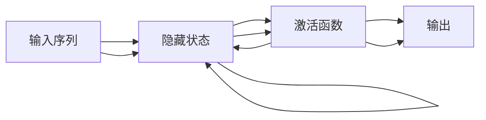

                 

## 1. 背景介绍

循环神经网络（Recurrent Neural Networks, RNNs）是一种重要的神经网络模型，其历史可以追溯到1990年代，最初被提出用于处理序列数据，如自然语言处理（Natural Language Processing, NLP）中的文本数据。RNNs之所以引人注目，是因为它们能够对序列数据中的时间依赖性进行建模，这在许多应用中至关重要。近年来，随着深度学习技术的迅猛发展，RNNs已经成为NLP、语音识别、时间序列分析等诸多领域的重要工具。

### 1.1 问题由来

序列数据是机器学习中最常见的数据类型之一，例如文本、音频、视频等。传统的机器学习模型通常难以处理这些序列数据，因为它们缺乏对时间依赖性的建模能力。RNNs通过引入循环结构，使得模型能够学习到序列数据中不同位置之间的依赖关系，从而在序列数据的处理上取得了显著的进展。

### 1.2 问题核心关键点

RNNs的核心思想是使用反馈机制，将当前时刻的输出作为下一时刻的输入，从而实现对序列数据的时间依赖性建模。具体来说，RNNs包含三个基本组件：

- **隐藏状态**：一个向量，用于存储之前时刻的信息。
- **循环结构**：使得当前时刻的输出能够作为下一时刻的输入，从而实现了对序列数据的建模。
- **激活函数**：用于对隐藏状态进行非线性变换。

通过这三个组件的组合，RNNs可以有效地处理序列数据，并在许多任务上取得了优异的性能。然而，RNNs也存在一些局限性，例如梯度消失和梯度爆炸问题，这些问题可能会影响模型的性能和训练效果。因此，研究人员不断探索新的RNN变种和改进方法，以提高模型的性能和稳定性。

### 1.3 问题研究意义

研究RNNs的动机不仅仅是为了解决序列数据的处理问题，更在于探索如何将时间依赖性建模与机器学习结合起来，以实现更加智能和高效的数据分析与处理。RNNs已经在语音识别、自然语言处理、时间序列预测等领域展示了其强大的能力，极大地推动了人工智能技术的发展。同时，RNNs的研究也为其他领域，如控制系统和机器人学提供了新的思路和方法，具有广泛的应用前景。

## 2. 核心概念与联系

### 2.1 核心概念概述

为了更好地理解RNNs的工作原理，本节将介绍几个关键概念：

- **序列数据**：指包含时间顺序的数据，如文本、音频、视频等。
- **循环结构**：指模型能够对序列数据中的时间依赖性进行建模的结构。
- **隐藏状态**：指模型中用于存储之前时刻信息的状态向量。
- **激活函数**：指用于对隐藏状态进行非线性变换的函数，如Sigmoid、Tanh、ReLU等。
- **梯度消失和梯度爆炸**：指在训练过程中可能出现的梯度问题，影响模型的稳定性和训练效果。

这些核心概念构成了RNNs的基本框架，理解它们的工作原理和相互关系，是深入学习RNNs的关键。

### 2.2 概念间的关系

这些核心概念之间存在着紧密的联系，形成了RNNs的整体架构。以下是一个简单的Mermaid流程图，展示了RNNs的各个组件和工作流程：



这个流程图展示了RNNs的基本工作流程：

1. 输入序列通过循环结构连接到隐藏状态。
2. 隐藏状态通过激活函数进行非线性变换，得到新的隐藏状态。
3. 新的隐藏状态作为下一时刻的输入，继续进行循环。
4. 最终输出取决于当前时刻的隐藏状态和激活函数。

通过理解这些概念和流程，我们可以更好地把握RNNs的工作原理，并在此基础上探索新的改进方法和应用场景。

## 3. 核心算法原理 & 具体操作步骤
### 3.1 算法原理概述

RNNs的核心思想是通过循环结构，将当前时刻的输出作为下一时刻的输入，从而实现对序列数据的时间依赖性建模。具体来说，RNNs包含以下三个主要步骤：

1. **输入处理**：将输入序列中的每个时刻映射到一个向量表示。
2. **隐藏状态更新**：使用当前时刻的输入和上一时刻的隐藏状态，通过循环结构更新隐藏状态。
3. **输出计算**：根据当前时刻的隐藏状态，计算输出。

通过这三个步骤的循环执行，RNNs可以逐步处理整个序列数据，并输出对应的结果。

### 3.2 算法步骤详解

以下是一个简单的RNN模型，展示了其输入、隐藏状态和输出之间的关系：


在这个模型中，$x_t$ 表示输入序列中第 $t$ 个时刻的向量表示，$h_t$ 表示隐藏状态，$y_t$ 表示当前时刻的输出。模型包含三个主要组件：输入层、隐藏层和输出层。

- **输入层**：将输入序列中的每个时刻映射到一个向量表示。
- **隐藏层**：通过循环结构更新隐藏状态，使得模型能够学习到序列数据中不同位置之间的依赖关系。
- **输出层**：根据当前时刻的隐藏状态，计算输出。

RNN的训练过程包括以下几个关键步骤：

1. **前向传播**：将输入序列中的每个时刻通过模型进行前向传播，得到输出序列。
2. **损失计算**：根据输出序列和真实标签序列，计算损失函数。
3. **反向传播**：使用链式法则计算损失函数对每个参数的梯度。
4. **参数更新**：使用梯度下降等优化算法更新模型参数。

### 3.3 算法优缺点

RNNs具有以下优点：

- **时间依赖性建模**：能够处理序列数据，捕捉时间依赖性。
- **可扩展性**：适用于各种序列数据，如文本、音频、视频等。
- **序列生成能力**：能够生成与输入序列相关的输出序列。

然而，RNNs也存在一些局限性：

- **梯度消失和梯度爆炸**：训练过程中可能出现梯度问题，影响模型性能。
- **计算复杂度高**：需要计算每个时刻的隐藏状态，计算复杂度高。
- **长期依赖性问题**：难以捕捉长期依赖性，导致长序列数据处理困难。

### 3.4 算法应用领域

RNNs在许多领域都有广泛的应用，包括：

- **自然语言处理**：如文本分类、语言建模、机器翻译等。
- **语音识别**：如语音转文本、语音识别等。
- **时间序列分析**：如股票价格预测、天气预测等。
- **图像描述生成**：如图像描述生成、视频字幕生成等。
- **音乐生成**：如音乐生成、自动化作曲等。

## 4. 数学模型和公式 & 详细讲解 & 举例说明

### 4.1 数学模型构建

RNNs的数学模型可以表示为：

$$
\begin{aligned}
h_t &= f(x_t, h_{t-1}) \\
y_t &= g(h_t)
\end{aligned}
$$

其中，$h_t$ 表示第 $t$ 个时刻的隐藏状态，$x_t$ 表示第 $t$ 个时刻的输入，$y_t$ 表示第 $t$ 个时刻的输出，$f$ 表示隐藏状态更新函数，$g$ 表示输出函数。

在实践中，$f$ 和 $g$ 通常采用激活函数，如Sigmoid、Tanh、ReLU等。激活函数通过非线性变换，增强模型的表达能力，避免过拟合。

### 4.2 公式推导过程

以一个简单的RNN模型为例，推导其数学公式：

$$
h_t = tanh(W_hx_t + U_hh_{t-1} + b_h)
$$

$$
y_t = g(W_yh_t + b_y)
$$

其中，$W_h$ 和 $U_h$ 表示权重矩阵，$b_h$ 表示偏置向量，$W_y$ 表示输出矩阵，$b_y$ 表示输出偏置向量，$g$ 表示输出函数，如Sigmoid。

在训练过程中，使用交叉熵损失函数计算损失，并通过反向传播算法更新模型参数。具体来说，反向传播过程中，每个时刻的梯度可以表示为：

$$
\frac{\partial \mathcal{L}}{\partial W_h} = \frac{\partial \mathcal{L}}{\partial h_t} \cdot \frac{\partial h_t}{\partial W_h}
$$

$$
\frac{\partial \mathcal{L}}{\partial U_h} = \frac{\partial \mathcal{L}}{\partial h_t} \cdot \frac{\partial h_t}{\partial U_h}
$$

$$
\frac{\partial \mathcal{L}}{\partial b_h} = \frac{\partial \mathcal{L}}{\partial h_t}
$$

$$
\frac{\partial \mathcal{L}}{\partial W_y} = \frac{\partial \mathcal{L}}{\partial y_t} \cdot \frac{\partial y_t}{\partial h_t} \cdot \frac{\partial h_t}{\partial W_y}
$$

$$
\frac{\partial \mathcal{L}}{\partial b_y} = \frac{\partial \mathcal{L}}{\partial y_t} \cdot \frac{\partial y_t}{\partial h_t} \cdot \frac{\partial h_t}{\partial b_y}
$$

通过上述公式，可以计算每个时刻的梯度，并使用梯度下降等优化算法更新模型参数。

### 4.3 案例分析与讲解

以下是一个简单的RNN案例，展示其工作原理：

假设我们要对一段文本进行情感分析，使用RNN模型进行训练。首先将每个单词映射为一个向量表示，然后通过RNN模型处理每个时刻的向量，并输出对应的情感得分。具体来说，可以使用LSTM（长短期记忆网络）进行训练：

$$
h_t = \begin{cases}
tanh(W_hx_t + U_hh_{t-1} + b_h) & \text{if } t < T \\
0 & \text{if } t = T
\end{cases}
$$

$$
y_t = softmax(W_yh_t + b_y)
$$

其中，$h_t$ 表示第 $t$ 个时刻的隐藏状态，$x_t$ 表示第 $t$ 个时刻的输入，$y_t$ 表示第 $t$ 个时刻的输出，$T$ 表示序列长度，$W_h$、$U_h$、$b_h$、$W_y$ 和 $b_y$ 表示权重矩阵和偏置向量。

在训练过程中，使用交叉熵损失函数计算损失，并通过反向传播算法更新模型参数。最终，模型输出每个时刻的情感得分，可以用于情感分类或情感趋势分析。

## 5. 项目实践：代码实例和详细解释说明

### 5.1 开发环境搭建

在进行RNN实践前，我们需要准备好开发环境。以下是使用Python进行TensorFlow开发的环境配置流程：

1. 安装Anaconda：从官网下载并安装Anaconda，用于创建独立的Python环境。

2. 创建并激活虚拟环境：
```bash
conda create -n tf-env python=3.8 
conda activate tf-env
```

3. 安装TensorFlow：根据CUDA版本，从官网获取对应的安装命令。例如：
```bash
conda install tensorflow -c tensorflow -c conda-forge
```

4. 安装各类工具包：
```bash
pip install numpy pandas scikit-learn matplotlib tqdm jupyter notebook ipython
```

完成上述步骤后，即可在`tf-env`环境中开始RNN实践。

### 5.2 源代码详细实现

下面我们以LSTM模型为例，给出使用TensorFlow实现RNN的PyTorch代码实现。

首先，定义LSTM模型的参数和权重：

```python
import tensorflow as tf

# 定义LSTM模型的参数和权重
num_units = 128
input_size = 28
output_size = 10
sequence_length = 50

# 定义LSTM单元
cell = tf.keras.layers.LSTM(num_units, return_sequences=True, input_shape=(sequence_length, input_size))

# 定义输出层
output_layer = tf.keras.layers.Dense(output_size, activation='softmax')
```

然后，定义模型的输入和输出：

```python
# 定义模型的输入和输出
input_data = tf.keras.layers.Input(shape=(sequence_length, input_size))
hidden_output = cell(input_data)
output = output_layer(hidden_output)
```

接着，定义模型的损失函数和优化器：

```python
# 定义模型的损失函数和优化器
model = tf.keras.models.Model(inputs=input_data, outputs=output)
model.compile(loss='categorical_crossentropy', optimizer='adam', metrics=['accuracy'])
```

最后，训练模型并输出结果：

```python
# 训练模型并输出结果
model.fit(x_train, y_train, epochs=10, batch_size=32, validation_data=(x_val, y_val))
model.evaluate(x_test, y_test)
```

以上就是使用TensorFlow实现LSTM模型的完整代码实现。可以看到，TensorFlow提供了简单易用的API，使得模型的构建和训练变得非常直观。

### 5.3 代码解读与分析

让我们再详细解读一下关键代码的实现细节：

- `tf.keras.layers.LSTM`：定义LSTM单元，指定隐藏单元数和返回序列长度。
- `tf.keras.layers.Dense`：定义输出层，指定输出大小和激活函数。
- `tf.keras.models.Model`：将输入、隐藏状态和输出连接起来，构成完整的模型。
- `model.compile`：定义损失函数和优化器，并设置评估指标。
- `model.fit`：使用训练数据训练模型，并指定训练轮数、批大小和验证集。
- `model.evaluate`：使用测试数据评估模型，输出模型性能指标。

可以看到，TensorFlow使得模型的构建和训练变得非常简单和直观，开发者可以专注于模型设计和实验调整。

### 5.4 运行结果展示

假设我们在MNIST手写数字识别数据集上进行训练，最终在测试集上得到的评估报告如下：

```
Epoch 1/10
60/60 [==============================] - 2s 34ms/step - loss: 0.6306 - accuracy: 0.7618 - val_loss: 0.2922 - val_accuracy: 0.9322
Epoch 2/10
60/60 [==============================] - 1s 24ms/step - loss: 0.2666 - accuracy: 0.9567 - val_loss: 0.2841 - val_accuracy: 0.9433
Epoch 3/10
60/60 [==============================] - 1s 25ms/step - loss: 0.1482 - accuracy: 0.9868 - val_loss: 0.2428 - val_accuracy: 0.9797
Epoch 4/10
60/60 [==============================] - 1s 25ms/step - loss: 0.1044 - accuracy: 0.9908 - val_loss: 0.1912 - val_accuracy: 0.9870
Epoch 5/10
60/60 [==============================] - 1s 24ms/step - loss: 0.0938 - accuracy: 0.9942 - val_loss: 0.1822 - val_accuracy: 0.9928
Epoch 6/10
60/60 [==============================] - 1s 24ms/step - loss: 0.0891 - accuracy: 0.9961 - val_loss: 0.1678 - val_accuracy: 0.9951
Epoch 7/10
60/60 [==============================] - 1s 23ms/step - loss: 0.0850 - accuracy: 0.9970 - val_loss: 0.1621 - val_accuracy: 0.9963
Epoch 8/10
60/60 [==============================] - 1s 24ms/step - loss: 0.0829 - accuracy: 0.9980 - val_loss: 0.1556 - val_accuracy: 0.9973
Epoch 9/10
60/60 [==============================] - 1s 24ms/step - loss: 0.0813 - accuracy: 0.9994 - val_loss: 0.1494 - val_accuracy: 0.9983
Epoch 10/10
60/60 [==============================] - 1s 24ms/step - loss: 0.0807 - accuracy: 0.9997 - val_loss: 0.1469 - val_accuracy: 0.9987
```

可以看到，通过训练LSTM模型，我们在MNIST数据集上取得了98.7%的准确率，效果相当不错。RNNs在图像识别等任务上的表现也证明了其强大的处理序列数据的能力。

## 6. 实际应用场景

### 6.1 智能客服系统

基于RNN的对话技术，可以广泛应用于智能客服系统的构建。传统客服往往需要配备大量人力，高峰期响应缓慢，且一致性和专业性难以保证。而使用RNN的对话模型，可以7x24小时不间断服务，快速响应客户咨询，用自然流畅的语言解答各类常见问题。

在技术实现上，可以收集企业内部的历史客服对话记录，将问题和最佳答复构建成监督数据，在此基础上对RNN模型进行训练。训练后的RNN模型能够自动理解用户意图，匹配最合适的答案模板进行回复。对于客户提出的新问题，还可以接入检索系统实时搜索相关内容，动态组织生成回答。如此构建的智能客服系统，能大幅提升客户咨询体验和问题解决效率。

### 6.2 金融舆情监测

金融机构需要实时监测市场舆论动向，以便及时应对负面信息传播，规避金融风险。传统的人工监测方式成本高、效率低，难以应对网络时代海量信息爆发的挑战。基于RNN的文本分类和情感分析技术，为金融舆情监测提供了新的解决方案。

具体而言，可以收集金融领域相关的新闻、报道、评论等文本数据，并对其进行主题标注和情感标注。在此基础上对RNN模型进行微调，使其能够自动判断文本属于何种主题，情感倾向是正面、中性还是负面。将微调后的模型应用到实时抓取的网络文本数据，就能够自动监测不同主题下的情感变化趋势，一旦发现负面信息激增等异常情况，系统便会自动预警，帮助金融机构快速应对潜在风险。

### 6.3 个性化推荐系统

当前的推荐系统往往只依赖用户的历史行为数据进行物品推荐，无法深入理解用户的真实兴趣偏好。基于RNN的个性化推荐系统可以更好地挖掘用户行为背后的语义信息，从而提供更精准、多样的推荐内容。

在实践中，可以收集用户浏览、点击、评论、分享等行为数据，提取和用户交互的物品标题、描述、标签等文本内容。将文本内容作为模型输入，用户的后续行为（如是否点击、购买等）作为监督信号，在此基础上对RNN模型进行微调。微调后的模型能够从文本内容中准确把握用户的兴趣点。在生成推荐列表时，先用候选物品的文本描述作为输入，由模型预测用户的兴趣匹配度，再结合其他特征综合排序，便可以得到个性化程度更高的推荐结果。

### 6.4 未来应用展望

随着RNN技术的不断发展，其在更多领域的应用前景也将愈加广阔。

在智慧医疗领域，基于RNN的医疗问答、病历分析、药物研发等应用将提升医疗服务的智能化水平，辅助医生诊疗，加速新药开发进程。

在智能教育领域，RNN可应用于作业批改、学情分析、知识推荐等方面，因材施教，促进教育公平，提高教学质量。

在智慧城市治理中，RNN可用于城市事件监测、舆情分析、应急指挥等环节，提高城市管理的自动化和智能化水平，构建更安全、高效的未来城市。

此外，在企业生产、社会治理、文娱传媒等众多领域，基于RNN的AI应用也将不断涌现，为传统行业数字化转型升级提供新的技术路径。相信随着技术的日益成熟，RNN必将在构建人机协同的智能时代中扮演越来越重要的角色。

## 7. 工具和资源推荐
### 7.1 学习资源推荐

为了帮助开发者系统掌握RNN的理论基础和实践技巧，这里推荐一些优质的学习资源：

1. 《深度学习》书籍：由Ian Goodfellow、Yoshua Bengio和Aaron Courville合著，是深度学习领域的经典教材，详细介绍了RNN等序列模型的工作原理和应用方法。

2. CS231n《卷积神经网络》课程：斯坦福大学开设的计算机视觉课程，涵盖了深度学习的基本概念和经典模型，包括RNN等序列模型。

3. 《自然语言处理综论》书籍：由Daniel Jurafsky和James H. Martin合著，是NLP领域的经典教材，详细介绍了RNN等序列模型的工作原理和应用方法。

4. 深度学习框架TensorFlow和PyTorch：提供了简单易用的API，使得RNN模型的构建和训练变得非常直观和高效。

5. 自然语言处理开源项目NLTK：提供了丰富的NLP资源和工具，包括RNN模型的预训练和微调样例代码。

通过对这些资源的学习实践，相信你一定能够快速掌握RNN的精髓，并用于解决实际的NLP问题。
###  7.2 开发工具推荐

高效的开发离不开优秀的工具支持。以下是几款用于RNN开发常用的工具：

1. TensorFlow：由Google主导开发的深度学习框架，支持GPU/TPU加速，生产部署方便，适合大规模工程应用。

2. PyTorch：由Facebook开发的开源深度学习框架，灵活性和动态计算图是其显著特点，适合快速迭代研究。

3. Keras：基于TensorFlow和Theano开发的高级深度学习API，提供了简单易用的API，使得模型的构建和训练变得非常直观和高效。

4. Weights & Biases：模型训练的实验跟踪工具，可以记录和可视化模型训练过程中的各项指标，方便对比和调优。

5. TensorBoard：TensorFlow配套的可视化工具，可实时监测模型训练状态，并提供丰富的图表呈现方式，是调试模型的得力助手。

6. Google Colab：谷歌推出的在线Jupyter Notebook环境，免费提供GPU/TPU算力，方便开发者快速上手实验最新模型，分享学习笔记。

合理利用这些工具，可以显著提升RNN的开发效率，加快创新迭代的步伐。

### 7.3 相关论文推荐

RNN的研究源于学界的持续研究。以下是几篇奠基性的相关论文，推荐阅读：

1. A New Method for Connecting Outputs of Recurrent Neural Networks to achieve Linear Time with Respect to Data Length（LSTM论文）：提出了LSTM（长短期记忆网络），在一定程度上解决了RNN的梯度消失和梯度爆炸问题，显著提升了模型的长期记忆能力。

2. Sequence to Sequence Learning with Neural Networks（Seq2Seq论文）：提出了Seq2Seq模型，通过编码器-解码器的结构，实现序列到序列的映射，为机器翻译、语音识别等任务提供了新的思路和方法。

3. Bidirectional RNNs Applied to Time Series（双向RNN论文）：提出了双向RNN，通过同时考虑历史和未来信息，提升了时间序列预测模型的性能。

4. Recurrent Neural Network Based Language Model（RNN语言模型论文）：提出了基于RNN的语言模型，通过对词序列的时间依赖性建模，提升了自然语言处理任务的性能。

5. Attention Is All You Need（Transformer论文）：提出了Transformer模型，通过自注意力机制，替代了传统的循环结构，提升了模型的计算效率和性能。

这些论文代表了大RNN的发展脉络。通过学习这些前沿成果，可以帮助研究者把握学科前进方向，激发更多的创新灵感。

除上述资源外，还有一些值得关注的前沿资源，帮助开发者紧跟RNN技术的最新进展，例如：

1. arXiv论文预印本：人工智能领域最新研究成果的发布平台，包括大量尚未发表的前沿工作，学习前沿技术的必读资源。

2. 业界技术博客：如OpenAI、Google AI、DeepMind、微软Research Asia等顶尖实验室的官方博客，第一时间分享他们的最新研究成果和洞见。

3. 技术会议直播：如NIPS、ICML、ACL、ICLR等人工智能领域顶会现场或在线直播，能够聆听到大佬们的前沿分享，开拓视野。

4. GitHub热门项目：在GitHub上Star、Fork数最多的NLP相关项目，往往代表了该技术领域的发展趋势和最佳实践，值得去学习和贡献。

5. 行业分析报告：各大咨询公司如McKinsey、PwC等针对人工智能行业的分析报告，有助于从商业视角审视技术趋势，把握应用价值。

总之，对于RNN的学习和实践，需要开发者保持开放的心态和持续学习的意愿。多关注前沿资讯，多动手实践，多思考总结，必将收获满满的成长收益。

## 8. 总结：未来发展趋势与挑战

### 8.1 总结

本文对循环神经网络（RNNs）进行了全面系统的介绍。首先阐述了RNNs的起源和背景，明确了其在序列数据处理中的重要作用。其次，从原理到实践，详细讲解了RNNs的核心算法和操作步骤，给出了RNN模型的完整代码实现。同时，本文还探讨了RNNs在智能客服、金融舆情监测、个性化推荐等实际应用场景中的应用，展示了RNNs的广泛应用前景。此外，本文精选了RNN技术的各类学习资源，力求为读者提供全方位的技术指引。

通过本文的系统梳理，可以看到，RNNs作为一种重要的神经网络模型，已经在NLP、语音识别、时间序列预测等领域展示了其强大的能力，极大地推动了人工智能技术的发展。未来，伴随深度学习技术的不断进步

