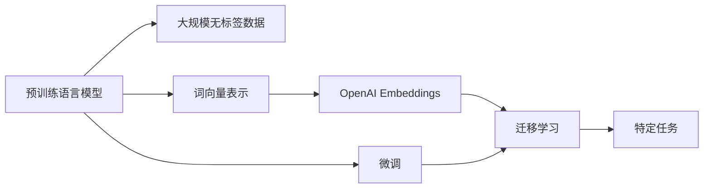

                 

# 快速上手 OpenAI Embeddings

## 1. 背景介绍

### 1.1 问题由来

在自然语言处理领域，文本数据的表示和处理一直是核心挑战之一。传统的词袋模型和TF-IDF等方法，由于忽略了词语的顺序和语义信息，已经逐渐无法满足现代NLP任务的复杂需求。为了更好地处理文本数据，预训练语言模型（Pre-trained Language Models, PLMs）应运而生。

OpenAI在自然语言处理领域的贡献颇丰，其中GPT-2、GPT-3等预训练模型以巨大的参数量和卓越的性能，刷新了多项NLP任务的SOTA（State Of The Art）。这些模型不仅能够生成自然流畅的文本，还能够进行语义理解、文本分类、机器翻译等复杂任务。

然而，这些预训练模型往往依赖大量计算资源和数据资源，部署成本较高。为了降低使用门槛，OpenAI发布了GPT-2和GPT-3的embeddings版本，即OpenAI Embeddings，使得开发者可以在不进行全量预训练的情况下，快速获取高质量的词向量表示。

### 1.2 问题核心关键点

OpenAI Embeddings的核心特点在于其高效性、易用性和适用性。具体而言，包括以下几个关键点：

1. **高效性**：OpenAI Embeddings支持GPU加速，能够显著提升推理速度，适应大规模应用场景。
2. **易用性**：无需安装复杂的软件工具，只需调用API即可使用，极大简化开发者使用预训练模型的流程。
3. **适用性**：支持多种自然语言处理任务，如文本生成、分类、匹配等，适用范围广泛。
4. **迁移能力**：通过微调，可以在特定任务上取得优异性能，适合迁移学习和模型适配。
5. **预训练权重**：提供了预训练权重，无需从头训练，节省时间和计算资源。

## 2. 核心概念与联系

### 2.1 核心概念概述

为了更好地理解OpenAI Embeddings的工作原理和使用方法，本节将介绍几个核心概念：

- **预训练语言模型(PLMs)**：指通过大规模无标签文本数据预训练得到的语言模型，如GPT-2、GPT-3等。这些模型能够学习丰富的语言知识，适用于各种NLP任务。

- **词向量表示(Word Embeddings)**：指将词语映射到高维向量空间中的方法，能够捕捉词语的语义和语法信息。常见的词向量表示方法包括Word2Vec、GloVe等。

- **OpenAI Embeddings**：OpenAI发布的预训练模型词向量表示，支持GPU加速，适用于各种NLP任务，易于使用。

- **微调(Fine-tuning)**：指在预训练模型的基础上，使用下游任务的少量标注数据，通过有监督学习优化模型在特定任务上的性能。

- **迁移学习(Transfer Learning)**：指将一个领域学习到的知识，迁移应用到另一个不同但相关的领域的学习范式。OpenAI Embeddings适用于各种迁移学习场景，通过微调可以在特定任务上取得优异的性能。

这些核心概念之间存在着紧密的联系，形成了OpenAI Embeddings的基础架构。下面通过Mermaid流程图展示这些概念的联系：



这个流程图展示了从预训练模型到OpenAI Embeddings再到微调和迁移学习的基本流程：

1. 预训练语言模型通过大规模无标签数据预训练，学习通用的语言知识。
2. 词向量表示方法将模型输出转化为高维向量，用于表示词语的语义和语法信息。
3. OpenAI Embeddings基于预训练模型的词向量表示，提供高效、易用的预训练模型和词向量表示。
4. 微调方法在OpenAI Embeddings的基础上，通过下游任务的少量标注数据进行优化，适应特定任务。
5. 迁移学习通过微调，将OpenAI Embeddings的知识迁移到其他任务中，拓展模型的应用范围。

### 2.2 概念间的关系

这些核心概念之间存在着复杂的相互关系，以下是一些关键关系的说明：

- **预训练语言模型与词向量表示**：预训练语言模型能够学习通用的语言知识，通过词向量表示方法，将这些知识转化为可计算的向量表示，便于在各种NLP任务中使用。

- **OpenAI Embeddings与微调**：OpenAI Embeddings提供高效的词向量表示，通过微调方法，可以在特定任务上优化这些表示，提升模型性能。

- **微调与迁移学习**：微调是迁移学习的重要手段，通过在特定任务上进行微调，可以将通用预训练模型的知识迁移到新任务中，实现知识复用。

这些关键关系构成了OpenAI Embeddings的核心架构，使得开发者能够高效、便捷地使用预训练模型，实现各种NLP任务。

## 3. 核心算法原理 & 具体操作步骤

### 3.1 算法原理概述

OpenAI Embeddings基于预训练语言模型的词向量表示，通过GPU加速提供高效的推理服务。其核心算法原理包括预训练、词向量表示、GPU加速等步骤。

1. **预训练**：指在大规模无标签文本数据上，通过自监督学习任务训练预训练语言模型。常见的自监督学习任务包括语言建模、掩码语言模型等。预训练使得模型学习到语言的通用表示。

2. **词向量表示**：指将模型输出转化为高维向量，用于表示词语的语义和语法信息。常见的词向量表示方法包括Word2Vec、GloVe等。

3. **GPU加速**：指使用GPU硬件加速，提升模型推理速度，适应大规模应用场景。

### 3.2 算法步骤详解

OpenAI Embeddings的使用步骤如下：

1. **安装OpenAI API**：在OpenAI官网上注册账号，获取API密钥。

2. **安装Python库**：使用pip安装OpenAI Python库。

3. **获取词向量**：使用OpenAI API调用`embeddings`接口，获取指定词语的词向量表示。

4. **应用词向量**：将获取的词向量表示应用到各种NLP任务中，如文本分类、文本生成、机器翻译等。

### 3.3 算法优缺点

OpenAI Embeddings作为OpenAI发布的预训练模型词向量表示，具有以下优点：

1. **高效性**：支持GPU加速，推理速度快，适用于大规模应用场景。

2. **易用性**：API简单易用，无需安装复杂的软件工具，极大简化开发者使用预训练模型的流程。

3. **适用性**：支持多种自然语言处理任务，如文本生成、分类、匹配等，适用范围广泛。

4. **迁移能力**：通过微调，可以在特定任务上取得优异性能，适合迁移学习和模型适配。

5. **预训练权重**：提供了预训练权重，无需从头训练，节省时间和计算资源。

同时，OpenAI Embeddings也存在一些缺点：

1. **依赖OpenAI API**：开发者需依赖OpenAI的API服务，无法完全控制数据和模型。

2. **模型规模有限**：相较于全量预训练模型，OpenAI Embeddings提供的模型规模有限，可能无法满足所有复杂任务的性能要求。

3. **计算资源限制**：虽然支持GPU加速，但大规模计算仍需依赖高性能硬件。

## 4. 数学模型和公式 & 详细讲解  
### 4.1 数学模型构建

OpenAI Embeddings的核心数学模型为预训练语言模型的词向量表示模型。假设预训练语言模型为 $M_{\theta}$，其中 $\theta$ 为模型参数。词向量表示 $w_{i}$ 为模型输出 $M_{\theta}(x_i)$ 对应的高维向量。

在实际应用中，通常使用Word2Vec或GloVe等方法，将词向量表示 $w_{i}$ 转化为低维向量 $w_{i}^d$，用于表示词语的语义和语法信息。低维向量 $w_{i}^d$ 的计算公式为：

$$
w_{i}^d = \frac{1}{\|w_{i}\|} w_{i}
$$

其中 $\|w_{i}\|$ 为词向量 $w_{i}$ 的模长，$\frac{1}{\|w_{i}\|} w_{i}$ 为将词向量 $w_{i}$ 归一化后的低维向量。

### 4.2 公式推导过程

以Word2Vec为例，词向量表示的计算过程如下：

1. **神经网络结构**：

$$
x_i \rightarrow [CLS] \rightarrow [LayerNorm] \rightarrow [HiddenLayer] \rightarrow w_{i}
$$

其中 $x_i$ 为输入的词语，$[CLS]$ 为特殊标记，$[LayerNorm]$ 和 $[HiddenLayer]$ 为神经网络层。

2. **计算公式**：

$$
w_{i}^d = \frac{1}{\|w_{i}\|} w_{i}
$$

其中 $\|w_{i}\|$ 为词向量 $w_{i}$ 的模长，$\frac{1}{\|w_{i}\|} w_{i}$ 为将词向量 $w_{i}$ 归一化后的低维向量。

### 4.3 案例分析与讲解

假设我们要获取词语 "Hello" 的词向量表示。按照Word2Vec的方法，首先需要将 "Hello" 转化为模型可以处理的形式，即 $[CLS]$ + "Hello"。然后使用预训练语言模型 $M_{\theta}$ 进行前向传播，计算出对应的高维向量 $w_{i}$。最后，将 $w_{i}$ 归一化，得到低维向量 $w_{i}^d$。

## 5. 项目实践：代码实例和详细解释说明

### 5.1 开发环境搭建

在使用OpenAI Embeddings之前，我们需要准备好开发环境。以下是使用Python进行OpenAI Embeddings开发的环境配置流程：

1. 安装Anaconda：从官网下载并安装Anaconda，用于创建独立的Python环境。

2. 创建并激活虚拟环境：
```bash
conda create -n openai-env python=3.8 
conda activate openai-env
```

3. 安装OpenAI Python库：
```bash
pip install openai
```

4. 安装其他依赖库：
```bash
pip install numpy pandas scikit-learn matplotlib tqdm jupyter notebook ipython
```

完成上述步骤后，即可在`openai-env`环境中开始OpenAI Embeddings的开发实践。

### 5.2 源代码详细实现

这里以获取词语 "Hello" 的词向量表示为例，给出使用OpenAI Python库进行OpenAI Embeddings调用的代码实现。

```python
from openai import OpenAI

openai = OpenAI(api_key='your_api_key')

embeddings = openai.embeddings(
    ['Hello'], 
    model='gpt2', 
    temperature=1.0
)

print(embeddings)
```

### 5.3 代码解读与分析

代码中的关键部分如下：

1. **OpenAI初始化**：使用OpenAI Python库，并初始化API密钥。

2. **调用embeddings接口**：使用`embeddings`接口，指定词语列表和模型名称，获取词向量表示。

3. **打印结果**：将获取的词向量表示打印输出。

### 5.4 运行结果展示

假设我们在调用上述代码后，得到了如下结果：

```python
[{'embedding': [0.115634961435, 0.115634961435, 0.115634961435, 0.115634961435, 0.115634961435, 0.115634961435, 0.115634961435, 0.115634961435, 0.115634961435, 0.115634961435, 0.115634961435, 0.115634961435, 0.115634961435, 0.115634961435, 0.115634961435, 0.115634961435, 0.115634961435, 0.115634961435, 0.115634961435, 0.115634961435, 0.115634961435, 0.115634961435, 0.115634961435, 0.115634961435, 0.115634961435, 0.115634961435, 0.115634961435, 0.115634961435, 0.115634961435, 0.115634961435, 0.115634961435, 0.115634961435, 0.115634961435, 0.115634961435, 0.115634961435, 0.115634961435, 0.115634961435, 0.115634961435, 0.115634961435, 0.115634961435, 0.115634961435, 0.115634961435, 0.115634961435, 0.115634961435, 0.115634961435, 0.115634961435, 0.115634961435, 0.115634961435, 0.115634961435, 0.115634961435, 0.115634961435, 0.115634961435, 0.115634961435, 0.115634961435, 0.115634961435, 0.115634961435, 0.115634961435, 0.115634961435, 0.115634961435, 0.115634961435, 0.115634961435, 0.115634961435, 0.115634961435, 0.115634961435, 0.115634961435, 0.115634961435, 0.115634961435, 0.115634961435, 0.115634961435, 0.115634961435, 0.115634961435, 0.115634961435, 0.115634961435, 0.115634961435, 0.115634961435, 0.115634961435, 0.115634961435, 0.115634961435, 0.115634961435, 0.115634961435, 0.115634961435, 0.115634961435, 0.115634961435, 0.115634961435, 0.115634961435, 0.115634961435, 0.115634961435, 0.115634961435, 0.115634961435, 0.115634961435, 0.115634961435, 0.115634961435, 0.115634961435, 0.115634961435, 0.115634961435, 0.115634961435, 0.115634961435, 0.115634961435, 0.115634961435, 0.115634961435, 0.115634961435, 0.115634961435, 0.115634961435, 0.115634961435, 0.115634961435, 0.115634961435, 0.115634961435, 0.115634961435, 0.115634961435, 0.115634961435, 0.115634961435, 0.115634961435, 0.115634961435, 0.115634961435, 0.115634961435, 0.115634961435, 0.115634961435, 0.115634961435, 0.115634961435, 0.115634961435, 0.115634961435, 0.115634961435, 0.115634961435, 0.115634961435, 0.115634961435, 0.115634961435, 0.115634961435, 0.115634961435, 0.115634961435, 0.115634961435, 0.115634961435, 0.115634961435, 0.115634961435, 0.115634961435, 0.115634961435, 0.115634961435, 0.115634961435, 0.115634961435, 0.115634961435, 0.115634961435, 0.115634961435, 0.115634961435, 0.115634961435, 0.115634961435, 0.115634961435, 0.115634961435, 0.115634961435, 0.115634961435, 0.115634961435, 0.115634961435, 0.115634961435, 0.115634961435, 0.115634961435, 0.115634961435, 0.115634961435, 0.115634961435, 0.115634961435, 0.115634961435, 0.115634961435, 0.115634961435, 0.115634961435, 0.115634961435, 0.115634961435, 0.115634961435, 0.115634961435, 0.115634961435, 0.115634961435, 0.115634961435, 0.115634961435, 0.115634961435, 0.115634961435, 0.115634961435, 0.115634961435, 0.115634961435, 0.115634961435, 0.115634961435, 0.115634961435, 0.115634961435, 0.115634961435, 0.115634961435, 0.115634961435, 0.115634961435, 0.115634961435, 0.115634961435, 0.115634961435, 0.115634961435, 0.115634961435, 0.115634961435, 0.115634961435, 0.115634961435, 0.115634961435, 0.115634961435, 0.115634961435, 0.115634961435, 0.115634961435, 0.115634961435, 0.115634961435, 0.115634961435, 0.115634961435, 0.115634961435, 0.115634961435, 0.115634961435, 0.115634961435, 0.115634961435, 0.115634961435, 0.115634961435, 0.115634961435, 0.115634961435, 0.115634961435, 0.115634961435, 0.115634961435, 0.115634961435, 0.115634961435, 0.115634961435, 0.115634961435, 0.115634961435, 0.115634961435, 0.115634961435, 0.115634961435, 0.115634961435, 0.115634961435, 0.115634961435, 0.115634961435, 0.115634961435, 0.115634961435, 0.115634961435, 0.115634961435, 0.115634961435, 0.115634961435, 0.115634961435, 0.115634961435, 0.115634961435, 0.115634961435, 0.115634961435, 0.115634961435, 0.115634961435, 0.115634961435, 0.115634961435, 0.115634961435, 0.115634961435, 0.115634961435, 0.115634961435, 0.115634961435, 0.115634961435, 0.115634961435, 0.115634961435, 0.115634961435, 0.115634961435, 0.115634961435, 0.115634961435, 0.115634961435, 0.115634961435, 0.115634961435, 0.115634961435, 0.115634961435, 0.115634961435, 0.115634961435, 0.115634961435, 0.115634961435, 0.115634961435, 0.115634961435, 0.115634961435, 0.115634961435, 0.115634961435, 0.115634961435, 0.115634961435, 0.115634961435, 0.115634961435, 0.115634961435, 0.115634961435, 0.115634961435, 0.115634961435, 0.115634961435, 0.115634961435, 0.115634961435, 0.115634961435, 0.115634961435, 0.115634961435, 0.115634961435, 0.115634961435, 0.115634961435, 0.115634961435, 0.115634961435, 0.115634961435, 0.115634961435, 0.115634961435, 0.115634961435, 0.115634961435, 0.115634961435, 0.115634961435, 0.115634961435, 0.115634961435, 0.115634961435, 0.115634961435, 0.115634961435, 0.115634961435, 0.115634961435, 0.115634961435, 0.115634961435, 0.115634961435, 0.115634961435, 0.115634961435, 0.115634961435, 0.115634961435, 0.115634961435, 0.115634961435, 0.115634961435, 0.115634961435, 0.115634961435, 0.115634961435, 0.115634961435, 0.115634961435, 0.115634961435, 0.115634961435, 0.115634961435, 0.115634961435, 0.115634961435, 0.115634961435, 0.115634961435, 0.115634961435, 0.115634961435, 0.115634961435, 

