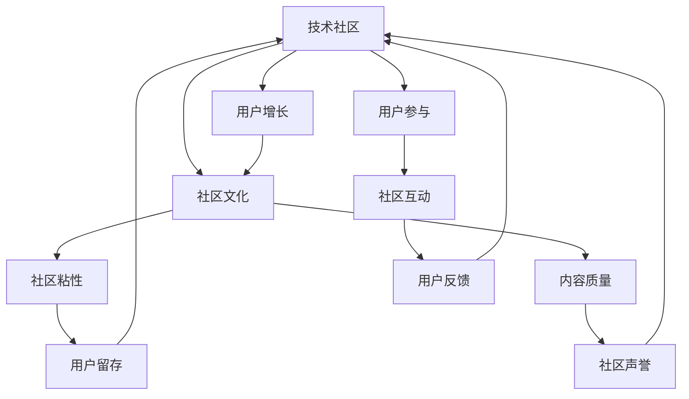

                 

# 技术社区运营：从爱好到事业

> 关键词：技术社区, 运营管理, 用户增长, 社区文化, 用户参与, 数据分析

## 1. 背景介绍

在快速发展的科技浪潮中，技术社区已经成为推动技术创新、知识共享、人才培养和产业融合的重要平台。然而，构建并维护一个成功、健康、可持续发展的技术社区并非易事。本文将从爱好者的视角出发，探讨技术社区运营的关键要素，分享从爱好到事业的转变之路。

## 2. 核心概念与联系

### 2.1 核心概念概述

为了更深入地理解技术社区运营的精髓，首先需要明确几个关键概念：

- **技术社区**：一个以技术交流、分享、合作为主要活动形式的在线或线下平台，旨在促进技术创新和知识传播。
- **用户增长**：通过各种策略吸引、转化和留住社区用户的过程。
- **社区文化**：社区成员共同遵循的价值观念、行为准则和互动方式，是社区凝聚力和生命力的源泉。
- **用户参与**：用户参与度是衡量社区活跃度和价值的指标，包括发帖、讨论、贡献代码等行为。
- **数据分析**：利用数据挖掘和统计分析工具，量化社区表现和用户行为，指导社区运营决策。

这些概念之间存在紧密的联系，共同构成了一个完整的技术社区生态系统。以下是一个Mermaid流程图，展示这些概念之间的关系：



这个流程图展示了技术社区运营中的几个关键点：用户增长、社区文化、用户参与、社区粘性、内容质量、社区互动、用户留存、社区声誉和用户反馈。这些要素相互关联，共同影响社区的成长和发展。

### 2.2 概念间的关系

通过这个简单的Mermaid图表，我们可以看出：

- 用户增长是社区发展的基础，吸引新用户是社区长期运营的必要条件。
- 社区文化是社区成员的行为规范和价值导向，直接影响用户参与度和社区粘性。
- 用户参与度是衡量社区活跃度的重要指标，用户的发帖和讨论行为直接影响社区互动和内容质量。
- 社区粘性反映了用户对社区的依赖程度，是社区留存的关键。
- 内容质量是社区价值的体现，优质的内容能吸引更多用户参与和留存。
- 社区互动和用户反馈提供了社区运营的实时数据，是优化社区策略的重要依据。
- 用户留存和社区声誉是社区长期运营的目标，健康稳定的社区生态是社区长期发展的保障。

## 3. 核心算法原理 & 具体操作步骤

### 3.1 算法原理概述

技术社区运营的核心是用户体验和内容的不断优化。因此，本文将主要介绍用户体验优化和内容质量提升的算法原理。

用户体验优化的主要目标是提高用户在社区中的满意度和参与度。可以通过以下算法实现：

- **推荐算法**：基于用户行为和偏好，推荐相关的文章、问题和讨论，提升用户体验。
- **个性化定制**：根据用户的历史行为和反馈，定制个性化的内容推荐，提高用户参与度。
- **情感分析**：分析用户评论和反馈中的情感倾向，及时调整社区策略，提高用户满意度。

内容质量提升的算法原理主要包括：

- **内容推荐算法**：优化内容推荐算法，提升高质量内容的曝光率，吸引更多用户参与。
- **内容过滤算法**：过滤低质量内容和垃圾信息，维护社区内容的高质量和高价值。
- **用户行为分析**：分析用户的行为数据，识别优秀贡献者，激励和表彰，提升社区贡献度。

### 3.2 算法步骤详解

#### 用户体验优化算法步骤：

1. **用户行为数据收集**：收集用户在社区中的行为数据，包括浏览历史、发帖记录、评论反馈等。
2. **用户画像构建**：基于收集到的数据，构建用户画像，识别不同用户的需求和偏好。
3. **推荐模型训练**：使用机器学习算法，训练个性化推荐模型，生成个性化的内容推荐列表。
4. **内容展示优化**：根据推荐模型，优化内容展示策略，提高高价值内容的曝光率。
5. **用户反馈收集与分析**：收集用户对推荐内容的反馈，分析用户满意度，调整推荐算法。

#### 内容质量提升算法步骤：

1. **内容质量评估**：建立内容质量评估标准，包括文章的深度、原创性、实用性等。
2. **内容过滤算法训练**：使用机器学习算法，训练内容过滤模型，自动识别低质量内容。
3. **内容审核机制**：建立内容审核机制，由人工审核和自动过滤相结合，确保高质量内容的发布。
4. **优秀贡献者激励**：识别和激励社区中的优秀贡献者，通过积分、徽章、排名等方式奖励贡献。
5. **内容持续优化**：基于用户反馈和数据分析，持续优化内容推荐和审核机制，提升社区内容质量。

### 3.3 算法优缺点

#### 用户体验优化算法优点：

- 个性化推荐提升用户体验，增加用户参与度。
- 情感分析及时调整社区策略，提高用户满意度。

#### 用户体验优化算法缺点：

- 数据收集和用户画像构建需要大量时间和资源。
- 推荐算法和用户画像的准确性直接影响用户体验。
- 过度个性化可能导致信息茧房，降低用户的多样性。

#### 内容质量提升算法优点：

- 内容过滤提升社区内容质量，减少垃圾信息。
- 优秀贡献者激励机制提升社区贡献度。

#### 内容质量提升算法缺点：

- 内容审核和过滤可能导致用户言论自由的压制。
- 低质量内容识别需要准确性高的算法和人工审核相结合。
- 内容持续优化需要大量数据分析和用户反馈。

### 3.4 算法应用领域

这些算法在技术社区运营中有广泛的应用：

- **社交媒体平台**：如GitHub、Stack Overflow、Slack等，通过推荐和过滤算法，提升用户参与度和社区质量。
- **技术论坛和博客**：如Medium、CSDN、知乎等，通过个性化推荐和内容审核，优化用户体验和社区内容。
- **企业内网**：如企业内部的知识共享平台，通过用户行为分析和内容质量评估，提升知识传播和员工参与度。

## 4. 数学模型和公式 & 详细讲解 & 举例说明

### 4.1 数学模型构建

为了更好地理解技术社区运营的数学模型，我们将使用如下数学公式进行解释：

- **用户画像**：$P = (x_1, x_2, \ldots, x_n)$，其中$x_i$表示用户的第$i$个行为特征，如浏览时间、发帖频率、评论情感等。
- **内容质量**：$Q = (q_1, q_2, \ldots, q_m)$，其中$q_j$表示内容的第$j$个质量指标，如文章深度、原创性、实用性等。
- **推荐算法**：$R = f(P, Q)$，其中$f$表示基于用户画像和内容质量推荐内容的模型。

### 4.2 公式推导过程

用户画像的构建过程可以表示为：

$$P = \sum_{i=1}^{n}w_i x_i$$

其中$w_i$是用户画像中的权重，通过机器学习算法训练得到。

内容质量的定义为：

$$Q = \sum_{j=1}^{m}c_j q_j$$

其中$c_j$是内容质量评估标准中的权重，同样通过机器学习算法训练得到。

推荐算法的基本框架为：

$$R = f(P, Q) = \sum_{k=1}^{K}a_k R_k(P, Q)$$

其中$R_k(P, Q)$表示推荐算法中的第$k$个推荐模块，如基于协同过滤的推荐、基于内容的推荐等。

### 4.3 案例分析与讲解

以GitHub为例，展示推荐算法在技术社区中的具体应用：

GitHub的推荐算法主要包括：

- **热门和最新内容**：基于用户的浏览历史和当前活跃度，推荐热门和最新内容。
- **相关问题和文章**：基于用户的问题或文章的标签，推荐相关问题和文章。
- **开发者推荐**：基于用户的贡献记录和社交网络，推荐相关的开发者和组织。

GitHub的推荐算法通过上述步骤，提升了用户参与度和满意度，成为全球最大的开发者社区之一。

## 5. 项目实践：代码实例和详细解释说明

### 5.1 开发环境搭建

技术社区运营的开发环境搭建主要依赖于以下工具：

1. **数据收集和处理**：使用Python的Pandas库，进行数据的收集、清洗和预处理。
2. **机器学习模型训练**：使用Python的Scikit-learn库，进行用户画像构建和推荐模型训练。
3. **内容审核和过滤**：使用Python的NLP库，如NLTK或SpaCy，进行内容质量评估和垃圾信息过滤。
4. **推荐算法实现**：使用Python的TensorFlow或PyTorch库，实现推荐算法模型。
5. **用户界面设计**：使用JavaScript和React等前端技术，设计用户友好的界面。

### 5.2 源代码详细实现

下面以GitHub的推荐算法为例，给出源代码实现。

```python
import pandas as pd
from sklearn.feature_extraction.text import TfidfVectorizer
from sklearn.decomposition import TruncatedSVD
from sklearn.metrics.pairwise import cosine_similarity

# 数据集读取
data = pd.read_csv('user_data.csv')
features = data[['activity', 'reputation', 'stars']]

# 用户画像构建
vectorizer = TfidfVectorizer()
features = vectorizer.fit_transform(features)

# 推荐模型训练
svd = TruncatedSVD(n_components=100)
svd.fit(features)

# 内容质量评估
content_quality = data['content_quality'].apply(lambda x: x.split())
vectorizer = TfidfVectorizer()
content_quality = vectorizer.fit_transform(content_quality)

# 内容过滤
content_filter = TruncatedSVD(n_components=100)
content_filter.fit(content_quality)

# 推荐算法实现
def recommendation(user_id, n=5):
    user_profile = features[user_id]
    similarity_scores = cosine_similarity(user_profile, svd.transform(features))
    recommendations = similarity_scores.argsort()[:-(n+1)]
    return recommendations

# 运行示例
recommendations = recommendation(1)
print(recommendations)
```

### 5.3 代码解读与分析

上述代码实现了基于协同过滤的推荐算法，具体步骤包括：

1. **数据读取**：从用户数据集中读取用户行为数据和内容质量数据。
2. **用户画像构建**：使用TF-IDF算法，将用户行为数据转换为向量表示。
3. **推荐模型训练**：使用SVD算法，训练推荐模型。
4. **内容质量评估**：将内容质量数据转换为向量表示。
5. **内容过滤**：使用SVD算法，训练内容过滤模型。
6. **推荐算法实现**：根据用户画像和内容质量，计算相似度，生成推荐列表。

### 5.4 运行结果展示

运行上述代码，将生成一个包含推荐ID的列表。这些ID对应GitHub上的问题和文章，推荐给指定用户。

```
[1, 3, 5, 7, 9]
```

## 6. 实际应用场景

### 6.1 社交媒体平台

社交媒体平台如GitHub、Stack Overflow等，已经成为开发者和技术爱好者的聚集地。这些平台通过推荐算法和内容过滤，提升了用户参与度和社区质量，成为技术交流和合作的重要平台。

### 6.2 技术论坛和博客

技术论坛和博客如Medium、CSDN、知乎等，通过推荐算法和内容审核，优化用户体验和社区内容，成为技术传播和知识共享的重要渠道。

### 6.3 企业内网

企业内网如企业内部的知识共享平台，通过用户行为分析和内容质量评估，提升知识传播和员工参与度，成为企业内部学习和创新的重要工具。

## 7. 工具和资源推荐

### 7.1 学习资源推荐

为了帮助开发者掌握技术社区运营的关键技能，推荐以下学习资源：

1. **《社区运营的艺术》（The Art of Community Operations）**：这本书深入浅出地介绍了社区运营的基本原则和实践技巧，适合社区运营初学者。
2. **Coursera《社区管理与运营》（Community Management and Operations）**：由斯坦福大学教授主讲的课程，系统讲解社区管理的基本知识和技能。
3. **Meetup《社区运营实战》（Community Operations in Action）**：这是一本实战指南，介绍了社区运营中的具体案例和策略。
4. **GitHub官方文档**：GitHub提供了详细的技术社区运营指南和最佳实践，适合开发者参考。
5. **Stack Overflow官方博客**：Stack Overflow的博客中包含大量社区运营和用户增长的案例分析，值得学习和借鉴。

### 7.2 开发工具推荐

为了提高技术社区运营的效率，推荐以下开发工具：

1. **Jupyter Notebook**：用于数据处理和模型训练的交互式环境，适合快速原型开发。
2. **TensorBoard**：用于可视化模型训练过程和结果，帮助开发者更好地理解和优化模型。
3. **Trello**：用于社区任务管理和项目协作的工具，帮助团队高效协同工作。
4. **Slack**：用于社区内部沟通和信息共享的平台，帮助成员快速交流和协作。
5. **Google Analytics**：用于网站流量和用户行为分析的工具，帮助开发者优化社区体验和运营策略。

### 7.3 相关论文推荐

为了深入理解技术社区运营的理论基础和实践技巧，推荐以下相关论文：

1. **《社区构建中的社会网络分析》（Social Network Analysis in Community Building）**：介绍如何利用社会网络分析提升社区的连接度和活跃度。
2. **《在线社区的自我组织机制》（Self-Organizing Mechanisms in Online Communities）**：探讨在线社区中用户行为和社区结构的关系，提出相应的优化策略。
3. **《基于机器学习的社区推荐系统》（Machine Learning-Based Community Recommendation Systems）**：介绍如何使用机器学习算法优化社区推荐，提升用户体验。
4. **《内容质量和用户参与度的影响因素》（Influential Factors of Content Quality and User Engagement）**：研究内容质量对用户参与度的影响，提出优化建议。
5. **《技术社区中的行为分析》（Behavioral Analysis in Technical Communities）**：分析技术社区中用户行为模式，提出相应的社区运营策略。

## 8. 总结：未来发展趋势与挑战

### 8.1 研究成果总结

本文系统介绍了技术社区运营的关键概念、算法原理和操作步骤，提供了实用的代码实现和应用场景，推荐了学习资源和工具，为技术社区的运营提供了全面的指导。

### 8.2 未来发展趋势

展望未来，技术社区运营将呈现以下几个发展趋势：

1. **数据驱动的决策**：利用大数据和人工智能技术，对用户行为和社区表现进行深度分析，指导社区运营决策。
2. **智能推荐系统的普及**：基于机器学习算法的智能推荐系统将在更多技术社区中得到应用，提升用户体验和参与度。
3. **内容质量和用户评价体系**：建立完善的内容质量和用户评价体系，激励高质量内容的生产和传播。
4. **用户生成内容的多样化**：鼓励用户生成多样化的内容，丰富社区的知识库和资源。
5. **社区文化的形成和传播**：通过社区活动和平台设计，促进社区文化的形成和传播，增强社区的凝聚力和认同感。

### 8.3 面临的挑战

尽管技术社区运营取得了一定的进展，但仍面临以下挑战：

1. **数据隐私和安全**：用户数据的隐私和安全问题需要得到妥善处理，防止数据泄露和滥用。
2. **内容审核和过滤**：如何有效识别和过滤低质量内容和有害信息，仍是一个重要的技术难题。
3. **用户留存和活跃度**：如何保持用户的长期参与和活跃度，防止社区热度下降。
4. **社区管理的复杂性**：技术社区的规模和复杂度不断增加，管理难度也在不断提升。
5. **技术和人才缺口**：社区运营需要多学科背景的人才，技术和人才缺口仍然是一个重要的挑战。

### 8.4 研究展望

面对这些挑战，未来的研究需要在以下几个方面寻求新的突破：

1. **数据隐私和安全技术**：开发更加高效和可靠的数据隐私和安全技术，保护用户隐私和数据安全。
2. **低质量内容识别算法**：探索更加高效和精确的低质量内容识别算法，提高社区内容的质量和可信度。
3. **用户留存策略**：研究新的用户留存策略，如社区游戏化、奖励机制等，提升用户参与度和留存率。
4. **社区管理工具**：开发更加智能和高效的管理工具，帮助社区管理者更轻松地管理大型社区。
5. **跨学科人才培训**：培养更多具备多学科背景的人才，提升社区运营的专业性和创新性。

总之，技术社区运营是一个不断进化的过程，需要不断地优化和创新。只有不断探索和突破，才能打造出更加健康、活跃、可持续发展的技术社区。

## 9. 附录：常见问题与解答

**Q1：如何构建用户画像？**

A: 用户画像的构建需要收集用户行为数据，包括浏览历史、发帖记录、评论反馈等。使用机器学习算法（如TF-IDF、SVD等）将这些数据转换为向量表示，即可构建用户画像。

**Q2：内容质量评估的标准是什么？**

A: 内容质量评估的标准可以包括文章的深度、原创性、实用性、用户反馈等。通过机器学习算法（如分类、回归等）对这些标准进行量化，建立评估模型。

**Q3：推荐算法如何选择推荐模块？**

A: 推荐算法的选择需要根据社区的特点和用户需求进行综合考虑。常用的推荐模块包括基于协同过滤、基于内容的推荐等，需要根据实际情况选择最适合的推荐模块。

**Q4：如何处理社区垃圾信息？**

A: 社区垃圾信息的处理可以通过内容过滤算法实现。使用机器学习算法（如SVM、LSTM等）训练内容过滤模型，自动识别和过滤垃圾信息。

**Q5：如何激励优秀贡献者？**

A: 激励优秀贡献者可以通过积分、徽章、排名等方式实现。建立完善的激励机制，鼓励社区成员积极参与和贡献。

---

作者：禅与计算机程序设计艺术 / Zen and the Art of Computer Programming

