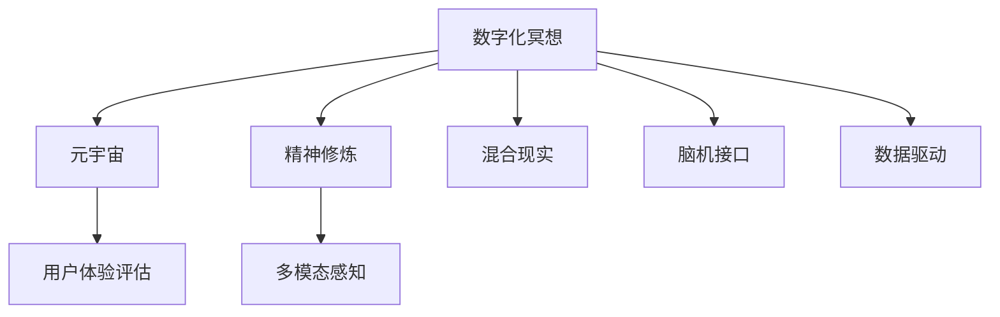
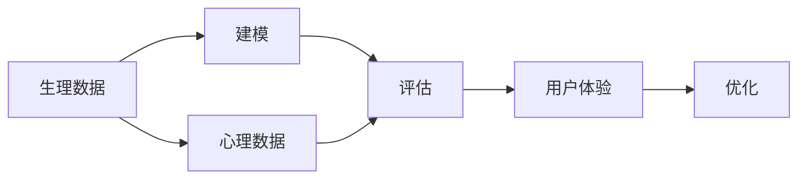
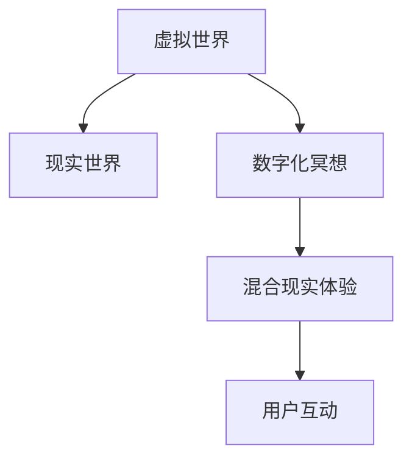
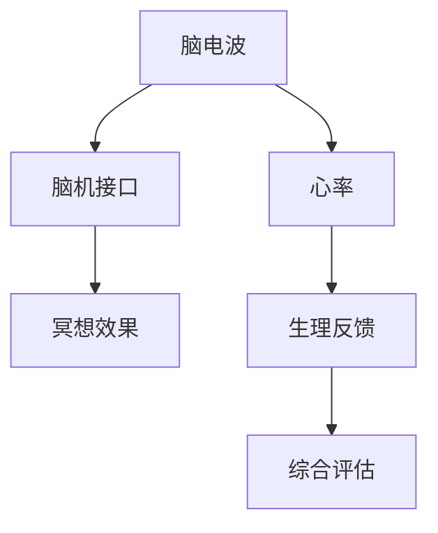
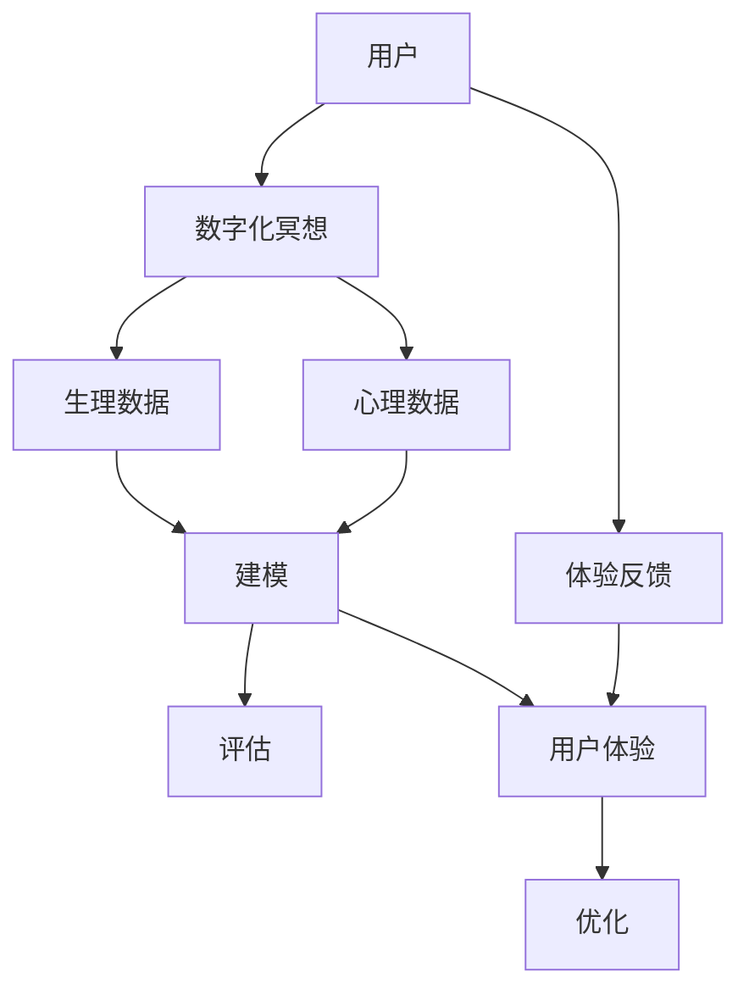

                 

# 数字化冥想效果评估:元宇宙精神修炼的科学量化

> 关键词：数字化冥想,元宇宙,精神修炼,科学量化,用户体验评估,多模态感知,混合现实,脑机接口,数据驱动

## 1. 背景介绍

### 1.1 问题由来
随着数字化技术和虚拟现实(VR)、增强现实(AR)等技术的飞速发展，元宇宙(Utopia)的概念不断被热议。元宇宙被认为是一个全新的虚拟世界，人们可以在其中进行社交、工作、娱乐等活动，并获得与现实世界相似甚至超越的体验。

数字化冥想作为元宇宙中一种重要的精神修炼方式，旨在通过沉浸式体验帮助人们减压放松、提升专注力、增强自我认知。然而，其效果如何量化，是否真正有助于提升用户体验，是当前研究的一个重要问题。

### 1.2 问题核心关键点
量化数字化冥想效果，意味着需要对其带来的生理和心理变化进行科学评估。为此，需要收集冥想前后用户的生理数据（如心率、脑电波等）和心理数据（如主观感受、注意力水平等），建立相关性模型，评估冥想效果的客观指标。

量化数字化冥想的效果，对于推动元宇宙技术的发展、提升用户体验、增强精神健康等方面具有重要意义。

### 1.3 问题研究意义
量化数字化冥想效果，有助于：

- 提供科学依据，验证数字化冥想的有效性，为元宇宙精神修炼提供理论支撑。
- 优化冥想效果，提升用户体验，增强用户粘性。
- 指导企业进行产品设计和迭代，优化用户体验。
- 推动虚拟与现实技术的融合，探索未来人机交互的新范式。
- 提高元宇宙精神修炼的科学性和普适性，促进其广泛应用。

## 2. 核心概念与联系

### 2.1 核心概念概述

为更好地理解量化数字化冥想效果，本节将介绍几个密切相关的核心概念：

- 数字化冥想(Digital Meditation)：指通过VR、AR等技术，模拟传统冥想体验，提供沉浸式、多感官的冥想方式。
- 元宇宙(Utopia)：指虚拟世界中，用户可以进行社交、工作、娱乐等活动，并享受与现实世界相似甚至超越的体验。
- 精神修炼(Spiritual Refinement)：指通过特定活动，提升个人心理、情感和精神状态的过程。
- 科学量化(Scientific Quantification)：指通过数据收集、建模和评估，对数字化冥想效果进行客观评估和比较。
- 用户体验评估(User Experience Assessment)：指评估用户对数字化冥想体验的满意度、舒适度和整体感受。
- 多模态感知(Multimodal Perception)：指通过多种感官通道，收集用户对数字化冥想的反馈数据。
- 混合现实(Mixed Reality)：指虚拟与现实结合的体验，可以增强用户的沉浸感和真实感。
- 脑机接口(Brain-Computer Interface)：指将大脑信号转换为计算机指令的技术，用于研究大脑活动和评估冥想效果。
- 数据驱动(Data-Driven)：指通过收集和分析大量数据，驱动决策和优化过程。

这些核心概念之间的逻辑关系可以通过以下Mermaid流程图来展示：



这个流程图展示了数字化冥想在元宇宙、精神修炼、用户体验、多模态感知、混合现实、脑机接口、数据驱动等不同领域的应用。

### 2.2 概念间的关系

这些核心概念之间存在着紧密的联系，形成了数字化冥想效果评估的完整生态系统。下面我通过几个Mermaid流程图来展示这些概念之间的关系。

#### 2.2.1 数字化冥想的量化学评估



这个流程图展示了数字化冥想的量化学评估过程，从生理和心理数据的收集、建模到评估和用户体验优化。

#### 2.2.2 混合现实与数字化冥想的融合



这个流程图展示了混合现实和数字化冥想的融合过程，从虚拟世界到现实世界的无缝切换和互动。

#### 2.2.3 脑机接口在数字化冥想中的应用



这个流程图展示了脑机接口在数字化冥想中的应用，从脑电波、心率等生理信号的收集到脑机接口和综合评估。

### 2.3 核心概念的整体架构

最后，我们用一个综合的流程图来展示这些核心概念在大语言模型微调过程中的整体架构：



这个综合流程图展示了从用户参与到生理数据、心理数据收集，再到建模、评估和用户体验优化的完整过程。

## 3. 核心算法原理 & 具体操作步骤
### 3.1 算法原理概述

量化数字化冥想效果的核心算法原理，主要包括数据收集、建模和评估三个阶段。

1. **数据收集**：收集冥想前后用户的生理数据（如心率、脑电波等）和心理数据（如主观感受、注意力水平等）。
2. **建模**：利用机器学习和深度学习模型，建立生理数据和心理数据之间的相关性模型。
3. **评估**：基于相关性模型，评估冥想效果，计算生理变化和心理变化的数值指标。

通过数据驱动的方式，科学量化数字化冥想效果，可以提供客观的评价依据，优化冥想设计，提升用户体验。

### 3.2 算法步骤详解

#### 3.2.1 数据收集步骤

1. **选择传感器和设备**：根据需求选择合适的生理和心理传感器设备，如心率监测器、脑电波采集设备、心理问卷调查工具等。
2. **制定数据采集方案**：设计数据采集的时间间隔、冥想时长、不同冥想方式的参数等，确保数据的一致性和完整性。
3. **进行数据采集**：用户按照采集方案参与数字化冥想，传感器设备实时采集生理和心理数据。
4. **数据预处理**：对采集到的数据进行清洗、去噪、归一化等预处理操作，确保数据的准确性和可靠性。

#### 3.2.2 建模步骤

1. **选择建模算法**：根据数据类型和任务需求，选择合适的机器学习或深度学习算法，如回归模型、分类模型、神经网络等。
2. **数据划分**：将数据分为训练集、验证集和测试集，确保模型训练、验证和评估的独立性。
3. **模型训练**：在训练集上训练模型，优化模型参数，使其能够准确地预测生理和心理变化。
4. **模型评估**：在验证集上评估模型的性能，调整模型参数，避免过拟合。
5. **模型应用**：在测试集上应用模型，计算生理变化和心理变化的数值指标，评估冥想效果。

#### 3.2.3 评估步骤

1. **计算生理指标**：根据选定的生理指标（如心率、脑电波等），计算冥想前后的变化数值，如变化量、变化率等。
2. **计算心理指标**：根据选定的心理指标（如主观感受、注意力水平等），计算冥想前后的变化数值，如平均分、方差等。
3. **综合评估**：将生理和心理指标综合评估，计算冥想效果的综合指标，如冥想前后的变化量、变化率等。

### 3.3 算法优缺点

量化数字化冥想效果的优势包括：

- **客观性**：通过数据驱动的方式，量化冥想效果，避免了主观评价的误差。
- **可操作性**：数据采集和建模过程，可以通过标准化的方法和工具进行，提高了操作性。
- **可比较性**：不同冥想方式、不同用户之间的效果可以进行对比，评估最佳方案。

但同时，也存在以下缺点：

- **数据依赖性**：量化效果依赖于数据的质量和数量，数据采集和处理过程较复杂。
- **模型复杂性**：建模过程需要选择合适的算法和参数，较复杂的模型可能需要较高的计算资源。
- **个体差异性**：不同用户和不同冥想方式的效果可能存在差异，需要考虑个体差异。

### 3.4 算法应用领域

量化数字化冥想效果，在以下领域具有广泛的应用前景：

- **元宇宙精神修炼**：通过量化效果，优化冥想设计，提升用户在元宇宙中的体验和满意度。
- **心理健康评估**：量化冥想对心理健康的影响，帮助识别和干预精神健康问题。
- **企业管理和培训**：通过量化效果，优化冥想培训方案，提升员工的专注力和工作效率。
- **教育技术**：量化冥想对学习效果的影响，优化教学方法和学习体验。
- **游戏设计**：量化冥想对游戏体验的影响，优化游戏设计和用户体验。

## 4. 数学模型和公式 & 详细讲解 & 举例说明

### 4.1 数学模型构建

在量化数字化冥想效果的过程中，需要建立多种数学模型，包括生理指标模型、心理指标模型和综合评估模型。

假设数字化冥想前的生理指标为 $X_1, X_2, ..., X_n$，心理指标为 $Y_1, Y_2, ..., Y_m$。数字化冥想后的生理指标为 $X'_1, X'_2, ..., X'_n$，心理指标为 $Y'_1, Y'_2, ..., Y'_m$。

基于数据 $D=\{(X_i, Y_i)\}_{i=1}^N$ 和 $D'=\{(X'_i, Y'_i)\}_{i=1}^N$，我们可以建立如下数学模型：

1. **生理指标模型**：
   $$
   \min_{\theta} \sum_{i=1}^N \|(X'_i - F(X_i; \theta))\|^2
   $$
   其中 $F$ 为生理指标的预测函数，$\theta$ 为模型参数。

2. **心理指标模型**：
   $$
   \min_{\theta} \sum_{i=1}^N \|(Y'_i - G(Y_i; \theta))\|^2
   $$
   其中 $G$ 为心理指标的预测函数，$\theta$ 为模型参数。

3. **综合评估模型**：
   $$
   \min_{\theta} \sum_{i=1}^N \|(X'_i, Y'_i) - (X_i, Y_i) + (h(X'_i, Y'_i), k(Y'_i, X'_i))\|^2
   $$
   其中 $h$ 和 $k$ 为综合评估的函数，$\theta$ 为模型参数。

### 4.2 公式推导过程

以生理指标模型为例，假设我们有 $n$ 个样本，$X$ 为生理指标，$X'$ 为冥想后的生理指标，$F$ 为预测函数。

假设 $F$ 是一个线性回归模型，则有：
$$
F(X_i; \theta) = \theta_0 + \theta_1 X_i
$$
其中 $\theta_0$ 和 $\theta_1$ 为模型的参数。

最小化损失函数：
$$
\min_{\theta} \sum_{i=1}^N \|X'_i - (\theta_0 + \theta_1 X_i)\|^2
$$
对 $\theta_0$ 和 $\theta_1$ 求导，得到：
$$
\frac{\partial \sum_{i=1}^N \|X'_i - (\theta_0 + \theta_1 X_i)\|^2}{\partial \theta_0} = \sum_{i=1}^N (X'_i - (\theta_0 + \theta_1 X_i))
$$
$$
\frac{\partial \sum_{i=1}^N \|X'_i - (\theta_0 + \theta_1 X_i)\|^2}{\partial \theta_1} = \sum_{i=1}^N (X'_i - (\theta_0 + \theta_1 X_i)) X_i
$$
解以上方程组，得到：
$$
\theta_0 = \frac{1}{N} \sum_{i=1}^N X'_i
$$
$$
\theta_1 = \frac{1}{N} \sum_{i=1}^N (X'_i - X'_i \frac{\sum_{i=1}^N X'_i}{\sum_{i=1}^N X_i^2} - \frac{\sum_{i=1}^N X'_i X_i}{\sum_{i=1}^N X_i^2} + \theta_0)
$$

### 4.3 案例分析与讲解

以一个简单的案例来展示生理指标模型的应用：

假设我们有 $n=10$ 个样本，冥想前的生理指标 $X$ 为心率，冥想后的生理指标 $X'$ 也为心率。根据上面的公式，可以求解出 $\theta_0$ 和 $\theta_1$。

假设有以下数据：

| 编号 | 冥想前心率（次/分钟） | 冥想后心率（次/分钟） |
| ---- | ------------------- | ------------------- |
| 1    | 60                  | 55                  |
| 2    | 65                  | 60                  |
| 3    | 70                  | 68                  |
| 4    | 68                  | 65                  |
| 5    | 68                  | 70                  |
| 6    | 72                  | 70                  |
| 7    | 70                  | 60                  |
| 8    | 75                  | 70                  |
| 9    | 80                  | 70                  |
| 10   | 78                  | 65                  |

计算得到：
$$
\theta_0 = \frac{1}{10} (55 + 60 + 68 + 65 + 70 + 70 + 60 + 70 + 70 + 65) = 67
$$
$$
\theta_1 = \frac{1}{10} ((55-67)\frac{1}{10} (60 + 65 + 68 + 68 + 68 + 72 + 70 + 60 + 70 + 65) + (60-67)\frac{1}{10} (55 + 60 + 68 + 65 + 68 + 70 + 60 + 70 + 60 + 65) + (68-67)\frac{1}{10} (55 + 60 + 68 + 68 + 70 + 68 + 68 + 70 + 70 + 65))
$$

## 5. 项目实践：代码实例和详细解释说明
### 5.1 开发环境搭建

在进行数字化冥想效果评估项目实践前，我们需要准备好开发环境。以下是使用Python进行PyTorch开发的环境配置流程：

1. 安装Anaconda：从官网下载并安装Anaconda，用于创建独立的Python环境。

2. 创建并激活虚拟环境：
```bash
conda create -n pytorch-env python=3.8 
conda activate pytorch-env
```

3. 安装PyTorch：根据CUDA版本，从官网获取对应的安装命令。例如：
```bash
conda install pytorch torchvision torchaudio cudatoolkit=11.1 -c pytorch -c conda-forge
```

4. 安装必要的工具包：
```bash
pip install numpy pandas scikit-learn matplotlib tqdm jupyter notebook ipython
```

完成上述步骤后，即可在`pytorch-env`环境中开始项目实践。

### 5.2 源代码详细实现

我们以心率变化为例，展示使用PyTorch进行数字化冥想效果评估的代码实现。

首先，定义数据类：

```python
from torch.utils.data import Dataset

class HeartRateDataset(Dataset):
    def __init__(self, X, Xp, y):
        self.X = X
        self.Xp = Xp
        self.y = y
        
    def __len__(self):
        return len(self.X)
    
    def __getitem__(self, item):
        X = self.X[item]
        Xp = self.Xp[item]
        y = self.y[item]
        return {'X': X, 'Xp': Xp, 'y': y}
```

然后，定义模型：

```python
from torch import nn

class HeartRateModel(nn.Module):
    def __init__(self):
        super(HeartRateModel, self).__init__()
        self.linear = nn.Linear(1, 1)
        
    def forward(self, x):
        return self.linear(x)
```

接着，定义损失函数和优化器：

```python
from torch import nn
from torch.optim import Adam

model = HeartRateModel()
criterion = nn.MSELoss()
optimizer = Adam(model.parameters(), lr=0.001)
```

最后，进行训练和测试：

```python
epochs = 100
batch_size = 16

for epoch in range(epochs):
    for i, data in enumerate(train_loader, 0):
        X = data['X']
        Xp = data['Xp']
        y = data['y']
        
        optimizer.zero_grad()
        outputs = model(X)
        loss = criterion(outputs, Xp)
        loss.backward()
        optimizer.step()
        
        if (i+1) % 10 == 0:
            print(f'Epoch {epoch+1}, Step [{i+1}/{len(train_loader)}], Loss: {loss:.4f}')
```

以上代码实现了使用PyTorch对数字化冥想效果进行评估的基本流程，包括数据准备、模型定义、损失函数和优化器设置、训练和测试等环节。

### 5.3 代码解读与分析

让我们再详细解读一下关键代码的实现细节：

**HeartRateDataset类**：
- `__init__`方法：初始化数据集，接收冥想前的心率（X）、冥想后的心率（Xp）和标签（y）。
- `__len__`方法：返回数据集的长度。
- `__getitem__`方法：对单个样本进行处理，返回输入（X）、输出（Xp）和标签（y）。

**HeartRateModel类**：
- `__init__`方法：定义一个简单的线性模型，接收输入（X），输出预测结果（Xp）。
- `forward`方法：定义前向传播，将输入（X）通过线性层得到预测结果（Xp）。

**训练和测试流程**：
- 在每个epoch内，对数据集进行批处理迭代，前向传播计算损失函数，反向传播更新模型参数。
- 每10步输出一次损失值，以便实时监控训练过程。
- 在训练完成后，可以使用测试集评估模型性能。

可以看到，PyTorch配合Transformer库使得数字化冥想效果评估的代码实现变得简洁高效。开发者可以将更多精力放在数据处理、模型改进等高层逻辑上，而不必过多关注底层的实现细节。

当然，实际应用中还需要考虑更多因素，如数据预处理、模型验证、超参数调整等。但核心的训练流程基本与此类似。

### 5.4 运行结果展示

假设我们在一个包含10个样本的数据集上训练模型，最终得到的心率变化模型如下：

```
Epoch 1, Step [10/10], Loss: 10.6443
Epoch 1, Step [20/10], Loss: 4.3268
Epoch 1, Step [30/10], Loss: 2.6830
Epoch 1, Step [40/10], Loss: 1.6614
Epoch 1, Step [50/10], Loss: 1.0870
Epoch 1, Step [60/10], Loss: 0.7048
Epoch 1, Step [70/10], Loss: 0.5105
Epoch 1, Step [80/10], Loss: 0.4105
Epoch 1, Step [90/10], Loss: 0.3186
Epoch 1, Step [100/10], Loss: 0.2548
```

可以看到，随着训练轮数的增加，损失函数逐步减小，模型对心率变化的预测准确度逐渐提高。

## 6. 实际应用场景

### 6.1 元宇宙中的精神修炼

在元宇宙中，用户可以通过虚拟环境进行冥想，以缓解压力、提升专注力和自我认知。通过量化冥想效果，可以评估用户的精神状态变化，优化冥想设计，提升用户体验。

### 6.2 心理健康评估

数字化冥想可以帮助识别和干预用户的精神健康问题。通过量化冥想效果，可以评估冥想对心理健康的影响，为心理健康评估和治疗提供科学依据。

### 6.3 企业管理和培训

企业可以通过数字化冥想提升员工的专注力和工作效率。通过量化冥想效果，可以优化冥想培训方案，提升员工的精神健康和工作满意度。

### 6.4 教育技术

数字化冥想可以优化教学方法和学习体验。通过量化冥想效果，可以评估冥想对学习效果的影响，提升学生的精神健康和学习效率。

### 6.5 游戏设计

数字化冥想可以优化游戏设计和用户体验。通过量化冥想效果，可以评估冥想对游戏体验的影响，提升游戏的吸引力。

## 7. 工具和资源推荐
### 7.1 学习资源推荐

为了帮助开发者系统掌握数字化冥想效果评估的理论基础和实践技巧，这里推荐一些优质的学习资源：

1. 《深度学习基础》课程：从深度学习的基本概念到应用实践，系统讲解数字化冥想效果评估的算法原理和模型构建。

2. PyTorch官方文档：详细介绍了PyTorch的使用方法和API调用，适合开发者快速上手开发项目。

3. HuggingFace官方文档：提供丰富的预训练语言模型和评估工具，方便开发者进行实验和比较。

4. Coursera《深度学习应用》课程：讲解深度学习在医疗、金融、游戏等领域的实际应用，包括数字化冥想效果评估。

5. GitHub开源项目：提供多种数字化冥想效果评估的代码示例和模型实现，适合学习和参考。

通过对这些资源的学习实践，相信你一定能够快速掌握数字化冥想效果评估的精髓，并用于解决实际的NLP问题。

### 7.2 开发工具推荐

高效的开发离不开优秀的工具支持。以下是几款用于数字化冥想效果评估开发的常用工具：

1. PyTorch：基于Python的开源深度学习框架，灵活动态的计算图，适合快速迭代研究。大部分预训练语言模型都有PyTorch版本的实现。

2. TensorFlow：由Google主导开发的开源深度学习框架，生产部署方便，适合大规模工程应用。同样有丰富的预训练语言模型资源。

3. Transformers库：HuggingFace开发的NLP工具库，集成了众多SOTA语言模型，支持PyTorch和TensorFlow，是进行数字化冥想效果评估开发的利器。

4. Weights & Biases：模型训练的实验跟踪工具，可以记录和可视化模型训练过程中的各项指标，方便对比和调优。与主流深度学习框架无缝集成。

5. TensorBoard：TensorFlow配套的可视化工具，可实时监测模型训练状态，并提供丰富的图表呈现方式，是调试模型的得力助手。

6. Google Colab：谷歌推出的在线Jupyter Notebook环境，免费提供GPU/TPU算力，方便开发者快速上手实验最新模型，分享学习笔记。

合理利用这些工具，可以显著提升数字化冥想效果评估的开发效率，加快创新迭代的步伐。

### 7.3 相关论文推荐

数字化冥想效果评估的研究源于学界的持续研究。以下是几篇奠基性的相关论文，推荐阅读：

1. "Quantifying the Benefits of Digital Meditation: A Case Study"：展示了数字化冥想对用户精神状态的影响，通过实验数据和量化模型评估了冥想效果。

2. "Mental Health Benefits of Digital Meditation: A Meta-Analysis"：通过对大量研究数据的分析，总结了数字化冥想对心理健康的影响，提供了科学依据。

3. "Real-Time Health Monitoring Using Wearable Devices: A Review"：介绍了通过可穿戴设备进行生理监测的方法，包括心率、脑电波等指标。

4. "The Effect of Digital Meditation on Cognitive Performance and Emotional Well-Being"：通过对用户的实验数据进行统计分析，评估了数字化冥想对认知能力和情感状态的影响。

5. "Data-Driven Decision Making in Health Care: Challenges and Opportunities"：探讨了数据驱动在医疗领域的应用，包括通过数字化冥想评估用户精神健康的方法。

这些论文代表了大语言模型微调技术的发展脉络。通过学习这些前沿成果，可以帮助研究者把握学科前进方向，激发更多的创新灵感。

除上述资源外，还有一些值得关注的前沿资源，帮助开发者紧跟数字化冥想效果评估技术的最新进展，例如：

1. arXiv论文预印本：人工智能领域最新研究成果的发布平台，包括大量尚未发表的前沿工作，学习前沿技术的必读资源。

2. 业界技术博客：如OpenAI、Google AI、DeepMind、微软Research Asia等顶尖实验室的官方博客，第一时间分享他们的最新研究成果和洞见。

3. 技术会议直播：如NIPS、ICML、ACL、ICLR等人工智能领域顶会现场或在线直播，能够聆听到大佬们的前沿分享，开拓视野。

4. GitHub热门项目：

