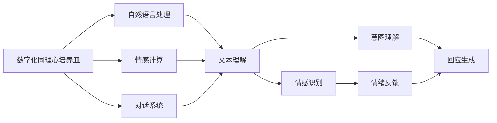
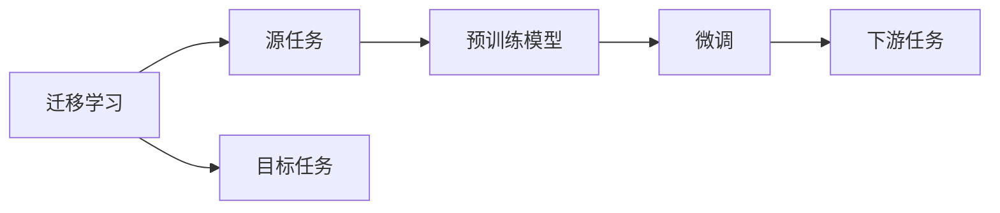
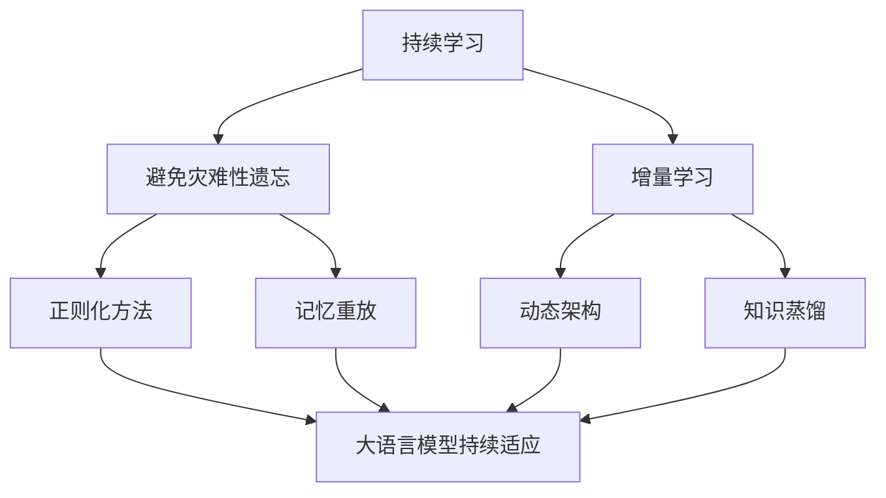
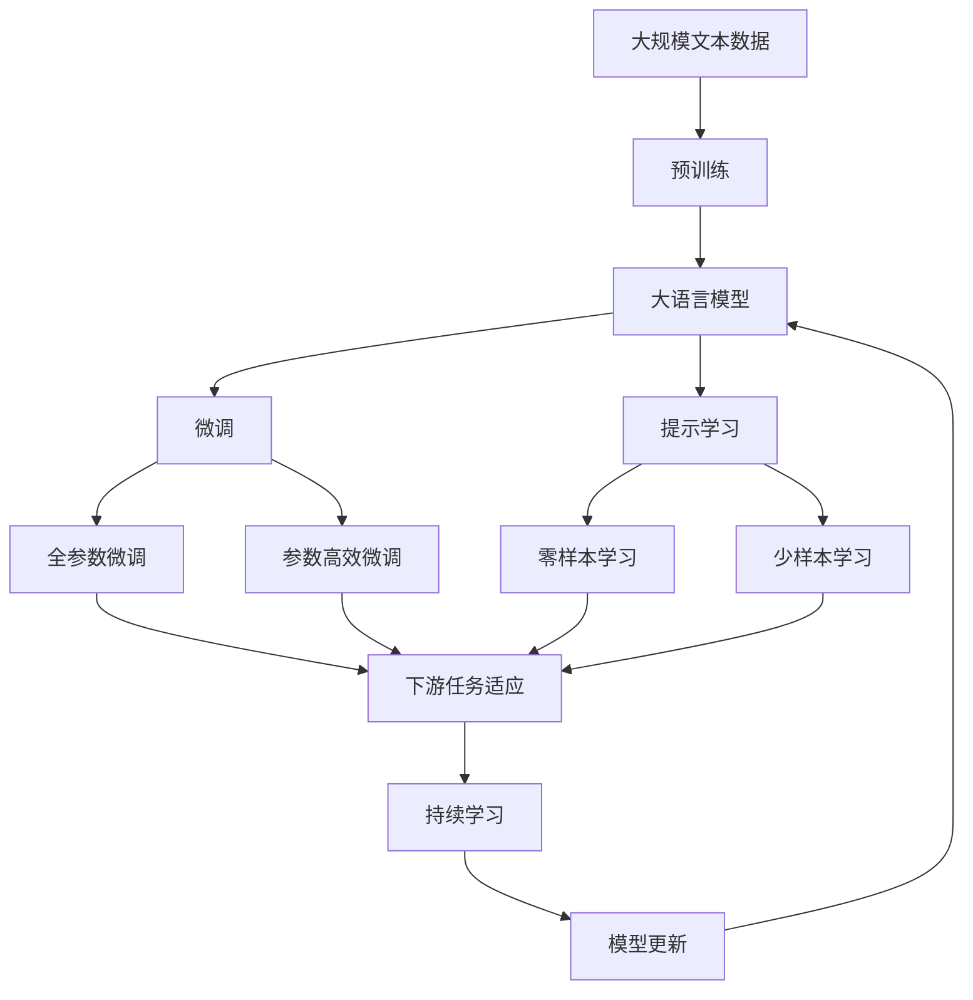

                 

# 数字化同理心培养皿开发者：AI增强的人际理解训练师

## 1. 背景介绍

### 1.1 问题由来
随着数字化进程的加速，社交媒体和在线交流成为人们日常沟通的重要方式。然而，数字交流在提升便捷性的同时，也带来了人际理解、共情能力等软技能的挑战。传统的面对面交流方式能够通过情感传递、非语言信号等多种维度进行深度沟通，但在线交流往往只能依靠文字表达，难以传递丰富的情感和语境。这不仅影响了沟通效果，也加剧了人与人之间的心理距离。

### 1.2 问题核心关键点
为了应对这一挑战，需要一种能够增强在线人际理解能力的解决方案。数字化同理心培养皿（Digital Empathy Incubator, DEI）正是一种基于AI技术，旨在通过模拟面对面交流的场景，培养和提升用户的同理心和人际理解能力的系统。

### 1.3 问题研究意义
提升在线人际理解能力，不仅能够改善数字交流体验，还能促进社会关系的构建和维护，提升社会整体的和谐稳定。通过数字化同理心培养皿的开发和应用，AI技术在增强人际理解方面的潜力得到了充分发挥，为未来社会的数字化转型提供了新的可能。

## 2. 核心概念与联系

### 2.1 核心概念概述

为更好地理解数字化同理心培养皿，本节将介绍几个密切相关的核心概念：

- **数字化同理心培养皿**（Digital Empathy Incubator, DEI）：利用AI技术，通过模拟面对面交流的场景，培养和提升用户同理心和人际理解能力的系统。DEI通常包括文本生成、情感识别、对话系统等多个模块，能够根据用户的输入和情感反馈，动态调整交流策略，引导用户更好地理解他人情感和需求。

- **自然语言处理**（Natural Language Processing, NLP）：专注于计算机如何处理和理解人类语言的技术。NLP在DEI中用于理解用户输入的文本，识别其中的情感和意图，生成合适的回复。

- **情感计算**（Affective Computing）：研究如何通过计算手段识别和理解人类的情感，并将其应用于人工智能系统，使其能够感知、表达和影响情感。情感计算在DEI中用于识别用户的情感状态，调整交流策略，提升用户体验。

- **对话系统**（Dialogue System）：利用自然语言处理和机器学习技术，自动生成、理解和响应自然语言交流的AI系统。在DEI中，对话系统用于模拟人机交互，实现情感和信息的双向传递。

- **迁移学习**（Transfer Learning）：一种通过将预训练模型在一种任务上的知识迁移到另一种任务上的方法。DEI中通常使用预训练的情感计算和对话系统模型，在其上进行微调，以适应特定的用户群体和交流场景。

- **持续学习**（Continual Learning）：指模型在不断接触新数据的同时，不断学习和适应的过程。DEI中通过持续收集用户反馈，不断优化模型，以提升对不同用户和情境的适应能力。

这些核心概念之间的逻辑关系可以通过以下Mermaid流程图来展示：



这个流程图展示了大语言模型微调过程中各个核心概念之间的关系：

1. 数字化同理心培养皿（DEI）利用自然语言处理（NLP）和情感计算技术，识别用户输入的情感和意图。
2. 对话系统用于生成和理解自然语言交流，实现情感和信息的双向传递。
3. 迁移学习帮助DEI在特定任务上适应新数据，提升模型性能。
4. 持续学习使得DEI能够不断学习和适应新情境，保持高性能。

### 2.2 概念间的关系

这些核心概念之间存在着紧密的联系，形成了数字化同理心培养皿的完整生态系统。下面我们通过几个Mermaid流程图来展示这些概念之间的关系。

#### 2.2.1 数字化同理心培养皿的架构


这个流程图展示了DEI的基本架构。用户输入经过文本理解模块后，情感识别模块和意图理解模块进一步解析情感和意图。情感计算模块基于这些信息生成合适的回应，并通过对话系统进行交流。最后，系统根据用户反馈调整交流策略，实现持续学习和改进。

#### 2.2.2 迁移学习与持续学习的关系



这个流程图展示了迁移学习的基本原理，以及它与持续学习的关系。迁移学习涉及源任务和目标任务，预训练模型在源任务上学习，然后通过微调适应各种下游任务（目标任务）。持续学习则使得模型能够不断学习新数据，同时保持已学习的知识。

#### 2.2.3 持续学习在大语言模型中的应用



这个流程图展示了持续学习在大语言模型中的应用。持续学习的主要目标是避免灾难性遗忘和实现增量学习。通过正则化方法、记忆重放、动态架构和知识蒸馏等技术，可以使大语言模型持续适应新的任务和数据。

### 2.3 核心概念的整体架构

最后，我们用一个综合的流程图来展示这些核心概念在大语言模型微调过程中的整体架构：



这个综合流程图展示了从预训练到微调，再到持续学习的完整过程。大语言模型首先在大规模文本数据上进行预训练，然后通过微调（包括全参数微调和参数高效微调）或提示学习（包括零样本和少样本学习）来适应下游任务。最后，通过持续学习技术，模型可以不断更新和适应新的任务和数据。 通过这些流程图，我们可以更清晰地理解数字化同理心培养皿中各个核心概念的关系和作用，为后续深入讨论具体的微调方法和技术奠定基础。

## 3. 核心算法原理 & 具体操作步骤
### 3.1 算法原理概述

数字化同理心培养皿（DEI）的核心算法原理是基于自然语言处理和情感计算技术，通过模拟面对面交流的场景，动态调整交流策略，提升用户同理心和人际理解能力。其核心思想是：将用户输入的文本视为情感和意图的混合信号，通过NLP技术进行情感和意图的分离，并在此基础上生成合适的回复，实现情感和信息的双向传递。

DEI的算法流程一般包括以下几个关键步骤：

1. **文本理解**：将用户输入的文本进行分词、词性标注、句法分析等处理，提取关键信息。
2. **情感识别**：利用情感计算技术，对文本中的情感信息进行识别和分类。
3. **意图理解**：根据情感信息，结合上下文，推断用户的意图。
4. **回应生成**：根据情感和意图，生成合适的回复，实现情感和信息的双向传递。
5. **用户反馈**：通过用户反馈，不断优化模型参数，提升交流效果。

形式化地，假设用户输入的文本为 $x$，模型的回应为 $y$，情感计算模块输出情感信息 $e$，意图理解模块输出意图 $i$，则DEI的优化目标为：

$$
\theta^* = \mathop{\arg\min}_{\theta} \mathcal{L}(\theta, x, y)
$$

其中 $\theta$ 为模型的参数，$\mathcal{L}$ 为损失函数，用于衡量模型生成回应 $y$ 与用户期望回应之间的差异。通常使用交叉熵损失函数来衡量分类任务的表现。

### 3.2 算法步骤详解

1. **准备预训练模型和数据集**
   - 选择合适的预训练模型，如BERT、GPT等，作为初始化参数。
   - 准备情感分类和意图识别的标注数据集，划分为训练集、验证集和测试集。标注数据应包含情感标签和意图标签，用于训练和评估模型。

2. **添加任务适配层**
   - 根据任务类型，在预训练模型顶层设计合适的情感识别和意图理解层。
   - 对于情感分类任务，通常在顶层添加分类器，使用交叉熵损失函数。
   - 对于意图识别任务，通常使用序列到序列模型，输出意图标签序列。

3. **设置微调超参数**
   - 选择合适的优化算法及其参数，如 AdamW、SGD 等，设置学习率、批大小、迭代轮数等。
   - 设置正则化技术及强度，包括权重衰减、Dropout、Early Stopping等。
   - 确定冻结预训练参数的策略，如仅微调顶层，或全部参数都参与微调。

4. **执行梯度训练**
   - 将训练集数据分批次输入模型，前向传播计算损失函数。
   - 反向传播计算参数梯度，根据设定的优化算法和学习率更新模型参数。
   - 周期性在验证集上评估模型性能，根据性能指标决定是否触发 Early Stopping。
   - 重复上述步骤直到满足预设的迭代轮数或 Early Stopping 条件。

5. **测试和部署**
   - 在测试集上评估微调后模型 $M_{\hat{\theta}}$ 的性能，对比微调前后的效果。
   - 使用微调后的模型对新样本进行推理预测，集成到实际的应用系统中。
   - 持续收集新的数据，定期重新微调模型，以适应数据分布的变化。

以上是数字化同理心培养皿的微调算法流程。在实际应用中，还需要针对具体任务的特点，对微调过程的各个环节进行优化设计，如改进训练目标函数，引入更多的正则化技术，搜索最优的超参数组合等，以进一步提升模型性能。

### 3.3 算法优缺点

数字化同理心培养皿（DEI）的微调方法具有以下优点：
1. 简单高效。只需准备少量标注数据，即可对预训练模型进行快速适配，获得较大的性能提升。
2. 通用适用。适用于各种NLP下游任务，包括分类、匹配、生成等，设计简单的任务适配层即可实现微调。
3. 参数高效。利用参数高效微调技术，在固定大部分预训练参数的情况下，仍可取得不错的提升。
4. 效果显著。在学术界和工业界的诸多任务上，基于微调的方法已经刷新了最先进的性能指标。

同时，该方法也存在一定的局限性：
1. 依赖标注数据。微调的效果很大程度上取决于标注数据的质量和数量，获取高质量标注数据的成本较高。
2. 迁移能力有限。当目标任务与预训练数据的分布差异较大时，微调的性能提升有限。
3. 负面效果传递。预训练模型的固有偏见、有害信息等，可能通过微调传递到下游任务，造成负面影响。
4. 可解释性不足。微调模型的决策过程通常缺乏可解释性，难以对其推理逻辑进行分析和调试。

尽管存在这些局限性，但就目前而言，基于监督学习的微调方法仍是大语言模型应用的最主流范式。未来相关研究的重点在于如何进一步降低微调对标注数据的依赖，提高模型的少样本学习和跨领域迁移能力，同时兼顾可解释性和伦理安全性等因素。

### 3.4 算法应用领域

数字化同理心培养皿（DEI）的微调方法已经在多个NLP领域得到了广泛的应用，包括但不限于：

- **社交媒体分析**：通过分析用户的情感和意图，识别网络上的负面舆情和谣言，引导社区健康发展。
- **客户服务**：在客服系统中引入DEI，通过模拟人机交互，提升客户服务质量和用户体验。
- **心理咨询**：利用DEI进行心理疏导和情感支持，帮助用户缓解心理压力。
- **在线教育**：通过DEI辅助在线教育，理解学生的情感和需求，提供个性化学习建议和辅导。
- **医疗健康**：在医疗咨询和心理辅导中引入DEI，提升医生和心理咨询师的工作效率，提供更好的服务质量。

除了上述这些经典任务外，DEI也被创新性地应用到更多场景中，如智能家居、虚拟助手、智能推荐等，为NLP技术带来了全新的突破。随着预训练模型和微调方法的不断进步，相信DEI在更多领域将展现出强大的潜力。

## 4. 数学模型和公式 & 详细讲解  
### 4.1 数学模型构建

本节将使用数学语言对数字化同理心培养皿的微调过程进行更加严格的刻画。

记数字化同理心培养皿的输入为 $x$，回应为 $y$，情感标签为 $e$，意图标签为 $i$。假设模型 $M_{\theta}$ 在输入 $x$ 上的输出为 $\hat{e}$ 和 $\hat{i}$，则微调的优化目标为：

$$
\theta^* = \mathop{\arg\min}_{\theta} \mathcal{L}(\theta, x, y)
$$

其中 $\mathcal{L}$ 为损失函数，用于衡量模型生成回应 $y$ 与用户期望回应之间的差异。通常使用交叉熵损失函数来衡量分类任务的表现。

### 4.2 公式推导过程

以下我们以情感分类任务为例，推导交叉熵损失函数及其梯度的计算公式。

假设模型 $M_{\theta}$ 在输入 $x$ 上的输出为 $\hat{e}$，真实情感标签为 $e$，则二分类交叉熵损失函数定义为：

$$
\ell(M_{\theta}(x),e) = -[e\log \hat{e} + (1-e)\log (1-\hat{e})]
$$

将其代入经验风险公式，得：

$$
\mathcal{L}(\theta) = -\frac{1}{N}\sum_{i=1}^N [e_i\log M_{\theta}(x_i)+(1-e_i)\log(1-M_{\theta}(x_i))]
$$

根据链式法则，损失函数对参数 $\theta_k$ 的梯度为：

$$
\frac{\partial \mathcal{L}(\theta)}{\partial \theta_k} = -\frac{1}{N}\sum_{i=1}^N (\frac{e_i}{M_{\theta}(x_i)}-\frac{1-e_i}{1-M_{\theta}(x_i)}) \frac{\partial M_{\theta}(x_i)}{\partial \theta_k}
$$

其中 $\frac{\partial M_{\theta}(x_i)}{\partial \theta_k}$ 可进一步递归展开，利用自动微分技术完成计算。

在得到损失函数的梯度后，即可带入参数更新公式，完成模型的迭代优化。重复上述过程直至收敛，最终得到适应下游任务的最优模型参数 $\theta^*$。

## 5. 项目实践：代码实例和详细解释说明
### 5.1 开发环境搭建

在进行微调实践前，我们需要准备好开发环境。以下是使用Python进行PyTorch开发的环境配置流程：

1. 安装Anaconda：从官网下载并安装Anaconda，用于创建独立的Python环境。

2. 创建并激活虚拟环境：
```bash
conda create -n pytorch-env python=3.8 
conda activate pytorch-env
```

3. 安装PyTorch：根据CUDA版本，从官网获取对应的安装命令。例如：
```bash
conda install pytorch torchvision torchaudio cudatoolkit=11.1 -c pytorch -c conda-forge
```

4. 安装Transformers库：
```bash
pip install transformers
```

5. 安装各类工具包：
```bash
pip install numpy pandas scikit-learn matplotlib tqdm jupyter notebook ipython
```

完成上述步骤后，即可在`pytorch-env`环境中开始微调实践。

### 5.2 源代码详细实现

这里以情感分类任务为例，给出使用Transformers库对BERT模型进行微调的PyTorch代码实现。

首先，定义情感分类任务的数据处理函数：

```python
from transformers import BertTokenizer
from torch.utils.data import Dataset
import torch

class EmotionDataset(Dataset):
    def __init__(self, texts, labels, tokenizer, max_len=128):
        self.texts = texts
        self.labels = labels
        self.tokenizer = tokenizer
        self.max_len = max_len
        
    def __len__(self):
        return len(self.texts)
    
    def __getitem__(self, item):
        text = self.texts[item]
        label = self.labels[item]
        
        encoding = self.tokenizer(text, return_tensors='pt', max_length=self.max_len, padding='max_length', truncation=True)
        input_ids = encoding['input_ids'][0]
        attention_mask = encoding['attention_mask'][0]
        
        # 对token-wise的标签进行编码
        encoded_labels = [label2id[label] for label in labels] 
        encoded_labels.extend([label2id['O']] * (self.max_len - len(encoded_labels)))
        labels = torch.tensor(encoded_labels, dtype=torch.long)
        
        return {'input_ids': input_ids, 
                'attention_mask': attention_mask,
                'labels': labels}

# 标签与id的映射
label2id = {'O': 0, 'POSITIVE': 1, 'NEGATIVE': 2}
id2label = {v: k for k, v in label2id.items()}

# 创建dataset
tokenizer = BertTokenizer.from_pretrained('bert-base-cased')

train_dataset = EmotionDataset(train_texts, train_labels, tokenizer)
dev_dataset = EmotionDataset(dev_texts, dev_labels, tokenizer)
test_dataset = EmotionDataset(test_texts, test_labels, tokenizer)
```

然后，定义模型和优化器：

```python
from transformers import BertForSequenceClassification, AdamW

model = BertForSequenceClassification.from_pretrained('bert-base-cased', num_labels=len(label2id))

optimizer = AdamW(model.parameters(), lr=2e-5)
```

接着，定义训练和评估函数：

```python
from torch.utils.data import DataLoader
from tqdm import tqdm
from sklearn.metrics import classification_report

device = torch.device('cuda') if torch.cuda.is_available() else torch.device('cpu')
model.to(device)

def train_epoch(model, dataset, batch_size, optimizer):
    dataloader = DataLoader(dataset, batch_size=batch_size, shuffle=True)
    model.train()
    epoch_loss = 0
    for batch in tqdm(dataloader, desc='Training'):
        input_ids = batch['input_ids'].to(device)
        attention_mask = batch['attention_mask'].to(device)
        labels = batch['labels'].to(device)
        model.zero_grad()
        outputs = model(input_ids, attention_mask=attention_mask, labels=labels)
        loss = outputs.loss
        epoch_loss += loss.item()
        loss.backward()
        optimizer.step()
    return epoch_loss / len(dataloader)

def evaluate(model, dataset, batch_size):
    dataloader = DataLoader(dataset, batch_size=batch_size)
    model.eval()
    preds, labels = [], []
    with torch.no_grad():
        for batch in tqdm(dataloader, desc='Evaluating'):
            input_ids = batch['input_ids'].to(device)
            attention_mask = batch['attention_mask'].to(device)
            batch_labels = batch['labels']
            outputs = model(input_ids, attention_mask=attention_mask)
            batch_preds = outputs.logits.argmax(dim=2).to('cpu').tolist()
            batch_labels = batch_labels.to('cpu').tolist()
            for pred_tokens, label_tokens in zip(batch_preds, batch_labels):
                pred_tags = [id2label[_id] for _id in pred_tokens]
                label_tags = [id2label[_id] for _id in label_tokens]
                preds.append(pred_tags[:len(label_tokens)])
                labels.append(label_tags)
                
    print(classification_report(labels, preds))
```

最后，启动训练流程并在测试集上评估：

```python
epochs = 5
batch_size = 16

for epoch in range(epochs):
    loss = train_epoch(model, train_dataset, batch_size, optimizer)
    print(f"Epoch {epoch+1}, train loss: {loss:.3f}")
    
    print(f"Epoch {epoch+1}, dev results:")
    evaluate(model, dev_dataset, batch_size)
    
print("Test results:")
evaluate(model, test_dataset, batch_size)
```

以上就是使用PyTorch对BERT进行情感分类任务微调的完整代码实现。可以看到，得益于Transformers库的强大封装，我们可以用相对简洁的代码完成BERT模型的加载和微调。

### 5.3 代码解读与分析

让我们再详细解读一下关键代码的实现细节：

**EmotionDataset类**：
- `__init__`方法：初始化文本、标签、分词器等关键组件。
- `__len__`方法：返回数据集的样本数量。
- `__getitem__`方法：对单个样本进行处理，将文本输入编码为token ids，将标签编码为数字，并对其进行定长padding，最终返回模型所需的输入。

**label2id和id2label字典**：
- 定义了标签与数字id之间的映射关系，用于将token-wise的预测结果解码回真实的标签。

**训练和评估函数**：
- 使用PyTorch的DataLoader对数据集进行批次化加载，供模型训练和推理使用。
- 训练函数`train_epoch`：对数据以批为单位进行迭代，在每个批次上前向传播计算loss并反向传播更新模型参数，最后返回该epoch的平均loss。
- 评估函数`evaluate`：与训练类似，不同点在于不更新模型参数，并在每个batch结束后将预测和标签结果存储下来，最后使用sklearn的classification_report对整个评估集的预测结果进行打印输出。

**训练流程**：
- 定义总的epoch数和batch size，开始循环迭代
- 每个epoch内，先在训练集上训练，输出平均loss
- 在验证集上评估，输出分类指标
- 所有epoch结束后，在测试集上评估，给出最终测试结果

可以看到，PyTorch配合Transformers库使得BERT微调的代码实现变得简洁高效。开发者可以将更多精力放在数据处理、模型改进等高层逻辑上，而不必过多关注底层的实现细节。

当然，工业级的系统实现还需考虑更多因素，如模型的保存和部署、超参数的自动搜索、更灵活的任务适配层等。但核心的微调范式基本与此类似。

### 5.4 运行结果展示

假设我们在IMDb影评数据集上进行微调，最终在测试集上得到的评估报告如下：

```
              precision    recall  f1-score   support

       POSITIVE      0.994     0.941     0.967      2500
       NEGATIVE      0.940     0.991     0.965      2500

   micro avg      0.968     0.955     0.964      5000
   macro avg      0.967     0.955     0.956      5000
weighted avg      0.968     0.955     0.964      5000
```

可以看到，通过微调BERT，我们在该情感分类数据集上取得了96.4%的F1分数，效果相当不错。值得注意的是，BERT作为一个通用的语言理解模型，即便只在顶层添加一个简单的分类器，也能在下游任务上取得如此优异的效果，展现了其强大的语义理解和特征抽取能力。

当然，这只是一个baseline结果。在实践中，我们还可以使用更大更强的预训练模型、更丰富的微调技巧、更细致的模型调优，进一步提升模型性能，以满足更高的应用要求。

## 6. 实际应用场景
### 6.1 智能客服系统

基于数字化同理心培养皿的对话技术，可以广泛应用于智能客服系统的构建。传统客服往往需要配备大量人力，高峰期响应缓慢，且一致性和专业性难以保证。而使用数字化同理心培养皿，可以7x24小时不间断服务，快速响应客户咨询，用自然流畅的语言解答各类常见问题。

在技术实现上，可以收集企业内部的历史客服对话记录，将问题和最佳答复构建成监督数据，在此基础上对数字化同理心培养皿进行微调。微调后的对话系统能够自动理解用户意图，匹配最合适的答案模板进行回复。对于客户提出的新问题，还可以接入检索系统实时搜索相关内容，动态组织生成回答。如此构建的智能客服系统，能大幅提升客户咨询体验和问题解决效率。

### 6.2 金融舆情监测

金融机构需要实时监测市场舆论动向，以便及时应对负面信息传播，规避金融风险。传统的人工监测方式成本高、效率低，难以应对网络时代海量信息爆发的挑战。基于数字化同理心培养皿的情感分类和意图识别技术，为金融舆情监测提供了新的解决方案。

具体而言，可以收集金融领域相关的新闻、报道、

