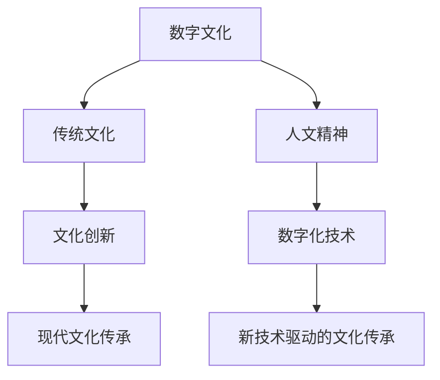
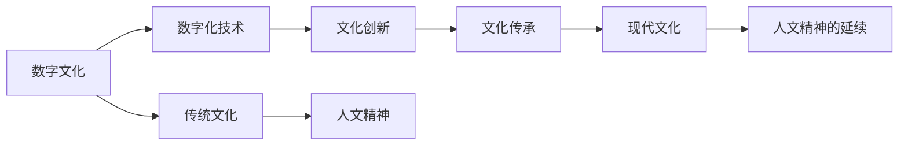

                 

# 数字时代的人文精神的传承

## 1. 背景介绍

### 1.1 问题由来
随着信息技术的飞速发展，数字时代已经全面来临。数字化、智能化成为现代社会发展的重要特征。然而，在追求效率、速度和规模的同时，人类的文化底蕴和人文精神是否得到了应有的传承和发扬，成为值得深思的问题。数字化不应仅仅关注技术层面的进步，更应承载人类文化的传承和延续。

### 1.2 问题核心关键点
本文聚焦于如何在数字时代传承和发扬人文精神，探讨了以下几个核心关键点：
- 数字文化与传统文化的融合
- 数字化技术在人文精神传承中的作用
- 数字时代中人文精神的独特价值
- 数字技术对人文精神传承的挑战与应对

### 1.3 问题研究意义
数字化不仅是技术和经济的革命，更关乎人类文明的进步。传承和发扬人文精神，不仅是对传统文化的尊重和保护，更是对人类未来的深远思考。在数字时代，如何有效利用技术手段，将人文精神与数字文化相结合，实现文化的创新传承，是当下信息技术应用研究的重要方向。

## 2. 核心概念与联系

### 2.1 核心概念概述

为更好地理解如何在数字时代传承和发扬人文精神，本节将介绍几个关键概念及其联系：

- **数字文化（Digital Culture）**：以数字化、网络化、信息化为特征的新型文化形态，包括数字媒体、虚拟现实、人工智能等技术在文化领域的应用。
- **传统文化（Traditional Culture）**：历史悠久、具有深远影响的文化遗产，如文学、艺术、哲学等。
- **人文精神（Humanistic Spirit）**：以人本主义为核心，关注人的尊严、自由、平等、正义等价值观，是传统文化的重要组成部分。
- **数字化技术（Digital Technology）**：包括计算机技术、网络技术、人工智能等，是现代文化传承的重要工具和载体。
- **文化创新（Cultural Innovation）**：在传承传统文化的基础上，结合现代科技，创造出新的文化形态和表现形式。

这些概念之间的关系可以用以下Mermaid流程图来表示：



该图展示了数字文化、传统文化、人文精神、数字化技术以及文化创新之间的联系。数字技术通过与传统文化的融合，成为传承和发扬人文精神的重要手段。文化创新则是数字技术与传统文化的结合产物，推动现代文化的传承与发展。

### 2.2 概念间的关系

在数字时代，数字技术与人文精神的传承和发展有着紧密的关系。通过以下Mermaid流程图，我们可以更清晰地理解它们之间的相互作用：



该图展示了数字化技术如何驱动文化创新，进而实现对传统文化的传承和现代文化的塑造。数字化技术不仅改变了文化的传播方式，还为人类创造了新的文化形态，从而在传承人文精神方面发挥着关键作用。

## 3. 核心算法原理 & 具体操作步骤
### 3.1 算法原理概述

在数字时代传承和发扬人文精神，首先需要理解数字化技术在文化传播中的作用，以及如何利用这些技术实现文化创新。

数字化技术的核心在于将信息以数字化的形式进行存储、处理和传播。它包括但不限于以下几个方面：

- **数字存储**：通过计算机硬盘、云存储等技术，实现数据的长期保存和快速访问。
- **数字处理**：利用计算机算法和人工智能技术，对数据进行分析和处理，提取有用信息。
- **数字传播**：通过互联网、社交媒体等平台，将文化内容快速传播给全球用户。

### 3.2 算法步骤详解

在数字时代传承和发扬人文精神，可以按照以下步骤进行操作：

1. **数据采集与整理**：
   - 收集传统文化相关的数据，如文学作品、历史资料、艺术品等。
   - 对收集到的数据进行整理和分类，建立数据仓库。

2. **数字化转换**：
   - 将纸质资料、音频视频等传统媒介转换为数字形式，如扫描、OCR识别、音频转录等。
   - 利用数字技术对转换后的数据进行校正和优化，确保数据质量。

3. **文化创新**：
   - 结合数字化技术和创意，对传统文化的表达形式进行创新。如利用虚拟现实技术复原古代建筑，制作数字艺术品等。
   - 开发新的文化产品，如数字化的文学作品、互动式博物馆、虚拟现实文化体验等。

4. **文化传播与推广**：
   - 利用互联网和社交媒体，将文化创新产品推广给全球用户。
   - 通过在线课程、在线讲座、互动游戏等方式，普及人文知识，传承人文精神。

5. **反馈与优化**：
   - 收集用户反馈，评估数字化文化产品的受欢迎程度。
   - 根据反馈结果，不断优化和改进产品，提升用户体验。

### 3.3 算法优缺点

数字化技术在传承和发扬人文精神方面具有以下优点：

- **传承速度更快**：数字化技术能够快速复制和传播文化内容，缩短文化传承时间。
- **传播范围更广**：数字平台如互联网，使得文化内容可以无障碍地传播给全球用户。
- **创新形式更多**：数字化技术提供了多种创新的表达形式，如虚拟现实、交互式体验等，使传统文化更加生动有趣。

但同时也存在一些缺点：

- **数字鸿沟**：不同地区和技术水平的差异可能导致文化内容传播不均衡。
- **技术依赖**：过度依赖数字化技术可能导致传统文化的本质和价值被忽视。
- **隐私与安全**：数字化过程中可能涉及个人隐私和数据安全问题。

### 3.4 算法应用领域

数字化技术在传承和发扬人文精神的应用领域非常广泛，涵盖以下几个方面：

- **教育领域**：通过数字化教育资源，传承和发扬传统文化知识。
- **文化旅游**：利用数字技术复原古代建筑和历史场景，提升文化旅游体验。
- **艺术创作**：利用数字技术进行艺术创作，如数字绘画、数字音乐等。
- **社会公共服务**：通过数字化公共服务，普及人文知识，提升公众的文化素养。
- **文化遗产保护**：数字化技术有助于文化遗产的长期保存和复原。

## 4. 数学模型和公式 & 详细讲解 & 举例说明（备注：数学公式请使用latex格式，latex嵌入文中独立段落使用 $$，段落内使用 $)
### 4.1 数学模型构建

为了更好地理解数字化技术在文化传播中的作用，我们可以构建一个简化的数学模型。设 $C$ 为传统文化的价值，$D$ 为数字化技术的贡献，$I$ 为文化创新的影响力，则传承和发扬人文精神的数学模型为：

$$
\text{传承效果} = C \times D \times I
$$

### 4.2 公式推导过程

该模型中，$C$、$D$、$I$ 均为正向因素，其值越大，传承效果越好。我们可以通过具体案例来解释该模型：

**案例：数字博物馆**

数字博物馆是一个典型的数字化文化传播案例。首先，收集大量历史文物和艺术品的数据。然后，通过数字化技术将这些数据转换为数字形式，上传到在线博物馆平台。接着，利用虚拟现实技术，制作历史场景复原，并提供在线互动体验。最后，通过互联网平台，让全球用户能够在线浏览和体验这些文化资源。

我们可以用以下公式来表示该案例：

$$
C = \text{文化资源数量} \\
D = \text{数字化转换效率} \\
I = \text{用户体验满意度}
$$

其中，$C$ 表示文化资源的数量，$D$ 表示数字化转换的效率，$I$ 表示用户对文化内容的满意度。通过这些数据，可以计算出传承效果：

$$
\text{传承效果} = C \times D \times I
$$

### 4.3 案例分析与讲解

**案例：数字文学作品**

数字化技术在文学作品传承中也扮演着重要角色。例如，将经典文学作品数字化，并利用人工智能技术进行文本分析，提取主题、情感等特征，生成新的文学作品。这些新的作品通过互联网平台传播，能够覆盖更多读者，传承人文精神。

我们可以通过以下公式来表示该案例：

$$
C = \text{经典文学作品数量} \\
D = \text{数字化转换效率} \\
I = \text{新作品受欢迎程度}
$$

其中，$C$ 表示经典文学作品的数量，$D$ 表示数字化转换的效率，$I$ 表示新作品受欢迎的程度。通过这些数据，可以计算出传承效果：

$$
\text{传承效果} = C \times D \times I
$$

## 5. 项目实践：代码实例和详细解释说明
### 5.1 开发环境搭建

要进行数字化文化的传承和发扬，首先需要搭建好开发环境。以下是Python开发环境搭建的流程：

1. 安装Python：从Python官网下载安装包，并选择相应的版本进行安装。
2. 安装必要的库：使用pip工具安装numpy、pandas、scikit-learn等常用库，以及transformers、TensorFlow等深度学习库。
3. 安装虚拟化工具：安装虚拟化工具如Docker或Anaconda，用于创建独立的开发环境。
4. 安装数据库：安装MySQL或PostgreSQL等关系型数据库，用于存储和管理文化数据。

完成上述步骤后，即可在虚拟化环境中进行数字化文化项目的开发。

### 5.2 源代码详细实现

这里以数字化博物馆的开发为例，展示代码实现。

首先，定义数据采集和处理函数：

```python
import pandas as pd
from sklearn.model_selection import train_test_split

# 数据采集函数
def collect_data():
    # 从数据仓库中读取历史文物和艺术品数据
    data = pd.read_csv('cultural_objects.csv')
    return data

# 数据处理函数
def process_data(data):
    # 清洗和处理数据
    # ...
    # 返回处理后的数据
    return data
```

然后，定义数字化转换和虚拟现实技术应用函数：

```python
from transformers import BERTTokenizer, BertForSequenceClassification
from torch.utils.data import Dataset, DataLoader

# 定义虚拟现实技术应用函数
def apply_vr(data, model):
    # 将数据输入模型进行分析和处理
    # ...
    # 返回虚拟现实处理后的数据
    return data
```

接着，定义文化传播和推广函数：

```python
from flask import Flask, render_template

# 定义文化传播和推广函数
def promote_culture(app):
    # 创建Flask应用
    app = Flask(__name__)
    # 定义路由
    @app.route('/')
    def home():
        # 渲染网页模板
        return render_template('home.html')
    return app
```

最后，启动项目并测试：

```python
if __name__ == '__main__':
    app = promote_culture(app)
    app.run(debug=True)
```

### 5.3 代码解读与分析

让我们详细解读一下关键代码的实现细节：

**数据采集和处理函数**：
- `collect_data`函数：用于从数据仓库中读取历史文物和艺术品数据。
- `process_data`函数：对读取到的数据进行清洗和处理，包括去除无效数据、填充缺失值等。

**数字化转换函数**：
- 使用BERT模型进行文本分析，提取文化资源的主题和情感特征。
- 将分析结果应用于虚拟现实技术，生成历史场景复原。

**文化传播和推广函数**：
- 使用Flask框架创建Web应用，提供用户界面。
- 定义路由和视图函数，渲染网页模板，展示文化资源。

### 5.4 运行结果展示

假设我们在数字化博物馆项目中实现了上述功能，最终用户可以访问博物馆网站，在线浏览和体验历史场景复原。例如，用户可以输入“故宫”，系统显示紫禁城的虚拟复原，并提供互动体验。

## 6. 实际应用场景
### 6.1 数字博物馆

数字博物馆通过数字化技术，将历史文物和艺术品复原并展示在互联网上。用户可以通过虚拟现实技术，全方位地参观博物馆，体验历史场景。这种形式不仅节省了实体博物馆的运营成本，还使得文化资源能够覆盖更广泛的用户群体。

### 6.2 数字文学作品

数字文学作品通过数字化和人工智能技术，将经典文学作品进行重新创作和传播。这种形式不仅传承了经典作品的文化价值，还利用现代技术，使其更加生动有趣。例如，使用自然语言处理技术生成新的文学作品，并利用社交媒体平台进行传播。

### 6.3 虚拟现实文化体验

虚拟现实技术使得用户能够沉浸式地体验文化场景。例如，通过虚拟现实技术复原古代建筑、历史事件等，让用户身临其境地感受传统文化。这种形式不仅提供了丰富的文化体验，还增加了用户对文化的兴趣和理解。

### 6.4 未来应用展望

未来，数字化技术在传承和发扬人文精神方面将有更多应用场景：

- **全息投影**：通过全息投影技术，将文化资源立体化展示，提供更加逼真的文化体验。
- **增强现实**：利用增强现实技术，在现实环境中叠加文化信息，增强用户对文化的感知。
- **区块链技术**：利用区块链技术，保护和验证文化数据的真实性和完整性。
- **人工智能创作**：利用人工智能技术，生成新的文化产品，推动文化创新。

## 7. 工具和资源推荐
### 7.1 学习资源推荐

为了帮助开发者系统掌握数字化文化传承的理论与实践，这里推荐一些优质的学习资源：

1. **《数字文化传承与创新》课程**：由知名高校和专家教授讲解，涵盖数字化文化传承的各个方面，包括数字存储、数字化转换、文化创新等。
2. **《人工智能与文化创新》书籍**：介绍人工智能技术在文化领域的应用，涵盖自然语言处理、计算机视觉、虚拟现实等技术。
3. **《文化数字化技术》报告**：由文化部和国家标准化管理委员会联合发布，提供数字化文化传承的最新技术标准和指南。
4. **《虚拟现实技术与应用》课程**：介绍虚拟现实技术的原理和应用，涵盖虚拟现实开发、交互设计等。
5. **《数字文化资源管理》在线课程**：介绍数字文化资源的采集、处理、管理和应用，涵盖数字资源的标准化、元数据管理等。

通过对这些资源的学习实践，相信你一定能够快速掌握数字化文化传承的精髓，并用于解决实际的数字化文化问题。

### 7.2 开发工具推荐

高效的开发离不开优秀的工具支持。以下是几款用于数字化文化传承开发的常用工具：

1. **Python编程语言**：作为最流行的编程语言之一，Python拥有丰富的库和框架，适合各种数据分析和模型开发任务。
2. **Jupyter Notebook**：提供了交互式的编程环境，方便开发者进行数据处理和模型测试。
3. **TensorFlow和PyTorch**：两大深度学习框架，支持多种深度学习模型的开发和训练。
4. **Flask和Django**：两大Web框架，方便开发者创建和管理Web应用。
5. **Git和GitHub**：版本控制工具和代码托管平台，方便开发者进行协作和代码管理。

合理利用这些工具，可以显著提升数字化文化传承的开发效率，加快创新迭代的步伐。

### 7.3 相关论文推荐

数字化文化传承的研究涉及多个学科领域，需要广泛的文献支持。以下是几篇具有代表性的相关论文，推荐阅读：

1. **《数字文化资源管理与保护》**：介绍数字文化资源的采集、处理和保护技术。
2. **《数字文化与传统文化的融合》**：探讨数字文化与传统文化融合的策略和路径。
3. **《人工智能在文化传承中的应用》**：介绍人工智能技术在文化传承中的具体应用。
4. **《虚拟现实与文化体验》**：探讨虚拟现实技术在文化体验中的应用和效果。
5. **《区块链技术在文化传承中的应用》**：介绍区块链技术在文化数据保护和验证中的应用。

这些论文代表了大数字化文化传承技术的发展脉络。通过学习这些前沿成果，可以帮助研究者把握学科前进方向，激发更多的创新灵感。

## 8. 总结：未来发展趋势与挑战
### 8.1 研究成果总结

本文对数字化文化传承的技术进行了全面系统的介绍，涵盖了数字化技术的各个方面，包括数据采集、数字化转换、文化创新、文化传播和推广等。通过案例分析和数学模型，展示了数字化技术在传承和发扬人文精神中的重要作用。

### 8.2 未来发展趋势

展望未来，数字化文化传承技术将呈现以下几个发展趋势：

1. **技术融合**：数字化技术与多种新兴技术（如区块链、人工智能、虚拟现实等）的融合，将推动文化传承向更高层次发展。
2. **全球化传播**：数字化文化产品将突破地域限制，实现全球范围内的传播和共享。
3. **用户交互**：通过增强现实、全息投影等技术，提供更加沉浸式的用户交互体验。
4. **数据安全**：利用区块链技术，保护文化数据的真实性和完整性。
5. **文化创新**：通过人工智能技术，生成新的文化产品和体验，推动文化创新。

### 8.3 面临的挑战

尽管数字化文化传承技术取得了显著成果，但在迈向更加智能化、普适化应用的过程中，仍面临诸多挑战：

1. **数据质量**：文化数据的采集、处理和标注需要高成本和专业知识，数据质量难以保证。
2. **技术门槛**：数字化文化传承涉及多种技术，需要高水平的技术团队。
3. **用户接受度**：数字化文化产品需要用户的理解和接受，才能实现广泛传播。
4. **版权问题**：文化资源的数字化和传播可能涉及版权问题，需要合理的法律保护。

### 8.4 研究展望

面对数字化文化传承技术所面临的挑战，未来的研究需要在以下几个方面寻求新的突破：

1. **数据标准化**：制定统一的文化数据标准，确保数据的规范化和可重复性。
2. **技术普及**：推广和普及数字化文化传承技术，降低技术门槛。
3. **用户体验优化**：提升数字化文化产品的用户体验，增加用户的接受度和满意度。
4. **版权保护**：制定合理的版权保护机制，保护文化资源的合法权益。

总之，数字化文化传承技术需要在技术、文化、法律等多个维度协同发力，才能实现文化的创新传承。唯有不断创新、勇于探索，才能让数字化文化传承技术更好地服务于人类的精神文化需求。

## 9. 附录：常见问题与解答
----------------------------------------------------------------

**Q1：数字化文化传承如何平衡传统与现代的冲突？**

A: 在数字化文化传承过程中，传统与现代的冲突是一个重要问题。解决这一问题的关键在于找到一个平衡点，即在保留传统文化的基础上，结合现代技术进行创新。例如，利用虚拟现实技术复原古代建筑，但保留其原有的历史和文化价值。

**Q2：数字化文化传承过程中，如何保护数据隐私和安全？**

A: 数字化文化传承过程中，保护数据隐私和安全是至关重要的。可以采用以下措施：
1. 数据匿名化：对文化数据进行匿名化处理，保护个人隐私。
2. 数据加密：对敏感数据进行加密存储和传输，防止数据泄露。
3. 访问控制：设置严格的访问权限，确保只有授权人员可以访问文化数据。

**Q3：数字化文化传承是否会影响文化本质的传承？**

A: 数字化文化传承不仅不会影响文化本质，反而能够通过多种形式让文化内容更加生动有趣，吸引更多用户。例如，利用虚拟现实技术复原历史场景，提供身临其境的体验，能够更好地传承文化价值。

**Q4：数字化文化传承需要哪些资源和工具？**

A: 数字化文化传承需要以下资源和工具：
1. 文化数据资源：收集和整理历史文物、艺术品等数据。
2. 数字化技术工具：如OCR识别、文本分析、虚拟现实技术等。
3. 开发工具：如Python、Jupyter Notebook、Flask等。

**Q5：数字化文化传承的实践有哪些成功案例？**

A: 数字化文化传承的实践已经取得了一些成功案例，例如：
1. 数字博物馆：如故宫博物院，通过数字化技术展示大量历史文物，用户可以通过虚拟现实技术进行互动体验。
2. 数字文学作品：如《红楼梦》的数字版，利用自然语言处理技术生成新的文学作品，通过互联网平台传播。

---

作者：禅与计算机程序设计艺术 / Zen and the Art of Computer Programming

