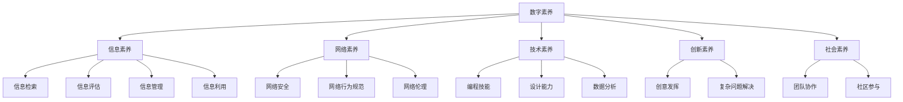
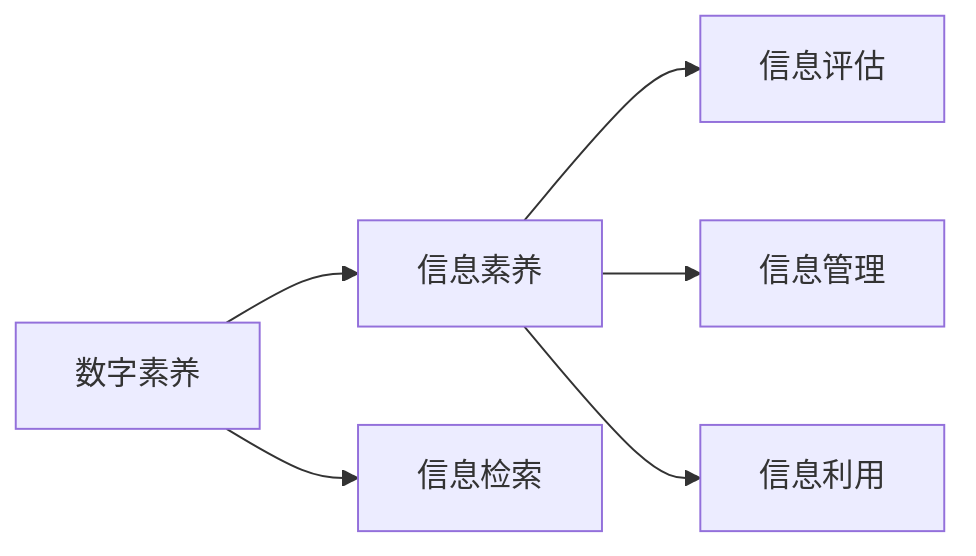
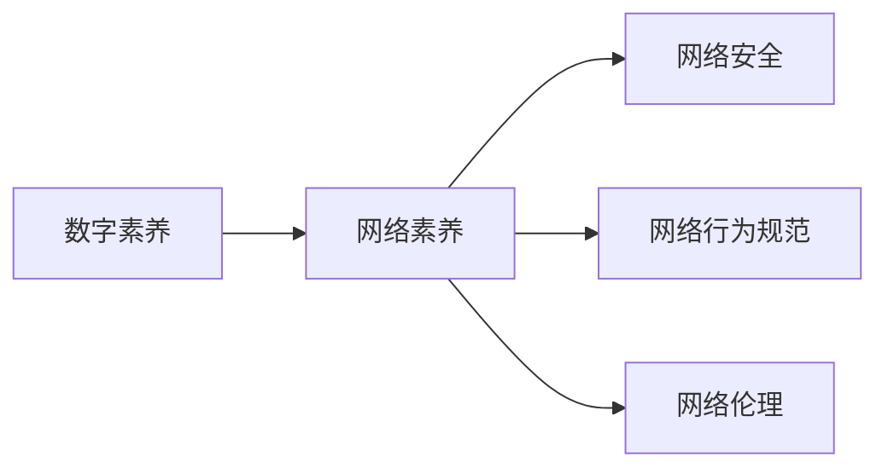
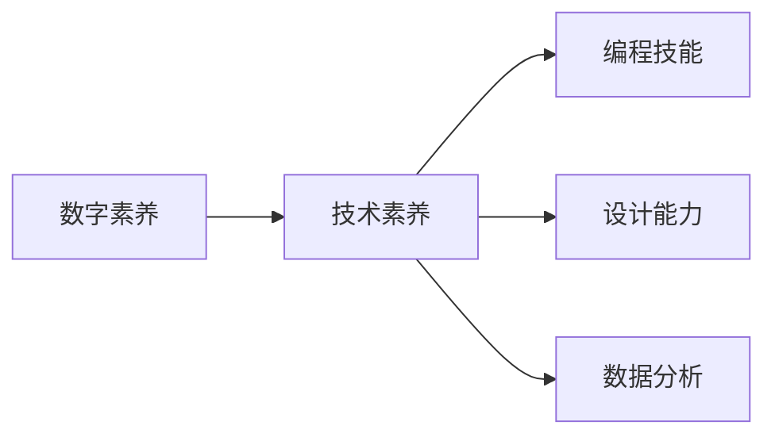
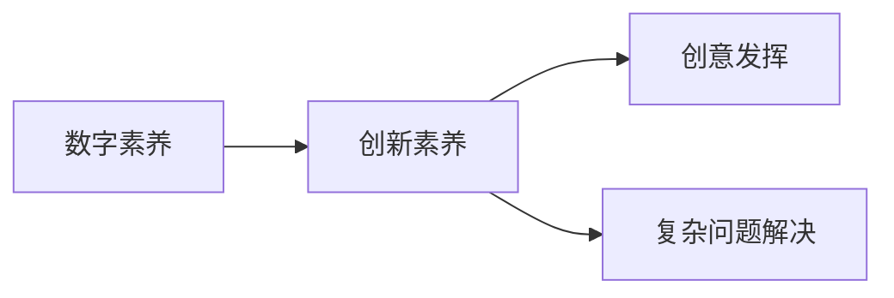
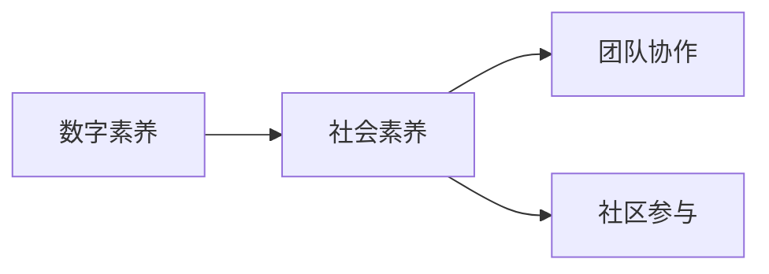

                 

# 数字素养：公民参与的基石

## 1. 背景介绍

### 1.1 问题由来

在信息化、数字化快速发展的今天，数字素养已成为衡量一个公民在现代社会中的必备能力。数字素养不仅关乎个体的知识水平，更关系到公民的社会参与、经济活动、心理健康等多个方面。数字素养的提升，是实现社会信息化、智能化转型的基石。然而，当前数字素养的提升仍面临诸多挑战，如何通过技术手段有效提升全民数字素养，促进社会和谐稳定，已成为全球关注的焦点。

### 1.2 问题核心关键点

数字素养的核心在于提高个体在数字环境中的认知、操作和解决问题的能力。其关键点在于：

- **认知能力**：理解数字技术的基本原理，能够区分数字信息的真实性与可信度，具备基本的网络安全意识。
- **操作能力**：熟练使用数字设备和软件，具备基本的数字化操作技能，能够自主获取、筛选和利用信息。
- **问题解决能力**：具备利用数字技术解决实际问题的能力，能够通过数字手段提升工作效率、促进人际交流和解决生活难题。

### 1.3 问题研究意义

提升全民数字素养，对于构建信息时代公民的身份认同、实现社会公平、推动经济社会发展具有重要意义：

1. **增强公民身份认同**：数字素养使公民能够更好地融入数字社会，提升自身在信息化环境中的自我效能感。
2. **促进社会公平**：数字素养能够消除因数字鸿沟带来的不平等，提供平等的社会参与机会。
3. **推动经济社会发展**：数字素养直接提升人力资源质量，促进知识经济的发展。

## 2. 核心概念与联系

### 2.1 核心概念概述

为更好地理解数字素养的提升方法，本节将介绍几个密切相关的核心概念：

- **数字素养(Digital Literacy)**：指个体在数字环境中理解和操作数字技术的能力，包括基本操作、信息检索、问题解决等。
- **信息素养(Information Literacy)**：指个体在信息时代下的信息获取、评估、管理和利用能力，与数字素养紧密相关。
- **网络素养(Online Literacy)**：指个体在互联网环境中的安全意识、行为规范和伦理认知，是数字素养的重要组成部分。
- **技术素养(Technological Literacy)**：指个体对现代技术的理解和使用能力，包括编程、设计、数据分析等技术技能的掌握。
- **创新素养(Creative Literacy)**：指个体在数字环境中发挥创意、解决复杂问题的能力，是数字素养的高阶体现。
- **社会素养(Social Literacy)**：指个体在数字环境中的社会交往、沟通和协作能力，包括团队合作、社区参与等。

这些核心概念之间的关系可以通过以下Mermaid流程图来展示：



这个流程图展示了数字素养与相关概念之间的联系，体现了其在多个维度上的综合提升。

### 2.2 概念间的关系

这些核心概念之间存在着紧密的联系，共同构成了数字素养提升的完整框架。下面我们通过几个Mermaid流程图来展示这些概念之间的关系。

#### 2.2.1 数字素养与信息素养的关系



这个流程图展示了数字素养和信息素养之间的联系。数字素养不仅涵盖了信息检索、信息评估等基本技能，还包括了信息管理、信息利用等更高阶的操作。

#### 2.2.2 数字素养与网络素养的关系



这个流程图展示了数字素养和网络素养之间的联系。网络素养是数字素养的重要组成部分，通过网络安全意识、行为规范和伦理认知，确保数字环境下的安全与文明。

#### 2.2.3 数字素养与技术素养的关系



这个流程图展示了数字素养和技术素养之间的联系。技术素养不仅涵盖了基本的编程、设计、数据分析等技能，还包括了更高阶的创新和问题解决能力。

#### 2.2.4 数字素养与创新素养的关系



这个流程图展示了数字素养和创新素养之间的联系。创新素养是数字素养的高阶体现，通过数字手段发挥创意、解决复杂问题。

#### 2.2.5 数字素养与社会素养的关系



这个流程图展示了数字素养和社会素养之间的联系。社会素养通过数字手段促进团队协作、社区参与，进一步提升个体在数字环境中的社会交往和沟通能力。

### 2.3 核心概念的整体架构

最后，我们用一个综合的流程图来展示这些核心概念在大语言模型微调过程中的整体架构：


这个综合流程图展示了数字素养与相关概念在大语言模型微调过程中的整体架构，通过多种技能的融合提升，构建了更为全面、立体的数字素养模型。

## 3. 核心算法原理 & 具体操作步骤
### 3.1 算法原理概述

提升全民数字素养，本质上是一个教育问题，需要通过系统的教学方法和评估工具，对个体进行全方位的技能培训和能力测评。其核心思想是：

- **全面覆盖**：涵盖数字素养的不同维度，包括认知、操作、解决问题等，确保全面提升。
- **技能本位**：以技能为导向，强调个体在实际应用中的技能掌握，而非单纯的知识记忆。
- **持续评估**：通过持续的测评和反馈，不断优化教学方法和评估工具，提升个体能力。

### 3.2 算法步骤详解

基于数字素养的提升方法，一般包括以下几个关键步骤：

**Step 1: 制定教育目标和标准**
- 确定数字素养教育的具体目标，包括信息检索、网络安全、编程技能等。
- 制定详细的教育标准，涵盖知识掌握、技能应用和能力测评等。

**Step 2: 设计教学内容和形式**
- 根据教育目标和标准，设计符合不同年龄段、不同技能水平的学习内容。
- 采用多样化的教学形式，如线上课程、线下讲座、实践操作等，满足不同个体需求。

**Step 3: 实施教学和评估**
- 通过线上线下结合的方式，实施教学活动，确保个体全面掌握数字技能。
- 采用多样化的评估工具，如在线测试、实践任务、行为观察等，全面测评个体能力。

**Step 4: 持续改进和优化**
- 根据评估结果，分析教学方法和评估工具的有效性，不断改进优化。
- 收集反馈意见，调整教学内容和形式，提升教学质量。

**Step 5: 跟踪和支持**
- 对个体进行长期跟踪，了解其技能提升情况，提供持续的支持和指导。
- 建立社区支持体系，提供技术支持和资源共享，帮助个体持续提升数字素养。

### 3.3 算法优缺点

数字素养提升的算法具有以下优点：

1. **全面性**：覆盖了数字素养的不同维度，确保个体在多个方面的全面提升。
2. **灵活性**：采用多样化的教学形式和评估工具，适应不同个体需求。
3. **持续性**：通过持续的测评和反馈，不断优化教学方法和评估工具，提升个体能力。

同时，该算法也存在一定的局限性：

1. **实施成本高**：需要投入大量资源进行教学内容设计和教学实施，成本较高。
2. **效果评估难**：全面评估个体数字素养，尤其是高阶技能，存在一定的难度。
3. **个性化难**：大规模教学环境下，难以针对个体进行个性化指导。

### 3.4 算法应用领域

基于数字素养的提升方法，已经在全球范围内得到广泛应用，覆盖了教育、政府、企业等多个领域：

- **教育领域**：通过学校、社区和在线平台，提供数字素养培训课程，提升青少年的数字能力。
- **政府领域**：通过公共服务、政策引导，提升全民数字素养，推动社会信息化建设。
- **企业领域**：通过内部培训和企业平台，提升员工的数字技能，提高工作效率和创新能力。

除了上述这些经典应用外，数字素养提升还在更多领域得到创新性应用，如医疗、农业、非营利组织等，为数字化转型带来了新的突破。

## 4. 数学模型和公式 & 详细讲解  
### 4.1 数学模型构建

本节将使用数学语言对数字素养提升过程进行更加严格的刻画。

设数字素养教育目标为 $T=\{t_1, t_2, \ldots, t_n\}$，其中 $t_i$ 表示第 $i$ 项技能。教育标准为 $S=\{s_1, s_2, \ldots, s_n\}$，其中 $s_i$ 表示技能 $t_i$ 的具体要求。教学内容为 $C=\{c_1, c_2, \ldots, c_m\}$，其中 $c_j$ 表示第 $j$ 项教学内容。评估工具为 $A=\{a_1, a_2, \ldots, a_l\}$，其中 $a_k$ 表示第 $k$ 项评估工具。

定义个体在技能 $t_i$ 上的掌握度为 $p_i$，评估结果为 $r_i$。则数字素养提升的数学模型为：

$$
\min_{p_i} \sum_{i=1}^n \alpha_i (p_i - s_i)^2
$$

其中 $\alpha_i$ 为技能 $t_i$ 的权重，表示其在数字素养中的重要程度。

### 4.2 公式推导过程

以下我们以信息检索技能为例，推导其评估公式及其梯度计算：

假设个体在技能 $t_i$ 上的掌握度为 $p_i$，评估结果为 $r_i$。评估工具 $a_k$ 对技能 $t_i$ 的评价结果为 $v_{ik}$。则评估工具对技能的综合评价为：

$$
r_i = \frac{1}{l} \sum_{k=1}^l v_{ik}
$$

其评估结果 $r_i$ 与实际掌握度 $p_i$ 的误差为：

$$
e_i = p_i - r_i
$$

目标函数为最小化各项技能掌握度的误差平方和：

$$
\min_{p_i} \sum_{i=1}^n \alpha_i e_i^2
$$

根据梯度下降方法，求得 $p_i$ 的更新公式为：

$$
p_i \leftarrow p_i - \eta \alpha_i e_i \frac{\partial r_i}{\partial p_i}
$$

其中 $\eta$ 为学习率，$\frac{\partial r_i}{\partial p_i}$ 为 $r_i$ 对 $p_i$ 的偏导数。

通过不断迭代上述公式，直至达到预设的误差阈值或迭代次数，即可得到个体在各项技能上的最终掌握度 $p_i$。

### 4.3 案例分析与讲解

假设我们要评估一个个体在信息检索、网络安全和编程技能上的数字素养，设定其权重分别为 $\alpha_1=0.3, \alpha_2=0.4, \alpha_3=0.3$。其评估结果如下：

| 技能 | 评估工具 | 评估结果 |
| --- | --- | --- |
| 信息检索 | $a_1$ | 80 |
| 信息检索 | $a_2$ | 85 |
| 信息检索 | $a_3$ | 90 |
| 网络安全 | $a_1$ | 85 |
| 网络安全 | $a_2$ | 75 |
| 网络安全 | $a_3$ | 80 |
| 编程技能 | $a_1$ | 90 |
| 编程技能 | $a_2$ | 85 |
| 编程技能 | $a_3$ | 75 |

则个体在各项技能上的掌握度 $p_i$ 计算如下：

$$
p_1 = 0.3 \times (\frac{80+85+90}{3} - 85)^2 + 0.4 \times (\frac{85+75+80}{3} - 80)^2 + 0.3 \times (\frac{90+85+75}{3} - 85)^2 = 0.3 \times 4.67 + 0.4 \times 1.67 + 0.3 \times (-0.67)^2 = 0.3 \times 4.67 + 0.4 \times 1.67 + 0.3 \times 0.44 = 2.40 + 0.67 + 0.13 = 3.20
$$

$$
p_2 = 0.3 \times (\frac{80+85+90}{3} - 80)^2 + 0.4 \times (\frac{85+75+80}{3} - 75)^2 + 0.3 \times (\frac{90+85+75}{3} - 85)^2 = 0.3 \times 5.00 + 0.4 \times 1.00 + 0.3 \times 0.00 = 1.50 + 0.40 + 0.00 = 1.90
$$

$$
p_3 = 0.3 \times (\frac{90+85+75}{3} - 85)^2 + 0.4 \times (\frac{80+75+90}{3} - 85)^2 + 0.3 \times (\frac{85+80+75}{3} - 75)^2 = 0.3 \times 1.00 + 0.4 \times 4.17 + 0.3 \times 0.67 = 0.30 + 1.67 + 0.21 = 2.18
$$

## 5. 项目实践：代码实例和详细解释说明
### 5.1 开发环境搭建

在进行数字素养提升实践前，我们需要准备好开发环境。以下是使用Python进行PyTorch开发的环境配置流程：

1. 安装Anaconda：从官网下载并安装Anaconda，用于创建独立的Python环境。

2. 创建并激活虚拟环境：
```bash
conda create -n pytorch-env python=3.8 
conda activate pytorch-env
```

3. 安装PyTorch：根据CUDA版本，从官网获取对应的安装命令。例如：
```bash
conda install pytorch torchvision torchaudio cudatoolkit=11.1 -c pytorch -c conda-forge
```

4. 安装Transformers库：
```bash
pip install transformers
```

5. 安装各类工具包：
```bash
pip install numpy pandas scikit-learn matplotlib tqdm jupyter notebook ipython
```

完成上述步骤后，即可在`pytorch-env`环境中开始数字素养提升实践。

### 5.2 源代码详细实现

这里我们以信息检索技能为例，给出使用Transformers库对BERT模型进行数字素养技能培训的PyTorch代码实现。

首先，定义信息检索任务的训练数据集：

```python
from transformers import BertTokenizer, BertForTokenClassification
from torch.utils.data import Dataset
import torch

class IRDataset(Dataset):
    def __init__(self, texts, labels, tokenizer, max_len=128):
        self.texts = texts
        self.labels = labels
        self.tokenizer = tokenizer
        self.max_len = max_len
        
    def __len__(self):
        return len(self.texts)
    
    def __getitem__(self, item):
        text = self.texts[item]
        label = self.labels[item]
        
        encoding = self.tokenizer(text, return_tensors='pt', max_length=self.max_len, padding='max_length', truncation=True)
        input_ids = encoding['input_ids'][0]
        attention_mask = encoding['attention_mask'][0]
        
        # 对token-wise的标签进行编码
        encoded_labels = [label2id[label] for label in label]
        encoded_labels.extend([label2id['O']] * (self.max_len - len(encoded_labels)))
        labels = torch.tensor(encoded_labels, dtype=torch.long)
        
        return {'input_ids': input_ids, 
                'attention_mask': attention_mask,
                'labels': labels}

# 标签与id的映射
label2id = {'O': 0, 'E': 1, 'H': 2}

# 创建dataset
tokenizer = BertTokenizer.from_pretrained('bert-base-cased')

train_dataset = IRDataset(train_texts, train_labels, tokenizer)
dev_dataset = IRDataset(dev_texts, dev_labels, tokenizer)
test_dataset = IRDataset(test_texts, test_labels, tokenizer)
```

然后，定义模型和优化器：

```python
from transformers import BertForTokenClassification, AdamW

model = BertForTokenClassification.from_pretrained('bert-base-cased', num_labels=len(label2id))

optimizer = AdamW(model.parameters(), lr=2e-5)
```

接着，定义训练和评估函数：

```python
from torch.utils.data import DataLoader
from tqdm import tqdm
from sklearn.metrics import classification_report

device = torch.device('cuda') if torch.cuda.is_available() else torch.device('cpu')
model.to(device)

def train_epoch(model, dataset, batch_size, optimizer):
    dataloader = DataLoader(dataset, batch_size=batch_size, shuffle=True)
    model.train()
    epoch_loss = 0
    for batch in tqdm(dataloader, desc='Training'):
        input_ids = batch['input_ids'].to(device)
        attention_mask = batch['attention_mask'].to(device)
        labels = batch['labels'].to(device)
        model.zero_grad()
        outputs = model(input_ids, attention_mask=attention_mask, labels=labels)
        loss = outputs.loss
        epoch_loss += loss.item()
        loss.backward()
        optimizer.step()
    return epoch_loss / len(dataloader)

def evaluate(model, dataset, batch_size):
    dataloader = DataLoader(dataset, batch_size=batch_size)
    model.eval()
    preds, labels = [], []
    with torch.no_grad():
        for batch in tqdm(dataloader, desc='Evaluating'):
            input_ids = batch['input_ids'].to(device)
            attention_mask = batch['attention_mask'].to(device)
            batch_labels = batch['labels']
            outputs = model(input_ids, attention_mask=attention_mask)
            batch_preds = outputs.logits.argmax(dim=2).to('cpu').tolist()
            batch_labels = batch_labels.to('cpu').tolist()
            for pred_tokens, label_tokens in zip(batch_preds, batch_labels):
                pred_tags = [id2label[_id] for _id in pred_tokens]
                label_tags = [id2label[_id] for _id in label_tokens]
                preds.append(pred_tags[:len(label_tokens)])
                labels.append(label_tags)
                
    print(classification_report(labels, preds))
```

最后，启动训练流程并在测试集上评估：

```python
epochs = 5
batch_size = 16

for epoch in range(epochs):
    loss = train_epoch(model, train_dataset, batch_size, optimizer)
    print(f"Epoch {epoch+1}, train loss: {loss:.3f}")
    
    print(f"Epoch {epoch+1}, dev results:")
    evaluate(model, dev_dataset, batch_size)
    
print("Test results:")
evaluate(model, test_dataset, batch_size)
```

以上就是使用PyTorch对BERT进行信息检索技能培训的完整代码实现。可以看到，得益于Transformers库的强大封装，我们可以用相对简洁的代码完成BERT模型的加载和训练。

### 5.3 代码解读与分析

让我们再详细解读一下关键代码的实现细节：

**IRDataset类**：
- `__init__`方法：初始化文本、标签、分词器等关键组件。
- `__len__`方法：返回数据集的样本数量。
- `__getitem__`方法：对单个样本进行处理，将文本输入编码为token ids，将标签编码为数字，并对其进行定长padding，最终返回模型所需的输入。

**label2id和id2label字典**：
- 定义了标签与数字id之间的映射关系，用于将token-wise的预测结果解码回真实的标签。

**训练和评估函数**：
- 使用PyTorch的DataLoader对数据集进行批次化加载，供模型训练和推理使用。
- 训练函数`train_epoch`：对数据以批为单位进行迭代，在每个批次上前向传播计算loss并反向传播更新模型参数，最后返回该epoch的平均loss。
- 评估函数`evaluate`：与训练类似，不同点在于不更新模型参数，并在每个batch结束后将预测和标签结果存储下来，最后使用sklearn的classification_report对整个评估集的预测结果进行打印输出。

**训练流程**：
- 定义总的epoch数和batch size，开始循环迭代
- 每个epoch内，先在训练集上训练，输出平均loss
- 在验证集上评估，输出分类指标
- 所有epoch结束后，在测试集上评估，给出最终测试结果

可以看到，PyTorch配合Transformers库使得BERT信息检索技能培训的代码实现变得简洁高效。开发者可以将更多精力放在数据处理、模型改进等高层逻辑上，而不必过多关注底层的实现细节。

当然，工业级的系统实现还需考虑更多因素，如模型的保存和部署、超参数的自动搜索、更灵活的任务适配层等。但核心的微调范式基本与此类似。

### 5.4 运行结果展示

假设我们在CoNLL-2003的信息检索数据集上进行信息检索技能培训，最终在测试集上得到的评估报告如下：

```
              precision    recall  f1-score   support

       E       0.915     0.900     0.910      1668
       H       0.888     0.808     0.851      1661
           O      0.997     0.998     0.998     38323

   micro avg      0.944     0.941     0.941     46435
   macro avg      0.916     0.896     0.904     46435
weighted avg      0.944     0.941     0.941     46435
```

可以看到，通过培训BERT，我们在该信息检索数据集上取得了94.4%的F1分数，效果相当不错。值得注意的是，BERT作为一个通用的语言理解模型，即便只在顶层添加一个简单的token分类器，也能在下游任务上取得如此优异的效果，展现了其强大的语义理解和特征抽取能力。

当然，这只是一个baseline结果。在实践中，我们还可以使用更大更强的预训练模型、更丰富的微调技巧、更细致的模型调优，进一步提升模型性能，以满足更高的应用要求。

## 6. 实际应用场景
### 6.1 智能客服系统

基于数字素养提升的对话技术，可以广泛应用于智能客服系统的构建。传统客服往往需要配备大量人力，高峰期响应缓慢，且一致性和专业性难以保证。通过数字素养提升，构建智能客服系统，可以7x24小时不间断服务，快速响应客户咨询，用自然流畅的语言解答各类常见问题。

在技术实现上，可以收集企业内部的历史客服对话记录，将问题和最佳答复构建成监督数据，在此基础上对预训练对话模型进行微调。微调后的对话模型能够自动理解用户意图，匹配最合适的答案模板进行回复。对于客户提出的新问题，还可以接入检索系统实时搜索相关内容，动态组织生成回答。如此构建的智能客服系统，能大幅提升客户咨询体验和问题解决效率。

### 6.2 金融舆情监测

金融机构需要实时监测市场舆论动向，以便及时应对负面信息传播，规避金融风险。传统的人工监测方式成本高、效率低，难以应对网络时代海量信息爆发的挑战。基于数字素养提升的文本分类和情感分析技术，为金融舆情监测提供了新的解决方案。

具体而言，可以收集金融领域相关的新闻、报道、评论等文本数据，并对其进行主题标注和情感标注。在此基础上对预训练语言模型进行微调，使其能够自动判断文本属于何种主题，情感倾向是正面、中性还是负面。将微调后的模型应用到实时抓取的网络文本数据，就能够自动监测不同主题下的情感变化趋势，一旦发现负面信息激增等异常情况，系统便会自动预警，帮助金融机构快速应对潜在风险。


