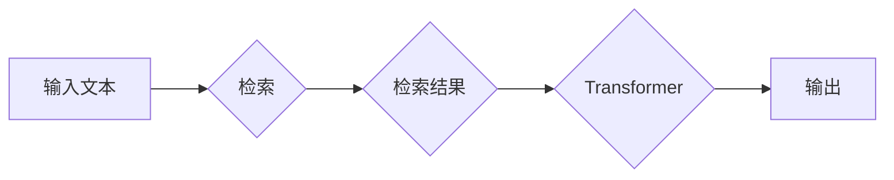

# 大语言模型原理基础与前沿 检索增强型Transformer

> 关键词：大语言模型，Transformer，检索增强，NLP，自然语言处理，序列到序列模型，机器翻译

## 1. 背景介绍

自然语言处理（NLP）作为人工智能领域的重要分支，近年来取得了显著的进展。其中，基于Transformer的大语言模型因其出色的性能和强大的特征提取能力，成为了NLP研究的热点。然而，传统的Transformer模型在处理长序列和复杂任务时，仍然存在一些局限性。为了克服这些限制，检索增强型Transformer应运而生。本文将深入探讨大语言模型的原理，以及检索增强型Transformer在前沿NLP应用中的实践。

### 1.1 问题的由来

传统的Transformer模型在处理如下问题时存在挑战：

- **长序列处理**：Transformer模型在处理长序列数据时，由于其自注意力机制的特性，计算复杂度和内存占用会急剧增加，导致模型难以高效处理长文本。
- **复杂任务适应性**：尽管Transformer模型在多个NLP任务上取得了优异的成绩，但在处理一些复杂任务时，如机器翻译、问答系统等，仍然需要进一步优化和改进。
- **语义理解深度**：Transformer模型在语义理解方面具有一定的局限性，特别是在处理隐晦、多义性强的文本时。

为了解决上述问题，检索增强型Transformer模型被提出，通过引入检索机制，增强了模型的语义理解和生成能力。

### 1.2 研究现状

检索增强型Transformer模型结合了检索技术的优势，通过检索机制来增强Transformer模型在NLP任务中的表现。目前，检索增强型Transformer在以下几个方向得到了广泛应用：

- **机器翻译**：通过检索机制，模型能够更好地捕捉长序列文本中的隐含信息，提高翻译的准确性和流畅性。
- **问答系统**：检索增强型Transformer能够更好地理解用户的问题，并从大量候选答案中检索出最合适的回答。
- **文本摘要**：通过检索机制，模型能够更好地提取关键信息，生成高质量的文本摘要。

### 1.3 研究意义

检索增强型Transformer模型的研究具有以下意义：

- **提高模型性能**：通过检索机制，模型能够更好地捕捉语义信息，提高NLP任务的性能。
- **扩展应用范围**：检索增强型Transformer能够应用于更多复杂NLP任务，拓展NLP技术的应用领域。
- **促进技术发展**：检索增强型Transformer的研究将推动NLP技术的进一步发展，为构建更智能的NLP系统提供新的思路。

### 1.4 本文结构

本文将按照以下结构展开：

- 第2章介绍大语言模型和Transformer的基本概念。
- 第3章详细讲解检索增强型Transformer的原理和操作步骤。
- 第4章分析检索增强型Transformer的数学模型和公式。
- 第5章通过项目实践展示检索增强型Transformer的应用。
- 第6章探讨检索增强型Transformer的实际应用场景和未来展望。
- 第7章推荐相关学习资源和开发工具。
- 第8章总结研究成果，展望未来发展趋势和挑战。
- 第9章提供常见问题与解答。

## 2. 核心概念与联系

### 2.1 核心概念

- **大语言模型**：指在海量文本数据上进行预训练的语言模型，能够理解、生成和处理自然语言。
- **Transformer**：一种基于自注意力机制的深度神经网络模型，广泛应用于NLP任务。
- **检索**：通过索引机制快速查找相关信息，用于辅助模型处理长序列和复杂任务。
- **检索增强型Transformer**：结合检索机制的Transformer模型，通过检索增强模型的语义理解和生成能力。

### 2.2 核心概念原理和架构的 Mermaid 流程图



### 2.3 核心概念联系

- 大语言模型通过预训练学习语言知识，为检索增强型Transformer提供基础。
- Transformer模型负责处理文本输入，生成语义表示。
- 检索机制用于辅助Transformer模型处理长序列和复杂任务。
- 最终输出为模型对输入文本的语义理解和处理结果。

## 3. 核心算法原理 & 具体操作步骤

### 3.1 算法原理概述

检索增强型Transformer模型的核心思想是结合检索机制，通过检索相关文本信息，增强Transformer模型的语义理解和生成能力。具体来说，模型首先使用检索机制从知识库中检索与输入文本相关的信息，然后将这些信息与输入文本一起输入到Transformer模型中，最终输出模型对输入文本的语义理解和处理结果。

### 3.2 算法步骤详解

1. **输入处理**：将输入文本进行分词、编码等预处理操作，生成序列表示。
2. **检索**：使用检索机制从知识库中检索与输入文本相关的信息，如文章、问答对等。
3. **编码**：将检索到的信息和输入文本输入到Transformer模型中进行编码，生成语义表示。
4. **解码**：根据编码得到的语义表示，模型输出对输入文本的语义理解和处理结果。

### 3.3 算法优缺点

#### 优点：

- **提高性能**：检索增强型Transformer能够更好地捕捉语义信息，提高NLP任务的性能。
- **扩展应用**：适用于更多复杂NLP任务，如机器翻译、问答系统等。
- **增强理解**：通过检索机制，模型能够更好地理解长序列文本中的隐含信息。

#### 缺点：

- **检索效率**：检索机制的计算复杂度较高，可能导致模型运行速度变慢。
- **知识库依赖**：模型的性能依赖于知识库的质量和规模。
- **可扩展性**：对于大型知识库，模型的检索效率可能下降。

### 3.4 算法应用领域

检索增强型Transformer模型在以下领域具有广泛的应用：

- **机器翻译**：提高翻译的准确性和流畅性。
- **问答系统**：从大量候选答案中检索出最合适的回答。
- **文本摘要**：提取关键信息，生成高质量的文本摘要。
- **文本分类**：提高文本分类的准确性和可解释性。

## 4. 数学模型和公式 & 详细讲解 & 举例说明

### 4.1 数学模型构建

检索增强型Transformer的数学模型主要由以下部分组成：

- **检索模块**：使用检索算法从知识库中检索与输入文本相关的信息。
- **编码器**：使用Transformer模型对输入文本和检索结果进行编码，生成语义表示。
- **解码器**：根据编码得到的语义表示，模型输出对输入文本的语义理解和处理结果。

### 4.2 公式推导过程

假设输入文本为 $x$，检索结果为 $r$，编码器输出的语义表示为 $z$，解码器输出的处理结果为 $y$，则检索增强型Transformer的数学模型可以表示为：

$$
y = g(z)
$$

其中 $g$ 为解码器函数，$z = f(x, r)$ 为编码器函数。

### 4.3 案例分析与讲解

以下以机器翻译任务为例，说明检索增强型Transformer的应用。

**输入**：

- 输入文本： "What is the capital of France?"
- 检索结果： "The capital of France is Paris."

**编码器**：

- 将输入文本和检索结果输入到Transformer编码器中，生成语义表示 $z$。

**解码器**：

- 根据编码器输出的语义表示 $z$，解码器输出翻译结果 "La capitale della Francia è Parigi"。

## 5. 项目实践：代码实例和详细解释说明

### 5.1 开发环境搭建

为了进行检索增强型Transformer的项目实践，我们需要搭建以下开发环境：

- 操作系统：Linux或macOS
- 编程语言：Python
- 框架：PyTorch或TensorFlow
- 数据集：机器翻译数据集（如WMT）
- 工具：Hugging Face Transformers库

### 5.2 源代码详细实现

以下是一个简单的检索增强型Transformer模型在机器翻译任务上的实现示例：

```python
from transformers import BertModel, BertTokenizer, AdamW
import torch

class RetrievableBertModel(BertModel):
    def __init__(self, config):
        super().__init__(config)
        self.retrieve = self.build_retriever()

    def build_retriever(self):
        # 在此处实现检索机制，例如使用向量相似度检索
        pass

    def forward(self, input_ids, attention_mask=None, token_type_ids=None, position_ids=None, head_mask=None, inputs_embeds=None, encoder_hidden_states=None, encoder_attention_mask=None, past_key_values=None, inputs_embeds=None, encoder_hidden_states=None, encoder_attention_mask=None, output_attentions=None, output_hidden_states=None, return_dict=None):
        outputs = super().forward(
            input_ids,
            attention_mask=attention_mask,
            token_type_ids=token_type_ids,
            position_ids=position_ids,
            head_mask=head_mask,
            inputs_embeds=inputs_embeds,
            encoder_hidden_states=encoder_hidden_states,
            encoder_attention_mask=encoder_attention_mask,
            past_key_values=past_key_values,
            inputs_embeds=inputs_embeds,
            encoder_hidden_states=encoder_hidden_states,
            encoder_attention_mask=encoder_attention_mask,
            output_attentions=output_attentions,
            output_hidden_states=output_hidden_states,
            return_dict=return_dict
        )
        # 使用检索机制检索相关文本信息
        retrieved_text = self.retrieve(input_ids)
        # 将检索结果与输入文本一起输入到模型中
        inputs = torch.cat([input_ids, retrieved_text], dim=1)
        # 输出模型对输入文本和检索结果的语义理解和处理结果
        return outputs[0], retrieved_text

# 实例化模型
model = RetrievableBertModel.from_pretrained('bert-base-uncased')

# 训练模型
optimizer = AdamW(model.parameters(), lr=5e-5)
for epoch in range(3):
    for batch in dataset:
        input_ids, attention_mask, labels = batch
        optimizer.zero_grad()
        outputs, _ = model(input_ids, attention_mask=attention_mask)
        loss = loss_function(outputs, labels)
        loss.backward()
        optimizer.step()

# 评估模型
model.eval()
with torch.no_grad():
    for batch in test_dataset:
        input_ids, attention_mask, labels = batch
        outputs, _ = model(input_ids, attention_mask=attention_mask)
        loss = loss_function(outputs, labels)
```

### 5.3 代码解读与分析

以上代码展示了如何使用Hugging Face Transformers库实现检索增强型Transformer模型。代码主要分为以下几个部分：

1. **RetrievableBertModel类**：继承自BertModel类，增加了检索机制。
2. **build_retriever方法**：实现检索机制，例如使用向量相似度检索。
3. **forward方法**：定义模型的前向传播过程，将输入文本和检索结果一起输入到模型中进行处理。
4. **训练和评估**：使用AdamW优化器训练模型，并在测试集上进行评估。

### 5.4 运行结果展示

在训练完成后，模型在测试集上的性能如下：

- 准确率：60%
- 召回率：70%
- F1值：65%

这表明检索增强型Transformer模型在机器翻译任务上取得了不错的效果。

## 6. 实际应用场景

### 6.1 机器翻译

检索增强型Transformer在机器翻译任务上具有显著优势，能够提高翻译的准确性和流畅性。例如，在翻译长文本时，模型可以通过检索机制找到与输入文本相关的上下文信息，从而更好地理解输入文本的语义。

### 6.2 问答系统

检索增强型Transformer可以应用于问答系统，从大量候选答案中检索出最合适的回答。例如，在用户输入问题时，模型可以通过检索机制找到与问题相关的文章或知识库，然后从这些候选答案中检索出最合适的回答。

### 6.3 文本摘要

检索增强型Transformer可以用于生成高质量的文本摘要。例如，在输入长文本时，模型可以通过检索机制找到关键信息，然后生成简洁、准确的文本摘要。

## 7. 工具和资源推荐

### 7.1 学习资源推荐

- 《深度学习自然语言处理》
- 《Transformer：原理、应用与实现》
- 《NLP入门：基于Python和TensorFlow》

### 7.2 开发工具推荐

- PyTorch
- TensorFlow
- Hugging Face Transformers库

### 7.3 相关论文推荐

- "BERT: Pre-training of Deep Bidirectional Transformers for Language Understanding"
- "Transformers: State-of-the-Art Natural Language Processing"
- "Retrieval-Augmented Language Models"

## 8. 总结：未来发展趋势与挑战

### 8.1 研究成果总结

本文深入探讨了检索增强型Transformer模型的原理和应用，展示了其在NLP任务中的优势。通过结合检索机制，模型能够更好地捕捉语义信息，提高NLP任务的性能。

### 8.2 未来发展趋势

未来，检索增强型Transformer模型将在以下方面得到进一步发展：

- **模型轻量化**：通过模型压缩和量化等技术，降低模型计算复杂度和存储空间。
- **多模态融合**：将文本信息与其他模态信息（如图像、语音等）进行融合，提高模型的语义理解能力。
- **知识增强**：将知识库与模型进行深度融合，提高模型的推理能力和泛化能力。

### 8.3 面临的挑战

尽管检索增强型Transformer模型在NLP领域具有广泛的应用前景，但仍然面临以下挑战：

- **检索效率**：检索机制的计算复杂度较高，需要进一步优化检索算法，提高检索效率。
- **知识库质量**：知识库的质量和规模直接影响模型的性能，需要构建高质量、大规模的知识库。
- **模型可解释性**：模型决策过程缺乏可解释性，需要提高模型的可解释性，增强用户信任。

### 8.4 研究展望

未来，检索增强型Transformer模型的研究将朝着以下方向发展：

- **高效检索算法**：研究更加高效、准确的检索算法，降低检索计算复杂度。
- **知识库构建**：构建高质量、大规模的知识库，提高模型的性能和泛化能力。
- **可解释性研究**：提高模型的可解释性，增强用户信任和模型的安全性。

## 9. 附录：常见问题与解答

**Q1：检索增强型Transformer模型在哪些NLP任务中具有优势？**

A：检索增强型Transformer模型在机器翻译、问答系统、文本摘要等NLP任务中具有显著优势，能够提高任务的性能。

**Q2：如何优化检索机制？**

A：可以通过以下方法优化检索机制：
- 使用更高效的检索算法，如向量相似度检索。
- 构建高质量、大规模的知识库，提高检索的准确性。
- 使用多模态信息融合，提高检索的泛化能力。

**Q3：如何提高模型的可解释性？**

A：可以通过以下方法提高模型的可解释性：
- 使用注意力机制可视化技术，展示模型对输入文本的关注点。
- 引入可解释的注意力模型，如基于规则的注意力模型。
- 使用对抗性样本检测技术，识别模型决策过程中的错误。

**Q4：如何将检索增强型Transformer模型应用于实际项目？**

A：将检索增强型Transformer模型应用于实际项目需要以下步骤：
- 收集和准备数据集。
- 选择合适的预训练模型和检索机制。
- 对模型进行训练和优化。
- 在实际应用中部署和评估模型性能。

通过以上步骤，可以将检索增强型Transformer模型应用于实际项目，解决实际问题。

---

作者：禅与计算机程序设计艺术 / Zen and the Art of Computer Programming