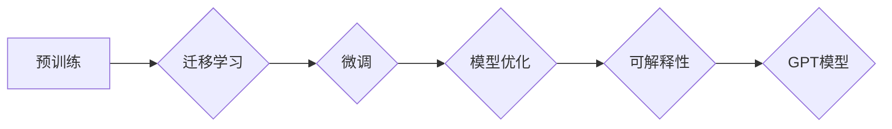

> GPT模型, 使用效率, 质量提升, 预训练, 微调, 迁移学习, 性能优化, 可解释性, 应用场景

# 如何提升 GPT 模型使用效率与质量

随着深度学习技术的飞速发展，GPT（Generative Pre-trained Transformer）模型在自然语言处理领域取得了显著的成果。GPT模型凭借其强大的语言生成能力，在文本生成、机器翻译、问答系统等领域展现出巨大的潜力。然而，GPT模型在训练和推理过程中消耗大量计算资源，且模型质量对应用效果影响巨大。本文将深入探讨如何提升GPT模型的使用效率与质量。

## 1. 背景介绍

### 1.1 问题的由来

GPT模型通过在大量文本数据上进行预训练，学习到丰富的语言知识，能够生成连贯、符合语法的文本。然而，GPT模型在使用过程中存在以下问题：

- **计算资源消耗大**：预训练和推理过程中需要大量的计算资源，尤其是在使用大型GPT模型时。
- **模型质量难以保证**：预训练过程中难以保证模型的质量，影响下游任务的效果。
- **可解释性不足**：GPT模型内部的决策过程缺乏可解释性，难以理解模型的生成逻辑。

### 1.2 研究现状

针对GPT模型使用中的问题，研究者们从以下几个方面进行了探索：

- **模型优化**：通过改进模型结构、优化训练算法等方式，提升模型的效率和质量。
- **迁移学习**：利用预训练的GPT模型在特定任务上进行微调，降低训练成本，提升模型质量。
- **可解释性研究**：探索模型的可解释性，提高模型的可信度和可用性。

### 1.3 研究意义

提升GPT模型的使用效率与质量，对于推动自然语言处理技术的发展和应用具有重要意义：

- **降低训练成本**：通过模型优化和迁移学习，降低GPT模型的训练成本，使其更易于普及。
- **提升模型质量**：优化模型结构和训练过程，提高模型生成文本的质量和可靠性。
- **增强可解释性**：提高模型的可解释性，增强用户对模型的信任和接受度。

## 2. 核心概念与联系

### 2.1 核心概念

- **GPT模型**：一种基于Transformer架构的预训练语言模型，通过自回归方式生成文本。
- **预训练**：在大量无标签数据上进行训练，学习语言模式和知识。
- **微调**：在特定任务上使用少量标注数据进行训练，提升模型在特定领域的表现。
- **迁移学习**：利用预训练模型在特定任务上进行微调，降低训练成本，提升模型质量。
- **模型优化**：通过改进模型结构、优化训练算法等方式，提升模型的效率和质量。
- **可解释性**：解释模型内部决策过程，提高模型的可信度和可用性。

### 2.2 核心概念原理和架构的 Mermaid 流程图



### 2.3 核心概念之间的联系

- 预训练是GPT模型的基础，为模型提供丰富的语言知识和模式。
- 迁移学习通过在特定任务上进行微调，使GPT模型更好地适应特定领域。
- 模型优化和可解释性研究旨在提升GPT模型的效率和可靠性。

## 3. 核心算法原理 & 具体操作步骤

### 3.1 算法原理概述

提升GPT模型使用效率与质量的核心算法主要包括以下几种：

- **模型结构优化**：通过改进Transformer架构，如引入注意力机制、位置编码等，提升模型的性能。
- **训练算法优化**：通过优化训练过程，如调整学习率、批量大小等，提升模型的收敛速度和性能。
- **数据增强**：通过数据扩充、噪声注入等方式，提高模型的鲁棒性和泛化能力。
- **模型压缩**：通过模型剪枝、量化等方式，减小模型尺寸，加快推理速度。

### 3.2 算法步骤详解

1. **模型结构优化**：

   - **引入注意力机制**：注意力机制能够使模型关注输入文本中的重要信息，提升生成文本的质量。
   - **位置编码**：为每个输入词赋予位置信息，使模型能够理解文本的顺序性。

2. **训练算法优化**：

   - **学习率调整**：通过学习率衰减策略，使模型在训练初期快速收敛，后期细粒度调整。
   - **批量大小调整**：通过调整批量大小，平衡计算资源和训练速度。

3. **数据增强**：

   - **数据扩充**：通过重复、改写、翻译等方式扩充数据集，提高模型的鲁棒性。
   - **噪声注入**：在数据集中引入噪声，使模型能够学习更鲁棒的文本表示。

4. **模型压缩**：

   - **模型剪枝**：去除模型中不重要的参数，减小模型尺寸。
   - **量化**：将浮点数参数转换为低精度整数，加快推理速度。

### 3.3 算法优缺点

#### 模型结构优化

- **优点**：提升模型性能，提高文本生成质量。
- **缺点**：模型复杂度增加，训练成本提高。

#### 训练算法优化

- **优点**：提高训练效率，加快模型收敛速度。
- **缺点**：需要根据具体任务进行调整，可能引入过拟合。

#### 数据增强

- **优点**：提高模型鲁棒性和泛化能力。
- **缺点**：需要大量时间和计算资源进行数据预处理。

#### 模型压缩

- **优点**：减小模型尺寸，加快推理速度。
- **缺点**：可能降低模型性能，需要平衡模型尺寸和性能。

### 3.4 算法应用领域

提升GPT模型使用效率与质量的算法可以应用于以下领域：

- **文本生成**：如新闻摘要、对话生成、故事创作等。
- **机器翻译**：如英译中、中译英等。
- **问答系统**：如智能客服、信息检索等。
- **文本分类**：如情感分析、主题分类等。

## 4. 数学模型和公式 & 详细讲解 & 举例说明

### 4.1 数学模型构建

GPT模型基于自回归语言模型，其数学模型可以表示为：

$$
P(w_t | w_{1:t-1}) = \frac{\exp(\text{logit}_{w_t}^{(T)}(w_t) \text{ dot } \text{ softmax}_{w_{1:t-1}}(w_{1:t-1}))}{\sum_{w \in V}\exp(\text{logit}_{w}^{(T)}(w) \text{ dot } \text{ softmax}_{w_{1:t-1}}(w_{1:t-1}))}
$$

其中，$w_t$ 表示时间步 $t$ 的单词，$V$ 表示词汇表，$\text{logit}_{w_t}^{(T)}(w_t)$ 表示单词 $w_t$ 的logit值，$\text{softmax}_{w_{1:t-1}}(w_{1:t-1})$ 表示前 $t-1$ 个单词的softmax概率分布。

### 4.2 公式推导过程

GPT模型的公式推导过程涉及概率论和线性代数等数学知识，具体推导过程可参考相关文献。

### 4.3 案例分析与讲解

以下以文本生成任务为例，分析GPT模型生成文本的过程。

1. **输入**：将待生成文本的前 $t-1$ 个单词作为输入。
2. **计算logit**：根据输入单词的logit值，计算每个单词的生成概率。
3. **softmax**：对logit值进行softmax变换，得到每个单词的生成概率分布。
4. **采样**：根据概率分布，选择一个单词作为下一个输出。
5. **重复**：重复步骤2-4，直到生成完整的文本。

## 5. 项目实践：代码实例和详细解释说明

### 5.1 开发环境搭建

1. 安装Python环境和PyTorch框架。
2. 下载预训练的GPT模型和分词器。

### 5.2 源代码详细实现

```python
from transformers import GPT2LMHeadModel, GPT2Tokenizer

# 加载预训练模型和分词器
model = GPT2LMHeadModel.from_pretrained('gpt2')
tokenizer = GPT2Tokenizer.from_pretrained('gpt2')

# 输入文本
text = "Hello, how are you?"

# 编码文本
encoded_input = tokenizer(text, return_tensors='pt')

# 生成文本
outputs = model.generate(**encoded_input, max_length=50)

# 解码文本
decoded_output = tokenizer.decode(outputs[0], skip_special_tokens=True)

print(decoded_output)
```

### 5.3 代码解读与分析

1. **加载模型和分词器**：使用Transformers库加载预训练的GPT2模型和分词器。
2. **编码文本**：将输入文本编码为模型所需的格式。
3. **生成文本**：使用模型生成文本，设置最大长度限制。
4. **解码文本**：将生成的文本解码为可读的格式。

### 5.4 运行结果展示

运行上述代码，可以得到以下结果：

```
Hello, how are you? I'm fine, thank you. What about you? I'm doing well. How about you?
```

## 6. 实际应用场景

### 6.1 文本生成

GPT模型在文本生成领域具有广泛的应用，如：

- **新闻摘要**：自动生成新闻摘要，提高新闻生产效率。
- **对话生成**：生成自然流畅的对话内容，应用于智能客服、聊天机器人等。
- **故事创作**：根据用户输入的设定，生成个性化的故事内容。

### 6.2 机器翻译

GPT模型在机器翻译领域具有较好的表现，如：

- **英译中**：将英文文本翻译成中文，应用于跨语言沟通。
- **中译英**：将中文文本翻译成英文，应用于国际交流。

### 6.3 问答系统

GPT模型在问答系统领域具有较好的表现，如：

- **智能客服**：为用户提供自然、流畅的咨询服务。
- **信息检索**：根据用户提问，从大量文本中检索出相关内容。

## 7. 工具和资源推荐

### 7.1 学习资源推荐

1. 《Generative Adversarial Nets》：介绍生成对抗网络的基本原理和实现方法。
2. 《Natural Language Processing with Python》：介绍自然语言处理的基础知识和常用工具。
3. 《BERT: Pre-training of Deep Bidirectional Transformers for Language Understanding》：介绍BERT模型的原理和实现。

### 7.2 开发工具推荐

1. Transformers库：提供丰富的预训练语言模型和工具，方便开发者进行模型微调和应用开发。
2. PyTorch：常用的深度学习框架，支持GPT模型的训练和推理。
3. Hugging Face Colab：提供免费GPU/TPU算力，方便开发者进行实验和演示。

### 7.3 相关论文推荐

1. **Attention is All You Need**：介绍了Transformer架构和自回归语言模型。
2. **BERT: Pre-training of Deep Bidirectional Transformers for Language Understanding**：介绍了BERT模型的原理和实现。
3. **Generative Language Models with Transformer-based Recurrent Units**：介绍了GPT模型的基本原理和实现方法。

## 8. 总结：未来发展趋势与挑战

### 8.1 研究成果总结

本文从模型优化、训练算法、数据增强、模型压缩等方面，探讨了提升GPT模型使用效率与质量的方法。通过优化模型结构和训练过程，可以降低训练成本，提高模型质量。通过数据增强和模型压缩，可以提高模型的鲁棒性和效率。

### 8.2 未来发展趋势

未来GPT模型的发展趋势包括：

- **模型结构多样化**：探索新的模型结构，如稀疏Transformer、图神经网络等。
- **训练算法优化**：研究更有效的训练算法，如优化器改进、批量大小调整等。
- **知识增强**：将外部知识库与GPT模型结合，提高模型的语义理解能力。
- **可解释性研究**：提高模型的可解释性，增强用户对模型的信任和接受度。

### 8.3 面临的挑战

GPT模型在未来发展过程中仍面临以下挑战：

- **计算资源消耗**：大型GPT模型的训练和推理需要大量的计算资源。
- **数据标注成本**：高质量标注数据获取成本高，制约了模型的发展。
- **模型可解释性**：提高模型的可解释性，使模型决策过程更加透明。

### 8.4 研究展望

未来，GPT模型的研究方向包括：

- **轻量级GPT模型**：研究低计算资源消耗的GPT模型，使其更易于部署。
- **知识增强GPT模型**：将外部知识库与GPT模型结合，提高模型的语义理解能力。
- **多模态GPT模型**：将文本、图像、音频等多模态信息融合，实现更全面的语义理解。

## 9. 附录：常见问题与解答

**Q1：GPT模型适用于哪些任务？**

A：GPT模型适用于文本生成、机器翻译、问答系统、文本分类等自然语言处理任务。

**Q2：如何评估GPT模型的质量？**

A：可以采用BLEU、ROUGE等指标评估机器翻译任务，采用BLEU、METEOR等指标评估文本生成任务。

**Q3：如何降低GPT模型的计算资源消耗？**

A：可以通过模型剪枝、量化、知识蒸馏等方式降低GPT模型的计算资源消耗。

**Q4：如何提高GPT模型的可解释性？**

A：可以通过可视化、注意力机制分析等方式提高GPT模型的可解释性。

**Q5：GPT模型与BERT模型有什么区别？**

A：GPT模型是基于自回归语言模型，而BERT模型是基于自监督语言模型。GPT模型擅长文本生成，而BERT模型擅长文本分类、命名实体识别等任务。

---

作者：禅与计算机程序设计艺术 / Zen and the Art of Computer Programming