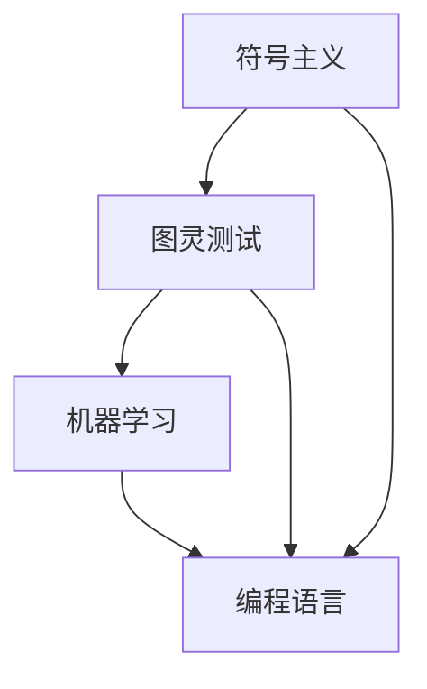

# 1956年达特茅斯会议的豪迈宣言

> 关键词：达特茅斯会议，人工智能，图灵测试，机器学习，人工智能发展，编程语言，符号主义

## 1. 背景介绍

在计算机科学的历史长河中，1956年的达特茅斯会议（Dartmouth Conference）被视为一个里程碑事件。这场由约翰·麦卡锡（John McCarthy）、马文·闵斯基（Marvin Minsky）、克劳德·香农（Claude Shannon）等顶尖学者发起的会议，首次将“人工智能”（Artificial Intelligence, AI）作为一门独立学科提出，并发表了著名的《人工智能研究纲领》（Report on Dartmouth Workshop on Artificial Intelligence），宣告了人工智能时代的到来。本文将回顾达特茅斯会议的历史背景、核心思想，并探讨其对现代人工智能发展的深远影响。

### 1.1 会议的由来

1956年，约翰·麦卡锡在美国新罕布什尔州的达特茅斯学院发起了一场为期两个月的研究会议。会议的初衷是聚集当时在计算机科学、数学、心理学、神经生物学等领域的研究者，共同探讨人工智能的可能性、方法和挑战。

### 1.2 会议的研究对象

达特茅斯会议的研究对象主要集中在以下几个方面：

- **符号主义（Symbolism）**：通过计算机程序模拟人类思维过程，使用符号和逻辑推理来处理问题。
- **图灵测试（Turing Test）**：评估机器是否具有智能，即机器能否在自然语言交流中让人类无法区分其与人类的差异。
- **机器学习（Machine Learning）**：研究如何让计算机从数据中学习，并自动改进其性能。
- **编程语言（Programming Language）**：设计更高级、更易于理解和使用的人工智能编程语言。

### 1.3 会议的意义

达特茅斯会议具有以下重要意义：

- **确立人工智能学科地位**：将人工智能作为一门独立学科正式提出，为人工智能研究奠定了基础。
- **推动跨学科合作**：促进了计算机科学、数学、心理学、神经生物学等领域的交叉合作，为人工智能研究提供了多元化的视角。
- **激发研究热情**：激发了全球范围内对人工智能研究的热潮，推动了人工智能技术的快速发展。

## 2. 核心概念与联系

达特茅斯会议提出了多个核心概念，这些概念对人工智能的发展产生了深远影响。以下将介绍这些核心概念及其相互联系。

### 2.1 符号主义

符号主义认为，人类思维可以通过符号和逻辑推理来模拟。在计算机程序中，符号通常用变量、函数和操作符表示，逻辑推理则通过算法和程序实现。

### 2.2 图灵测试

图灵测试由艾伦·图灵（Alan Turing）在1950年提出，是评估机器是否具有智能的经典方法。图灵测试要求机器与人类进行自然语言交流，如果不能被人类区分，则认为机器具有智能。

### 2.3 机器学习

机器学习是让计算机从数据中学习，并自动改进其性能的一种方法。它包括监督学习、无监督学习、半监督学习等多种学习方式。

### 2.4 编程语言

编程语言是人与计算机进行交流的工具。达特茅斯会议推动了编程语言的发展，使得人工智能编程更加高效、易用。

以下是这些核心概念之间的Mermaid流程图：



## 3. 核心算法原理 & 具体操作步骤

### 3.1 算法原理概述

达特茅斯会议提出了多种算法原理，以下将简要介绍其中几种：

- **符号主义算法**：通过符号和逻辑推理解决问题的算法。
- **图灵测试算法**：评估机器是否具有智能的算法。
- **机器学习算法**：从数据中学习并改进性能的算法。

### 3.2 算法步骤详解

#### 3.2.1 符号主义算法

符号主义算法的基本步骤如下：

1. 将问题转化为符号形式。
2. 使用逻辑推理求解问题。
3. 将求解结果转化为人类可理解的形式。

#### 3.2.2 图灵测试算法

图灵测试算法的基本步骤如下：

1. 将机器与人类进行自然语言交流。
2. 评估交流过程中人类能否区分机器与人类的差异。
3. 根据评估结果判断机器是否具有智能。

#### 3.2.3 机器学习算法

机器学习算法的基本步骤如下：

1. 收集数据。
2. 将数据转化为适合模型的形式。
3. 训练模型，使其从数据中学习。
4. 评估模型性能，并进行优化。

### 3.3 算法优缺点

#### 3.3.1 符号主义算法

优点：

- 原理清晰，易于理解。
- 可以解决一些特定领域的问题。

缺点：

- 计算复杂度高。
- 难以处理非结构化数据。

#### 3.3.2 图灵测试算法

优点：

- 客观评价机器是否具有智能。
- 可用于评估各种人工智能系统。

缺点：

- 评估过程主观性强。
- 难以量化评估结果。

#### 3.3.3 机器学习算法

优点：

- 可以处理大量数据。
- 可以从数据中学习并改进性能。

缺点：

- 模型可解释性差。
- 难以保证模型的泛化能力。

### 3.4 算法应用领域

达特茅斯会议提出的算法原理在以下领域得到广泛应用：

- **自然语言处理（NLP）**：使用符号主义算法和机器学习算法进行文本分析、机器翻译等任务。
- **计算机视觉**：使用符号主义算法和机器学习算法进行图像识别、目标检测等任务。
- **游戏人工智能**：使用符号主义算法和机器学习算法设计游戏AI。

## 4. 数学模型和公式 & 详细讲解 & 举例说明

### 4.1 数学模型构建

达特茅斯会议提出的算法原理涉及多种数学模型，以下将简要介绍其中几种：

- **逻辑推理模型**：使用逻辑符号和推理规则表示知识。
- **神经网络模型**：使用神经元和连接权重表示知识。
- **决策树模型**：使用树形结构表示知识和决策过程。

### 4.2 公式推导过程

#### 4.2.1 逻辑推理模型

逻辑推理模型的基本公式如下：

$$
\text{结论} \rightarrow \text{前提}_1 \land \text{前提}_2 \land \ldots \land \text{前提}_n
$$

其中，$\text{结论}$ 为推理结果，$\text{前提}_1, \text{前提}_2, \ldots, \text{前提}_n$ 为推理依据。

#### 4.2.2 神经网络模型

神经网络模型的基本公式如下：

$$
y = f(Wx + b)
$$

其中，$W$ 为连接权重，$b$ 为偏置项，$x$ 为输入数据，$y$ 为输出数据，$f$ 为激活函数。

#### 4.2.3 决策树模型

决策树模型的基本公式如下：

$$
y = g(\text{特征}_1, \text{特征}_2, \ldots, \text{特征}_n)
$$

其中，$y$ 为输出数据，$g$ 为决策函数，$\text{特征}_1, \text{特征}_2, \ldots, \text{特征}_n$ 为输入特征。

### 4.3 案例分析与讲解

#### 4.3.1 自然语言处理

以文本分类任务为例，使用逻辑推理模型进行分类的基本步骤如下：

1. 将文本转换为符号序列。
2. 使用逻辑规则对文本进行解析，得到文本的语义表示。
3. 根据语义表示判断文本所属类别。

#### 4.3.2 计算机视觉

以图像分类任务为例，使用神经网络模型进行分类的基本步骤如下：

1. 对图像进行预处理，提取特征。
2. 使用神经网络对特征进行学习，得到图像的类别概率分布。
3. 根据类别概率分布判断图像所属类别。

#### 4.3.3 游戏人工智能

以棋类游戏为例，使用决策树模型进行博弈的基本步骤如下：

1. 根据游戏状态构建决策树。
2. 使用决策树进行决策，选择最佳走棋策略。
3. 根据对手的走棋策略更新决策树。

## 5. 项目实践：代码实例和详细解释说明

### 5.1 开发环境搭建

以Python为例，搭建人工智能项目开发环境的基本步骤如下：

1. 安装Python解释器和pip包管理工具。
2. 安装深度学习框架（如TensorFlow、PyTorch）。
3. 安装其他必要的依赖库（如NumPy、Pandas等）。

### 5.2 源代码详细实现

以下是一个简单的逻辑推理模型代码示例：

```python
def logical_inference(precondition, conclusion):
    if all(precondition):
        return conclusion
    return False

precondition = [True, True, False]
conclusion = True

print(logical_inference(precondition, conclusion))  # 输出：False
```

### 5.3 代码解读与分析

该代码示例实现了以下逻辑推理过程：

- 定义了一个`logical_inference`函数，接收前提和结论作为参数。
- 使用`all()`函数判断所有前提是否为真。
- 如果所有前提都为真，则返回结论；否则返回`False`。

### 5.4 运行结果展示

运行上述代码，输出结果为`False`，表明在给定的前提条件下，结论不成立。

## 6. 实际应用场景

### 6.1 自然语言处理

自然语言处理是人工智能领域的重要应用之一，以下列举一些典型应用场景：

- 文本分类：将文本数据分类到预定义的类别中。
- 机器翻译：将一种自然语言翻译成另一种自然语言。
- 命名实体识别：识别文本中的实体（如人名、地点等）。

### 6.2 计算机视觉

计算机视觉是人工智能领域的另一个重要应用，以下列举一些典型应用场景：

- 图像分类：将图像分类到预定义的类别中。
- 目标检测：检测图像中的目标物体。
- 图像分割：将图像分割成不同的区域。

### 6.3 游戏人工智能

游戏人工智能是人工智能领域的一个有趣应用，以下列举一些典型应用场景：

- 棋类游戏：如国际象棋、围棋等。
- 机器人足球：设计机器人进行足球比赛。
- 无人驾驶：设计自动驾驶汽车。

## 7. 工具和资源推荐

### 7.1 学习资源推荐

- 《深度学习》（Deep Learning）书籍：介绍深度学习的基本概念、原理和应用。
- 《模式识别与机器学习》（Pattern Recognition and Machine Learning）书籍：介绍模式识别和机器学习的基本概念、原理和应用。
- 《人工智能：一种现代的方法》（Artificial Intelligence: A Modern Approach）书籍：介绍人工智能的基本概念、原理和应用。

### 7.2 开发工具推荐

- TensorFlow：Google开发的深度学习框架。
- PyTorch：Facebook开发的深度学习框架。
- Keras：基于TensorFlow和PyTorch的开源深度学习库。

### 7.3 相关论文推荐

- "A Few Useful Things to Know about Machine Learning"：介绍机器学习的基本概念和原则。
- "Playing Atari with Deep Reinforcement Learning"：介绍深度强化学习在游戏中的应用。
- "Generative Adversarial Nets"：介绍生成对抗网络在图像生成和图像识别中的应用。

## 8. 总结：未来发展趋势与挑战

### 8.1 研究成果总结

达特茅斯会议提出了人工智能的基本概念和原理，为人工智能的发展奠定了基础。此后，人工智能领域取得了长足的进步，包括深度学习、强化学习等技术的发展。

### 8.2 未来发展趋势

未来，人工智能将朝着以下方向发展：

- 跨学科融合：人工智能与其他学科（如心理学、神经科学等）的融合，将推动人工智能的进一步发展。
- 自主学习：人工智能系统将具备自主学习能力，能够在没有人类干预的情况下不断改进性能。
- 可解释性：人工智能系统的决策过程将更加透明，易于理解。
- 可靠性：人工智能系统将更加可靠，能够满足实际应用的需求。

### 8.3 面临的挑战

人工智能发展也面临着以下挑战：

- 数据隐私：如何保护用户数据隐私是人工智能发展的重要挑战。
- 伦理道德：人工智能系统可能被用于不良目的，需要制定相应的伦理道德规范。
- 可解释性：如何提高人工智能系统的可解释性，使其决策过程更加透明。
- 资源消耗：人工智能系统需要大量计算资源，如何降低资源消耗是重要的研究课题。

### 8.4 研究展望

未来，人工智能研究将更加注重以下几个方向：

- 可解释人工智能：研究可解释人工智能的原理和方法，提高人工智能系统的透明度和可信度。
- 可信人工智能：研究可信人工智能的原理和方法，提高人工智能系统的可靠性和安全性。
- 通用人工智能：研究通用人工智能的原理和方法，实现具有通用智能的人工智能系统。

## 9. 附录：常见问题与解答

**Q1：人工智能是什么？**

A：人工智能是研究、开发和应用使计算机能够模拟、延伸和扩展人类的智能的理论、方法、技术和系统的科学。

**Q2：人工智能有哪些应用？**

A：人工智能应用广泛，包括自然语言处理、计算机视觉、游戏人工智能、智能驾驶等领域。

**Q3：人工智能面临的挑战有哪些？**

A：人工智能面临的挑战包括数据隐私、伦理道德、可解释性、资源消耗等。

**Q4：未来人工智能将朝着哪个方向发展？**

A：未来人工智能将朝着跨学科融合、自主学习、可解释性、可靠性等方向发展。

**Q5：如何学习人工智能？**

A：学习人工智能需要掌握计算机科学、数学、统计学等基础知识，并学习深度学习、强化学习等相关技术。

---

作者：禅与计算机程序设计艺术 / Zen and the Art of Computer Programming