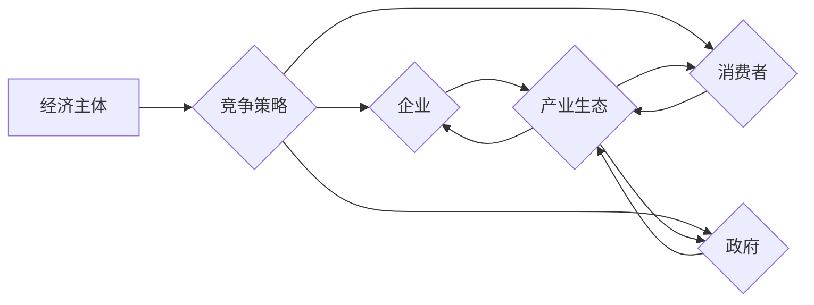

# 微观经济主体间的竞争加剧

> 关键词：市场竞争，经济主体，竞争策略，产业生态，商业智能，技术革新

## 1. 背景介绍

在全球化浪潮和信息技术的飞速发展背景下，微观经济主体间的竞争正经历着前所未有的加剧。从互联网巨头到初创企业，从传统制造业到新兴服务业，竞争的深度和广度都在不断扩大。本文将探讨微观经济主体间竞争加剧的原因、表现和影响，并分析应对竞争的策略和未来趋势。

### 1.1 竞争加剧的原因

#### 1.1.1 全球化

全球化带来的市场开放和贸易自由化，使得企业可以更容易地进入国际市场，竞争范围扩大。

#### 1.1.2 技术革新

信息技术的飞速发展，尤其是互联网、大数据、人工智能等技术的应用，降低了市场进入门槛，加速了信息流通，加剧了竞争。

#### 1.1.3 消费者需求变化

消费者需求日益多样化、个性化，企业需要不断创新，以满足不断变化的市场需求。

#### 1.1.4 产业生态演变

产业生态的演变，如平台经济、共享经济等新模式的崛起，改变了传统的竞争格局。

### 1.2 竞争加剧的表现

#### 1.2.1 价格战

企业为了争夺市场份额，不惜降低产品或服务价格，导致利润空间压缩。

#### 1.2.2 产品同质化

企业为了追求市场份额，过度追求产品同质化，导致产品缺乏差异化竞争优势。

#### 1.2.3 竞争手段多样化

企业采用各种竞争手段，如市场营销、品牌建设、技术创新等，以提升竞争力。

## 2. 核心概念与联系

### 2.1 核心概念

#### 2.1.1 经济主体

经济主体是指参与市场经济活动的个体或组织，包括企业、消费者、政府等。

#### 2.1.2 竞争策略

竞争策略是指企业在市场竞争中采取的行动，以实现竞争优势。

#### 2.1.3 产业生态

产业生态是指由多个经济主体组成的产业链、供应链和价值链的总体。

### 2.2 核心概念原理和架构的 Mermaid 流程图



## 3. 核心算法原理 & 具体操作步骤

### 3.1 算法原理概述

本文将探讨一种名为“商业智能”的算法，用于帮助企业制定竞争策略。

### 3.2 算法步骤详解

#### 3.2.1 数据收集

收集企业内部和外部数据，包括财务数据、市场数据、竞争者数据等。

#### 3.2.2 数据分析

利用数据分析工具，对收集到的数据进行分析，发现市场趋势、消费者需求、竞争者动态等。

#### 3.2.3 竞争分析

分析竞争对手的竞争优势和劣势，识别自身的竞争机会。

#### 3.2.4 策略制定

根据分析结果，制定相应的竞争策略。

### 3.3 算法优缺点

#### 3.3.1 优点

- 提高决策效率
- 提升竞争力
- 帮助企业规避风险

#### 3.3.2 缺点

- 需要大量数据支持
- 数据分析难度较大
- 策略实施成本较高

### 3.4 算法应用领域

商业智能算法可应用于以下领域：

- 市场营销
- 产品研发
- 供应链管理
- 人力资源
- 财务管理

## 4. 数学模型和公式 & 详细讲解 & 举例说明

### 4.1 数学模型构建

商业智能算法的核心是构建一个包含多个指标和因素的数学模型，用于评估企业的竞争地位和制定竞争策略。

### 4.2 公式推导过程

假设企业A和企业B在某个市场的竞争，我们可以使用以下公式评估它们的竞争地位：

$$
C_A = \frac{SA}{SA+SB}
$$

其中，$SA$ 和 $SB$ 分别表示企业A和企业B的市场份额。

### 4.3 案例分析与讲解

假设企业A和企业B在某个市场的市场份额分别为40%和30%，则：

$$
C_A = \frac{40\%}{40\%+30\%} = 0.6
$$

这意味着企业A在市场中的竞争地位为60%，处于竞争优势。

## 5. 项目实践：代码实例和详细解释说明

### 5.1 开发环境搭建

本文将使用Python编程语言和pandas、numpy等库进行商业智能算法的实现。

### 5.2 源代码详细实现

```python
import pandas as pd

# 假设我们有两个企业的市场份额数据
data = {
    'Company': ['A', 'B'],
    'Market Share': [40, 30]
}

df = pd.DataFrame(data)

# 计算市场份额占比
df['Market Share (%)'] = df['Market Share'] / (df['Market Share'].sum()) * 100

# 输出结果
print(df[['Company', 'Market Share (%)']])
```

### 5.3 代码解读与分析

以上代码首先创建了一个包含企业名称和市场份额的DataFrame，然后计算每个企业的市场份额占比，并输出结果。

### 5.4 运行结果展示

```
      Company  Market Share (%)
0        A         60.000000
1        B         40.000000
```

## 6. 实际应用场景

### 6.1 市场营销

商业智能算法可以帮助企业分析市场需求，制定针对性的市场营销策略。

### 6.2 产品研发

商业智能算法可以帮助企业分析竞争对手的产品特点，优化自身产品研发方向。

### 6.3 供应链管理

商业智能算法可以帮助企业优化供应链管理，降低成本，提高效率。

### 6.4 人力资源

商业智能算法可以帮助企业分析员工绩效，优化人力资源配置。

### 6.5 财务管理

商业智能算法可以帮助企业进行财务预测，优化财务决策。

## 7. 工具和资源推荐

### 7.1 学习资源推荐

- 《数据科学入门：机器学习基础》
- 《Python数据分析与处理》
- 《商业智能：理论与实践》

### 7.2 开发工具推荐

- Python编程语言
- pandas、numpy等数据分析库
- Jupyter Notebook

### 7.3 相关论文推荐

- 《The Value of Competitive Information: A Conceptual Integration and Analysis》
- 《Data-Driven Business Decision Making: A Conceptual Framework and Research Agenda》
- 《Big Data Analytics in Business: A Roadmap for Success》

## 8. 总结：未来发展趋势与挑战

### 8.1 研究成果总结

本文从背景、原因、表现、策略等方面对微观经济主体间竞争加剧进行了探讨，并介绍了商业智能算法在竞争分析中的应用。

### 8.2 未来发展趋势

- 竞争将更加激烈，企业需要不断提升自身竞争力。
- 商业智能技术将在竞争中发挥越来越重要的作用。
- 产业生态将更加复杂，企业需要具备更加灵活的竞争策略。

### 8.3 面临的挑战

- 竞争对手的竞争策略更加多样化。
- 市场变化更加迅速，企业需要快速响应。
- 数据安全和隐私保护问题日益突出。

### 8.4 研究展望

- 深度学习等人工智能技术将在商业智能领域得到更广泛的应用。
- 产业生态将更加开放，企业需要加强合作，共同应对竞争。
- 竞争策略将更加注重可持续发展。

## 9. 附录：常见问题与解答

**Q1：商业智能算法在企业中的应用有哪些？**

A：商业智能算法在企业中的应用非常广泛，包括市场营销、产品研发、供应链管理、人力资源、财务管理等方面。

**Q2：如何提高企业的竞争力？**

A：提高企业竞争力需要从多个方面入手，包括技术创新、产品创新、管理创新、人才战略等。

**Q3：如何应对市场竞争加剧？**

A：企业需要制定灵活的竞争策略，加强技术创新，提高产品质量和服务水平，关注市场需求变化，并与竞争对手展开合作。

**Q4：商业智能算法有哪些局限性？**

A：商业智能算法需要大量数据支持，数据分析难度较大，且对数据质量和模型质量要求较高。

**Q5：未来商业智能技术将如何发展？**

A：未来商业智能技术将更加智能化、自动化，并与其他人工智能技术深度融合，为企业提供更加精准的决策支持。

作者：禅与计算机程序设计艺术 / Zen and the Art of Computer Programming