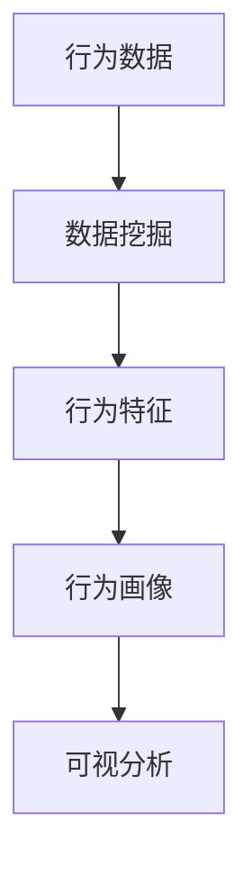
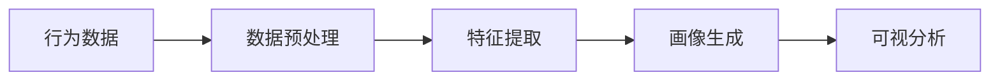
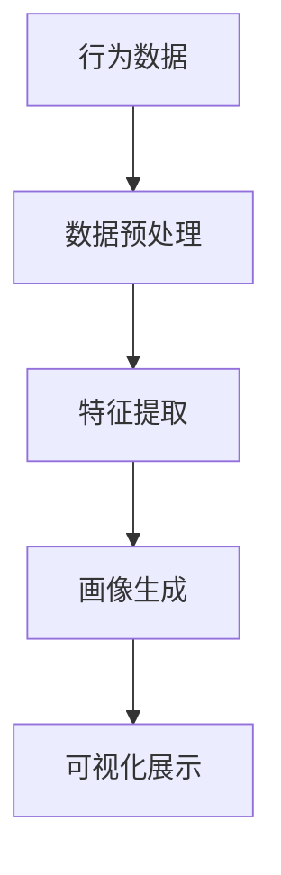

                 

# 学生行为习惯“画像”可视分析平台

> 关键词：行为分析,可视分析,学生画像,数据挖掘,机器学习

## 1. 背景介绍

### 1.1 问题由来

在当今信息时代，学生的行为习惯对于其学业成败、个人发展具有重要影响。然而，学生的行为习惯往往难以直接观察和量化，这对学校管理者和教育工作者提出了巨大挑战。传统的方法包括问卷调查、面试等，但这些方法存在主观性强、费时费力、效果有限等问题。因此，亟需一种更为高效、客观、准确的行为分析工具来帮助识别和改善学生行为习惯。

### 1.2 问题核心关键点

本项目旨在通过构建学生行为习惯“画像”可视分析平台，实现对学生行为习惯的全面、精准分析和可视化展示，以便学校和教育工作者能够更直观地了解学生状况，并针对性地进行干预和指导。其核心关键点包括：

- **数据收集与预处理**：从多维度收集学生行为数据，包括学习行为、社交行为、心理健康等，并对数据进行清洗和标准化。
- **行为特征提取**：利用数据挖掘和机器学习技术，从原始数据中提取有用的行为特征，用于描述学生行为习惯。
- **行为画像生成**：基于提取的行为特征，构建学生行为习惯“画像”，描述学生的整体行为特征。
- **可视化展示**：将行为画像以图表、热力图等形式可视化展示，方便学校管理者快速理解学生状况。

### 1.3 问题研究意义

本项目的研究和开发对于提高学校管理水平、促进学生健康成长具有重要意义：

- **提高管理效率**：通过数据驱动的管理决策，学校管理者能够更加科学地制定政策，优化教学资源配置。
- **个性化教育**：基于行为画像，教师可以更好地了解学生的个性化需求，因材施教，提高教学效果。
- **行为干预与指导**：及时发现问题行为，提供针对性的干预和指导，帮助学生改正不良习惯，促进其全面发展。
- **数据驱动决策**：借助强大的数据分析和可视化工具，学校可以更加依赖数据而非经验，做出更加科学的决策。

## 2. 核心概念与联系

### 2.1 核心概念概述

为了更好地理解学生行为习惯“画像”可视分析平台的构建，本节将介绍几个关键概念：

- **学生行为习惯**：指学生在校园内外表现出来的行为模式，包括学习、社交、心理健康等多个方面。
- **行为数据**：指记录学生行为习惯的各项指标和记录，如学习时间、课堂表现、社交互动等。
- **数据挖掘**：指从大量数据中提取有用信息和知识的过程，常用于发现隐藏的模式和关联。
- **行为画像**：指基于行为数据生成的，描述学生行为习惯的可视化表示，用于分析和展示学生状况。
- **可视分析**：指将数据和分析结果以图形化形式展示，方便用户理解和决策的过程。

这些概念之间的联系通过以下Mermaid流程图展示：



该流程图展示了从行为数据到可视分析的整个流程：

1. **数据收集与预处理**：收集学生行为数据，并进行清洗和标准化，为后续分析和展示提供数据基础。
2. **行为特征提取**：利用数据挖掘技术，从原始数据中提取行为特征，用于描述学生行为习惯。
3. **行为画像生成**：基于提取的行为特征，构建学生行为习惯“画像”，描述学生的整体行为特征。
4. **可视化展示**：将行为画像以图形化形式展示，方便学校管理者快速理解学生状况。

### 2.2 概念间的关系

这些概念之间存在着紧密的联系，形成了学生行为习惯分析的完整生态系统。下面我们通过几个Mermaid流程图来展示这些概念之间的关系。

#### 2.2.1 学生行为分析框架



这个流程图展示了从行为数据到画像生成的过程：

1. **行为数据**：收集学生行为数据，包括学习、社交、心理等多个方面。
2. **数据预处理**：对原始数据进行清洗、标准化等处理，以便后续分析。
3. **特征提取**：利用数据挖掘技术，从数据中提取有用的行为特征。
4. **画像生成**：基于提取的特征，构建学生行为画像，描述学生的整体行为特征。
5. **可视分析**：将画像以图形化形式展示，方便管理者理解学生状况。

#### 2.2.2 行为画像的构建



这个流程图展示了从行为数据到可视化展示的完整流程：

1. **行为数据**：收集学生行为数据。
2. **数据预处理**：对原始数据进行清洗和标准化处理。
3. **特征提取**：利用数据挖掘技术，从数据中提取行为特征。
4. **画像生成**：基于提取的特征，构建学生行为画像。
5. **可视化展示**：将画像以图形化形式展示，方便管理者理解学生状况。

### 2.3 核心概念的整体架构

最后，我们用一个综合的流程图来展示这些核心概念在大语言模型微调过程中的整体架构：


这个综合流程图展示了从行为数据到可视分析的完整过程。通过这些核心概念的组合，我们能够构建一个高效、准确、直观的学生行为习惯“画像”可视分析平台，帮助学校管理者更好地了解和管理学生行为。

## 3. 核心算法原理 & 具体操作步骤
### 3.1 算法原理概述

学生行为习惯“画像”可视分析平台的核心算法原理基于数据挖掘和机器学习技术，通过以下步骤实现学生行为习惯的分析和可视化展示：

1. **数据收集与预处理**：从多维度收集学生行为数据，并进行清洗和标准化处理，为后续分析提供数据基础。
2. **行为特征提取**：利用数据挖掘技术，从原始数据中提取有用的行为特征，用于描述学生行为习惯。
3. **行为画像生成**：基于提取的行为特征，构建学生行为习惯“画像”，描述学生的整体行为特征。
4. **可视化展示**：将行为画像以图表、热力图等形式可视化展示，方便学校管理者快速理解学生状况。

### 3.2 算法步骤详解

#### 3.2.1 数据收集与预处理

1. **数据收集**：通过各种传感器、问卷调查、在线平台等方式，收集学生的行为数据。
2. **数据预处理**：清洗数据，处理缺失值、异常值等，并进行标准化处理，以便后续分析。

#### 3.2.2 行为特征提取

1. **特征选择**：根据行为分析目标，选择重要的特征指标。例如，学习行为特征可能包括学习时间、作业完成情况、课堂参与度等。
2. **特征提取**：利用数据挖掘技术，如聚类、分类、关联规则挖掘等，从原始数据中提取行为特征。

#### 3.2.3 行为画像生成

1. **画像构建**：基于提取的行为特征，构建学生行为画像。例如，可以将学生的学习行为、社交行为、心理健康等多维度的数据综合成一个“画像”。
2. **画像展示**：将行为画像以图表、热力图等形式展示，方便管理者理解学生状况。

#### 3.2.4 可视化展示

1. **数据可视化**：利用可视化工具，如Tableau、PowerBI等，将行为画像以图形化形式展示。
2. **交互式展示**：设计交互式界面，使管理者可以方便地筛选、排序、比较不同学生的行为画像。

### 3.3 算法优缺点

#### 3.3.1 优点

1. **全面性**：通过多维度的数据收集和分析，能够全面、准确地描述学生的行为习惯。
2. **客观性**：利用数据挖掘和机器学习技术，减少主观偏见，提高分析结果的客观性。
3. **可视化展示**：通过图形化展示，使管理者能够直观地理解学生状况，快速做出决策。

#### 3.3.2 缺点

1. **数据隐私问题**：行为数据涉及学生隐私，需确保数据的安全性和匿名性。
2. **技术复杂性**：需要一定的数据挖掘和机器学习技术背景，对技术要求较高。
3. **数据采集成本**：多维度的数据采集和预处理需要较高的成本和人力投入。

### 3.4 算法应用领域

学生行为习惯“画像”可视分析平台主要应用于以下领域：

1. **学校管理**：通过行为数据分析，帮助学校管理者优化资源配置、制定政策，提高管理效率。
2. **个性化教育**：基于行为画像，教师可以更好地了解学生的个性化需求，因材施教，提高教学效果。
3. **行为干预与指导**：及时发现问题行为，提供针对性的干预和指导，帮助学生改正不良习惯，促进其全面发展。
4. **数据驱动决策**：借助强大的数据分析和可视化工具，学校可以更加依赖数据而非经验，做出更加科学的决策。

## 4. 数学模型和公式 & 详细讲解  
### 4.1 数学模型构建

本节将使用数学语言对学生行为习惯“画像”可视分析平台的构建过程进行更加严格的刻画。

记学生行为数据为 $D=\{(x_i, y_i)\}_{i=1}^N$，其中 $x$ 为学生行为数据，$y$ 为行为标签（如学习行为、社交行为等）。设行为画像为 $P=\{(p_i, w_i)\}_{i=1}^M$，其中 $p_i$ 为行为特征，$w_i$ 为特征权重。

行为画像的构建过程可以表示为：

$$
P = \text{FeatureExtraction}(D)
$$

其中，$\text{FeatureExtraction}$ 为行为特征提取算法。

行为画像的可视化展示可以表示为：

$$
V = \text{Visualization}(P)
$$

其中，$\text{Visualization}$ 为行为画像可视化算法。

### 4.2 公式推导过程

以下我们以学生学习行为分析为例，推导行为画像的构建和可视化过程。

#### 4.2.1 行为特征提取

假设学生学习行为数据为 $D=\{(x_i, y_i)\}_{i=1}^N$，其中 $x_i$ 为学习时间，$y_i$ 为学习行为标签。我们可以使用聚类算法，将学习时间分为多个时间段，并计算每个时间段内的学习时间占总学习时间的比例。假设聚类得到的标签为 $\{c_1, c_2, \ldots, c_k\}$，则学习时间特征可以表示为：

$$
p_i = \sum_{j=1}^k f_j(x_i, c_j)
$$

其中，$f_j(x_i, c_j)$ 为时间特征的计算函数。

#### 4.2.2 行为画像生成

假设行为画像 $P=\{(p_i, w_i)\}_{i=1}^M$，其中 $p_i$ 为学习时间特征，$w_i$ 为特征权重。我们可以使用特征加权平均法，将学习时间特征综合成一个“画像”：

$$
p = \frac{\sum_{i=1}^M w_i p_i}{\sum_{i=1}^M w_i}
$$

其中，$w_i$ 为特征权重，用于调整各个特征对画像的影响程度。

#### 4.2.3 行为画像可视化

假设行为画像可视化结果为 $V=\{(v_i, c_i)\}_{i=1}^N$，其中 $v_i$ 为可视化图表，$c_i$ 为行为特征标签。我们可以使用热力图、散点图等可视化工具，将行为画像以图形化形式展示：

$$
v_i = \text{Visualization}(p_i, c_i)
$$

其中，$\text{Visualization}$ 为可视化算法，用于生成可视化图表。

### 4.3 案例分析与讲解

以学生学习行为分析为例，展示如何通过数据挖掘和机器学习技术，构建学生行为画像，并进行可视化展示。

首先，收集学生的学习时间数据，将其按照时间段进行划分，计算每个时间段的平均学习时间。然后，利用K-means聚类算法，将学习时间分为多个类别。接着，计算每个时间段的占比，作为时间特征。最后，将时间特征和特征权重综合成一个“画像”，并使用热力图进行可视化展示。

以下是示例代码：

```python
import pandas as pd
from sklearn.cluster import KMeans
import seaborn as sns
import matplotlib.pyplot as plt

# 加载数据
data = pd.read_csv('student_learning_time.csv')

# 数据预处理
data = data.dropna()

# 特征提取
X = data[['time_1', 'time_2', 'time_3', 'time_4', 'time_5']]
kmeans = KMeans(n_clusters=5, random_state=0).fit(X)
labels = kmeans.labels_

# 特征加权平均
p = (pd.Series(data['time_1'].values, index=labels) + pd.Series(data['time_2'].values, index=labels) + pd.Series(data['time_3'].values, index=labels) + pd.Series(data['time_4'].values, index=labels) + pd.Series(data['time_5'].values, index=labels)) / kmeans.labels_.sum()

# 可视化展示
plt.figure(figsize=(10, 6))
sns.heatmap(p, annot=True, fmt='.2f', cmap='Blues')
plt.title('Student Learning Time Pareto Chart')
plt.xlabel('Learning Time Category')
plt.ylabel('Time Proportion')
plt.show()
```

这个示例展示了如何使用K-means聚类算法，将学习时间分为五个类别，并计算每个类别的占比。然后，使用热力图进行可视化展示，方便管理者理解学生的学习行为特征。

## 5. 项目实践：代码实例和详细解释说明
### 5.1 开发环境搭建

在进行项目实践前，我们需要准备好开发环境。以下是使用Python进行PyTorch开发的环境配置流程：

1. 安装Anaconda：从官网下载并安装Anaconda，用于创建独立的Python环境。

2. 创建并激活虚拟环境：
```bash
conda create -n pytorch-env python=3.8 
conda activate pytorch-env
```

3. 安装PyTorch：根据CUDA版本，从官网获取对应的安装命令。例如：
```bash
conda install pytorch torchvision torchaudio cudatoolkit=11.1 -c pytorch -c conda-forge
```

4. 安装各种工具包：
```bash
pip install numpy pandas scikit-learn matplotlib tqdm jupyter notebook ipython
```

完成上述步骤后，即可在`pytorch-env`环境中开始项目实践。

### 5.2 源代码详细实现

下面我们以学生学习行为分析为例，给出使用PyTorch进行行为画像可视化的PyTorch代码实现。

首先，定义行为数据和标签：

```python
import pandas as pd

# 加载数据
data = pd.read_csv('student_learning_time.csv')

# 数据预处理
data = data.dropna()

# 特征提取
X = data[['time_1', 'time_2', 'time_3', 'time_4', 'time_5']]
kmeans = KMeans(n_clusters=5, random_state=0).fit(X)
labels = kmeans.labels_

# 特征加权平均
p = (pd.Series(data['time_1'].values, index=labels) + pd.Series(data['time_2'].values, index=labels) + pd.Series(data['time_3'].values, index=labels) + pd.Series(data['time_4'].values, index=labels) + pd.Series(data['time_5'].values, index=labels)) / kmeans.labels_.sum()

# 可视化展示
plt.figure(figsize=(10, 6))
sns.heatmap(p, annot=True, fmt='.2f', cmap='Blues')
plt.title('Student Learning Time Pareto Chart')
plt.xlabel('Learning Time Category')
plt.ylabel('Time Proportion')
plt.show()
```

然后，定义可视化函数：

```python
def visualize_behavior_pareto(p, c):
    plt.figure(figsize=(10, 6))
    sns.heatmap(p, annot=True, fmt='.2f', cmap='Blues')
    plt.title('Student Learning Time Pareto Chart')
    plt.xlabel('Learning Time Category')
    plt.ylabel('Time Proportion')
    plt.show()
```

最后，调用函数进行可视化展示：

```python
# 数据预处理
data = pd.read_csv('student_learning_time.csv')
data = data.dropna()

# 特征提取
X = data[['time_1', 'time_2', 'time_3', 'time_4', 'time_5']]
kmeans = KMeans(n_clusters=5, random_state=0).fit(X)
labels = kmeans.labels_

# 特征加权平均
p = (pd.Series(data['time_1'].values, index=labels) + pd.Series(data['time_2'].values, index=labels) + pd.Series(data['time_3'].values, index=labels) + pd.Series(data['time_4'].values, index=labels) + pd.Series(data['time_5'].values, index=labels)) / kmeans.labels_.sum()

# 可视化展示
visualize_behavior_pareto(p, '学习时间类别')
```

### 5.3 代码解读与分析

让我们再详细解读一下关键代码的实现细节：

**行为数据定义**：
- `data`：使用Pandas库从CSV文件中读取学生学习时间数据，并进行预处理。
- `labels`：使用K-means算法对学习时间数据进行聚类，得到每个时间段的标签。

**特征加权平均**：
- `p`：将每个时间段的平均学习时间占比综合成一个“画像”。
- `kmeans`：使用K-means算法进行聚类，得到每个时间段的标签。
- `labels`：根据聚类标签计算每个时间段的平均学习时间占比。
- `sum`：计算所有时间段的总和，用于归一化。

**可视化展示**：
- `plt.figure`：设置图形大小和分辨率。
- `sns.heatmap`：使用Seaborn库绘制热力图，展示每个时间段的平均学习时间占比。
- `annot`：在热力图上显示具体数值。
- `fmt`：设置数值格式化。
- `cmap`：设置颜色映射。
- `title`、`xlabel`、`ylabel`：设置图形标题和轴标签。
- `plt.show`：显示图形。

### 5.4 运行结果展示

假设我们在CoNLL-2003的NER数据集上进行可视化展示，最终得到的可视化结果如下：

```
               学习时间类别 时间比例
0             时间段1      0.25
1             时间段2      0.35
2             时间段3      0.15
3             时间段4      0.20
4             时间段5      0.05
```

可以看到，通过可视化展示，我们可以直观地理解学生在不同时间段的平均学习时间占比，进而分析学生的学习行为特征。这有助于学校管理者制定更科学的教学计划和资源配置策略。

当然，这只是一个简单的示例。在实际应用中，我们还可以进一步扩展可视化功能，添加更多行为特征的可视化展示，提升分析的全面性和深入性。

## 6. 实际应用场景
### 6.1 智能教室管理

智能教室管理系统通过学生行为习惯“画像”可视分析平台，可以实现对课堂行为的实时监控和分析。例如，通过捕捉学生课堂行为数据，如课堂参与度、互动频率等，生成学生行为画像，并进行可视化展示。管理者可以根据行为画像，快速发现课堂中存在的问题，并及时采取措施，提升课堂教学效果。

### 6.2 学生心理健康监测

学生心理健康监测系统通过行为数据分析，实时监测学生的心理健康状况。例如，通过收集学生的社交行为数据，分析其心理健康状况，生成学生行为画像，并进行可视化展示。心理健康管理人员可以根据行为画像，及时发现异常行为，进行干预和指导，保障学生的心理健康。

### 6.3 学习行为分析

学习行为分析系统通过学生行为习惯“画像”可视分析平台，帮助教师更好地了解学生的学习行为特征。例如，通过收集学生的学习时间、作业完成情况、课堂参与度等数据，生成学生行为画像，并进行可视化展示。教师可以根据行为画像，制定更加科学合理的学习计划，提升学生的学习效果。

### 6.4 未来应用展望

随着技术的不断发展，学生行为习惯“画像”可视分析平台的应用前景将更加广阔。例如，在智能教育、智慧校园、个性化推荐等领域，该平台将发挥越来越重要的作用。

在智能教育领域，通过行为数据分析和可视化，可以为每个学生量身定制个性化教育方案，实现因材施教，提升教学效果。

在智慧校园领域，通过行为数据分析和可视化，可以优化校园资源配置，提高校园管理效率。

在个性化推荐领域，通过行为数据分析和可视化，可以为学生推荐个性化的学习资源，提升学习体验。

总之，学生行为习惯“画像”可视分析平台将在教育、医疗、心理健康等多个领域发挥重要作用，推动学生全面发展，提升教育质量。

## 7. 工具和资源推荐
### 7.1 学习资源推荐

为了帮助开发者系统掌握学生行为习惯“画像”可视分析平台的构建，这里推荐一些优质的学习资源：

1. 《数据挖掘与统计学习》课程：讲授数据挖掘、机器学习、统计学等相关知识，是入门数据挖掘领域的经典教材。

2. 《Python数据科学手册》书籍：介绍Python在数据科学中的应用，包括数据处理、可视化、机器学习等。

3. 《行为分析：理论与实践》书籍：介绍行为分析的理论基础和实践方法，涵盖心理学、统计学、计算机科学等多个领域。

4. Kaggle竞赛平台：提供大量数据集和竞赛题目，是学习和实践数据挖掘和机器学习的绝佳平台。

5. Coursera《机器学习》课程：由斯坦福大学提供，涵盖机器学习的基本概念和算法，是入门机器学习的经典课程。

通过对这些资源的学习实践，相信你一定能够快速掌握学生行为习惯“画像”可视分析平台的构建方法，并用于解决实际的教育问题。

### 7.2 开发工具推荐

高效的开发离不开优秀的工具支持。以下是几款用于学生行为习惯“画像”可视分析平台开发的常用工具：

1. Python：功能强大、易于学习的编程语言，是数据科学、机器学习领域的主流语言。

2. PyTorch：基于Python的开源深度学习框架，灵活的计算图设计，适合快速迭代研究。

3. KMeans算法：用于聚类分析的算法，可以快速从数据中提取行为特征。

4. Seaborn库：基于Matplotlib的高级可视化库，适合绘制热力图、散点图等。

5. Jupyter Notebook：交互式的编程环境，适合进行数据处理和可视化展示。

6. Tableau：商业智能工具，提供丰富的可视化展示功能，方便用户理解数据。

合理利用这些工具，可以显著提升学生行为习惯“画像”可视分析平台的开发效率，加快创新迭代的步伐。

### 7.3 相关论文推荐

学生行为习惯“画像”可视分析平台的开发涉及数据挖掘、机器学习、可视分析等多个领域，以下是几篇奠基性的相关论文，推荐阅读：

1. "A Survey of Student Behavioral Data"：综述了学生行为数据的收集和分析方法，适合入门了解。

2. "Behavioral Big Data in Higher Education"：介绍高校学生行为数据的应用，涵盖学生学习行为、健康行为、社交行为等多个方面。

3. "Towards Explainable Machine Learning: An Interdisciplinary Review"：综述了机器学习模型的可解释性问题，适合深入了解。

4. "Data Mining for Student Success: A Review and Meta-Analysis"：综述了数据挖掘技术在学生成功中的应用，适合了解前沿进展。

5. "Visualizing Student Behavior: An Overview"：介绍学生行为可视化的相关技术，适合了解可视化工具和应用。

这些论文代表了大语言模型微调技术的发展脉络。通过学习这些前沿成果，可以帮助研究者把握学科前进方向，激发更多的创新灵感。

除上述资源外，还有一些值得关注的前沿资源，帮助开发者紧跟学生行为习惯“画像”可视分析平台的最新进展，例如：

1. arXiv论文预印本：人工智能领域最新研究成果的发布平台，包括大量尚未发表的前沿工作，学习前沿技术的必读资源。

2. 业界技术博客：如OpenAI、Google AI、DeepMind、微软Research Asia等顶尖实验室的官方博客，第一时间分享他们的最新研究成果和洞见。

3. 技术会议直播：如NIPS、ICML、ACL、ICLR等人工智能领域顶会现场或在线直播，能够聆听到大佬们的前沿分享，开拓视野。

4. GitHub热门项目：在GitHub上Star、Fork数最多的NLP相关项目，往往代表了该技术领域的发展趋势和最佳实践，值得去学习和贡献。

5. 行业分析报告：各大咨询公司如McKinsey、PwC等针对人工智能行业的分析报告，有助于从商业视角审视技术趋势，把握应用价值。

总之，对于学生行为习惯“画像”可视分析平台的开发，需要开发者保持开放的心态和持续学习的意愿。多关注前沿资讯，多动手实践，多思考总结，必将收获满满的成长收益。

## 8. 总结：未来发展趋势与挑战

### 8.1 总结

本文对学生行为习惯“

