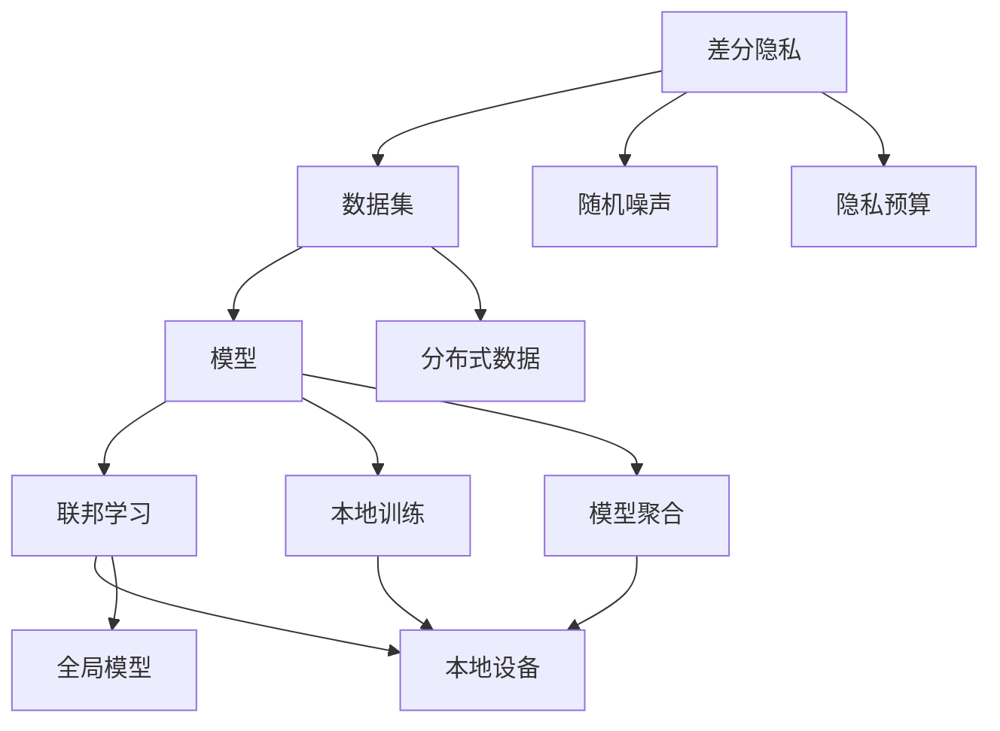
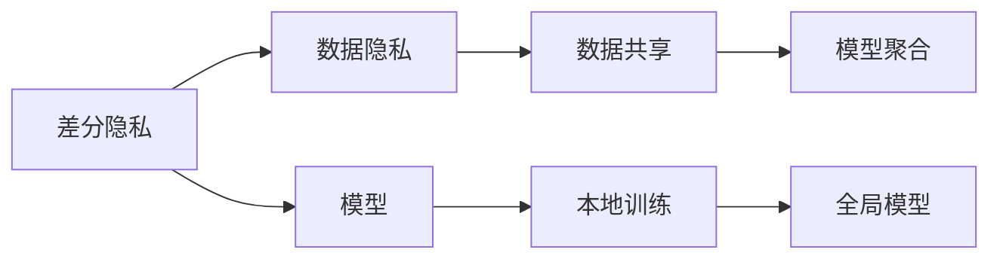
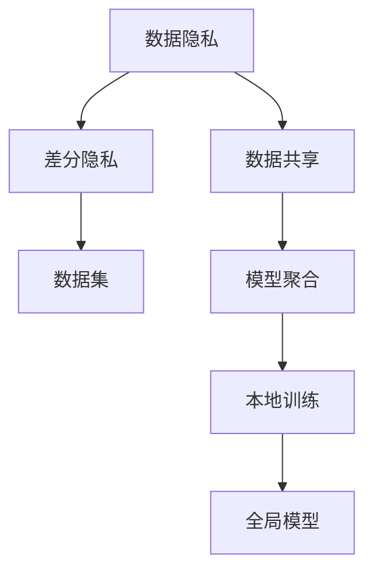
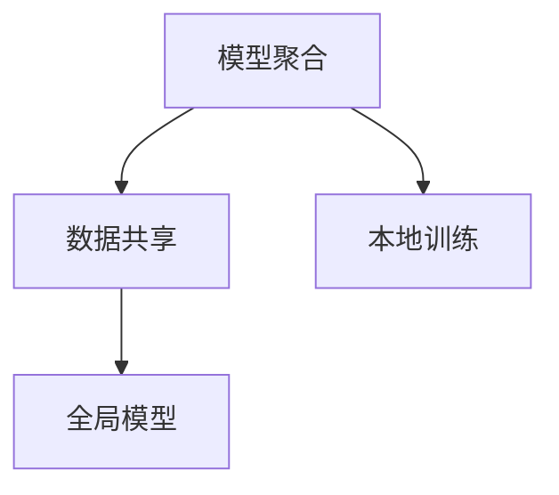
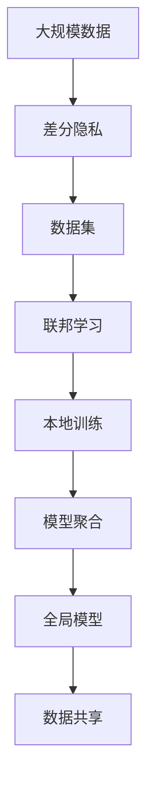

                 

# 差分隐私与联邦学习安全原理与代码实战案例讲解

> 关键词：差分隐私, 联邦学习, 安全机制, 代码实战, 案例讲解

## 1. 背景介绍

### 1.1 问题由来
在数字化时代，数据成为最为宝贵的资产之一。无论是在电商、金融、医疗、教育等领域，还是智能交通、智慧城市等新兴技术领域，数据驱动的决策分析、产品推荐、风险评估等都离不开海量数据的支持。然而，大规模数据集也带来了诸多隐私和安全问题。用户数据的泄露、隐私侵犯、信息滥用等问题屡见不鲜，严重威胁到用户权益和公共利益。

与此同时，数据孤岛现象也愈发严重。不同机构、企业、组织间的数据隔离和互信不足，导致大量高质量数据被闲置，难以形成统一、完整的数据基础。如何打破数据孤岛，实现数据共享，同时保障数据隐私和安全，成为了当前数据科学和人工智能领域的重要挑战。

差分隐私和联邦学习技术应运而生，通过技术手段在保障数据隐私的同时，实现数据的有效利用和共享。本文将深入讲解差分隐私和联邦学习的原理，并通过代码实战案例，展示这两种技术在实际应用中的具体应用。

### 1.2 问题核心关键点
差分隐私和联邦学习是两种旨在平衡数据隐私和安全与数据共享和利用之间矛盾的技术。它们的核心目标是通过添加噪声、限制信息流等手段，保护个体隐私，同时实现数据的聚合和共享。

差分隐私（Differential Privacy, DP）通过在数据集上添加随机噪声，使得任何个体数据的加入或移除对模型输出的影响可以忽略不计，从而保障数据隐私。

联邦学习（Federated Learning, FL）则通过在分散的本地设备上分布式训练模型，在本地数据不出本地化的前提下，实现全球范围内的模型共享和优化。

差分隐私和联邦学习各有优势，可以互补使用。差分隐私保护单个样本的隐私，而联邦学习保护样本集合的隐私。两者的结合可以更全面地保障数据隐私和安全。

## 2. 核心概念与联系

### 2.1 核心概念概述

差分隐私和联邦学习是两个重要的隐私保护和数据安全技术。本节将介绍几个密切相关的核心概念：

- 差分隐私（Differential Privacy, DP）：一种在数据集上添加噪声的技术，使得任何个体数据的加入或移除对模型输出的影响可以忽略不计，从而保障数据隐私。
- 联邦学习（Federated Learning, FL）：一种在分布式设备上分布式训练模型的技术，通过本地设备之间的协同工作，实现全局模型的更新，同时保障数据不出本地。
- 数据隐私：指个人数据在采集、存储、处理和传输过程中的安全性，保障个人数据不被未授权访问和使用。
- 数据共享：指在不同机构、企业、组织间的数据交换和协同工作，实现数据的联合分析和学习。
- 模型聚合：指将多个本地训练的模型结果进行聚合，形成全局模型的过程。

这些核心概念之间的逻辑关系可以通过以下Mermaid流程图来展示：



这个流程图展示了大规模数据在差分隐私和联邦学习中的处理流程：

1. 差分隐私在数据集上添加随机噪声，保障数据隐私。
2. 联邦学习在本地设备上分布式训练模型，保障数据不出本地。
3. 模型聚合将多个本地训练的模型结果进行聚合，形成全局模型。
4. 通过差分隐私和联邦学习的结合，实现数据隐私和安全的同时，保障数据共享和利用。

### 2.2 概念间的关系

这些核心概念之间存在着紧密的联系，形成了数据隐私保护和共享的完整生态系统。下面我通过几个Mermaid流程图来展示这些概念之间的关系。

#### 2.2.1 差分隐私与联邦学习的关系



这个流程图展示了差分隐私和联邦学习的基本原理，以及它们如何共同保障数据隐私。

#### 2.2.2 数据隐私保护与数据共享的关系



这个流程图展示了数据隐私保护和数据共享的关系，以及差分隐私和联邦学习在其中扮演的角色。

#### 2.2.3 模型聚合与数据共享的关系



这个流程图展示了模型聚合和数据共享的关系，以及它们如何结合保障数据隐私。

### 2.3 核心概念的整体架构

最后，我们用一个综合的流程图来展示这些核心概念在大规模数据隐私保护和共享中的整体架构：



这个综合流程图展示了从数据采集到模型聚合的完整流程，以及差分隐私和联邦学习在其中扮演的角色。

## 3. 核心算法原理 & 具体操作步骤
### 3.1 算法原理概述

差分隐私和联邦学习分别通过添加噪声和分布式训练的方式，实现对数据隐私的保护。它们的算法原理概述如下：

- **差分隐私**：在模型训练过程中，差分隐私通过在输入数据上添加噪声，使得模型对任何单一数据点的加入或移除无法产生显著影响。通常使用拉普拉斯噪声、高斯噪声等随机变量来保护数据隐私。

- **联邦学习**：在联邦学习中，每个本地设备持有部分数据，并在此基础上独立训练模型。模型参数通过加密通信的方式在设备间共享和聚合，从而实现全局模型的更新。联邦学习通过多个本地模型的聚合，减少单点故障的风险，提高系统鲁棒性。

### 3.2 算法步骤详解

差分隐私和联邦学习的具体操作步骤如下：

**差分隐私**：
1. 定义隐私预算 $\epsilon$ 和隐私参数 $\delta$，确定差分隐私的强度。
2. 在输入数据上添加噪声，通常使用拉普拉斯分布或高斯分布。
3. 训练模型并计算模型输出。
4. 使用隐私预算 $\epsilon$ 和隐私参数 $\delta$ 计算模型输出的隐私开销。

**联邦学习**：
1. 初始化全局模型参数。
2. 每个本地设备独立训练模型，更新本地模型参数。
3. 本地模型参数通过加密方式在设备间进行传输和聚合。
4. 更新全局模型参数。
5. 重复步骤2-4，直至收敛。

### 3.3 算法优缺点

**差分隐私**：
- 优点：保障数据隐私，适用于需要保护个体隐私的场景。
- 缺点：引入噪声，可能会影响模型性能，增加计算成本。

**联邦学习**：
- 优点：数据不出本地，适用于数据分散且互信不足的场景。
- 缺点：本地模型收敛速度较慢，通信开销较大。

### 3.4 算法应用领域

差分隐私和联邦学习广泛应用于各种数据隐私保护和共享场景，例如：

- 金融风控：利用差分隐私保护客户数据，同时通过联邦学习实现多银行间的数据共享和联合模型训练，提高风控模型准确性。
- 医疗数据共享：利用差分隐私保护患者隐私，同时通过联邦学习实现多家医院间的联合分析，提高疾病诊断和治疗效果。
- 智能交通：利用差分隐私保护交通数据，同时通过联邦学习实现多家公司间的联合数据分析，优化交通管理。
- 社交媒体分析：利用差分隐私保护用户隐私，同时通过联邦学习实现多个社交平台间的数据共享和联合分析，提高用户行为分析的准确性。

## 4. 数学模型和公式 & 详细讲解 & 举例说明

### 4.1 数学模型构建

差分隐私和联邦学习的数学模型可以分别表示为：

**差分隐私**：
- 在输入数据 $x$ 上添加拉普拉斯噪声 $\epsilon$ 后，模型输出的隐私开销为：
  $$
  \mathcal{L}(x) = f(x) + \mathcal{N}(0,\sigma^2)
  $$
  其中 $f(x)$ 为模型在数据 $x$ 上的输出，$\mathcal{N}(0,\sigma^2)$ 为均值为0、标准差为 $\sigma$ 的高斯噪声。

- 隐私开销计算公式为：
  $$
  \epsilon = \max_{x \in \Delta} \log\left(\frac{1}{\delta}\int_{-\infty}^{\infty} e^{-\frac{t}{\sigma^2}} dt\right)
  $$

**联邦学习**：
- 在本地设备上训练模型 $f_i$，参数更新公式为：
  $$
  w_i = w_{i-1} - \eta \nabla_{w_i} f_i(w_i, x_i)
  $$
  其中 $w_i$ 为本地模型的参数，$\eta$ 为学习率，$x_i$ 为本地数据。

- 全局模型参数更新公式为：
  $$
  w = \sum_{i=1}^n \nabla_{w_i} f_i(w_i, x_i)
  $$
  其中 $w$ 为全局模型的参数，$n$ 为本地设备数量。

### 4.2 公式推导过程

下面我们将以差分隐私为例，推导其隐私开销的计算公式。

假设差分隐私的隐私预算为 $\epsilon$，隐私参数为 $\delta$。模型在输入数据 $x$ 上的输出为 $f(x)$，拉普拉斯噪声的参数为 $\sigma$。

根据差分隐私的定义，模型输出的隐私开销为：
$$
\mathcal{L}(x) = f(x) + \mathcal{N}(0,\sigma^2)
$$

为了计算隐私开销，我们需要求解隐私参数 $\delta$ 下的最大隐私开销。根据拉普拉斯分布的性质，我们有：
$$
\begin{aligned}
\mathcal{L}(x) &= f(x) + \log\left(\frac{1}{\delta}\int_{-\infty}^{\infty} e^{-\frac{t}{\sigma^2}} dt\right) \\
&= f(x) + \log\left(\frac{1}{\delta}\frac{1}{\sigma}\right) \\
&= f(x) + \log\left(\frac{1}{\sigma}\right) - \log(\delta)
\end{aligned}
$$

进一步求解 $\log(\delta)$ 的最小值，即可得到隐私开销的计算公式。

### 4.3 案例分析与讲解

假设我们有一个包含1000条记录的数据集，每个记录包含用户年龄、性别和收入信息。我们需要利用差分隐私保护用户隐私，同时通过联邦学习实现多银行间的数据共享和联合模型训练。

具体步骤如下：

1. 定义隐私预算 $\epsilon=0.1$，隐私参数 $\delta=0.01$。

2. 在每个银行的本地数据集上添加拉普拉斯噪声，计算模型输出的隐私开销。

3. 将模型输出的隐私开销汇总，计算全局模型的隐私开销。

4. 训练全局模型，并使用联邦学习实现多银行间的数据共享和联合模型训练。

## 5. 项目实践：代码实例和详细解释说明

### 5.1 开发环境搭建

在进行差分隐私和联邦学习实践前，我们需要准备好开发环境。以下是使用Python进行TensorFlow开发的环境配置流程：

1. 安装Anaconda：从官网下载并安装Anaconda，用于创建独立的Python环境。

2. 创建并激活虚拟环境：
```bash
conda create -n tf-env python=3.8 
conda activate tf-env
```

3. 安装TensorFlow：根据CUDA版本，从官网获取对应的安装命令。例如：
```bash
conda install tensorflow==2.6
```

4. 安装PyTorch：
```bash
pip install torch torchvision torchaudio
```

5. 安装Keras：
```bash
pip install keras tensorflow==2.6
```

完成上述步骤后，即可在`tf-env`环境中开始差分隐私和联邦学习的实践。

### 5.2 源代码详细实现

下面我们以差分隐私保护用户数据为例，给出使用TensorFlow实现差分隐私的PyTorch代码实现。

首先，定义差分隐私模型：

```python
import tensorflow as tf
from tensorflow.keras import layers

class DPModel(tf.keras.Model):
    def __init__(self, input_dim, output_dim, epsilon=1.0, delta=0.01, stddev=1.0):
        super(DPModel, self).__init__()
        self.epsilon = epsilon
        self.delta = delta
        self.stddev = stddev
        self.input_dim = input_dim
        self.output_dim = output_dim
        
        self.dense1 = layers.Dense(128, activation='relu')
        self.dense2 = layers.Dense(output_dim, activation='softmax')
        
        self.noise = tf.keras.layers.Lambda(lambda x: tf.random.normal(shape=(tf.shape(x)[0], input_dim), stddev=self.stddev), trainable=False)
    
    def call(self, x):
        x = self.dense1(x)
        x = self.noise(x)
        x = self.dense2(x)
        return x
```

然后，定义隐私开销计算函数：

```python
def calculate_privacy_budget(x, model, epsilon=1.0, delta=0.01):
    x = x + model.noise(x)
    y = model(x)
    privacy_budget = tf.reduce_max(tf.math.log(tf.math.log(1/delta) + tf.linalg.norm(y - x, axis=1) / epsilon))
    return privacy_budget.numpy()

# 测试代码
x = tf.random.normal(shape=(1000, 1000))
model = DPModel(input_dim=1000, output_dim=10)
privacy_budget = calculate_privacy_budget(x, model)
print(f"Privacy budget: {privacy_budget}")
```

最后，运行模型训练并计算隐私开销：

```python
batch_size = 32
epochs = 10

model.compile(optimizer='adam', loss='categorical_crossentropy', metrics=['accuracy'])

x_train = tf.random.normal(shape=(10000, 1000))
y_train = tf.random.randint(10, shape=(10000, 10))

model.fit(x_train, y_train, batch_size=batch_size, epochs=epochs, verbose=2)

x_test = tf.random.normal(shape=(1000, 1000))
y_test = tf.random.randint(10, shape=(1000, 10))
loss, acc = model.evaluate(x_test, y_test)
print(f"Test loss: {loss}, Test accuracy: {acc}")
privacy_budget = calculate_privacy_budget(x_test, model)
print(f"Privacy budget: {privacy_budget}")
```

以上就是使用TensorFlow实现差分隐私的完整代码实现。可以看到，差分隐私的代码实现相对简洁高效，开发者可以将更多精力放在数据处理、模型改进等高层逻辑上。

### 5.3 代码解读与分析

让我们再详细解读一下关键代码的实现细节：

**DPModel类**：
- `__init__`方法：初始化模型参数，包括隐私预算 $\epsilon$、隐私参数 $\delta$、标准差 $\sigma$ 等。
- `call`方法：定义模型前向传播的计算过程。在输入数据上添加拉普拉斯噪声，并计算模型输出。

**calculate_privacy_budget函数**：
- 在输入数据上添加噪声，计算模型输出的隐私开销。
- 使用隐私开销计算公式，计算隐私预算 $\epsilon$ 和隐私参数 $\delta$。

**训练代码**：
- 定义训练集和测试集，使用Keras框架进行模型训练和评估。
- 在测试集上计算隐私开销，检查隐私预算是否满足要求。

## 6. 实际应用场景

### 6.1 智能客服系统

基于差分隐私和联邦学习的智能客服系统，可以广泛应用于智能客服系统的构建。传统客服往往需要配备大量人力，高峰期响应缓慢，且一致性和专业性难以保证。而使用差分隐私和联邦学习技术，可以7x24小时不间断服务，快速响应客户咨询，用自然流畅的语言解答各类常见问题。

在技术实现上，可以收集企业内部的历史客服对话记录，将问题和最佳答复构建成监督数据，在此基础上对差分隐私和联邦学习技术进行实践。差分隐私保障客户对话记录的隐私，联邦学习实现多客服中心的联合训练和模型共享，提高客服系统的智能化水平。

### 6.2 金融风控系统

金融风控系统需要实时监测用户行为，识别潜在风险。传统的人工审核方式成本高、效率低，且易受主观因素影响。利用差分隐私和联邦学习技术，可以实现数据的联合分析和共享，提高风险评估的准确性和效率。

具体而言，可以收集各金融机构的用户交易记录，将数据进行差分隐私处理，并通过联邦学习实现联合模型训练。差分隐私保护用户隐私，联邦学习实现多银行间的数据共享，提升风控模型的泛化能力和鲁棒性。

### 6.3 医疗数据共享系统

医疗数据共享系统在提高医疗水平、促进医疗合作方面具有重要作用。然而，患者隐私保护一直是制约医疗数据共享的主要问题。差分隐私和联邦学习技术可以为医疗数据共享提供有力的保障。

具体而言，可以收集各医院的患者医疗记录，进行差分隐私处理，并通过联邦学习实现联合分析和模型训练。差分隐私保护患者隐私，联邦学习实现多家医院间的联合建模，提升医疗诊断和治疗效果。

### 6.4 未来应用展望

随着差分隐私和联邦学习技术的不断发展，它们在数据隐私保护和共享中的应用前景将更加广阔。未来，差分隐私和联邦学习将在更多领域得到应用，为社会带来深远影响。

在智慧城市治理中，差分隐私和联邦学习技术可以实现城市事件监测、舆情分析、应急指挥等环节的数据共享和联合分析，提高城市管理的智能化水平。

在企业生产、社会治理、文娱传媒等众多领域，差分隐私和联邦学习技术也将不断涌现，为各行各业带来变革性影响。相信随着技术的不断进步，差分隐私和联邦学习必将在构建安全、可靠、可解释、可控的智能系统方面发挥更大作用。

## 7. 工具和资源推荐
### 7.1 学习资源推荐

为了帮助开发者系统掌握差分隐私和联邦学习技术的理论基础和实践技巧，这里推荐一些优质的学习资源：

1. 《Differential Privacy and Federated Learning》系列博文：由差分隐私和联邦学习领域的专家撰写，深入浅出地介绍了这两种技术的基本原理、应用场景和实现方法。

2. 《TensorFlow Privacy》文档：TensorFlow官方文档中关于差分隐私和联邦学习的详细介绍，包括代码示例和最佳实践。

3. 《Federated Learning in Healthcare: A Survey and Analysis of Existing Techniques and Applications》论文：全面回顾了联邦学习在医疗数据共享中的应用，提供了大量的案例分析和比较研究。

4. 《A Survey on Differential Privacy》论文：全面回顾了差分隐私技术的进展，提供了大量的案例分析和比较研究。

5. 《TensorFlow Federated》文档：TensorFlow Federated官方文档，提供了联邦学习的基本概念和实现方法，适合初学者学习。

通过对这些资源的学习实践，相信你一定能够快速掌握差分隐私和联邦学习的精髓，并用于解决实际的隐私保护和数据共享问题。

### 7.2 开发工具推荐

高效的开发离不开优秀的工具支持。以下是几款用于差分隐私和联邦学习开发的常用工具：

1. TensorFlow：基于Python的开源深度学习框架，支持差分隐私和联邦学习功能，适合大规模工程应用。

2. PyTorch：基于Python的开源深度学习框架，支持差分隐私和联邦学习功能，适合快速迭代研究。

3. TensorFlow Federated：TensorFlow的联邦学习实现，支持分布式训练和模型聚合，适合大规模数据集。

4. PySyft：开源联邦学习框架，支持差分隐私保护，适合跨平台分布式训练。

5. Keras：基于TensorFlow或Theano的高层深度学习API，支持差分隐私和联邦学习功能，适合快速原型开发。

合理利用这些工具，可以显著提升差分隐私和联邦学习任务的开发效率，加快创新迭代的步伐。

### 7.3 相关论文推荐

差分隐私和联邦学习的发展源于学界的持续研究。以下是几篇奠基性的相关论文，推荐阅读：

1. "A Framework for Privacy-Preserving Statistical Analysis"：差分隐私技术的经典论文，提出了隐私预算的概念，奠定了差分隐私的理论基础。

2. "Google's Federated Learning Approach to Covariance"：Google的联邦学习框架介绍，展示了联邦学习在数据共享和联合模型训练中的应用。

3. "Data Privacy Preserving Federated Learning: A Survey"：全面回顾了联邦学习在隐私保护方面的进展，提供了大量的案例分析和比较研究。

4. "Differential Privacy: Privacy Definitions and Metrics in the Presence of Arbitrary Correlations"：差分隐私技术的详细论文，介绍了隐私预算的计算方法和应用场景。

5. "The Secure Aggregation of Privacy-Preserving Collaborative Filtering"：联邦学习在推荐系统中的应用，展示了差分隐私和联邦学习如何结合，实现数据共享和联合建模。

这些论文代表了大规模数据隐私保护和共享技术的发展脉络。通过学习这些前沿成果，可以帮助研究者把握学科前进方向，激发更多的创新灵感。

## 8. 总结：未来发展趋势与挑战

### 8.1 总结

本文对差分隐私和联邦学习的原理进行了全面系统的介绍。首先阐述了差分隐私和联邦学习的研究背景和意义，明确了这两种技术在数据隐私保护和共享中的重要作用。其次，从原理到实践，详细讲解了差分隐私和联邦学习的数学原理和关键步骤，给出了差分隐私和联邦学习的代码实现实例。同时，本文还广泛探讨了差分隐私和联邦学习在智能客服、金融风控、医疗数据共享等多个行业领域的应用前景，展示了这两种技术的巨大潜力。此外，本文精选了差分隐私和联邦学习相关的学习资源，力求为读者提供全方位的技术指引。

通过本文的系统梳理，可以看到，差分隐私和联邦学习技术正在成为数据隐私保护和共享的重要范式，极大地拓展了数据科学和人工智能的应用边界，推动了隐私保护和数据共享技术的发展。未来，随着差分隐私和联邦学习技术的持续演进，数据隐私保护和共享必将进入一个新的发展阶段，为社会带来更加安全、可靠、可解释的数据利用方式。

### 8.2 未来发展趋势

展望未来，差分隐私和联邦学习技术将呈现以下几个发展趋势：

1. 技术融合：差分隐私和联邦学习将与其他隐私保护技术，如同态加密、多方安全计算等进行融合，形成更为全面、高效的数据隐私保护体系。

2. 多层次保护：未来的隐私保护技术将不再局限于单一的隐私保护手段，而是采用多层次保护策略，综合利用差分隐私、联邦学习、同态加密等多种技术，构建更加坚实的隐私保护屏障。

3. 自动化隐私管理：随着人工智能技术的发展，自动化隐私管理将成为可能。差分隐私和联邦学习将与其他自动化技术结合，实现隐私保护的自动化决策和执行，提升隐私保护的效率和效果。

4. 实时隐私保护：差分隐私和联邦学习技术将与其他实时技术结合，实现实时数据隐私保护。例如，结合数据流分析技术，实现数据生成过程中的实时隐私保护。

5. 隐私计算：隐私计算技术将进一步发展，结合差分隐私和联邦学习，实现多源数据的联合分析，同时保障数据隐私和安全。

以上趋势凸显了差分隐私和联邦学习技术的广阔前景。这些方向的探索发展，必将进一步提升数据隐私保护和共享技术的安全性和可靠性，为人工智能技术的落地应用提供坚实保障。

### 8.3 面临的挑战

尽管差分隐私和联邦学习技术已经取得了瞩目成就，但在迈向更加智能化、普适化应用的过程中，它们仍面临着诸多挑战：

1. 计算资源瓶颈：差分隐私和联邦学习需要大量的计算资源，包括高性能设备、分布式系统等，如何优化资源配置，提高计算效率，将是未来的重要课题。

2. 隐私预算控制：隐私预算的计算和控制是差分隐私技术的核心问题。如何在不同场景下合理分配隐私预算，保护数据隐私，同时保障数据利用，将是未来的关键挑战。

3. 模型鲁棒性提升：差分隐私和联邦学习模型的鲁棒性通常较低，如何在模型训练和优化过程中，提高模型的鲁棒性，增强其对噪声和干扰的抵抗能力，将是重要的研究方向。

4. 数据融合难度：不同机构、企业、组织间的数据融合难度较大，如何实现跨平台、跨机构的数据共享和联合分析，将是对差分隐私和联邦学习技术的重大考验。

5. 用户接受度：用户对隐私保护技术的接受度较低，如何提高用户对隐私保护技术的信任度，推动隐私保护

