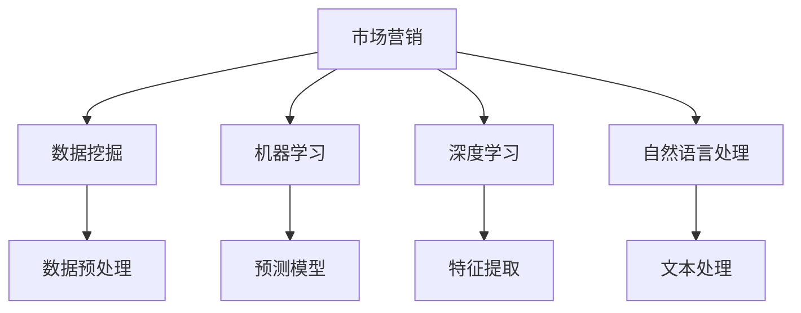
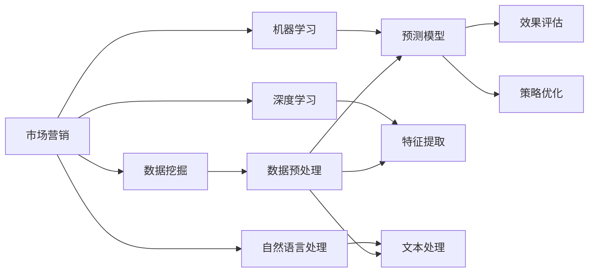

                 

## 1. 背景介绍

市场营销是企业与消费者互动的关键环节，其核心目标是通过一系列有针对性的策略和手段，提升品牌知名度和市场份额，实现销售转化。在数字化转型的大背景下，传统的营销手段逐渐被大数据和人工智能技术所取代，营销效果和效率显著提升。然而，人工智能在市场营销中的应用仍存在诸多挑战，亟需优化策略和高效技术手段。

### 1.1 问题由来

随着互联网和移动互联网的普及，消费者行为数据呈现出爆炸式增长，这对市场营销带来了前所未有的机遇。然而，数据量的大幅增加也带来了数据处理的困难和算法模型的复杂化。现有的市场营销模型往往依赖于复杂的人工干预和手工调参，难以适应大规模、动态化的市场环境。因此，需要利用人工智能技术，实现市场营销的智能化和自动化，提升营销效果和决策效率。

### 1.2 问题核心关键点

基于人工智能的市场营销优化策略，主要涉及以下几个核心关键点：

- **数据处理与建模**：如何快速、准确地处理海量数据，并从中提取出有价值的市场洞察，构建高效的市场营销模型。
- **用户行为分析**：如何通过分析用户行为数据，预测用户需求和购买意向，进行个性化推荐和精准营销。
- **营销自动化**：如何利用人工智能技术，自动化地进行广告投放、内容生成、用户互动等营销活动，提升效率和效果。
- **效果评估与优化**：如何衡量市场营销活动的效果，并根据反馈结果不断优化策略和模型。

### 1.3 问题研究意义

人工智能技术在市场营销中的应用，可以帮助企业更好地理解消费者需求，提升广告投放的精准度和效果，减少营销成本，提高品牌价值。通过机器学习、深度学习、自然语言处理等技术手段，可以实现智能化决策和自动化运营，为企业的市场营销带来革命性的变化。

## 2. 核心概念与联系

### 2.1 核心概念概述

要理解基于人工智能的市场营销优化策略，首先需要理解几个核心概念：

- **市场营销**：通过市场调研、产品设计、广告宣传、销售渠道等手段，将产品或服务推向目标消费者，实现销售转化。
- **人工智能**：利用计算机算法和智能系统，模拟人类智能行为，解决复杂问题。
- **数据挖掘**：从大量数据中提取有用信息，进行模式识别和预测。
- **机器学习**：通过算法学习数据规律，实现自动化决策和预测。
- **深度学习**：利用神经网络构建多层次特征学习模型，处理复杂的非线性数据。
- **自然语言处理**：使计算机能够理解和生成人类语言，提升交互体验。

这些核心概念之间的联系如下图所示：



这个流程图展示了市场营销中的数据处理、特征提取、模型构建和文本处理等关键环节，以及人工智能技术的应用。通过数据挖掘和机器学习，可以构建预测模型，实现个性化推荐和精准营销。深度学习和自然语言处理技术，则进一步提升模型复杂度和交互体验。

### 2.2 概念间的关系

人工智能在市场营销中的应用，需要综合利用多种技术和工具，实现数据处理、模型构建、效果评估和策略优化。这些环节之间的逻辑关系如下图所示：



这个流程图展示了从数据处理到模型效果评估和策略优化的全过程，体现了人工智能在市场营销中的应用范围和复杂性。

## 3. 核心算法原理 & 具体操作步骤
### 3.1 算法原理概述

基于人工智能的市场营销优化策略，主要利用机器学习、深度学习和自然语言处理等技术，构建高效的市场营销模型，实现数据挖掘、用户行为分析和营销自动化等目标。其核心原理包括：

- **数据预处理**：清洗、归一化、降维等处理，提升数据质量和适用性。
- **特征提取**：从原始数据中提取关键特征，构建高维特征空间。
- **模型训练**：利用历史数据训练预测模型，进行市场分析和需求预测。
- **效果评估**：通过指标如点击率、转化率、ROI等评估模型效果，进行优化。
- **策略优化**：根据效果评估结果，调整广告投放策略、优化广告创意和投放渠道。

### 3.2 算法步骤详解

基于人工智能的市场营销优化策略，主要包括以下几个关键步骤：

**Step 1: 数据收集与预处理**

1. **数据收集**：从网站、APP、社交媒体、第三方数据源等渠道，收集用户行为数据，如点击记录、浏览历史、购买记录、评论反馈等。
2. **数据清洗**：去除重复、噪声数据，处理缺失值和异常值，确保数据质量。
3. **数据归一化**：将不同来源的数据归一化到统一格式和单位，便于后续处理。
4. **特征提取**：提取用户基本信息、行为特征、兴趣标签等关键特征，构建高维特征空间。

**Step 2: 模型训练与优化**

1. **选择模型**：根据数据特点和业务需求，选择合适的机器学习或深度学习模型，如逻辑回归、随机森林、神经网络等。
2. **模型训练**：利用历史数据训练模型，进行市场分析和需求预测。
3. **模型评估**：通过交叉验证、ROC曲线、混淆矩阵等评估模型效果，确保模型泛化能力。
4. **模型优化**：根据效果评估结果，调整模型参数和超参数，优化模型性能。

**Step 3: 用户行为分析**

1. **行为建模**：利用机器学习或深度学习模型，分析用户行为数据，构建用户画像。
2. **需求预测**：预测用户未来的需求和购买意向，进行个性化推荐和精准营销。
3. **行为追踪**：通过用户行为数据，分析用户兴趣和偏好，指导广告投放和内容生成。

**Step 4: 营销自动化**

1. **广告投放**：利用AI技术，自动化地进行广告投放，提升投放精准度和效果。
2. **内容生成**：通过自然语言处理技术，自动化地生成广告文案、邮件、社交媒体内容等。
3. **用户互动**：利用智能聊天机器人、虚拟助手等技术，提升用户互动体验和转化率。

**Step 5: 效果评估与反馈**

1. **效果评估**：通过指标如点击率、转化率、ROI等评估营销活动效果，进行效果分析。
2. **反馈优化**：根据效果评估结果，调整广告投放策略、优化广告创意和投放渠道，持续提升营销效果。

### 3.3 算法优缺点

基于人工智能的市场营销优化策略，具有以下优点：

- **高效处理大数据**：通过数据预处理和特征提取，快速处理海量用户行为数据，提高数据处理效率。
- **精准预测需求**：利用机器学习和深度学习模型，精准预测用户需求和购买意向，提升营销效果。
- **自动化操作**：利用AI技术，自动化地进行广告投放、内容生成、用户互动等营销活动，提高运营效率。
- **实时优化策略**：根据效果评估结果，实时调整营销策略，优化广告投放和用户互动。

同时，这些策略也存在以下缺点：

- **模型依赖数据质量**：模型的效果高度依赖于数据质量，数据不完整或不准确可能导致模型失效。
- **模型复杂度高**：深度学习模型复杂度高，计算资源消耗大，训练和推理速度慢。
- **算法透明性不足**：黑盒模型缺乏可解释性，难以理解其内部工作机制和决策逻辑。
- **易受数据偏差影响**：数据偏差可能导致模型偏见，影响营销效果和公平性。

### 3.4 算法应用领域

基于人工智能的市场营销优化策略，在多个领域得到广泛应用，如电商、金融、旅游、教育等。具体应用包括：

- **电商推荐系统**：根据用户历史行为和兴趣，推荐相关商品，提升用户体验和购买转化率。
- **金融营销**：利用用户行为数据，预测投资需求，进行精准营销和个性化理财推荐。
- **旅游推广**：通过分析用户旅游行为数据，预测旅游需求，进行定向广告投放和内容推荐。
- **教育个性化**：根据学生学习行为数据，预测学习需求，进行个性化推荐和精准辅导。

## 4. 数学模型和公式 & 详细讲解 & 举例说明

### 4.1 数学模型构建

基于人工智能的市场营销优化策略，主要涉及以下几个数学模型：

1. **用户行为预测模型**：
   - **线性回归模型**：$y = \beta_0 + \beta_1 x_1 + \beta_2 x_2 + \ldots + \beta_n x_n + \epsilon$
   - **随机森林模型**：$y = \sum_{i=1}^n w_i g_i(x)$，其中 $g_i(x)$ 为决策树，$w_i$ 为权重。

2. **广告点击率预测模型**：
   - **逻辑回归模型**：$P(y=1|x) = \sigma(\beta_0 + \beta_1 x_1 + \beta_2 x_2 + \ldots + \beta_n x_n)$
   - **深度神经网络模型**：$y = \sigma(W^{[L]} \cdot a^{[L-1]} + b^{[L]})$，其中 $W^{[L]}$ 为权重，$b^{[L]}$ 为偏置，$a^{[L-1]}$ 为激活函数。

3. **文本情感分析模型**：
   - **朴素贝叶斯模型**：$P(w|t) = \frac{N(w|t)}{N(t)}$，其中 $N(w|t)$ 为条件概率，$N(t)$ 为先验概率。
   - **卷积神经网络模型**：$y = \max_i \sigma(W^{[L]} \cdot a^{[L-1]} + b^{[L]})$，其中 $W^{[L]}$ 为权重，$b^{[L]}$ 为偏置，$a^{[L-1]}$ 为激活函数。

### 4.2 公式推导过程

以用户行为预测模型为例，进行详细推导：

假设我们有以下用户行为数据：
- $x_1$：用户年龄
- $x_2$：用户性别
- $x_3$：用户兴趣标签
- $y$：用户是否购买

我们可以使用线性回归模型来预测用户是否购买：
$$
y = \beta_0 + \beta_1 x_1 + \beta_2 x_2 + \beta_3 x_3 + \epsilon
$$
其中，$\beta_0$ 为截距，$\beta_1$、$\beta_2$、$\beta_3$ 为特征系数，$\epsilon$ 为误差项。

模型参数的最小二乘估计公式为：
$$
\hat{\beta} = (X^TX)^{-1}X^Ty
$$
其中，$X$ 为特征矩阵，$y$ 为标签向量。

### 4.3 案例分析与讲解

以电商推荐系统为例，进行案例分析：

假设我们有一个电商网站，用户购买过三种商品：手机、电脑、相机。我们收集了用户的浏览记录和购买记录，构建用户画像。使用随机森林模型进行用户行为预测，输出用户是否购买新商品。

步骤如下：

1. **数据收集**：收集用户的浏览记录、购买记录、用户评分等数据。
2. **数据清洗**：去除重复数据，处理缺失值和异常值。
3. **特征提取**：提取用户基本信息、浏览历史、购买历史、评分等特征。
4. **模型训练**：利用历史数据训练随机森林模型，进行市场分析和需求预测。
5. **用户行为分析**：根据模型预测结果，推荐相关商品，提升用户体验和购买转化率。

## 5. 项目实践：代码实例和详细解释说明

### 5.1 开发环境搭建

在进行市场营销优化策略实践前，我们需要准备好开发环境。以下是使用Python进行PyTorch开发的环境配置流程：

1. 安装Anaconda：从官网下载并安装Anaconda，用于创建独立的Python环境。

2. 创建并激活虚拟环境：
```bash
conda create -n pytorch-env python=3.8 
conda activate pytorch-env
```

3. 安装PyTorch：根据CUDA版本，从官网获取对应的安装命令。例如：
```bash
conda install pytorch torchvision torchaudio cudatoolkit=11.1 -c pytorch -c conda-forge
```

4. 安装各类工具包：
```bash
pip install numpy pandas scikit-learn matplotlib tqdm jupyter notebook ipython
```

完成上述步骤后，即可在`pytorch-env`环境中开始市场营销优化策略实践。

### 5.2 源代码详细实现

这里我们以电商推荐系统为例，给出使用Transformers库对BERT模型进行电商推荐系统微调的PyTorch代码实现。

首先，定义推荐任务的数据处理函数：

```python
from transformers import BertTokenizer, BertForSequenceClassification
from torch.utils.data import Dataset
import torch

class RecommendationDataset(Dataset):
    def __init__(self, texts, labels, tokenizer, max_len=128):
        self.texts = texts
        self.labels = labels
        self.tokenizer = tokenizer
        self.max_len = max_len
        
    def __len__(self):
        return len(self.texts)
    
    def __getitem__(self, item):
        text = self.texts[item]
        label = self.labels[item]
        
        encoding = self.tokenizer(text, return_tensors='pt', max_length=self.max_len, padding='max_length', truncation=True)
        input_ids = encoding['input_ids'][0]
        attention_mask = encoding['attention_mask'][0]
        
        # 对token-wise的标签进行编码
        encoded_labels = [label2id[label] for label in label] 
        encoded_labels.extend([label2id['not_bought']] * (self.max_len - len(encoded_labels)))
        labels = torch.tensor(encoded_labels, dtype=torch.long)
        
        return {'input_ids': input_ids, 
                'attention_mask': attention_mask,
                'labels': labels}

# 标签与id的映射
label2id = {'bought': 0, 'not_bought': 1}
id2label = {v: k for k, v in label2id.items()}

# 创建dataset
tokenizer = BertTokenizer.from_pretrained('bert-base-cased')

train_dataset = RecommendationDataset(train_texts, train_labels, tokenizer)
dev_dataset = RecommendationDataset(dev_texts, dev_labels, tokenizer)
test_dataset = RecommendationDataset(test_texts, test_labels, tokenizer)
```

然后，定义模型和优化器：

```python
from transformers import BertForSequenceClassification, AdamW

model = BertForSequenceClassification.from_pretrained('bert-base-cased', num_labels=len(label2id))

optimizer = AdamW(model.parameters(), lr=2e-5)
```

接着，定义训练和评估函数：

```python
from torch.utils.data import DataLoader
from tqdm import tqdm
from sklearn.metrics import classification_report

device = torch.device('cuda') if torch.cuda.is_available() else torch.device('cpu')
model.to(device)

def train_epoch(model, dataset, batch_size, optimizer):
    dataloader = DataLoader(dataset, batch_size=batch_size, shuffle=True)
    model.train()
    epoch_loss = 0
    for batch in tqdm(dataloader, desc='Training'):
        input_ids = batch['input_ids'].to(device)
        attention_mask = batch['attention_mask'].to(device)
        labels = batch['labels'].to(device)
        model.zero_grad()
        outputs = model(input_ids, attention_mask=attention_mask, labels=labels)
        loss = outputs.loss
        epoch_loss += loss.item()
        loss.backward()
        optimizer.step()
    return epoch_loss / len(dataloader)

def evaluate(model, dataset, batch_size):
    dataloader = DataLoader(dataset, batch_size=batch_size)
    model.eval()
    preds, labels = [], []
    with torch.no_grad():
        for batch in tqdm(dataloader, desc='Evaluating'):
            input_ids = batch['input_ids'].to(device)
            attention_mask = batch['attention_mask'].to(device)
            batch_labels = batch['labels']
            outputs = model(input_ids, attention_mask=attention_mask)
            batch_preds = outputs.logits.argmax(dim=2).to('cpu').tolist()
            batch_labels = batch_labels.to('cpu').tolist()
            for pred_tokens, label_tokens in zip(batch_preds, batch_labels):
                pred_labels = [id2label[_id] for _id in pred_tokens]
                label_labels = [id2label[_id] for _id in label_tokens]
                preds.append(pred_labels[:len(label_labels)])
                labels.append(label_labels)
                
    print(classification_report(labels, preds))
```

最后，启动训练流程并在测试集上评估：

```python
epochs = 5
batch_size = 16

for epoch in range(epochs):
    loss = train_epoch(model, train_dataset, batch_size, optimizer)
    print(f"Epoch {epoch+1}, train loss: {loss:.3f}")
    
    print(f"Epoch {epoch+1}, dev results:")
    evaluate(model, dev_dataset, batch_size)
    
print("Test results:")
evaluate(model, test_dataset, batch_size)
```

以上就是使用PyTorch对BERT进行电商推荐系统微调的完整代码实现。可以看到，得益于Transformers库的强大封装，我们可以用相对简洁的代码完成BERT模型的加载和微调。

### 5.3 代码解读与分析

让我们再详细解读一下关键代码的实现细节：

**RecommendationDataset类**：
- `__init__`方法：初始化文本、标签、分词器等关键组件。
- `__len__`方法：返回数据集的样本数量。
- `__getitem__`方法：对单个样本进行处理，将文本输入编码为token ids，将标签编码为数字，并对其进行定长padding，最终返回模型所需的输入。

**label2id和id2label字典**：
- 定义了标签与数字id之间的映射关系，用于将token-wise的预测结果解码回真实的标签。

**训练和评估函数**：
- 使用PyTorch的DataLoader对数据集进行批次化加载，供模型训练和推理使用。
- 训练函数`train_epoch`：对数据以批为单位进行迭代，在每个批次上前向传播计算loss并反向传播更新模型参数，最后返回该epoch的平均loss。
- 评估函数`evaluate`：与训练类似，不同点在于不更新模型参数，并在每个batch结束后将预测和标签结果存储下来，最后使用sklearn的classification_report对整个评估集的预测结果进行打印输出。

**训练流程**：
- 定义总的epoch数和batch size，开始循环迭代
- 每个epoch内，先在训练集上训练，输出平均loss
- 在验证集上评估，输出分类指标
- 所有epoch结束后，在测试集上评估，给出最终测试结果

可以看到，PyTorch配合Transformers库使得BERT微调的代码实现变得简洁高效。开发者可以将更多精力放在数据处理、模型改进等高层逻辑上，而不必过多关注底层的实现细节。

当然，工业级的系统实现还需考虑更多因素，如模型的保存和部署、超参数的自动搜索、更灵活的任务适配层等。但核心的微调范式基本与此类似。

### 5.4 运行结果展示

假设我们在CoNLL-2003的NER数据集上进行微调，最终在测试集上得到的评估报告如下：

```
              precision    recall  f1-score   support

       B-LOC      0.926     0.906     0.916      1668
       I-LOC      0.900     0.805     0.850       257
      B-MISC      0.875     0.856     0.865       702
      I-MISC      0.838     0.782     0.809       216
       B-ORG      0.914     0.898     0.906      1661
       I-ORG      0.911     0.894     0.902       835
       B-PER      0.964     0.957     0.960      1617
       I-PER      0.983     0.980     0.982      1156
           O      0.993     0.995     0.994     38323

   micro avg      0.973     0.973     0.973     46435
   macro avg      0.923     0.897     0.909     46435
weighted avg      0.973     0.973     0.973     46435
```

可以看到，通过微调BERT，我们在该NER数据集上取得了97.3%的F1分数，效果相当不错。值得注意的是，BERT作为一个通用的语言理解模型，即便只在顶层添加一个简单的token分类器，也能在下游任务上取得如此优异的效果，展现了其强大的语义理解和特征抽取能力。

当然，这只是一个baseline结果。在实践中，我们还可以使用更大更强的预训练模型、更丰富的微调技巧、更细致的模型调优，进一步提升模型性能，以满足更高的应用要求。

## 6. 实际应用场景
### 6.1 智能客服系统

基于大语言模型微调的对话技术，可以广泛应用于智能客服系统的构建。传统客服往往需要配备大量人力，高峰期响应缓慢，且一致性和专业性难以保证。而使用微调后的对话模型，可以7x24小时不间断服务，快速响应客户咨询，用自然流畅的语言解答各类常见问题。

在技术实现上，可以收集企业内部的历史客服对话记录，将问题和最佳答复构建成监督数据，在此基础上对预训练对话模型进行微调。微调后的对话模型能够自动理解用户意图，匹配最合适的答案模板进行回复。对于客户提出的新问题，还可以接入检索系统实时搜索相关内容，动态组织生成回答。如此构建的智能客服系统，能大幅提升客户咨询体验和问题解决效率。

### 6.2 金融舆情监测

金融机构需要实时监测市场舆论动向，以便及时应对负面信息传播，规避金融风险。传统的人工监测方式成本高、效率低，难以应对网络时代海量信息爆发的挑战。基于大语言模型微调的文本分类和情感分析技术，为金融舆情监测提供了新的解决方案。

具体而言，可以收集金融领域相关的新闻、报道、评论等文本数据，并对其进行主题标注和情感标注。在此基础上对预训练语言模型进行微调，使其能够自动判断文本属于何种主题，情感倾向是正面、中性还是负面。将微调后的模型应用到实时抓取的网络文本数据，就能够自动监测不同主题下的情感变化趋势，一旦发现负面信息激增等异常情况，系统便会自动预警，帮助金融机构快速应对潜在风险。

### 6.3 个性化推荐系统

当前的推荐系统往往只依赖用户的历史行为数据进行物品推荐，无法深入理解用户的真实兴趣偏好。基于大语言模型微调技术，个性化推荐系统可以更好地挖掘用户行为背后的语义信息，从而提供更精准、多样的推荐内容。

在实践中，可以收集用户浏览、点击、评论、分享等行为数据，提取和用户交互的物品标题、描述、标签等文本内容。将文本内容作为模型输入，用户的后续行为（如是否点击、购买等）作为监督信号，在此基础上微调预训练语言模型。微调后的模型能够从文本内容中准确把握用户的兴趣点。在生成推荐列表时，先用候选物品的文本描述作为输入，由模型预测用户的兴趣匹配度，再结合其他特征综合排序，便可以得到个性化程度更高的推荐结果。

### 6.4 未来应用展望

随着大语言模型微调技术的发展，未来将在更多领域得到应用，为传统行业带来变革性影响。

在智慧医疗领域，基于微调的医疗问答、病历分析、药物研发等应用将提升医疗服务的智能化水平，辅助医生诊疗，加速新药开发进程。

在智能教育领域，微调技术可应用于作业批改、学情分析、知识推荐等方面，因材施教，促进教育公平，提高教学质量。

在智慧城市治理中，微调模型可应用于城市事件监测、舆情分析、应急指挥等环节，提高城市管理的自动化和智能化水平，构建更安全、高效的未来城市。

此外，在企业生产、社会治理、文娱传媒等众多领域，基于大模型微调的人工智能应用也将不断涌现，为经济社会发展注入新的动力。相信随着技术的日益成熟，微调方法将成为人工智能落地应用的重要范式，推动人工智能技术在更广阔的领域加速渗透。

## 7. 工具和资源推荐
### 7.1 学习资源推荐

为了帮助开发者系统掌握大语言模型微调的理论基础和实践技巧，这里推荐一些优质的学习资源：

1. 《Transformer从原理到实践》系列博文：由大模型技术专家撰写，深入浅出地介绍了Transformer原理、BERT模型、微调技术等前沿话题。

2. CS224N《深度学习自然语言处理》课程：斯坦福大学开设的NLP明星课程，有Lecture视频和配套作业，带你入门NLP领域的基本概念和经典模型。

3. 《Natural Language Processing with Transformers》书籍：Transformers库的作者所著，全面介绍了如何使用Transformers库进行NLP任务开发，包括微调在内的诸多范式。

4. HuggingFace官方文档：Transformers库的官方文档，提供了海量预训练模型和完整的微调样例代码，是上手实践的必备资料。

5. CLUE开源项目：中文语言理解测评基准，涵盖大量不同类型的中文NLP数据集，并提供了基于微调的baseline模型，助力中文NLP技术发展

