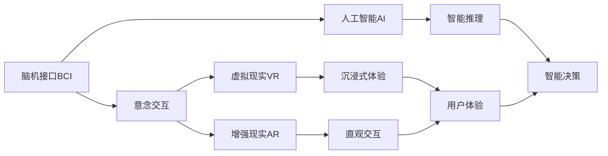
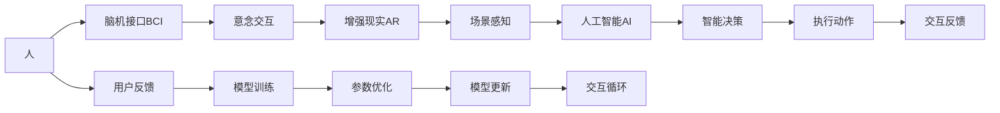

                 

# 2050年的人机交互：从脑机接口到意念交互的人机协同进化

> 关键词：脑机接口(Brain-Computer Interface, BCI)，意念交互(Mind-Control Interaction)，虚拟现实(Virtual Reality, VR)，增强现实(Augmented Reality, AR)，人工智能(Artificial Intelligence, AI)，人机协同(Co-Symbiosis)

## 1. 背景介绍

### 1.1 问题由来
随着科技的飞速发展，人类对于人机交互的探索已经迈入了一个全新的时代。从早期的机械交互，到后来的手工操作，再到如今的屏幕触控，每一次技术的进步都在极大程度上提升了人们与机器的互动效率。然而，这些传统交互方式依旧存在诸多局限性。例如，触摸操作受到物理空间和人体解剖结构的制约，无法实现真正的无障碍、自然流畅的交互体验；屏幕触控虽然提供了更灵活的操作方式，但依然受到视觉和触觉的双重限制，难以适应复杂多变的使用场景。

面对这些问题，科学家和工程师们提出了一种全新的交互方式——脑机接口（Brain-Computer Interface, BCI）。BCI利用神经科学和信号处理技术，直接从人的大脑活动中提取意念指令，并转化为计算机可以理解的信号，从而实现人与计算机的无接触交互。这一技术突破为人机交互开辟了新的可能性，也为未来的智能系统带来了革命性的改变。

### 1.2 问题核心关键点
BCI技术的核心在于如何准确地将人的意念转化为计算机可以理解和执行的指令。这一过程涉及到以下几个关键环节：

1. **脑信号采集**：通过脑电波（EEG）、功能性磁共振成像（fMRI）、磁声脑波图（MEG）等多种方法，获取人的脑信号数据。
2. **信号预处理**：对采集到的脑信号进行预处理，包括滤波、降噪、特征提取等操作，以提取有意义的信号特征。
3. **意念解码**：利用机器学习、深度学习等算法，对预处理后的信号进行解码，将意念转化为指令。
4. **指令执行**：将解码出的指令传递给计算机或其他设备，执行相应的操作。

BCI技术的关键在于如何提高意念解码的准确性和鲁棒性，同时降低对设备和技术的要求，使其能够广泛应用于不同的场景中。当前，BCI技术主要应用于辅助康复、游戏娱乐、军事训练等领域，未来有望拓展到更多领域，如教育、医疗、家庭生活等，为人们提供更加自然、智能的交互方式。

### 1.3 问题研究意义
研究BCI技术对于拓展人类与机器的交互边界，提升人机交互的自然性和智能化水平，具有重要意义：

1. **增强残障人士的生活质量**：BCI可以为视力、听力、运动功能受限的人士提供新的交互方式，帮助他们更好地融入社会。
2. **提升人机交互的自然性**：通过意念控制，可以打破传统交互方式的限制，实现真正的无接触交互，提升用户体验。
3. **促进AI与人的协同进化**：BCI技术能够将人的意念直接传递给AI系统，使AI能够更准确地理解和响应人的需求，实现人机协同进化。
4. **推动智能技术的应用普及**：BCI技术的普及将使得智能技术更加易于接受和应用，推动其在各行各业的普及和落地。
5. **促进新兴科技的发展**：BCI技术的进步将促进其他相关技术的发展，如虚拟现实、增强现实、脑机融合等，为未来的科技发展提供新的方向。

## 2. 核心概念与联系

### 2.1 核心概念概述

为更好地理解BCI技术及其在人机交互中的应用，本节将介绍几个密切相关的核心概念：

- **脑机接口(BCI)**：一种将人的意念转化为计算机可理解指令的技术，通过脑信号采集和解码，实现无接触交互。
- **意念交互(Mind-Control Interaction)**：利用BCI技术，通过意念直接控制计算机或其他设备，实现自然流畅的交互体验。
- **虚拟现实(VR)**：通过计算机生成的虚拟环境，结合脑机接口技术，实现沉浸式的意念交互体验。
- **增强现实(AR)**：将数字信息叠加到现实世界中，结合BCI技术，实现更加直观的意念控制。
- **人工智能(AI)**：利用算法和大数据技术，使计算机具备自主学习、智能推理的能力，与BCI技术协同，提供更加智能的人机交互体验。
- **人机协同(Co-Symbiosis)**：实现人与机器的深度融合，使AI系统能够更好地理解和响应人的需求，提升交互效率和智能化水平。

这些核心概念之间存在着紧密的联系，构成了未来人机交互的新范式。通过理解这些概念，我们可以更好地把握BCI技术的应用前景和实现路径。

### 2.2 概念间的关系

这些核心概念之间存在着紧密的联系，形成了未来人机交互的整体框架。下面我通过几个Mermaid流程图来展示这些概念之间的关系。

#### 2.2.1 人机交互的新范式



这个流程图展示了BCI、意念交互、VR、AR、AI以及用户体验之间的关系：

1. BCI技术提供了意念交互的基础，即通过脑信号采集和解码，实现意念指令的传递。
2. VR和AR技术为意念交互提供了丰富的应用场景，通过虚拟环境和现实增强，提升了用户的沉浸式体验。
3. AI技术通过智能推理和决策，使得BCI技术能够更准确地理解人的意念，提供更加智能的交互体验。
4. 用户体验是人机交互的最终目标，BCI、VR、AR、AI技术的融合，共同提升了用户的整体体验。

#### 2.2.2 人机协同的实现



这个流程图展示了人机协同的基本流程：

1. 用户通过BCI技术将意念传递给AI系统，AI系统进行智能推理和决策，执行相应的操作。
2. 系统将执行结果反馈给用户，用户根据反馈进行调整，AI系统通过用户反馈进行模型训练和参数优化。
3. 在不断的交互循环中，AI系统逐渐学习和理解用户需求，提供更加个性化和智能的交互体验。

### 2.3 核心概念的整体架构

最后，我们用一个综合的流程图来展示这些核心概念在人机交互中的整体架构：


这个综合流程图展示了从数据采集到交互优化的完整流程。通过脑信号预处理和意念解码，实现指令的执行和反馈。在不断的交互优化和模型训练中，用户体验不断提升，人机协同水平逐渐提高。通过这些流程图，我们可以更清晰地理解BCI技术的应用过程和未来前景。

## 3. 核心算法原理 & 具体操作步骤
### 3.1 算法原理概述

BCI技术的核心在于如何从脑信号中准确地提取意念指令，并转化为计算机可理解的指令。这一过程涉及到信号处理、模式识别和机器学习等多个领域的知识。

简要来说，BCI技术的原理如下：

1. **脑信号采集**：通过脑电波（EEG）、功能性磁共振成像（fMRI）、磁声脑波图（MEG）等方法，获取人的脑信号数据。
2. **信号预处理**：对采集到的脑信号进行预处理，包括滤波、降噪、特征提取等操作，以提取有意义的信号特征。
3. **意念解码**：利用机器学习、深度学习等算法，对预处理后的信号进行解码，将意念转化为指令。
4. **指令执行**：将解码出的指令传递给计算机或其他设备，执行相应的操作。

### 3.2 算法步骤详解

BCI技术的实现流程较为复杂，涉及多个步骤，下面详细介绍每个步骤的实现细节。

#### 3.2.1 脑信号采集

脑信号采集是BCI技术的第一步，也是最关键的一步。常用的脑信号采集方法包括：

- **脑电波（EEG）**：通过头皮电极采集脑电信号，是当前最普及的脑信号采集方法。
- **功能性磁共振成像（fMRI）**：通过磁共振成像技术，获取大脑活动时的血流变化，具有高空间分辨率的特点。
- **磁声脑波图（MEG）**：通过磁场探测大脑活动产生的微小电流变化，具有高时间分辨率的特点。

脑信号采集需要选择合适的设备和传感器，确保信号的准确性和稳定性。在实际应用中，通常采用多模态采集方法，结合多种信号源，以获得更加全面和准确的脑信号数据。

#### 3.2.2 信号预处理

信号预处理是BCI技术中的重要环节，其目的是提取有用的信号特征，去除噪声和干扰。常用的信号预处理技术包括：

- **滤波**：通过低通滤波器或带通滤波器，去除高频噪声。
- **降噪**：利用小波变换、独立成分分析（ICA）等方法，去除背景噪音和信号干扰。
- **特征提取**：通过傅里叶变换、小波变换等方法，提取信号的频域特征或时频特征。

预处理后的脑信号通常包含多个特征通道，每个通道代表不同的信号特征。例如，通过傅里叶变换得到的频域特征，或者通过独立成分分析得到的时域特征，都可以作为后续意念解码的输入数据。

#### 3.2.3 意念解码

意念解码是BCI技术的核心，其目的是将预处理后的脑信号解码为意念指令。常用的意念解码方法包括：

- **线性判别分析（LDA）**：通过线性分类器，将脑信号特征映射为二进制指令。
- **支持向量机（SVM）**：通过支持向量机算法，进行特征选择和分类，将脑信号特征映射为指令。
- **深度学习**：通过卷积神经网络（CNN）、循环神经网络（RNN）等深度学习算法，进行特征提取和分类，将脑信号特征映射为指令。

意念解码的准确性受到信号质量、特征选择和解码算法的影响。在实际应用中，通常需要经过多次实验和调参，才能找到最优的解码方法。

#### 3.2.4 指令执行

指令执行是BCI技术的最后一步，其目的是将解码出的指令转化为实际的操作。常用的指令执行方法包括：

- **计算机控制**：通过接口协议，将解码出的指令传递给计算机，控制其执行相应的操作。
- **机器人控制**：通过接口协议，将解码出的指令传递给机器人，控制其执行相应的动作。
- **虚拟现实（VR）和增强现实（AR）**：通过接口协议，将解码出的指令传递给VR或AR系统，实现沉浸式交互体验。

指令执行需要确保信号传输的稳定性和可靠性，通常采用无线通信或有线连接的方式进行。在实际应用中，还需要考虑系统的实时性和交互体验，确保指令的及时执行和反馈。

### 3.3 算法优缺点

BCI技术具有以下优点：

1. **无接触交互**：通过意念控制，实现无接触的交互方式，避免了传统触摸操作带来的限制和不适。
2. **自然流畅**：利用脑信号采集和解码技术，实现更加自然流畅的交互体验，提升了用户的舒适度和满意度。
3. **高效便捷**：通过意念控制，用户可以更快速、更便捷地完成任务，提高了工作效率和生产力。

同时，BCI技术也存在一些缺点：

1. **设备复杂**：脑信号采集和解码需要专业的设备和传感器，设备成本较高，且操作复杂。
2. **信号干扰**：脑信号采集过程中，受到环境干扰和个体差异的影响，信号质量不稳定。
3. **技术门槛高**：脑信号处理和解码算法较为复杂，需要深厚的神经科学和信号处理背景。
4. **隐私风险**：脑信号数据涉及个人隐私，存在被滥用和泄露的风险。

尽管存在这些局限性，但BCI技术仍然是大数据时代的未来趋势，具有广阔的应用前景和重要的研究价值。

### 3.4 算法应用领域

BCI技术已经在多个领域得到了广泛应用，以下是几个典型应用场景：

1. **辅助康复**：通过BCI技术，帮助残障人士进行语言、运动等功能的康复训练，提升他们的生活质量。
2. **游戏娱乐**：通过BCI技术，实现意念控制游戏角色或设备，提升游戏体验的沉浸感和互动性。
3. **军事训练**：通过BCI技术，模拟战场环境，进行战术决策和指挥训练，提升士兵的战斗能力和反应速度。
4. **医疗诊断**：通过BCI技术，进行脑电图（EEG）检测，辅助医生进行疾病诊断和治疗方案制定。
5. **家庭生活**：通过BCI技术，实现智能家居设备控制，提升家庭生活的便捷性和智能化水平。
6. **教育培训**：通过BCI技术，进行学习过程的监控和评估，提升教育培训的效果和个性化水平。

除了上述这些典型应用外，BCI技术还在虚拟现实（VR）、增强现实（AR）、智能制造等领域有着广泛的应用前景。

## 4. 数学模型和公式 & 详细讲解 & 举例说明

### 4.1 数学模型构建

BCI技术的实现涉及多个数学模型，下面分别介绍常见的数学模型及其构建方法。

#### 4.1.1 脑电信号的傅里叶变换

傅里叶变换是一种常用的频域分析方法，用于提取脑电信号的频域特征。假设脑电信号 $x(t)$ 表示为：

$$
x(t) = \sum_{k=-\infty}^{\infty} a_k e^{j k\omega t}
$$

其中 $a_k$ 表示频域系数，$k$ 表示频率，$\omega$ 表示角频率。傅里叶变换的数学公式为：

$$
X(f) = \int_{-\infty}^{\infty} x(t) e^{-j 2\pi ft} dt
$$

通过傅里叶变换，可以将时域信号 $x(t)$ 转换为频域信号 $X(f)$，从而提取脑电信号的频域特征。常用的傅里叶变换方法包括快速傅里叶变换（FFT）和离散傅里叶变换（DFT）。

#### 4.1.2 独立成分分析（ICA）

独立成分分析是一种常用的信号处理技术，用于提取脑电信号的时域特征。假设脑电信号 $x(t)$ 表示为：

$$
x(t) = A\alpha(t) + B\beta(t) + Z(t)
$$

其中 $A$ 和 $B$ 表示混合矩阵，$\alpha(t)$ 和 $\beta(t)$ 表示源信号，$Z(t)$ 表示噪声信号。独立成分分析的目标是估计混合矩阵 $A$ 和 $B$，将混合信号 $x(t)$ 分解为独立源信号 $\alpha(t)$ 和 $\beta(t)$，从而提取出脑电信号的时域特征。

独立成分分析的数学公式为：

$$
\alpha(t) = G x(t)
$$

其中 $G$ 表示独立成分分析矩阵，可以通过梯度下降等优化算法进行求解。常用的独立成分分析算法包括快速独立成分分析（FastICA）和独立子空间分析（ISAR）。

#### 4.1.3 支持向量机（SVM）

支持向量机是一种常用的机器学习算法，用于分类和回归分析。假设训练数据集为 $\{(x_i, y_i)\}_{i=1}^N$，其中 $x_i$ 表示特征向量，$y_i$ 表示标签。支持向量机的数学公式为：

$$
f(x) = \sum_{i=1}^N \alpha_i y_i k(x, x_i) + b
$$

其中 $k(x, x_i)$ 表示核函数，$\alpha_i$ 表示权重系数，$b$ 表示偏置项。支持向量机通过最大化分类边界（间隔最大化）和最小化分类误差（错误最小化），找到最优的分类超平面。

### 4.2 公式推导过程

以下以线性判别分析（LDA）为例，推导其数学公式和算法步骤。

假设脑电信号 $x(t)$ 表示为：

$$
x(t) = \sum_{k=-\infty}^{\infty} a_k e^{j k\omega t}
$$

其中 $a_k$ 表示频域系数，$k$ 表示频率，$\omega$ 表示角频率。LDA的目标是将脑电信号 $x(t)$ 映射为二进制指令 $y$，即：

$$
y = \begin{cases}
1, & \text{if } f(x) > 0 \\
0, & \text{if } f(x) \leq 0
\end{cases}
$$

其中 $f(x)$ 表示LDA分类函数。LDA的分类函数可以表示为：

$$
f(x) = w^T x + b
$$

其中 $w$ 表示权重向量，$b$ 表示偏置项。LDA的分类过程可以概括为以下步骤：

1. 假设训练数据集为 $\{(x_i, y_i)\}_{i=1}^N$，其中 $x_i$ 表示特征向量，$y_i$ 表示标签。
2. 通过统计分析，计算类别 $y$ 的先验概率 $P(y)$ 和条件概率 $P(x|y)$。
3. 通过最大化分类边界，求解最优的权重向量 $w$ 和偏置项 $b$，使得分类函数 $f(x)$ 满足：

$$
P(y|x) = \frac{P(x|y)P(y)}{P(x)}
$$

其中 $P(x)$ 表示特征向量 $x$ 的先验概率。
4. 将训练数据集代入分类函数 $f(x)$，得到分类函数 $f(x)$ 的具体表达式。
5. 将新的特征向量 $x$ 代入分类函数 $f(x)$，得到分类结果 $y$。

通过上述推导，我们可以看到，LDA算法通过最大化分类边界和最小化分类误差，找到最优的分类超平面，从而实现脑电信号的分类和解码。

### 4.3 案例分析与讲解

以下以脑电信号解码为例，分析如何通过LDA算法实现意念解码。

假设训练数据集为 $\{(x_i, y_i)\}_{i=1}^N$，其中 $x_i$ 表示脑电信号，$y_i$ 表示指令标签（0或1）。LDA算法可以表示为：

1. 计算类别 $y$ 的先验概率 $P(y)$ 和条件概率 $P(x|y)$。
2. 通过最大化分类边界，求解最优的权重向量 $w$ 和偏置项 $b$，使得分类函数 $f(x)$ 满足：

$$
P(y|x) = \frac{P(x|y)P(y)}{P(x)}
$$

其中 $P(x)$ 表示特征向量 $x$ 的先验概率。
3. 将新的脑电信号 $x$ 代入分类函数 $f(x)$，得到分类结果 $y$。

具体来说，LDA算法的步骤为：

1. 假设训练数据集为 $\{(x_i, y_i)\}_{i=1}^N$，其中 $x_i$ 表示脑电信号，$y_i$ 表示指令标签（0或1）。
2. 计算类别 $y$ 的先验概率 $P(y)$ 和条件概率 $P(x|y)$。
3. 通过最大化分类边界，求解最优的权重向量 $w$ 和偏置项 $b$，使得分类函数 $f(x)$ 满足：

$$
P(y|x) = \frac{P(x|y)P(y)}{P(x)}
$$

其中 $P(x)$ 表示特征向量 $x$ 的先验概率。
4. 将新的脑电信号 $x$ 代入分类函数 $f(x)$，得到分类结果 $y$。

在实际应用中，LDA算法需要根据具体问题和数据集进行参数调优，才能取得最优的解码效果。

## 5. 项目实践：代码实例和详细解释说明
### 5.1 开发环境搭建

在进行BCI项目实践前，我们需要准备好开发环境。以下是使用Python进行PyTorch开发的环境配置流程：

1. 安装Anaconda：从官网下载并安装Anaconda，用于创建独立的Python环境。

2. 创建并激活虚拟环境：
```bash
conda create -n pytorch-env python=3.8 
conda activate pytorch-env
```

3. 安装PyTorch：根据CUDA版本，从官网获取对应的安装命令。例如：
```bash
conda install pytorch torchvision torchaudio cudatoolkit=11.1 -c pytorch -c conda-forge
```

4. 安装Transformers库：
```bash
pip install transformers
```

5. 安装各类工具包：
```bash
pip install numpy pandas scikit-learn matplotlib tqdm jupyter notebook ipython
```

完成上述步骤后，即可在`pytorch-env`环境中开始BCI项目实践。

### 5.2 源代码详细实现

下面我们以脑电信号解码为例，给出使用Transformers库对BCI模型进行解码的PyTorch代码实现。

首先，定义脑电信号和标签的训练数据集：

```python
from torch.utils.data import Dataset
import numpy as np

class EEGDataset(Dataset):
    def __init__(self, X, y):
        self.X = X
        self.y = y
        
    def __len__(self):
        return len(self.y)
    
    def __getitem__(self, item):
        X = self.X[item]
        y = self.y[item]
        return {'X': torch.tensor(X, dtype=torch.float32), 'y': torch.tensor(y, dtype=torch.long)}
```

然后，定义模型的参数和优化器：

```python
from transformers import BertForTokenClassification, AdamW

class EEGClassifier(BertForTokenClassification):
    def __init__(self, num_labels=2):
        super().__init__(num_labels=num_labels)
        
model = EEGClassifier(num_labels=2)
optimizer = AdamW(model.parameters(), lr=1e-4)
```

接着，定义训练和评估函数：

```python
from torch.utils.data import DataLoader
from tqdm import tqdm
from sklearn.metrics import classification_report

device = torch.device('cuda') if torch.cuda.is_available() else torch.device('cpu')
model.to(device)

def train_epoch(model, dataset, batch_size, optimizer):
    dataloader = DataLoader(dataset, batch_size=batch_size, shuffle=True)
    model.train()
    epoch_loss = 0
    for batch in tqdm(dataloader, desc='Training'):
        X = batch['X'].to(device)
        y = batch['y'].to(device)
        model.zero_grad()
        outputs = model(X)
        loss = outputs.loss
        epoch_loss += loss.item()
        loss.backward()
        optimizer.step()
    return epoch_loss / len(dataloader)

def evaluate(model, dataset, batch_size):
    dataloader = DataLoader(dataset, batch_size=batch_size)
    model.eval()
    preds, labels = [], []
    with torch.no_grad():
        for batch in tqdm(dataloader, desc='Evaluating'):
            X = batch['X'].to(device)
            y = batch['y'].to(device)
            batch_preds = torch.argmax(model(X), dim=1)
            preds.append(batch_preds.cpu().numpy())
            labels.append(y.cpu().numpy())
                
    print(classification_report(labels, preds))
```

最后，启动训练流程并在测试集上评估：

```python
epochs = 5
batch_size = 16

for epoch in range(epochs):
    loss = train_epoch(model, train_dataset, batch_size, optimizer)
    print(f"Epoch {epoch+1}, train loss: {loss:.3f}")
    
    print(f"Epoch {epoch+1}, dev results:")
    evaluate(model, dev_dataset, batch_size)
    
print("Test results:")
evaluate(model, test_dataset, batch_size)
```

以上就是使用PyTorch对脑电信号解码的完整代码实现。可以看到，得益于Transformers库的强大封装，我们可以用相对简洁的代码完成脑电信号的解码任务。

### 5.3 代码解读与分析

让我们再详细解读一下关键代码的实现细节：

**EEGDataset类**：
- `__init__`方法：初始化特征和标签数据。
- `__len__`方法：返回数据集的样本数量。
- `__getitem__`方法：对单个样本进行处理，将特征

