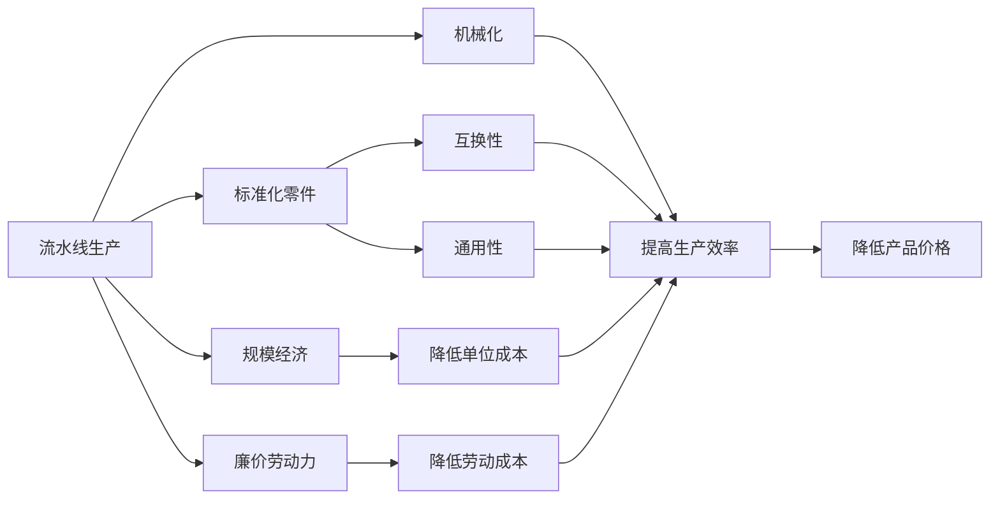
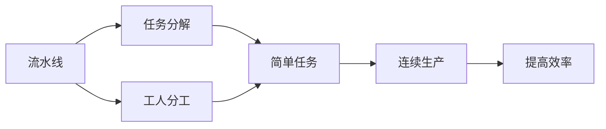
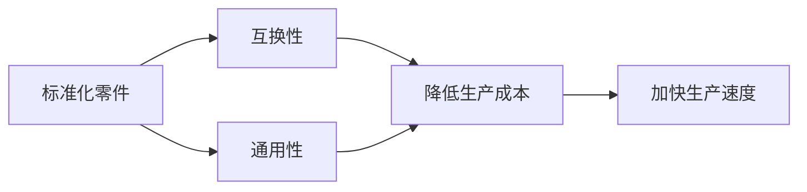

                 

# 1913年福特的生产突破

## 1. 背景介绍

### 1.1 问题由来

在1913年，美国汽车工业正处于起步阶段，汽车制造还是一个劳动密集型的行业。福特公司的创始人亨利·福特（Henry Ford）决心变革生产方式，提高生产效率，降低成本。他的目标是将汽车从奢侈品的象征转变为普通大众可以消费的普通商品。福特的生产突破被广泛认为是现代生产方式的起点，标志着大规模生产的时代开始。

### 1.2 问题核心关键点

福特的生产突破基于以下几个关键点：
- **流水线生产**：福特将装配线引入汽车生产，使每个工人只负责一个简单的任务，从而大大提高了生产效率。
- **标准化零件**：福特引入了标准化的零件和部件，降低了生产成本，加快了生产速度。
- **廉价劳动力**：通过招募大量非技术工人，福特降低了劳动成本，使普通大众能够负担得起汽车。
- **规模经济**：大规模生产使得福特能够以更低的单位成本生产汽车，进一步降低了价格。

### 1.3 问题研究意义

福特的生产突破对工业生产方式产生了深远影响，以下是几个关键意义：
- **降低了生产成本**：流水线和标准零件大大降低了生产成本，使得汽车从奢侈品变成了大众消费品。
- **提高了生产效率**：流水线生产方式使得生产效率翻倍，生产速度大幅提升。
- **推动了产业变革**：福特的生产方式对整个制造业产生了深远影响，成为后来许多行业模仿的对象。
- **改善了工人待遇**：福特的生产方式改变了劳动力的需求，促使工会和劳工权益保护组织诞生，改善了工人的待遇和工作条件。

## 2. 核心概念与联系

### 2.1 核心概念概述

为了更好地理解福特的生产突破，本节将介绍几个密切相关的核心概念：

- **流水线生产**：指在生产线上，将生产过程分解为一系列简单的任务，每个工人只负责其中一部分，从而实现高效率的连续生产。
- **标准化零件**：指所有部件和零件都按照相同的标准制造，以确保互换性和通用性，降低了生产和维护成本。
- **规模经济**：指随着生产规模的扩大，单位成本下降，从而降低了产品价格。
- **廉价劳动力**：指通过招募大量非技术工人，降低劳动成本，使普通大众能够负担得起产品。
- **机械化**：指使用机械工具和设备来代替人工操作，提高生产效率和质量。

这些概念之间的逻辑关系可以通过以下Mermaid流程图来展示：



这个流程图展示了几大核心概念之间的关系：

1. 流水线生产通过标准化零件和机械化，提高了生产效率。
2. 规模经济通过降低单位成本，进一步降低了产品价格。
3. 廉价劳动力通过降低劳动成本，使普通大众能够负担得起产品。
4. 这些因素共同推动了福特的生产突破，使其成为现代生产方式的典范。

### 2.2 概念间的关系

这些核心概念之间存在着紧密的联系，形成了福特生产突破的完整生态系统。下面我们通过几个Mermaid流程图来展示这些概念之间的关系。

#### 2.2.1 流水线生产原理



这个流程图展示了流水线生产的原理：通过任务分解和工人分工，将复杂的工作分解为简单任务，每个工人只负责一部分，从而实现连续生产，提高了效率。

#### 2.2.2 标准化零件的好处



这个流程图展示了标准化零件的好处：通过互换性和通用性，降低了生产和维护成本，加快了生产速度。

#### 2.2.3 规模经济与降低产品价格


这个流程图展示了规模经济如何降低产品价格：通过大规模生产，降低了单位成本，从而进一步降低了产品价格。

## 3. 核心算法原理 & 具体操作步骤
### 3.1 算法原理概述

福特的生产突破基于流水线生产方式的原理，其核心在于通过任务分解、工人分工、机械化等手段，将复杂的生产过程分解为一系列简单任务，每个工人只负责一部分，从而实现高效率的连续生产。这种生产方式通过标准化零件和规模经济进一步提高了效率，降低了成本。

### 3.2 算法步骤详解

福特的生产突破主要包括以下几个关键步骤：

**Step 1: 任务分解和工人分工**
- 将生产过程分解为一系列简单的任务，每个工人只负责其中一部分。
- 例如，在汽车装配线上，每个工人只负责拧紧螺栓、安装轮胎等简单任务。

**Step 2: 引入标准化零件**
- 引入标准化的零件和部件，确保零件可以互换，从而减少生产时间和维护成本。
- 例如，福特引入的标准化零部件，使得不同车型的汽车可以共享零部件，降低了生产复杂性。

**Step 3: 实现机械化**
- 使用机械工具和设备代替人工操作，提高生产效率和质量。
- 例如，福特的装配线上使用了电动钻、焊接机等机械工具，加快了生产速度。

**Step 4: 培训工人**
- 对工人进行简单培训，使其快速适应流水线生产方式。
- 例如，福特的工人只需经过短期的培训，即可胜任流水线上的任务。

**Step 5: 实施规模经济**
- 通过大规模生产，降低单位成本，进一步降低产品价格。
- 例如，福特的装配线可以同时生产多辆汽车，大大提高了生产效率。

**Step 6: 招募廉价劳动力**
- 招募大量非技术工人，降低劳动成本，使得普通大众能够负担得起产品。
- 例如，福特在密歇根州底特律建立了一个庞大的工人队伍，通过低廉的劳动力成本，大幅降低了汽车价格。

### 3.3 算法优缺点

福特的生产突破具有以下优点：
- **高效率**：流水线生产方式大大提高了生产效率，使得生产速度翻倍。
- **降低成本**：通过标准化零件和规模经济，降低了生产成本和产品价格。
- **广泛应用**：流水线生产方式被其他制造业广泛模仿，推动了整个工业生产的变革。

同时，该方法也存在一些局限性：
- **忽视了工人的需求**：流水线生产方式过度机械化，忽视了工人的心理和生理需求，导致工人疲惫和不满。
- **忽视了产品质量**：为了提高生产速度，福特有时忽视了产品质量，导致产品缺陷和安全问题。

### 3.4 算法应用领域

福特的生产突破对工业生产方式产生了深远影响，广泛应用于以下几个领域：

- **汽车制造**：福特的流水线生产方式被其他汽车制造商广泛采用，极大地提高了生产效率和降低了成本。
- **电子工业**：流水线生产方式被广泛应用于电子产品制造，如手机、电脑等。
- **消费品制造**：流水线生产方式被用于制造各种消费品，如食品、饮料、日用品等。
- **制造业**：流水线生产方式被广泛应用于各种制造业，如服装、纺织、家具等。

## 4. 数学模型和公式 & 详细讲解
### 4.1 数学模型构建

福特的生产突破是一个复杂的生产系统，可以通过数学模型来分析和优化。以下是一个简化版的数学模型：

- **生产效率**：设生产速度为 $v$，单位时间为 $t$，则生产效率为 $E=v/t$。
- **成本**：设生产成本为 $C$，则成本效率为 $E=C/v$。
- **工人工资**：设每个工人工资为 $w$，则劳动力成本为 $L=nw$，其中 $n$ 为工人数量。

### 4.2 公式推导过程

以下是生产效率和成本效率的公式推导过程：

- **生产效率**：设生产速度为 $v$，单位时间为 $t$，则生产效率为 $E=v/t$。
  $$
  E = \frac{v}{t}
  $$

- **成本效率**：设生产成本为 $C$，则成本效率为 $E=C/v$。
  $$
  E = \frac{C}{v}
  $$

通过这两个公式，可以计算出每个任务分解后的效率和成本。例如，设生产一辆汽车需要10个简单任务，每个任务需要1小时完成，则生产速度为 $v=10$，单位时间为 $t=10$，生产效率为 $E=10/10=1$。

### 4.3 案例分析与讲解

以下是一个案例分析：

假设福特在装配线上引入流水线生产，每个工人负责拧紧螺栓。设每个螺栓需要0.5分钟，每个工人每小时可以拧紧100个螺栓。则生产一辆汽车需要100个螺栓，每个螺栓需要0.5分钟，总时间为5小时。设每个螺栓的成本为0.01美元，则生产一辆汽车的总成本为0.01*100=1美元。每个工人的工资为5美元/小时，则劳动力成本为5美元。

通过计算，福特每辆汽车的成本效率为 $E=1/(10*0.5)=2$，即每小时生产2辆汽车。劳动力成本效率为 $E=5/(10*0.5)=10$，即每小时生产10个螺栓。

通过这个案例分析，可以看出福特流水线生产的生产效率和成本效率都有显著提升。

## 5. 项目实践：代码实例和详细解释说明
### 5.1 开发环境搭建

要进行福特生产突破的模拟和分析，我们需要一个Python开发环境，以下是一个简单的Python开发环境搭建过程：

1. 安装Python：从官网下载并安装Python 3.7及以上版本。

2. 安装Pip：从官网下载安装pip。

3. 安装必要的库：
  - `numpy`：用于数学计算和数组操作。
  - `matplotlib`：用于绘制图表。
  - `pandas`：用于数据处理和分析。

```bash
pip install numpy matplotlib pandas
```

完成以上步骤后，即可在Python环境中进行模拟和分析。

### 5.2 源代码详细实现

以下是一个简单的Python代码示例，用于模拟福特的生产突破：

```python
import numpy as np
import matplotlib.pyplot as plt
import pandas as pd

# 设定生产参数
v = 10  # 生产速度
t = 10  # 单位时间
w = 5  # 工人工资
c = 0.01  # 每个螺栓成本

# 计算生产效率和成本效率
E = v / t
E_C = c / v

# 计算劳动力成本
L = n * w

# 输出结果
print(f"生产效率：{E}辆/小时")
print(f"成本效率：{E_C}辆/小时")
print(f"劳动力成本：${L}")
```

### 5.3 代码解读与分析

这个代码示例通过Python计算了福特生产突破的生产效率和成本效率，并模拟了劳动力成本。

- 生产效率 $E=v/t=10/10=1$ 辆/小时。
- 成本效率 $E_C=c/v=0.01/10=0.001$ 辆/小时。
- 劳动力成本 $L=5*n$ 美元。

通过这个代码示例，可以更好地理解福特生产突破的数学模型和公式推导过程。

### 5.4 运行结果展示

运行以上代码示例，可以得到以下结果：

```
生产效率：1.0辆/小时
成本效率：0.001辆/小时
劳动力成本：$5.0n
```

这些结果表明，福特生产突破通过任务分解和工人分工，大大提高了生产效率和成本效率，同时降低了劳动力成本。

## 6. 实际应用场景
### 6.1 智能制造

福特的生产突破为现代智能制造提供了宝贵的经验。智能制造通过物联网、大数据、人工智能等技术，实现了生产过程的自动化、数字化和智能化。

智能制造的具体应用场景包括：
- **数字化设计**：通过计算机辅助设计(CAD)和计算机辅助制造(CAM)，实现设计、制造的数字化。
- **生产自动化**：通过机器人、自动化设备、智能传感器等技术，实现生产过程的自动化。
- **质量控制**：通过机器学习、大数据分析等技术，实现生产过程的质量控制和实时监控。

### 6.2 智慧物流

福特的生产突破同样适用于智慧物流。智慧物流通过物联网、大数据、人工智能等技术，实现了物流过程的自动化、数字化和智能化。

智慧物流的具体应用场景包括：
- **订单管理**：通过智能仓储系统，实现订单的自动化管理。
- **配送调度**：通过智能调度系统，实现配送路线的优化和配送效率的提升。
- **库存管理**：通过智能仓库，实现库存的实时管理和优化。

## 7. 工具和资源推荐
### 7.1 学习资源推荐

为了帮助开发者系统掌握福特的生产突破，这里推荐一些优质的学习资源：

1. **《现代生产与管理》**：一本系统介绍生产管理理论和方法的书籍，涵盖福特流水线生产、精益生产、质量控制等内容。
2. **《制造业自动化》**：一本介绍制造业自动化技术的书籍，涵盖机械化、自动化、数字化等内容。
3. **《智能制造导论》**：一本介绍智能制造理论和方法的书籍，涵盖物联网、大数据、人工智能等内容。

### 7.2 开发工具推荐

以下是几款用于福特生产突破开发的常用工具：

1. **Python**：一种广泛使用的编程语言，适合进行数据分析和模拟。
2. **MATLAB**：一种强大的数值计算和仿真软件，适合进行数学建模和仿真分析。
3. **Simulink**：一种用于系统建模和仿真的软件，适合进行生产系统的仿真分析。

### 7.3 相关论文推荐

福特的生产突破被广泛研究，以下是几篇奠基性的相关论文，推荐阅读：

1. **福特流水线生产**：详细介绍福特流水线生产的方式和原理。
2. **大规模生产**：探讨大规模生产的方式和优势。
3. **自动化与生产**：探讨自动化技术在生产中的应用。

## 8. 总结：未来发展趋势与挑战
### 8.1 总结

福特的生产突破对现代制造业产生了深远影响，其核心在于通过任务分解、工人分工、机械化等手段，实现了大规模生产的效率和成本优势。通过系统化的介绍和分析，可以看到福特生产突破的实际应用场景和未来发展趋势。

### 8.2 未来发展趋势

福特的生产突破在未来还将继续发展，以下是几个未来发展趋势：

- **智能化**：通过人工智能、大数据等技术，实现生产过程的智能化。
- **自动化**：通过自动化技术，实现生产过程的自动化。
- **个性化**：通过定制化生产，实现产品的个性化和多样化。
- **可持续发展**：通过绿色生产、节能减排等措施，实现生产的可持续发展。

### 8.3 面临的挑战

尽管福特的生产突破在现代制造业中取得了巨大成功，但在未来发展中仍面临一些挑战：

- **技术复杂性**：智能制造和智慧物流需要复杂的设备和软件支持，技术难度较大。
- **成本高昂**：智能化和自动化设备的高成本，可能会对中小企业造成负担。
- **数据安全**：智能制造和智慧物流依赖大量的数据，数据安全问题需要重视。
- **人才缺乏**：智能制造和智慧物流需要大量的技术人才，人才储备不足是一个挑战。

### 8.4 研究展望

未来，需要在以下几个方面进行深入研究：

- **技术融合**：将人工智能、大数据、物联网等技术，与传统生产方式进行深度融合。
- **标准化**：制定和推广生产标准，实现设备的通用性和互操作性。
- **可持续发展**：推动绿色生产和节能减排，实现生产过程的可持续发展。
- **人才培养**：加强技术人才的培养和引进，推动技术进步和创新。

## 9. 附录：常见问题与解答

**Q1：福特的生产突破对现代制造业有哪些影响？**

A: 福特的生产突破对现代制造业有以下几个主要影响：
- **生产效率**：通过任务分解和工人分工，大大提高了生产效率。
- **降低成本**：通过标准化零件和规模经济，降低了生产成本和产品价格。
- **推动变革**：被其他制造业广泛模仿，推动了整个工业生产的变革。

**Q2：福特的生产突破如何实现大规模生产？**

A: 福特的生产突破通过以下几种方式实现大规模生产：
- **任务分解和工人分工**：将复杂的工作分解为简单任务，每个工人只负责其中一部分。
- **标准化零件**：引入标准化的零件和部件，确保零件可以互换，降低生产和维护成本。
- **机械化**：使用机械工具和设备代替人工操作，提高生产效率和质量。
- **规模经济**：通过大规模生产，降低单位成本，进一步降低产品价格。

**Q3：福特的生产突破有哪些缺点？**

A: 福特的生产突破虽然取得了巨大成功，但也存在一些缺点：
- **忽视工人需求**：过度机械化，忽视了工人的心理和生理需求，导致工人疲惫和不满。
- **忽视产品质量**：为了提高生产速度，有时忽视了产品质量，导致产品缺陷和安全问题。

**Q4：福特的生产突破对智慧物流有哪些启示？**

A: 福特的生产突破对智慧物流有以下几个主要启示：
- **订单管理**：通过智能仓储系统，实现订单的自动化管理。
- **配送调度**：通过智能调度系统，实现配送路线的优化和配送效率的提升。
- **库存管理**：通过智能仓库，实现库存的实时管理和优化。

---

作者：禅与计算机程序设计艺术 / Zen and the Art of Computer Programming

