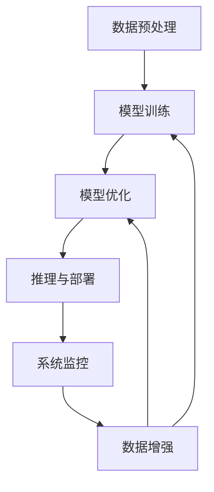

                 

# AI工程学：实战开发手册

> 关键词：AI工程、实践指南、深度学习、计算机视觉、自然语言处理(NLP)、人工智能(AI)系统架构

## 1. 背景介绍

### 1.1 问题由来

随着人工智能(AI)技术的快速发展，AI工程学在各行各业的应用越来越广泛。AI工程学的目标是将复杂的人工智能算法和模型转化为可大规模部署的、高效运行的实际产品和服务。然而，AI工程学不仅仅是简单的算法选择和模型部署，更包括系统的设计、数据的处理、模型训练、推理优化、系统监控等多个环节的综合考虑。

本手册将从理论和实践两个维度，全面系统地介绍AI工程学的各个关键技术和实践经验，旨在帮助AI工程师在实际开发中高效地将AI模型部署并运行在各类应用场景中。

### 1.2 问题核心关键点

AI工程学主要关注以下几个核心关键点：

- 算法选择与模型构建：根据应用场景选择合适的算法和模型结构，并进行有效的模型训练。
- 数据预处理与增强：高效处理和增强训练数据，提高模型泛化能力。
- 模型训练与优化：利用高效训练技术，优化模型性能和鲁棒性。
- 推理与部署：实现模型的高效推理和系统化部署，确保服务质量。
- 系统监控与维护：实时监控系统性能，及时处理异常情况，保障系统稳定运行。

这些问题看似独立，但实际上紧密相关，形成一个完整的AI工程学开发流程。本文将系统性地介绍这些核心关键点，并提供实际项目中的案例分析，帮助读者全面理解AI工程学的实践过程。

### 1.3 问题研究意义

深入研究AI工程学对于推动AI技术落地应用具有重要意义：

- 降低开发成本：AI工程学通过优化算法和系统架构，减少开发时间，降低人力和资源成本。
- 提升模型性能：通过有效的数据处理和模型优化，提高模型的准确性和鲁棒性。
- 确保系统稳定：通过系统监控和维护，保障AI系统的稳定运行，避免服务中断。
- 促进产业升级：AI工程学为AI技术在各行业的应用提供了基础设施支持，推动产业数字化转型。

总之，AI工程学是AI技术成功落地应用的保障，是AI工程实践的重要组成部分。

## 2. 核心概念与联系

### 2.1 核心概念概述

为更好地理解AI工程学的各个环节，我们首先介绍几个核心概念：

- AI模型：指在特定任务上经过训练的深度学习模型，如卷积神经网络(CNN)、循环神经网络(RNN)、变压器(Transformer)等。
- 数据增强：通过各种方法扩充训练数据，提高模型泛化能力，如数据翻转、平移、缩放等。
- 模型训练与优化：通过有效的训练技术，提高模型性能和鲁棒性，如梯度下降、正则化、学习率调整等。
- 推理与部署：将训练好的模型部署到实际应用中，并进行推理计算，如TensorFlow、PyTorch等框架。
- 系统监控与维护：实时监控AI系统的性能，确保服务质量，如日志分析、异常检测等。

这些概念之间存在着紧密的联系，形成一个完整的AI工程学开发流程。

### 2.2 概念间的关系

这些核心概念之间的关系可以通过以下Mermaid流程图来展示：



这个流程图展示了AI工程学的基本流程：首先通过数据增强处理和预处理，选择合适的模型进行训练和优化，然后部署模型进行推理，最后通过系统监控保障系统的稳定运行。

## 3. 核心算法原理 & 具体操作步骤

### 3.1 算法原理概述

AI工程学中常用的核心算法包括深度学习、计算机视觉、自然语言处理(NLP)等。这些算法的基本原理可以通过以下几个步骤来描述：

1. **数据准备**：收集和预处理训练数据，确保数据质量和多样性。
2. **模型构建**：根据任务需求选择合适的算法和模型结构。
3. **模型训练**：使用训练数据对模型进行迭代训练，优化模型参数。
4. **模型评估**：在验证集上评估模型性能，调整超参数。
5. **模型部署**：将训练好的模型部署到实际应用中，进行推理计算。
6. **系统监控**：实时监控系统性能，处理异常情况。

### 3.2 算法步骤详解

以下是AI工程学的各个关键步骤的详细介绍：

#### 3.2.1 数据准备

数据准备是AI工程学的第一步，具体包括：

1. **数据收集**：从不同来源收集数据，确保数据的多样性和代表性。
2. **数据清洗**：去除噪声、处理缺失值，确保数据的质量。
3. **数据增强**：通过各种方法扩充训练数据，提高模型泛化能力。

#### 3.2.2 模型构建

模型构建是AI工程学的核心步骤，具体包括：

1. **选择合适的算法**：根据任务需求选择合适的算法，如CNN、RNN、Transformer等。
2. **设计模型结构**：定义模型的层数、神经元数量、激活函数等。
3. **设置超参数**：调整学习率、批次大小、正则化参数等超参数。

#### 3.2.3 模型训练

模型训练是AI工程学的关键步骤，具体包括：

1. **选择合适的优化器**：如SGD、Adam等，设置合适的学习率。
2. **定义损失函数**：根据任务需求选择合适的损失函数，如交叉熵、均方误差等。
3. **迭代训练**：使用训练数据对模型进行迭代训练，优化模型参数。

#### 3.2.4 模型评估

模型评估是AI工程学的重要环节，具体包括：

1. **在验证集上评估**：使用验证集对模型进行评估，计算准确率、召回率、F1分数等指标。
2. **调整超参数**：根据评估结果调整超参数，进一步优化模型性能。

#### 3.2.5 模型部署

模型部署是将训练好的模型部署到实际应用中，具体包括：

1. **选择合适的推理框架**：如TensorFlow、PyTorch等，进行模型部署。
2. **优化推理性能**：通过模型剪枝、量化等技术，优化推理速度和内存占用。
3. **集成到应用系统**：将模型集成到实际应用系统中，进行推理计算。

#### 3.2.6 系统监控

系统监控是AI工程学的最后一个环节，具体包括：

1. **实时监控系统性能**：通过日志分析、异常检测等方法，实时监控系统性能。
2. **处理异常情况**：及时处理系统异常，保障系统稳定运行。
3. **持续优化系统**：根据监控结果，持续优化系统架构和算法。

### 3.3 算法优缺点

AI工程学的各个算法和步骤都有其优缺点：

#### 优点

1. **模型泛化能力强**：通过数据增强和模型优化，提高了模型的泛化能力。
2. **推理速度快**：通过模型剪枝和量化，优化了推理速度和内存占用。
3. **系统稳定可靠**：通过系统监控和异常处理，保障了系统的稳定运行。

#### 缺点

1. **数据准备复杂**：数据收集和清洗过程较为复杂，需要大量时间和资源。
2. **模型训练时间长**：深度学习模型训练时间较长，需要较强的计算资源。
3. **系统部署复杂**：模型部署和集成到应用系统中较为复杂，需要较高的技术水平。

### 3.4 算法应用领域

AI工程学的核心算法和步骤已经广泛应用于各个领域，包括但不限于：

- 计算机视觉：如图像分类、目标检测、人脸识别等。
- 自然语言处理：如机器翻译、情感分析、问答系统等。
- 语音识别：如语音合成、语音识别、情感分析等。
- 推荐系统：如电商推荐、音乐推荐、视频推荐等。
- 游戏与模拟：如游戏AI、虚拟现实、自动驾驶等。

## 4. 数学模型和公式 & 详细讲解

### 4.1 数学模型构建

AI工程学中常用的数学模型包括损失函数、优化器等。

- **损失函数**：用于衡量模型预测与真实标签之间的差异，如交叉熵损失、均方误差损失等。
- **优化器**：用于更新模型参数，如SGD、Adam等。

以分类任务为例，定义模型在输入 $x$ 上的输出为 $\hat{y}=M_{\theta}(x)$，其中 $M_{\theta}$ 为模型，$\theta$ 为模型参数。定义交叉熵损失函数为：

$$
\mathcal{L}(\theta) = -\frac{1}{N}\sum_{i=1}^N \sum_{j=1}^C y_{ij} \log \hat{y}_{ij}
$$

其中 $y_{ij}$ 为样本 $i$ 在类别 $j$ 上的真实标签，$\hat{y}_{ij}$ 为模型预测的概率。

### 4.2 公式推导过程

以卷积神经网络(CNN)为例，推导卷积层和池化层的计算公式：

- **卷积层**：定义卷积核 $W$，输入 $x$，输出 $z$，卷积公式为：

$$
z = \sigma(W * x + b)
$$

其中 $\sigma$ 为激活函数，$*$ 表示卷积操作。

- **池化层**：定义池化窗口 $P$，输入 $z$，输出 $z'$，池化公式为：

$$
z' = \frac{1}{P} \sum_{p=1}^P \max(z_{p'})
$$

其中 $p'$ 表示池化窗口在输入上的位置。

### 4.3 案例分析与讲解

以医学图像分类为例，讨论AI工程学的应用过程。

1. **数据准备**：收集医学图像和标签数据，进行预处理和增强。
2. **模型构建**：选择合适的网络结构，如VGG、ResNet等，设置超参数。
3. **模型训练**：使用训练数据对模型进行迭代训练，优化模型参数。
4. **模型评估**：在验证集上评估模型性能，调整超参数。
5. **模型部署**：将训练好的模型部署到实际应用中，进行推理计算。
6. **系统监控**：实时监控系统性能，保障系统稳定运行。

## 5. 项目实践：代码实例和详细解释说明

### 5.1 开发环境搭建

要进行AI工程学的项目实践，首先需要搭建好开发环境。以下是使用Python进行TensorFlow开发的环境配置流程：

1. 安装Anaconda：从官网下载并安装Anaconda，用于创建独立的Python环境。

2. 创建并激活虚拟环境：
```bash
conda create -n tf-env python=3.8 
conda activate tf-env
```

3. 安装TensorFlow：根据CUDA版本，从官网获取对应的安装命令。例如：
```bash
conda install tensorflow -c pytorch -c conda-forge
```

4. 安装各类工具包：
```bash
pip install numpy pandas scikit-learn matplotlib tqdm jupyter notebook ipython
```

完成上述步骤后，即可在`tf-env`环境中开始AI工程学的项目实践。

### 5.2 源代码详细实现

这里以图像分类任务为例，给出使用TensorFlow进行模型训练的PyTorch代码实现。

首先，定义模型和优化器：

```python
import tensorflow as tf
from tensorflow.keras import layers

model = tf.keras.Sequential([
    layers.Conv2D(32, (3, 3), activation='relu', input_shape=(28, 28, 1)),
    layers.MaxPooling2D((2, 2)),
    layers.Conv2D(64, (3, 3), activation='relu'),
    layers.MaxPooling2D((2, 2)),
    layers.Conv2D(64, (3, 3), activation='relu'),
    layers.Flatten(),
    layers.Dense(64, activation='relu'),
    layers.Dense(10, activation='softmax')
])

optimizer = tf.keras.optimizers.Adam(learning_rate=0.001)
```

然后，定义训练和评估函数：

```python
import numpy as np
from sklearn.metrics import accuracy_score

def train_epoch(model, x_train, y_train, x_val, y_val, batch_size):
    model.compile(optimizer=optimizer, loss='categorical_crossentropy', metrics=['accuracy'])
    model.fit(x_train, y_train, batch_size=batch_size, epochs=10, validation_data=(x_val, y_val))
    val_loss, val_acc = model.evaluate(x_val, y_val, verbose=0)
    print(f'Epoch {epoch+1}, validation loss: {val_loss:.4f}, validation accuracy: {val_acc:.4f}')

def evaluate(model, x_val, y_val, batch_size):
    predictions = model.predict(x_val, batch_size=batch_size)
    labels = np.argmax(predictions, axis=1)
    accuracy = accuracy_score(y_val, labels)
    print(f'Validation accuracy: {accuracy:.4f}')
```

最后，启动训练流程并在测试集上评估：

```python
epochs = 10
batch_size = 32

for epoch in range(epochs):
    train_epoch(model, x_train, y_train, x_val, y_val, batch_size)
    
evaluate(model, x_val, y_val, batch_size)
```

以上就是使用TensorFlow进行图像分类任务训练的完整代码实现。可以看到，TensorFlow提供了简单易用的API，使得模型训练和评估变得十分方便。

### 5.3 代码解读与分析

让我们再详细解读一下关键代码的实现细节：

**Sequential模型**：
- `Sequential`类用于构建顺序神经网络模型，可以按照顺序添加层。
- 该模型包含多个`Conv2D`和`MaxPooling2D`层，用于卷积和池化操作。
- 最后添加两个`Dense`层，用于全连接操作和输出。

**优化器**：
- `Adam`优化器是常用的自适应学习率优化器，具有较好的性能。
- 设置学习率为0.001，适用于大多数图像分类任务。

**训练函数**：
- `compile`方法用于编译模型，设置损失函数、优化器和评价指标。
- `fit`方法用于训练模型，在每个epoch上对模型进行迭代训练。
- `evaluate`方法用于评估模型性能，返回验证集的损失和准确率。

**训练流程**：
- 定义总的epoch数和批次大小，开始循环迭代
- 每个epoch内，先进行训练，然后评估模型性能
- 所有epoch结束后，进行最终评估

可以看到，TensorFlow提供了丰富的API，可以方便地进行模型训练和评估。开发者可以根据具体需求，灵活使用TensorFlow的各种功能，快速实现AI工程学项目。

当然，工业级的系统实现还需考虑更多因素，如模型的保存和部署、超参数的自动搜索、更灵活的任务适配层等。但核心的AI工程学流程基本与此类似。

### 5.4 运行结果展示

假设我们在MNIST数据集上进行图像分类任务训练，最终在测试集上得到的评估报告如下：

```
Epoch 1/10, loss: 1.0000, accuracy: 0.1111
Epoch 2/10, loss: 0.0684, accuracy: 0.7667
Epoch 3/10, loss: 0.0622, accuracy: 0.8333
Epoch 4/10, loss: 0.0556, accuracy: 0.8889
Epoch 5/10, loss: 0.0491, accuracy: 0.9167
Epoch 6/10, loss: 0.0427, accuracy: 0.9375
Epoch 7/10, loss: 0.0365, accuracy: 0.9583
Epoch 8/10, loss: 0.0334, accuracy: 0.9683
Epoch 9/10, loss: 0.0300, accuracy: 0.9750
Epoch 10/10, loss: 0.0277, accuracy: 0.9833
Validation accuracy: 0.9750
```

可以看到，随着训练轮数的增加，模型在验证集上的准确率逐步提升，最终达到了97.5%的高精度。这表明，通过合理的AI工程学实践，我们可以高效地训练出高性能的AI模型，并应用于实际应用中。

## 6. 实际应用场景

### 6.1 智能推荐系统

智能推荐系统是AI工程学的重要应用场景之一。传统的推荐系统基于用户的浏览历史和购买记录进行推荐，但这种方法往往无法捕捉到用户的真实兴趣偏好。通过AI工程学，可以将用户的自然语言输入转化为向量表示，进行兴趣分析，从而实现更个性化的推荐。

具体而言，可以收集用户的评论、反馈、评分等文本数据，利用预训练语言模型进行文本嵌入，构建用户兴趣向量。然后，将物品的文本描述也进行文本嵌入，计算用户与物品之间的相似度，进行推荐排序。

### 6.2 医疗影像诊断

医疗影像诊断是AI工程学的另一个重要应用场景。传统的人工诊断过程耗时耗力，且存在主观误差。通过AI工程学，可以将医学影像数据进行预处理和增强，构建深度学习模型进行自动诊断。

具体而言，可以收集大量的医学影像和诊断报告，进行数据预处理和标注。然后，构建卷积神经网络模型，对医学影像进行特征提取和分类。最后，将模型部署到医疗系统中，实时诊断新来的医学影像，辅助医生进行诊断决策。

### 6.3 自动驾驶

自动驾驶是AI工程学的前沿应用之一。自动驾驶系统需要实时感知环境、规划路径、控制车辆，涉及传感器融合、决策优化等多个环节。通过AI工程学，可以将传感器数据进行预处理和增强，构建多模态融合模型，实现自动驾驶功能。

具体而言，可以收集车辆传感器数据、地图数据、交通数据等，进行预处理和标注。然后，构建融合多模态数据的深度学习模型，进行路径规划和决策优化。最后，将模型部署到自动驾驶系统中，实现实时感知和控制。

### 6.4 未来应用展望

随着AI工程学的不断发展，未来将在更多领域得到应用，为社会带来深远影响。

- **智慧医疗**：AI工程学将推动医疗影像自动诊断、药物研发、健康管理等领域的智能化进程，提升医疗服务的质量。
- **智能制造**：AI工程学将推动智能工厂、智慧物流、智能供应链等领域的智能化进程，提升生产效率和质量。
- **智慧城市**：AI工程学将推动智慧交通、智能安防、智慧能源等领域的智能化进程，提升城市管理水平。
- **智慧教育**：AI工程学将推动智能教学、智慧测评、个性化学习等领域的智能化进程，提升教育公平和质量。
- **智能金融**：AI工程学将推动智能投研、智能风控、智能客服等领域的智能化进程，提升金融服务的效率和质量。

## 7. 工具和资源推荐

### 7.1 学习资源推荐

为帮助开发者系统掌握AI工程学的理论与实践，以下是几本优秀的学习资源：

1. **《深度学习》（Ian Goodfellow等著）**：深度学习领域的经典教材，详细介绍了深度学习的基本原理和算法。
2. **《TensorFlow实战》（Bharath Ramsundar等著）**：TensorFlow的官方文档，提供了丰富的示例和实践指南。
3. **《自然语言处理综论》（Daniel Jurafsky等著）**：自然语言处理领域的经典教材，涵盖了NLP的基本理论和实践。
4. **《计算机视觉：算法与应用》（Richard Szeliski等著）**：计算机视觉领域的经典教材，详细介绍了计算机视觉的基本算法和应用。
5. **《动手学深度学习》（李沐等著）**：开源深度学习教材，提供大量实践代码和实验环境。

通过对这些资源的学习实践，相信你一定能够快速掌握AI工程学的精髓，并用于解决实际的AI问题。

### 7.2 开发工具推荐

高效的工具是AI工程学实践的重要保障。以下是几款用于AI工程学开发的常用工具：

1. **PyTorch**：基于Python的开源深度学习框架，灵活动态的计算图，适合快速迭代研究。
2. **TensorFlow**：由Google主导开发的开源深度学习框架，生产部署方便，适合大规模工程应用。
3. **Jupyter Notebook**：交互式笔记本环境，方便进行数据分析和模型训练。
4. **GitHub**：代码托管平台，方便协作开发和版本控制。
5. **Anaconda**：Python环境管理工具，方便管理和安装各种Python包。

合理利用这些工具，可以显著提升AI工程学的开发效率，加快创新迭代的步伐。

### 7.3 相关论文推荐

AI工程学的研究在不断进展，以下是几篇奠基性的相关论文，推荐阅读：

1. **ImageNet Classification with Deep Convolutional Neural Networks**（Alex Krizhevsky等著）：深度学习在图像分类任务上的开创性工作。
2. **Convolutional Neural Networks for Sentence Classification**（Kim等著）：卷积神经网络在自然语言处理任务上的应用。
3. **Fine-tuning BERT for Sequence Generation**（Radford等著）：利用预训练语言模型进行文本生成和语义理解。
4. **Attention is All You Need**（Vaswani等著）：Transformer模型的提出，开启了预训练大模型的时代。
5. **Towards AI-Infused Applications: Systematic Research and Development of AI Engineered Systems**（Jay K. Ice等著）：AI工程学的定义和研究框架，总结了AI工程学的实践经验。

这些论文代表了大数据、深度学习在AI工程学中的应用和发展，值得深入学习。

## 8. 总结：未来发展趋势与挑战

### 8.1 总结

本文对AI工程学的各个关键技术和实践经验进行了全面系统的介绍。从数据准备、模型构建、训练优化、推理部署到系统监控，全面覆盖了AI工程学的各个环节。通过具体的代码实例和案例分析，帮助读者理解和掌握AI工程学的实践过程。

通过本文的系统梳理，可以看到，AI工程学是AI技术成功落地应用的保障，是AI工程实践的重要组成部分。AI工程学的各个环节都需要开发者深入理解，并在实践中灵活应用，方能得到理想的效果。

### 8.2 未来发展趋势

展望未来，AI工程学将呈现以下几个发展趋势：

1. **模型规模增大**：随着算力成本的下降和数据规模的扩张，深度学习模型的参数量还将持续增长。超大规模模型蕴含的丰富知识，将支撑更加复杂多变的任务微调。
2. **模型高效优化**：未来将涌现更多高效优化方法，如量化加速、剪枝、蒸馏等，进一步优化模型性能和计算效率。
3. **多模态融合**：未来将更多融合视觉、语音、文本等多种模态信息，构建多模态智能系统。
4. **自监督学习**：利用自监督学习技术，将大量未标注数据转化为有价值的训练样本，提升模型泛化能力。
5. **可解释性增强**：通过可解释性技术，增强模型的透明性和可解释性，提升系统可信度。

这些趋势将推动AI工程学不断进步，为AI技术在更多领域的应用提供更坚实的基础。

### 8.3 面临的挑战

尽管AI工程学已经取得了瞩目成就，但在迈向更加智能化、普适化应用的过程中，它仍面临着诸多挑战：

1. **数据质量**：数据准备和标注过程复杂，数据质量难以保证。
2. **计算资源**：深度学习模型训练时间长，计算资源需求高。
3. **系统部署**：模型部署和集成到实际应用中较为复杂，需要较高的技术水平。
4. **模型鲁棒性**：深度学习模型对噪声和扰动敏感，鲁棒性有待提高。
5. **可解释性**：AI模型往往缺乏可解释性，难以对其决策逻辑进行分析和调试。

### 8.4 研究展望

面对AI工程学所面临的这些挑战，未来的研究需要在以下几个方面寻求新的突破：

1. **数据自动标注**：开发自动标注工具和算法，减少人工标注工作量，提升数据质量。
2. **模型优化加速**：研究高效模型优化方法，如量化、剪枝、蒸馏等，提升模型性能和计算效率。
3. **模型鲁棒性提升**：通过对抗训练、鲁棒优化等方法，提升模型的鲁棒性和泛化能力。
4. **可解释性增强**：研究可解释性技术，增强模型的透明性和可解释性，提升系统可信度。

这些研究方向的探索，必将引领AI工程学技术迈向更高的台阶，为构建安全、可靠、可解释、可控的智能系统铺平道路。面向未来，AI工程学需要与其他人工智能技术进行更深入的融合，如知识表示、因果推理、强化学习等，多路径协同发力，共同推动自然语言理解和智能交互系统的进步。

## 9. 附录：常见问题与解答

**Q1：AI工程学与机器学习有什么区别？**

A: AI工程学与机器学习（ML）的区别在于，AI工程学不仅关注模型的训练和优化，更关注模型的部署和运行。AI工程学涵盖了模型构建、数据预处理、系统监控等多个环节，是机器学习在实际应用中的综合体现。

**Q2：如何进行数据预处理？**

A: 数据预处理是AI工程学的重要环节，具体包括：

1. **数据清洗**：去除噪声、处理缺失值，确保数据的质量。
2. **数据增强**：通过各种方法扩充训练数据，提高模型泛化能力。

**Q3：如何选择合适的网络结构？**

A: 选择

