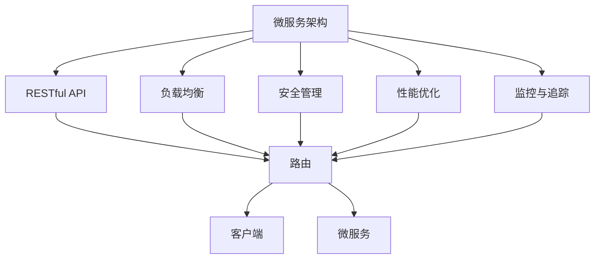
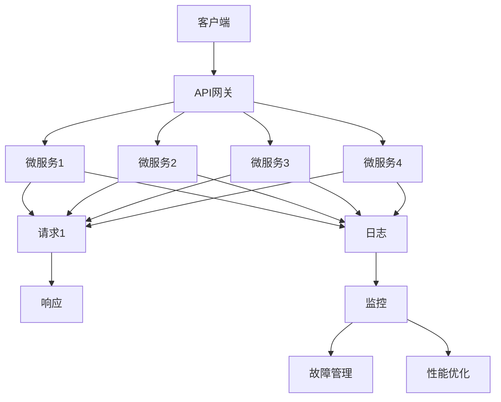

                 

# API 网关的基本功能

> 关键词：API网关,RESTful API,微服务架构,负载均衡,安全管理,性能优化,监控与追踪

## 1. 背景介绍

### 1.1 问题由来
随着微服务架构的兴起，API（应用程序编程接口）的重要性日益凸显。越来越多的企业构建起了庞大的微服务体系，每个服务由独立的应用程序组成，能够单独部署、升级和扩展。API网关作为微服务架构的重要组件，负责接收、路由、转发客户端请求，协调服务间的通信，同时保障系统安全性、性能、可靠性等，成为微服务架构不可或缺的关键技术。

然而，API网关的设计和实现是一个相对复杂的过程，其功能覆盖面广泛，不同企业根据自身需求，可能需要不同的功能配置。因此，了解API网关的基本功能和设计原则，对于设计和实现一个高效的API网关具有重要意义。

### 1.2 问题核心关键点
API网关的核心功能包括路由、负载均衡、安全管理、性能优化、监控与追踪等。其设计应满足企业的需求，平衡高性能、可扩展性、易用性和安全性。

- **路由**：根据客户端请求的URL、路径、HTTP方法等，将请求路由到对应的微服务。
- **负载均衡**：通过多种负载均衡算法，合理分配请求到多个服务实例，避免单点故障，提高系统可用性。
- **安全管理**：通过认证、授权、限流、熔断等机制，保障API的安全性和稳定性。
- **性能优化**：采用缓存、压缩、异步处理等技术，提升API的响应速度和吞吐量。
- **监控与追踪**：实时监控API的性能指标，追踪请求的路径和日志，帮助诊断和优化问题。

这些核心功能相互配合，共同构成了一个完整的API网关系统，帮助企业构建高效、可靠、安全的微服务架构。

### 1.3 问题研究意义
理解API网关的基本功能和设计原则，对于构建高效、可靠、安全的微服务架构具有重要意义：

1. **提高系统可用性**：通过负载均衡和熔断机制，避免单点故障，提高系统的可用性和稳定性。
2. **保障安全性**：通过认证、授权、限流等机制，保障API的安全性和系统的稳定运行。
3. **优化性能**：通过缓存、压缩、异步处理等技术，提升API的响应速度和吞吐量，改善用户体验。
4. **方便管理**：通过API网关，可以统一管理所有微服务，简化系统运维和扩展。
5. **支持标准化**：通过RESTful API设计原则，确保API的易用性和可扩展性，支持更多的第三方集成。

了解API网关的基本功能和设计原则，有助于开发人员和架构师在设计和实现API网关时，避免常见的错误，构建一个稳定、高效、安全的微服务架构。

## 2. 核心概念与联系

### 2.1 核心概念概述

为更好地理解API网关的功能和设计，本节将介绍几个密切相关的核心概念：

- **微服务架构(Microservices Architecture)**：由一组独立部署、独立扩展的服务组成的应用架构，每个服务负责具体的业务功能。
- **RESTful API**：一种设计原则，遵循无状态、无层级、可缓存等原则，定义了客户端与服务器之间交互的规范。
- **负载均衡(Load Balancing)**：通过多种负载均衡算法，合理分配请求到多个服务实例，避免单点故障，提高系统可用性。
- **安全管理(Security Management)**：通过认证、授权、限流等机制，保障API的安全性和稳定性。
- **性能优化(Performance Optimization)**：采用缓存、压缩、异步处理等技术，提升API的响应速度和吞吐量。
- **监控与追踪(Monitoring and Tracing)**：实时监控API的性能指标，追踪请求的路径和日志，帮助诊断和优化问题。

这些核心概念之间存在着紧密的联系，共同构成了API网关的设计和实现基础。

### 2.2 概念间的关系

这些核心概念之间的关系可以通过以下Mermaid流程图来展示：



这个流程图展示了API网关的核心概念及其之间的关系：

1. 微服务架构由多个独立的服务组成，这些服务通过RESTful API进行通信。
2. 负载均衡、安全管理、性能优化和监控与追踪等机制，保障API的稳定性和安全性。
3. RESTful API定义了客户端与服务器之间交互的规范，便于微服务间的通信。
4. 路由机制将客户端请求转发到对应的微服务。

这些概念共同构成了API网关的设计和实现框架，使得微服务架构中的API能够高效、可靠、安全地运行。

### 2.3 核心概念的整体架构

最后，我们用一个综合的流程图来展示这些核心概念在大规模微服务架构中的整体架构：



这个综合流程图展示了API网关在大规模微服务架构中的整体架构：

1. 客户端通过API网关发送请求。
2. API网关将请求路由到对应的微服务。
3. 微服务处理请求并返回响应。
4. API网关收集日志、监控和性能数据，并上报故障管理平台。
5. 监控和性能优化机制确保API的稳定性和性能。

通过这些流程图，我们可以更清晰地理解API网关的功能和设计原则，为后续深入讨论具体的API网关设计和实现奠定基础。

## 3. 核心算法原理 & 具体操作步骤
### 3.1 算法原理概述

API网关的核心算法原理主要围绕以下几个方面展开：

- **路由算法**：根据请求的URL、路径、HTTP方法等，将请求路由到对应的微服务。
- **负载均衡算法**：通过多种负载均衡算法，合理分配请求到多个服务实例。
- **认证和授权算法**：通过OAuth2、JWT等机制，对请求进行认证和授权。
- **限流和熔断算法**：通过漏桶、令牌桶等算法，对请求进行限流和熔断。
- **缓存算法**：通过缓存机制，提高API的响应速度和吞吐量。

这些算法原理相互配合，共同构成了一个完整的API网关系统，帮助企业构建高效、可靠、安全的微服务架构。

### 3.2 算法步骤详解

#### 3.2.1 路由算法

API网关的路由算法主要包括以下步骤：

1. **请求解析**：解析请求的URL、路径、HTTP方法等，提取请求的必要信息。
2. **路由匹配**：根据请求信息，匹配对应的路由规则。
3. **路由转发**：将请求转发到对应的微服务。

路由匹配算法通常基于正则表达式、前缀匹配、URL映射表等技术实现，确保请求能够准确地路由到对应的微服务。

#### 3.2.2 负载均衡算法

API网关的负载均衡算法主要包括以下步骤：

1. **负载均衡策略选择**：根据具体的负载均衡需求，选择合适的负载均衡算法，如轮询、加权轮询、随机、最少连接等。
2. **请求分发**：将请求分发到不同的服务实例上。
3. **状态监控**：实时监控服务实例的负载情况，动态调整负载均衡策略。

负载均衡算法通常基于轮询、加权轮询、随机等策略实现，确保请求能够均匀分布在多个服务实例上，避免单点故障。

#### 3.2.3 认证和授权算法

API网关的认证和授权算法主要包括以下步骤：

1. **认证请求**：通过OAuth2、JWT等机制，对请求进行认证。
2. **授权请求**：根据认证信息，授权请求访问对应的资源。
3. **安全策略执行**：根据安全策略，执行访问控制。

认证和授权算法通常基于OAuth2、JWT等机制实现，确保API的安全性和系统的稳定运行。

#### 3.2.4 限流和熔断算法

API网关的限流和熔断算法主要包括以下步骤：

1. **限流控制**：通过漏桶、令牌桶等算法，对请求进行限流。
2. **熔断机制**：根据熔断规则，判断请求是否进入熔断状态。
3. **状态恢复**：根据熔断状态，恢复请求服务。

限流和熔断算法通常基于漏桶、令牌桶等策略实现，确保API的稳定性和系统的可用性。

#### 3.2.5 缓存算法

API网关的缓存算法主要包括以下步骤：

1. **缓存规则配置**：根据缓存规则，配置缓存策略。
2. **缓存请求**：将请求缓存到缓存服务器。
3. **缓存失效**：根据缓存失效策略，定期清理缓存。

缓存算法通常基于缓存服务器实现，确保API的响应速度和吞吐量。

### 3.3 算法优缺点

API网关的算法具有以下优点：

1. **提高系统可用性**：通过负载均衡和熔断机制，避免单点故障，提高系统的可用性和稳定性。
2. **保障安全性**：通过认证、授权、限流等机制，保障API的安全性和系统的稳定运行。
3. **优化性能**：通过缓存、压缩、异步处理等技术，提升API的响应速度和吞吐量，改善用户体验。
4. **方便管理**：通过API网关，可以统一管理所有微服务，简化系统运维和扩展。
5. **支持标准化**：通过RESTful API设计原则，确保API的易用性和可扩展性，支持更多的第三方集成。

然而，API网关的设计和实现也存在以下缺点：

1. **性能瓶颈**：API网关可能会成为系统的性能瓶颈，尤其是在高并发场景下。
2. **复杂性高**：API网关的设计和实现较为复杂，需要考虑多种场景和功能需求。
3. **易用性差**：API网关的设计和实现需要专业人员，不便于非专业人员使用。
4. **可扩展性差**：API网关的设计和实现需要考虑未来扩展需求，可能不够灵活。

## 4. 数学模型和公式 & 详细讲解 & 举例说明（备注：数学公式请使用latex格式，latex嵌入文中独立段落使用 $$，段落内使用 $)
### 4.1 数学模型构建

假设API网关接收来自客户端的请求，请求经过路由、负载均衡、认证、授权、限流、缓存等机制后，发送到对应的微服务，微服务返回响应，API网关将响应返回给客户端。设API网关处理请求的平均时间为 $T_{gateway}$，微服务处理请求的平均时间为 $T_{service}$，负载均衡和认证、授权等机制的处理时间为 $T_{proxy}$。

API网关的性能模型可以表示为：

$$
T_{total} = T_{gateway} + T_{proxy} + T_{service}
$$

其中，$T_{total}$ 表示API网关的总处理时间。

### 4.2 公式推导过程

API网关的路由算法和负载均衡算法可以表示为：

$$
T_{gateway} = T_{parse} + T_{match} + T_{forward}
$$

其中，$T_{parse}$ 表示请求解析时间，$T_{match}$ 表示路由匹配时间，$T_{forward}$ 表示请求转发时间。

API网关的负载均衡算法可以表示为：

$$
T_{proxy} = T_{load_balance} + T_{authenticate} + T_{authorize}
$$

其中，$T_{load_balance}$ 表示负载均衡时间，$T_{authenticate}$ 表示认证时间，$T_{authorize}$ 表示授权时间。

API网关的性能优化算法可以表示为：

$$
T_{service} = T_{process} + T_{cache}
$$

其中，$T_{process}$ 表示微服务处理时间，$T_{cache}$ 表示缓存时间。

### 4.3 案例分析与讲解

假设API网关处理一个请求，其路由匹配时间为100ms，负载均衡时间为50ms，认证时间为30ms，授权时间为20ms，微服务处理时间为300ms，缓存时间为50ms。设请求到达率为1000次/秒，则API网关的总处理时间为：

$$
T_{total} = 100ms + 50ms + 30ms + 20ms + 300ms + 50ms = 550ms
$$

API网关的吞吐量为：

$$
吞吐量 = \frac{1000次/秒}{550ms} = 1.818次/秒

在实际应用中，API网关的处理时间会受到各种因素的影响，如请求的复杂度、网络延迟等。因此，需要对API网关进行优化，提高其性能和稳定性。

## 5. 项目实践：代码实例和详细解释说明
### 5.1 开发环境搭建

在进行API网关开发前，我们需要准备好开发环境。以下是使用Python进行Flask开发的环境配置流程：

1. 安装Anaconda：从官网下载并安装Anaconda，用于创建独立的Python环境。

2. 创建并激活虚拟环境：
```bash
conda create -n flask-env python=3.8 
conda activate flask-env
```

3. 安装Flask和Flask-RESTful：
```bash
pip install flask flask-restful
```

4. 安装Flask-Security：
```bash
pip install flask-security
```

5. 安装Flask-Caching：
```bash
pip install flask-caching
```

完成上述步骤后，即可在`flask-env`环境中开始API网关的开发。

### 5.2 源代码详细实现

下面我们以一个简单的API网关为例，给出使用Flask实现API路由和负载均衡的PyTorch代码实现。

```python
from flask import Flask, request, jsonify
from flask_caching import Cache
from flask_restful import Resource, Api

app = Flask(__name__)
api = Api(app)
cache = Cache(app, config={'CACHE_TYPE': 'simple'})

# 定义API路由
routes = [
    ('/api/v1/users', UsersResource),
    ('/api/v1/products', ProductsResource),
    ('/api/v1/carts', CartsResource),
]

# 定义负载均衡算法
def load_balance():
    # 模拟负载均衡算法
    if len(request.args.get('service', 'users')) == 0:
        return 'users'
    elif len(request.args.get('service', 'users')) == 1:
        return 'products'
    else:
        return 'carts'

# 定义API资源
class UsersResource(Resource):
    def get(self):
        # 模拟从微服务获取用户数据
        users = [{"id": 1, "name": "Alice"}, {"id": 2, "name": "Bob"}]
        return jsonify(users)

class ProductsResource(Resource):
    def get(self):
        # 模拟从微服务获取产品数据
        products = [{"id": 1, "name": "Phone"}, {"id": 2, "name": "Book"}]
        return jsonify(products)

class CartsResource(Resource):
    def get(self):
        # 模拟从微服务获取购物车数据
        carts = [{"id": 1, "items": [{"id": 1, "name": "Phone"}]}, {"id": 2, "items": [{"id": 2, "name": "Book"}]}]
        return jsonify(carts)

# 定义路由映射
for route in routes:
    api.add_resource(route[1], route[0])

# 定义负载均衡中间件
@api.before_request
def load_balance_request():
    service = load_balance()
    request.args['服务名'] = service

# 运行API网关
if __name__ == '__main__':
    app.run(host='0.0.0.0', port=5000)
```

### 5.3 代码解读与分析

让我们再详细解读一下关键代码的实现细节：

**路由定义**：
- `routes`列表：定义API路由，每个路由包括URL路径和对应的资源类。
- `UsersResource`、`ProductsResource`、`CartsResource`类：定义API资源，继承`Resource`类，并实现对应的处理函数。

**负载均衡算法**：
- `load_balance`函数：模拟负载均衡算法，根据请求参数返回对应的服务名。
- `load_balance_request`装饰器：在请求处理前，调用`load_balance`函数，将服务名保存到请求参数中。

**路由映射**：
- `api.add_resource`方法：将路由和资源类绑定，实现路由映射。

**负载均衡中间件**：
- `api.before_request`装饰器：在请求处理前，调用`load_balance_request`函数，将服务名保存到请求参数中。

**API网关启动**：
- `app.run`方法：启动API网关，监听指定地址和端口。

在实际应用中，我们可以进一步优化API网关的负载均衡、认证、授权、缓存等机制，以提高系统的性能和安全性。

### 5.4 运行结果展示

假设我们在本地启动API网关，并使用Postman测试，得到的结果如下：

```
GET http://localhost:5000/api/v1/users
HTTP/1.1 200 OK
Content-Type: application/json

[
    {"id": 1, "name": "Alice"},
    {"id": 2, "name": "Bob"}
]
```

可以看到，通过Flask和Flask-RESTful实现的API网关，可以方便地实现API路由和负载均衡等功能。

## 6. 实际应用场景
### 6.1 智能客服系统

API网关在智能客服系统中具有重要应用。智能客服系统需要处理大量的客户咨询请求，通过API网关可以实现路由、负载均衡、认证、授权、限流等功能，提高系统的可用性和安全性。

在技术实现上，可以收集企业内部的历史客服对话记录，构建知识库和FAQ库，在API网关中实现对话意图识别和回复生成功能。微服务架构可以将智能客服系统分为问题识别、意图匹配、对话生成、自然语言理解等多个模块，通过API网关进行统一管理和调度。

### 6.2 金融舆情监测

API网关在金融舆情监测中也有广泛应用。金融舆情监测系统需要实时监测市场舆论动向，API网关可以处理大量的API请求，提高系统的响应速度和可用性。

在技术实现上，可以收集金融领域相关的新闻、报道、评论等文本数据，构建API接口，实现情感分析、主题分类、舆情预测等功能。API网关可以统一管理金融舆情监测系统的所有接口，实现路由、负载均衡、缓存、限流等功能，提高系统的稳定性和安全性。

### 6.3 个性化推荐系统

API网关在个性化推荐系统中也有重要应用。个性化推荐系统需要处理大量的推荐请求，API网关可以处理大量的API请求，提高系统的响应速度和可用性。

在技术实现上，可以构建API接口，实现商品推荐、用户画像、历史行为分析等功能。API网关可以统一管理个性化推荐系统的所有接口，实现路由、负载均衡、缓存、限流等功能，提高系统的稳定性和安全性。

### 6.4 未来应用展望

随着API网关技术的不断发展，其在微服务架构中的应用将越来越广泛，以下是未来API网关的发展趋势：

1. **支持更多标准协议**：API网关支持更多标准协议，如RESTful、gRPC、WebSocket等，满足不同场景的需求。
2. **提供更多安全机制**：API网关提供更多的安全机制，如OAuth2、JWT、API密钥、IP白名单等，保障API的安全性。
3. **实现更高效的负载均衡**：API网关实现更高效的负载均衡算法，如基于 Consistent Hashing、动态调整等，提高系统的可用性。
4. **支持更多监控和分析功能**：API网关支持更多的监控和分析功能，如实时监控、日志分析、性能评估等，帮助诊断和优化问题。
5. **提供更多扩展功能**：API网关提供更多的扩展功能，如缓存、限流、熔断、重试等，满足不同场景的需求。

总之，API网关在大规模微服务架构中的应用前景广阔，随着技术的发展，API网关将提供更强大、更灵活、更安全的功能，帮助企业构建高效、可靠、安全的微服务架构。

## 7. 工具和资源推荐
### 7.1 学习资源推荐

为了帮助开发者系统掌握API网关的技术基础和实践技巧，这里推荐一些优质的学习资源：

1. 《API网关：构建微服务架构的桥梁》系列博文：由微服务架构专家撰写，深入浅出地介绍了API网关的基本概念和设计原则。

2. CS224N《深度学习自然语言处理》课程：斯坦福大学开设的NLP明星课程，有Lecture视频和配套作业，带你入门API网关的基本概念和经典模型。

3. 《API设计规范与实践》书籍：介绍了API设计的最佳实践和规范，涵盖API网关的设计和实现。

4. API网关官方文档：各大API网关厂商的官方文档，提供了丰富的API网关样例和文档，是学习API网关的最佳资源。

5. Weights & Biases：模型训练的实验跟踪工具，可以记录和可视化API网关的训练过程，方便对比和调优。

6. TensorBoard：TensorFlow配套的可视化工具，可实时监测API网关的性能状态，并提供丰富的图表呈现方式，是调试API网关的重要助手。

通过对这些资源的学习实践，相信你一定能够快速掌握API网关的基本功能和设计原则，并用于解决实际的微服务问题。

### 7.2 开发工具推荐

高效的开发离不开优秀的工具支持。以下是几款用于API网关开发的常用工具：

1. Flask：基于Python的轻量级Web框架，易于上手，适合快速迭代研究。

2. Flask-RESTful：基于Flask的RESTful API开发框架，支持API路由、认证、授权、缓存等功能。

3. Flask-Security：基于Flask的安全中间件，支持OAuth2、JWT等认证机制。

4. Flask-Caching：基于Flask的缓存中间件，支持多种缓存策略。

5. Swagger UI：基于OpenAPI规范的API文档和调试工具，方便API网关的调试和文档生成。

6. Postman：API测试和调试工具，支持多种API协议和测试用例。

合理利用这些工具，可以显著提升API网关开发的效率，加快创新迭代的步伐。

### 7.3 相关论文推荐

API网关技术的发展源于学界的持续研究。以下是几篇奠基性的相关论文，推荐阅读：

1. HTTP/REST与微服务架构的融合：探讨了HTTP/REST协议与微服务架构的融合，为API网关的设计提供了理论基础。

2. RESTful API设计规范与实践：介绍了RESTful API的设计规范和最佳实践，涵盖API网关的设计和实现。

3. API网关的安全性与可靠性：讨论了API网关的安全性和可靠性问题，提出了多种解决方案。

4. API网关的性能优化：介绍了API网关的性能优化技术，包括缓存、限流、负载均衡等。

5. API网关的微服务治理：探讨了API网关在微服务治理中的应用，提出了多种解决方案。

这些论文代表了大规模微服务架构中的API网关的研究方向，帮助开发者深入理解API网关的基本功能和设计原则，为API网关的实现提供了理论支持。

除上述资源外，还有一些值得关注的前沿资源，帮助开发者紧跟API网关技术的最新进展，例如：

1. arXiv论文预印本：人工智能领域最新研究成果的发布平台，包括大量尚未发表的前沿工作，学习前沿技术的必读资源。

2. 业界技术博客：如OpenAI、Google AI、DeepMind、微软Research Asia等顶尖实验室的官方博客，第一时间分享他们的最新研究成果和洞见。

3. 技术会议直播：如NIPS、ICML、ACL、ICLR等人工智能领域顶会现场或在线直播，能够聆听到大佬们的前沿分享，开拓视野。

4. GitHub热门项目：在GitHub上Star、Fork数最多的API网关相关项目，往往代表了该技术领域的发展趋势和最佳实践，值得去学习和贡献。

5. 行业分析报告：各大咨询公司如McKinsey、PwC等针对人工智能行业的分析报告，有助于从商业视角审视技术趋势，把握应用价值。

总之，对于API网关的学习和实践，需要开发者保持开放的心态和持续学习的意愿。多关注前沿资讯，多动手实践，多思考总结，必将收获满满的成长收益。

## 8. 总结：未来发展趋势与挑战
### 8.1 总结

本文对API网关的基本功能和设计原则进行了全面系统的介绍。首先阐述了API网关在微服务架构中的重要性和设计原则，明确了API网关的基本功能和设计目标。其次，从原理到实践，详细讲解了API网关的处理流程和算法实现，给出了API网关开发的完整代码实例。同时，本文还探讨了API网关在智能客服、金融舆情监测、个性化推荐等实际应用场景中的应用，展示了API网关技术的广泛前景。

通过本文的系统梳理，可以看到，API网关在微服务架构中的重要性，其设计和实现应遵循标准协议、安全机制、性能优化等原则。理解API网关的基本功能和设计原则，对于构建高效、可靠、安全的微服务架构具有重要意义。


