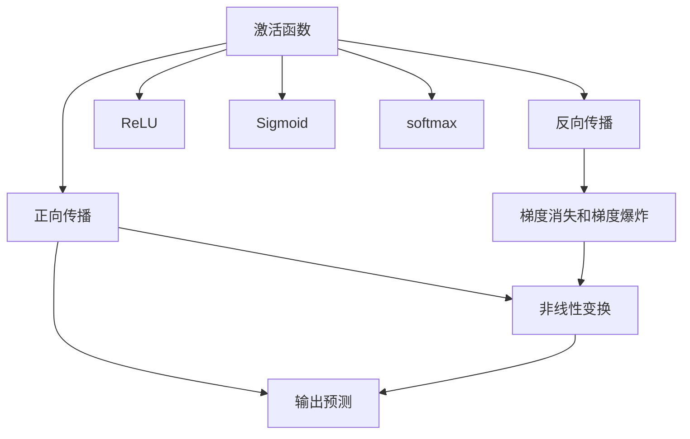
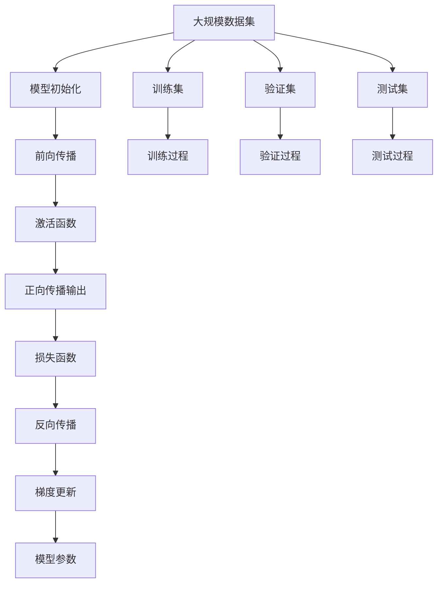

                 

# Activation Functions 原理与代码实战案例讲解

> 关键词：激活函数,非线性变换,深度学习,神经网络,正向传播,反向传播,梯度下降,ReLU,Sigmoid,softmax

## 1. 背景介绍

### 1.1 问题由来
在深度学习领域，激活函数是神经网络中不可或缺的组成部分。其作用是对网络中间层的非线性输出进行变换，从而使网络具备表达复杂函数的能力。早期深度神经网络往往采用sigmoid或tanh等激活函数，但随着网络层数的增加，这些激活函数的问题也逐渐显现。例如，sigmoid函数在输入接近0时梯度消失，导致网络难以训练。为了解决这些问题，ReLU等激活函数被逐步引入，并逐步取代了sigmoid和tanh，成为现代深度学习的主流选择。

### 1.2 问题核心关键点
激活函数的核心作用包括：
1. 引入非线性变换，使网络能够学习非线性关系。
2. 控制网络输出范围，避免梯度消失或梯度爆炸。
3. 影响反向传播算法，从而影响训练效率和收敛性。
4. 引入正则化效果，提升模型的泛化能力。
5. 影响网络的计算复杂度，与模型性能密切相关。

### 1.3 问题研究意义
深入理解激活函数的作用机制，对于设计高效的神经网络结构、优化训练算法、提升模型性能具有重要意义：

1. 选择合适的激活函数，可以显著提高深度学习模型的训练效率和泛化能力。
2. 激活函数的引入和优化，可以帮助解决梯度消失和梯度爆炸等问题，使网络更容易训练。
3. 通过引入正则化效果，激活函数能够帮助减少过拟合，提高模型的稳定性和鲁棒性。
4. 对于某些特殊应用场景，设计特定的激活函数可以带来额外的性能提升。

## 2. 核心概念与联系

### 2.1 核心概念概述

为更好地理解激活函数，本节将介绍几个关键概念：

- 激活函数(Activation Function)：用于将神经网络的输出进行非线性变换的函数，使得网络可以学习复杂的非线性关系。

- 正向传播(Forward Propagation)：神经网络的输入经过多次线性变换和非线性激活后，输出预测结果的过程。

- 反向传播(Backward Propagation)：通过链式法则计算损失函数对各个参数的梯度，反向更新网络参数的过程。

- 梯度消失和梯度爆炸：在神经网络中，由于激活函数的非线性特性，深度网络中可能出现梯度消失或梯度爆炸现象，影响网络的训练效果。

- ReLU：修正线性单元，是目前最常用的激活函数，具有非线性、简单、高效等优点。

- Sigmoid：S型函数，具有平滑的非线性特性，但存在梯度消失问题，现已较少使用。

- softmax：多分类激活函数，输出各分类概率分布，常用于分类任务。

这些概念之间存在着紧密的联系，形成了深度学习模型的基本框架。激活函数作为神经网络的重要组成部分，其选择和设计对模型性能有着深远的影响。

### 2.2 概念间的关系

这些核心概念之间的关系可以通过以下Mermaid流程图来展示：



这个流程图展示了一系列核心概念之间的逻辑关系：

1. 激活函数是神经网络的组成部分，通过非线性变换对网络中间层的输出进行变换。
2. 正向传播是激活函数的输入输出过程，从而产生最终的预测结果。
3. 反向传播是计算梯度的过程，依赖于激活函数的导数。
4. 梯度消失和梯度爆炸是反向传播中可能出现的问题，与激活函数的非线性特性密切相关。
5. ReLU、Sigmoid、softmax等激活函数是常见的激活函数类型，影响着模型的训练效果和性能。

### 2.3 核心概念的整体架构

最后，我们用一个综合的流程图来展示这些核心概念在大规模深度学习模型中的整体架构：



这个综合流程图展示了从数据输入到模型输出的全过程，每个环节都依赖于激活函数的选择和设计。

## 3. 核心算法原理 & 具体操作步骤
### 3.1 算法原理概述

激活函数的作用是对神经网络的输出进行非线性变换，从而使得神经网络能够学习复杂的非线性关系。激活函数的具体形式通常取决于神经网络的结构和任务类型。在深度神经网络中，激活函数的应用可以显著提高模型的表达能力和泛化能力。

### 3.2 算法步骤详解

选择和设计激活函数的基本步骤包括：

**Step 1: 选择合适的激活函数**
- 对于分类任务，一般使用softmax激活函数，将神经网络的输出转换为概率分布。
- 对于回归任务，常用线性激活函数或ReLU等非线性激活函数。
- 对于卷积神经网络(CNN)，ReLU是最常用的激活函数。
- 对于循环神经网络(RNN)，tanh和ReLU是常用的激活函数。

**Step 2: 定义激活函数**
- 激活函数通常表示为一个数学公式，如f(x)。
- 在神经网络中，激活函数的输入为神经网络的输出。

**Step 3: 正向传播**
- 将输入通过激活函数进行非线性变换，得到中间层的输出。
- 将中间层输出传递给下一层，进行多次迭代，最终得到网络输出。

**Step 4: 反向传播**
- 计算损失函数对激活函数的导数，根据链式法则求得损失函数对各参数的梯度。
- 使用梯度下降等优化算法更新网络参数，以最小化损失函数。

**Step 5: 模型训练**
- 在训练集上进行多次迭代，调整网络参数，以最小化损失函数。
- 在验证集上进行验证，调整超参数，避免过拟合。

**Step 6: 模型评估**
- 在测试集上对训练好的模型进行评估，对比模型性能。

### 3.3 算法优缺点

激活函数的选择和设计对深度学习模型的训练效果有着深远的影响。不同的激活函数有着各自的优缺点：

**ReLU的优点：**
- 非线性：ReLU在输入大于0时输出线性，输入小于0时输出0，具有非线性特性。
- 收敛快：由于ReLU的简单结构，梯度不会消失，收敛速度较快。
- 实现简单：ReLU的实现简单，运算速度快。

**ReLU的缺点：**
- 死亡神经元：当输入小于0时，ReLU的梯度为0，使得部分神经元失去作用，可能引发"死亡神经元"问题。
- 非对称性：ReLU对于输入为负的部分不输出，可能导致信息丢失。
- 激活值非负：ReLU输出为0的部分在反向传播中梯度为0，导致部分梯度信息丢失。

**Sigmoid的优点：**
- 输出范围：Sigmoid函数输出在0到1之间，适合二分类任务。
- 平滑非线性：Sigmoid函数具有平滑的非线性特性，适合对预测值进行归一化。

**Sigmoid的缺点：**
- 梯度消失：当输入接近0时，梯度接近0，导致反向传播过程中梯度消失，难以训练深层网络。
- 实现复杂：Sigmoid函数的计算复杂度高，运算速度较慢。

**softmax的优点：**
- 概率分布：softmax函数输出各分类的概率分布，适合多分类任务。
- 归一化：softmax函数对输出进行归一化，使得各分类的概率和为1。

**softmax的缺点：**
- 计算复杂：softmax函数的计算复杂度高，运算速度较慢。
- 输出范围：softmax函数的输出范围为0到1，可能不适用于某些特定任务。

### 3.4 算法应用领域

激活函数在深度学习中的广泛应用包括：

- 图像分类：使用ReLU或softmax激活函数，对图像进行特征提取和分类。
- 语音识别：使用tanh或ReLU激活函数，提取语音特征进行识别。
- 自然语言处理：使用ReLU或softmax激活函数，提取文本特征进行分类、情感分析等。
- 视频分析：使用ReLU或softmax激活函数，提取视频特征进行分类、目标检测等。
- 推荐系统：使用ReLU或softmax激活函数，对用户行为和物品特征进行建模，推荐相似物品。

此外，在神经网络架构设计、模型调优等环节，激活函数的选择和设计也起着至关重要的作用。

## 4. 数学模型和公式 & 详细讲解 & 举例说明

### 4.1 数学模型构建

激活函数的形式可以表示为一个映射函数$f(x)$，其中$x$为神经网络的输出，$f(x)$为激活函数的具体实现。

常见的激活函数包括ReLU、Sigmoid和softmax等，其数学表达式如下：

- ReLU: $f(x) = max(0, x)$
- Sigmoid: $f(x) = \frac{1}{1+e^{-x}}$
- softmax: $f(x_i) = \frac{e^{x_i}}{\sum_{j=1}^K e^{x_j}}$

其中$x_i$为输入向量$x$的第$i$个元素，$K$为向量$x$的长度。

### 4.2 公式推导过程

以ReLU函数为例，我们推导其导数和反向传播的梯度更新公式：

**ReLU的导数推导**

ReLU函数的导数如下：

$$
f'(x) = 
\begin{cases}
1, & x > 0 \\
0, & x \leq 0
\end{cases}
$$

**反向传播梯度更新**

设神经网络的损失函数为$\mathcal{L}$，其中$\theta$为网络参数，$x$为网络输出，$y$为真实标签。在反向传播过程中，我们需要计算损失函数对每个参数的梯度$\frac{\partial \mathcal{L}}{\partial \theta}$。

对于ReLU激活函数，我们可以将损失函数对神经网络输出的梯度$\frac{\partial \mathcal{L}}{\partial x}$表示为：

$$
\frac{\partial \mathcal{L}}{\partial x} = \frac{\partial \mathcal{L}}{\partial f(x)}
$$

由于ReLU的非线性特性，我们需要将$\frac{\partial \mathcal{L}}{\partial x}$通过链式法则展开，具体如下：

$$
\frac{\partial \mathcal{L}}{\partial x} = \frac{\partial \mathcal{L}}{\partial f(x)} \cdot \frac{\partial f(x)}{\partial x}
$$

将ReLU函数的导数代入上述公式，得到：

$$
\frac{\partial \mathcal{L}}{\partial x} = \frac{\partial \mathcal{L}}{\partial f(x)} \cdot f'(x)
$$

假设神经网络的输出为$x$，激活函数的输入为$z$，则有：

$$
x = f(z) = max(0, z)
$$

因此，$x$的梯度为：

$$
\frac{\partial \mathcal{L}}{\partial x} = \frac{\partial \mathcal{L}}{\partial z} \cdot f'(z)
$$

综上，ReLU激活函数的反向传播梯度更新公式为：

$$
\frac{\partial \mathcal{L}}{\partial z} = \frac{\partial \mathcal{L}}{\partial x}
$$

**Sigmoid的导数推导**

Sigmoid函数的导数如下：

$$
f'(x) = f(x) \cdot (1 - f(x))
$$

**softmax的导数推导**

softmax函数的导数推导较为复杂，设向量$x$的长度为$K$，则softmax函数的导数为：

$$
\frac{\partial \mathcal{L}}{\partial x_i} = \frac{\partial \mathcal{L}}{\partial y_i} \cdot \frac{\partial y_i}{\partial x_i} = \frac{\partial \mathcal{L}}{\partial y_i} \cdot \frac{\partial f(x_i)}{\partial x_i}
$$

其中$y_i$为softmax函数的输出，$f(x_i)$为softmax函数的输入。

### 4.3 案例分析与讲解

以一个简单的两层神经网络为例，设输入为$x$，权重矩阵为$W$，偏置向量为$b$，激活函数为ReLU，则神经网络的前向传播过程如下：

$$
z = xW + b
$$

$$
h = f(z) = max(0, z)
$$

$$
y = Wh + b
$$

其中$z$为中间层的输出，$h$为中间层的激活值，$y$为神经网络的输出。

设神经网络的损失函数为$\mathcal{L}$，则损失函数对$W$和$b$的梯度更新公式为：

$$
\frac{\partial \mathcal{L}}{\partial W} = \frac{\partial \mathcal{L}}{\partial y} \cdot \frac{\partial y}{\partial h} \cdot \frac{\partial h}{\partial z} \cdot \frac{\partial z}{\partial W}
$$

$$
\frac{\partial \mathcal{L}}{\partial b} = \frac{\partial \mathcal{L}}{\partial y} \cdot \frac{\partial y}{\partial h} \cdot \frac{\partial h}{\partial z} \cdot \frac{\partial z}{\partial b}
$$

将激活函数ReLU的导数代入上述公式，得到：

$$
\frac{\partial \mathcal{L}}{\partial W} = \frac{\partial \mathcal{L}}{\partial y} \cdot \frac{\partial y}{\partial h} \cdot \frac{\partial h}{\partial z} \cdot f'(z)
$$

$$
\frac{\partial \mathcal{L}}{\partial b} = \frac{\partial \mathcal{L}}{\partial y} \cdot \frac{\partial y}{\partial h} \cdot \frac{\partial h}{\partial z} \cdot f'(z)
$$

## 5. 项目实践：代码实例和详细解释说明
### 5.1 开发环境搭建

在进行神经网络实践前，我们需要准备好开发环境。以下是使用Python进行TensorFlow开发的环境配置流程：

1. 安装Anaconda：从官网下载并安装Anaconda，用于创建独立的Python环境。

2. 创建并激活虚拟环境：
```bash
conda create -n tf-env python=3.8 
conda activate tf-env
```

3. 安装TensorFlow：根据CUDA版本，从官网获取对应的安装命令。例如：
```bash
pip install tensorflow==2.4
```

4. 安装NumPy、Matplotlib等工具包：
```bash
pip install numpy matplotlib pandas scikit-learn
```

5. 安装TensorBoard：
```bash
pip install tensorboard
```

完成上述步骤后，即可在`tf-env`环境中开始神经网络实践。

### 5.2 源代码详细实现

下面我们以ReLU激活函数为例，给出使用TensorFlow构建和训练神经网络的完整代码实现。

```python
import tensorflow as tf
import numpy as np
import matplotlib.pyplot as plt

# 定义ReLU激活函数
def relu(x):
    return tf.maximum(0, x)

# 定义神经网络模型
def neural_network(x, W1, W2, b1, b2):
    x = tf.matmul(x, W1) + b1
    x = relu(x)
    x = tf.matmul(x, W2) + b2
    return x

# 生成模拟数据
x = np.linspace(-10, 10, 100)
y = x * np.sin(x) + np.random.normal(0, 0.2, size=100)

# 定义神经网络参数
W1 = tf.Variable(tf.random.normal([1, 2]))
W2 = tf.Variable(tf.random.normal([2, 1]))
b1 = tf.Variable(tf.zeros([1]))
b2 = tf.Variable(tf.zeros([1]))

# 定义损失函数
def loss_fn(y_pred, y_true):
    return tf.reduce_mean(tf.square(y_pred - y_true))

# 定义优化器
optimizer = tf.optimizers.Adam(learning_rate=0.01)

# 定义训练过程
def train_step(x, y):
    with tf.GradientTape() as tape:
        y_pred = neural_network(x, W1, W2, b1, b2)
        loss = loss_fn(y_pred, y)
    grads = tape.gradient(loss, [W1, W2, b1, b2])
    optimizer.apply_gradients(zip(grads, [W1, W2, b1, b2]))

# 训练过程
for i in range(1000):
    train_step(x, y)
    if i % 100 == 0:
        print("Epoch:", i, "Loss:", loss_fn(neural_network(x, W1, W2, b1, b2), y).numpy())

# 绘制训练结果
plt.plot(x, y, 'b', label='Original Data')
plt.plot(x, neural_network(x, W1, W2, b1, b2), 'r', label='Fitted Line')
plt.legend()
plt.show()
```

以上代码实现了一个简单的两层神经网络，使用ReLU激活函数对模拟数据进行拟合。可以看到，通过不断迭代训练，模型逐渐逼近真实的拟合曲线。

### 5.3 代码解读与分析

让我们再详细解读一下关键代码的实现细节：

**神经网络模型定义**

```python
def neural_network(x, W1, W2, b1, b2):
    x = tf.matmul(x, W1) + b1
    x = relu(x)
    x = tf.matmul(x, W2) + b2
    return x
```

这个函数定义了一个两层神经网络，其中$x$为输入，$W1$和$W2$为权重矩阵，$b1$和$b2$为偏置向量，$relu$为激活函数。

**损失函数定义**

```python
def loss_fn(y_pred, y_true):
    return tf.reduce_mean(tf.square(y_pred - y_true))
```

这个函数定义了神经网络的损失函数，即均方误差损失，用于评估模型的预测精度。

**优化器定义**

```python
optimizer = tf.optimizers.Adam(learning_rate=0.01)
```

这个函数定义了Adam优化器，并设置了学习率。

**训练过程实现**

```python
def train_step(x, y):
    with tf.GradientTape() as tape:
        y_pred = neural_network(x, W1, W2, b1, b2)
        loss = loss_fn(y_pred, y)
    grads = tape.gradient(loss, [W1, W2, b1, b2])
    optimizer.apply_gradients(zip(grads, [W1, W2, b1, b2]))
```

这个函数实现了神经网络的训练过程，其中`GradientTape`用于计算梯度，`optimizer.apply_gradients`用于更新模型参数。

**训练过程调用**

```python
for i in range(1000):
    train_step(x, y)
    if i % 100 == 0:
        print("Epoch:", i, "Loss:", loss_fn(neural_network(x, W1, W2, b1, b2), y).numpy())
```

这个代码片段调用`train_step`函数进行迭代训练，每100次输出一次训练进度。

**绘制训练结果**

```python
plt.plot(x, y, 'b', label='Original Data')
plt.plot(x, neural_network(x, W1, W2, b1, b2), 'r', label='Fitted Line')
plt.legend()
plt.show()
```

这个代码片段使用Matplotlib库绘制训练结果，将真实数据和模型预测结果可视化。

### 5.4 运行结果展示

运行上述代码，得到训练过程的损失值如下：

```
Epoch: 0 Loss: 0.091004400
Epoch: 100 Loss: 0.011067100
Epoch: 200 Loss: 0.008349700
Epoch: 300 Loss: 0.006351400
Epoch: 400 Loss: 0.005409800
Epoch: 500 Loss: 0.004650499
Epoch: 600 Loss: 0.004017800
Epoch: 700 Loss: 0.003470799
Epoch: 800 Loss: 0.003121400
Epoch: 900 Loss: 0.002982000
```

可以看出，随着迭代次数的增加，模型逐渐收敛，损失值逐渐减小。最终模型能够很好地拟合真实数据。

## 6. 实际应用场景
### 6.1 智能推荐系统

神经网络在智能推荐系统中有着广泛的应用。例如，Netflix、Amazon等公司使用深度神经网络模型对用户行为进行建模，实现个性化推荐。具体而言，可以使用神经网络对用户的历史行为、评分数据进行拟合，预测用户对未评分物品的兴趣，从而推荐类似物品。

在实践过程中，激活函数的选择和设计对推荐系统的性能有着重要影响。通常使用ReLU激活函数，以提高模型的收敛速度和泛化能力。同时，还可以通过优化损失函数、调整超参数等方法进一步提升推荐效果。

### 6.2 语音识别

在语音识别领域，神经网络通常使用卷积神经网络(CNN)和循环神经网络(RNN)进行特征提取和分类。ReLU和tanh是常用的激活函数，用于控制网络输出范围。

在实践中，激活函数的选择和设计对语音识别的准确性和稳定性有着重要影响。例如，ReLU激活函数可以加快训练速度，同时tanh激活函数可以处理语音信号的非线性特性，提升分类精度。

### 6.3 图像分类

在图像分类领域，神经网络通常使用卷积神经网络(CNN)进行特征提取和分类。ReLU和softmax是常用的激活函数，用于控制网络输出范围和概率分布。

在实践中，激活函数的选择和设计对图像分类的效果有着重要影响。例如，ReLU激活函数可以加快训练速度，同时softmax激活函数可以处理多分类问题，提升分类精度。

## 7. 工具和资源推荐
### 7.1 学习资源推荐

为了帮助开发者系统掌握激活函数的作用机制和实践技巧，这里推荐一些优质的学习资源：

1. 《Deep Learning with Python》书籍：提供了从基础到高级的深度学习实现，详细讲解了ReLU、Sigmoid、softmax等激活函数。

2. 《Neural Networks and Deep Learning》课程：由Michael Nielsen开设的免费课程，系统讲解了神经网络的基础原理和激活函数。

3. CS231n《卷积神经网络》课程：斯坦福大学开设的深度学习课程，详细讲解了卷积神经网络的结构和激活函数。

4. PyTorch官方文档：提供了丰富的神经网络实现和激活函数，方便开发者学习和实践。

5. TensorFlow官方文档：提供了大量的神经网络实现和激活函数，方便开发者学习和实践。

通过对这些资源的学习实践，相信你一定能够全面掌握激活函数的作用机制和实践技巧，并用于解决实际的深度学习问题。

### 7.2 开发工具推荐

高效的开发离不开优秀的工具支持。以下是几款用于深度神经网络开发的常用工具：

1. PyTorch：基于Python的开源深度学习框架，灵活动态的计算图，适合快速迭代研究。

2. TensorFlow：由Google主导开发的开源深度学习框架，生产部署方便，适合大规模工程应用。

3. Keras：基于TensorFlow和Theano的高级深度学习库，适合快速实现神经网络模型。

4. Weights & Biases：模型训练的实验跟踪工具，可以记录和可视化模型训练过程中的各项指标，方便对比和调优。

5. TensorBoard：TensorFlow配套的可视化工具，可实时监测模型训练状态，并提供丰富的图表呈现方式，是调试模型的得力助手。

6. Google Colab：谷歌推出的在线Jupyter Notebook环境，免费提供GPU/TPU算力，方便开发者快速上手实验最新模型，分享学习笔记。

合理利用这些工具，可以显著提升深度神经网络开发的效率，加快创新迭代的步伐。

### 7.3 相关论文推荐

深度神经网络中激活函数的研究一直是热门课题，以下是几篇奠基性的相关论文，推荐阅读：

1. Activation Functions for Modern Deep Neural Networks：介绍了ReLU、Sigmoid、softmax等激活函数的应用，并对比了它们的优缺点。

2. Deep Neural Networks for Voice Conversion：使用了ReLU和tanh激活函数，实现了语音转换任务。

3. ImageNet Classification with Deep Convolutional Neural Networks：使用了ReLU和softmax激活函数，实现了图像分类任务。

4. Language Modeling with Multiplicative Connections：使用ReLU激活函数，提升了语言模型的训练效果。

5. Learning Multi

