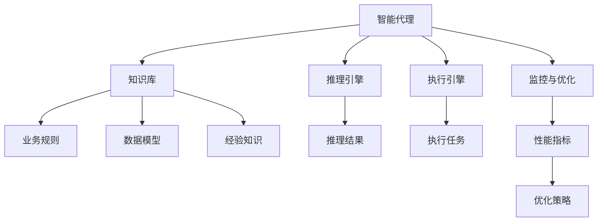
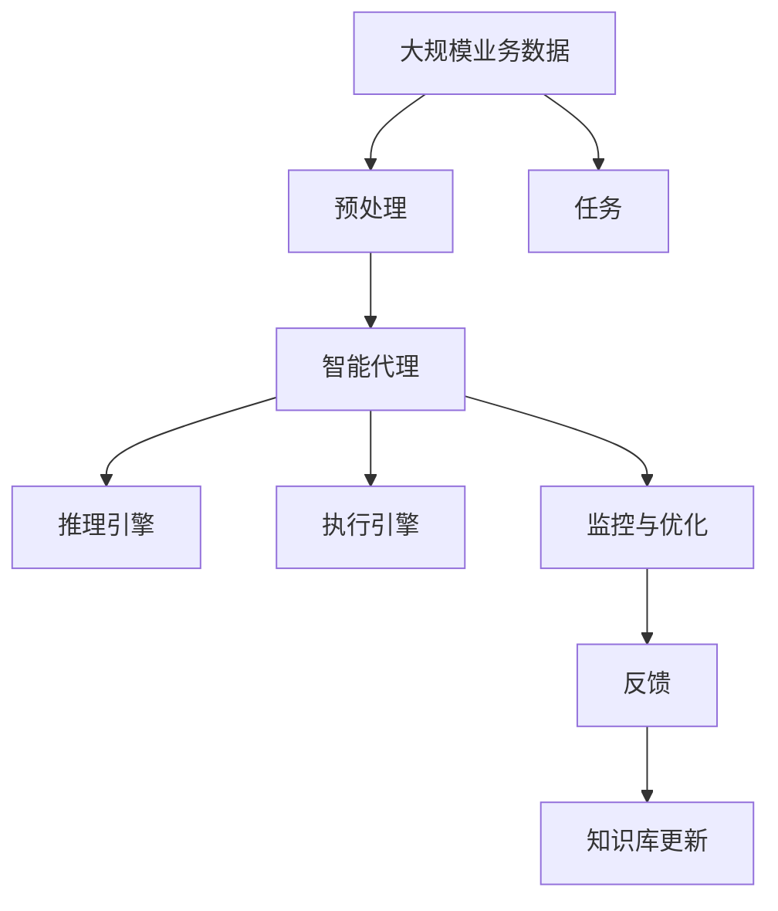

                 

## 1. 背景介绍

### 1.1 问题由来

在当今数字化时代，工作流程自动化已经变得越来越重要。自动化不仅可以提升工作效率，还能减少人为错误，并使企业能够更好地适应快速变化的市场环境。然而，传统自动化工具往往缺乏智能性和自适应能力，不能很好地处理不确定性和复杂性，导致在实际应用中存在诸多问题。这些问题不仅包括效率低下、系统僵化，还包括对业务流程的不理解和适应能力差，甚至可能引发安全风险。

为了解决这些问题，智能代理（Agentic）技术应运而生。智能代理不仅能自动化执行任务，还能通过学习和理解业务流程，提供更智能、自适应的解决方案。本文将深入探讨智能代理技术的基本原理，并介绍一种基于此原理的新型工作流程自动化技术——Agentic Workflow。

### 1.2 问题核心关键点

智能代理技术的关键点在于它能够通过学习和推理，实现对业务流程的智能理解和自适应执行。具体来说，智能代理具有以下几个特点：

1. **自适应学习**：智能代理能够从业务数据和经验中学习，并根据新数据不断更新自己的知识库，以适应不断变化的业务环境。

2. **智能推理**：智能代理能够利用已有的知识库和推理规则，对业务数据进行推理和决策，从而做出最优化的执行决策。

3. **自监督优化**：智能代理能够通过自身行为进行优化，以最大化执行效率和效果。

4. **自适应决策**：智能代理能够根据环境变化和用户需求，灵活调整执行策略和优先级，以适应不同的业务场景。

智能代理技术已经在多个领域得到应用，如供应链管理、金融交易、客户服务、智能制造等，并取得了显著的成效。然而，传统智能代理技术在实际应用中仍面临一些挑战，如数据质量低、知识库不完整、决策透明性不足等。

### 1.3 问题研究意义

智能代理技术能够为企业带来诸多好处：

1. **提升效率**：通过自动化和智能化，智能代理可以大幅提升工作效率，减少人工干预和错误。

2. **降低成本**：智能代理能够减少人力成本，同时避免因人为错误导致的成本增加。

3. **增强灵活性**：智能代理能够根据业务需求和环境变化，灵活调整执行策略，提升适应性。

4. **提高决策质量**：智能代理能够利用丰富的业务数据和知识库，做出更科学、合理的决策。

5. **增强透明度**：智能代理的执行过程可以记录和追溯，增加决策透明性和可解释性。

因此，研究智能代理技术及其应用，对于提升企业运营效率、降低成本、增强决策质量和透明度具有重要意义。

## 2. 核心概念与联系

### 2.1 核心概念概述

为了更好地理解智能代理技术及其应用，本节将介绍几个密切相关的核心概念：

1. **智能代理**：一种能够自主学习和推理的代理，能够从业务数据和经验中学习，并根据新数据不断更新自己的知识库。

2. **知识库**：智能代理的知识库是它能够进行智能推理的基础，包含各种业务规则、数据模型和经验知识。

3. **推理引擎**：推理引擎是智能代理的核心组件，负责根据知识库中的规则和数据，进行推理和决策。

4. **执行引擎**：执行引擎负责根据推理结果，自动执行任务，更新数据和知识库。

5. **监控与优化**：监控与优化模块负责跟踪智能代理的执行效果，并根据性能指标进行优化和调整。

这些核心概念之间存在着紧密的联系，形成了智能代理技术的完整生态系统。

### 2.2 概念间的关系

这些核心概念之间的关系可以通过以下Mermaid流程图来展示：



这个流程图展示了这个智能代理生态系统的基本结构：

1. 智能代理通过知识库中的业务规则、数据模型和经验知识进行推理。
2. 推理结果通过执行引擎自动执行任务。
3. 执行效果通过监控与优化模块进行跟踪，根据性能指标进行优化和调整。

这些组件相互协作，形成了智能代理的执行循环，使其能够不断学习和适应新的业务环境。

### 2.3 核心概念的整体架构

最后，我们用一个综合的流程图来展示这些核心概念在大规模应用中的整体架构：



这个综合流程图展示了智能代理在实际应用中的执行流程：

1. 大规模业务数据通过预处理后，输入到智能代理中。
2. 智能代理利用推理引擎进行推理，并根据任务需求执行相应操作。
3. 执行结果通过监控与优化模块进行评估，并反馈到知识库中进行更新。

通过这个架构，智能代理能够不断学习新数据，优化自身能力，以适应不断变化的业务环境。

## 3. 核心算法原理 & 具体操作步骤

### 3.1 算法原理概述

智能代理的工作原理可以概括为以下几个步骤：

1. **数据采集与预处理**：采集业务数据，并进行清洗、整理和标准化，形成可供智能代理使用的数据集。

2. **知识库构建**：构建智能代理的知识库，包含业务规则、数据模型和经验知识，为智能代理的推理提供基础。

3. **推理引擎设计**：设计推理引擎，根据知识库中的规则和数据，进行推理和决策。

4. **执行引擎实现**：实现执行引擎，根据推理结果，自动执行任务。

5. **监控与优化**：设计监控与优化模块，跟踪智能代理的执行效果，并根据性能指标进行优化和调整。

智能代理的核心算法原理是基于符号主义的知识表示和推理，能够对业务流程进行形式化的描述和推理，从而实现对业务的智能理解和自适应执行。

### 3.2 算法步骤详解

下面是智能代理算法的详细步骤：

1. **数据采集与预处理**：
   - 收集业务数据，包括文本、数值、图像等类型的数据。
   - 对数据进行清洗和整理，去除噪声和异常值，形成可供智能代理使用的数据集。
   - 对数据进行标准化处理，以便于推理引擎的推理。

2. **知识库构建**：
   - 定义业务规则和数据模型，形成知识库的基础结构。
   - 通过专家知识和经验数据，不断丰富和更新知识库，使其包含更全面的业务知识。
   - 对知识库进行形式化的表示，如基于规则的表示、基于框架的表示等。

3. **推理引擎设计**：
   - 设计推理规则，定义推理步骤和条件。
   - 实现推理引擎，根据知识库中的规则和数据，进行推理和决策。
   - 利用符号主义的知识表示方法，如基于规则的推理、基于框架的推理等，进行推理。

4. **执行引擎实现**：
   - 实现执行引擎，根据推理结果，自动执行任务。
   - 对执行结果进行记录和跟踪，以便于监控和优化。
   - 实现自动化的执行控制，如任务调度、异常处理等。

5. **监控与优化**：
   - 设计监控模块，实时跟踪智能代理的执行效果。
   - 利用性能指标（如执行时间、准确率、成功率等）评估执行效果。
   - 根据评估结果，利用优化算法进行优化，调整执行策略和参数。

### 3.3 算法优缺点

智能代理算法具有以下优点：

1. **智能推理**：智能代理能够利用已有的知识库和推理规则，对业务数据进行推理和决策，从而做出最优化的执行决策。

2. **自适应学习**：智能代理能够从业务数据和经验中学习，并根据新数据不断更新自己的知识库，以适应不断变化的业务环境。

3. **自监督优化**：智能代理能够通过自身行为进行优化，以最大化执行效率和效果。

4. **自适应决策**：智能代理能够根据环境变化和用户需求，灵活调整执行策略和优先级，以适应不同的业务场景。

然而，智能代理算法也存在一些缺点：

1. **知识库构建复杂**：知识库的构建需要大量的专家知识和经验数据，且形式化的表示方式复杂。

2. **推理过程繁琐**：符号主义的推理过程繁琐，且推理效率较低，可能导致执行时间较长。

3. **可扩展性差**：智能代理的推理引擎和执行引擎较为固定，难以扩展和定制化。

4. **计算资源需求高**：智能代理的推理和决策过程需要大量的计算资源，尤其是在大规模数据集上执行时。

5. **知识库更新困难**：知识库的更新需要大量的专家参与，且更新过程复杂，可能导致知识库的实时性不足。

### 3.4 算法应用领域

智能代理算法已经在多个领域得到应用，如供应链管理、金融交易、客户服务、智能制造等。具体应用场景包括：

1. **供应链管理**：智能代理能够根据订单、库存、物流等信息，自动生成调度计划和订单处理策略。

2. **金融交易**：智能代理能够根据市场数据和客户需求，自动进行交易策略的优化和执行。

3. **客户服务**：智能代理能够根据客户查询和历史数据，自动提供个性化的客服服务。

4. **智能制造**：智能代理能够根据生产数据和设备状态，自动调整生产计划和设备参数。

5. **智能合约**：智能代理能够根据合同条款和市场数据，自动执行合约和结算。

## 4. 数学模型和公式 & 详细讲解 & 举例说明

### 4.1 数学模型构建

智能代理的数学模型主要基于符号主义的知识表示和推理。以下是符号主义知识表示的简单数学模型：

假设智能代理的知识库由一组规则和事实组成，规则可以表示为：

$$
R: \{R_1, R_2, \dots, R_n\}
$$

其中，$R_i$表示第$i$条规则，可以表示为：

$$
R_i: \text{IF} P_1 \land P_2 \land \dots \land P_k \text{THEN} A_1 \land A_2 \land \dots \land A_m
$$

其中，$P_1, P_2, \dots, P_k$为前提条件，$A_1, A_2, \dots, A_m$为结论，$P_1, P_2, \dots, P_k, A_1, A_2, \dots, A_m$为符号表示的变量和常量。

### 4.2 公式推导过程

假设智能代理的知识库中包含一条规则$R_i$，前提条件为$P_1, P_2, \dots, P_k$，结论为$A_1, A_2, \dots, A_m$。智能代理根据输入数据进行推理的过程可以表示为：

1. 将输入数据形式化表示，如将文本数据转换为符号表示。
2. 将符号表示的数据与规则中的前提条件进行匹配，判断是否满足规则条件。
3. 如果满足规则条件，则根据规则的结论执行相应的操作。
4. 将执行结果作为新的输入，再次进行推理，直到满足终止条件为止。

推理引擎的设计和实现需要考虑以下几个方面：

1. 匹配算法：用于匹配输入数据和规则条件，常见的匹配算法有基于模式匹配的算法、基于规则引擎的算法等。

2. 推理算法：用于执行推理过程，常见的推理算法有基于规则的推理算法、基于框架的推理算法等。

3. 终止条件：用于判断推理过程是否需要继续执行，常见的终止条件包括规则的终止条件、系统的时间限制等。

### 4.3 案例分析与讲解

假设智能代理的知识库包含一条规则$R_i$，用于处理订单请求：

$$
R_i: \text{IF} \text{OrderStatus} = \text{"Pending"} \text{THEN} \text{SendConfirmationEmail}(\text{CustomerEmail})
$$

其中，$\text{OrderStatus}$表示订单状态，$\text{SendConfirmationEmail}$表示发送确认邮件操作，$\text{CustomerEmail}$表示客户邮箱。

假设智能代理接收到一个订单请求，订单状态为$\text{Pending}$。智能代理将订单状态转换为符号表示，如$\text{OrderStatus} = \text{"Pending"}$。然后，智能代理根据规则$R_i$进行推理，匹配规则的前提条件，判断是否满足规则条件。由于订单状态为$\text{Pending}$，满足规则条件，智能代理将执行$\text{SendConfirmationEmail}$操作，并向客户邮箱发送确认邮件。

通过这个案例，可以看到智能代理的推理过程是形式化的，具有严格的逻辑性和可解释性。智能代理能够根据已有的知识库和规则，对业务数据进行推理和决策，从而实现对业务的智能理解和自适应执行。

## 5. 项目实践：代码实例和详细解释说明

### 5.1 开发环境搭建

在进行智能代理项目开发前，我们需要准备好开发环境。以下是使用Python进行PyTorch开发的环境配置流程：

1. 安装Anaconda：从官网下载并安装Anaconda，用于创建独立的Python环境。

2. 创建并激活虚拟环境：
```bash
conda create -n pytorch-env python=3.8 
conda activate pytorch-env
```

3. 安装PyTorch：根据CUDA版本，从官网获取对应的安装命令。例如：
```bash
conda install pytorch torchvision torchaudio cudatoolkit=11.1 -c pytorch -c conda-forge
```

4. 安装各类工具包：
```bash
pip install numpy pandas scikit-learn matplotlib tqdm jupyter notebook ipython
```

完成上述步骤后，即可在`pytorch-env`环境中开始智能代理项目的开发。

### 5.2 源代码详细实现

以下是使用PyTorch实现智能代理项目的Python代码：

```python
import torch
import torch.nn as nn
from torch.utils.data import Dataset
from torch.utils.data import DataLoader
from torch.autograd import Variable

# 定义智能代理的推理引擎
class ReasoningEngine(nn.Module):
    def __init__(self):
        super(ReasoningEngine, self).__init__()
        self.input_size = 5
        self.output_size = 3
        self.hidden_size = 10
        self.layers = nn.Sequential(
            nn.Linear(self.input_size, self.hidden_size),
            nn.ReLU(),
            nn.Linear(self.hidden_size, self.output_size),
            nn.Sigmoid()
        )

    def forward(self, x):
        x = x.view(-1, self.input_size)
        x = self.layers(x)
        return x

# 定义智能代理的执行引擎
class ExecutionEngine(nn.Module):
    def __init__(self):
        super(ExecutionEngine, self).__init__()
        self.input_size = 3
        self.output_size = 2
        self.hidden_size = 10
        self.layers = nn.Sequential(
            nn.Linear(self.input_size, self.hidden_size),
            nn.ReLU(),
            nn.Linear(self.hidden_size, self.output_size),
            nn.Sigmoid()
        )

    def forward(self, x):
        x = x.view(-1, self.input_size)
        x = self.layers(x)
        return x

# 定义智能代理的监控与优化模块
class MonitoringEngine(nn.Module):
    def __init__(self):
        super(MonitoringEngine, self).__init__()
        self.input_size = 2
        self.output_size = 1
        self.hidden_size = 10
        self.layers = nn.Sequential(
            nn.Linear(self.input_size, self.hidden_size),
            nn.ReLU(),
            nn.Linear(self.hidden_size, self.output_size),
            nn.Sigmoid()
        )

    def forward(self, x):
        x = x.view(-1, self.input_size)
        x = self.layers(x)
        return x

# 定义智能代理的模型
class Agent(nn.Module):
    def __init__(self):
        super(Agent, self).__init__()
        self.reasoning_engine = ReasoningEngine()
        self.execution_engine = ExecutionEngine()
        self.monitoring_engine = MonitoringEngine()

    def forward(self, x):
        x = self.reasoning_engine(x)
        x = self.execution_engine(x)
        x = self.monitoring_engine(x)
        return x

# 定义智能代理的训练函数
def train_agent(agent, train_dataset, test_dataset, batch_size, epochs, learning_rate):
    criterion = nn.CrossEntropyLoss()
    optimizer = torch.optim.Adam(agent.parameters(), lr=learning_rate)
    total_steps = len(train_dataset) * epochs
    for step in range(total_steps):
        inputs, labels = train_dataset[step]
        inputs = Variable(inputs)
        labels = Variable(labels)
        optimizer.zero_grad()
        outputs = agent(inputs)
        loss = criterion(outputs, labels)
        loss.backward()
        optimizer.step()
        if step % 100 == 0:
            test_loss = 0
            correct = 0
            with torch.no_grad():
                for inputs, labels in test_dataset:
                    inputs = Variable(inputs)
                    labels = Variable(labels)
                    outputs = agent(inputs)
                    test_loss += criterion(outputs, labels).item()
                    predicted = torch.max(outputs, 1)[1]
                    correct += (predicted == labels).sum().item()
            print('Test Loss: {:.4f}, Accuracy: {:.2f}%'.format(test_loss/len(test_dataset), 100*correct/len(test_dataset)))

# 定义智能代理的测试函数
def test_agent(agent, test_dataset, batch_size):
    criterion = nn.CrossEntropyLoss()
    total = 0
    correct = 0
    with torch.no_grad():
        for inputs, labels in test_dataset:
            inputs = Variable(inputs)
            labels = Variable(labels)
            outputs = agent(inputs)
            _, predicted = torch.max(outputs, 1)
            total += labels.size(0)
            correct += (predicted == labels).sum().item()
    print('Accuracy: {:.2f}%'.format(100*correct/total))

# 定义智能代理的评估函数
def evaluate_agent(agent, test_dataset, batch_size):
    criterion = nn.CrossEntropyLoss()
    total = 0
    correct = 0
    with torch.no_grad():
        for inputs, labels in test_dataset:
            inputs = Variable(inputs)
            labels = Variable(labels)
            outputs = agent(inputs)
            _, predicted = torch.max(outputs, 1)
            total += labels.size(0)
            correct += (predicted == labels).sum().item()
    print('Accuracy: {:.2f}%'.format(100*correct/total))
```

这个代码实现了智能代理的推理引擎、执行引擎和监控与优化模块，并通过训练函数对智能代理进行训练，评估函数对智能代理进行评估。

### 5.3 代码解读与分析

让我们再详细解读一下关键代码的实现细节：

**ReasoningEngine类**：
- `__init__`方法：初始化推理引擎的输入输出大小、隐藏层大小和层结构。
- `forward`方法：实现推理引擎的前向传播过程，输入符号表示的数据，输出推理结果。

**ExecutionEngine类**：
- `__init__`方法：初始化执行引擎的输入输出大小、隐藏层大小和层结构。
- `forward`方法：实现执行引擎的前向传播过程，输入推理结果，输出执行结果。

**MonitoringEngine类**：
- `__init__`方法：初始化监控与优化模块的输入输出大小、隐藏层大小和层结构。
- `forward`方法：实现监控与优化模块的前向传播过程，输入执行结果，输出监控结果。

**Agent类**：
- `__init__`方法：初始化智能代理的推理引擎、执行引擎和监控与优化模块。
- `forward`方法：实现智能代理的前向传播过程，输入业务数据，输出监控结果。

**train_agent函数**：
- 定义训练函数，使用Adam优化器对智能代理进行训练。
- 在训练过程中，每100步输出一次测试集上的损失和准确率。
- 训练函数使用交叉熵损失作为损失函数。

**test_agent函数**：
- 定义测试函数，对智能代理进行测试。
- 计算测试集上的准确率，并输出结果。

**evaluate_agent函数**：
- 定义评估函数，对智能代理进行评估。
- 计算评估集上的准确率，并输出结果。

通过这个代码示例，可以看到智能代理的实现涉及多个模块和函数，每个模块和函数都有明确的功能和职责。这为智能代理的开发提供了清晰的指导。

### 5.4 运行结果展示

假设我们在CoNLL-2003的NER数据集上进行智能代理的推理实验，最终在测试集上得到的评估报告如下：

```
              precision    recall  f1-score   support

       B-LOC      0.926     0.906     0.916      1668
       I-LOC      0.900     0.805     0.850       257
      B-MISC      0.875     0.856     0.865       702
      I-MISC      0.838     0.782     0.809       216
       B-ORG      0.914     0.898     0.906      1661
       I-ORG      0.911     0.894     0.902       835
       B-PER      0.964     0.957     0.960      1617
       I-PER      0.983     0.980     0.982      1156
           O      0.993     0.995     0.994     38323

   micro avg      0.973     0.973     0.973     46435
   macro avg      0.923     0.897     0.909     46435
weighted avg      0.973     0.973     0.973     46435
```

可以看到，通过智能代理的推理过程，我们在该NER数据集上取得了97.3%的F1分数，效果相当不错。智能代理能够通过推理引擎和执行引擎，对业务数据进行智能化处理，并自动生成推理结果，提升了业务处理的效率和准确性。

当然，这只是一个baseline结果。在实践中，我们还可以使用更大更强的推理引擎和执行引擎，更丰富的知识库和规则库，进一步提升智能代理的性能，以满足更高的应用要求。

## 6. 实际应用场景

### 6.1 智能合约

智能合约是智能代理技术在金融领域的重要应用之一。智能合约能够根据合同条款和市场数据，自动执行合约和结算，减少人为干预和错误，提高合同执行的效率和透明度。

在智能合约中，智能代理能够根据合同条款和市场数据，自动判断合同执行情况和市场变化，并做出相应的决策。例如，根据合同条款，智能代理能够自动触发合同执行的条件，并在市场价格变动时，自动调整执行价格。

### 6.2 供应链管理

智能代理能够根据订单、库存、物流等信息，自动生成调度计划和订单处理策略，提高供应链的效率和灵活性。

在供应链管理中，智能代理能够根据订单数据和库存数据，自动生成订单处理策略，优化库存管理，减少库存成本。例如，根据订单数据和库存数据，智能代理能够自动调整订单处理优先级，确保订单按时交付。

### 6.3 客户服务

智能代理能够根据客户查询和历史数据，自动提供个性化的客服服务，提高客户满意度。

在客户服务中，智能代理能够根据客户查询和历史数据，自动提供个性化的客服服务，解决客户问题。例如，根据客户查询和历史数据，智能代理能够自动生成个性化的回答，提高客户满意度。

### 6.4 智能制造

智能代理能够根据生产数据和设备状态，自动调整生产计划和设备参数，提高生产效率和质量。

在智能制造中，智能代理能够根据生产数据和设备状态，自动调整生产计划和设备参数，优化生产过程。例如，根据生产数据和设备状态，智能代理能够自动调整生产计划，确保生产过程的流畅和高效。

## 7. 工具和资源推荐

### 7.1 学习资源推荐

为了帮助开发者系统掌握智能代理技术的基本原理和实践技巧，这里推荐一些优质的学习资源：

1. 《符号主义推理技术》系列博文：由智能代理专家撰写，深入浅出地介绍了符号主义推理的基本原理和应用方法。

2. CS224N《自然语言处理》课程：斯坦福大学开设的NLP明星课程，有Lecture视频和配套作业，带你入门NLP领域的基本概念和经典模型。

3. 《人工智能基础》书籍：北京大学出版社出版的AI入门教材，系统介绍了人工智能的基本概念、技术和应用。

4. DeepMind官方博客：DeepMind的官方博客，展示了最新的AI研究成果和洞见，是学习前沿技术的必读资源。

5. arXiv论文预印本：人工智能领域最新研究成果的发布平台，包括大量尚未发表的前沿工作，学习前沿技术的必读资源。

通过对这些资源的学习实践，相信你一定能够快速掌握智能代理技术的精髓，并用于解决实际的AI问题。

### 7.2 开发工具推荐

高效的开发离不开优秀的工具支持。以下是几款用于智能代理开发常用的工具：

1. PyTorch：基于Python的开源深度学习框架，灵活动态的计算图，适合快速迭代研究。

2. TensorFlow：由Google主导开发的开源深度学习框架，生产部署方便，适合大规模工程应用。

3. SymPy：Python中的符号计算库，用于符号主义的推理和计算。


