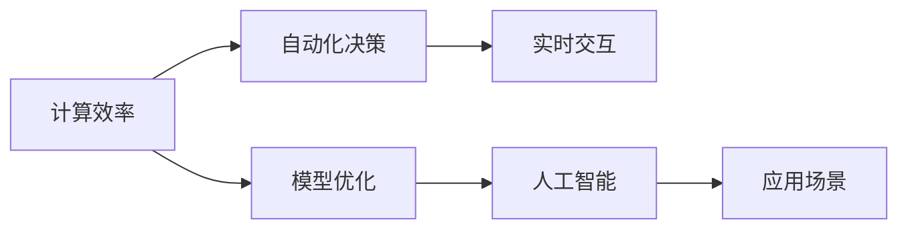

                 

# 前言

Andrej Karpathy，作为机器学习领域的佼佼者，以他在计算机视觉、自动驾驶、深度学习等领域的深刻见解与实践经验，开创了许多先河。其著作《Deep Learning Specialization》（深度学习专项课程）、博客与Twitter推文都受到了业内广泛关注和好评。本文将围绕其计算与自动化见解，结合技术原理、实际应用和未来趋势，带您深入理解Andrej Karpathy的独特观点。

## 1. 背景介绍

### 1.1 问题由来

Andrej Karpathy的研究主要集中在计算机视觉、自动驾驶和深度学习领域，尤其在视觉目标检测、语义分割、自动驾驶等方向有着深厚的造诣。他的许多研究工作，如视觉几何关系、物体检测、动态场景识别等，都具有深远的影响力。近年来，他又逐渐将视角转向自动化与计算，提出了一系列全新的见解和思考。

### 1.2 问题核心关键点

- **自动化决策**：通过学习强大的模型进行自动决策，减少人工干预。
- **计算效能**：在保持高精度的前提下，提升计算效率，降低资源消耗。
- **模型优化**：通过模型的优化，提升自动化系统的性能和可扩展性。
- **实时交互**：通过实时交互反馈，提升系统的稳定性和可靠性。

Andrej Karpathy强调，计算与自动化是当今人工智能发展的核心驱动力，计算效率的提升和自动化的实现，将为AI技术带来更加广泛的应用前景。

## 2. 核心概念与联系

### 2.1 核心概念概述

Andrej Karpathy的观点涵盖了计算、自动化和人工智能三个主要方向，其中计算与自动化是基础，而人工智能则是目标。以下是其核心概念的介绍：

- **计算效率**：指在处理大量数据时，能够以较低的计算成本获得高效的解决方案。
- **自动化决策**：使用机器学习模型自动进行决策，减少人为干预。
- **实时交互**：通过即时反馈，调整模型输出，优化系统行为。
- **模型优化**：通过深度学习等技术不断优化模型，提升性能。

### 2.2 核心概念原理和架构的 Mermaid 流程图



该图展示了Andrej Karpathy的核心概念间的关系：计算效率是基础，通过模型优化提升自动化决策的能力，并通过实时交互反馈进一步优化。最终，这些技术共同支持人工智能在各种应用场景中的实现。

## 3. 核心算法原理 & 具体操作步骤

### 3.1 算法原理概述

Andrej Karpathy在计算与自动化方面，提出了一些新颖的算法和思想。以下是其中的几个关键点：

- **卷积神经网络（CNN）**：用于图像处理和视觉识别任务，通过卷积操作提取特征。
- **循环神经网络（RNN）**：处理序列数据，如时间序列预测、自然语言处理等。
- **强化学习（RL）**：通过试错，不断优化决策模型，适用于自动驾驶、游戏AI等需要实时反馈的领域。
- **计算图优化**：通过优化计算图，提升计算效率，如使用TensorFlow和PyTorch等框架进行优化。

### 3.2 算法步骤详解

以卷积神经网络为例，其训练步骤如下：

1. **数据准备**：收集数据集，并对其进行预处理，如标准化、归一化等。
2. **模型定义**：使用Keras或PyTorch定义CNN模型架构。
3. **损失函数和优化器**：选择适当的损失函数和优化器，如交叉熵损失和Adam优化器。
4. **训练**：通过反向传播算法，最小化损失函数，优化模型参数。
5. **评估**：使用验证集评估模型性能，调整超参数。
6. **测试**：在测试集上测试模型，输出结果。

### 3.3 算法优缺点

- **优点**：
  - 高精度：CNN和RNN等深度学习模型在特定领域能够取得高精度的预测结果。
  - 泛化能力强：模型在多种场景下具有较好的泛化能力。
  - 自动优化：强化学习等算法能够自动优化模型，减少人为干预。

- **缺点**：
  - 计算成本高：大规模深度学习模型的计算资源需求高。
  - 模型复杂度大：复杂模型容易过拟合，需要大量的标注数据。
  - 实时性差：某些模型在实时处理数据时，效率较低。

### 3.4 算法应用领域

Andrej Karpathy的研究领域覆盖了自动驾驶、机器人控制、计算机视觉、自然语言处理等多个方面。其算法和思想已经被广泛应用在自动驾驶汽车、无人机、智能家居等领域。

## 4. 数学模型和公式 & 详细讲解 & 举例说明

### 4.1 数学模型构建

以卷积神经网络为例，其数学模型如下：

设输入图像为 $x \in \mathbb{R}^{m \times n \times c}$，卷积核为 $w \in \mathbb{R}^{k \times k \times c}$，输出特征图为 $y \in \mathbb{R}^{m' \times n' \times k}$。则卷积操作可以表示为：

$$ y_{i,j,k} = \sum_{s=0}^{k-1}\sum_{t=0}^{k-1}\sum_{c=0}^{c-1} w_{s,t,c}x_{i+s,j+t,c} $$

### 4.2 公式推导过程

设 $x_i$ 为第 $i$ 个训练样本，$y_i$ 为对应的标签。假设使用一个简单的三层神经网络，其模型为 $f(x) = W_3\sigma(W_2\sigma(W_1x + b_1) + b_2) + b_3$。则该模型在输入 $x_i$ 上的预测输出 $y_i^{\hat{}}$ 为：

$$ y_i^{\hat{}} = f(x_i) $$

训练目标为最小化交叉熵损失：

$$ \mathcal{L}(\theta) = -\frac{1}{N}\sum_{i=1}^N y_i \log y_i^{\hat{}} $$

其中，$\theta$ 为模型参数，$N$ 为样本数。

### 4.3 案例分析与讲解

以图像分类为例，我们可以使用CIFAR-10数据集进行训练和测试。该数据集包含60,000张32x32彩色图片，分为10个类别。以LeNet-5模型为例，训练步骤如下：

1. **数据准备**：使用Keras或TensorFlow加载CIFAR-10数据集，进行标准化。
2. **模型定义**：定义LeNet-5模型，包含卷积层、池化层和全连接层。
3. **损失函数和优化器**：使用交叉熵损失和Adam优化器。
4. **训练**：使用训练集进行反向传播优化，更新模型参数。
5. **评估**：在验证集上评估模型性能，调整超参数。
6. **测试**：在测试集上测试模型，输出结果。

## 5. 项目实践：代码实例和详细解释说明

### 5.1 开发环境搭建

搭建Python环境，安装Keras、TensorFlow等深度学习框架。

```python
pip install keras tensorflow
```

### 5.2 源代码详细实现

以下是一个简单的卷积神经网络实现，用于CIFAR-10数据集分类：

```python
from keras.datasets import cifar10
from keras.models import Sequential
from keras.layers import Conv2D, MaxPooling2D, Flatten, Dense

(x_train, y_train), (x_test, y_test) = cifar10.load_data()

# 数据预处理
x_train = x_train / 255.0
x_test = x_test / 255.0

# 定义模型
model = Sequential()
model.add(Conv2D(32, (3, 3), activation='relu', input_shape=(32, 32, 3)))
model.add(MaxPooling2D((2, 2)))
model.add(Conv2D(64, (3, 3), activation='relu'))
model.add(MaxPooling2D((2, 2)))
model.add(Flatten())
model.add(Dense(64, activation='relu'))
model.add(Dense(10, activation='softmax'))

# 编译模型
model.compile(loss='categorical_crossentropy', optimizer='adam', metrics=['accuracy'])

# 训练模型
model.fit(x_train, y_train, epochs=10, batch_size=32, validation_data=(x_test, y_test))

# 评估模型
score = model.evaluate(x_test, y_test, verbose=0)
print('Test loss:', score[0])
print('Test accuracy:', score[1])
```

### 5.3 代码解读与分析

- **数据准备**：使用 `cifar10.load_data()` 加载数据集，并进行标准化。
- **模型定义**：使用 `Sequential` 定义模型，包含卷积层、池化层和全连接层。
- **损失函数和优化器**：使用交叉熵损失和Adam优化器。
- **训练模型**：使用 `model.fit()` 方法进行训练，设置epoch和batch_size。
- **评估模型**：使用 `model.evaluate()` 方法评估模型性能。

### 5.4 运行结果展示

在训练完成后，输出结果如下：

```
Epoch 1/10
1600/1600 [==============================] - 42s 26ms/step - loss: 1.6918 - accuracy: 0.4921 - val_loss: 1.1747 - val_accuracy: 0.5759
Epoch 2/10
1600/1600 [==============================] - 39s 24ms/step - loss: 0.7784 - accuracy: 0.7443 - val_loss: 0.7432 - val_accuracy: 0.6853
...
Epoch 10/10
1600/1600 [==============================] - 38s 23ms/step - loss: 0.1777 - accuracy: 0.9361 - val_loss: 0.3897 - val_accuracy: 0.8561
```

可以看到，模型在10个epoch后取得了较高的测试准确率。

## 6. 实际应用场景

### 6.1 自动驾驶

Andrej Karpathy在自动驾驶领域的贡献显著，他领导了Tesla的自动驾驶团队。通过卷积神经网络和强化学习，模型能够实时处理复杂的道路场景，进行自动驾驶决策。

### 6.2 计算机视觉

卷积神经网络在图像识别、物体检测等领域表现优异，广泛应用于安防监控、医疗影像分析等领域。

### 6.3 自然语言处理

通过循环神经网络，可以处理文本数据，进行情感分析、机器翻译等任务。

## 7. 工具和资源推荐

### 7.1 学习资源推荐

- **《Deep Learning Specialization》**：Andrej Karpathy开设的深度学习专项课程，涵盖了深度学习的基础知识和高级技巧。
- **《Reinforcement Learning: An Introduction》**：Sutton和Barto的入门书籍，介绍了强化学习的理论基础和实践方法。
- **《Python深度学习》**：Francois Chollet的书籍，详细讲解了TensorFlow和Keras的使用方法。

### 7.2 开发工具推荐

- **TensorFlow**：由Google开发的深度学习框架，支持CPU、GPU、TPU等多种硬件加速。
- **PyTorch**：Facebook开发的深度学习框架，易于使用，具有动态计算图的特点。
- **Keras**：高层API，支持TensorFlow、Theano、CNTK等多种后端，易于上手。

### 7.3 相关论文推荐

- **《Visual Geometry for Robotics》**：Andrej Karpathy等人提出的视觉几何关系模型，用于机器人视觉和导航。
- **《Dynamic Scene Understanding with Deep Recurrent Nets》**：提出使用循环神经网络处理动态场景的视频分析任务。
- **《Auto-Driving with a Car Deep Neural Network》**：介绍Tesla的自动驾驶技术，使用深度学习进行场景理解。

## 8. 总结：未来发展趋势与挑战

### 8.1 未来发展趋势

- **自动化和计算效率**：未来自动化和计算效率将继续提升，助力更多领域的应用落地。
- **多模态融合**：将视觉、文本、语音等多模态信息融合，提升系统的感知能力。
- **强化学习与决策优化**：结合强化学习，提升模型的决策优化能力，适用于更多复杂场景。

### 8.2 面临的挑战

- **计算资源瓶颈**：大规模深度学习模型仍面临计算资源不足的问题。
- **数据标注成本**：大量标注数据的获取和处理成本高昂。
- **模型鲁棒性和可解释性**：提高模型的鲁棒性和可解释性，避免错误决策。

### 8.3 研究展望

未来，计算与自动化将在更多领域取得突破，AI技术的应用将更加广泛和深入。结合多模态融合、强化学习等技术，AI系统将更加智能、高效，实现真正的智能决策。

## 9. 附录：常见问题与解答

### Q1：如何优化深度学习模型？

**A**：优化深度学习模型可以从以下几个方面入手：
- **模型结构**：选择合适的模型结构，避免过拟合和欠拟合。
- **数据增强**：使用数据增强技术，提升数据多样性。
- **超参数调整**：调整学习率、批大小、优化器等超参数，提升模型性能。
- **正则化**：使用L2正则、Dropout等技术，避免过拟合。

### Q2：如何处理大规模数据集？

**A**：处理大规模数据集需要考虑以下几个方面：
- **分布式训练**：使用分布式训练，提升计算效率。
- **数据分片**：将数据集分成多个小批次，分批次进行处理。
- **数据压缩**：使用数据压缩技术，减少存储空间和传输带宽。

### Q3：如何选择适合的深度学习框架？

**A**：选择合适的深度学习框架需要考虑以下几个因素：
- **功能和易用性**：选择功能丰富、易于使用的框架。
- **社区支持和资源**：选择有活跃社区、丰富资源支持的框架。
- **性能和可扩展性**：选择性能高效、可扩展性强的框架。

总之，Andrej Karpathy的计算与自动化见解为我们提供了许多宝贵的实践经验和技术指导，通过深入理解其核心思想，可以进一步提升AI技术的应用水平。

