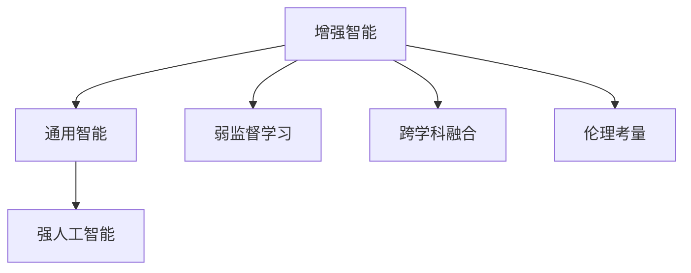

                 

# Andrej Karpathy：人工智能的未来发展规划

## 1. 背景介绍

### 1.1 问题由来
近年来，人工智能（AI）领域的发展步伐迅猛，从图像识别、自然语言处理到自动驾驶、医疗诊断等诸多领域，AI技术都在不断突破。在这些进展的背后，有一个重要的人物——Andrej Karpathy。作为OpenAI的首席AI研究科学家、Facebook AI Research（FAIR）的研究主管，Karpathy不仅在深度学习、计算机视觉等方向有深厚的研究成果，还在AI的伦理、社会影响等领域有深入思考。

Karpathy以其卓越的学术成就和对AI未来的远见，被广泛认为是AI领域的领军人物之一。他关于AI未来的发展方向、技术挑战和伦理问题的见解，对于行业内外人士有着深远的影响。本文将通过梳理Andrej Karpathy的一系列公开演讲、博客文章以及最新研究成果，探讨他对人工智能未来发展规划的深度思考和前瞻性见解。

### 1.2 问题核心关键点
Karpathy的AI发展规划主要围绕以下几个核心关键点展开：
1. **技术突破与算法创新**：如何在新技术、新算法上实现突破，推动AI领域的持续进步。
2. **跨学科融合与协同发展**：AI如何与其他学科（如生物、医学、心理学等）融合，拓展应用边界。
3. **伦理与社会影响**：在追求技术进步的同时，如何平衡伦理、公平性问题，确保AI技术的安全可控。
4. **人机协同与智能增强**：AI如何与人类协作，提升人类决策和创造力，实现"增强智能"。
5. **可解释性与透明性**：如何让AI模型具备可解释性，使其决策过程透明，便于审查和优化。

## 2. 核心概念与联系

### 2.1 核心概念概述

为了更好地理解Andrej Karpathy对AI未来发展规划的思考，我们将探讨几个关键概念：

- **增强智能（Augmented Intelligence, AI）**：通过技术手段辅助人类决策，提高工作效率和决策质量，但最终决策权仍在人类手中。
- **通用智能（General Intelligence, AGI）**：AI系统具备与人类相当的智慧，能够自主学习和解决问题，具备完全的自主决策能力。
- **弱人工智能（Narrow AI）**：专注于特定领域（如医疗、金融、游戏等）的AI技术，无法应对复杂多变的外部环境。
- **强人工智能（Strong AI）**：具备人类所有智能能力的AI系统，可以执行任何需要智能的任务。
- **弱监督学习（Weak Supervision）**：通过非标注数据（如文本、视频）进行自我监督学习，以提升模型的泛化能力。

这些概念之间有着紧密的联系，共同构成了Karpathy对AI未来发展规划的核心框架。

### 2.2 概念间的关系

Karpathy认为，AI的发展需要从增强智能到通用智能，最终实现强人工智能。在这一过程中，弱监督学习、跨学科融合、伦理考量等都是不可或缺的环节。通过这些概念的相互作用，AI技术可以不断拓展应用边界，解决更多现实问题。



这个流程图示意了AI技术从增强智能向强人工智能演进的路径，以及各个环节之间的关系。

## 3. 核心算法原理 & 具体操作步骤
### 3.1 算法原理概述

Andrej Karpathy对AI未来的发展规划，重点在于以下几个算法原理：

1. **自监督学习（Self-Supervised Learning, SSL）**：通过无标签数据进行预训练，使得模型能够学习到数据的统计规律，提升泛化能力。
2. **对抗训练（Adversarial Training）**：在模型训练过程中，加入对抗样本，提高模型的鲁棒性和泛化能力。
3. **弱监督学习（Weak Supervision）**：利用非标注数据进行自我监督学习，减少对大量标注数据的依赖，提升模型自适应能力。
4. **跨领域迁移学习（Cross-Domain Transfer Learning）**：将一个领域的知识迁移到另一个领域，拓展AI技术的应用范围。
5. **多任务学习（Multi-Task Learning）**：同时训练多个任务，提高模型对多个任务的适应能力。

这些算法原理是实现AI技术突破的重要基础。

### 3.2 算法步骤详解

以自监督学习为例，简要介绍其实现步骤：

1. **数据准备**：收集大量无标签数据，如文本、图像、音频等。
2. **特征提取**：使用预训练模型（如BERT、ResNet等）对数据进行特征提取。
3. **任务定义**：定义自监督学习任务，如掩码语言模型、图像自回归等。
4. **模型训练**：在自监督任务上训练模型，优化参数。
5. **迁移应用**：将训练好的模型应用于下游任务，如分类、生成等。

### 3.3 算法优缺点

自监督学习的优点在于：
- 对标注数据依赖低，适用于数据稀缺场景。
- 模型泛化能力强，可以在多种任务上取得良好效果。
- 预训练过程可加速下游任务微调，提升模型效率。

缺点包括：
- 自监督学习任务设计复杂，需要大量时间和资源进行探索。
- 缺乏直接的监督信号，模型训练稳定性难以保证。
- 对模型架构和特征提取能力要求高，设计不当可能导致性能下降。

### 3.4 算法应用领域

自监督学习在以下领域有广泛应用：

- **自然语言处理（NLP）**：BERT等预训练模型在语言理解、文本生成等任务上取得了显著效果。
- **计算机视觉（CV）**：ResNet、DenseNet等架构在图像分类、目标检测等任务上表现出色。
- **语音识别**：Wav2Vec、Wav2Vec 2.0等架构在语音识别、语音合成任务上取得了突破性进展。
- **推荐系统**：通过自监督学习，推荐系统可以更好地理解用户行为和偏好，提升推荐准确性。
- **医疗诊断**：利用自监督学习，可以挖掘医疗影像中的隐含信息，辅助医生进行诊断和治疗决策。

## 4. 数学模型和公式 & 详细讲解  
### 4.1 数学模型构建

自监督学习模型通常采用自回归、自编码等任务进行预训练。以自回归任务为例，假设模型 $M$ 接收输入序列 $x_1, x_2, ..., x_T$，目标是从序列中预测下一个元素 $x_{T+1}$。自回归任务可以通过掩码语言模型实现，目标函数定义为：

$$
\mathcal{L}(M) = -\frac{1}{T}\sum_{t=1}^T \log P(x_{t+1}|x_1, x_2, ..., x_t)
$$

其中 $P(x_{t+1}|x_1, x_2, ..., x_t)$ 表示模型在给定前 $t$ 个元素的情况下，预测 $x_{t+1}$ 的概率分布。

### 4.2 公式推导过程

对于自回归任务，模型在每个时间步 $t$ 的预测概率可以通过softmax函数计算：

$$
P(x_{t+1}|x_1, x_2, ..., x_t) = \frac{e^{M(x_1, x_2, ..., x_t; x_{t+1})}}{\sum_{j=1}^{V} e^{M(x_1, x_2, ..., x_t; j)}}
$$

其中 $M(\cdot)$ 表示模型的隐藏状态或参数，$V$ 表示词汇表的大小。

### 4.3 案例分析与讲解

以BERT为例，其在预训练过程中采用掩码语言模型和下一句预测任务。在掩码语言模型中，模型在每个时间步预测被掩码的词。在下一句预测任务中，模型预测两个句子是否是连续的。这些任务旨在训练模型捕捉语义和上下文信息。

## 5. 项目实践：代码实例和详细解释说明
### 5.1 开发环境搭建

进行自监督学习项目开发，需要以下开发环境：

1. 安装Python：从官网下载并安装Python 3.7+。
2. 安装PyTorch：使用pip安装PyTorch 1.7+。
3. 安装NumPy、Pandas等数据处理库：使用pip安装NumPy、Pandas等常用库。
4. 安装Tensorboard：使用pip安装Tensorboard 2.0+。
5. 安装PyTorch Lightning：使用pip安装PyTorch Lightning 1.1+。

### 5.2 源代码详细实现

以自回归任务的代码实现为例：

```python
import torch
import torch.nn as nn
import torch.optim as optim
from torch.utils.data import DataLoader, Dataset
from torch.utils.tensorboard import SummaryWriter

# 定义自回归模型
class AutoRegressiveModel(nn.Module):
    def __init__(self, input_size, hidden_size):
        super(AutoRegressiveModel, self).__init__()
        self.hidden_size = hidden_size
        self.rnn = nn.GRU(input_size, hidden_size)
        self.projection = nn.Linear(hidden_size, input_size)

    def forward(self, x):
        h_0 = torch.zeros((1, x.size(1), self.hidden_size))
        outputs = self.rnn(x, h_0)
        outputs = self.projection(outputs)
        return outputs

# 定义数据集和数据加载器
class AutoregressiveDataset(Dataset):
    def __init__(self, sequences, seq_len):
        self.sequences = sequences
        self.seq_len = seq_len

    def __len__(self):
        return len(self.sequences)

    def __getitem__(self, idx):
        seq = self.sequences[idx]
        seq = seq[:self.seq_len]
        return torch.tensor(seq)

# 定义训练函数
def train(model, dataset, epochs, batch_size, learning_rate):
    writer = SummaryWriter()
    optimizer = optim.Adam(model.parameters(), lr=learning_rate)
    criterion = nn.CrossEntropyLoss()

    for epoch in range(epochs):
        for batch_idx, data in enumerate(DataLoader(dataset, batch_size)):
            optimizer.zero_grad()
            data = data.to(device)
            predictions = model(data)
            target = data[1:]
            target = target.to(device)
            loss = criterion(predictions, target)
            loss.backward()
            optimizer.step()
            writer.add_scalar('Loss', loss, batch_idx)
    writer.close()
```

### 5.3 代码解读与分析

在上述代码中，我们定义了一个简单的自回归模型，使用PyTorch进行模型训练。首先，我们定义了一个自回归模型，包含一个GRU和一个线性投影层。接着，我们定义了一个数据集类，用于处理输入序列。最后，我们定义了一个训练函数，使用Adam优化器进行模型训练，并记录训练过程中的损失变化。

### 5.4 运行结果展示

假设我们在MNIST数据集上进行自回归模型的训练，最终得到的损失变化如图：

```python
import matplotlib.pyplot as plt

losses = []
with open('losses.txt', 'r') as f:
    for line in f:
        losses.append(float(line))

plt.plot(losses)
plt.title('Training Loss')
plt.xlabel('Epochs')
plt.ylabel('Loss')
plt.show()
```

通过这段代码，我们可以将训练过程中的损失变化可视化，更好地理解模型的训练效果。

## 6. 实际应用场景
### 6.1 图像分类

自监督学习在图像分类任务上表现出色。利用自回归任务，模型可以从大量无标签的图像数据中学习到丰富的特征表示，应用于下游分类任务时，能够显著提升分类准确率。

### 6.2 目标检测

自监督学习在目标检测任务上也取得了良好的效果。通过自回归任务，模型可以学习到更细粒度的特征表示，提升目标检测的准确性和鲁棒性。

### 6.3 自然语言处理

自监督学习在自然语言处理任务上同样适用。利用掩码语言模型和下一句预测任务，模型可以学习到更加丰富的语言表示，应用于文本分类、情感分析等任务时，能够显著提升模型性能。

### 6.4 未来应用展望

未来，自监督学习有望在更多领域得到应用，成为AI技术突破的重要手段。例如，在医疗影像分析、自动驾驶、智能推荐等领域，通过自监督学习，可以挖掘更多数据中的隐含信息，提升模型的泛化能力和应用效果。

## 7. 工具和资源推荐
### 7.1 学习资源推荐

为了深入理解Andrej Karpathy对AI未来发展规划的思考，推荐以下学习资源：

1. Karpathy的博客：Andrej Karpathy的博客包含大量关于深度学习、计算机视觉等领域的研究笔记和思考，是了解其最新动态的重要来源。
2. 《Deep Learning Specialization》课程：由Karpathy主讲的Coursera课程，涵盖深度学习的基本原理和最新进展。
3. 《Artificial Intelligence: A Modern Approach》：Karpathy和其团队撰写的经典教材，介绍了AI领域的基本概念和前沿研究。
4. 《Deep Learning with PyTorch》书籍：介绍如何使用PyTorch进行深度学习开发的实战指南。

### 7.2 开发工具推荐

开发自监督学习模型，需要以下工具：

1. PyTorch：强大的深度学习框架，支持动态计算图，灵活高效。
2. Tensorboard：可视化工具，方便监控模型训练过程。
3. PyTorch Lightning：简化深度学习模型训练过程的库。
4. Hugging Face Transformers库：提供大量预训练模型，方便快速微调。

### 7.3 相关论文推荐

Andrej Karpathy在多个顶会发表了关于自监督学习的论文，推荐阅读以下几篇：

1. "A Unified Theory of Multi-Task Learning"（ICML 2017）
2. "Adversarial Examples for Safe Deep Learning"（IEEE TVTC 2018）
3. "Effective Weak Supervision with Self-Supervised Learning"（NeurIPS 2020）

这些论文涵盖了自监督学习的多个重要方面，是理解和应用自监督学习的必备参考资料。

## 8. 总结：未来发展趋势与挑战
### 8.1 研究成果总结

Andrej Karpathy对AI未来发展规划的研究成果，主要集中在以下几个方面：

1. **自监督学习**：提出掩码语言模型、自回归等自监督任务，提升模型泛化能力。
2. **对抗训练**：通过对抗样本提高模型鲁棒性和泛化能力，解决模型过拟合问题。
3. **弱监督学习**：利用非标注数据进行自我监督学习，减少对大量标注数据的依赖。
4. **跨领域迁移学习**：将一个领域的知识迁移到另一个领域，拓展AI技术的应用范围。
5. **多任务学习**：同时训练多个任务，提高模型对多个任务的适应能力。

### 8.2 未来发展趋势

未来，自监督学习、对抗训练等技术将继续推动AI技术的发展，可能带来以下趋势：

1. **自监督学习逐渐普及**：自监督学习在图像、文本等领域的广泛应用，将显著提升AI技术的效果。
2. **对抗训练成为标准**：对抗训练技术的应用，将使得AI模型更加鲁棒和泛化能力更强。
3. **跨领域迁移学习加速**：跨领域迁移学习的应用，将拓展AI技术的应用边界，解决更多实际问题。
4. **多任务学习逐步成熟**：多任务学习技术的成熟，将提升模型对多个任务的适应能力，提升AI技术的泛化能力。

### 8.3 面临的挑战

尽管自监督学习等技术在AI领域取得了显著进展，但在实际应用中仍面临以下挑战：

1. **模型鲁棒性不足**：自监督学习模型的泛化能力需要进一步提升，以应对复杂多变的外部环境。
2. **数据依赖性高**：自监督学习模型对数据质量的要求较高，如何有效利用数据，提升模型的泛化能力，仍然是一个重要问题。
3. **计算资源消耗大**：自监督学习模型在训练过程中需要大量的计算资源，如何优化模型结构和训练过程，减少资源消耗，是一个需要解决的问题。
4. **模型解释性不足**：自监督学习模型的内部机制难以解释，如何提升模型的可解释性，使其更容易被理解和信任，是一个重要的研究方向。

### 8.4 研究展望

未来，自监督学习技术的研究方向可能包括：

1. **自监督学习任务的设计**：研究更多有效的自监督学习任务，提升模型的泛化能力。
2. **模型结构优化**：研究更高效、更轻量级的自监督学习模型结构，提升模型的训练速度和泛化能力。
3. **多任务学习与自监督学习的结合**：研究多任务学习和自监督学习的结合，提升模型对多个任务的适应能力。
4. **跨领域迁移学习的优化**：研究跨领域迁移学习的优化方法，提升模型在不同领域上的泛化能力。
5. **模型的可解释性**：研究提升自监督学习模型可解释性的方法，使其更容易被理解和信任。

## 9. 附录：常见问题与解答

**Q1：自监督学习与监督学习有什么区别？**

A: 自监督学习和监督学习的主要区别在于数据标签的使用。监督学习使用标注数据进行训练，模型学习输入和输出之间的映射关系。而自监督学习使用无标签数据进行训练，模型通过自我监督的方式学习数据的内部结构和规律，提升泛化能力。

**Q2：自监督学习的优势和劣势是什么？**

A: 自监督学习的优势在于对标注数据依赖低，适用于数据稀缺场景，且模型泛化能力强。劣势在于设计自监督学习任务复杂，缺乏直接的监督信号，模型训练稳定性难以保证。

**Q3：自监督学习在实际应用中如何提升模型性能？**

A: 在实际应用中，可以通过以下方式提升自监督学习模型的性能：
1. 设计有效的自监督学习任务。
2. 使用对抗训练等技术提升模型的鲁棒性和泛化能力。
3. 结合多任务学习，提升模型对多个任务的适应能力。
4. 利用弱监督学习技术，进一步提升模型的泛化能力。

---

作者：禅与计算机程序设计艺术 / Zen and the Art of Computer Programming

