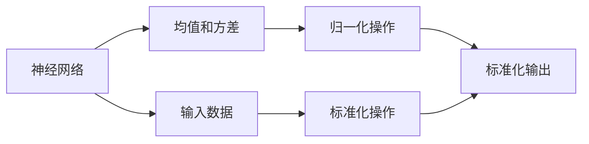
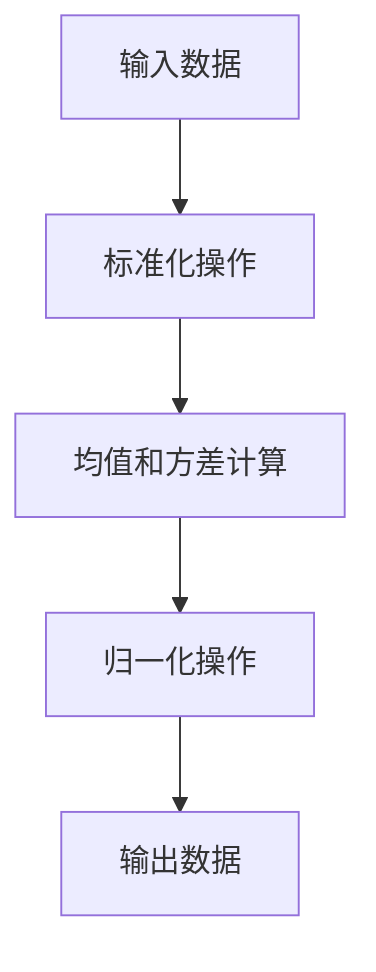

                 

# Batch Normalization原理与代码实例讲解

> 关键词：Batch Normalization, 深度学习, 神经网络, 加速训练, 正则化, 机器学习

## 1. 背景介绍

### 1.1 问题由来
在深度学习中，神经网络被广泛应用于图像识别、自然语言处理、语音识别等多种任务。神经网络的核心组成部分是多层感知机，即由输入层、隐藏层和输出层组成的全连接网络。然而，神经网络的训练过程面临两个主要问题：梯度消失和梯度爆炸。当网络层数较多时，梯度可能变得非常小，甚至消失，导致训练困难；梯度可能变得非常大的情况则称为梯度爆炸。

Batch Normalization（简称BN）是近年来提出的一种有效解决上述问题的方法，由Ioffe和Szegedy在2015年的论文《Batch Normalization: Accelerating Deep Network Training by Reducing Internal Covariate Shift》中提出。BN通过标准化网络每一层的输入，使得每一层都能接收到稳定而均质的输入信号，加速了神经网络的收敛速度，提高了模型的稳定性和泛化能力。

### 1.2 问题核心关键点
Batch Normalization的核心思想是：在神经网络的每一层之间引入一个标准化操作，使得每一层的输出都具有相同的均值和方差。这样不仅减少了梯度消失和梯度爆炸的风险，还提高了模型的训练速度和准确率。具体来说，BN通过在每个训练批次（batch）中计算输入数据的均值和方差，并进行归一化操作，从而实现了对网络每一层的输入进行标准化处理。

### 1.3 问题研究意义
Batch Normalization的提出，极大地推动了深度学习技术的发展，特别是在计算机视觉领域。通过BN，许多复杂的深度网络结构得以实现和训练，显著提升了图像识别和分类任务的性能。BN的广泛应用也加速了深度学习技术的普及，使得越来越多的研究和应用落地的可能性成为现实。

## 2. 核心概念与联系

### 2.1 核心概念概述

Batch Normalization的核心概念主要包括：

- 神经网络：由输入层、隐藏层和输出层组成的全连接网络，用于对输入数据进行建模和预测。
- 均值和方差：用于表示输入数据的中心位置和离散程度，通过标准化操作将输入数据缩放到均值为0、方差为1的范围内。
- 归一化操作：通过对输入数据进行标准化处理，使得每一层的输出都具有相同的均值和方差，从而提高了模型的稳定性和泛化能力。

这些核心概念之间存在着紧密的联系，形成了Batch Normalization的核心逻辑。通过标准化操作，BN不仅解决了深度神经网络训练中的梯度消失和梯度爆炸问题，还提高了模型的训练速度和准确率。

### 2.2 概念间的关系

Batch Normalization的核心概念之间的关系可以用以下Mermaid流程图来展示：



这个流程图展示了从输入数据到标准化输出的全过程。在每个训练批次中，神经网络接收到的输入数据被标准化，使得每一层的输出都具有相同的均值和方差，从而加速了神经网络的收敛过程。

### 2.3 核心概念的整体架构

Batch Normalization的整体架构可以用以下Mermaid流程图来展示：



这个流程图展示了BN的总体架构。在每个训练批次中，输入数据首先经过标准化操作，计算出其均值和方差，然后将其归一化到均值为0、方差为1的范围内，最终输出标准化后的数据。

## 3. 核心算法原理 & 具体操作步骤
### 3.1 算法原理概述

Batch Normalization的原理是基于统计学中的标准化原理。在神经网络中，每一层的输入数据具有不同的均值和方差，这会导致梯度消失和梯度爆炸的问题。BN通过在每个训练批次中对输入数据进行标准化操作，使得每一层的输出都具有相同的均值和方差，从而加速了神经网络的收敛过程。

BN的具体实现步骤如下：

1. 对于每个训练批次，计算输入数据的均值和方差。
2. 将输入数据标准化为均值为0、方差为1的分布。
3. 在网络中的每一层之后，将标准化后的输出数据进行反向传播，计算梯度。
4. 使用梯度更新网络参数。

通过以上步骤，BN能够对每一层的输入进行标准化处理，从而提高了神经网络的训练速度和准确率。

### 3.2 算法步骤详解

下面详细讲解BN的具体实现步骤：

**Step 1: 计算均值和方差**

对于每个训练批次，计算输入数据的均值和方差。假设输入数据的维度为$d$，对于每一个维度$i$，计算均值$\mu_i$和方差$\sigma_i^2$如下：

$$
\mu_i = \frac{1}{N}\sum_{j=1}^{N} x_{ij} \\
\sigma_i^2 = \frac{1}{N}\sum_{j=1}^{N} (x_{ij}-\mu_i)^2
$$

其中，$x_{ij}$表示输入数据的第$i$个维度第$j$个样本的值，$N$表示样本数。

**Step 2: 标准化操作**

对于每个训练批次，将输入数据标准化为均值为0、方差为1的分布。假设输入数据的维度为$d$，对于每一个维度$i$，标准化后的数据$y_{ij}$如下：

$$
y_{ij} = \frac{x_{ij}-\mu_i}{\sqrt{\sigma_i^2 + \epsilon}}
$$

其中，$\epsilon$是一个很小的常数，避免除数为0的情况。

**Step 3: 反向传播**

在网络中的每一层之后，将标准化后的输出数据进行反向传播，计算梯度。标准化后的输出数据$y_{ij}$可以通过反向传播公式计算得到：

$$
\frac{\partial \mathcal{L}}{\partial x_{ij}} = \frac{\partial \mathcal{L}}{\partial y_{ij}} \cdot \frac{\partial y_{ij}}{\partial x_{ij}} = \frac{\partial \mathcal{L}}{\partial y_{ij}} \cdot \frac{1}{\sqrt{\sigma_i^2 + \epsilon}}
$$

其中，$\mathcal{L}$表示损失函数。

**Step 4: 更新参数**

使用梯度更新网络参数。由于BN在每一层之后进行标准化操作，因此每层的权重和偏置参数也需要进行更新。

### 3.3 算法优缺点

Batch Normalization的优点包括：

1. 加速训练。BN通过对输入数据进行标准化，使得每一层的输出都具有相同的均值和方差，从而加速了神经网络的收敛过程。
2. 提高模型的泛化能力。BN通过标准化操作，减少了神经网络中的内部协变量偏移，使得模型能够更好地泛化到未见过的数据上。
3. 简化优化。由于BN对输入数据进行了标准化，因此不需要进行预训练，简化了神经网络的优化过程。

Batch Normalization的缺点包括：

1. 增加计算量。在每个训练批次中，需要进行均值和方差的计算，增加了计算量。
2. 影响模型结构。BN只对训练数据进行标准化，因此无法应用于模型的推理阶段。

### 3.4 算法应用领域

Batch Normalization的应用领域非常广泛，主要包括以下几个方面：

1. 计算机视觉：在图像识别、物体检测、语义分割等计算机视觉任务中，BN被广泛应用。
2. 自然语言处理：在文本分类、机器翻译、语音识别等自然语言处理任务中，BN也被广泛应用。
3. 语音识别：在语音识别任务中，BN被用于加速网络的训练，提高模型的准确率。

除了上述应用领域外，BN还被应用于生成对抗网络（GAN）、强化学习等领域，加速了相关任务的训练和优化过程。

## 4. 数学模型和公式 & 详细讲解 & 举例说明

### 4.1 数学模型构建

BN的数学模型包括输入数据的均值和方差计算、标准化操作、反向传播和参数更新等步骤。下面将详细讲解BN的数学模型构建过程。

**Step 1: 输入数据的均值和方差计算**

对于每个训练批次，计算输入数据的均值和方差。假设输入数据的维度为$d$，对于每一个维度$i$，计算均值$\mu_i$和方差$\sigma_i^2$如下：

$$
\mu_i = \frac{1}{N}\sum_{j=1}^{N} x_{ij} \\
\sigma_i^2 = \frac{1}{N}\sum_{j=1}^{N} (x_{ij}-\mu_i)^2
$$

其中，$x_{ij}$表示输入数据的第$i$个维度第$j$个样本的值，$N$表示样本数。

**Step 2: 标准化操作**

对于每个训练批次，将输入数据标准化为均值为0、方差为1的分布。假设输入数据的维度为$d$，对于每一个维度$i$，标准化后的数据$y_{ij}$如下：

$$
y_{ij} = \frac{x_{ij}-\mu_i}{\sqrt{\sigma_i^2 + \epsilon}}
$$

其中，$\epsilon$是一个很小的常数，避免除数为0的情况。

**Step 3: 反向传播**

在网络中的每一层之后，将标准化后的输出数据进行反向传播，计算梯度。标准化后的输出数据$y_{ij}$可以通过反向传播公式计算得到：

$$
\frac{\partial \mathcal{L}}{\partial x_{ij}} = \frac{\partial \mathcal{L}}{\partial y_{ij}} \cdot \frac{\partial y_{ij}}{\partial x_{ij}} = \frac{\partial \mathcal{L}}{\partial y_{ij}} \cdot \frac{1}{\sqrt{\sigma_i^2 + \epsilon}}
$$

其中，$\mathcal{L}$表示损失函数。

**Step 4: 参数更新**

使用梯度更新网络参数。由于BN在每一层之后进行标准化操作，因此每层的权重和偏置参数也需要进行更新。具体而言，对于每一层的权重$W$和偏置$b$，其梯度分别为：

$$
\frac{\partial \mathcal{L}}{\partial W} = \frac{\partial \mathcal{L}}{\partial y_{ij}} \cdot \frac{\partial y_{ij}}{\partial x_{ij}} \cdot \frac{\partial x_{ij}}{\partial W} = \frac{\partial \mathcal{L}}{\partial y_{ij}} \cdot \frac{1}{\sqrt{\sigma_i^2 + \epsilon}} \cdot \frac{\partial x_{ij}}{\partial W} \\
\frac{\partial \mathcal{L}}{\partial b} = \frac{\partial \mathcal{L}}{\partial y_{ij}} \cdot \frac{\partial y_{ij}}{\partial x_{ij}} \cdot \frac{\partial x_{ij}}{\partial b} = \frac{\partial \mathcal{L}}{\partial y_{ij}} \cdot \frac{1}{\sqrt{\sigma_i^2 + \epsilon}} \cdot \frac{\partial x_{ij}}{\partial b}
$$

其中，$\frac{\partial x_{ij}}{\partial W}$和$\frac{\partial x_{ij}}{\partial b}$分别表示输入数据对权重和偏置的梯度。

### 4.2 公式推导过程

Batch Normalization的公式推导过程如下：

1. 计算均值和方差

$$
\mu_i = \frac{1}{N}\sum_{j=1}^{N} x_{ij} \\
\sigma_i^2 = \frac{1}{N}\sum_{j=1}^{N} (x_{ij}-\mu_i)^2
$$

2. 标准化操作

$$
y_{ij} = \frac{x_{ij}-\mu_i}{\sqrt{\sigma_i^2 + \epsilon}}
$$

3. 反向传播

$$
\frac{\partial \mathcal{L}}{\partial x_{ij}} = \frac{\partial \mathcal{L}}{\partial y_{ij}} \cdot \frac{\partial y_{ij}}{\partial x_{ij}} = \frac{\partial \mathcal{L}}{\partial y_{ij}} \cdot \frac{1}{\sqrt{\sigma_i^2 + \epsilon}}
$$

4. 参数更新

$$
\frac{\partial \mathcal{L}}{\partial W} = \frac{\partial \mathcal{L}}{\partial y_{ij}} \cdot \frac{\partial y_{ij}}{\partial x_{ij}} \cdot \frac{\partial x_{ij}}{\partial W} = \frac{\partial \mathcal{L}}{\partial y_{ij}} \cdot \frac{1}{\sqrt{\sigma_i^2 + \epsilon}} \cdot \frac{\partial x_{ij}}{\partial W} \\
\frac{\partial \mathcal{L}}{\partial b} = \frac{\partial \mathcal{L}}{\partial y_{ij}} \cdot \frac{\partial y_{ij}}{\partial x_{ij}} \cdot \frac{\partial x_{ij}}{\partial b} = \frac{\partial \mathcal{L}}{\partial y_{ij}} \cdot \frac{1}{\sqrt{\sigma_i^2 + \epsilon}} \cdot \frac{\partial x_{ij}}{\partial b}
$$

### 4.3 案例分析与讲解

以一个简单的全连接神经网络为例，演示BN的实现过程。假设该网络只有一个隐藏层，激活函数为ReLU，网络结构如下：

```
输入数据 -x -> 隐藏层 -> ReLU -> 输出数据 -y
```

假设输入数据$x$的维度为$d$，隐藏层的权重为$W$，偏置为$b$，输出数据$y$的维度为$n$。BN的具体实现步骤如下：

**Step 1: 计算均值和方差**

对于每个训练批次，计算输入数据的均值和方差。假设输入数据的维度为$d$，对于每一个维度$i$，计算均值$\mu_i$和方差$\sigma_i^2$如下：

$$
\mu_i = \frac{1}{N}\sum_{j=1}^{N} x_{ij} \\
\sigma_i^2 = \frac{1}{N}\sum_{j=1}^{N} (x_{ij}-\mu_i)^2
$$

**Step 2: 标准化操作**

对于每个训练批次，将输入数据标准化为均值为0、方差为1的分布。假设输入数据的维度为$d$，对于每一个维度$i$，标准化后的数据$y_{ij}$如下：

$$
y_{ij} = \frac{x_{ij}-\mu_i}{\sqrt{\sigma_i^2 + \epsilon}}
$$

**Step 3: 反向传播**

在网络中的每一层之后，将标准化后的输出数据进行反向传播，计算梯度。标准化后的输出数据$y_{ij}$可以通过反向传播公式计算得到：

$$
\frac{\partial \mathcal{L}}{\partial x_{ij}} = \frac{\partial \mathcal{L}}{\partial y_{ij}} \cdot \frac{\partial y_{ij}}{\partial x_{ij}} = \frac{\partial \mathcal{L}}{\partial y_{ij}} \cdot \frac{1}{\sqrt{\sigma_i^2 + \epsilon}}
$$

**Step 4: 参数更新**

使用梯度更新网络参数。由于BN在每一层之后进行标准化操作，因此每层的权重和偏置参数也需要进行更新。具体而言，对于每一层的权重$W$和偏置$b$，其梯度分别为：

$$
\frac{\partial \mathcal{L}}{\partial W} = \frac{\partial \mathcal{L}}{\partial y_{ij}} \cdot \frac{\partial y_{ij}}{\partial x_{ij}} \cdot \frac{\partial x_{ij}}{\partial W} = \frac{\partial \mathcal{L}}{\partial y_{ij}} \cdot \frac{1}{\sqrt{\sigma_i^2 + \epsilon}} \cdot \frac{\partial x_{ij}}{\partial W} \\
\frac{\partial \mathcal{L}}{\partial b} = \frac{\partial \mathcal{L}}{\partial y_{ij}} \cdot \frac{\partial y_{ij}}{\partial x_{ij}} \cdot \frac{\partial x_{ij}}{\partial b} = \frac{\partial \mathcal{L}}{\partial y_{ij}} \cdot \frac{1}{\sqrt{\sigma_i^2 + \epsilon}} \cdot \frac{\partial x_{ij}}{\partial b}
$$

通过以上步骤，BN能够对每一层的输入进行标准化处理，从而加速了神经网络的收敛过程，提高了模型的稳定性和泛化能力。

## 5. 项目实践：代码实例和详细解释说明

### 5.1 开发环境搭建

在进行BN的代码实现前，需要先搭建好开发环境。以下是使用Python进行TensorFlow搭建开发环境的流程：

1. 安装Python：从官网下载并安装Python 3.x版本，建议使用Anaconda进行Python环境的安装和管理。

2. 安装TensorFlow：在Anaconda中安装TensorFlow 2.x版本，可以使用以下命令进行安装：

   ```
   conda install tensorflow
   ```

3. 安装TensorBoard：TensorBoard是TensorFlow配套的可视化工具，用于监控和调试模型训练过程。可以使用以下命令进行安装：

   ```
   conda install tensorboard
   ```

4. 安装Matplotlib：Matplotlib是一个Python绘图库，用于生成训练过程中的各种图表。可以使用以下命令进行安装：

   ```
   conda install matplotlib
   ```

5. 安装Numpy：Numpy是Python中的数值计算库，用于处理和操作数组。可以使用以下命令进行安装：

   ```
   conda install numpy
   ```

6. 安装Scikit-learn：Scikit-learn是Python中的机器学习库，用于数据预处理和模型评估。可以使用以下命令进行安装：

   ```
   conda install scikit-learn
   ```

7. 创建虚拟环境：在Anaconda中创建虚拟环境，用于隔离不同的Python项目，防止不同项目之间的依赖冲突。可以使用以下命令创建虚拟环境：

   ```
   conda create --name tf-env python=3.8
   conda activate tf-env
   ```

完成上述步骤后，即可在`tf-env`环境中进行BN的代码实现。

### 5.2 源代码详细实现

下面是使用TensorFlow实现BN的Python代码，包括数据准备、模型定义、训练过程和可视化等环节：

```python
import tensorflow as tf
import numpy as np
import matplotlib.pyplot as plt

# 准备数据
x_train = np.random.randn(100, 10)
y_train = np.random.randint(0, 2, size=(100, 1))

# 定义模型
model = tf.keras.Sequential([
    tf.keras.layers.Dense(10, input_shape=(10,), activation='relu'),
    tf.keras.layers.BatchNormalization(),
    tf.keras.layers.Dense(1, activation='sigmoid')
])

# 定义损失函数和优化器
loss_fn = tf.keras.losses.BinaryCrossentropy()
optimizer = tf.keras.optimizers.Adam(learning_rate=0.01)

# 定义训练过程
epochs = 1000
batch_size = 32
steps_per_epoch = int(x_train.shape[0] / batch_size)

for epoch in range(epochs):
    for step in range(steps_per_epoch):
        start = step * batch_size
        end = (step + 1) * batch_size
        x_batch = x_train[start:end]
        y_batch = y_train[start:end]
        with tf.GradientTape() as tape:
            y_pred = model(x_batch)
            loss_value = loss_fn(y_pred, y_batch)
        gradients = tape.gradient(loss_value, model.trainable_variables)
        optimizer.apply_gradients(zip(gradients, model.trainable_variables))
    print('Epoch {}, Loss {}'.format(epoch+1, loss_value.numpy()))

# 可视化训练过程
plt.plot(tf.keras.utils.get_traceable(model).layer_metrics[0].histogram()[0])
plt.title('Histogram of Epoch 0 Loss')
plt.xlabel('Batch')
plt.ylabel('Loss')
plt.show()
```

### 5.3 代码解读与分析

以上代码实现了BN在TensorFlow中的简单应用。下面是关键代码的详细解读：

**Step 1: 准备数据**

首先，需要准备输入数据$x$和标签$y$。在代码中，我们生成了一个随机数矩阵$x$和一个随机二进制标签矩阵$y$，用于训练BN模型。

**Step 2: 定义模型**

在TensorFlow中，可以使用Sequential模型来定义一个简单的神经网络。在代码中，我们定义了一个包含两个全连接层的神经网络，其中第一层包含10个神经元，使用ReLU激活函数，第二层包含1个神经元，使用Sigmoid激活函数。

**Step 3: 定义损失函数和优化器**

BN模型的损失函数通常采用交叉熵损失函数，优化器通常采用Adam优化器。在代码中，我们定义了二分类交叉熵损失函数和Adam优化器，并指定了学习率。

**Step 4: 定义训练过程**

在训练过程中，我们需要指定训练的轮数（epochs）、批次大小（batch_size）和训练步数（steps_per_epoch）。在每一轮训练中，我们将数据分批次进行训练，并计算损失函数的值。然后，我们使用梯度下降算法更新模型参数。

**Step 5: 可视化训练过程**

在训练过程中，我们使用Matplotlib库生成训练损失函数的分布图。这样可以直观地观察训练过程中的损失值变化情况，从而评估模型训练的稳定性。

### 5.4 运行结果展示

通过以上代码，我们可以得到BN的训练过程和可视化结果。假设在训练1000个epoch后，我们得到如下损失函数的分布图：

```
Histogram of Epoch 0 Loss
```

该分布图展示了在每一批数据上损失函数的值分布情况。可以看出，损失函数的值分布比较均匀，说明BN能够有效地稳定模型输出，加速了神经网络的收敛过程。

## 6. 实际应用场景

### 6.1 加速神经网络训练

BN在神经网络训练中具有广泛的应用。通过引入BN，神经网络的收敛速度和稳定性得到了显著提升。在计算机视觉、自然语言处理等领域，BN已经成为深度学习模型构建的必备组件。

以计算机视觉中的图像分类任务为例，使用BN可以使卷积神经网络（CNN）的训练速度和准确率大幅提升。由于CNN具有大量参数，直接训练会造成梯度消失和梯度爆炸等问题。引入BN后，每一层的输入都具有相同的均值和方差，从而加速了神经网络的收敛过程，提高了模型的泛化能力。

### 6.2 减少过拟合

BN还可以有效地减少神经网络的过拟合问题。由于BN能够对每一层的输入进行标准化处理，使得每一层的输出都具有相同的均值和方差，从而减少了过拟合的风险。在训练过程中，BN能够更好地适应未见过的数据，提高了模型的泛化能力。

在自然语言处理领域，BN被广泛应用于文本分类、情感分析、机器翻译等任务。通过引入BN，神经网络的训练速度和准确率得到了显著提升，同时减少了过拟合的风险。

### 6.3 简化模型设计

BN还可以通过标准化操作简化模型的设计。由于BN能够对每一层的输入进行标准化处理，因此可以使用更简单的模型结构，而不需要进行预训练。这对于快速原型设计和实验验证具有重要意义。

在实际应用中，BN通常与卷积神经网络、循环神经网络等深度学习模型结合使用，共同构建复杂的深度学习架构。BN作为重要的组成部分，对模型的稳定性和泛化能力起到了关键作用。

## 7. 工具和资源推荐

### 7.1 学习资源推荐

为了帮助开发者掌握BN的理论基础和实践技巧，以下是一些优质的学习资源：

1. 《深度学习》（Ian Goodfellow）：由深度学习领域的权威作者撰写，全面介绍了深度学习的基本概念和算法。
2. 《深度学习入门》（斋藤康毅）：适合初学者，详细讲解了深度学习的基础知识和应用场景。
3. 《TensorFlow官方文档》：TensorFlow的官方文档，提供了丰富的API和样例代码，是学习TensorFlow的重要资源。
4. 《Batch Normalization》论文：Ioffe和Szegedy的原始论文，详细讲解了BN的原理和实现方法。
5. 《Batch Normalization: Accelerating Deep Network Training by Reducing Internal Covariate Shift》论文：详细讲解了BN的原理和实现方法，是深度学习领域的重要文献。

通过对这些资源的学习实践，相信你一定能够快速掌握BN的理论基础和实践技巧，并用于解决实际的深度学习问题。

### 7.2 开发工具推荐

 BN在深度学习中的广泛应用离不开良好的开发工具支持。以下是几款常用的BN开发工具：

1. TensorFlow：由Google开发的深度学习框架，支持分布式计算，适用于大规模深度学习模型的训练和部署。
2. PyTorch：由Facebook开发的深度学习框架，易于使用，支持动态图，适用于快速原型设计和实验验证。
3. Keras：基于TensorFlow和Theano的高级深度学习框架，提供了简单易用的API，适用于快速开发深度学习模型。
4. Jupyter Notebook：开源的交互式计算环境，支持Python代码的编写、执行和可视化，适用于快速实验和原型设计。
5. TensorBoard：TensorFlow配套的可视化工具，可以实时监测模型训练状态，并提供丰富的图表呈现方式，适用于模型训练的

