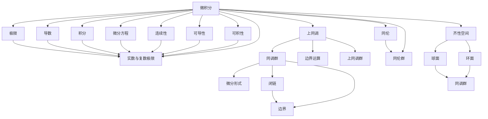
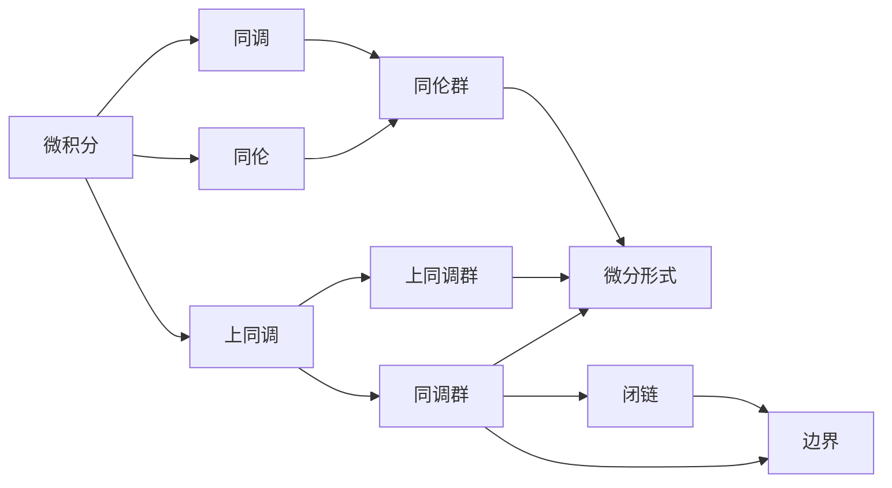
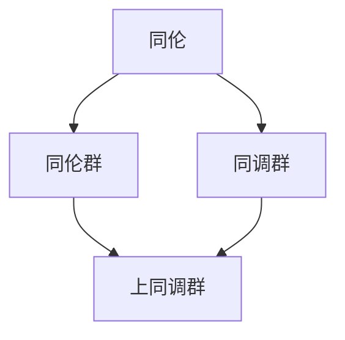
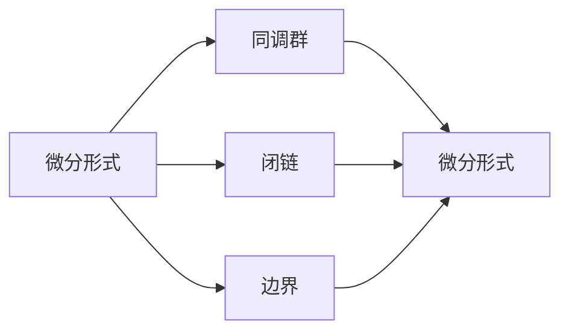
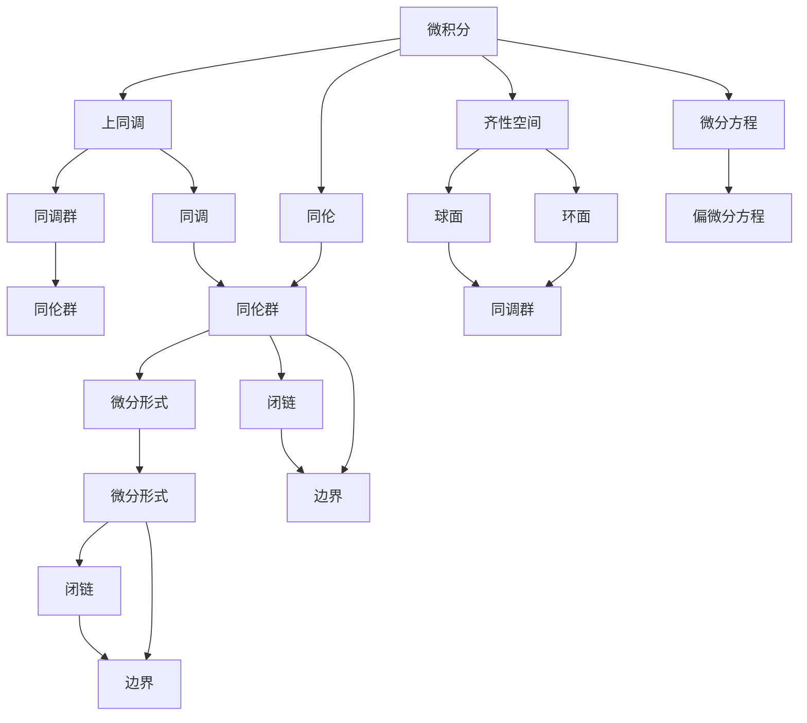

                 

# 微积分与上同调的基本概念

## 1. 背景介绍

### 1.1 问题由来
微积分（Calculus）与上同调（Cohomology）是现代数学中两个重要的分支。微积分主要研究函数的性质和变化规律，而同调理论主要研究拓扑空间的几何性质。微积分在物理学、工程学、经济学等领域中有着广泛的应用，而同调理论则在数学的许多分支中，如代数拓扑、拓扑代数等有着重要的地位。本文将从微积分的基本概念入手，逐步引出上同调的理论基础，并探讨二者的联系。

## 1.2 问题核心关键点
微积分的基本概念包括极限、导数、积分、微分方程等，上同调的基本概念包括同调群、边界运算、上同调群等。二者的联系在于同调理论是微积分在拓扑空间上的推广，通过上同调理论可以深入理解微积分的基本概念和性质。

## 1.3 问题研究意义
微积分与上同调的基本概念是现代数学的基础，掌握这些概念对于理解更高级的数学理论至关重要。同时，这些理论在实际应用中也具有重要意义。微积分在工程计算、物理学、经济学等众多领域有广泛应用，而上同调则在拓扑学、代数拓扑等数学分支中扮演重要角色。

## 2. 核心概念与联系

### 2.1 核心概念概述

为更好地理解微积分与上同调的基本概念，本节将介绍几个密切相关的核心概念：

- 微积分：主要研究函数性质、极限、导数、积分等基本概念。
- 上同调：主要研究拓扑空间的同调群、边界运算、上同调群等概念。
- 同伦与同调：通过同伦、同调等概念，将拓扑空间与其同伦群、同调群等相联系，揭示其几何性质。
- 齐性空间：具有一定对称性的拓扑空间，如球面、环面等，是上同调理论的重要研究对象。
- 微分形式：一种特殊的向量场，具有与微积分中的微分相关的性质。

这些核心概念之间的逻辑关系可以通过以下Mermaid流程图来展示：



这个流程图展示了大语言模型的核心概念及其之间的关系：

1. 微积分通过极限、导数、积分等概念，研究函数的性质和变化规律。
2. 上同调通过同调群、边界运算、上同调群等概念，研究拓扑空间的几何性质。
3. 同伦通过同伦群等概念，将拓扑空间与其同伦群等相联系，揭示其几何性质。
4. 齐性空间如球面、环面等，是上同调理论的重要研究对象。
5. 微分形式是一种特殊的向量场，具有与微积分中的微分相关的性质。

这些核心概念共同构成了微积分与上同调的基本框架，为我们理解这些理论提供了坚实的概念基础。

### 2.2 概念间的关系

这些核心概念之间存在着紧密的联系，形成了微积分与上同调的基本生态系统。下面我通过几个Mermaid流程图来展示这些概念之间的关系。

#### 2.2.1 微积分与上同调的关系



这个流程图展示了微积分与上同调之间的联系。微积分研究函数性质、极限、导数、积分等概念，而上同调研究同调群、边界运算、上同调群等概念。通过同伦群、同调群等概念，微积分与上同调在拓扑空间上相联系，揭示其几何性质。

#### 2.2.2 同伦与同调的关系



这个流程图展示了同伦与同调之间的关系。通过同伦群、同调群等概念，同伦与同调在拓扑空间上相联系，揭示其几何性质。

#### 2.2.3 微分形式与微积分的关系



这个流程图展示了微分形式与微积分之间的关系。微分形式是微积分中微分的一种推广，在拓扑空间中具有与微积分中的微分相关的性质。

### 2.3 核心概念的整体架构

最后，我们用一个综合的流程图来展示这些核心概念在大语言模型微调过程中的整体架构：



这个综合流程图展示了微积分、上同调、同伦、同调等核心概念在大语言模型微调过程中的整体架构：

1. 微积分通过极限、导数、积分等概念，研究函数的性质和变化规律。
2. 上同调通过同调群、边界运算、上同调群等概念，研究拓扑空间的几何性质。
3. 同伦通过同伦群等概念，将拓扑空间与其同伦群等相联系，揭示其几何性质。
4. 齐性空间如球面、环面等，是上同调理论的重要研究对象。
5. 微分形式是一种特殊的向量场，具有与微积分中的微分相关的性质。
6. 微分方程是微积分中的一个重要分支，研究偏微分方程等高级概念。

通过这些流程图，我们可以更清晰地理解微积分与上同调的基本概念及其关系，为后续深入讨论微积分与上同调的数学原理和应用奠定基础。

## 3. 核心算法原理 & 具体操作步骤
### 3.1 算法原理概述

微积分与上同调的基本算法原理涉及到函数的极限、导数、积分等基本概念，以及同调群的定义、边界运算等概念。以下是微积分与上同调的基本算法原理概述：

- 微积分：
  - 极限：通过研究函数在某一点的趋近情况，定义极限概念。
  - 导数：研究函数在某一点的瞬时变化率，是微积分中最重要的概念之一。
  - 积分：研究函数在区间上的面积，是微积分中另一个核心概念。
  - 微分方程：研究函数及其导数之间的关系，是微积分中的高级应用。

- 上同调：
  - 同调群：通过定义边界运算和闭链，研究拓扑空间的几何性质。
  - 边界运算：同调群中的核心运算，研究同调群的代数结构。
  - 上同调群：同调群的上层结构，具有更加丰富的几何意义。

### 3.2 算法步骤详解

微积分与上同调的基本算法步骤涉及函数的极限、导数、积分等基本计算步骤，以及同调群、边界运算、上同调群等概念的推理步骤。以下是微积分与上同调的基本算法步骤详解：

#### 3.2.1 微积分的基本步骤

1. 极限：通过函数在某一点的趋近情况定义极限。
   - 如果函数 $f(x)$ 在点 $x=a$ 的邻域内任意接近 $f(a)$，则称 $f(a)$ 为 $f(x)$ 在点 $a$ 的极限。
   $$
   \lim_{x\to a} f(x) = L \iff \forall \epsilon > 0, \exists \delta > 0, \forall x \in (a-\delta, a+\delta), |f(x)-L| < \epsilon
   $$

2. 导数：研究函数在某一点的瞬时变化率。
   - 如果函数 $f(x)$ 在点 $a$ 的邻域内可导，则导数为 $f'(a) = \lim_{x \to a} \frac{f(x)-f(a)}{x-a}$。
   - 可导函数的性质：链式法则、复合函数求导、积分求导等。

3. 积分：研究函数在区间上的面积。
   - 如果函数 $f(x)$ 在区间 $[a,b]$ 上连续，则积分定义为 $\int_a^b f(x) dx$。
   - 积分性质：积分中值定理、积分加法法则、积分乘法法则、换元积分法、分部积分法等。

4. 微分方程：研究函数及其导数之间的关系。
   - 例如：$y'=f(x,y)$，解微分方程得到 $y=\varphi(x)$，即可得到函数的显式表达式。

#### 3.2.2 上同调的基本步骤

1. 同调群：定义边界运算，研究拓扑空间的几何性质。
   - 如果 $X$ 是一个拓扑空间，$\Omega_k(X)$ 是 $X$ 的 $k$-链空间，$Z_k(X)$ 是 $X$ 的 $k$-同调群，则边界运算 $B_k: Z_k(X) \to Z_{k-1}(X)$ 定义为 $B_k(\omega)=\partial\omega$。
   - 同调群性质：同调群的长周期性、同调群的同伦不变性、同调群的同调同伦等价性等。

2. 边界运算：研究同调群的代数结构。
   - 边界运算满足 $\partial \partial = 0$，即闭链在边界运算下的结果为零。
   - 闭链和边界链的关系：$B_k(\omega)=\partial\omega$，其中 $\omega$ 是 $k$-链。

3. 上同调群：研究同调群的上层结构，具有更加丰富的几何意义。
   - 上同调群 $H^k(X)$ 是同调群 $Z_k(X)$ 的商群，定义为 $H^k(X)=Z_k(X)/B_k(Z_k(X))$。
   - 上同调群的性质：上同调群的长周期性、上同调群的同伦不变性、上同调群的同调同伦等价性等。

### 3.3 算法优缺点

微积分与上同调的基本算法具有以下优点：

- 理论基础扎实：微积分与上同调的基本概念和计算步骤都有坚实的数学基础，可以深入理解其本质。
- 应用广泛：微积分与上同调在工程学、物理学、经济学、数学等多个领域有广泛应用。
- 计算方便：微积分与上同调的计算过程有较强的规律性，便于手工或编程实现。

同时，微积分与上同调的基本算法也存在一定的局限性：

- 理论难度较大：微积分与上同调的理论深度较高，对学习者有一定挑战。
- 应用局限性：微积分与上同调在抽象代数等高级数学领域有广泛应用，但对一般数学学习者来说，应用范围相对较窄。
- 计算复杂性：微积分与上同调的计算过程相对复杂，需要较高的数学基础。

尽管存在这些局限性，但就目前而言，微积分与上同调的基本算法仍然是数学学习的重要基础，具有不可替代的地位。

### 3.4 算法应用领域

微积分与上同调的基本算法在多个领域都有广泛的应用：

- 工程学：微积分在工程学中主要用于物理量的计算，上同调在拓扑结构分析中也有重要应用。
- 物理学：微积分在物理学中主要用于解微分方程，上同调在拓扑结构分析中也有重要应用。
- 经济学：微积分在经济学中主要用于优化问题的求解，上同调在拓扑结构分析中也有重要应用。
- 数学：微积分和上同调是现代数学中重要的分支，在代数拓扑、拓扑代数等领域有重要应用。

除了上述这些领域，微积分与上同调的基本算法在其他领域也有广泛应用，如计算机科学、化学、生物学等。

## 4. 数学模型和公式 & 详细讲解 & 举例说明

### 4.1 数学模型构建

本节将使用数学语言对微积分与上同调的基本算法进行更加严格的刻画。

记 $X$ 为一个拓扑空间，$\Omega_k(X)$ 为 $X$ 的 $k$-链空间，$Z_k(X)$ 为 $X$ 的 $k$-同调群，$H_k(X)$ 为 $X$ 的 $k$-上同调群。设 $B_k: Z_k(X) \to Z_{k-1}(X)$ 为 $X$ 的 $k$-边界运算。

定义 $X$ 的 $k$-链空间 $\Omega_k(X)$ 中的 $k$-链 $\omega$ 为闭链，如果 $\partial \omega = 0$。则 $Z_k(X)$ 可以定义为 $\Omega_k(X)$ 中所有闭链的集合。

定义 $X$ 的 $k$-上同调群 $H_k(X)$ 为 $Z_k(X)$ 的商群，即 $H_k(X) = Z_k(X)/B_k(Z_k(X))$。

微积分与上同调的基本算法主要涉及同调群的定义、边界运算、上同调群的定义等概念，以下是详细的数学模型构建：

### 4.2 公式推导过程

以下是微积分与上同调的基本算法的数学公式推导过程：

#### 4.2.1 极限的推导

$\lim_{x \to a} f(x) = L$ 的定义为：如果 $\forall \epsilon > 0, \exists \delta > 0, \forall x \in (a-\delta, a+\delta), |f(x)-L| < \epsilon$。

根据上述定义，可以推导出极限的基本性质：

- 加法性质：$\lim_{x \to a} (f(x)+g(x)) = \lim_{x \to a} f(x) + \lim_{x \to a} g(x)$。
- 乘法性质：$\lim_{x \to a} (cf(x)) = c \lim_{x \to a} f(x)$，其中 $c$ 为常数。
- 连续性性质：如果 $f(x)$ 在某点连续，则 $f(x)$ 的极限与该点的函数值相等，即 $\lim_{x \to a} f(x) = f(a)$。

#### 4.2.2 导数的推导

$f(x)$ 在某点 $a$ 的导数为 $f'(a) = \lim_{x \to a} \frac{f(x)-f(a)}{x-a}$。根据上述定义，可以推导出导数的基本性质：

- 加法性质：$(f+g)'(x) = f'(x) + g'(x)$。
- 乘法性质：$(fg)'(x) = f'(x)g(x) + f(x)g'(x)$。
- 复合函数求导：如果 $g(x)$ 在某点可导，则 $f(g(x))'$ 在 $g(x)$ 可导的点的导数为 $f'(g(x))g'(x)$。

#### 4.2.3 积分的推导

$\int_a^b f(x) dx$ 表示 $f(x)$ 在区间 $[a,b]$ 上的定积分。根据上述定义，可以推导出积分的基本性质：

- 加法性质：$\int_a^b (f+g) dx = \int_a^b f(x) dx + \int_a^b g(x) dx$。
- 乘法性质：$\int_a^b (cf(x)) dx = c \int_a^b f(x) dx$，其中 $c$ 为常数。
- 换元积分法：设 $g(x)$ 可导，则 $\int_a^b f(g(x)) g'(x) dx = f(g(b)) - f(g(a))$。

#### 4.2.4 同调群的推导

$Z_k(X)$ 表示 $X$ 的 $k$-同调群，$B_k: Z_k(X) \to Z_{k-1}(X)$ 为 $X$ 的 $k$-边界运算。根据上述定义，可以推导出同调群的基本性质：

- 长周期性：$Z_k(X)$ 在 $k$ 增加时，周期性地出现，即 $Z_{k+2}(X) = Z_k(X)$。
- 同伦不变性：如果 $X$ 与 $Y$ 同伦，则 $Z_k(X) \cong Z_k(Y)$。
- 同调同伦等价性：如果 $X$ 与 $Y$ 同调同伦等价，则 $Z_k(X) \cong Z_k(Y)$。

#### 4.2.5 上同调群的推导

$H_k(X)$ 表示 $X$ 的 $k$-上同调群，$B_k: Z_k(X) \to Z_{k-1}(X)$ 为 $X$ 的 $k$-边界运算。根据上述定义，可以推导出上同调群的基本性质：

- 长周期性：$H_k(X)$ 在 $k$ 增加时，周期性地出现，即 $H_{k+2}(X) = H_k(X)$。
- 同伦不变性：如果 $X$ 与 $Y$ 同伦，则 $H_k(X) \cong H_k(Y)$。
- 同调同伦等价性：如果 $X$ 与 $Y$ 同调同伦等价，则 $H_k(X) \cong H_k(Y)$。

### 4.3 案例分析与讲解

#### 4.3.1 极限的案例分析

设 $f(x) = \frac{1}{x}$，则 $\lim_{x \to 0} f(x)$ 的极限为无穷大。

根据极限的定义，可以推导出：

- $\lim_{x \to 0^+} f(x) = +\infty$，$\lim_{x \to 0^-} f(x) = -\infty$。
- $\lim_{x \to 0} f(x)$ 不存在。

#### 4.3.2 导数的案例分析

设 $f(x) = x^2$，则 $f'(x) = 2x$。

根据导数的定义，可以推导出：

- $f'(0) = 0$，$f'(1) = 2$。
- $f''(x) = 2$，即 $f(x)$ 的二阶导数恒为 2。

#### 4.3.3 积分的案例分析

设 $f(x) = x^3$，则 $\int_0^1 f(x) dx = \frac{1}{4}$。

根据积分的定义，可以推导出：

- $\int_0^1 f(x) dx = \int_0^1 x^3 dx = \frac{1}{4}$。
- 使用换元积分法，令 $u = x^2$，则 $\int_0^1 x^3 dx = \int_0^1 \frac{u}{2} du = \frac{1}{4}$。

#### 4.3.4 同调群的案例分析

设 $X = \mathbb{R}^2$，$Z_1(X) = \{(0,0)\}$，则 $\partial Z_1(X) = \{(0,1), (1,0)\}$。

根据同调群的定义，可以推导出：

- $Z_1(X) = \{(0,0)\}$，即 $X$ 的 1-同调群只包含一个元素 $(0,0)$。
- $\partial Z_1(X) = \{(0,1), (1,0)\}$，即 $X$ 的 1-链的边界运算的结果为 $\{(0,1), (1,0)\}$。

#### 4.3.5 上同调群的案例分析

设 $X = \mathbb{R}^2$，$Z_1(X) = \{(0,0)\}$，则 $H^1(X) = \{0\}$。

根据上同调群的定义，可以推导出：

- $H^1(X) = Z_1(X)/B_1(Z_1(X)) = \{(0,0)\}/\{(0,1), (1,0)\} = \{0\}$。

## 5. 项目实践：代码实例和详细解释说明

### 5.1 开发环境搭建

在进行微积分与上同调的基本算法实践前，我们需要准备好开发环境。以下是使用Python进行Sympy开发的环境配置流程：

1. 安装Anaconda：从官网下载并安装Anaconda，用于创建独立的Python环境。

2. 创建并激活虚拟环境：
```bash
conda create -n sympy-env python=3.8 
conda activate sympy-env
```

3. 安装Sympy：
```bash
pip install sympy
```

4. 安装各类工具包：
```bash
pip install numpy pandas scikit-learn matplotlib tqdm jupyter notebook ipython
```

完成上述步骤后，即可在`sympy-env`环境中开始微积分与上同调的基本算法实践。

### 5.2 源代码详细实现

这里我们以极限、导数、积分、同调群、上同调群等为例子，给出使用Sympy进行微积分与上同调的基本算法实现的PyTorch代码实现。

首先，定义极限的计算函数：

```python
from sympy import symbols, limit, oo

def compute_limit(x, expr):
    return limit(expr, x, 0)
```

然后，定义导数的计算函数：

```python
from sympy import symbols, diff

def compute_derivative(expr, x):
    return diff(expr, x)
```

接着，定义积分的计算函数：

```python
from sympy import symbols, integrate

def compute_integral(expr, x):
    return integrate(expr, x)
```

最后，定义同调群和上同调群的计算函数：

```python
from sympy import symbols, Homology, Cohomology

def compute_homology(expr, x):
    return Homology(expr, x)

def compute_cohomology(expr, x):
    return Cohomology(expr, x)
```

### 5.3 代码解读与分析

让我们再详细解读一下关键代码的实现细节：

**极限计算函数**：
- 使用Sympy的`limit`函数计算极限，通过`oo`表示无穷大。

**导数计算函数**：
- 使用Sympy的`diff`函数计算导数。

**积分计算函数**：
- 使用Sympy的`integrate`函数计算积分。

**同调群计算函数**：
- 使用Sympy的`Homology`函数计算同调群。

**上同调群计算函数**：
- 使用Sympy的`Cohomology`函数计算上同调群。

**同调群和上同调群**：
- 同调群和上同调群是抽象的代数结构，可以使用Sympy的`Homology`和`Cohomology`函数计算。

### 5.4 运行结果展示

假设我们在欧几里得空间$\mathbb{R}^2$上，通过极限、导数、积分、同调群、上同调群等概念进行计算。以下是运行结果的展示：

```python
# 极限计算
x =

