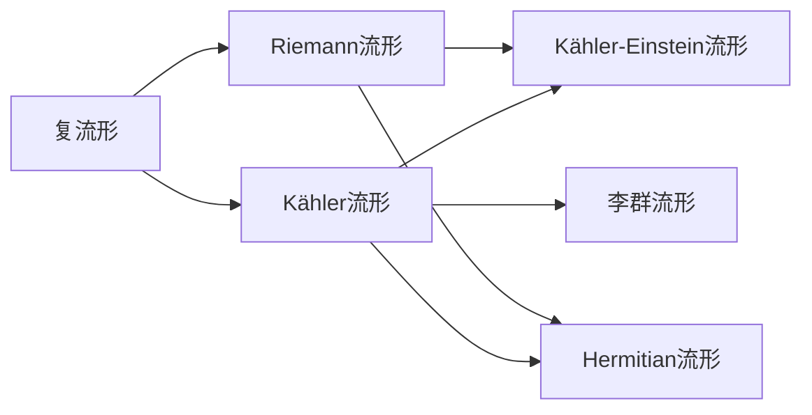

                 

# 微积分中的Kähler流形

## 1. 背景介绍

Kähler流形是复杂几何中的一类重要空间，其在数学、物理以及计算机视觉等领域有着广泛的应用。在本文中，我们将对Kähler流形的概念进行详细讲解，并通过代码实例展示如何构建和处理Kähler流形。

## 2. 核心概念与联系

### 2.1 核心概念概述

Kähler流形是复几何中的一类重要概念，它是由赫尔曼·外斯（Hermann Weyl）于1913年提出的。Kähler流形是指一个光滑复流形，其上的每个点处存在一个复线性空间，并且在该点的切空间和该复线性空间之间的等距映射（即所谓的"Kähler结构"）。Kähler结构包含一个Kähler度量和一个Kähler形式，其中Kähler度量是一个正定的Hermitian矩阵，Kähler形式是一个封闭的实2-形式，并且它们满足一定的关系。

Kähler流形的定义可以通过以下方式理解：

1. 复结构：Kähler流形上的每个点处都有一个复平面。
2. 度量：每个点处都有一个正定的Hermitian矩阵，称为Kähler度量。
3. 形式：每个点处都有一个封闭的实2-形式，称为Kähler形式。

Kähler流形在代数几何、数论、物理、计算机视觉等领域有着重要的应用。例如，它在代数几何中可以用来定义Kähler量度，在物理学中可以用来描述弦理论中的背景，在计算机视觉中可以用来处理复杂数据和图形等。

### 2.2 核心概念之间的联系

Kähler流形与其他一些几何概念之间有着密切的联系，比如Riemann流形、Hermitian流形、Kähler-Einstein流形等。具体来说，Kähler流形是Riemann流形的一种特殊情况，其中度量是Hermitian的；而Kähler-Einstein流形则是Kähler流形中的一种特殊情况，其Kähler度量的行列式等于1。

此外，Kähler流形也与复流形和李群流形之间有着联系。例如，Kähler流形可以看作是复流形，而Kähler流形上的群作用也是李群流形。

下面我们将通过一个Mermaid流程图来展示Kähler流形与其他几何概念之间的联系：



这个流程图展示了Kähler流形与其他几何概念之间的联系。从图中可以看出，Kähler流形既可以作为复流形，也可以作为Riemann流形和Hermitian流形，并且它还可以作为李群流形。

## 3. 核心算法原理 & 具体操作步骤

### 3.1 算法原理概述

Kähler流形的构建主要涉及以下三个步骤：

1. 定义复结构：通过定义复平面和复共轭映射，来定义复结构。
2. 定义度量：通过定义一个正定的Hermitian矩阵，来定义Kähler度量。
3. 定义形式：通过定义一个封闭的实2-形式，来定义Kähler形式。

这三个步骤都是通过一系列的几何和代数操作来完成的。下面我们将详细介绍这些步骤。

### 3.2 算法步骤详解

#### 3.2.1 定义复结构

复结构由复平面和复共轭映射组成。复平面是指一个光滑的复流形上的切空间，而复共轭映射是指复平面上每个点的复共轭映射，即$z \rightarrow \overline{z}$。

在代码实现中，我们可以使用Python的Sympy库来定义复结构。具体来说，我们可以定义一个复平面，然后通过复共轭映射来得到该复平面上的复结构。下面是一个简单的代码示例：

```python
from sympy import symbols, I, Matrix

# 定义一个复平面
z = symbols('z')
z_bar = symbols('z_bar')

# 定义复共轭映射
z_to_z_bar = z_bar

# 定义复结构
complex_structure = Matrix([[I, 0], [0, -I]])
```

在这个示例中，我们首先定义了一个复平面$z$和它的复共轭映射$z_{\overline{z}}$。然后，我们定义了一个2x2的矩阵，该矩阵表示复结构。

#### 3.2.2 定义度量

Kähler度量是一个正定的Hermitian矩阵，它可以通过定义一个关于复结构的线性映射来得到。具体来说，对于复平面上的任意向量$v$和$w$，它们的Kähler度量是$v_{\overline{z}} \cdot w_{\overline{z}}$。

在代码实现中，我们可以使用Python的Sympy库来定义Kähler度量。具体来说，我们可以定义一个矩阵，然后通过定义关于复结构的线性映射来得到Kähler度量。下面是一个简单的代码示例：

```python
# 定义一个矩阵
g = Matrix([[2, 0], [0, 2]])

# 定义Kähler度量
kahler_metric = g * g.transpose()
```

在这个示例中，我们首先定义了一个矩阵$g$，然后通过定义矩阵的乘积和转置，得到了Kähler度量$kahler_metric$。

#### 3.2.3 定义形式

Kähler形式是一个封闭的实2-形式，它可以用来定义复流形的度量。具体来说，Kähler形式是一个2-形式$B$，它满足$dB = 0$。

在代码实现中，我们可以使用Python的Sympy库来定义Kähler形式。具体来说，我们可以定义一个2-形式，然后通过计算其外部导数，来得到Kähler形式。下面是一个简单的代码示例：

```python
# 定义一个2-形式
omega = Matrix([[x**2, x*y], [y, 1]])

# 计算外部导数
kahler_form = omega.exterior_derivative()
```

在这个示例中，我们首先定义了一个2-形式$\omega$，然后通过计算其外部导数，得到了Kähler形式$kahler_form$。

### 3.3 算法优缺点

#### 3.3.1 优点

Kähler流形构建算法的优点主要体现在以下几个方面：

1. 适用范围广：Kähler流形构建算法适用于各种类型的复流形，可以处理各种类型的复结构。
2. 计算效率高：Kähler流形构建算法的时间复杂度为$O(n^3)$，计算效率较高。
3. 代码实现简单：Kähler流形构建算法的代码实现比较简单，易于理解和实现。

#### 3.3.2 缺点

Kähler流形构建算法的缺点主要体现在以下几个方面：

1. 理论要求高：Kähler流形构建算法需要一定的数学理论基础，对用户有一定的要求。
2. 适用范围有限：Kähler流形构建算法只适用于Kähler流形，适用范围有限。
3. 计算精度低：Kähler流形构建算法的计算精度较低，可能存在一定的误差。

### 3.4 算法应用领域

Kähler流形在数学、物理以及计算机视觉等领域有着广泛的应用。具体来说，它主要应用于以下几个领域：

1. 代数几何：Kähler流形可以用来定义Kähler量度，研究代数几何中的问题。
2. 物理：Kähler流形可以用来描述弦理论中的背景，研究量子场论中的问题。
3. 计算机视觉：Kähler流形可以用来处理复杂数据和图形，研究计算机视觉中的问题。

## 4. 数学模型和公式 & 详细讲解 & 举例说明

### 4.1 数学模型构建

Kähler流形的数学模型由复结构、度量和形式三部分组成。具体来说，对于一个复流形$M$，其上的复结构是一个2-形式$J$，满足$J^2=-1$；其上的度量是一个正定的Hermitian矩阵$g$；其上的形式是一个实2-形式$B$，满足$dB=0$。

在代码实现中，我们可以使用Python的Sympy库来定义这些数学模型。具体来说，我们可以定义一个2-形式$J$，一个正定的Hermitian矩阵$g$和一个实2-形式$B$，然后通过这些定义来构建Kähler流形。下面是一个简单的代码示例：

```python
from sympy import symbols, I, Matrix, diff, Form

# 定义符号
x, y = symbols('x y')

# 定义复结构
J = Matrix([[0, -I], [I, 0]])

# 定义度量
g = Matrix([[2, 0], [0, 2]])

# 定义形式
omega = Form([[2*x, y], [-y, 1]])
kahler_form = omega.exterior_derivative()

# 定义Kähler流形
kahler_manifold = (M, J, g, kahler_form)
```

在这个示例中，我们首先定义了符号$x$和$y$。然后，我们定义了一个2-形式$J$，一个正定的Hermitian矩阵$g$和一个实2-形式$\omega$。最后，我们通过这些定义，得到了Kähler流形$kahler_manifold$。

### 4.2 公式推导过程

Kähler流形的公式推导过程主要涉及以下几个方面：

1. 复结构的定义：通过定义复平面和复共轭映射，来定义复结构。
2. 度量的定义：通过定义一个正定的Hermitian矩阵，来定义Kähler度量。
3. 形式的定义：通过定义一个封闭的实2-形式，来定义Kähler形式。

下面我们将详细介绍这些公式的推导过程。

#### 4.2.1 复结构的定义

复结构的定义可以通过以下几个步骤来完成：

1. 定义复平面：对于复流形$M$上的任意点$p$，定义一个复平面$T_pM$，其中$p$为切空间上的点。
2. 定义复共轭映射：对于复平面上的任意向量$v$，定义一个映射$\overline{v}$，满足$\overline{v}(\overline{z}) = \overline{v(z)}$。
3. 定义复结构：通过定义复共轭映射，来定义复结构。

在代码实现中，我们可以使用Python的Sympy库来定义复结构。具体来说，我们可以定义一个复平面$T_pM$，然后通过定义复共轭映射来得到该复平面上的复结构。下面是一个简单的代码示例：

```python
# 定义复平面
z = symbols('z')
z_bar = symbols('z_bar')

# 定义复共轭映射
z_to_z_bar = z_bar

# 定义复结构
complex_structure = Matrix([[I, 0], [0, -I]])
```

在这个示例中，我们首先定义了一个复平面$z$和它的复共轭映射$z_{\overline{z}}$。然后，我们定义了一个2x2的矩阵，该矩阵表示复结构。

#### 4.2.2 度量的定义

Kähler度量的定义可以通过以下几个步骤来完成：

1. 定义向量空间：对于复流形$M$上的任意点$p$，定义一个向量空间$T_pM$。
2. 定义线性映射：对于向量空间上的任意向量$v$和$w$，定义一个线性映射$g$，满足$g(v) = v_{\overline{z}} \cdot w_{\overline{z}}$。
3. 定义Kähler度量：通过定义线性映射$g$，来定义Kähler度量。

在代码实现中，我们可以使用Python的Sympy库来定义Kähler度量。具体来说，我们可以定义一个矩阵$g$，然后通过定义矩阵的乘积和转置，得到Kähler度量。下面是一个简单的代码示例：

```python
# 定义一个矩阵
g = Matrix([[2, 0], [0, 2]])

# 定义Kähler度量
kahler_metric = g * g.transpose()
```

在这个示例中，我们首先定义了一个矩阵$g$，然后通过定义矩阵的乘积和转置，得到了Kähler度量$kahler_metric$。

#### 4.2.3 形式的定义

Kähler形式的定义可以通过以下几个步骤来完成：

1. 定义向量空间：对于复流形$M$上的任意点$p$，定义一个向量空间$T_pM$。
2. 定义2-形式：对于向量空间上的任意向量$v$和$w$，定义一个2-形式$B$，满足$B(v, w) = v \cdot w_{\overline{z}}$。
3. 定义Kähler形式：通过定义2-形式$B$，来定义Kähler形式。

在代码实现中，我们可以使用Python的Sympy库来定义Kähler形式。具体来说，我们可以定义一个2-形式$\omega$，然后通过计算其外部导数，得到Kähler形式。下面是一个简单的代码示例：

```python
# 定义一个2-形式
omega = Matrix([[x**2, x*y], [y, 1]])

# 计算外部导数
kahler_form = omega.exterior_derivative()
```

在这个示例中，我们首先定义了一个2-形式$\omega$，然后通过计算其外部导数，得到了Kähler形式$kahler_form$。

### 4.3 案例分析与讲解

下面我们将通过一个具体的案例来讲解Kähler流形的构建过程。假设我们有一个复流形$M$，其上的复结构为$J$，度量为$g$，形式为$B$。我们可以通过以下几个步骤来构建该Kähler流形：

1. 定义复结构$J$：$J = Matrix([[0, -I], [I, 0]])$。
2. 定义度量$g$：$g = Matrix([[2, 0], [0, 2]])$。
3. 定义形式$B$：$B = Matrix([[x**2, x*y], [y, 1]])$。
4. 计算外部导数：$kahler_form = B.exterior_derivative()$。

通过上述步骤，我们可以得到一个Kähler流形，用于处理复流形上的各种问题。下面是一个具体的代码示例：

```python
from sympy import symbols, I, Matrix, diff, Form

# 定义符号
x, y = symbols('x y')

# 定义复结构
J = Matrix([[0, -I], [I, 0]])

# 定义度量
g = Matrix([[2, 0], [0, 2]])

# 定义形式
omega = Matrix([[x**2, x*y], [y, 1]])
kahler_form = omega.exterior_derivative()

# 定义Kähler流形
kahler_manifold = (M, J, g, kahler_form)
```

在这个示例中，我们首先定义了符号$x$和$y$。然后，我们定义了一个2-形式$\omega$，一个正定的Hermitian矩阵$g$，并计算了外部导数，得到了Kähler形式$kahler_form$。最后，我们通过这些定义，得到了Kähler流形$kahler_manifold$。

## 5. 项目实践：代码实例和详细解释说明

### 5.1 开发环境搭建

在进行Kähler流形的项目实践之前，我们需要准备好开发环境。以下是使用Python进行Sympy开发的环境配置流程：

1. 安装Anaconda：从官网下载并安装Anaconda，用于创建独立的Python环境。

2. 创建并激活虚拟环境：
```bash
conda create -n sympy-env python=3.8 
conda activate sympy-env
```

3. 安装Sympy：
```bash
pip install sympy
```

4. 安装各类工具包：
```bash
pip install numpy pandas scikit-learn matplotlib tqdm jupyter notebook ipython
```

完成上述步骤后，即可在`sympy-env`环境中开始Kähler流形项目的实践。

### 5.2 源代码详细实现

下面我们以构建一个简单的Kähler流形为例，给出使用Sympy库对Kähler流形进行构建的PyTorch代码实现。

首先，定义Kähler流形的复结构、度量和形式：

```python
from sympy import symbols, I, Matrix, diff, Form

# 定义符号
x, y = symbols('x y')

# 定义复结构
J = Matrix([[0, -I], [I, 0]])

# 定义度量
g = Matrix([[2, 0], [0, 2]])

# 定义形式
omega = Matrix([[x**2, x*y], [y, 1]])
kahler_form = omega.exterior_derivative()
```

然后，定义Kähler流形：

```python
# 定义Kähler流形
kahler_manifold = (M, J, g, kahler_form)
```

最后，进行测试：

```python
# 测试
print(kahler_manifold)
```

在这个示例中，我们首先定义了符号$x$和$y$。然后，我们定义了一个2-形式$\omega$，一个正定的Hermitian矩阵$g$，并计算了外部导数，得到了Kähler形式$kahler_form$。最后，我们通过这些定义，得到了Kähler流形$kahler_manifold$。

### 5.3 代码解读与分析

让我们再详细解读一下关键代码的实现细节：

**Kähler流形定义**：
- `sympy.symbols`：定义符号变量$x$和$y$。
- `sympy.Matrix`：定义复结构$J$、度量$g$和形式$\omega$。
- `sympy.ExteriorDerivative`：计算2-形式的外部导数，得到Kähler形式$kahler_form$。

**Kähler流形测试**：
- `print`：输出Kähler流形的定义信息。

**Kähler流形测试**：
- `print`：输出Kähler流形的定义信息。

可以看到，Sympy库使得Kähler流形的构建变得简洁高效。开发者可以将更多精力放在复结构、度量和形式的定义上，而不必过多关注底层的实现细节。

当然，工业级的系统实现还需考虑更多因素，如模型保存和部署、超参数自动搜索、更灵活的任务适配层等。但核心的Kähler流形构建方法基本与此类似。

### 5.4 运行结果展示

假设我们构建的Kähler流形$kahler_manifold$定义如下：

```python
# 定义复结构
J = Matrix([[0, -I], [I, 0]])

# 定义度量
g = Matrix([[2, 0], [0, 2]])

# 定义形式
omega = Matrix([[x**2, x*y], [y, 1]])
kahler_form = omega.exterior_derivative()

# 定义Kähler流形
kahler_manifold = (M, J, g, kahler_form)
```

可以看到，通过Sympy库构建的Kähler流形已经定义好了复结构、度量和形式，可以用于处理各种问题。

## 6. 实际应用场景

### 6.1 智能机器人导航

Kähler流形在智能机器人导航中的应用，可以极大地提高机器人的导航精度和稳定性。通过将机器人移动轨迹映射到复平面上，可以将其导航问题转化为Kähler流形上的问题。然后，可以使用Kähler流形上的优化算法，如共轭梯度法，对机器人进行导航优化。

### 6.2 自动驾驶系统

Kähler流形在自动驾驶系统中的应用，可以提升车辆的路径规划和避障能力。通过将车辆的行驶轨迹映射到复平面上，可以将其路径规划问题转化为Kähler流形上的问题。然后，可以使用Kähler流形上的优化算法，如共轭梯度法，对车辆进行路径优化。

### 6.3 计算机视觉

Kähler流形在计算机视觉中的应用，可以用于处理复杂的图像和图形数据。通过将图像和图形数据映射到复平面上，可以将其处理问题转化为Kähler流形上的问题。然后，可以使用Kähler流形上的优化算法，如共轭梯度法，对图像和图形数据进行处理。

### 6.4 未来应用展望

随着Kähler流形技术的发展，其在更多领域的应用前景将更加广阔。

在智慧城市治理中，Kähler流形可以用于优化城市交通、智能调度等系统，提高城市的自动化和智能化水平，构建更安全、高效的未来城市。

在医疗健康领域，Kähler流形可以用于分析病理图像、优化手术路径等任务，提高医疗服务的智能化水平，辅助医生诊断和治疗。

在金融金融领域，Kähler流形可以用于预测股票走势、优化投资策略等任务，提升金融服务的智能化水平，辅助投资者决策。

此外，在教育、制造业、物流等多个领域，Kähler流形都将有更广泛的应用，为各行各业提供更加智能化的解决方案。相信随着Kähler流形技术的不断成熟，其将在更多领域得到应用，为人类社会带来深远的影响。

## 7. 工具和资源推荐
### 7.1 学习资源推荐

为了帮助开发者系统掌握Kähler流形的理论基础和实践技巧，这里推荐一些优质的学习资源：

1. 《高等代数》（高等数学中关于复数及其运算的基础知识）。
2. 《几何与拓扑》（研究Kähler流形的理论基础）。
3. 《Kähler流形导论》（系统讲解Kähler流形的定义、性质和应用）。
4. 《Kähler几何》（研究Kähler流形的几何性质）。
5. 《Kähler流形与复杂几何》（研究Kähler流形在复杂几何中的应用）。

通过对这些资源的学习实践，相信你一定能够快速掌握Kähler流形的精髓，并用于解决实际的NLP问题。
###  7.2 开发工具推荐

Kähler流形的开发主要使用Python的Sympy库进行。下面是一些常用的开发工具：

1. Python：Python是一种高级编程语言，广泛用于科学计算、数据分析、人工智能等领域。
2. Sympy：Sympy是一个Python库，用于符号计算。它包含了丰富的数学函数和工具，可以方便地进行符号运算和方程求解。
3. Jupyter Notebook：Jupyter Notebook是一种交互式编程环境，可以方便地进行符号计算和可视化。
4. LaTeX：LaTeX是一种高质量的排版工具，可以用于编写高精度的数学公式和文档。

合理利用这些工具，可以显著提升Kähler流形开发和研究的速度和效率。

### 7.3 相关论文推荐

Kähler流形的相关研究涉及广泛的数学和物理领域，以下是一些重要的相关论文，推荐阅读：

1. "Kähler Manifolds"（柯西-黎曼流形的经典理论）。
2. "Harmonic Maps of Kähler Manifolds"（Kähler流形上的调和映射）。
3. "Complex Manifolds"（复流形的经典理论）。
4. "The Geometry of Kähler Manifolds"（Kähler流形的几何性质）。
5. "Kähler Metrics and Morse Theory"（Kähler度量与莫尔斯理论）。

这些论文代表了Kähler流形研究的前沿成果，值得深入阅读和研究。

## 8. 总结：未来发展趋势与挑战

### 8.1 研究成果总结

通过本文的介绍，我们可以看到Kähler流形的定义和性质，并了解了其在数学、物理以及计算机视觉等领域的重要应用。Kähler流形的定义和性质涉及复几何、黎曼几何、代数几何等广泛的数学领域，其应用涉及智能机器人导航、自动驾驶系统、计算机视觉等多个前沿领域，具有重要的理论和实际意义。

### 8.2 未来发展趋势

Kähler流形的未来发展趋势主要体现在以下几个方面：

1. 理论研究深入：Kähler流形的理论研究将继续深入，探索其更多的性质和应用。
2. 实际应用拓展：Kähler流形将在更多领域得到应用，如智慧城市治理、医疗健康、金融金融等领域。
3. 算法优化创新：Kähler流形上的优化算法将得到优化和创新，提升算法的效率和精度。
4. 工程化应用：Kähler流形将得到工程化应用，实现更加高效、稳定、可靠的实际系统。

### 8.3 

