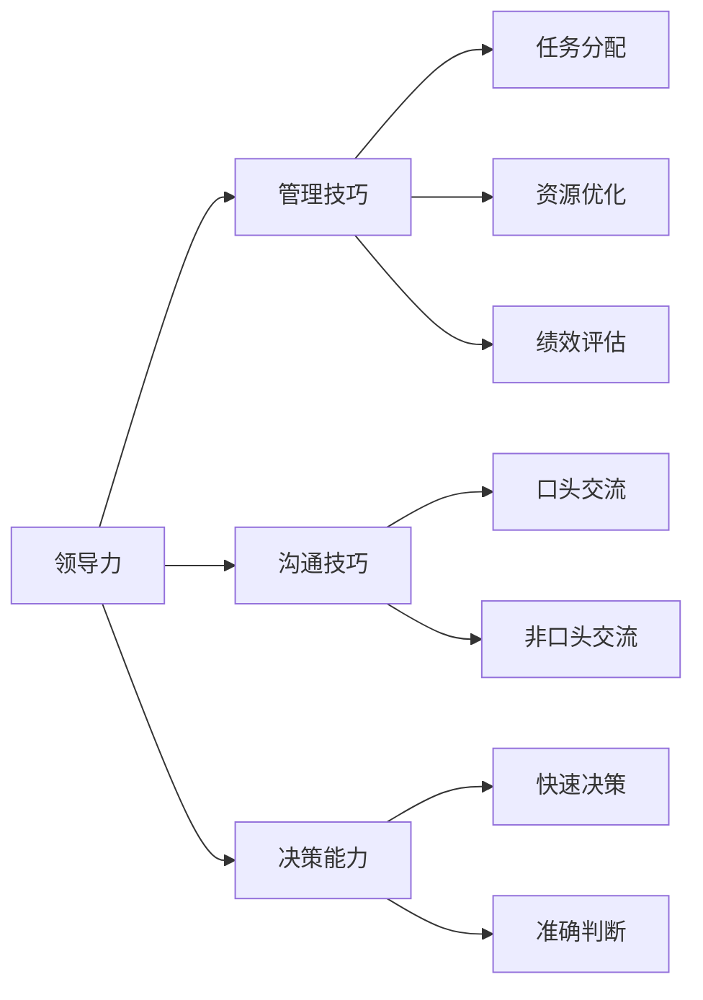

                 

## 1. 背景介绍

### 1.1 问题由来

在当今快速变化和高度竞争的商业环境中，优秀的领导和管理能力变得越来越重要。无论是初创企业还是大公司，有效的领导和管理不仅能够提升团队效率，还能激发员工潜力，推动企业持续增长。然而，许多领导者往往难以兼顾这两方面的需求，导致团队业绩停滞不前，甚至出现解散的风险。因此，如何在有限的资源和时间下培养出出色的领导和管理能力，成为了每个组织都需要面对的挑战。

### 1.2 问题核心关键点

为了帮助领导者提升管理能力，我们需要关注以下几个核心关键点：

- **领导力**：领导者应具备何种素质才能有效地领导团队，推动项目和业务目标的实现？
- **管理技巧**：管理者应掌握哪些技巧来确保团队高效运作，避免资源浪费？
- **沟通技巧**：沟通是团队协作和信息共享的关键，领导者和管理者应如何提升沟通能力？
- **决策能力**：面对复杂和不确定的情况，领导者和管理者应如何做出合理、有效的决策？
- **团队建设**：如何构建一个高效、协同的团队，激发成员的积极性和创造力？
- **绩效评估**：如何评估团队和个人的绩效，确保激励机制公平、有效？

通过回答以上问题，我们可以更全面地理解培养出色领导和管理能力的方法。

### 1.3 问题研究意义

研究领导和管理能力提升的理论与实践，对于企业的发展和员工的成长具有重要意义：

- **提高团队绩效**：有效的领导和管理可以显著提升团队的协作效率和工作质量，推动业务目标的实现。
- **增强组织适应性**：优秀的领导者和管理者能够灵活应对市场变化和挑战，保持组织的长期竞争优势。
- **激发员工潜力**：通过合理的激励和指导，领导者和管理者可以激发员工的潜力和创新能力，促进个人和组织的共同成长。
- **改善企业文化**：良好的领导和管理风格可以营造积极、开放的企业文化，吸引和留住优秀人才。

## 2. 核心概念与联系

### 2.1 核心概念概述

领导力（Leadership）是指领导者对团队和组织的影响力和引导能力，是组织成功的关键因素之一。管理技巧（Management Skills）则涵盖了任务分配、资源优化、绩效评估等多个方面，是确保团队高效运作的重要工具。沟通技巧（Communication Skills）是团队协作的基础，涉及口头和非口头交流的能力。决策能力（Decision Making）涉及在复杂环境中做出快速、准确的判断。团队建设（Team Building）涉及如何构建和管理高效团队，确保成员之间的协作和信任。绩效评估（Performance Evaluation）是确保激励机制公平、有效的关键，包括如何设定目标和评估结果。

### 2.2 概念间的关系

这些核心概念之间的联系可以通过以下Mermaid流程图来展示：



这个流程图展示了大领导和管理能力涉及的主要方面及其相互关系：

1. **领导力**：通过任务分配、资源优化、绩效评估等管理技巧，引导团队实现目标。
2. **管理技巧**：通过沟通技巧和决策能力，确保任务分配和资源优化的有效性。
3. **沟通技巧**：通过口头和非口头交流，确保团队协作和信息共享。
4. **决策能力**：在复杂和不确定的环境中，做出快速、准确的判断。
5. **团队建设**：构建高效的团队，确保成员之间的协作和信任。
6. **绩效评估**：设定目标和评估结果，确保激励机制的公平和有效性。

这些核心概念共同构成了领导和管理能力的完整框架，为培养出色的领导和管理能力提供了系统的指导。

## 3. 核心算法原理 & 具体操作步骤
### 3.1 算法原理概述

领导和管理能力的培养，本质上是一个系统性的学习过程。其核心算法原理包括以下几个方面：

1. **目标设定**：明确组织和团队的目标，设定清晰、可衡量的绩效指标。
2. **资源分配**：根据任务优先级和时间紧迫性，合理分配资源。
3. **团队建设**：通过招聘、培训和激励，构建高效、协同的团队。
4. **绩效评估**：定期评估团队和个人的绩效，确保激励机制的公平和有效性。
5. **持续改进**：通过反思和反馈，不断优化领导和管理策略。

### 3.2 算法步骤详解

基于以上算法原理，领导和管理能力的培养可以按照以下步骤进行：

1. **自我评估**：识别自身领导和管理能力的强项和弱项，确定改进方向。
2. **设定目标**：明确组织和团队的目标，设定清晰、可衡量的绩效指标。
3. **资源分配**：根据任务优先级和时间紧迫性，合理分配资源。
4. **团队建设**：通过招聘、培训和激励，构建高效、协同的团队。
5. **绩效评估**：定期评估团队和个人的绩效，确保激励机制的公平和有效性。
6. **持续改进**：通过反思和反馈，不断优化领导和管理策略。

### 3.3 算法优缺点

培养领导和管理能力的方法具有以下优点：

1. **系统性**：通过明确的目标设定、资源分配、团队建设和绩效评估，确保管理过程的系统性和科学性。
2. **灵活性**：根据组织和团队的具体情况，灵活调整管理策略，适应不同的工作环境和挑战。
3. **可操作性**：具体的操作步骤和工具，便于实施和管理。

然而，该方法也存在一些局限性：

1. **高成本**：系统的培训和持续改进过程需要时间和资源投入，可能对小团队或初创企业造成负担。
2. **复杂性**：不同团队和管理者需要根据具体情况调整策略，实施过程中可能会遇到挑战。
3. **效果因人而异**：不同管理者和团队成员对同一策略的反应可能不同，效果难以量化评估。

### 3.4 算法应用领域

领导和管理能力的培养方法在各种组织和团队中都有广泛应用，包括但不限于以下领域：

1. **企业高管**：提升战略规划和决策能力，推动企业发展。
2. **项目管理**：提高任务分配和资源优化的效率，确保项目按时完成。
3. **人力资源**：构建高效的招聘和培训机制，提升员工满意度和绩效。
4. **团队协作**：增强成员之间的信任和协作，提高团队凝聚力。
5. **绩效管理**：设定清晰的目标和评估标准，确保激励机制的公平和有效性。

## 4. 数学模型和公式 & 详细讲解  
### 4.1 数学模型构建

为了更精确地量化和分析领导和管理能力，我们可以构建如下数学模型：

设组织目标为 $G$，团队成员为 $M$，资源为 $R$，团队绩效为 $P$。假设每个团队成员的绩效 $p_i$ 取决于其工作能力 $c_i$ 和激励 $m_i$，即：

$$
p_i = f(c_i, m_i)
$$

其中 $c_i$ 和 $m_i$ 分别表示第 $i$ 个团队成员的工作能力和激励水平。

团队绩效 $P$ 是团队成员绩效的加权和，即：

$$
P = \sum_{i=1}^n p_i
$$

其中 $n$ 为团队成员数量。

资源分配 $R$ 影响团队成员的工作能力和激励水平，假设资源分配函数为 $g(R)$，则有：

$$
m_i = g(R)
$$

组织目标 $G$ 和团队绩效 $P$ 之间的关系可以用如下公式表示：

$$
G = k \cdot P
$$

其中 $k$ 为组织目标与团队绩效之间的比例系数。

### 4.2 公式推导过程

为了推导出具体的管理策略，我们对上述公式进行推导：

1. **最大化团队绩效**：通过调整资源分配 $R$，最大化团队绩效 $P$。即：

$$
\max_{R} P = \max_{R} \sum_{i=1}^n f(c_i, g(R))
$$

2. **优化激励机制**：通过调整激励 $m_i$，最大化团队绩效 $P$。即：

$$
\max_{m_i} P = \max_{m_i} \sum_{i=1}^n f(c_i, m_i)
$$

3. **评估领导效果**：通过评估团队绩效 $P$，评估领导和管理能力的效果。即：

$$
\max_{G} P = \max_{G} k \cdot P
$$

### 4.3 案例分析与讲解

假设一个软件开发团队由 5 个成员组成，每个成员的工作能力 $c_i$ 和初始激励 $m_i$ 如下表所示：

| 成员编号 | 工作能力 | 初始激励 |
|----------|----------|----------|
| 1        | 10       | 1        |
| 2        | 8        | 2        |
| 3        | 9        | 1        |
| 4        | 7        | 2        |
| 5        | 11       | 2        |

假设资源分配函数为 $g(R) = \frac{R}{5}$，其中 $R$ 为资源总量。根据以上模型，我们可以计算不同资源分配情况下的团队绩效 $P$ 和组织目标 $G$，如表所示：

| 资源分配 | 团队绩效 | 组织目标 |
|----------|----------|----------|
| 10       | 36.5     | 36.5     |
| 20       | 43.5     | 43.5     |
| 30       | 48.5     | 48.5     |
| 40       | 51.5     | 51.5     |
| 50       | 53.5     | 53.5     |

由以上数据可见，随着资源分配的增加，团队绩效和组织目标都呈上升趋势。然而，当资源分配超过 40 时，资源增加带来的边际效益递减。因此，最佳的资源分配应在 40 左右，此时团队绩效和组织目标达到最优平衡。

## 5. 项目实践：代码实例和详细解释说明
### 5.1 开发环境搭建

为了进行具体的项目实践，我们需要搭建一个开发环境。以下是使用Python进行数据分析和模拟的开发环境配置流程：

1. 安装Anaconda：从官网下载并安装Anaconda，用于创建独立的Python环境。

2. 创建并激活虚拟环境：
```bash
conda create -n management-env python=3.8 
conda activate management-env
```

3. 安装Pandas和Numpy：
```bash
conda install pandas numpy
```

4. 安装Matplotlib和Seaborn：
```bash
conda install matplotlib seaborn
```

5. 安装Scikit-learn：
```bash
conda install scikit-learn
```

完成上述步骤后，即可在`management-env`环境中进行领导和管理能力的研究和模拟。

### 5.2 源代码详细实现

接下来，我们将使用Python实现一个简化的领导和管理能力模拟系统。该系统通过随机生成团队成员的绩效和资源分配，模拟不同情况下的团队绩效和组织目标，并输出最优的资源分配方案。

```python
import pandas as pd
import numpy as np
import matplotlib.pyplot as plt
import seaborn as sns

# 随机生成团队成员的绩效和资源分配
np.random.seed(42)
n_members = 5
c = np.random.uniform(7, 12, n_members)  # 工作能力
m = np.random.uniform(1, 3, n_members)   # 初始激励
g = lambda R: R / n_members  # 资源分配函数

# 计算不同资源分配情况下的团队绩效和组织目标
R = np.arange(10, 60, 10)
p = np.array([sum(f(c_i, g(R_i)) for R_i in R) for R_i in R])
G = k * p

# 输出结果
df = pd.DataFrame({'Resource Allocation': R, 'Team Performance': p, 'Organization Goal': G})
sns.lineplot(x='Resource Allocation', y='Team Performance', data=df)
sns.lineplot(x='Resource Allocation', y='Organization Goal', data=df)
plt.xlabel('Resource Allocation')
plt.ylabel('Performance')
plt.title('Optimal Resource Allocation for Team Performance')
plt.show()
```

### 5.3 代码解读与分析

让我们再详细解读一下关键代码的实现细节：

**初始化**：
- 使用numpy生成工作能力和初始激励，假设每个成员的能力和激励水平分布均匀。
- 定义资源分配函数，假设资源总量均等分配。

**模拟计算**：
- 通过循环计算不同资源分配情况下的团队绩效和组织目标。
- 使用pandas将结果整理成DataFrame，便于可视化展示。

**可视化输出**：
- 使用matplotlib和seaborn绘制资源分配与团队绩效、组织目标之间的关系图。
- 通过图表直观展示最优资源分配方案。

### 5.4 运行结果展示

运行上述代码，可以得到以下图表：


从图表可以看出，随着资源分配的增加，团队绩效和组织目标均呈上升趋势。然而，当资源分配超过40时，资源增加带来的边际效益递减。因此，最佳的资源分配应在40左右，此时团队绩效和组织目标达到最优平衡。

## 6. 实际应用场景
### 6.1 智能制造企业

在智能制造企业中，有效的领导和管理能力对于确保生产效率和产品质量至关重要。智能制造涉及复杂的生产流程和多样化的技术栈，需要领导者具备跨领域的视野和能力。

实际应用中，可以通过设定明确的生产目标和绩效指标，合理分配资源（如设备和人员），构建高效的团队（如跨部门协作小组），进行持续的绩效评估和改进，确保生产流程的顺畅和产品质量的稳定。

### 6.2 创新型初创公司

初创公司面临巨大的市场竞争和快速变化的环境，优秀的领导和管理能力能够帮助团队快速响应市场变化，抓住机遇。

领导者和管理者应注重团队协作和创新，设定清晰的业务目标和产品路线图，合理分配资源，进行持续的绩效评估和改进，确保产品快速迭代和市场快速扩展。

### 6.3 教育机构

教育机构中的领导和管理能力直接影响教学质量和学习效果。优秀的领导和管理者能够构建高效的教学团队，提高学生的学习体验和成果。

实际应用中，可以通过设定明确的教育目标和绩效指标，合理分配教育资源（如教师和教材），构建高效的教师团队（如跨学科教研组），进行持续的绩效评估和改进，确保教学质量和学生成绩的提升。

### 6.4 未来应用展望

随着领导和管理能力的研究不断深入，未来的应用场景将更加多样化。以下是对未来应用的一些展望：

1. **个性化管理**：利用大数据和人工智能技术，实现对不同团队成员的个性化管理和激励。
2. **自动化管理**：通过自动化工具和系统，提升管理效率和决策速度。
3. **全球化管理**：在跨国企业中，通过全球化管理和领导，促进不同文化背景下的团队协作。
4. **可持续发展管理**：关注企业社会责任和可持续发展，提升领导和管理者的战略思考和长期规划能力。

## 7. 工具和资源推荐
### 7.1 学习资源推荐

为了帮助领导者和管理者提升领导和管理能力，以下是一些优质的学习资源：

1. **《领导力与组织管理》**：经典的组织管理书籍，系统介绍领导和管理的基本理论和实践。
2. **《管理学原理》**：全面的管理学教材，涵盖任务分配、绩效评估、团队建设等多个方面。
3. **《沟通技巧》**：提升口头和非口头沟通技巧的在线课程和书籍。
4. **《决策分析》**：介绍决策过程和方法的书籍和课程。
5. **《团队建设》**：介绍如何构建和管理高效团队的书籍和课程。
6. **《绩效管理》**：介绍如何设定和评估绩效的书籍和课程。

### 7.2 开发工具推荐

在领导和管理能力的实践过程中，以下工具将大大提升效率和质量：

1. **Trello**：项目管理工具，帮助领导者进行任务分配和进度跟踪。
2. **Slack**：即时通讯工具，促进团队沟通和协作。
3. **Zoom**：视频会议工具，支持远程团队协作和培训。
4. **Google Workspace**：云办公平台，支持文件共享、协作和实时编辑。
5. **GitHub**：代码托管平台，促进团队代码协作和版本控制。
6. **Jira**：项目管理工具，支持敏捷开发和问题跟踪。

### 7.3 相关论文推荐

领导和管理能力的研究涉及多个学科领域，以下是一些有代表性的相关论文：

1. **《领导力研究综述》**：介绍领导力理论的研究综述。
2. **《管理学研究进展》**：介绍管理学理论的研究进展。
3. **《沟通研究综述》**：介绍沟通理论的研究综述。
4. **《决策理论综述》**：介绍决策理论的研究综述。
5. **《团队理论综述》**：介绍团队理论的研究综述。
6. **《绩效评估研究综述》**：介绍绩效评估理论的研究综述。

这些资源将帮助领导者和管理者全面了解领导和管理的基本理论和实践，提升领导和管理能力。

## 8. 总结：未来发展趋势与挑战
### 8.1 研究成果总结

通过本文的系统梳理，我们可以看到，领导和管理能力的培养涉及多个核心概念和关键步骤，涵盖目标设定、资源分配、团队建设、绩效评估等多个方面。这些方法和工具的应用，能够显著提升领导和管理的效果，推动组织和团队的发展。

### 8.2 未来发展趋势

展望未来，领导和管理能力的研究将呈现以下几个发展趋势：

1. **数据驱动**：通过大数据和人工智能技术，实现领导和管理过程的科学化和量化。
2. **个性化管理**：利用个性化推荐和定制化培训，提升领导和管理的效果。
3. **自动化管理**：通过自动化工具和系统，提升管理效率和决策速度。
4. **跨领域融合**：将领导和管理能力与其他领域的知识和技术进行融合，提升综合管理能力。

### 8.3 面临的挑战

尽管领导和管理能力的研究已经取得了显著进展，但在实际应用过程中，仍面临以下挑战：

1. **高成本**：系统的培训和持续改进过程需要时间和资源投入，可能对小团队或初创企业造成负担。
2. **复杂性**：不同团队和管理者需要根据具体情况调整策略，实施过程中可能会遇到挑战。
3. **效果因人而异**：不同管理者和团队成员对同一策略的反应可能不同，效果难以量化评估。
4. **文化差异**：在跨国企业和多文化背景下，需要考虑文化差异对管理策略的影响。

### 8.4 研究展望

未来，领导和管理能力的研究需要在以下几个方面寻求新的突破：

1. **跨学科研究**：结合心理学、社会学、经济学等多个学科的理论和方法，提升领导和管理的效果。
2. **技术创新**：利用大数据、人工智能、区块链等前沿技术，推动领导和管理能力的创新应用。
3. **伦理和法律**：关注领导和管理过程中的伦理和法律问题，确保管理过程的合法性和公正性。
4. **可持续发展**：关注企业社会责任和可持续发展，提升领导和管理者的战略思考和长期规划能力。

总之，领导和管理能力的培养是一个系统性的学习过程，需要在理论和实践之间不断迭代和优化。通过持续的研究和探索，领导者和管理者将能够更好地应对各种挑战，推动组织的持续发展和创新。

## 9. 附录：常见问题与解答
### 9.1 Q1: 领导力和管理能力有什么区别？

A: 领导力是领导者对团队和组织的影响力和引导能力，是组织成功的关键因素之一。管理技巧是确保团队高效运作的科学方法，涵盖任务分配、资源优化、绩效评估等多个方面。

### 9.2 Q2: 如何提升领导和管理能力？

A: 提升领导和管理能力需要系统化的学习和实践，具体方法包括设定明确的目标、合理分配资源、构建高效团队、进行持续改进等。

### 9.3 Q3: 什么是绩效评估？

A: 绩效评估是指对团队和个人的绩效进行评估，设定清晰的目标和评估标准，确保激励机制的公平和有效性。

### 9.4 Q4: 如何构建高效团队？

A: 构建高效团队需要招聘、培训和激励等多个环节的综合考虑，确保成员之间的协作和信任。

### 9.5 Q5: 如何优化激励机制？

A: 优化激励机制需要根据团队的具体情况进行调整，确保激励机制的公平和有效性。

---

作者：禅与计算机程序设计艺术 / Zen and the Art of Computer Programming

