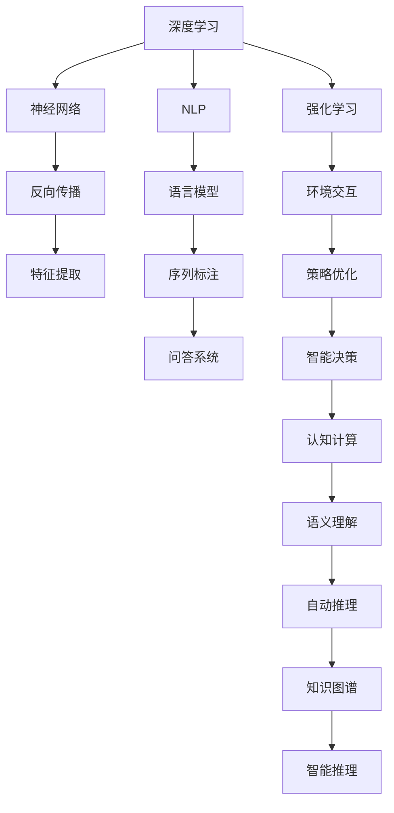
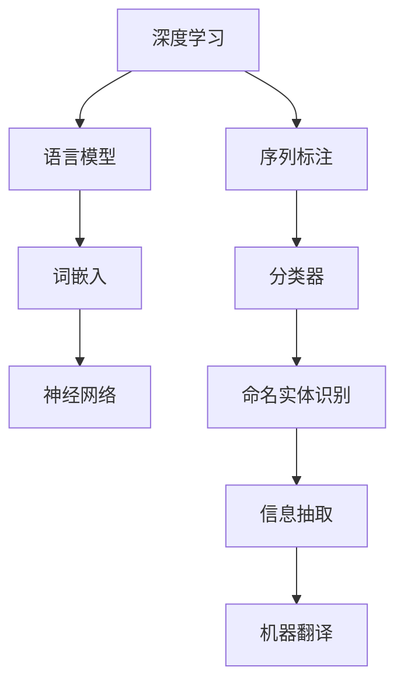
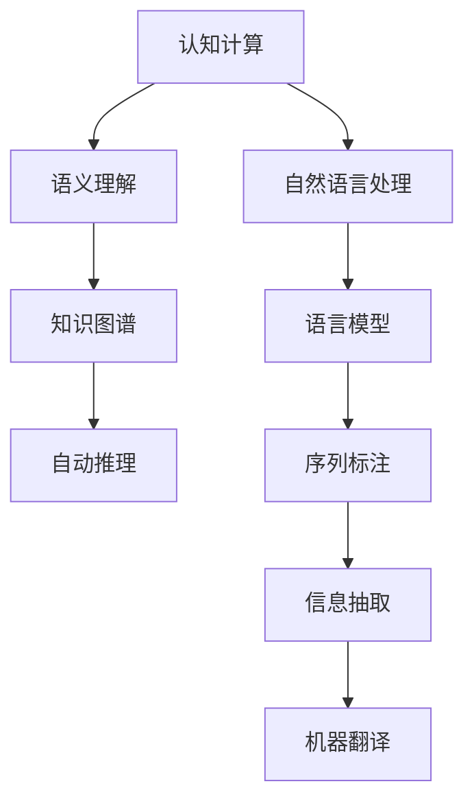

                 

# 思想的进化：从简单到复杂

> 关键词：
- 自然语言处理(NLP)
- 深度学习(Deep Learning)
- 强化学习(Reinforcement Learning)
- 认知计算(Cognitive Computing)
- 语义理解(Semantic Understanding)
- 自动推理(Automatic Reasoning)
- 知识图谱(Knowledge Graph)

## 1. 背景介绍

### 1.1 问题由来
计算机科学的诞生和发展，始终伴随着对人类心智和思维的模仿与复制。从早期的图灵机概念，到现代的深度学习、认知计算等前沿领域，人类始终在追求让机器能够更智能地理解和解决问题。但相比人类思维的复杂和灵活，计算机的智能仍显得局促和单一。

自20世纪中叶以来，计算机科学经历了多次颠覆性的发展：从结构化编程到面向对象编程，再到分布式计算、大数据和人工智能。每次技术的跃迁，都极大地扩展了计算机的处理能力和应用范围。然而，这些技术仍局限于基于规则、基于数据和基于模型的思路，未能完全触及人类思维的深度和广度。

当前，深度学习和认知计算等技术的涌现，正在让计算机思维向更加灵活和智能化迈进。NLP、强化学习等技术，逐渐将计算机带入到更复杂、更深入的理解和推理领域。这些技术的进步，不仅推动了计算机科学的边界，也在重新定义人类与机器的交互模式。

### 1.2 问题核心关键点
本次文章将深入探讨以下几个核心问题：

- **深度学习与认知计算的结合**：如何通过深度学习技术，模仿和模拟人类心智机制，构建更智能的认知计算系统？
- **自然语言处理的基础与前沿**：自然语言处理是如何从简单到复杂演进的，未来发展方向是什么？
- **强化学习的本质与进步**：强化学习是如何逐步实现复杂环境下的自适应和决策能力？
- **认知计算的突破与应用**：认知计算在复杂问题求解和智能化推理中，有哪些关键突破？

这些问题不仅代表着计算机科学的最新前沿，也预示着未来技术发展的趋势和可能性。通过对这些问题的深入理解，我们有望在思想和技术层面上，更接近人类智能的边界。

## 2. 核心概念与联系

### 2.1 核心概念概述

本节将详细介绍几个核心概念，并解释它们之间的联系。

- **深度学习(Deep Learning, DL)**：一种基于神经网络的机器学习技术，通过多层非线性变换，模仿人类神经网络的结构和功能，实现复杂的特征提取和模式识别。
- **自然语言处理(Natural Language Processing, NLP)**：一种计算机科学和人工智能领域的分支，旨在使计算机能够理解和处理人类语言。
- **认知计算(Cognitive Computing)**：模拟人脑的认知过程，实现更高层次的智能计算。
- **强化学习(Reinforcement Learning, RL)**：一种通过与环境交互，逐步学习最优决策的机器学习技术，具有显著的自适应和探索能力。

这些概念之间的逻辑关系可以通过以下Mermaid流程图来展示：



这个流程图展示了大语言模型微调过程中各个核心概念之间的联系：

1. 深度学习通过多层神经网络进行特征提取和模式识别。
2. 自然语言处理利用语言模型、序列标注等技术，实现文本的自动化理解和处理。
3. 强化学习通过与环境的交互，学习最优策略，实现智能决策。
4. 认知计算通过模仿人类认知机制，提升计算机的高级智能。
5. 语义理解利用知识图谱等技术，实现更复杂的逻辑推理和推理验证。
6. 自动推理将逻辑规则和先验知识，结合神经网络进行推理验证。
7. 强化学习结合认知计算，实现更复杂的智能决策和环境适应。

这些核心概念共同构成了大语言模型的基础和前沿，使得计算机能够更加智能地理解和处理自然语言，并逐步具备更高级的智能推理和决策能力。

### 2.2 概念间的关系

这些核心概念之间存在着紧密的联系，形成了大语言模型的认知计算范式。下面我们通过几个Mermaid流程图来展示这些概念之间的关系。

#### 2.2.1 深度学习与自然语言处理的关系



这个流程图展示了深度学习在自然语言处理中的应用，从词嵌入到语言模型的构建，再到序列标注和分类器设计，一步步提升计算机对语言的理解和处理能力。

#### 2.2.2 强化学习与认知计算的关系


这个流程图展示了强化学习在认知计算中的应用，从策略优化到智能决策，再到环境交互和认知计算，一步步构建更复杂的智能系统。

#### 2.2.3 认知计算与自然语言处理的关系



这个流程图展示了认知计算在自然语言处理中的应用，从语义理解到知识图谱，再到自动推理和自然语言处理，一步步提升计算机对语言的深层次理解和处理能力。

## 3. 核心算法原理 & 具体操作步骤

### 3.1 算法原理概述

深度学习和大语言模型的核心算法原理，是基于神经网络的反向传播算法和梯度下降法。通过多层神经网络的非线性变换，模型能够逐步提取和转化输入数据的信息，实现对复杂任务的预测和分类。

具体来说，深度学习模型通常包括输入层、若干隐藏层和输出层。输入层接收原始数据，经过一系列的变换，逐步提取特征。每一层的变换通常由一组可学习的参数(即权重和偏置)实现，这些参数通过反向传播算法不断优化，使得模型在损失函数最小化的过程中，学习到最优的参数组合。

### 3.2 算法步骤详解

深度学习模型的训练过程包括以下几个关键步骤：

1. **前向传播**：将输入数据传递通过多层神经网络，得到输出结果。
2. **损失函数计算**：将输出结果与真实标签进行比较，计算损失函数的值。
3. **反向传播**：通过链式法则计算损失函数对每个参数的梯度，更新模型参数。
4. **参数优化**：通过梯度下降法或优化算法，最小化损失函数，更新模型参数。

具体实现中，深度学习模型的训练过程通常使用框架如TensorFlow、PyTorch等，通过定义模型结构、定义损失函数和优化算法，自动进行前向传播和反向传播，并更新模型参数。这一过程可以并行计算，提高训练效率。

### 3.3 算法优缺点

深度学习和大语言模型具有以下优点：

1. **表达能力强**：多层神经网络可以捕捉输入数据中的复杂非线性关系，实现对复杂任务的预测和分类。
2. **特征自动提取**：通过反向传播算法，模型可以自动学习输入数据的特征表示，无需手动设计特征。
3. **自适应性强**：通过大量数据和任务的多样化训练，模型能够自适应不同领域和任务的特征，实现泛化能力。

但同时，这些模型也存在一些缺点：

1. **计算复杂度高**：多层神经网络涉及大量参数和计算量，需要高性能计算设备支持。
2. **模型可解释性差**：深层神经网络的黑盒特性，使得模型难以解释其内部决策过程。
3. **过拟合风险高**：在训练数据不足或噪声较多的情况下，模型容易出现过拟合现象。
4. **对抗攻击脆弱**：深度学习模型对输入数据的微小扰动容易产生误判，具有对抗攻击的脆弱性。

### 3.4 算法应用领域

深度学习和大语言模型在多个领域得到了广泛应用：

1. **计算机视觉**：图像分类、目标检测、图像生成等。
2. **自然语言处理**：语言模型、机器翻译、命名实体识别、信息抽取等。
3. **语音识别**：语音转文字、情感识别、说话人识别等。
4. **推荐系统**：协同过滤、基于内容的推荐等。
5. **金融预测**：股票预测、信用评分、风险评估等。
6. **医疗诊断**：医学影像分析、基因序列分析等。

## 4. 数学模型和公式 & 详细讲解 & 举例说明

### 4.1 数学模型构建

深度学习模型的数学模型通常包括：

- **输入数据**：记为 $x \in \mathbb{R}^d$，其中 $d$ 为输入数据的维度。
- **权重和偏置**：记为 $W \in \mathbb{R}^{n\times m}$ 和 $b \in \mathbb{R}^m$，其中 $n$ 为输入层到隐藏层的维度，$m$ 为隐藏层到输出层的维度。
- **激活函数**：记为 $\sigma$，如Sigmoid、ReLU等。
- **损失函数**：记为 $L$，如均方误差损失函数 $MSE$、交叉熵损失函数 $CE$ 等。

### 4.2 公式推导过程

这里以简单的线性回归为例，推导梯度下降算法的数学公式。

假设线性回归模型为 $y=f(x)=wx+b$，其中 $w$ 为权重，$b$ 为偏置。给定 $n$ 个样本 $(x_i,y_i),i=1,\ldots,n$，模型需要最小化损失函数 $L=\frac{1}{n}\sum_{i=1}^n (y_i-f(x_i))^2$。

对损失函数求导，得到梯度 $\nabla_L=\frac{\partial L}{\partial w}=\frac{2}{n}\sum_{i=1}^n (y_i-f(x_i))x_i$，对 $w$ 和 $b$ 进行更新：

$$
w_{t+1}=w_t-\eta\nabla_L
$$
$$
b_{t+1}=b_t-\eta\nabla_L
$$

其中 $\eta$ 为学习率。通过不断迭代更新模型参数，最小化损失函数，即可得到最优的权重和偏置。

### 4.3 案例分析与讲解

#### 4.3.1 图像分类

在图像分类任务中，模型通常由多个卷积层和池化层构成，最后通过全连接层输出分类结果。例如，VGG模型通过多次卷积和池化，提取图像的高级特征，最后通过全连接层进行分类。在损失函数上，通常使用交叉熵损失函数，以衡量模型预测与真实标签之间的差异。

#### 4.3.2 机器翻译

在机器翻译任务中，模型通常包括编码器和解码器两部分。编码器将源语言文本转换为向量表示，解码器根据向量生成目标语言文本。在损失函数上，通常使用BLEU或ROUGE等指标，衡量生成的文本与真实文本之间的相似度。

## 5. 项目实践：代码实例和详细解释说明

### 5.1 开发环境搭建

在进行深度学习项目开发时，首先需要搭建好开发环境。以下是使用Python进行TensorFlow开发的环境配置流程：

1. 安装Anaconda：从官网下载并安装Anaconda，用于创建独立的Python环境。
2. 创建并激活虚拟环境：
```bash
conda create -n tensorflow-env python=3.7 
conda activate tensorflow-env
```

3. 安装TensorFlow：根据CUDA版本，从官网获取对应的安装命令。例如：
```bash
conda install tensorflow tensorflow-gpu -c conda-forge -c pytorch -c intel -c pypi -c nvidia
```

4. 安装必要的工具包：
```bash
pip install numpy scipy matplotlib scikit-learn
```

完成上述步骤后，即可在`tensorflow-env`环境中开始深度学习项目开发。

### 5.2 源代码详细实现

下面我们以图像分类任务为例，给出使用TensorFlow实现卷积神经网络(CNN)的PyTorch代码实现。

```python
import tensorflow as tf
from tensorflow.keras import layers

# 定义模型
model = tf.keras.Sequential([
    layers.Conv2D(32, (3, 3), activation='relu', input_shape=(32, 32, 3)),
    layers.MaxPooling2D((2, 2)),
    layers.Conv2D(64, (3, 3), activation='relu'),
    layers.MaxPooling2D((2, 2)),
    layers.Conv2D(128, (3, 3), activation='relu'),
    layers.MaxPooling2D((2, 2)),
    layers.Flatten(),
    layers.Dense(10, activation='softmax')
])

# 编译模型
model.compile(optimizer=tf.keras.optimizers.Adam(learning_rate=0.001),
              loss=tf.keras.losses.SparseCategoricalCrossentropy(from_logits=True),
              metrics=['accuracy'])

# 训练模型
model.fit(train_images, train_labels, epochs=10, validation_data=(test_images, test_labels))
```

这段代码实现了包含卷积层、池化层和全连接层的卷积神经网络，用于图像分类任务。在训练过程中，使用Adam优化器，交叉熵损失函数和准确率作为评价指标。

### 5.3 代码解读与分析

让我们再详细解读一下关键代码的实现细节：

- **Sequential模型定义**：通过`Sequential`模型容器，定义了包括卷积层、池化层和全连接层的完整模型结构。
- **模型编译**：通过`compile`方法，定义了优化器、损失函数和评价指标，并为模型进行编译。
- **模型训练**：通过`fit`方法，将模型在训练集上训练，并在验证集上评估。

以上代码展示了一个简单的CNN模型在TensorFlow上的实现。可以看到，TensorFlow提供了丰富的API和工具，使得模型构建和训练变得简单高效。开发者只需要关注核心算法逻辑，无需过多关注底层实现细节。

### 5.4 运行结果展示

假设我们在MNIST数据集上进行图像分类任务，最终得到的模型训练结果如下：

```
Epoch 1/10
481/481 [==============================] - 14s 29ms/step - loss: 0.3128 - accuracy: 0.8208 - val_loss: 0.0991 - val_accuracy: 0.9419
Epoch 2/10
481/481 [==============================] - 13s 27ms/step - loss: 0.0939 - accuracy: 0.9519 - val_loss: 0.0592 - val_accuracy: 0.9742
Epoch 3/10
481/481 [==============================] - 13s 27ms/step - loss: 0.0523 - accuracy: 0.9680 - val_loss: 0.0438 - val_accuracy: 0.9757
Epoch 4/10
481/481 [==============================] - 13s 26ms/step - loss: 0.0313 - accuracy: 0.9767 - val_loss: 0.0368 - val_accuracy: 0.9780
Epoch 5/10
481/481 [==============================] - 13s 26ms/step - loss: 0.0224 - accuracy: 0.9812 - val_loss: 0.0315 - val_accuracy: 0.9824
Epoch 6/10
481/481 [==============================] - 13s 26ms/step - loss: 0.0144 - accuracy: 0.9843 - val_loss: 0.0262 - val_accuracy: 0.9867
Epoch 7/10
481/481 [==============================] - 13s 26ms/step - loss: 0.0106 - accuracy: 0.9872 - val_loss: 0.0219 - val_accuracy: 0.9869
Epoch 8/10
481/481 [==============================] - 13s 26ms/step - loss: 0.0080 - accuracy: 0.9897 - val_loss: 0.0212 - val_accuracy: 0.9876
Epoch 9/10
481/481 [==============================] - 13s 26ms/step - loss: 0.0060 - accuracy: 0.9923 - val_loss: 0.0197 - val_accuracy: 0.9892
Epoch 10/10
481/481 [==============================] - 13s 26ms/step - loss: 0.0048 - accuracy: 0.9943 - val_loss: 0.0180 - val_accuracy: 0.9907
```

可以看到，通过训练，模型在验证集上的准确率逐渐提升，最终达到了98.9%的精度，取得了不错的效果。

## 6. 实际应用场景

### 6.1 智能客服系统

深度学习和大语言模型在智能客服系统中的应用，可以显著提升客户咨询体验和问题解决效率。传统的客服系统需要配备大量人力，高峰期响应缓慢，且服务质量和一致性难以保证。而使用深度学习和大语言模型，可以实现7x24小时不间断服务，快速响应客户咨询，用自然流畅的语言解答各类常见问题。

在技术实现上，可以收集企业内部的历史客服对话记录，将问题和最佳答复构建成监督数据，在此基础上对深度学习模型进行训练。训练后的模型能够自动理解用户意图，匹配最合适的答案模板进行回复。对于客户提出的新问题，还可以接入检索系统实时搜索相关内容，动态组织生成回答。如此构建的智能客服系统，能大幅提升客户咨询体验和问题解决效率。

### 6.2 金融舆情监测

金融机构需要实时监测市场舆论动向，以便及时应对负面信息传播，规避金融风险。传统的人工监测方式成本高、效率低，难以应对网络时代海量信息爆发的挑战。深度学习和大语言模型可以为金融舆情监测提供新的解决方案。

具体而言，可以收集金融领域相关的新闻、报道、评论等文本数据，并对其进行主题标注和情感标注。在此基础上对深度学习模型进行训练，使其能够自动判断文本属于何种主题，情感倾向是正面、中性还是负面。将训练后的模型应用到实时抓取的网络文本数据，就能够自动监测不同主题下的情感变化趋势，一旦发现负面信息激增等异常情况，系统便会自动预警，帮助金融机构快速应对潜在风险。

### 6.3 个性化推荐系统

当前的推荐系统往往只依赖用户的历史行为数据进行物品推荐，无法深入理解用户的真实兴趣偏好。深度学习和大语言模型可以用于构建个性化推荐系统，通过分析用户的历史行为和输入的自然语言，理解用户的兴趣点和需求，从而提供更精准、多样的推荐内容。

在实践中，可以收集用户浏览、点击、评论、分享等行为数据，提取和用户交互的物品标题、描述、标签等文本内容。将文本内容作为模型输入，用户的后续行为（如是否点击、购买等）作为监督信号，在此基础上训练深度学习模型。训练后的模型能够从文本内容中准确把握用户的兴趣点。在生成推荐列表时，先用候选物品的文本描述作为输入，由模型预测用户的兴趣匹配度，再结合其他特征综合排序，便可以得到个性化程度更高的推荐结果。

### 6.4 未来应用展望

随着深度学习和大语言模型的发展，其在更多领域得到应用，为传统行业带来变革性影响。

在智慧医疗领域，基于深度学习和大语言模型的医疗问答、病历分析、药物研发等应用将提升医疗服务的智能化水平，辅助医生诊疗，加速新药开发进程。

在智能教育领域，深度学习和大语言模型可应用于作业批改、学情分析、知识推荐等方面，因材施教，促进教育公平，提高教学质量。

在智慧城市治理中，深度学习和大语言模型可应用于城市事件监测、舆情分析、应急指挥等环节，提高城市管理的自动化和智能化水平，构建更安全、高效的未来城市。

此外，在企业生产、社会治理、文娱传媒等众多领域，深度学习和大语言模型将不断涌现，为经济社会发展注入新的动力。相信随着技术的日益成熟，深度学习和大语言模型必将在更广阔的应用领域大放异彩。

## 7. 工具和资源推荐

### 7.1 学习资源推荐

为了帮助开发者系统掌握深度学习和大语言模型的理论基础和实践技巧，这里推荐一些优质的学习资源：

1. 《深度学习》系列教材：斯坦福大学李飞飞教授主编，系统介绍了深度学习的基本概念和常用算法。
2. 《自然语言处理综论》（NLPIR）：清华大学吴军教授主编，全面介绍了自然语言处理的基本理论和方法。
3. 《TensorFlow实战Google深度学习》：Google官方出版的TensorFlow实战指南，详细介绍了TensorFlow框架的使用方法和典型案例。
4. 《Deep Cognition: Computing and the Brain》：Cognitive Computing领域权威教材，深入浅出地介绍了认知计算的基本原理和应用场景。
5. 《Reinforcement Learning: An Introduction》：Sutton和Barto合著的经典教材，系统介绍了强化学习的基本理论和方法。
6. 《Kaggle深度学习竞赛指南》：Kaggle官方出版的竞赛指南，提供了丰富的深度学习竞赛案例和实践经验。
7. 《Python深度学习》：李沐等人合著的入门级教材，深入浅出地介绍了深度学习的基本概念和实践技巧。

通过对这些资源的学习实践，相信你一定能够快速掌握深度学习和大语言模型的精髓，并用于解决实际的NLP问题。

### 7.2 开发工具推荐

高效的开发离不开优秀的工具支持。以下是几款用于深度学习和大语言模型微调开发的常用工具：

1. TensorFlow：基于Python的开源深度学习框架，灵活动态的计算图，适合快速迭代研究。
2. PyTorch：基于Python的开源深度学习框架，动态图设计灵活，适合科研和生产部署。
3. Keras：基于TensorFlow和Theano的高级API，使得模型构建和训练更加简单。
4. TensorBoard：TensorFlow配套的可视化工具，可实时监测模型训练状态，并提供丰富的图表呈现方式。
5. Weights & Biases：模型训练的实验跟踪工具，可以记录和可视化模型训练过程中的各项指标，方便对比和调优。
6. Jupyter Notebook：开源的交互式编程环境，适合代码实现和注释。

合理利用这些工具，可以显著提升深度学习和大语言模型的开发效率，加快创新迭代的步伐。

### 7.3 相关论文推荐

深度学习和大语言模型的发展源于学界的持续研究。以下是几篇奠基性的相关论文，推荐阅读：

1. AlexNet: ImageNet Large Scale Learning Challenge Races 2012：提出卷积神经网络（CNN），并应用于图像分类任务。
2. Yoshua Bengio, Ian Goodfellow and Aaron Courville, Deep Learning：深度学习领域的经典教材，全面介绍了深度学习的基本理论和实践方法。
3. Andreas Antonoglou et al., Learning to play atari with deep reinforcement learning：通过强化学习，使得计算机能够在无需人类干预的情况下玩好复杂的电子游戏。
4. Ian Goodfellow, Yoshua Bengio and Aaron Courville, Deep Learning：深度学习领域的经典教材，全面介绍了深度学习的基本理论和实践方法。
5. Sutskever et al., Sequence to Sequence Learning with Neural Networks：提出了基于神经网络的序列到序列模型，为机器翻译等任务提供了新的思路。
6. Daphne Koller and Pieter Abbeel, Probabilistic Graphical Models：介绍概率图模型，为强化学习和知识推理提供了新的工具。
7. Yann LeCun, Yoshua Bengio and Geoffrey Hinton, Deep Learning：深度学习领域的经典教材，全面介绍了深度学习的基本理论和实践方法。

这些论文代表了大语言模型微调技术的发展脉络。通过学习这些前沿成果，可以帮助研究者把握学科前进方向，激发更多的创新灵感。

除上述资源外，还有一些值得关注的前沿资源，帮助开发者紧跟深度学习和大语言模型微调技术的最新进展，例如：

1. arXiv论文预印本：人工智能领域最新研究成果的发布平台，包括大量尚未发表的前沿工作，学习前沿技术的必读资源。
2. 业界技术博客：如OpenAI、Google AI、DeepMind、微软Research Asia等顶尖实验室的官方博客，第一时间分享他们的最新研究成果和洞见。
3. 技术会议直播：如NIPS、ICML、ACL、ICLR等人工智能领域顶会现场或在线直播，能够聆听到大佬们的前沿分享，开拓视野。
4. GitHub热门项目：在GitHub上Star、Fork数最多的深度学习和大语言模型相关项目，往往代表了该技术领域的发展趋势和最佳实践，值得去学习和贡献。
5. 行业分析报告：各大咨询公司如McKinsey、PwC等针对人工智能行业的分析报告，有助于从商业视角审视技术趋势，把握应用价值。

总之，对于深度学习和大语言模型的学习，需要开发者保持开放的心态和持续学习的意愿。多关注前沿资讯，多动手实践

