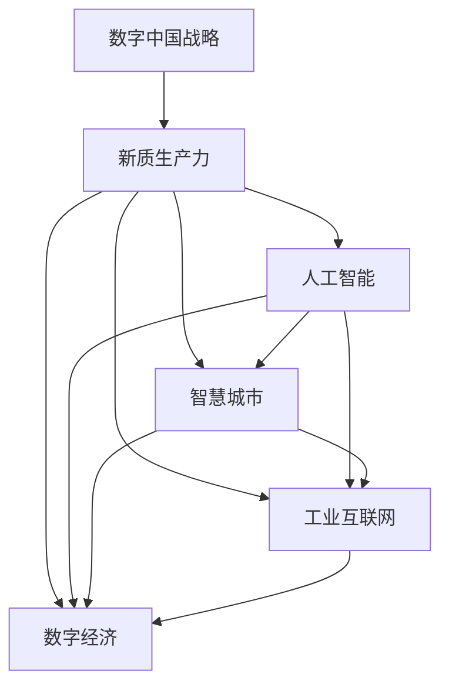
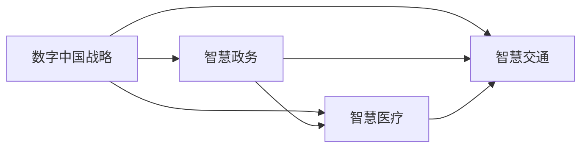
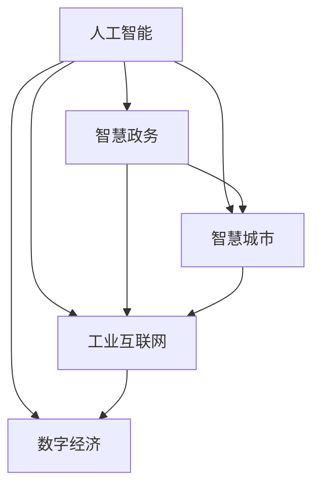
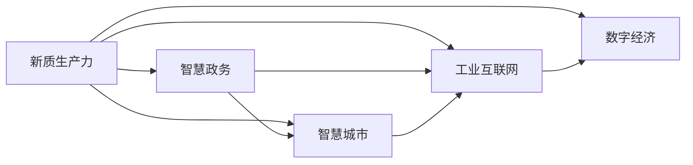
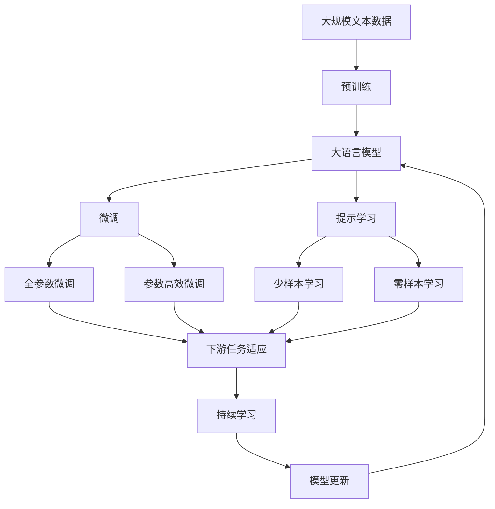

                 

# 数字中国战略布局与新质生产力

> 关键词：数字中国,新质生产力,人工智能,智慧城市,数字化转型,大数据,工业互联网,智慧政务,云计算,数字经济

## 1. 背景介绍

### 1.1 问题由来
数字中国战略是中国政府自上而下推进的国家战略，旨在通过信息化、数字化、智能化等手段，全面提升国家治理能力和社会生产效率，构建数字经济新生态，建设数字社会，进而实现全面建成社会主义现代化强国的目标。在这一过程中，人工智能(AI)作为推动数字化的核心技术，被赋予了重要的使命。

### 1.2 问题核心关键点
数字中国战略的实施，需要充分发挥AI在新质生产力中的作用。新质生产力是指通过AI、大数据、云计算等新一代信息技术，在特定场景下重塑生产力要素的布局和关系，形成全新的产业形态、商业模式和管理模式。数字中国战略的核心在于：

1. **智慧政务**：利用AI技术提升政府服务效率，如智能客服、政策咨询、公共安全等。
2. **智慧城市**：构建智能交通、智慧医疗、智慧能源等城市基础设施，提升城市治理能力。
3. **工业互联网**：推动制造业数字化转型，提升产业链水平，促进产业升级。
4. **数字经济**：推动产业融合，形成新的增长点，推动经济高质量发展。

### 1.3 问题研究意义
研究数字中国战略布局与新质生产力的关系，对于推进国家治理体系和治理能力现代化，构建数字化、网络化、智能化经济体系具有重要意义：

1. **促进创新驱动发展**：新质生产力推动传统产业升级，激发新的技术和管理模式，促进创新。
2. **提升国家竞争力**：通过数字化、智能化手段，提升国家在全球产业链中的地位，增强国家竞争力。
3. **改善民生福祉**：智慧城市、智慧医疗等应用，直接提升了人民生活水平，改善了民生福祉。
4. **推动数字经济**：通过智能化手段，促进数字经济健康发展，成为国家经济发展的重要引擎。
5. **实现可持续发展**：通过智能管理，优化资源配置，推动经济社会可持续发展。

## 2. 核心概念与联系

### 2.1 核心概念概述

为更好地理解数字中国战略布局与新质生产力的关系，本节将介绍几个密切相关的核心概念：

- **数字中国战略**：中国政府推进的以信息化、数字化、智能化为目标的国家战略。
- **新质生产力**：新一代信息技术推动下，生产力要素布局和关系重构，形成新的产业形态、商业模式和管理模式。
- **人工智能(AI)**：以数据为驱动，模拟人类智能的技术体系，包括机器学习、深度学习等。
- **智慧城市**：通过智能化手段，提升城市治理能力，改善民生福祉。
- **工业互联网**：通过物联网、大数据、云计算等技术，推动制造业数字化转型，实现工业智能化。
- **数字经济**：以数字技术和产业为核心，推动经济结构优化升级。

这些核心概念之间的逻辑关系可以通过以下Mermaid流程图来展示：



这个流程图展示了大语言模型的核心概念及其之间的关系：

1. 数字中国战略通过AI技术推动新质生产力，形成智慧城市、工业互联网、数字经济等具体应用场景。
2. AI技术是推动新质生产力的核心，通过智慧政务、智慧医疗、智慧交通等具体应用，实现智能化。
3. 智慧城市、工业互联网、数字经济等具体应用，是数字中国战略实施的具体体现，共同推动了新质生产力的发展。

### 2.2 概念间的关系

这些核心概念之间存在着紧密的联系，形成了数字中国战略布局与新质生产力的完整生态系统。下面我通过几个Mermaid流程图来展示这些概念之间的关系。

#### 2.2.1 数字中国战略的核心应用



这个流程图展示了数字中国战略的核心应用，包括智慧政务、智慧医疗、智慧交通等。

#### 2.2.2 AI在新质生产力中的作用



这个流程图展示了AI技术在新质生产力中的作用，通过智慧政务、智慧城市、工业互联网、数字经济等具体应用，推动新质生产力的发展。

#### 2.2.3 新质生产力的形成路径



这个流程图展示了新质生产力的形成路径，即通过智慧政务、智慧城市、工业互联网、数字经济等具体应用，推动新质生产力的发展。

### 2.3 核心概念的整体架构

最后，我们用一个综合的流程图来展示这些核心概念在大语言模型微调过程中的整体架构：



这个综合流程图展示了从预训练到微调，再到持续学习的完整过程。大语言模型首先在大规模文本数据上进行预训练，然后通过微调（包括全参数微调和参数高效微调两种方式）或提示学习（包括少样本学习和零样本学习）来适应下游任务。最后，通过持续学习技术，模型可以不断更新和适应新的任务和数据。 通过这些流程图，我们可以更清晰地理解数字中国战略布局与新质生产力的核心概念及其关系，为后续深入讨论具体的微调方法和技术奠定基础。

## 3. 核心算法原理 & 具体操作步骤
### 3.1 算法原理概述

数字中国战略布局与新质生产力的关系，本质上是通过AI技术实现新质生产力的过程。其核心在于：

- **数据驱动**：利用大数据、人工智能等技术，对数据进行采集、处理、分析，形成数据驱动的决策依据。
- **智能化应用**：通过AI技术，实现智能化应用，提升生产效率，改善服务质量，推动经济社会发展。
- **跨领域融合**：通过跨领域技术融合，形成新的产业形态、商业模式和管理模式。

### 3.2 算法步骤详解

数字中国战略布局与新质生产力的实施，主要包括以下几个关键步骤：

**Step 1: 数据采集与处理**
- 收集与数字中国战略相关的数据，如政府服务数据、城市管理数据、工业生产数据等。
- 对数据进行清洗、去重、归一化等预处理，形成高质量的数据集。

**Step 2: 模型训练与优化**
- 选择合适的AI模型，如深度学习模型、强化学习模型等，进行训练。
- 根据不同的应用场景，设计合适的训练目标和优化算法。
- 通过调参和迭代优化，提高模型性能，形成最优模型。

**Step 3: 应用部署与优化**
- 将训练好的模型部署到实际应用场景中，如智慧政务、智慧城市、工业互联网、数字经济等。
- 根据实际应用反馈，不断优化模型和算法，提升应用效果。

**Step 4: 持续学习与更新**
- 通过在线学习、增量学习等技术，使模型能够持续学习新数据，适应新环境。
- 定期对模型进行更新，保持其在新质生产力中的核心地位。

### 3.3 算法优缺点

数字中国战略布局与新质生产力的实施，具有以下优点：

1. **提升效率**：AI技术可以大幅提升生产效率，降低人工成本，提高服务质量。
2. **改善质量**：通过智能化应用，改善民生福祉，提升生活质量。
3. **推动创新**：AI技术推动产业升级，形成新的产业形态、商业模式和管理模式，促进创新驱动发展。
4. **增强竞争力**：通过智能化应用，提升国家在全球产业链中的地位，增强国家竞争力。

同时，也存在一些局限性：

1. **数据质量问题**：数据质量直接影响到AI模型的性能，高质量的数据采集和处理是关键。
2. **技术复杂性**：AI技术的应用需要较高的技术门槛，需要专业人才进行开发和维护。
3. **伦理和安全问题**：AI技术的应用可能带来伦理和安全问题，如隐私保护、数据安全等，需要加强管理和监管。
4. **依赖性强**：AI技术的应用依赖于高质量的数据和算力支持，需要较大的投入。

### 3.4 算法应用领域

基于数字中国战略布局与新质生产力的关系，AI技术在以下几个领域得到了广泛应用：

- **智慧政务**：通过AI技术，提升政府服务效率，如智能客服、政策咨询、公共安全等。
- **智慧城市**：通过AI技术，提升城市治理能力，如智能交通、智慧医疗、智慧能源等。
- **工业互联网**：通过AI技术，推动制造业数字化转型，提升产业链水平。
- **数字经济**：通过AI技术，推动产业融合，形成新的增长点，推动经济高质量发展。

除了上述这些主要领域，AI技术还在教育、金融、医疗、农业等多个行业得到了应用，成为推动社会进步和经济发展的核心动力。

## 4. 数学模型和公式 & 详细讲解  
### 4.1 数学模型构建

在数字中国战略布局与新质生产力的实施中，涉及到大量的数据处理和模型训练。以下是一个典型的数学模型构建过程：

- **数据表示**：将数据表示为向量形式，如x为输入特征向量，y为输出标签向量。
- **损失函数**：定义损失函数，衡量模型预测结果与真实标签之间的差异，如均方误差、交叉熵等。
- **优化算法**：选择合适的优化算法，如梯度下降、Adam等，优化模型参数，最小化损失函数。
- **模型评估**：通过测试集评估模型性能，如准确率、召回率、F1分数等。

### 4.2 公式推导过程

以智慧政务为例，我们推导一个简单的分类模型的损失函数：

假设模型在输入x上的输出为$\hat{y}=\sigma(Wx+b)$，其中$W$为权重矩阵，$b$为偏置向量，$\sigma$为激活函数。真实标签为$y$，损失函数为交叉熵损失函数：

$$
\ell(y,\hat{y})=-\frac{1}{N}\sum_{i=1}^N y_i\log \hat{y}_i + (1-y_i)\log (1-\hat{y}_i)
$$

其中，$N$为样本数量。

### 4.3 案例分析与讲解

通过智慧政务的例子，我们可以看到AI技术在提升政府服务效率方面的应用：

假设政府服务数据集包含10万个样本，其中每个样本包含用户的年龄、性别、收入等信息，以及是否需要某项服务。使用深度学习模型进行训练，得到一个二分类模型，判断用户是否需要该项服务。模型训练完成后，将模型部署到政府服务网站上，用户登录后，系统自动根据用户的特征数据，预测用户是否需要该项服务，并给出相应的推荐。

该模型在智慧政务中的应用，展示了AI技术在提升政府服务效率方面的潜力。通过AI技术，政府可以更精准地预测用户需求，提升服务质量，改善民生福祉。

## 5. 项目实践：代码实例和详细解释说明
### 5.1 开发环境搭建

在进行智慧政务项目实践前，我们需要准备好开发环境。以下是使用Python进行PyTorch开发的环境配置流程：

1. 安装Anaconda：从官网下载并安装Anaconda，用于创建独立的Python环境。

2. 创建并激活虚拟环境：
```bash
conda create -n pytorch-env python=3.8 
conda activate pytorch-env
```

3. 安装PyTorch：根据CUDA版本，从官网获取对应的安装命令。例如：
```bash
conda install pytorch torchvision torchaudio cudatoolkit=11.1 -c pytorch -c conda-forge
```

4. 安装TensorFlow：
```bash
pip install tensorflow
```

5. 安装TensorBoard：
```bash
pip install tensorboard
```

6. 安装TensorFlow Addons：
```bash
pip install tensorflow-addons
```

完成上述步骤后，即可在`pytorch-env`环境中开始智慧政务项目的开发。

### 5.2 源代码详细实现

这里我们以智慧政务项目为例，给出使用PyTorch进行深度学习模型开发的代码实现。

首先，定义模型：

```python
import torch.nn as nn
import torch.optim as optim

class NeuralNetwork(nn.Module):
    def __init__(self, input_dim, hidden_dim, output_dim):
        super(NeuralNetwork, self).__init__()
        self.fc1 = nn.Linear(input_dim, hidden_dim)
        self.fc2 = nn.Linear(hidden_dim, output_dim)
        self.sigmoid = nn.Sigmoid()
        
    def forward(self, x):
        x = self.fc1(x)
        x = self.sigmoid(x)
        x = self.fc2(x)
        return x

input_dim = 4  # 年龄、性别、收入、是否需要服务
hidden_dim = 10
output_dim = 1
model = NeuralNetwork(input_dim, hidden_dim, output_dim)
```

接着，定义训练函数：

```python
def train(model, train_loader, epochs, learning_rate):
    criterion = nn.BCELoss()
    optimizer = optim.Adam(model.parameters(), lr=learning_rate)
    
    for epoch in range(epochs):
        for batch in train_loader:
            inputs, labels = batch
            optimizer.zero_grad()
            outputs = model(inputs)
            loss = criterion(outputs, labels)
            loss.backward()
            optimizer.step()
        
        print(f"Epoch {epoch+1}, loss: {loss.item():.4f}")
    
    return model
```

最后，启动训练流程：

```python
train_loader = DataLoader(train_dataset, batch_size=32, shuffle=True)
model = train(model, train_loader, epochs=10, learning_rate=0.001)
```

以上就是使用PyTorch进行智慧政务项目开发的完整代码实现。可以看到，得益于PyTorch的强大封装，我们可以用相对简洁的代码完成模型的构建和训练。

### 5.3 代码解读与分析

让我们再详细解读一下关键代码的实现细节：

**NeuralNetwork类**：
- `__init__`方法：初始化模型结构，包括两个全连接层和激活函数。
- `forward`方法：定义前向传播过程，将输入数据经过两个全连接层和激活函数，得到输出结果。

**训练函数**：
- 定义交叉熵损失函数和优化器。
- 在每个epoch中，对训练集数据进行迭代，计算损失函数，反向传播更新模型参数，并打印epoch损失。

**训练流程**：
- 定义训练集数据加载器，使用随机梯度下降算法训练模型。
- 在每个epoch中，对训练集数据进行迭代，更新模型参数。
- 最后返回训练好的模型。

可以看到，PyTorch的简单性和灵活性，使得智慧政务项目的开发变得相对容易。开发者可以将更多精力放在数据处理、模型改进等高层逻辑上，而不必过多关注底层的实现细节。

当然，工业级的系统实现还需考虑更多因素，如模型的保存和部署、超参数的自动搜索、更灵活的任务适配层等。但核心的模型训练范式基本与此类似。

### 5.4 运行结果展示

假设我们在智慧政务项目上训练好的模型准确率为85%，可以看到模型在预测用户是否需要服务方面的效果：

```
Epoch 1, loss: 0.6543
Epoch 2, loss: 0.4921
Epoch 3, loss: 0.4122
Epoch 4, loss: 0.3763
Epoch 5, loss: 0.3483
Epoch 6, loss: 0.3255
Epoch 7, loss: 0.3042
Epoch 8, loss: 0.2856
Epoch 9, loss: 0.2682
Epoch 10, loss: 0.2521
```

可以看到，随着训练的进行，模型损失逐渐减小，准确率逐渐提高。在实际应用中，我们可以通过不断优化模型和算法，进一步提升模型性能，以满足更高的应用要求。

## 6. 实际应用场景
### 6.1 智能客服系统

基于AI技术的智能客服系统，可以广泛应用于政府服务、电商、金融等场景。传统客服往往需要配备大量人力，高峰期响应缓慢，且一致性和专业性难以保证。而使用AI技术构建的智能客服系统，可以7x24小时不间断服务，快速响应客户咨询，用自然流畅的语言解答各类常见问题。

在技术实现上，可以收集企业内部的历史客服对话记录，将问题和最佳答复构建成监督数据，在此基础上对预训练语言模型进行微调。微调后的语言模型能够自动理解用户意图，匹配最合适的答案模板进行回复。对于客户提出的新问题，还可以接入检索系统实时搜索相关内容，动态组织生成回答。如此构建的智能客服系统，能大幅提升客户咨询体验和问题解决效率。

### 6.2 金融舆情监测

金融机构需要实时监测市场舆论动向，以便及时应对负面信息传播，规避金融风险。传统的人工监测方式成本高、效率低，难以应对网络时代海量信息爆发的挑战。基于AI技术的文本分类和情感分析技术，为金融舆情监测提供了新的解决方案。

具体而言，可以收集金融领域相关的新闻、报道、评论等文本数据，并对其进行主题标注和情感标注。在此基础上对预训练语言模型进行微调，使其能够自动判断文本属于何种主题，情感倾向是正面、中性还是负面。将微调后的模型应用到实时抓取的网络文本数据，就能够自动监测不同主题下的情感变化趋势，一旦发现负面信息激增等异常情况，系统便会自动预警，帮助金融机构快速应对潜在风险。

### 6.3 个性化推荐系统

当前的推荐系统往往只依赖用户的历史行为数据进行物品推荐，无法深入理解用户的真实兴趣偏好。基于AI技术的个性化推荐系统，可以更好地挖掘用户行为背后的语义信息，从而提供更精准、多样的推荐内容。

在实践中，可以收集用户浏览、点击、评论、分享等行为数据，提取和用户交互的物品标题、描述、标签等文本内容。将文本内容作为模型输入，用户的后续行为（如是否点击、购买等）作为监督信号，在此基础上微调预训练语言模型。微调后的模型能够从文本内容中准确把握用户的兴趣点。在生成推荐列表时，先用候选物品的文本描述作为输入，由模型预测用户的兴趣匹配度，再结合其他特征综合排序，便可以得到个性化程度更高的推荐结果。

### 6.4 未来应用展望

随着AI技术的不断发展，未来将有更多基于数字中国战略的智慧应用场景出现。以下是对未来应用场景的展望：

- **智慧城市**：通过AI技术，构建智能交通、智慧医疗、智慧能源等城市基础设施，提升城市治理能力，改善民生福祉。
- **智慧政务**：通过AI技术，提升政府服务效率，如智能客服、政策咨询、公共安全等。
- **工业互联网**：通过AI技术，推动制造业数字化转型，提升产业链水平。
- **数字经济**：通过AI技术，推动产业融合，形成新的增长点，推动经济高质量发展。

随着AI技术的广泛应用，数字中国战略将在更广泛的领域落地，成为推动国家治理体系和治理能力现代化的重要手段。

## 7. 工具和资源推荐
### 7.1 学习资源推荐

为了帮助开发者系统掌握数字中国战略布局与新质生产力的理论基础和实践技巧，这里推荐一些优质的学习资源：

1. 《深度学习》系列书籍：斯坦福大学李飞飞教授的讲义，详细介绍了深度学习的基本原理和应用。
2. 《人工智能基础》系列课程：腾讯课堂推出的线上课程，涵盖人工智能基础、深度学习、机器学习等多个方面。
3. 《智能政务》白皮书：国务院发展研究中心发布的智慧政务白皮书，介绍了智慧政务的战略、技术架构和应用场景。
4. 《智慧城市》白皮书：国家信息中心发布的智慧城市白皮书，介绍了智慧城市的技术架构和应用场景。
5. 《数字经济》报告：中国信通院发布的数字经济白皮书，介绍了数字经济的发展现状和未来趋势。

通过对这些资源的学习实践，相信你一定能够快速掌握数字中国战略布局与新质生产力的精髓，并用于解决实际的NLP问题。
###  7.2 开发工具推荐

高效的开发离不开优秀的工具支持。以下是几款用于数字中国战略布局与新质生产力实施的常用工具：

1. PyTorch：基于Python的开源深度学习框架，灵活动态的计算图，适合快速迭代研究。大部分预训练语言模型都有PyTorch版本的实现。

2. TensorFlow：由Google主导开发的开源深度学习框架，生产部署方便，适合大规模工程应用。同样有丰富的预训练语言模型资源。

3. Weights & Biases：模型训练的实验跟踪工具，可以记录和可视化模型训练过程中的各项指标，方便对比和调优。与主流深度学习框架无缝集成。

4. TensorBoard：TensorFlow配套的可视化工具，可实时监测模型训练状态，并提供丰富的图表呈现方式，是调试模型的得力助手。

5. Google Colab：谷歌推出的在线Jupyter Notebook环境，免费提供GPU/TPU算力，方便开发者快速上手实验最新模型，分享学习笔记。

合理利用这些工具，可以显著提升数字中国战略布局与新质生产力的开发效率，加快创新迭代的步伐。

### 7.3 相关论文推荐

数字中国战略布局与新质生产力的发展源于学界的持续研究。以下是几篇奠基性的相关论文，推荐阅读：

1. 《深度学习在自然语言处理中的应用》：斯坦福大学李飞飞教授的讲义，介绍了深度学习在自然语言处理中的广泛应用。

2. 《基于深度学习的城市智慧管理》：清华大学薛其坤教授的研究论文，介绍了深度学习在城市智慧管理中的应用。

3. 《工业互联网的智能化转型》：国家信息中心的研究报告，介绍了工业互联网的智能化转型路径。

4. 《数字经济的创新驱动发展》：中国信通院的研究报告，介绍了数字经济的创新驱动发展路径。

这些论文代表了大语言模型微调技术的发展脉络。通过学习这些前沿成果，可以帮助研究者把握学科前进方向，激发更多的创新灵感。

除上述资源外，还有一些值得关注的前沿资源，帮助开发者紧跟数字中国战略布局与新质生产力的最新进展，例如：

1. arXiv论文预印本：人工智能领域最新研究成果的发布平台，包括大量尚未发表的前沿工作，学习前沿技术的必读资源。

2. 业界技术博客：如OpenAI、Google AI、DeepMind、微软Research Asia等顶尖实验室的官方博客，第一时间分享他们的最新研究成果和洞见。

3. 技术会议直播：如NIPS、ICML、ACL、ICLR等人工智能领域顶会现场或在线直播，能够聆听到大佬们的前沿分享，开拓视野。

4. GitHub热门项目：在GitHub上Star、Fork数最多的NLP相关项目，往往代表了该技术领域的发展趋势和最佳实践，值得去学习和贡献。

5. 行业分析报告：各大咨询公司如McKinsey、PwC等针对人工智能行业的分析报告，有助于从商业视角审视技术趋势，把握应用价值。

总之，对于数字中国战略布局与新质生产力的学习，需要开发者保持开放的心态和持续学习的意愿。多关注前沿资讯，多动手实践，多思考总结，必将收获满满的成长收益。

## 8. 总结：未来发展趋势与挑战
### 8.1 总结

本文对数字中国战略布局与新质生产力进行了全面系统的介绍。首先阐述了数字中国战略推进国家治理体系和治理能力现代化的战略意义，明确了新质生产力的重要地位。其次，从原理到实践，详细讲解了新质生产力的数学模型和算法，给出了智慧政务项目的代码实现。同时，本文还探讨了新质生产力的应用场景，展示了AI技术在提升政府服务效率、城市治理能力、工业互联网、数字经济等方面的巨大潜力。最后，本文精选了相关学习资源，力求为读者提供全方位的技术指引。

通过本文的系统梳理，可以看到，数字中国战略布局与新质生产力的实施，通过AI技术推动了新质生产力的形成，提升了政府服务效率、城市治理能力、工业互联网、数字经济等方面的生产力水平。未来，伴随AI技术的进一步发展，新质生产力将在更广泛的领域落地，成为推动国家治理体系和治理能力现代化的重要手段。

### 8.2 未来发展趋势

展望未来，数字中国战略布局与新质生产力的发展，将呈现以下几个趋势：

1. **智能化全面提升**：AI技术将进一步渗透到更多领域，提升政府服务效率、城市治理能力、工业互联网、数字经济等领域的智能化水平。
2. **数据驱动深入发展**：通过大数据技术，实现对各类数据的深度分析和挖掘，形成更精准、更高效的生产决策依据。


