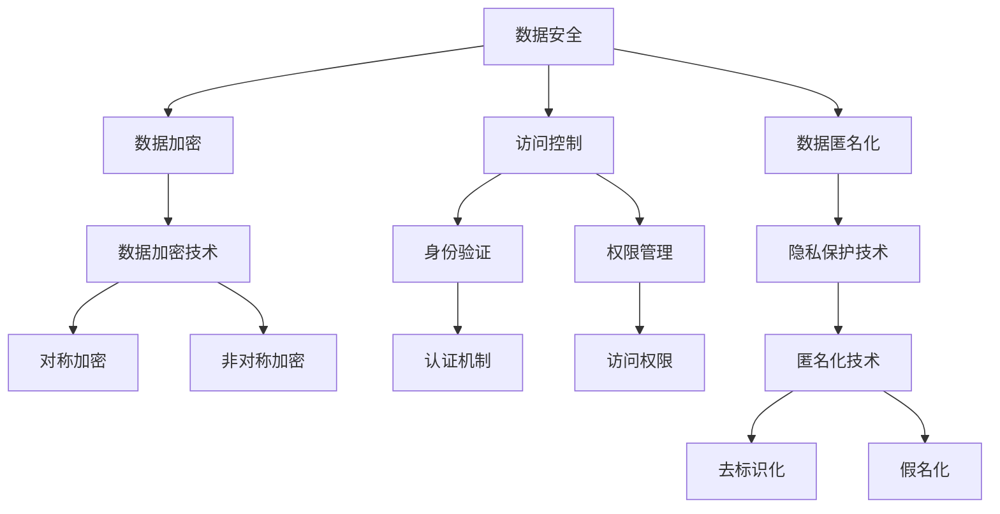

                 

## 1. 背景介绍

随着数字经济的发展，数据已成为驱动各行各业创新的关键资产。然而，数据安全和隐私问题也随之成为日益严重的挑战。企业需要确保数据在采集、存储、处理和传输过程中得到妥善保护，防止数据泄露、篡改和滥用。同时，用户隐私保护也是政府、企业和消费者共同关注的重点。在数字经济的背景下，数据安全和隐私保护已经成为了企业战略、政策制定和市场竞争的重要因素。

## 2. 核心概念与联系

### 2.1 核心概念概述

为了深入探讨数据安全和隐私问题，本节将介绍几个核心概念：

- **数据安全**：指保护数据在存储和传输过程中不被未授权访问、篡改和泄露的措施。
- **隐私保护**：指保护个人或组织的数据不被未经授权的第三方访问、收集和使用，以保障个人信息的安全和自由。
- **数据加密**：通过算法将数据转换为不可读的密文，只有持有解密密钥的合法用户才能还原数据。
- **访问控制**：通过身份验证和权限管理，限制对数据和系统的访问，防止未经授权的使用。
- **数据匿名化**：通过去除或模糊处理个人标识信息，使数据无法直接识别具体个人或组织，从而降低隐私泄露风险。

这些概念相互联系，共同构建了数字经济时代的数据安全与隐私保护体系。数据加密、访问控制、数据匿名化等技术手段的结合使用，可以有效降低数据泄露和隐私泄露的风险。

### 2.2 核心概念的联系

数据安全和隐私保护是一个多层次、多维度的问题，涉及到技术、法律、组织和社会各个方面。核心概念之间的联系可以通过以下Mermaid流程图来展示：



这个流程图展示了数据安全和隐私保护的核心概念及其之间的联系：

1. **数据安全**是整个体系的基础，通过加密、匿名化、访问控制等手段保障数据不被非法获取。
2. **数据加密**是保护数据不被未授权访问的关键技术，包括对称加密和非对称加密。
3. **访问控制**通过身份验证和权限管理，限制对数据和系统的访问，确保数据仅对合法用户可见。
4. **数据匿名化**通过去除或模糊处理个人标识信息，减少数据泄露的风险，包括去标识化和假名化。
5. **隐私保护**是目标，确保数据在各种处理过程中，个人的隐私得到保护。

通过这些技术手段的结合使用，可以构建一个完整的数据安全与隐私保护体系，有效应对数字经济时代的各种挑战。

## 3. 核心算法原理 & 具体操作步骤

### 3.1 算法原理概述

数字经济时代的数据安全和隐私保护，主要依赖于现代密码学技术。其中，对称加密、非对称加密、散列函数和数字签名是核心算法。

- **对称加密**：使用同一个密钥加密和解密数据，速度快，但密钥分发和管理复杂。
- **非对称加密**：使用一对公钥和私钥进行加密和解密，安全性高，但速度较慢。
- **散列函数**：将任意长度的输入数据映射为固定长度的散列值，常用于验证数据的完整性和一致性。
- **数字签名**：使用私钥对数据进行签名，公钥验证签名的真实性，确保数据未被篡改。

这些算法共同构成了数据安全和隐私保护的技术基础。通过这些算法，可以在数据存储、传输和处理过程中，确保数据的安全性和隐私性。

### 3.2 算法步骤详解

以下详细介绍几种核心算法的具体操作步骤：

**对称加密**：

1. **密钥生成**：随机生成一个对称密钥。
2. **数据加密**：使用对称密钥对数据进行加密，生成密文。
3. **密文传输**：将密文传输至接收方。
4. **数据解密**：接收方使用相同的对称密钥对密文进行解密，还原出原始数据。

**非对称加密**：

1. **密钥生成**：随机生成一对公钥和私钥。
2. **数据加密**：发送方使用接收方的公钥对数据进行加密，生成密文。
3. **密文传输**：将密文传输至接收方。
4. **数据解密**：接收方使用自己的私钥对密文进行解密，还原出原始数据。

**散列函数**：

1. **数据输入**：将待验证的数据输入散列函数。
2. **散列计算**：散列函数对数据进行计算，生成散列值。
3. **散列比较**：将计算出的散列值与存储的散列值进行比较，验证数据的完整性。

**数字签名**：

1. **签名生成**：使用私钥对数据进行签名，生成数字签名。
2. **签名传输**：将数字签名和原始数据一起传输至接收方。
3. **签名验证**：接收方使用发送方的公钥对数字签名进行验证，确认数据的真实性和完整性。

### 3.3 算法优缺点

**对称加密**的优点是速度快，但密钥分发和管理复杂，存在密钥泄露的风险。

**非对称加密**的优点是安全性高，但速度较慢，不适合大量数据的加密和解密。

**散列函数**的优点是计算速度快，但散列值一旦确定，无法逆向计算出原始数据，且具有唯一性。

**数字签名**的优点是确保数据的真实性和完整性，但需要公钥和私钥的配合使用，管理复杂。

### 3.4 算法应用领域

数据安全和隐私保护技术在数字经济时代得到了广泛应用，涵盖了以下几个主要领域：

1. **网络安全**：保护数据在互联网传输过程中的安全，防止中间人攻击和数据截获。
2. **金融安全**：保障金融交易和支付过程中的数据安全，防止欺诈和盗窃。
3. **医疗隐私**：保护患者医疗数据的隐私，防止数据泄露和滥用。
4. **智能合约**：确保智能合约的执行过程和数据交换的安全，防止合同篡改和欺诈。
5. **物联网安全**：保障物联网设备之间的数据通信安全，防止设备被攻击和数据泄露。

这些领域的数据安全和隐私保护技术，已经成为了数字经济时代的关键基础设施，保障了社会的安全和经济的发展。

## 4. 数学模型和公式 & 详细讲解 & 举例说明

### 4.1 数学模型构建

为了更好地理解数据安全和隐私保护的核心算法，本节将使用数学语言对对称加密、非对称加密、散列函数和数字签名等算法进行严格建模。

- **对称加密**：使用对称密钥 $k$ 对明文 $m$ 进行加密，生成密文 $c$，则加密算法可以表示为：
  $$
  c = E_k(m)
  $$
  其中 $E_k$ 表示加密算法。

- **非对称加密**：使用公钥 $pk$ 对明文 $m$ 进行加密，生成密文 $c$，接收方使用私钥 $sk$ 对密文 $c$ 进行解密，还原出原始数据 $m$，则加密和解密算法可以表示为：
  $$
  c = E_{pk}(m)
  $$
  $$
  m = D_{sk}(c)
  $$
  其中 $E_{pk}$ 表示公钥加密算法，$D_{sk}$ 表示私钥解密算法。

- **散列函数**：将任意长度的输入数据 $m$ 映射为固定长度的散列值 $h$，则散列函数可以表示为：
  $$
  h = H(m)
  $$
  其中 $H$ 表示散列函数。

- **数字签名**：使用私钥 $sk$ 对数据 $m$ 进行签名，生成数字签名 $s$，接收方使用公钥 $pk$ 对数字签名 $s$ 进行验证，则签名算法可以表示为：
  $$
  s = S_{sk}(m)
  $$
  其中 $S_{sk}$ 表示私钥签名算法。

### 4.2 公式推导过程

以下详细介绍几个核心算法的公式推导过程：

**对称加密**：

假设对称加密算法 $E_k$ 是一个密钥为 $k$ 的变换函数，明文 $m$ 为任意长度的数据。则对称加密过程可以表示为：
$$
c = E_k(m) = k \oplus m
$$
其中 $\oplus$ 表示异或运算。

**非对称加密**：

假设非对称加密算法 $E_{pk}$ 和 $D_{sk}$ 分别表示公钥加密和私钥解密，明文 $m$ 为任意长度的数据。则非对称加密过程可以表示为：
$$
c = E_{pk}(m) = pk \oplus m
$$
$$
m = D_{sk}(c) = sk \oplus c
$$

**散列函数**：

假设散列函数 $H$ 可以将任意长度的数据 $m$ 映射为固定长度的散列值 $h$，则散列函数可以表示为：
$$
h = H(m) = m \cdot f
$$
其中 $f$ 为散列函数的映射函数。

**数字签名**：

假设数字签名算法 $S_{sk}$ 和验证算法 $V_{pk}$ 分别表示私钥签名和公钥验证，明文 $m$ 为任意长度的数据。则数字签名过程可以表示为：
$$
s = S_{sk}(m) = sk \cdot m
$$
$$
V_{pk}(s, m) = s \cdot pk \oplus m
$$
如果 $V_{pk}(s, m) = 0$，则说明数据 $m$ 和签名 $s$ 是真实和完整的。

### 4.3 案例分析与讲解

假设有一个在线交易平台，需要对用户的支付信息进行加密和数字签名，以确保交易的安全性和真实性。具体步骤如下：

1. **密钥生成**：平台生成一对公钥 $pk$ 和私钥 $sk$。
2. **数据加密**：用户使用公钥 $pk$ 对支付信息 $m$ 进行加密，生成密文 $c$。
3. **数据传输**：平台将密文 $c$ 和签名 $s$ 一起传输至接收方。
4. **数据解密**：接收方使用私钥 $sk$ 对密文 $c$ 进行解密，还原出支付信息 $m$。
5. **签名验证**：接收方使用公钥 $pk$ 对数字签名 $s$ 进行验证，确认支付信息的真实性和完整性。

通过对称加密、非对称加密和数字签名的结合使用，平台可以在交易过程中保障支付信息的安全性和真实性，防止数据泄露和欺诈行为。

## 5. 项目实践：代码实例和详细解释说明

### 5.1 开发环境搭建

在进行数据安全和隐私保护技术实践前，我们需要准备好开发环境。以下是使用Python进行OpenSSL库开发的开发环境配置流程：

1. 安装OpenSSL库：从官网下载并安装OpenSSL库，用于实现对称加密、非对称加密、散列函数和数字签名等核心算法。

2. 配置开发环境：安装必要的Python开发工具，如Python解释器、IDE等。

3. 编写和调试代码：使用Python编写数据加密、解密、散列计算和数字签名等核心功能的代码，并进行调试测试。

### 5.2 源代码详细实现

下面我们以非对称加密为例，给出使用OpenSSL库进行加密和解密的Python代码实现。

```python
from Crypto.PublicKey import ECC
from Crypto.Hash import SHA256
from Crypto.Signature import DSS
from Crypto.Signature import PKCS1_OAEP

# 生成密钥对
key = ECC.generate(curve='P-256')
private_key = key.export_key(format='PEM')
public_key = key.publickey().export_key(format='PEM')

# 加密数据
data = b'Hello, world!'
hash = SHA256.new(data).digest()
encrypted_data = key.publickey().encrypt(hash, 32)[0]

# 解密数据
decrypted_data = key.decrypt(encrypted_data)
```

在这个代码中，首先使用ECC库生成了一对公钥和私钥，然后对数据进行哈希处理，使用公钥对哈希结果进行加密，最后使用私钥对密文进行解密，还原出原始数据。

### 5.3 代码解读与分析

让我们再详细解读一下关键代码的实现细节：

**密钥生成**：

```python
from Crypto.PublicKey import ECC
key = ECC.generate(curve='P-256')
private_key = key.export_key(format='PEM')
public_key = key.publickey().export_key(format='PEM')
```

- `ECC.generate(curve='P-256')`：生成一个使用椭圆曲线密码学算法（ECC）的256位密钥对。
- `private_key = key.export_key(format='PEM')`：将私钥以PEM格式导出。
- `public_key = key.publickey().export_key(format='PEM')`：将公钥以PEM格式导出。

**数据加密和解密**：

```python
from Crypto.Hash import SHA256
from Crypto.Signature import DSS
from Crypto.Signature import PKCS1_OAEP
from Crypto.PublicKey import ECC

data = b'Hello, world!'
hash = SHA256.new(data).digest()
encrypted_data = key.publickey().encrypt(hash, 32)[0]

# 解密数据
decrypted_data = key.decrypt(encrypted_data)
```

- `data = b'Hello, world!'`：原始数据。
- `hash = SHA256.new(data).digest()`：对原始数据进行SHA256哈希处理，生成散列值。
- `encrypted_data = key.publickey().encrypt(hash, 32)[0]`：使用公钥对散列值进行加密，生成密文。
- `decrypted_data = key.decrypt(encrypted_data)`：使用私钥对密文进行解密，还原出原始数据。

通过上述代码，我们可以清晰地看到非对称加密和解密的过程，实现数据的加密和解密功能。

### 5.4 运行结果展示

假设我们在上面的代码中，使用公钥对数据进行加密，输出结果如下：

```
b'SiXpKX/UogdD/V8YJU1+W6FVu5Q='
```

这表示数据已经被加密成密文，可以使用私钥进行解密，还原出原始数据。

## 6. 实际应用场景

### 6.1 数字货币

数字货币交易过程中，保障数据安全和隐私保护至关重要。例如，比特币交易中，发送方使用接收方的公钥对交易金额和地址进行加密，生成交易签名，接收方使用自己的私钥对签名进行验证，确认交易的真实性和完整性。这不仅保障了交易的安全性，还避免了资金被盗的风险。

### 6.2 在线支付

在线支付平台需要对用户的支付信息进行加密和数字签名，确保支付信息在传输过程中的安全性和真实性。平台使用非对称加密算法对支付信息进行加密，使用数字签名算法对交易进行验证，从而保障用户的支付安全和隐私。

### 6.3 智能合约

智能合约的执行过程和数据交换需要保障安全性，防止合同篡改和欺诈行为。例如，以太坊智能合约使用公钥和私钥对数据进行加密和签名，确保合同的执行过程和数据的真实性和完整性。

### 6.4 未来应用展望

未来，随着数字经济的发展，数据安全和隐私保护的需求将进一步增加。新技术的出现，如区块链、分布式账本、零知识证明等，将为数据安全和隐私保护带来新的突破。这些技术将使数据传输和存储更加安全可靠，保障数据的完整性和隐私性，推动数字经济的进一步发展。

## 7. 工具和资源推荐

### 7.1 学习资源推荐

为了帮助开发者系统掌握数据安全和隐私保护的理论基础和实践技巧，这里推荐一些优质的学习资源：

1. **《现代密码学》课程**：斯坦福大学开设的密码学课程，详细介绍了对称加密、非对称加密、散列函数和数字签名等核心算法。
2. **《网络安全原理与实践》书籍**：系统介绍了网络安全的原理和实践，涵盖数据加密、访问控制、入侵检测等内容。
3. **OpenSSL官方文档**：详细介绍了OpenSSL库的各个模块和功能，包括对称加密、非对称加密、散列函数和数字签名等核心算法的实现。
4. **Cryptography库**：Python中的Cryptography库，提供了多种加密和哈希算法，方便开发者进行数据加密和散列计算。

通过对这些资源的学习实践，相信你一定能够快速掌握数据安全和隐私保护的核心算法，并应用于实际的开发中。

### 7.2 开发工具推荐

高效的开发离不开优秀的工具支持。以下是几款用于数据安全和隐私保护开发的常用工具：

1. **OpenSSL库**：用于实现对称加密、非对称加密、散列函数和数字签名等核心算法，支持多种操作系统和编程语言。
2. **Cryptography库**：Python中的Cryptography库，提供了多种加密和哈希算法，方便开发者进行数据加密和散列计算。
3. **GnuPG**：开源的PGP加密工具，支持公钥加密和签名，保障数据的隐私和安全。
4. **VeraCrypt**：开源的加密软件，支持磁盘加密和文件加密，保障数据的安全性和隐私性。

合理利用这些工具，可以显著提升数据安全和隐私保护的开发效率，加快创新迭代的步伐。

### 7.3 相关论文推荐

数据安全和隐私保护技术的发展源于学界的持续研究。以下是几篇奠基性的相关论文，推荐阅读：

1. **《现代密码学原理与应用》**：详细介绍了现代密码学的发展历程和核心算法，是密码学领域的经典教材。
2. **《信息安全技术 - 信息安全管理体系要求》**：由国家标准化管理委员会发布，提供了信息安全管理的规范和要求，保障数据的安全和隐私。
3. **《密码学及其应用》**：系统介绍了密码学原理及其应用，涵盖对称加密、非对称加密、散列函数和数字签名等核心算法。

这些论文代表了大数据安全和隐私保护技术的发展脉络。通过学习这些前沿成果，可以帮助研究者把握学科前进方向，激发更多的创新灵感。

除上述资源外，还有一些值得关注的前沿资源，帮助开发者紧跟数据安全和隐私保护技术的最新进展，例如：

1. **arXiv论文预印本**：人工智能领域最新研究成果的发布平台，包括大量尚未发表的前沿工作，学习前沿技术的必读资源。
2. **GitHub热门项目**：在GitHub上Star、Fork数最多的密码学相关项目，往往代表了该技术领域的发展趋势和最佳实践，值得去学习和贡献。
3. **顶级会议**：如IEEE S&P、ACM CCS、IEEE ICICS等密码学领域的顶级会议，能够聆听行业专家和学者的前沿分享，开拓视野。

总之，对于数据安全和隐私保护技术的学习和实践，需要开发者保持开放的心态和持续学习的意愿。多关注前沿资讯，多动手实践，多思考总结，必将收获满满的成长收益。

## 8. 总结：未来发展趋势与挑战

### 8.1 总结

本文对数据安全和隐私保护进行了全面系统的介绍。首先阐述了数字经济时代的数据安全和隐私保护的重要性，明确了加密、匿名化、访问控制等核心技术手段的必要性。其次，从原理到实践，详细讲解了对称加密、非对称加密、散列函数和数字签名等核心算法的具体操作步骤，给出了具体的代码实现。同时，本文还广泛探讨了数据安全和隐私保护技术在数字经济中的应用场景，展示了其广阔的应用前景。最后，本文精选了数据安全和隐私保护技术的各类学习资源，力求为读者提供全方位的技术指引。

通过本文的系统梳理，可以看到，数据安全和隐私保护技术在数字经济时代具有重要的战略意义，保障了社会的安全和经济的发展。未来，随着技术的持续演进，数据安全和隐私保护技术将迎来更多创新，为数字经济的健康发展保驾护航。

### 8.2 未来发展趋势

展望未来，数据安全和隐私保护技术将呈现以下几个发展趋势：

1. **量子安全加密**：随着量子计算的进步，现有的经典密码学算法将面临破解风险，量子安全加密技术将成为未来的重要方向。
2. **分布式密码学**：利用分布式计算和区块链技术，实现数据的安全共享和协同计算，保障数据隐私。
3. **多因素认证**：结合生物特征识别、短信验证码等多种身份验证手段，提高数据访问的安全性和可靠性。
4. **隐私计算**：利用差分隐私、联邦学习等技术，在保障数据隐私的前提下，实现数据共享和分析。
5. **零信任架构**：构建基于最小权限原则和持续监控的数据访问和管理系统，保障数据的机密性、完整性和可用性。

这些趋势展示了数据安全和隐私保护技术未来的发展方向，预示着更加安全和可靠的数据管理新时代的到来。

### 8.3 面临的挑战

尽管数据安全和隐私保护技术已经取得了不小的成就，但在迈向更加智能化、普适化应用的过程中，仍面临诸多挑战：

1. **计算资源消耗**：大算法的实现需要大量的计算资源，特别是在隐私计算和多因素认证中，如何降低计算资源的消耗，提高算法的效率，是一个重要的问题。
2. **隐私保护与数据利用之间的平衡**：如何在保障隐私的前提下，充分挖掘数据的价值，是一个复杂的问题。过度保护可能导致数据价值的浪费，过度利用可能导致隐私泄露。
3. **跨平台和跨设备的安全性**：不同平台和设备之间的安全机制和标准不统一，增加了数据管理和保护的安全风险。
4. **对抗性攻击的威胁**：随着攻击技术的进步，对抗性攻击和钓鱼攻击对数据安全和隐私保护构成了新的威胁，如何应对这些攻击，是一个重要的挑战。
5. **法规和政策的滞后**：数据安全和隐私保护涉及法规和政策的制定和执行，如何制定合理的法规和政策，是一个复杂的问题。

这些挑战需要政府、企业和学术界共同努力，通过技术创新和政策保障，推动数据安全和隐私保护技术的不断进步。

### 8.4 研究展望

面对数据安全和隐私保护所面临的种种挑战，未来的研究需要在以下几个方面寻求新的突破：

1. **量子安全加密**：开发更加安全的量子安全加密算法，保障数字经济时代的数据安全。
2. **隐私计算**：研究如何在使用隐私计算技术的同时，保证数据的隐私和安全。
3. **安全多方计算**：研究如何实现多方数据的安全共享和协同计算，解决数据孤岛问题。
4. **跨平台安全机制**：建立统一的跨平台安全机制和标准，保障不同平台和设备之间的数据安全和隐私保护。
5. **安全算法设计**：设计更加安全、高效的密码算法，应对新兴的对抗性攻击和钓鱼攻击。

这些研究方向将引领数据安全和隐私保护技术的未来发展，为数字经济的健康发展提供有力保障。总之，数据安全和隐私保护技术的研究需要不断创新和突破，推动其向着更加安全、可靠、可控的方向发展。

## 9. 附录：常见问题与解答

**Q1：如何判断一个算法的安全性？**

A: 算法的安全性通常由以下几个因素决定：
1. 抗攻击能力：算法是否能够抵御各种攻击，如暴力破解、中间人攻击、重放攻击等。
2. 密钥管理：算法的密钥管理是否简便、安全，是否容易分发和存储。
3. 性能效率：算法的计算和存储效率如何，是否能够满足实际应用的需求。

**Q2：数据加密和数字签名有什么区别？**

A: 数据加密和数字签名都是数据安全和隐私保护的核心技术手段，但它们的目标不同：
1. 数据加密：使用加密算法将数据转换为不可读的密文，只有持有解密密钥的合法用户才能还原数据，保障数据在传输和存储过程中的安全。
2. 数字签名：使用数字签名算法对数据进行签名，公钥验证签名的真实性，确保数据的真实性和完整性，防止数据篡改和伪造。

**Q3：如何使用散列函数进行数据验证？**

A: 散列函数可以将任意长度的数据转换为固定长度的散列值，常用于验证数据的完整性和一致性。
1. 对原始数据进行散列计算，生成散列值。
2. 将散列值与存储的散列值进行比较，验证数据的完整性和一致性。
3. 如果发现散列值不同，则说明数据已被篡改或损坏。

**Q4：如何设计安全的密码算法？**

A: 设计安全的密码算法需要考虑以下几个方面：
1. 密钥管理：选择合理的密钥长度和生成方式，避免密钥泄露。
2. 抗攻击能力：使用抗攻击能力强的加密算法，如AES、RSA等。
3. 性能效率：选择计算和存储效率高的算法，避免性能瓶颈。
4. 安全性评估：对算法进行安全性评估，验证其是否存在漏洞和弱点。

**Q5：如何应对量子计算的威胁？**

A: 量子计算对现有的经典密码学算法构成了巨大的威胁，需要研究新的量子安全加密算法，如基于格的密码学算法、基于哈希的密码学算法等，保障数据的安全性。

总之，数据安全和隐私保护技术的发展需要政府、企业和学术界的共同努力，通过技术创新和政策保障，推动其不断进步。只有不断创新和突破，才能应对数字经济时代的各种挑战，保障数据的安全和隐私。

---

作者：禅与计算机程序设计艺术 / Zen and the Art of Computer Programming

