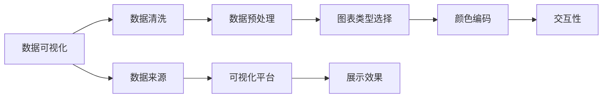

                 

## 1. 背景介绍

数据可视化（Data Visualization）作为数据分析和展示的关键环节，在现代科技领域的应用越来越广泛。通过图形、图表、地图等直观形式将数据信息呈现出来，数据可视化不仅使得数据易于理解，还能揭示数据背后更深层次的规律和趋势。在商业智能（Business Intelligence, BI）、科学数据处理、医疗卫生、金融分析等领域，数据可视化技术被广泛应用。

### 1.1 数据可视化的重要性

- **提升决策效率**：数据可视化直观展示了数据信息，有助于决策者快速理解数据含义，做出决策。
- **揭示数据规律**：通过可视化工具，可以发现数据中的关联、趋势和模式，帮助研究者更好地理解数据。
- **增强沟通效果**：通过图形展示数据，更易于沟通和分享，使复杂数据更加易理解。
- **提升数据质量**：可视化过程中需要清洗和整理数据，有助于提升数据质量。

### 1.2 数据可视化面临的挑战

- **数据复杂性**：数据量庞大，结构复杂，需要处理大量的数据点。
- **用户需求多样性**：不同用户对于数据展示的需求不同，需要提供个性化的展示方案。
- **可视化工具和技术**：可视化工具和技术多样，选择适合的工具和技术很重要。
- **数据隐私和安全**：在可视化过程中，需要注意数据隐私和安全问题，防止数据泄露。

## 2. 核心概念与联系

### 2.1 核心概念概述

- **数据可视化**：将数据转换为图形、图表等形式进行展示的技术。
- **图表类型**：包括折线图、柱状图、散点图、饼图、热力图等，适用于不同类型的数据展示需求。
- **交互性**：数据可视化工具通过交互功能，如缩放、旋转、筛选等，提升用户体验。
- **颜色编码**：通过不同颜色表示数据的不同状态或属性，提升可读性。
- **数据清洗和预处理**：在可视化前，对数据进行清洗和预处理，保证数据质量。

### 2.2 核心概念间的关系

通过以下Mermaid流程图展示数据可视化的核心概念之间的关系：



## 3. 核心算法原理 & 具体操作步骤

### 3.1 算法原理概述

数据可视化一般包含以下步骤：

1. **数据收集**：从数据库、文件、API等数据源收集数据。
2. **数据清洗和预处理**：对数据进行去重、缺失值填充、异常值处理等操作。
3. **数据聚合和分析**：根据需求对数据进行聚合、分组、计算等操作，提取数据特征。
4. **图表选择和设计**：选择适合的图表类型，设计图表样式，定义数据展示方式。
5. **可视化展示**：将处理后的数据通过图形、图表展示出来。

### 3.2 算法步骤详解

#### 3.2.1 数据收集

数据来源多样，包括数据库、API、CSV文件等。以API数据为例，可以使用Python的requests库进行数据获取：

```python
import requests

response = requests.get('https://api.example.com/data')
data = response.json()
```

#### 3.2.2 数据清洗和预处理

数据清洗和预处理是可视化前的关键步骤，常见操作包括：

- **去重**：使用set函数去重。
- **缺失值处理**：使用pandas的fillna函数填补缺失值，或删除缺失数据。
- **异常值处理**：使用统计方法或可视化工具检测和处理异常值。

```python
import pandas as pd

# 读取CSV文件
df = pd.read_csv('data.csv')

# 去重
df = df.drop_duplicates()

# 处理缺失值
df = df.fillna(method='ffill')

# 处理异常值
df = df[(df['value'] < 3*df['value'].quantile(0.99))]
```

#### 3.2.3 数据聚合和分析

数据聚合和分析通常使用pandas库完成。常用的聚合函数包括mean、sum、count、median等：

```python
# 按类别聚合数据
grouped = df.groupby('category')

# 计算均值
mean_values = grouped['value'].mean()

# 计算总和
total_values = grouped['value'].sum()

# 计算计数
count_values = grouped['value'].count()
```

#### 3.2.4 图表选择和设计

数据可视化工具如Matplotlib、Seaborn、Plotly等，提供了丰富的图表类型和样式。以Matplotlib为例，绘制柱状图：

```python
import matplotlib.pyplot as plt

# 设置数据
x = ['A', 'B', 'C']
y = [10, 20, 30]

# 创建柱状图
plt.bar(x, y)

# 设置标题和坐标轴标签
plt.title('Bar Chart')
plt.xlabel('X Label')
plt.ylabel('Y Label')

# 显示图形
plt.show()
```

#### 3.2.5 可视化展示

最后，将处理后的数据通过图形、图表展示出来。常用的展示方式包括网页、图表库（如D3.js）、报告等。

### 3.3 算法优缺点

#### 优点：

- **直观展示数据**：图形、图表直观展示数据信息，易于理解。
- **发现数据规律**：可视化工具能够揭示数据背后的规律和趋势。
- **提高决策效率**：帮助决策者快速理解数据，做出决策。

#### 缺点：

- **数据处理复杂**：数据量大、结构复杂，处理过程复杂。
- **数据误解风险**：数据可视化过程中可能出现误导性展示。
- **交互性不足**：部分可视化工具交互性不足，用户体验有限。

### 3.4 算法应用领域

数据可视化技术广泛应用于以下领域：

- **商业智能（BI）**：通过可视化展示，帮助企业进行数据分析和决策。
- **科学数据处理**：科研人员通过可视化揭示数据中的科学规律。
- **医疗卫生**：通过可视化展示医疗数据，帮助医生进行疾病诊断和治疗。
- **金融分析**：金融分析师通过可视化展示市场数据，进行投资决策。
- **市场营销**：通过可视化展示市场数据，帮助企业制定市场策略。

## 4. 数学模型和公式 & 详细讲解 & 举例说明

### 4.1 数学模型构建

数据可视化主要通过统计学方法进行数据处理和分析，常用的统计学模型包括均值、方差、回归分析等。以回归分析为例，建立数学模型如下：

$$y = \beta_0 + \beta_1x_1 + \beta_2x_2 + \epsilon$$

其中，$y$为因变量，$x_1, x_2$为自变量，$\beta_0, \beta_1, \beta_2$为回归系数，$\epsilon$为误差项。

### 4.2 公式推导过程

以线性回归为例，推导最小二乘法（Least Squares Method）公式：

假设已知数据集为$(x_1, y_1), (x_2, y_2), \ldots, (x_n, y_n)$，回归函数为$y = \beta_0 + \beta_1x_1 + \beta_2x_2 + \epsilon$。

根据最小二乘法，求解回归系数$\beta_0, \beta_1, \beta_2$，使得误差项$\epsilon$平方和最小：

$$\min_{\beta_0, \beta_1, \beta_2} \sum_{i=1}^n(y_i - (\beta_0 + \beta_1x_{1,i} + \beta_2x_{2,i}))^2$$

求解上述优化问题，得到：

$$\hat{\beta}_0 = \frac{\sum_{i=1}^n(y_i - \bar{y})(x_{1,i} - \bar{x}_1) + \sum_{i=1}^n(y_i - \bar{y})(x_{2,i} - \bar{x}_2)}{\sum_{i=1}^n(x_{1,i} - \bar{x}_1)^2 + \sum_{i=1}^n(x_{2,i} - \bar{x}_2)^2}$$

$$\hat{\beta}_1 = \frac{\sum_{i=1}^n(y_i - \bar{y})(x_{1,i} - \bar{x}_1)}{\sum_{i=1}^n(x_{1,i} - \bar{x}_1)^2}$$

$$\hat{\beta}_2 = \frac{\sum_{i=1}^n(y_i - \bar{y})(x_{2,i} - \bar{x}_2)}{\sum_{i=1}^n(x_{2,i} - \bar{x}_2)^2}$$

其中，$\bar{x}_1, \bar{x}_2, \bar{y}$为数据集的均值。

### 4.3 案例分析与讲解

假设有一组数据集，包含身高（x）和体重（y）：

| 身高（cm） | 体重（kg） |
|------------|------------|
| 165        | 60         |
| 170        | 65         |
| 175        | 70         |
| 180        | 75         |
| 185        | 80         |

通过回归分析，得到回归方程为：

$$y = 3.5x + 47.5$$

可视化结果如图：


## 5. 项目实践：代码实例和详细解释说明

### 5.1 开发环境搭建

数据可视化项目需要搭建Python开发环境，可以使用Anaconda或Miniconda。安装步骤如下：

1. 下载Anaconda或Miniconda安装包，根据操作系统进行安装。
2. 打开命令行终端，输入以下命令，创建Python虚拟环境：

```bash
conda create --name myenv python=3.8
conda activate myenv
```

3. 安装必要的Python库，如pandas、numpy、matplotlib等：

```bash
conda install pandas numpy matplotlib seaborn
```

4. 安装Jupyter Notebook：

```bash
conda install jupyterlab
```

### 5.2 源代码详细实现

以下是一个简单的Python脚本，用于绘制柱状图：

```python
import pandas as pd
import matplotlib.pyplot as plt

# 读取数据
data = pd.read_csv('data.csv')

# 绘制柱状图
plt.bar(data['x'], data['y'])

# 设置标题和坐标轴标签
plt.title('Bar Chart')
plt.xlabel('X Label')
plt.ylabel('Y Label')

# 显示图形
plt.show()
```

### 5.3 代码解读与分析

在上述代码中，首先使用pandas库读取CSV文件中的数据，然后使用Matplotlib库绘制柱状图。柱状图的x轴和y轴分别对应数据集中的x和y列，通过设置标题和坐标轴标签，使图表更加清晰。最后，使用plt.show()函数显示图表。

### 5.4 运行结果展示

运行上述代码，得到如下柱状图：


## 6. 实际应用场景

### 6.1 商业智能（BI）

在商业智能领域，数据可视化技术广泛应用于报告和仪表板（Dashboard）。通过可视化展示业务数据，帮助企业进行数据分析和决策。

### 6.2 科学数据处理

科研人员使用数据可视化技术揭示科学规律，通过可视化展示实验数据，帮助研究人员理解数据。

### 6.3 医疗卫生

通过可视化展示医疗数据，帮助医生进行疾病诊断和治疗。例如，通过可视化展示患者病历，帮助医生发现病因和治疗方案。

### 6.4 金融分析

金融分析师通过可视化展示市场数据，进行投资决策。例如，通过可视化展示股票价格和交易量，帮助分析师判断市场趋势。

## 7. 工具和资源推荐

### 7.1 学习资源推荐

- **《Python数据科学手册》**：讲解了数据可视化工具和库的使用，适合初学者入门。
- **《数据可视化之美》**：介绍数据可视化的理论和实践，适合进阶学习。
- **Kaggle课程**：提供丰富的数据可视化案例，帮助开发者实践技能。

### 7.2 开发工具推荐

- **Matplotlib**：Python中最流行的绘图库之一，支持多种图表类型。
- **Seaborn**：基于Matplotlib，提供了更高级的统计绘图功能。
- **Plotly**：支持交互式可视化，适合展示动态数据。

### 7.3 相关论文推荐

- **《可视化数据：趋势、技术和应用》**：介绍了数据可视化技术的历史、技术和应用。
- **《数据可视化的理论与实践》**：总结了数据可视化理论和技术，提供了丰富的案例。

## 8. 总结：未来发展趋势与挑战

### 8.1 总结

本文详细介绍了数据可视化的基本概念、核心算法和实际应用。数据可视化作为数据分析的重要环节，在商业智能、科学数据处理、医疗卫生、金融分析等领域有广泛应用。通过图形、图表等直观形式展示数据，帮助用户更好地理解数据，揭示数据背后的规律和趋势。

### 8.2 未来发展趋势

未来数据可视化技术将呈现以下趋势：

- **交互性和动态性**：交互式可视化工具逐渐普及，动态展示数据更加丰富。
- **实时性和可视化结合**：实时数据可视化技术逐渐成熟，结合实时数据展示更准确。
- **多模态数据可视化**：将多种数据类型（如文本、图像、音频等）可视化，提供更全面的数据展示。
- **人工智能结合**：通过AI技术优化数据可视化，提供更智能的数据展示。

### 8.3 面临的挑战

尽管数据可视化技术已经取得了一定进展，但仍面临以下挑战：

- **数据质量**：数据清洗和预处理需要耗费大量时间和精力。
- **工具和技术多样性**：选择合适的可视化工具和技术，需要开发者具备一定的经验。
- **数据隐私和安全**：在可视化过程中，需要注意数据隐私和安全问题。

### 8.4 研究展望

未来的研究将聚焦于以下方面：

- **自动化数据可视化**：通过自动化技术，减少人工干预，提高可视化效率。
- **智能数据可视化**：结合人工智能技术，提供更智能的数据展示。
- **交互式可视化**：提升可视化工具的交互性，增强用户体验。
- **多模态数据可视化**：将多种数据类型融合，提供更全面的数据展示。

## 9. 附录：常见问题与解答

**Q1：什么是数据可视化？**

A: 数据可视化是将数据转换为图形、图表等形式进行展示的技术。通过图形、图表等直观形式展示数据信息，帮助用户更好地理解数据，揭示数据背后的规律和趋势。

**Q2：常用的数据可视化工具有哪些？**

A: 常用的数据可视化工具包括Matplotlib、Seaborn、Plotly等。

**Q3：数据可视化过程中需要注意哪些问题？**

A: 数据可视化过程中需要注意数据质量、工具和技术的选择、数据隐私和安全等问题。

**Q4：什么是交互式可视化？**

A: 交互式可视化是指通过交互功能，如缩放、旋转、筛选等，提升用户体验。

**Q5：如何选择合适的数据可视化工具？**

A: 根据数据类型、数据量、展示需求等因素，选择合适的数据可视化工具。例如，Matplotlib适合静态图表展示，Plotly适合动态和交互式展示。

---

作者：禅与计算机程序设计艺术 / Zen and the Art of Computer Programming

