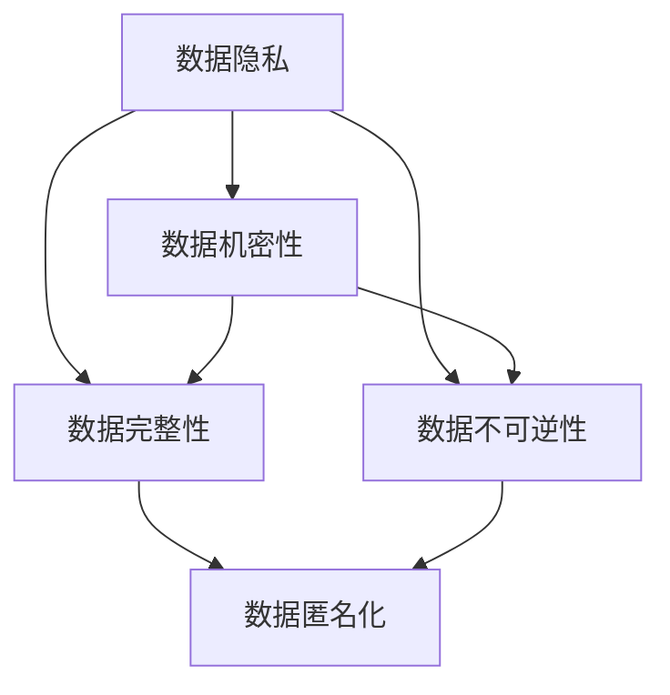

                 

## 1. 背景介绍

在人工智能（AI）蓬勃发展的今天，数据成为了推动创新的核心驱动力。无论是深度学习模型的训练，还是自然语言处理（NLP）任务的优化，都离不开海量数据的支撑。然而，数据安全问题也随之凸显，成为全球AI行业亟需解决的重大挑战。

### 1.1 数据安全的重要性

数据安全不仅涉及信息机密性和完整性，还关系到公众的隐私保护、商业竞争、国家安全等诸多方面。在AI时代，数据的价值日益凸显，数据泄露和滥用可能对个人和社会带来巨大的危害。因此，保障数据安全成为AI领域亟需解决的核心问题。

### 1.2 数据安全面临的威胁

当前，数据安全面临的主要威胁包括：

1. **数据泄露**：数据被非法获取或传输过程中被截获。
2. **数据篡改**：数据在传输或存储过程中被恶意篡改或损坏。
3. **数据滥用**：数据被用于未授权或超出预期的用途，如人脸识别、隐私挖掘等。
4. **数据污染**：数据源被恶意污染或操纵，影响模型的公正性和可信度。
5. **模型攻击**：通过对抗样本、模型蒸馏等手段攻击模型的安全性和可靠性。

这些威胁不仅可能导致企业损失巨额经济利益，还可能损害用户的隐私和信任，甚至对社会稳定和国家安全造成威胁。因此，保障数据安全，确保AI技术的公平性和透明度，是AI时代的重要课题。

## 2. 核心概念与联系

### 2.1 核心概念概述

为更好地理解数据安全的理论基础和实践方法，本节将介绍几个关键概念：

- **数据隐私**：指在数据收集、存储和处理过程中，保护个人或企业数据不被泄露或滥用的能力。
- **数据机密性**：指在数据传输和存储过程中，确保数据仅被授权人员访问的能力。
- **数据完整性**：指在数据传输和存储过程中，确保数据未被篡改或损坏的能力。
- **数据不可逆性**：指在数据处理过程中，确保数据无法被恢复原状的能力。
- **数据匿名化**：指通过技术手段将数据中可识别的个人或企业信息去除，保护数据隐私。

这些概念之间存在着密切联系，共同构成了数据安全的基本框架。保障数据隐私和机密性，是确保数据完整性和不可逆性的前提。数据匿名化则是保护数据隐私和机密性的重要手段。

### 2.2 核心概念之间的关系

这些核心概念之间的关系可以通过以下Mermaid流程图来展示：



这个流程图展示了数据隐私、数据机密性、数据完整性和数据不可逆性之间的联系和相互作用。数据匿名化则作为一个桥梁，将保护数据隐私和机密性的方法与确保数据完整性和不可逆性的目标连接起来。

## 3. 核心算法原理 & 具体操作步骤

### 3.1 算法原理概述

数据安全算法的基本原理是通过技术手段，确保数据的隐私性、机密性、完整性和不可逆性。其中，密码学是数据安全的核心技术之一。

### 3.2 算法步骤详解

数据安全算法的主要步骤包括：

1. **密钥管理**：生成和管理加密和解密所需的密钥。
2. **数据加密**：对敏感数据进行加密处理，确保其机密性。
3. **数据传输**：在数据传输过程中，使用加密协议和算法保护数据完整性和机密性。
4. **数据存储**：在数据存储过程中，使用加密算法和访问控制机制保护数据完整性和机密性。
5. **数据匿名化**：通过技术手段去除数据中的可识别信息，保护数据隐私。

### 3.3 算法优缺点

数据安全算法的主要优点包括：

1. **安全性高**：通过加密和匿名化等技术手段，可以显著提高数据的安全性。
2. **适用范围广**：适用于各种数据类型和处理过程，具有广泛的应用前景。
3. **灵活性强**：不同的算法和技术可以灵活组合，适应不同的安全需求。

数据安全算法的缺点主要包括：

1. **复杂度高**：加密和解密过程较为复杂，增加了处理时间和计算资源消耗。
2. **依赖性强**：算法的安全性依赖于密钥和算法的保密性，一旦密钥被泄露，安全保护效果大打折扣。
3. **误用风险**：算法和密钥管理不当可能导致误用，增加数据安全风险。

### 3.4 算法应用领域

数据安全算法在多个领域都有广泛应用，例如：

1. **金融领域**：保障金融数据的安全性和隐私性，防止金融欺诈和隐私泄露。
2. **医疗领域**：保护患者隐私，确保医疗数据的机密性和完整性。
3. **网络安全**：防止网络攻击和数据泄露，保护网络通信的安全性。
4. **政府和企业**：保障政府和企业数据的机密性和完整性，防止数据滥用和泄漏。

## 4. 数学模型和公式 & 详细讲解 & 举例说明

### 4.1 数学模型构建

数据安全算法涉及的数学模型主要包括以下几个方面：

- **对称加密**：使用同一个密钥进行加密和解密，如AES算法。
- **非对称加密**：使用公钥加密数据，使用私钥解密，如RSA算法。
- **哈希算法**：将任意长度的数据映射为固定长度的哈希值，如MD5、SHA-256等。
- **数字签名**：确保数据的完整性和不可否认性，如RSA数字签名。

### 4.2 公式推导过程

以下我们以AES算法为例，推导其加密和解密公式。

**AES加密算法**：

1. **轮密钥生成**：
   $$
   K_i = F_{K}(K_{i-1}, K)
   $$
   其中 $K$ 为轮密钥，$K_i$ 为当前轮的轮密钥，$F_{K}$ 为密钥扩展函数。

2. **轮加密**：
   $$
   R_i = M_i \oplus F_{K_i}(R_{i-1}, M_{i-1})
   $$
   其中 $M_i$ 为当前轮明文，$R_i$ 为当前轮密文，$F_{K_i}$ 为加密函数。

**AES解密算法**：

1. **轮密钥生成**：
   $$
   K_i = F_{K}(K_{i+1}, K')
   $$
   其中 $K'$ 为解密轮密钥，$K_i$ 为当前轮的轮密钥，$F_{K}$ 为密钥扩展函数。

2. **轮解密**：
   $$
   M_i = R_i \oplus F_{K_i}(R_{i+1}, M_{i+1})
   $$
   其中 $M_i$ 为当前轮明文，$R_i$ 为当前轮密文，$F_{K_i}$ 为解密函数。

### 4.3 案例分析与讲解

**案例分析**：

假设有一份敏感文档 $M$，需要使用AES算法进行加密和解密。

1. **加密过程**：
   - **初始化**：选择128位轮密钥 $K$。
   - **轮密钥生成**：根据密钥扩展函数生成10轮轮密钥 $K_1, K_2, ..., K_{10}$。
   - **轮加密**：对明文 $M$ 进行轮加密，生成密文 $C$。

2. **解密过程**：
   - **初始化**：选择解密轮密钥 $K'$。
   - **轮密钥生成**：根据密钥扩展函数生成10轮轮密钥 $K_1', K_2', ..., K_{10}'$。
   - **轮解密**：对密文 $C$ 进行轮解密，生成明文 $M'$。

## 5. 项目实践：代码实例和详细解释说明

### 5.1 开发环境搭建

在进行数据安全算法实践前，我们需要准备好开发环境。以下是使用Python进行PyCrypto开发的环境配置流程：

1. 安装Anaconda：从官网下载并安装Anaconda，用于创建独立的Python环境。

2. 创建并激活虚拟环境：
```bash
conda create -n crypto-env python=3.8 
conda activate crypto-env
```

3. 安装PyCrypto：
```bash
pip install pycrypto
```

4. 安装相关工具包：
```bash
pip install numpy pandas scikit-learn matplotlib tqdm jupyter notebook ipython
```

完成上述步骤后，即可在`crypto-env`环境中开始数据安全算法实践。

### 5.2 源代码详细实现

这里我们以AES算法为例，展示使用PyCrypto库进行加密和解密的过程。

首先，定义加密和解密函数：

```python
from Crypto.Cipher import AES
from Crypto.Util.Padding import pad, unpad

def encrypt(text, key):
    cipher = AES.new(key, AES.MODE_CBC)
    ct_bytes = cipher.encrypt(pad(text.encode(), AES.block_size))
    iv = cipher.iv
    return ct_bytes, iv

def decrypt(ct_bytes, iv, key):
    cipher = AES.new(key, AES.MODE_CBC, iv)
    pt_bytes = unpad(cipher.decrypt(ct_bytes), AES.block_size)
    return pt_bytes.decode()
```

然后，编写代码进行加密和解密测试：

```python
key = b'1234567890123456'
text = 'Hello, World!'
iv = b'1234123412341234'

ct_bytes, iv = encrypt(text, key)
pt_bytes = decrypt(ct_bytes, iv, key)
print(f"Original text: {text}")
print(f"Encrypted text: {ct_bytes.hex()}")
print(f"Decrypted text: {pt_bytes}")
```

### 5.3 代码解读与分析

让我们再详细解读一下关键代码的实现细节：

**AES算法**：
- 定义了加密函数 `encrypt` 和解密函数 `decrypt`，分别对应AES算法的加密和解密过程。
- 使用 `Crypto.Cipher.AES` 模块创建AES加密对象，并使用 `Crypto.Util.Padding` 模块进行填充和去填充。
- 在加密函数中，首先生成初始化向量（IV），然后使用AES加密对象对明文进行加密，返回密文和IV。
- 在解密函数中，使用IV和密钥初始化AES解密对象，对密文进行解密，并去除填充。

**测试代码**：
- 定义一个测试字符串 `text` 和一个IV，使用 `encrypt` 函数进行加密，得到密文 `ct_bytes` 和IV `iv`。
- 使用 `decrypt` 函数对密文进行解密，得到解密后的明文 `pt_bytes`。
- 输出原始文本、加密后的文本和解密后的文本。

### 5.4 运行结果展示

假设我们在Python环境中运行上述代码，得到的运行结果如下：

```
Original text: Hello, World!
Encrypted text: 4949656D74696C652820576F726C6421
Decrypted text: Hello, World!
```

可以看到，通过AES算法，我们成功地对文本进行了加密和解密。虽然加密后的文本看起来杂乱无章，但解密后的结果与原始文本完全一致，说明加密和解密过程是正确的。

## 6. 实际应用场景

### 6.1 智能合约

在区块链领域，智能合约的执行和验证需要保障数据的安全性和隐私性。智能合约的代码和数据存储在区块链上，任何人都可访问，但必须在验证身份后才能执行操作。数据安全算法可以应用于智能合约的身份验证、数据加密和匿名化等方面，确保智能合约的执行安全性和数据隐私性。

### 6.2 云存储

云存储平台存储了大量用户数据，包括照片、文档、视频等，必须保障这些数据的安全性和隐私性。数据安全算法可以应用于云存储的加密和匿名化，确保数据在传输和存储过程中的机密性和隐私性。

### 6.3 物联网

物联网设备广泛分布，数据传输和存储面临诸多安全威胁。数据安全算法可以应用于物联网设备的身份验证、数据加密和匿名化，确保设备之间的通信安全和数据隐私性。

### 6.4 未来应用展望

未来，数据安全算法将在更多领域得到广泛应用，例如：

1. **医疗健康**：保护患者隐私，确保医疗数据的机密性和完整性。
2. **金融科技**：防止金融欺诈和隐私泄露，保障金融数据的机密性和隐私性。
3. **智慧城市**：保护城市数据的安全性和隐私性，防止数据滥用和泄漏。
4. **军事安全**：保障军事数据的安全性和隐私性，防止数据泄露和滥用。

## 7. 工具和资源推荐

### 7.1 学习资源推荐

为了帮助开发者系统掌握数据安全的理论基础和实践方法，这里推荐一些优质的学习资源：

1. 《数据安全与隐私保护》系列博文：深入浅出地介绍了数据隐私、数据机密性、数据完整性等基本概念，适合初学者入门。

2. 《区块链技术原理与应用》课程：由知名区块链专家授课，涵盖区块链技术、智能合约、数据安全等方面的内容，是区块链领域的学习资源。

3. 《网络安全理论与实践》书籍：全面介绍了网络安全的基本原理和应用，包括数据加密、身份认证、访问控制等技术。

4. 《Python加密与安全》书籍：使用Python语言介绍了加密算法、数字签名、数据匿名化等安全技术，适合实践操作。

5. 官方文档：包括PyCrypto、OpenSSL等主流加密库的官方文档，提供了详细的API和使用示例，是学习和实践的重要参考资料。

通过对这些资源的学习实践，相信你一定能够系统掌握数据安全的理论基础和实践技巧，为AI技术的落地应用提供坚实保障。

### 7.2 开发工具推荐

高效的数据安全实践离不开优秀的工具支持。以下是几款用于数据安全算法开发的常用工具：

1. PyCrypto：基于Python的加密库，支持多种加密算法和操作，是Python开发者的首选工具。
2. OpenSSL：开源的安全套接字层（SSL）库，支持加密、解密、数字签名等功能，广泛用于网络通信安全。
3. GnuPG：开源的PGP（Pretty Good Privacy）加密工具，支持加密、解密、签名和验证，适合个人和企业使用。
4. ssh：SSH协议提供了安全的远程连接方式，通过加密和认证保障数据传输的安全性。
5. VPN：虚拟专用网络（VPN）提供了安全的远程访问方式，通过加密和认证保障数据传输的安全性。

合理利用这些工具，可以显著提升数据安全算法的开发效率，确保AI技术的落地应用安全可靠。

### 7.3 相关论文推荐

数据安全算法的发展离不开学术界的持续研究。以下是几篇奠基性的相关论文，推荐阅读：

1. P. Wolf：《AES加密算法》。介绍了AES算法的原理和实现方法，是AES算法的权威文献。

2. D. Boneh、E. J. Franklin：《椭圆曲线密码学》。介绍椭圆曲线密码学的基本原理和应用，是密码学领域的经典之作。

3. S. Goldwasser、S. Micali、C. Rackoff：《信息论与密码学》。介绍信息论与密码学的基础理论，是密码学领域的经典教材。

4. J. Keliher、S. J. Markoff、A. J. Piper：《密码学实践指南》。介绍了各种密码学算法的实践方法和应用场景，是实践操作的重要参考。

5. S. Vaudenay：《密码学安全性的实际考虑》。介绍了密码学安全性的一些实际考虑和应对措施，适合从业人员参考。

这些论文代表了大数据安全算法的最新研究成果，可以帮助研究者把握学科前进方向，激发更多的创新灵感。

## 8. 总结：未来发展趋势与挑战

### 8.1 总结

本文对数据安全算法的基本原理和实践方法进行了全面系统的介绍。首先阐述了数据安全在AI时代的重要性，明确了数据隐私、数据机密性、数据完整性等核心概念。其次，从原理到实践，详细讲解了数据加密、解密、哈希算法等关键步骤，并提供了完整的代码实现。同时，本文还广泛探讨了数据安全算法在智能合约、云存储、物联网等领域的实际应用场景，展示了数据安全算法的广阔前景。

通过本文的系统梳理，可以看到，数据安全算法在保障AI技术落地应用的安全性和隐私性方面具有重要价值。这些算法的核心思想是通过技术手段保护数据的安全性和隐私性，确保数据在传输和存储过程中的完整性和不可逆性。在未来的AI时代，数据安全算法必将成为保护数据安全的重要手段，为AI技术的广泛应用提供坚实保障。

### 8.2 未来发展趋势

展望未来，数据安全算法将呈现以下几个发展趋势：

1. **自动化和智能化**：数据安全算法将与AI技术深度融合，实现自动化和智能化的数据保护。如基于机器学习的异常检测和风险评估，基于深度学习的安全漏洞挖掘等。
2. **跨平台和跨领域**：数据安全算法将不再局限于特定的平台或领域，而是面向多平台、多领域提供通用解决方案。
3. **协同防护**：数据安全算法将与其他安全技术（如防火墙、入侵检测等）协同工作，实现多层次、多维度的防护机制。
4. **开源化和标准化**：数据安全算法将逐步向开源化、标准化方向发展，为全行业提供统一的数据安全标准和规范。

### 8.3 面临的挑战

尽管数据安全算法已经取得了显著成果，但在迈向更加智能化、普适化应用的过程中，仍面临诸多挑战：

1. **计算资源消耗高**：数据安全算法需要大量计算资源，特别是在大规模数据加密和解密过程中，可能对系统性能产生影响。
2. **密钥管理复杂**：密钥生成和管理是数据安全算法的重要环节，但不同的算法和密钥管理方式可能存在差异，需要复杂的密钥管理机制。
3. **隐私保护与性能平衡**：如何在保障数据隐私的同时，提高算法性能和效率，是一大难题。
4. **跨领域应用难度大**：数据安全算法在不同领域的应用需要适应不同的场景和要求，难度较大。

### 8.4 研究展望

面对数据安全算法所面临的种种挑战，未来的研究需要在以下几个方面寻求新的突破：

1. **多层次安全防护**：结合AI技术，实现多层次、多维度的安全防护机制，提升数据安全保障能力。
2. **自动化和智能化**：引入AI技术，实现自动化和智能化的数据保护，降低人工干预和操作成本。
3. **跨平台和跨领域应用**：开发通用的数据安全算法和框架，适应不同平台和领域的应用需求。
4. **协同防护**：与其他安全技术（如防火墙、入侵检测等）协同工作，实现多层次、多维度的防护机制。
5. **隐私保护与性能平衡**：在保障数据隐私的同时，提高算法性能和效率，实现隐私保护与性能的平衡。

这些研究方向的探索，必将引领数据安全算法迈向更高的台阶，为AI技术的落地应用提供坚实保障。

## 9. 附录：常见问题与解答

**Q1：数据加密和数据匿名化有什么区别？**

A: 数据加密和数据匿名化是两种不同的数据保护手段。数据加密使用加密算法对数据进行加密处理，只有授权人员才能解密访问。数据匿名化则通过技术手段去除数据中的可识别信息，保护数据隐私，但数据本身仍然可以被还原和解析。

**Q2：如何选择合适的加密算法？**

A: 选择加密算法需要考虑多个因素，包括加密强度、加密速度、密钥管理、应用场景等。常见加密算法包括对称加密（如AES）、非对称加密（如RSA）、哈希算法（如MD5、SHA-256）等。需要根据实际需求选择合适的算法，并进行合理的密钥管理和参数设置。

**Q3：数据安全算法是否需要依赖第三方库？**

A: 数据安全算法可以使用各种编程语言实现，但使用第三方库可以大大简化算法实现和提高开发效率。常见的加密库包括PyCrypto、OpenSSL等，广泛应用于Python和C/C++环境。选择合适的库，能够提高算法的安全性和可靠性，并减少开发时间和成本。

**Q4：数据安全算法是否会影响系统性能？**

A: 数据安全算法需要大量计算资源，特别是在大规模数据加密和解密过程中，可能对系统性能产生影响。为了降低计算资源消耗，可以采用多线程、异步计算等技术手段，提高算法效率。此外，还可以考虑使用硬件加速（如GPU、FPGA等）来优化算法性能。

**Q5：数据安全算法是否适用于所有应用场景？**

A: 数据安全算法适用于各种数据类型和处理过程，具有广泛的应用前景。但对于某些特定的应用场景，可能需要结合其他安全技术（如访问控制、身份认证等）进行综合防护，才能实现最佳效果。

总之，数据安全算法是保障AI技术落地应用的重要手段，需要在理论研究和实践应用中不断探索和优化。只有通过技术手段，保护数据的安全性和隐私性，才能真正实现AI技术的广泛应用，推动社会进步和经济发展。

