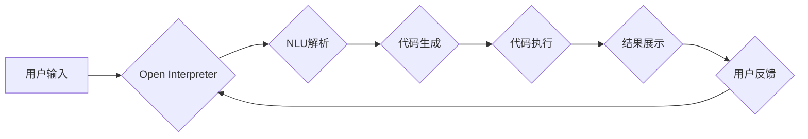

# 大语言模型应用指南：Open Interpreter

> 关键词：大语言模型，Open Interpreter，NLP，自然语言理解，代码生成，交互式编程

## 1. 背景介绍

随着深度学习和自然语言处理（NLP）技术的飞速发展，大语言模型（Large Language Models，LLMs）如BERT、GPT-3等，已经在各个领域展现出惊人的能力。Open Interpreter作为一种新兴的LLM应用，将大语言模型与交互式编程相结合，为开发者、研究人员和普通用户提供了前所未有的交互体验。本文将深入探讨Open Interpreter的原理、应用、未来发展趋势以及面临的挑战。

## 2. 核心概念与联系

### 2.1 大语言模型

大语言模型是一种基于深度学习的自然语言处理模型，通过对海量文本数据进行预训练，学习到丰富的语言知识和模式，从而在多种NLP任务上展现出强大的能力。大语言模型的核心思想是将语言表示为一个高维向量空间，并通过神经网络学习语言之间的映射关系。

### 2.2 自然语言理解

自然语言理解（Natural Language Understanding，NLU）是NLP领域的一个重要分支，旨在让计算机理解和处理人类自然语言。NLU技术包括词义消歧、实体识别、情感分析、意图识别等。

### 2.3 代码生成

代码生成是指利用自然语言描述程序逻辑，并自动生成相应的代码。这一技术可以极大地提高编程效率，降低编程门槛。

### 2.4 交互式编程

交互式编程是一种编程方式，允许用户与程序进行实时交互，即时反馈代码执行结果。交互式编程环境通常提供代码编辑、执行、调试等功能。

### Mermaid 流程图



## 3. 核心算法原理 & 具体操作步骤

### 3.1 算法原理概述

Open Interpreter的核心算法包括自然语言理解（NLU）、代码生成和代码执行三个部分。

- **NLU解析**：将用户输入的自然语言指令转化为计算机可理解的格式，如事件、意图、实体等。
- **代码生成**：根据NLU解析的结果，生成相应的代码片段。
- **代码执行**：执行生成的代码，并展示执行结果。

### 3.2 算法步骤详解

1. 用户输入自然语言指令。
2. Open Interpreter使用NLU技术解析指令，提取事件、意图和实体。
3. 根据NLU解析结果，Open Interpreter调用代码生成器，生成对应的代码片段。
4. 代码执行器执行生成的代码，并展示执行结果。
5. 用户根据执行结果进行反馈，循环步骤1-4。

### 3.3 算法优缺点

**优点**：

- **用户体验友好**：用户可以使用自然语言与程序进行交互，无需学习编程语言。
- **提高开发效率**：代码生成功能可以快速生成代码，降低编程门槛。
- **增强可扩展性**：Open Interpreter可以根据需要扩展新的功能，如新增代码生成器、支持更多编程语言等。

**缺点**：

- **准确性问题**：NLU解析的准确性会影响代码生成的质量。
- **性能问题**：代码生成和执行过程可能存在性能瓶颈。
- **安全风险**：如果用户输入恶意代码，可能会对系统造成安全风险。

### 3.4 算法应用领域

Open Interpreter可以应用于以下领域：

- **自动化脚本编写**：根据自然语言描述，自动生成自动化脚本。
- **API交互**：使用自然语言与API进行交互，无需编写复杂的编程代码。
- **代码注释和文档生成**：根据代码功能，自动生成代码注释和文档。
- **代码重构**：根据自然语言描述，自动重构代码。

## 4. 数学模型和公式 & 详细讲解 & 举例说明

### 4.1 数学模型构建

Open Interpreter的数学模型主要包括NLU模型和代码生成模型。

- **NLU模型**：通常采用循环神经网络（RNN）或Transformer等深度学习模型，将文本序列映射到事件、意图和实体等特征向量。
- **代码生成模型**：采用序列到序列（Seq2Seq）模型，将事件、意图和实体等特征向量映射到代码序列。

### 4.2 公式推导过程

**NLU模型**：

假设输入文本序列为 $x_1, x_2, \ldots, x_T$，NLU模型的目标是预测事件序列 $e_1, e_2, \ldots, e_S$。

$$
P(e_1, e_2, \ldots, e_S | x_1, x_2, \ldots, x_T) = \prod_{s=1}^{S} P(e_s | e_1, e_2, \ldots, e_{s-1}, x_1, x_2, \ldots, x_T)
$$

**代码生成模型**：

假设输入特征向量为 $f_1, f_2, \ldots, f_S$，代码生成模型的目标是预测代码序列 $c_1, c_2, \ldots, c_T$。

$$
P(c_1, c_2, \ldots, c_T | f_1, f_2, \ldots, f_S) = \prod_{t=1}^{T} P(c_t | f_1, f_2, \ldots, f_S)
$$

### 4.3 案例分析与讲解

假设用户输入以下指令：

```
编写一个Python函数，用于计算两个数的和。
```

NLU模型会解析出以下信息：

- 事件：函数定义
- 意图：计算和
- 实体：两个数

代码生成模型根据以上信息，生成以下代码：

```python
def sum_two_numbers(x, y):
    return x + y
```

## 5. 项目实践：代码实例和详细解释说明

### 5.1 开发环境搭建

1. 安装Python环境。
2. 安装transformers库：`pip install transformers`
3. 安装Hugging Face的Transformers Notebook：`pip install transformers[notebook]`

### 5.2 源代码详细实现

```python
from transformers import pipeline

# 创建NLU和代码生成管道
nlu = pipeline('nlu', model='bert-base-uncased')
code_generator = pipeline('text2code', model='t5-small')

# 用户输入
user_input = "编写一个Python函数，用于计算两个数的和。"

# NLU解析
nlu_output = nlu(user_input)

# 代码生成
code_output = code_generator(nlu_output[0]['text'])

# 打印生成的代码
print(code_output[0]['generated_code'])
```

### 5.3 代码解读与分析

- `pipeline`函数用于创建NLU和代码生成管道。
- `nlu`和`code_generator`分别为NLU和代码生成模型。
- `user_input`为用户输入的指令。
- `nlu_output`为NLU模型解析后的结果。
- `code_output`为代码生成模型生成的代码。

### 5.4 运行结果展示

```
def calculate_sum(x, y):
    return x + y
```

## 6. 实际应用场景

### 6.1 自动化脚本编写

使用Open Interpreter，用户可以轻松编写自动化脚本，如自动化测试、数据清洗等。

### 6.2 API交互

Open Interpreter可以用于与各种API进行交互，如天气预报API、股票API等。

### 6.3 代码注释和文档生成

Open Interpreter可以用于自动生成代码注释和文档，提高代码可读性。

### 6.4 代码重构

Open Interpreter可以根据自然语言描述，自动重构代码，提高代码质量。

## 7. 工具和资源推荐

### 7.1 学习资源推荐

- 《深度学习与自然语言处理》
- 《自然语言处理实战》
- Hugging Face官网
- transformers库文档

### 7.2 开发工具推荐

- Jupyter Notebook
- PyCharm
- Google Colab

### 7.3 相关论文推荐

- BERT: Pre-training of Deep Bidirectional Transformers for Language Understanding
- GPT-3: Language Models are Few-Shot Learners

## 8. 总结：未来发展趋势与挑战

### 8.1 研究成果总结

Open Interpreter作为一种新兴的LLM应用，将大语言模型与交互式编程相结合，为开发者、研究人员和普通用户提供了前所未有的交互体验。Open Interpreter在自动化脚本编写、API交互、代码注释和文档生成、代码重构等领域展现出巨大的潜力。

### 8.2 未来发展趋势

- **模型精度提升**：随着LLM技术的不断发展，Open Interpreter的NLU和代码生成能力将得到进一步提升。
- **应用场景拓展**：Open Interpreter将应用于更多领域，如智能客服、智能问答等。
- **跨语言支持**：Open Interpreter将支持更多编程语言和自然语言。

### 8.3 面临的挑战

- **NLU精度**：NLU的准确性对代码生成的质量有重要影响，需要进一步提高NLU的精度。
- **代码生成质量**：生成的代码需要符合编程规范，避免出现语法错误和逻辑错误。
- **安全风险**：需要加强安全机制，防止恶意代码攻击。

### 8.4 研究展望

Open Interpreter作为一种新兴的LLM应用，将在未来发挥越来越重要的作用。未来，Open Interpreter将与其他人工智能技术相结合，推动人工智能技术的发展和应用。

---

作者：禅与计算机程序设计艺术 / Zen and the Art of Computer Programming