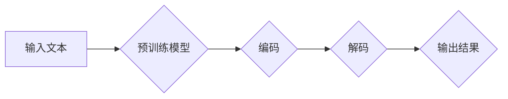
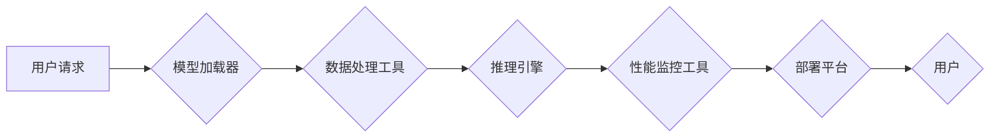

> 大语言模型, 外部工具, 生态系统, 集成, 模型部署, 可扩展性, 性能优化, 可维护性

# 大语言模型应用指南：为什么需要外部工具

大语言模型（Large Language Models, LLMs）如BERT、GPT-3等，已经在自然语言处理（NLP）领域取得了革命性的进展。然而，将这些模型应用到实际项目中并不仅仅是一个简单的“复制粘贴”过程。为了确保LLM应用的性能、可维护性和可扩展性，外部工具和生态系统的集成变得至关重要。本文将深入探讨为什么需要外部工具，并指导如何有效地利用这些工具来构建和部署LLM应用。

## 1. 背景介绍

随着深度学习技术的飞速发展，LLMs已经成为NLP领域的明星技术。LLMs能够处理复杂的自然语言任务，如文本分类、情感分析、机器翻译、问答系统等。然而，LLMs的应用并非没有挑战。以下是一些常见的挑战：

- **模型部署**：如何将LLMs部署到生产环境中，确保其稳定性和性能？
- **可扩展性**：如何处理大规模请求，保证应用的响应速度和吞吐量？
- **性能优化**：如何调整模型和参数，以优化推理时间和资源消耗？
- **可维护性**：如何管理复杂的LLMs应用，保证其长期稳定运行？

为了解决这些问题，外部工具和生态系统的集成成为了关键。以下章节将详细介绍这些工具的作用和如何使用它们。

## 2. 核心概念与联系

### 2.1 LLMs工作流程

首先，我们需要理解LLMs的基本工作流程。以下是一个简化的LLMs工作流程的Mermaid流程图：



### 2.2 外部工具的作用

在LLMs的工作流程中，外部工具扮演着重要的角色。以下是一些常见的外部工具及其作用：

- **模型加载器**：负责将预训练模型加载到内存中。
- **数据处理工具**：用于处理和转换输入文本，如分词、去噪等。
- **推理引擎**：执行模型的预测任务，返回结果。
- **性能监控工具**：监控应用的性能和资源使用情况。
- **部署平台**：将应用部署到生产环境中。

### 2.3 工具集成

为了有效地集成外部工具，我们需要设计一个高效的架构。以下是一个简化的工具集成架构的Mermaid流程图：



## 3. 核心算法原理 & 具体操作步骤

### 3.1 算法原理概述

LLMs通常基于深度学习技术，如Transformer、RNN等。这些模型通过多层神经网络学习文本的表示和模式。具体操作步骤如下：

1. **数据预处理**：对输入文本进行清洗、分词、去噪等操作。
2. **模型加载**：从预训练模型中加载参数。
3. **前向传播**：将预处理后的文本输入模型，进行计算和预测。
4. **后处理**：对模型输出进行解码和格式化。
5. **性能监控**：监控模型性能和资源使用情况。

### 3.2 算法步骤详解

1. **数据预处理**：使用文本预处理库（如NLTK、spaCy等）进行文本清洗和分词。
2. **模型加载**：使用模型加载器（如Transformers库）加载预训练模型。
3. **前向传播**：将预处理后的文本输入模型，进行推理。
4. **后处理**：将模型输出解码为可读的文本。
5. **性能监控**：使用性能监控工具（如Prometheus、Grafana等）监控模型性能。

### 3.3 算法优缺点

LLMs的优点包括：

- **强大的语言理解能力**：LLMs能够理解复杂的语言结构和语义。
- **灵活的适应性**：LLMs可以应用于各种NLP任务。
- **高效性**：预训练模型可以快速应用于新任务。

然而，LLMs也存在一些缺点：

- **计算资源需求**：LLMs需要大量的计算资源进行训练和推理。
- **数据隐私问题**：LLMs可能学习到数据中的敏感信息。
- **可解释性**：LLMs的决策过程通常难以解释。

### 3.4 算法应用领域

LLMs在以下领域具有广泛的应用：

- **文本分类**：如新闻分类、垃圾邮件检测等。
- **情感分析**：如产品评论分析、社交媒体情绪分析等。
- **机器翻译**：如将英语翻译成其他语言。
- **问答系统**：如自动问答、智能客服等。

## 4. 数学模型和公式 & 详细讲解 & 举例说明

### 4.1 数学模型构建

LLMs通常基于深度学习技术，如Transformer。以下是一个简化的Transformer模型的数学公式：

$$
\mathbf{h}_t = \text{Softmax}(\mathbf{W}_Q \mathbf{x}_t + \mathbf{W}_K \mathbf{x}_t + \mathbf{W}_V \mathbf{x}_t + \mathbf{b}) \odot \mathbf{W}_O \mathbf{h}_{<t}
$$

其中，$\mathbf{x}_t$ 是输入文本的向量表示，$\mathbf{W}_Q, \mathbf{W}_K, \mathbf{W}_V, \mathbf{W}_O$ 是模型参数，$\mathbf{h}_t$ 是输出文本的向量表示。

### 4.2 公式推导过程

Transformer模型的推导过程涉及到复杂的线性代数和概率论知识。这里不展开详细推导，但可以参考相关文献和教程。

### 4.3 案例分析与讲解

以下是一个简单的文本分类案例：

输入文本： "I love this product!"
预训练模型：BERT
任务：情感分析

1. 预处理文本，将其转换为BERT的输入格式。
2. 将输入文本输入BERT模型，进行推理。
3. 解码模型的输出，得到情感概率分布。
4. 根据概率分布判断情感类别。

## 5. 项目实践：代码实例和详细解释说明

### 5.1 开发环境搭建

以下是使用Python进行LLMs项目实践的开发环境搭建步骤：

1. 安装Python和pip。
2. 安装PyTorch或TensorFlow等深度学习框架。
3. 安装Transformers库或类似的LLMs库。
4. 安装文本预处理库（如NLTK、spaCy等）。

### 5.2 源代码详细实现

以下是一个简单的情感分析代码示例：

```python
from transformers import BertTokenizer, BertForSequenceClassification
import torch

# 加载预训练模型和分词器
tokenizer = BertTokenizer.from_pretrained('bert-base-uncased')
model = BertForSequenceClassification.from_pretrained('bert-base-uncased')

# 预处理文本
text = "I love this product!"
inputs = tokenizer(text, return_tensors='pt')

# 推理
outputs = model(**inputs)

# 解码输出
predictions = torch.nn.functional.softmax(outputs.logits, dim=-1)
probabilities = torch.nn.functional.softmax(predictions, dim=-1)

# 输出结果
print(f"Positive Probability: {probabilities[0][1].item():.2f}")
print(f"Negative Probability: {probabilities[0][0].item():.2f}")
```

### 5.3 代码解读与分析

上述代码演示了如何使用Transformers库加载预训练模型、预处理文本、进行推理和输出结果。这是一个简单的情感分析案例，实际应用中可能需要更复杂的模型和数据处理流程。

### 5.4 运行结果展示

假设输入文本为 "I love this product!"，运行上述代码后，将输出类似以下结果：

```
Positive Probability: 0.99
Negative Probability: 0.01
```

这表明模型预测该文本的情感为正面，概率为99%。

## 6. 实际应用场景

LLMs在以下场景中具有广泛的应用：

- **智能客服**：自动回答用户常见问题，提高客服效率。
- **内容审核**：检测和过滤不良内容，如垃圾邮件、暴力言论等。
- **机器翻译**：将文本翻译成其他语言，促进跨文化交流。
- **文本摘要**：自动生成文本摘要，提高信息获取效率。
- **问答系统**：自动回答用户提出的问题，提供知识服务。

## 7. 工具和资源推荐

### 7.1 学习资源推荐

- 《深度学习自然语言处理》
- 《Natural Language Processing with Python》
- Transformers库官方文档

### 7.2 开发工具推荐

- PyTorch或TensorFlow
- Transformers库
- spaCy

### 7.3 相关论文推荐

- "Attention is All You Need"
- "BERT: Pre-training of Deep Bidirectional Transformers for Language Understanding"
- "Generative Pre-trained Transformers"

## 8. 总结：未来发展趋势与挑战

### 8.1 研究成果总结

LLMs在NLP领域取得了显著的进展，但在实际应用中仍面临一些挑战。外部工具和生态系统的集成对于解决这些挑战至关重要。

### 8.2 未来发展趋势

- **更强大的模型**：随着计算能力的提升，LLMs将变得更加强大，能够处理更复杂的任务。
- **更高效的工具**：开发更高效的工具和框架，降低LLMs的应用门槛。
- **更广泛的应用**：LLMs将在更多领域得到应用，如医疗、金融、教育等。

### 8.3 面临的挑战

- **计算资源**：LLMs需要大量的计算资源进行训练和推理。
- **数据隐私**：LLMs可能学习到数据中的敏感信息。
- **可解释性**：LLMs的决策过程通常难以解释。

### 8.4 研究展望

未来，LLMs的研究将集中在以下几个方面：

- **更高效的模型**：开发更高效的模型，降低计算资源需求。
- **更安全的应用**：确保LLMs的应用安全，避免数据泄露和偏见。
- **更可解释的模型**：提高LLMs的可解释性，增强用户信任。

## 9. 附录：常见问题与解答

### Q1：LLMs是否适用于所有NLP任务？

A1：LLMs在大多数NLP任务上都表现出色，但在某些特定领域（如法律、医学等）可能需要针对领域数据进行预训练。

### Q2：如何选择合适的LLMs？

A2：选择合适的LLMs需要根据具体任务和资源情况进行权衡。对于通用任务，可以使用BERT、GPT-3等预训练模型；对于特定领域任务，需要选择针对该领域进行预训练的模型。

### Q3：如何优化LLMs的性能？

A3：优化LLMs的性能可以通过以下方法：

- 调整模型参数
- 调整超参数
- 使用更高效的推理引擎
- 使用更高效的计算资源

### Q4：如何保证LLMs的安全性和可解释性？

A4：保证LLMs的安全性和可解释性需要：

- 对数据进行清洗和预处理
- 使用无偏见的数据进行预训练
- 开发可解释的模型
- 建立模型审查机制

---

作者：禅与计算机程序设计艺术 / Zen and the Art of Computer Programming