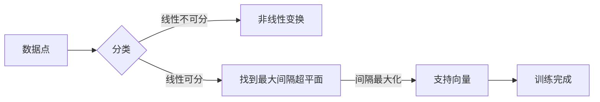

# 支持向量机(Support Vector Machines) - 原理与代码实例讲解

> 关键词：支持向量机, SVM, 线性分类器, 非线性分类器, 核技巧, 损失函数, 优化算法, 机器学习

## 1. 背景介绍

支持向量机（Support Vector Machines，SVM）是机器学习领域中最强大的分类和回归算法之一。它通过找到数据集中的最优超平面，将数据点划分为不同的类别。SVM在图像识别、文本分类、生物信息学等领域有着广泛的应用。本文将深入探讨SVM的原理、实现和实际应用。

## 2. 核心概念与联系

### 2.1 核心概念原理

SVM的核心思想是找到一个最优的超平面，使得这个超平面能够将不同类别的数据点尽可能分开。这个超平面被称为最大间隔超平面（Maximum Margin Hyperplane），它能够最大化类别之间的间隔。

### 2.2 架构的 Mermaid 流程图



### 2.3 核心概念联系

- 数据点：SVM工作的基本单元，是输入空间中的点。
- 分类：根据数据点的特征，将其分配到不同的类别。
- 线性不可分/线性可分：数据是否可以被线性超平面有效分离。
- 非线性变换：当数据线性不可分时，通过非线性变换将数据映射到高维空间。
- 最大间隔超平面：在数据线性可分时，SVM试图找到的最优超平面。
- 支持向量：位于最大间隔超平面两侧且距离超平面最近的点。
- 训练完成：SVM模型训练完成后，可以用于分类或回归任务。

## 3. 核心算法原理 & 具体操作步骤

### 3.1 算法原理概述

SVM的目标是最小化损失函数，该函数通常与间隔最大化相关。对于线性可分的数据，损失函数可以表示为：

$$
\min_{\beta,\beta_0} \frac{1}{2} ||\beta||^2 + C\sum_{i=1}^{N} \xi_i
$$

其中，$\beta$ 是特征权重向量，$\beta_0$ 是偏置项，$C$ 是惩罚参数，$\xi_i$ 是非负松弛变量。

### 3.2 算法步骤详解

1. **选择合适的核函数**：根据数据特性选择线性核、多项式核、径向基函数（RBF）核等。
2. **计算最优解**：通过求解二次规划问题找到最优的 $\beta$ 和 $\beta_0$。
3. **构建决策函数**：使用找到的最优参数构建决策函数，用于对新数据进行分类。

### 3.3 算法优缺点

#### 优点

- 对于线性可分数据，SVM能够找到最优的超平面，分类效果良好。
- 对噪声和异常值具有鲁棒性。
- 模型泛化能力强。

#### 缺点

- 对于非线性可分的数据，SVM可能需要使用复杂的核技巧，计算成本较高。
- 超参数的选择对模型性能有很大影响，需要通过交叉验证等方法进行调整。

### 3.4 算法应用领域

- 机器学习分类任务，如文本分类、图像分类等。
- 生物信息学，如基因表达分析、蛋白质结构预测等。
- 金融领域，如信用评分、股票预测等。

## 4. 数学模型和公式 & 详细讲解 & 举例说明

### 4.1 数学模型构建

SVM的数学模型可以表示为以下二次规划问题：

$$
\min_{\beta,\beta_0} \frac{1}{2} ||\beta||^2 + C\sum_{i=1}^{N} \xi_i
$$

其中，约束条件为：

$$
y_i(\beta^T x_i + \beta_0) \geq 1 - \xi_i, \quad \forall i = 1, \ldots, N
$$

### 4.2 公式推导过程

SVM的推导过程涉及到拉格朗日乘子法，这里不再赘述。

### 4.3 案例分析与讲解

假设我们有以下线性可分的数据集：

```
x1 = [1, 1]
y1 = 1

x2 = [1, 2]
y2 = 1

x3 = [2, 2]
y3 = -1

x4 = [2, 3]
y4 = -1
```

我们可以使用线性SVM来找到最优超平面。通过求解上述二次规划问题，我们可以得到最优的 $\beta$ 和 $\beta_0$，进而构建决策函数：

$$
f(x) = \beta_0 + \beta_1 x_1 + \beta_2 x_2
```

## 5. 项目实践：代码实例和详细解释说明

### 5.1 开发环境搭建

- Python 3.x
- Scikit-learn 库

### 5.2 源代码详细实现

```python
from sklearn import svm

# 创建SVM分类器
clf = svm.SVC(kernel='linear', C=1.0)

# 训练模型
clf.fit(X_train, y_train)

# 预测
y_pred = clf.predict(X_test)
```

### 5.3 代码解读与分析

- `svm.SVC`：创建一个SVM分类器实例，其中`kernel='linear'`指定使用线性核。
- `clf.fit(X_train, y_train)`：使用训练数据训练模型。
- `clf.predict(X_test)`：使用测试数据预测类别。

### 5.4 运行结果展示

假设我们有以下训练和测试数据：

```python
X_train = [[1, 1], [1, 2], [2, 2]]
y_train = [1, 1, -1]

X_test = [[1, 1.5]]
y_test = [1]
```

运行上述代码，我们可以得到测试数据的预测结果 `y_pred`。

## 6. 实际应用场景

SVM在以下实际应用场景中有着广泛的应用：

- 文本分类：如垃圾邮件检测、情感分析等。
- 图像识别：如人脸识别、物体检测等。
- 金融领域：如信用评分、股票预测等。

## 7. 工具和资源推荐

### 7.1 学习资源推荐

- 《统计学习方法》 - 李航
- 《Pattern Recognition and Machine Learning》 - Christopher M. Bishop
- Scikit-learn 官方文档

### 7.2 开发工具推荐

- Scikit-learn：Python的机器学习库，提供了SVM的实现。
- Jupyter Notebook：用于数据分析和机器学习实验的交互式计算环境。

### 7.3 相关论文推荐

- "A Tutorial on Support Vector Machines for Pattern Recognition" - Vapnik et al. (1998)
- "Support Vector Machines" - Vapnik (1995)

## 8. 总结：未来发展趋势与挑战

### 8.1 研究成果总结

SVM作为机器学习领域的重要算法，已经取得了显著的成果。随着深度学习的发展，SVM在某些领域可能不再是最佳选择，但它在某些特定任务中仍然具有不可替代的优势。

### 8.2 未来发展趋势

- SVM与其他机器学习算法的集成，如集成学习、深度学习等。
- SVM在多模态数据上的应用，如文本与图像的联合分类。
- SVM在动态数据流上的应用。

### 8.3 面临的挑战

- 处理高维数据时的计算复杂度。
- 选择合适的核函数和参数。
- 对非线性数据的处理能力。

### 8.4 研究展望

SVM将继续作为机器学习领域的重要工具，在特定领域发挥重要作用。随着研究的深入，SVM的性能和适用范围将会得到进一步提升。

## 9. 附录：常见问题与解答

**Q1：SVM是如何工作的？**

A：SVM通过找到一个最优的超平面，将数据点划分为不同的类别。这个超平面能够最大化类别之间的间隔，从而提高分类的准确性。

**Q2：SVM适合哪些任务？**

A：SVM适合线性可分或通过核技巧可以线性化的数据。它适用于文本分类、图像识别、生物信息学等领域。

**Q3：SVM的参数有哪些？**

A：SVM的主要参数包括核函数、惩罚参数C等。核函数决定了非线性变换的方式，C控制了错误分类的惩罚程度。

**Q4：如何选择SVM的核函数？**

A：选择核函数需要根据数据特性进行。对于线性可分的数据，线性核通常是最优选择。对于非线性数据，可以使用多项式核、RBF核等。

**Q5：SVM的优缺点是什么？**

A：SVM的优点是分类效果好，对噪声和异常值具有鲁棒性。缺点是计算成本较高，需要选择合适的核函数和参数。

作者：禅与计算机程序设计艺术 / Zen and the Art of Computer Programming