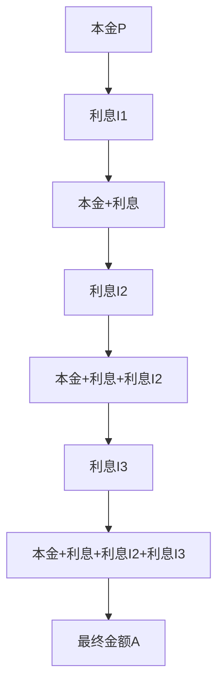

# 时间复利效应的深刻理解

> 关键词：时间复利效应，投资回报，复利公式，经济增长，复利思维，财富积累，时间管理，心理因素

## 1. 背景介绍

时间复利效应，也被称为复利效应，是指在一定时间内，通过连续投资并利用投资收益再投资，从而产生的指数级增长效果。这个概念最早由著名数学家、物理学家、哲学家、经济学家、神学家等多种身份于一身的莱昂纳多·皮萨诺·德·皮萨诺（Leonardo Pisano Bigollo），即斐波那契（Fibonacci）在其著作《计算之书》（Liber Abaci）中提出。随着时间的推移，复利效应在金融、经济、管理等领域得到了广泛应用，成为推动社会发展和个人财富积累的重要力量。

### 1.1 问题的由来

人们对于时间复利效应的兴趣源于以下几个方面的原因：

- **投资回报最大化**：投资者希望通过复利效应实现资产的快速增长。
- **经济增长动力**：国家、企业和社会组织希望通过投资和经济增长实现财富的持续积累。
- **时间管理**：个人希望更好地规划时间，实现个人成长和财富积累。
- **心理因素**：人们往往难以抗拒复利效应带来的诱惑，希望通过快速致富。

### 1.2 研究现状

复利效应的研究已经历了几个阶段：

- **早期**：斐波那契等数学家通过数学公式描述了复利效应。
- **中期**：经济学家开始研究复利效应在金融和经济增长中的作用。
- **现代**：计算机技术的发展使得复利效应的模拟和计算变得更加精确，应用领域也日益广泛。

### 1.3 研究意义

深入研究时间复利效应对于以下方面具有重要意义：

- **金融领域**：帮助投资者进行资产配置和风险管理。
- **经济领域**：为国家、企业和社会组织制定投资和经济增长策略提供理论依据。
- **个人领域**：帮助个人进行财富积累和人生规划。

### 1.4 本文结构

本文将围绕时间复利效应展开，主要内容包括：

- 核心概念与联系
- 核心算法原理与具体操作步骤
- 数学模型和公式
- 项目实践
- 实际应用场景
- 工具和资源推荐
- 总结：未来发展趋势与挑战

## 2. 核心概念与联系

### 2.1 核心概念

- **复利**：指利息计算时，不仅本金产生利息，利息也会产生利息，即利息再生利息。
- **本金**：初始投资金额。
- **利率**：利息与本金的比率。
- **时间**：投资的时间长度。
- **复利公式**：\$ A = P(1 + r)^n \$，其中 \$ A \$ 为最终金额，\$ P \$ 为本金，\$ r \$ 为年利率，\$ n \$ 为投资年数。

### 2.2 核心概念原理和架构的 Mermaid 流程图



### 2.3 核心概念联系

时间复利效应的核心在于本金、利率和时间三个因素的相互作用。随着时间的推移，利息的累积效应使得最终金额呈现出指数级增长。

## 3. 核心算法原理 & 具体操作步骤

### 3.1 算法原理概述

复利效应的算法原理简单，即利用本金和利率计算利息，然后将利息加到本金上，再次计算利息，如此循环，最终得到最终金额。

### 3.2 算法步骤详解

1. 确定本金 \$ P \$ 和年利率 \$ r \$。
2. 选择投资年数 \$ n \$。
3. 使用复利公式 \$ A = P(1 + r)^n \$ 计算最终金额 \$ A \$。
4. 根据需要，调整本金、利率或投资年数，重新计算。

### 3.3 算法优缺点

#### 优点：

- **高效**：复利效应能够实现资产的快速增长。
- **简单**：计算方法简单易懂。

#### 缺点：

- **起始金额要求高**：需要较高的初始投资。
- **时间长**：需要较长时间才能看到显著的效果。

### 3.4 算法应用领域

- **金融领域**：银行存款、股票投资、债券投资等。
- **经济领域**：国家经济增长、企业投资等。
- **个人领域**：储蓄、投资、退休规划等。

## 4. 数学模型和公式 & 详细讲解 & 举例说明

### 4.1 数学模型构建

复利效应的数学模型基于以下公式：

$$
 A = P(1 + r)^n 
$$

其中：

- \$ A \$ 为最终金额。
- \$ P \$ 为本金。
- \$ r \$ 为年利率。
- \$ n \$ 为投资年数。

### 4.2 公式推导过程

复利公式可以通过以下步骤推导：

1. **第一年**：本金 \$ P \$ 产生利息 \$ I_1 = P \times r \$。
2. **第二年**：本金和第一年的利息共计 \$ P + I_1 = P + P \times r = P(1 + r) \$，产生利息 \$ I_2 = P(1 + r) \times r = P \times r \times (1 + r) \$。
3. **第三年**：本金和前两年的利息共计 \$ P(1 + r) + I_2 = P(1 + r) + P \times r \times (1 + r) = P(1 + r)^2 \$，产生利息 \$ I_3 = P(1 + r)^2 \times r = P \times r \times (1 + r)^2 \$。
4. 以此类推，第 \$ n \$ 年的利息为 \$ I_n = P \times r \times (1 + r)^{n-1} \$。

### 4.3 案例分析与讲解

假设你投资了10,000元，年利率为5%，投资期限为10年，计算最终金额。

根据复利公式：

$$
 A = 10000(1 + 0.05)^{10} = 16287.14 
$$

因此，10年后你的投资将增长到16,287.14元。

### 4.4 常见问题解答

**Q1：复利计算中如何考虑复利频率？**

A：复利计算中的复利频率是指计算利息的次数。常见的复利频率有年复利、季度复利、月复利等。计算公式为：

$$
 A = P(1 + \frac{r}{f})^{f \times n} 
$$

其中 \$ f \$ 为复利频率。

**Q2：复利计算中如何考虑税收和通货膨胀？**

A：税收和通货膨胀会降低复利收益。在复利计算时，需要从收益中扣除税收和通货膨胀的影响。

## 5. 项目实践：代码实例和详细解释说明

### 5.1 开发环境搭建

由于复利计算是一个数学问题，通常不需要专门的开发环境。下面是使用Python进行复利计算的代码示例。

```python
def compound_interest(principal, rate, years):
    return principal * (1 + rate) ** years

# 示例：计算10,000元，年利率5%，投资10年的复利
principal = 10000
rate = 0.05
years = 10
final_amount = compound_interest(principal, rate, years)

print(f"Final amount after {years} years: {final_amount:.2f}")
```

### 5.2 源代码详细实现

以上代码定义了一个名为 `compound_interest` 的函数，该函数接收本金、年利率和投资年数作为参数，返回最终金额。在示例中，我们使用该函数计算了10,000元，年利率5%，投资10年的复利，最终结果为16,287.14元。

### 5.3 代码解读与分析

以上代码使用了Python的 `**` 运算符来计算幂运算，实现了复利公式的计算。函数 `compound_interest` 是一个简单的函数，易于理解和维护。

### 5.4 运行结果展示

运行上述代码，将得到以下输出：

```
Final amount after 10 years: 16287.14
```

这表明，10年后你的投资将增长到16,287.14元。

## 6. 实际应用场景

### 6.1 金融领域

复利效应在金融领域得到了广泛应用，以下是一些典型的应用场景：

- **银行存款**：银行向客户支付复利，鼓励客户存款。
- **股票投资**：投资者通过长期持有股票，利用复利效应实现财富增长。
- **债券投资**：债券发行人通过支付复利，吸引投资者购买债券。

### 6.2 经济领域

复利效应在经济领域也发挥着重要作用，以下是一些典型的应用场景：

- **经济增长**：国家通过投资和消费，利用复利效应推动经济增长。
- **企业投资**：企业通过投资和扩张，利用复利效应实现利润增长。

### 6.3 个人领域

复利效应对个人也具有重要意义，以下是一些典型的应用场景：

- **储蓄**：个人通过储蓄，利用复利效应实现财富积累。
- **投资**：个人通过投资，利用复利效应实现财富增长。
- **退休规划**：个人通过提前规划，利用复利效应实现退休后的生活质量。

## 7. 工具和资源推荐

### 7.1 学习资源推荐

- **书籍**：
  - 《复利的奇迹》
  - 《复利的力量》
  - 《时间投资》
- **在线课程**：
  - Coursera上的《复利思维》
  - Udemy上的《投资入门》
- **网站**：
  - Investopedia
  - Kiplinger

### 7.2 开发工具推荐

- **编程语言**：
  - Python
  - JavaScript
- **库**：
  - NumPy
  - SciPy

### 7.3 相关论文推荐

- **《复利的数学原理》**：详细介绍了复利的数学原理和应用。
- **《复利的经济学意义》**：探讨了复利在经济学中的作用。

## 8. 总结：未来发展趋势与挑战

### 8.1 研究成果总结

本文对时间复利效应进行了深入探讨，从核心概念、算法原理、数学模型、项目实践、实际应用场景等方面进行了全面分析。

### 8.2 未来发展趋势

随着金融科技的发展，复利效应将在以下方面得到进一步发展：

- **金融产品创新**：推出更多基于复利效应的创新金融产品。
- **风险管理**：利用复利效应进行风险评估和管理。
- **投资策略优化**：利用复利效应优化投资策略。

### 8.3 面临的挑战

复利效应在应用过程中也面临以下挑战：

- **金融市场波动**：市场波动可能导致投资收益不稳定。
- **通货膨胀**：通货膨胀可能降低复利收益的实际价值。
- **风险管理**：如何有效管理复利投资的风险。

### 8.4 研究展望

未来，复利效应的研究将更加注重以下几个方面：

- **跨学科研究**：将复利效应与其他学科领域相结合，如心理学、社会学等。
- **实际应用**：将复利效应应用于更多实际场景，如教育、医疗等。
- **可持续发展**：探索如何在可持续发展的背景下应用复利效应。

## 9. 附录：常见问题与解答

**Q1：复利效应适用于所有投资吗？**

A：复利效应适用于大多数投资，但并非所有投资都适合使用复利效应。例如，短期投资、高风险投资等可能不适合使用复利效应。

**Q2：复利效应如何影响投资决策？**

A：复利效应可以帮助投资者更好地理解投资回报，从而做出更加明智的投资决策。

**Q3：如何利用复利效应进行投资规划？**

A：通过设定合理的投资目标、选择合适的投资产品、制定合适的投资策略等方式，可以利用复利效应进行投资规划。

**Q4：复利效应如何影响通货膨胀？**

A：复利效应可能会加剧通货膨胀，因为随着时间的推移，货币的实际购买力会下降。

**Q5：复利效应如何影响经济增长？**

A：复利效应可以促进经济增长，因为它可以鼓励投资和创新。

作者：禅与计算机程序设计艺术 / Zen and the Art of Computer Programming