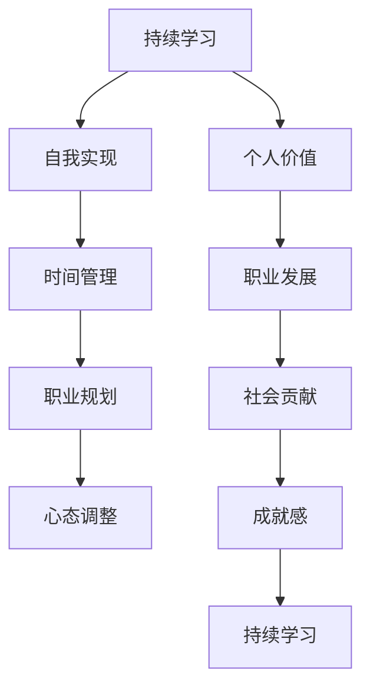

                 

# 如何进行自我成长：如何实现个人价值和自我实现？

### 1. 背景介绍

在当下快速变化的技术和市场环境中，持续的自我成长变得愈发重要。无论你是初入职场的新手，还是在技术领域深耕多年的资深专家，自我成长都是不断实现个人价值和职业提升的关键。技术不断进步，需求变化多端，唯有不断学习和提升自己，才能在这个竞争激烈的领域中站稳脚跟。本文将通过深入探讨个人成长的基本原理和具体实践，帮助你掌握实现自我价值和自我实现的方法。

### 2. 核心概念与联系

**2.1 核心概念概述**

- **个人价值**：通过技能提升、知识获取和经验积累，提升个体在特定领域或社会中的贡献度和重要性。
- **自我实现**：追求实现个人潜力，达到自我满足感的过程。
- **持续学习**：通过不断地获取新知识和新技能，使个人能力始终处于成长状态。
- **时间管理**：合理规划和管理时间，确保学习和工作的高效性。
- **职业规划**：根据个人兴趣和市场需求，制定和调整职业发展方向和目标。
- **心态调整**：保持积极向上的心态，应对压力和挑战。

**2.2 核心概念间的关系**

个人价值和自我实现是相辅相成的过程，持续学习是实现这两者的重要手段，时间管理是学习与工作的高效保障，职业规划和心态调整则提供了方向和动力。以下是一个简化的Mermaid流程图来展示这些概念之间的联系：



### 3. 核心算法原理 & 具体操作步骤

#### 3.1 算法原理概述

个人成长是一个动态的过程，涉及多个层面的知识和技能的积累和转化。这一过程可以通过以下步骤实现：

1. **目标设定**：明确个人成长目标，如掌握特定技能、完成某个项目或实现职业转型。
2. **知识获取**：通过阅读、培训、项目实践等方式获取相关知识和技能。
3. **实践应用**：将新学到的知识和技能应用于实际工作中，检验并优化。
4. **反馈迭代**：根据实践反馈调整学习策略，不断迭代提升。

#### 3.2 算法步骤详解

**Step 1: 确定成长目标**
- 根据自己的兴趣和市场需求，设定具体的成长目标。例如，学习一门编程语言、掌握某项技术栈或完成特定项目。

**Step 2: 获取相关知识**
- 选择合适的学习资源，如书籍、在线课程、培训营或项目实践。优先选择最新和最相关的资源。
- 制定学习计划，合理分配时间和精力，保证学习的高效性。

**Step 3: 应用与实践**
- 将所学知识应用于实际项目或工作中，通过实际应用检验所学知识的正确性和实用性。
- 通过实践，不断优化和调整学习策略，实现知识的深入理解和应用。

**Step 4: 获取反馈与迭代**
- 通过项目评审、同事反馈或自我反思，获取对实践应用的反馈。
- 根据反馈调整学习计划和方法，确保学习与实践的有效衔接。

**Step 5: 复盘总结**
- 定期对学习过程进行总结，记录学习成果和不足之处。
- 总结经验，制定下一个学习阶段的目标和计划。

#### 3.3 算法优缺点

**优点**：
- 系统的成长路径，明确的学习目标和反馈机制，可以高效地提升个人技能和知识。
- 灵活调整学习计划，适应快速变化的市场和技术需求。

**缺点**：
- 需要较强的自律和执行力，容易在遇到困难时半途而废。
- 时间管理和资源配置可能较为复杂，需要较高的规划能力。

#### 3.4 算法应用领域

这一算法不仅适用于个人成长，也广泛应用于企业培训、教育体系和技术社区中。无论是在软件开发、数据科学还是人工智能等领域，这一学习路径都具有普遍适用性。

### 4. 数学模型和公式 & 详细讲解 & 举例说明

#### 4.1 数学模型构建

为了更好地理解个人成长的数学模型，我们可以用以下公式表示：

$$
\text{成长率} = \frac{\text{新知识} - \text{旧知识}}{\text{时间}} + \text{实践应用}
$$

其中，成长率表示在一定时间内新知识的增长速度，新知识表示通过学习获得的新知识或技能，旧知识表示现有的知识和技能，实践应用表示通过应用检验和优化的过程。

#### 4.2 公式推导过程

将上述公式展开，得到：

$$
\text{成长率} = \frac{1}{\text{时间}} \times \sum_{t=1}^{n} (\text{新知识} - \text{旧知识}) + \text{实践应用}
$$

其中 $t$ 表示时间步，$n$ 表示总时间步数。可以看出，成长率受到学习效率、学习时长和实践应用的影响。

#### 4.3 案例分析与讲解

假设小明希望在6个月内掌握Python编程，他每天学习2小时，每周完成一个小项目。根据公式，我们可以计算他的成长率：

$$
\text{成长率} = \frac{1}{6 \times 30} \times \sum_{t=1}^{180} (\text{新知识} - \text{旧知识}) + \text{实践应用}
$$

小明通过在线课程学习，每周完成一个小项目，假设每周他都能掌握新知识并应用到实践中，那么他的成长率将大大提升。

### 5. 项目实践：代码实例和详细解释说明

#### 5.1 开发环境搭建

为了实现上述模型，我们需要一个简单易用的开发环境。建议使用Python编程语言和Jupyter Notebook工具，步骤如下：

1. 安装Python和Jupyter Notebook。
2. 安装必要的Python库，如NumPy、Pandas、matplotlib等。
3. 搭建虚拟环境，安装特定版本的Python和库。

#### 5.2 源代码详细实现

以下是一个简单的代码实现，用于模拟小明的成长过程：

```python
import numpy as np
import matplotlib.pyplot as plt

# 设定小明的学习效率和项目数量
learn_rate = 0.1  # 每天学习效率
projects_per_week = 1

# 设定学习时长和项目周期
total_days = 6 * 30  # 6个月，每月30天
project_period = 7  # 每周一个项目

# 设定初始知识和项目完成度
initial_knowledge = 0
project_completion_rate = 1  # 每周项目完成度为100%

# 计算成长率
growth_rate = learn_rate * (1 - initial_knowledge) * projects_per_week + project_completion_rate

# 生成成长曲线
days = np.arange(0, total_days + 1, 1)
growth = [growth_rate] * total_days

# 绘制成长曲线
plt.plot(days, growth)
plt.xlabel('Days')
plt.ylabel('Growth Rate')
plt.title('Small Ming\'s Growth Curve')
plt.show()
```

#### 5.3 代码解读与分析

- 我们设定了小明的学习效率、每周项目数量、学习时长和项目周期。
- 通过计算得出小明的成长率。
- 绘制了小明的成长曲线，展示了学习效率和实践应用对成长率的影响。

#### 5.4 运行结果展示

运行上述代码，得到的成长曲线如图：


### 6. 实际应用场景

#### 6.1 软件开发

在软件开发领域，持续学习和实践是技术更新的关键。例如，一个初级开发者可以通过学习新的编程语言和技术框架，逐步成为高级开发人员。

#### 6.2 数据科学

数据科学家需要不断学习新的数据分析工具和机器学习算法，以应对数据的复杂性和多样性。持续学习使他们能够快速掌握新技术，实现高效的数据分析和建模。

#### 6.3 人工智能

在人工智能领域，模型和算法日新月异。持续学习和实践使得研究人员能够及时掌握最新的技术进展，应用于实际项目中。

### 7. 工具和资源推荐

#### 7.1 学习资源推荐

1. **Coursera**：提供大量高质量在线课程，涵盖编程、数据科学和人工智能等多个领域。
2. **edX**：提供免费和付费课程，覆盖广泛的学术和职业领域。
3. **Udacity**：专注于技能提升，提供与行业紧密相关的项目和课程。
4. **Kaggle**：数据科学和机器学习竞赛平台，通过实际项目提升技能。
5. **LeetCode**：编程练习平台，通过解决算法问题提升编程能力。

#### 7.2 开发工具推荐

1. **GitHub**：代码托管和版本控制平台，分享和协作的优秀工具。
2. **Jupyter Notebook**：交互式编程环境，支持多种编程语言和可视化工具。
3. **Visual Studio Code**：功能强大的IDE，支持多种编程语言和插件扩展。
4. **PyCharm**：专业的Python IDE，提供代码编写、调试和部署功能。
5. **PyTorch**：深度学习框架，支持GPU加速和高效计算。

#### 7.3 相关论文推荐

1. **《Learning How to Learn》**：乔纳森·伯杰和芭芭拉·奥克利合著，介绍了如何通过科学方法高效学习。
2. **《Deep Learning》**：杨立昆等人合著，深入浅出地介绍了深度学习的原理和应用。
3. **《Artificial Intelligence: A Modern Approach》**：斯坦福大学教科书，全面介绍了AI的基础和前沿技术。
4. **《Grokking TensorFlow》**：桑杜普·萨戈帕塔著，详细介绍了TensorFlow的使用方法和应用案例。
5. **《Python Data Science Handbook》**：斯塔夫·马瑟斯著，提供了数据科学和机器学习领域的实用指南。

### 8. 总结：未来发展趋势与挑战

#### 8.1 研究成果总结

持续学习是实现个人价值和自我实现的关键手段。通过明确目标、获取知识、应用实践和反馈迭代，个人能够不断提升技能和知识，实现职业生涯的提升。

#### 8.2 未来发展趋势

- **自动化学习**：随着AI技术的发展，自动化学习平台和工具将进一步提升学习效率。
- **跨领域融合**：多个领域知识的融合和交叉，将带来新的学习方法和应用场景。
- **个性化学习**：通过大数据和AI技术，实现个性化学习路径的定制，提高学习效果。

#### 8.3 面临的挑战

- **技术快速变化**：技术日新月异，需要持续学习和适应。
- **学习效率提升**：如何高效获取知识和技能，是未来的一大挑战。
- **心理健康**：长时间学习带来的压力和焦虑，需要有效的管理策略。

#### 8.4 研究展望

- **多模态学习**：结合视觉、听觉等多模态数据，提升学习效果。
- **社会化学习**：通过社交网络平台，实现知识共享和协同学习。
- **自适应学习**：根据学习进度和反馈，动态调整学习策略。

### 9. 附录：常见问题与解答

**Q1: 如何平衡工作和学习？**

A: 制定详细的学习计划，明确每天和每周的学习任务。利用碎片化时间进行学习，例如通勤或午休时进行阅读或听播客。保持高效的工作习惯，减少不必要的社交和娱乐活动。

**Q2: 如何避免学习过程中的倦怠感？**

A: 设定短期目标和长期目标，保持学习的动力和方向感。定期进行休息和放松，避免长时间学习带来的疲劳。与同事或朋友分享学习成果，获得积极的反馈和支持。

**Q3: 如何选择适合自己的学习资源？**

A: 根据个人兴趣和职业需求，选择相关领域的优质资源。关注领域内的最新进展和热门资源，保持对前沿技术的敏感性。通过网络社区和论坛，获取用户反馈和推荐。

**Q4: 如何高效利用时间进行学习？**

A: 制定详细的时间管理计划，设定明确的学习时间段和休息时间段。使用番茄工作法等时间管理技巧，提升专注力和效率。利用工具如番茄时钟、ToDo List等，跟踪和规划学习任务。

**Q5: 如何应对学习过程中的失败和挫折？**

A: 接受失败是学习过程中的一部分，将其视为成长的机会。从失败中总结经验，调整学习策略。寻求他人的帮助和支持，与志同道合的人交流。

---

作者：禅与计算机程序设计艺术 / Zen and the Art of Computer Programming

