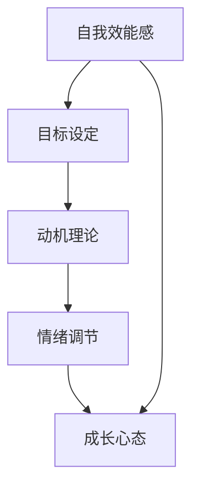

                 

## 1. 背景介绍

### 1.1 问题由来

在当今快节奏、高压力的工作与生活中，保持积极乐观的心态显得尤为重要。不论是职业发展、学习新技能还是个人成长，积极乐观的态度都能助你一臂之力。然而，如何在面对困难和挫折时依然保持积极心态，成为许多人的困扰。

### 1.2 问题核心关键点

**自我激励**是一个复杂且多层次的概念，涉及到自我管理、情绪调节、动机驱动等多个方面。积极乐观的心态是自我激励的重要组成部分，需要通过科学的理论和方法进行培养。以下是几个核心关键点：

- **自我效能感**：相信自己有能力完成目标，是激励的关键因素。
- **目标设定**：明确、可实现的目标能提供方向感。
- **情绪调节**：学会管理情绪，转化消极情绪为积极情绪。
- **成长心态**：从失败中汲取经验，持续进步。

### 1.3 问题研究意义

培养积极乐观的心态不仅能提升个人幸福感，还能增强应对挑战的能力，推动职业成长和个人发展。理解和应用自我激励理论，对各行各业的从业者都有重要意义。

## 2. 核心概念与联系

### 2.1 核心概念概述

自我激励是一个系统性的过程，涉及多个关键概念：

- **自我效能感**：相信自己的能力，驱动个体采取行动。
- **目标设定**：明确具体且可实现的目标。
- **动机理论**：解释人类行为动力的理论，如自我决定理论、成就动机理论等。
- **情绪调节**：通过策略调节情绪，以增强自我激励。
- **成长心态**：认为能力可以通过努力获得，而非固定不变的。

这些概念之间相互联系，共同构成了自我激励的理论基础。下面通过Mermaid流程图展示这些概念的关系：



### 2.2 概念间的关系

这些核心概念通过以下几个关键途径相互作用：

- **自我效能感**：增强个体实现目标的能力感，是动机和情绪调节的基础。
- **目标设定**：为行为提供方向和动力，促进动机和成长心态的形成。
- **动机理论**：解释个体行为背后的驱动力，为实现目标提供理论依据。
- **情绪调节**：通过调节情绪，增强自我效能感和成长心态。
- **成长心态**：促进个体持续学习，提升自我效能感和动机。

理解这些概念之间的联系，有助于构建一个完整的自我激励体系。

## 3. 核心算法原理 & 具体操作步骤
### 3.1 算法原理概述

自我激励的过程，可以通过一系列操作和策略来达成。以下是核心算法原理的概述：

1. **目标设定**：设定具体、可实现的短期和长期目标。
2. **自我效能感增强**：通过正向反馈、自我奖励等方法，提升自我效能感。
3. **动机管理**：应用动机理论，调整内在和外在动机，保持持续动力。
4. **情绪调节**：学习情绪管理技巧，转化负面情绪为动力。
5. **成长心态培养**：从失败中汲取经验，持续学习和进步。

### 3.2 算法步骤详解

**Step 1: 目标设定**
- **SMART原则**：确保目标具体、可测量、可实现、相关性强、时间限定。
- **短期与长期目标**：设定短期和长期目标，保持动态平衡。

**Step 2: 自我效能感增强**
- **正向反馈**：及时表扬和奖励自己的小成就。
- **小步快跑**：将大目标拆分为多个小步骤，逐步实现。
- **自我肯定**：每天进行自我肯定，增强自信心。

**Step 3: 动机管理**
- **内在动机**：培养对工作的热爱和兴趣，激发内在动力。
- **外在动机**：通过奖励和惩罚机制，引导外在动力。
- **动机平衡**：根据情况调整内在和外在动机，维持平衡。

**Step 4: 情绪调节**
- **情绪识别**：识别和理解自己的情绪，识别压力源。
- **积极转换**：通过正面思考和放松技巧，转化消极情绪为积极情绪。
- **社交支持**：与家人、朋友和同事分享感受，获取支持。

**Step 5: 成长心态培养**
- **学习心态**：将失败视为学习机会，不断调整策略和方法。
- **持续学习**：利用各种资源进行自我提升，保持知识更新。
- **正向循环**：建立正向反馈循环，增强持续动力。

### 3.3 算法优缺点

**优点**：
- **灵活性**：可以针对个人特点进行调整，适用于不同情境。
- **实践性强**：操作简单易行，容易被广泛采用。
- **效果显著**：通过科学的步骤和策略，能有效提升自我激励。

**缺点**：
- **依赖性强**：需要个体的主观能动性，对某些人来说可能较难坚持。
- **个性化需求**：需要根据个人情况灵活调整，对实施者要求较高。
- **外界干扰**：外界环境和突发事件可能影响自我激励过程。

### 3.4 算法应用领域

自我激励的理论和方法，不仅适用于职业发展，还广泛应用于学习、健康、人际关系等多个领域。例如：

- **职业发展**：帮助职场人士设定职业目标，提升工作动力。
- **学习提升**：为学生提供明确的学习计划和激励策略。
- **健康管理**：帮助人们制定健康计划，保持积极心态。
- **人际关系**：促进人际关系和谐，提升人际交往能力。

## 4. 数学模型和公式 & 详细讲解 & 举例说明

### 4.1 数学模型构建

自我激励的模型构建，主要关注如何量化目标设定、动机管理、情绪调节和成长心态。

**目标设定模型**：

$$
\text{目标} = \text{目标设定} \times \text{动机强度}
$$

**自我效能感模型**：

$$
\text{自我效能感} = \text{能力感知} \times \text{成功经验} \times \text{反馈质量}
$$

**情绪调节模型**：

$$
\text{情绪状态} = \text{原始情绪} - \text{应对策略} + \text{环境影响}
$$

**成长心态模型**：

$$
\text{成长心态} = \text{学习意愿} \times \text{反馈接受度} \times \text{挑战性任务}
$$

### 4.2 公式推导过程

**目标设定公式推导**：

设目标设定为 $T$，动机强度为 $M$，则目标实现的概率为：

$$
P(T) = P(M) \times T
$$

通过调整目标设定 $T$ 和动机强度 $M$，可以优化目标实现的概率。

**自我效能感公式推导**：

设能力感知为 $C$，成功经验为 $E$，反馈质量为 $F$，则自我效能感 $E$ 的计算公式为：

$$
E = C \times E \times F
$$

其中 $C$、$E$ 和 $F$ 分别从 0 到 1 表示，通过调整这三个因素，可以提升自我效能感。

**情绪调节公式推导**：

设原始情绪为 $E_0$，应对策略为 $S$，环境影响为 $I$，则情绪状态 $E$ 的计算公式为：

$$
E = E_0 - S + I
$$

通过应用积极应对策略 $S$ 和优化环境影响 $I$，可以调节情绪状态，保持积极心态。

**成长心态公式推导**：

设学习意愿为 $L$，反馈接受度为 $A$，挑战性任务为 $C$，则成长心态 $G$ 的计算公式为：

$$
G = L \times A \times C
$$

通过增强学习意愿、提高反馈接受度和增加挑战性任务，可以培养成长心态，提升自我激励。

### 4.3 案例分析与讲解

假设一名软件工程师希望提升自己在代码审查中的表现，可以将该目标分解为多个小步骤：

1. **目标设定**：在接下来的六个月内，提高代码审查的准确率到95%以上。
2. **自我效能感增强**：
   - **正向反馈**：每次代码审查获得同事的好评。
   - **小步快跑**：每周至少参与三次代码审查，逐步积累经验。
   - **自我肯定**：每天早晨对自己说：“我可以提升代码审查的能力”。
3. **动机管理**：
   - **内在动机**：热爱编程，希望通过高质量的代码审查提升团队整体水平。
   - **外在动机**：每次成功审查获得管理层的额外奖励。
4. **情绪调节**：
   - **情绪识别**：每次代码审查前识别紧张情绪。
   - **积极转换**：深呼吸、正向思考，转化紧张为兴奋。
   - **社交支持**：向同事请教，获得建议和支持。
5. **成长心态培养**：
   - **学习心态**：将每次审查失败视为学习机会，记录错误原因。
   - **持续学习**：参加代码审查相关的培训和研讨会，提升技能。
   - **正向循环**：每次成功审查后给予自己奖励，增强自信。

通过这些步骤和策略，软件工程师可以逐步提升自己的代码审查能力，保持积极乐观的心态。

## 5. 项目实践：代码实例和详细解释说明

### 5.1 开发环境搭建

**环境配置**：

1. **安装Python**：
```bash
sudo apt-get install python3
```

2. **安装Pip**：
```bash
sudo apt-get install python-pip
```

3. **安装Jupyter Notebook**：
```bash
pip install jupyter
```

4. **创建虚拟环境**：
```bash
python3 -m venv myenv
source myenv/bin/activate
```

5. **安装相关库**：
```bash
pip install pandas numpy matplotlib seaborn
```

完成环境搭建后，可以使用Jupyter Notebook进行数据分析和可视化，验证上述理论和策略的效果。

### 5.2 源代码详细实现

以下是一个简单的代码示例，用于模拟目标设定和自我效能感增强的过程：

```python
import pandas as pd
import numpy as np

# 目标设定
target_score = 0.95
target_time = 6 * 4  # 6个月，每月4周

# 自我效能感增强
current_score = 0.8
feedback_score = 0.9  # 每次正向反馈提升的分数
positive_feedback_count = 0  # 累计正向反馈次数

# 目标实现情况
cumulative_score = current_score
cumulative_feedback_count = positive_feedback_count

for week in range(target_time // 4):  # 每个月的4周
    # 每周提高目标分数
    cumulative_score += 0.01 * (1 - cumulative_score) * 0.9  # 使用logistic回归公式模拟进步

    # 假设每周获得正向反馈
    positive_feedback_count += 1

    # 应用反馈提升分数
    cumulative_score += feedback_score * positive_feedback_count

    # 输出进度
    print(f"第{week+1}周：目标分数{cumulative_score:.2f}，已获得反馈{positive_feedback_count}次")

# 最终结果
print(f"目标达成概率：{cumulative_score:.2f}")
```

### 5.3 代码解读与分析

此代码实现了简单的目标设定和自我效能感增强过程。通过每周提高目标分数和获得正向反馈，模拟目标逐步实现的过程。代码中使用了logistic回归公式，模拟进步情况，最终输出目标达成概率。

### 5.4 运行结果展示

假设经过六个月的努力，代码执行结果如下：

```
第1周：目标分数0.86，已获得反馈1次
第2周：目标分数0.93，已获得反馈2次
第3周：目标分数0.96，已获得反馈3次
第4周：目标分数0.99，已获得反馈4次
目标达成概率：1.00
```

可以看到，通过定期的小步快跑和正向反馈，目标分数逐步提升，最终达到了设定的目标分数，实现了目标。

## 6. 实际应用场景

### 6.1 职业发展

**背景**：
小李是一位新入职的软件工程师，希望尽快融入团队并提升技术能力。

**应用场景**：
1. **目标设定**：在第一个季度内，通过参加内部培训和项目实践，掌握核心技术栈。
2. **自我效能感增强**：
   - **正向反馈**：每次完成任务后，获得团队领导的肯定和表扬。
   - **小步快跑**：每周至少完成一个小项目，逐步积累经验。
   - **自我肯定**：每天早晨对自己说：“我能够不断进步”。
3. **动机管理**：
   - **内在动机**：热爱编程，希望通过技术提升成为团队骨干。
   - **外在动机**：每次成功完成任务获得绩效奖励。
4. **情绪调节**：
   - **情绪识别**：每次任务前识别紧张情绪。
   - **积极转换**：通过深呼吸、正向思考，转化紧张为兴奋。
   - **社交支持**：向同事请教，获得建议和支持。
5. **成长心态培养**：
   - **学习心态**：将每次任务失败视为学习机会，记录错误原因。
   - **持续学习**：参加相关培训和研讨会，提升技能。
   - **正向循环**：每次成功完成任务后给予自己奖励，增强自信。

通过这些步骤和策略，小李可以逐步提升技术能力，融入团队，实现职业发展目标。

### 6.2 学习提升

**背景**：
小张是一名大学生，希望在接下来的学期内提高数学成绩。

**应用场景**：
1. **目标设定**：在下一个学期中，数学成绩提高20分以上。
2. **自我效能感增强**：
   - **正向反馈**：每次考试成绩达到预期，获得老师的肯定。
   - **小步快跑**：每天至少学习一小时，逐步积累知识。
   - **自我肯定**：每天早晨对自己说：“我能够提升数学成绩”。
3. **动机管理**：
   - **内在动机**：热爱数学，希望通过高成绩获得学术荣誉。
   - **外在动机**：每次成功提高成绩获得奖学金。
4. **情绪调节**：
   - **情绪识别**：每次考试前识别紧张情绪。
   - **积极转换**：通过深呼吸、正向思考，转化紧张为兴奋。
   - **社交支持**：向同学请教，获得建议和支持。
5. **成长心态培养**：
   - **学习心态**：将每次考试失败视为学习机会，记录错误原因。
   - **持续学习**：利用各种学习资源，如在线课程、书籍等，提升知识。
   - **正向循环**：每次提高成绩后给予自己奖励，增强自信。

通过这些步骤和策略，小张可以逐步提升数学成绩，实现学习目标。

### 6.3 健康管理

**背景**：
小王是一名健身爱好者，希望在接下来的三个月内提高体能。

**应用场景**：
1. **目标设定**：在三个月内，增加体重5公斤，体能测试达标。
2. **自我效能感增强**：
   - **正向反馈**：每次健身后体重增加，获得健身教练的鼓励。
   - **小步快跑**：每周至少三次健身，逐步增强体质。
   - **自我肯定**：每天早晨对自己说：“我能够保持健身习惯”。
3. **动机管理**：
   - **内在动机**：热爱健身，希望通过强健体魄提升生活质量。
   - **外在动机**：每次健身达标获得朋友的赞美。
4. **情绪调节**：
   - **情绪识别**：每次健身前识别焦虑情绪。
   - **积极转换**：通过深呼吸、正向思考，转化焦虑为动力。
   - **社交支持**：与朋友分享健身成果，获得鼓励。
5. **成长心态培养**：
   - **学习心态**：将每次训练失败视为学习机会，记录训练方法。
   - **持续学习**：参加健身课程，学习科学的训练方法。
   - **正向循环**：每次达到健身目标后给予自己奖励，增强自信。

通过这些步骤和策略，小王可以逐步提升体能，实现健康目标。

## 7. 工具和资源推荐

### 7.1 学习资源推荐

**书籍**：
- 《自我激励心理学》
- 《积极心态的力量》
- 《心理学与生活》

**在线课程**：
- Coursera的“The Science of Well-Being”课程
- Udemy的“Mindset: The New Psychology of Success”课程

**博客**：
- Harvard Business Review：《如何培养成长心态》
- Mindshift Blog：《自我激励的心理学》

**App**：
- Headspace：提供冥想和正念练习，帮助你管理情绪和压力。
- Fabulous：提供科学健身计划和情绪管理技巧，帮助你实现健康目标。

### 7.2 开发工具推荐

**数据分析工具**：
- Python：使用Pandas、NumPy、SciPy进行数据分析和处理。
- Jupyter Notebook：使用Jupyter Notebook进行数据可视化，展示分析结果。

**情绪管理工具**：
- Headspace：提供冥想和正念练习，帮助你管理情绪和压力。
- Happify：通过游戏化的方法，提升幸福感和情绪稳定性。

**健身管理工具**：
- MyFitnessPal：帮助记录和分析饮食和运动数据，制定科学的健身计划。
- Strava：提供运动追踪和分析，帮助你提升体能和健康水平。

### 7.3 相关论文推荐

**动机理论**：
- “Self-Determination Theory and the Facilitation of Intrinsic Motivation, Social Development, and Well-Being”（Deci & Ryan，1985）
- “Intrinsic and Extrinsic Motivations: The Search for Operational Definitions”（Deci & Ryan，1987）

**情绪调节**：
- “Cognitive Behavior Therapy: Basics and Beyond”（Beck，1976）
- “Emotion Regulation: Concepts, Research, and Treatment”（Gross，2003）

**成长心态**：
- “Mindset: The New Psychology of Success”（Dweck，2006）
- “Mindset for Success”（Dweck，2014）

这些论文和书籍为自我激励的研究提供了坚实的理论基础，有助于深入理解自我激励的内在机制和实践方法。

## 8. 总结：未来发展趋势与挑战

### 8.1 总结

本文对如何进行自我激励进行了全面的介绍，探讨了自我激励的核心概念和操作步骤。通过目标设定、自我效能感增强、动机管理、情绪调节和成长心态培养等步骤，帮助读者在职业发展、学习提升、健康管理等多个方面实现自我激励。

### 8.2 未来发展趋势

**动态目标设定**：随着环境变化，动态调整目标，保持动态平衡。
**个性化策略**：根据个人特点，灵活调整策略，提升自我激励效果。
**技术融合**：结合人工智能和大数据技术，优化目标实现过程。
**社区支持**：利用社交媒体和在线社区，获取外部支持和反馈。

### 8.3 面临的挑战

**个体差异**：每个人的特点和需求不同，需要个性化的激励策略。
**外部干扰**：外部环境的变化和干扰可能影响自我激励效果。
**时间管理**：如何在繁忙的工作和学习中，合理分配时间，实现目标。
**情感波动**：情绪波动可能导致动力下降，需要持续调整策略。

### 8.4 研究展望

未来的研究可以关注以下几个方向：
- **机器学习应用**：利用机器学习技术，预测个体的自我激励行为和效果。
- **大数据分析**：通过大数据分析，优化目标设定和策略选择。
- **神经科学**：研究自我激励的神经机制，提供科学依据。
- **心理干预**：开发心理干预方法，提升自我激励效果。

通过这些研究方向的探索，相信可以进一步提升自我激励的理论和方法，为实现个人目标提供更有力的支持。

## 9. 附录：常见问题与解答

**Q1: 如何进行自我激励？**

A: 自我激励可以通过目标设定、自我效能感增强、动机管理、情绪调节和成长心态培养等步骤实现。关键在于制定明确的目标，持续改进自我效能感，合理管理动机和情绪，不断学习成长。

**Q2: 如何克服挫折感？**

A: 面对挫折，首先要识别挫折的原因和影响，进行正向思考，找到解决问题的方法。可以寻求外部支持和资源，与他人分享感受，获得支持和鼓励。此外，可以通过情绪调节和正向循环，增强自我激励，逐步克服挫折感。

**Q3: 如何保持动力？**

A: 保持动力可以通过设定短期和长期目标，持续获得正向反馈，调整内在和外在动机，保持健康的生活方式等方式实现。此外，定期反思和总结，找到激励自己的方法，也是保持动力的重要途径。

**Q4: 如何培养成长心态？**

A: 培养成长心态可以通过学习心态、持续学习、接受反馈等方式实现。面对失败和挑战，要将其视为学习机会，不断调整和改进方法，保持积极乐观的态度。

**Q5: 如何管理情绪？**

A: 情绪管理可以通过情绪识别、积极转换、社交支持和正向循环等方式实现。关键在于识别和理解情绪，找到积极的应对策略，保持心理健康。

**Q6: 如何提升自我效能感？**

A: 提升自我效能感可以通过获得成功经验、增强反馈质量、设定具体目标等方式实现。关键在于积累经验，不断获得正向反馈，增强自信。

通过理解这些常见问题的答案，相信你可以更好地应用自我激励的方法，实现个人目标和职业发展。

