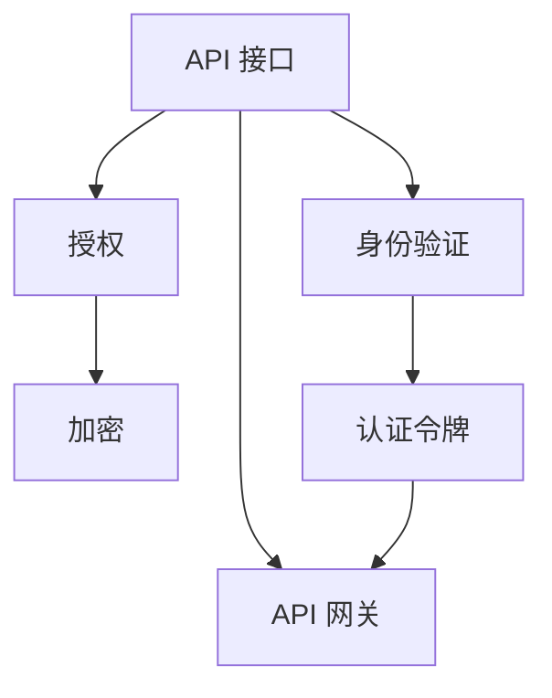
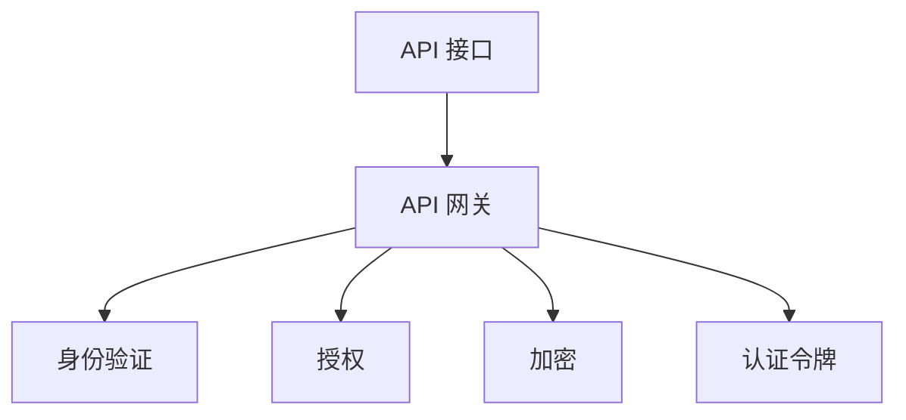

                 

# 安全 API 设计的 12 个要点

## 1. 背景介绍

API（应用程序接口）是软件开发中不可或缺的一部分，它们让不同的系统之间可以无缝地进行通信和数据交换。然而，由于 API 通常会暴露服务器的内部状态和操作，因此如果没有足够的安全措施，它们就可能成为黑客攻击的目标。在现代软件开发中，API 安全性已经成为企业和开发者面临的重要挑战之一。本文将探讨 API 设计的 12 个要点，帮助开发者构建更安全、更可靠的 API。

## 2. 核心概念与联系

### 2.1 核心概念概述

在讨论 API 安全性的设计要点之前，我们需要先了解一些核心概念：

- **API 接口**：API 接口是一组定义了系统之间交互的协议、规则和协议端点的集合。
- **身份验证**：通过验证用户的身份信息，确保只有经过授权的用户可以访问 API。
- **授权**：授权是指在用户身份验证之后，控制用户对 API 的访问权限。
- **加密**：加密技术确保数据在传输过程中不会被未经授权的第三方窃取或篡改。
- **认证令牌**：认证令牌是一种用于验证用户身份的标记，通常是加密的字符串。
- **API 网关**：API 网关是一个负责管理和控制 API 请求的层，它可以执行身份验证、授权、负载均衡等任务。

### 2.2 核心概念的联系

以上概念构成了 API 安全的基石。身份验证和授权确保只有经过授权的用户可以访问 API，而加密则保护数据在传输过程中的安全性。认证令牌是一种机制，用于在请求中传递用户身份信息。API 网关则提供了一个集中化的管理和控制点，可以帮助实现这些安全机制。

以下 Mermaid 流程图展示了 API 安全设计的核心概念及其联系：



## 3. 核心算法原理 & 具体操作步骤

### 3.1 算法原理概述

API 安全性的设计原理主要基于以下原则：

- 最小权限原则：确保用户只能访问他们需要的功能和数据。
- 安全性优先原则：将安全性作为设计和实现 API 的首要任务。
- 数据加密原则：确保数据在传输和存储过程中的安全性。
- 认证与授权分离原则：将认证和授权分开处理，确保两者之间的独立性。
- 安全监控原则：监控 API 的使用情况，及时发现和应对安全威胁。

### 3.2 算法步骤详解

#### 3.2.1 第一步：设计 API 接口

在设计 API 接口时，应考虑以下几个方面：

- **接口的端点**：定义 API 的端点和 URL 结构。
- **HTTP 方法**：使用标准的 HTTP 方法（如 GET、POST、PUT、DELETE）来定义接口操作。
- **输入和输出格式**：定义输入和输出数据的格式，如 JSON、XML 等。
- **数据验证**：在接口中实现数据验证，确保输入数据符合预期格式和规则。

#### 3.2.2 第二步：实现身份验证

在 API 接口中实现身份验证的步骤如下：

- **选择身份验证机制**：根据应用场景选择合适的身份验证机制，如基于令牌的认证、OAuth 2.0 等。
- **实现身份验证逻辑**：在服务器端实现身份验证逻辑，检查请求中的认证令牌是否有效，并验证用户的身份。
- **错误处理**：在身份验证失败时，返回适当的错误响应。

#### 3.2.3 第三步：实现授权

在实现授权时，应考虑以下几个方面：

- **权限控制**：定义 API 接口的访问权限，并根据用户角色分配权限。
- **授权检查**：在每个请求中执行授权检查，确保用户只能访问他们被授权的资源。
- **记录授权信息**：记录每次授权请求的信息，便于追踪和审计。

#### 3.2.4 第四步：实现加密

在实现加密时，应考虑以下几个方面：

- **数据加密**：在传输过程中对敏感数据进行加密，确保数据在传输过程中不会被窃取或篡改。
- **密钥管理**：使用安全的密钥管理机制，确保密钥的安全性。
- **SSL/TLS 协议**：在 API 服务器上配置 SSL/TLS 协议，确保数据传输的安全性。

#### 3.2.5 第五步：实现认证令牌

在实现认证令牌时，应考虑以下几个方面：

- **生成认证令牌**：生成一个唯一的、加密的认证令牌，用于验证用户身份。
- **令牌存储**：将认证令牌存储在安全的位置，防止令牌泄露。
- **令牌更新**：定期更新认证令牌，确保其安全性。

### 3.3 算法优缺点

#### 3.3.1 优点

- **安全性**：通过身份验证、授权和加密等措施，确保 API 的安全性。
- **灵活性**：API 网关可以灵活地管理和控制 API 请求，提供更灵活的安全策略。
- **可扩展性**：API 网关可以方便地扩展新的 API 接口和安全策略。

#### 3.3.2 缺点

- **复杂性**：设计和实现 API 安全性需要考虑多个方面，增加了开发难度。
- **性能开销**：实现身份验证、授权和加密等措施会增加 API 的性能开销。
- **维护成本**：随着 API 的使用和扩展，维护其安全性需要不断更新和优化。

### 3.4 算法应用领域

API 安全性设计的应用领域包括：

- **Web API**：基于 HTTP 的 Web API 接口。
- **移动 API**：移动应用中的 API 接口。
- **微服务**：在微服务架构中，各个微服务之间的 API 接口。
- **企业 API**：企业内部和外部之间的 API 接口。

## 4. 数学模型和公式 & 详细讲解 & 举例说明

### 4.1 数学模型构建

在 API 安全性的设计中，可以使用以下数学模型：

- **身份验证模型**：

$$
\text{验证结果} = \begin{cases} 
\text{True} & \text{如果认证令牌有效且用户身份验证通过} \\
\text{False} & \text{如果认证令牌无效或用户身份验证失败}
\end{cases}
$$

- **授权模型**：

$$
\text{授权结果} = \begin{cases} 
\text{True} & \text{如果用户有访问权限} \\
\text{False} & \text{如果用户没有访问权限}
\end{cases}
$$

### 4.2 公式推导过程

以上数学模型描述了身份验证和授权的基本逻辑。在实际应用中，可以使用各种编程语言和框架来实现这些模型。例如，在 Python 中，可以使用如下代码实现身份验证和授权逻辑：

```python
def validate_token(token):
    # 验证认证令牌的有效性
    if token_is_valid(token):
        # 获取用户身份信息
        user_info = get_user_info(token)
        # 验证用户身份
        if user_is_authorized(user_info):
            return True
    return False
```

### 4.3 案例分析与讲解

#### 4.3.1 案例一：OAuth 2.0

OAuth 2.0 是一种常用的身份验证机制，它可以确保用户只能访问他们被授权的资源。OAuth 2.0 的流程如下：

1. 用户向服务器请求访问资源。
2. 服务器要求用户提供认证令牌。
3. 用户通过浏览器将认证令牌提供给服务器。
4. 服务器验证认证令牌的有效性，并返回访问令牌。
5. 用户使用访问令牌访问资源。

OAuth 2.0 的优势在于其灵活性和可扩展性，可以通过不同的授权方式（如客户端模式、密码模式、隐式模式等）来实现不同的身份验证场景。

#### 4.3.2 案例二：API 网关

API 网关是一种集中化的管理和控制点，可以帮助实现身份验证、授权、负载均衡等任务。API 网关的架构如下：



API 网关将 API 请求集中在一点进行管理和控制，可以方便地扩展新的 API 接口和安全策略，同时提供更好的监控和审计功能。

## 5. 项目实践：代码实例和详细解释说明

### 5.1 开发环境搭建

#### 5.1.1 准备环境

- **Python 环境**：安装 Python 3.7 或以上版本。
- **Flask 框架**：安装 Flask 框架，用于实现 API 接口。
- **Flask-Security**：安装 Flask-Security 扩展，用于实现身份验证和授权。
- **Flask-Talisman**：安装 Flask-Talisman 扩展，用于实现数据加密和 SSL/TLS 配置。

#### 5.1.2 配置环境

```bash
pip install Flask Flask-Security Flask-Talisman
```

### 5.2 源代码详细实现

#### 5.2.1 实现 API 接口

```python
from flask import Flask, request
from flask_security import Security, SQLAlchemyUserDatastore, UserMixin, RoleMixin
from flask_sqlalchemy import SQLAlchemy
from flask_talisman import Talisman

app = Flask(__name__)
app.config['SECRET_KEY'] = 'your-secret-key'
app.config['SQLALCHEMY_DATABASE_URI'] = 'sqlite://'
app.config['SECURITY_PASSWORD_SALT'] = 'your-password-salt'

# 定义模型
class Role(db.Model, RoleMixin):
    id = db.Column(db.Integer(), primary_key=True)
    name = db.Column(db.String(80), unique=True)
    
class User(db.Model, UserMixin):
    id = db.Column(db.Integer(), primary_key=True)
    email = db.Column(db.String(255), unique=True)
    password = db.Column(db.String(255))
    active = db.Column(db.Boolean())
    confirmed_at = db.Column(db.DateTime())
    roles = db.relationship('Role', secondary=roles_users, backref=db.backref('users', lazy='dynamic'))

# 定义数据源
db = SQLAlchemy(app)

# 定义用户数据源
user_datastore = SQLAlchemyUserDatastore(db, User, Role)
security = Security(app, user_datastore)

# 实现数据加密和 SSL/TLS 配置
Talisman(app)

# 定义 API 接口
@app.route('/api/hello', methods=['GET'])
def hello():
    return 'Hello, World!'
```

#### 5.2.2 实现身份验证

```python
@app.route('/api/login', methods=['POST'])
def login():
    # 验证用户名和密码
    user = security.check_password(request.form['username'], request.form['password'])
    if user:
        # 生成认证令牌
        token = generate_token(user)
        return jsonify({'token': token})
    else:
        return jsonify({'error': 'Invalid username or password'}), 401
```

#### 5.2.3 实现授权

```python
@app.route('/api/protected', methods=['GET'])
@roles_required('admin')
def protected():
    return 'This is a protected resource.'
```

### 5.3 代码解读与分析

#### 5.3.1 Flask-Security

Flask-Security 扩展提供了丰富的身份验证和授权功能，包括用户认证、密码加密、会话管理等。在代码中，我们使用了 Flask-Security 的 `check_password` 函数来验证用户密码，确保只有经过身份验证的用户才能访问 API。

#### 5.3.2 Flask-Talisman

Flask-Talisman 扩展提供了 SSL/TLS 配置和数据加密功能，确保数据在传输过程中的安全性。在代码中，我们使用了 Flask-Talisman 的 `Talisman(app)` 函数来配置 SSL/TLS 协议，并自动添加 `X-Content-Type-Options` 和 `Content-Security-Policy` 等安全头信息。

#### 5.3.3 认证令牌生成

在代码中，我们使用了自定义的 `generate_token` 函数来生成认证令牌。认证令牌通常是一个加密的字符串，用于在请求中传递用户身份信息。在实际应用中，认证令牌可以采用 JWT（JSON Web Token）等标准格式。

### 5.4 运行结果展示

#### 5.4.1 登录接口

```bash
$ curl -X POST http://localhost:5000/api/login -d 'username=admin&password=password'
```

响应结果：

```json
{
    "token": "your-token"
}
```

#### 5.4.2 受保护接口

```bash
$ curl -X GET http://localhost:5000/api/protected -H 'Authorization: Bearer your-token'
```

响应结果：

```json
{
    "This is a protected resource."
}
```

## 6. 实际应用场景

### 6.1 移动应用

在移动应用中，API 接口通常用于实现后台服务和前端应用的通信。移动应用中的 API 接口需要考虑以下几个方面：

- **身份验证**：确保用户只能访问他们被授权的资源。
- **数据加密**：确保数据在传输过程中的安全性。
- **API 网关**：集中管理和控制 API 请求，提供更好的监控和审计功能。

### 6.2 微服务架构

在微服务架构中，各个微服务之间的 API 接口需要考虑以下几个方面：

- **API 网关**：集中管理和控制 API 请求，提供更好的监控和审计功能。
- **身份验证和授权**：确保只有经过身份验证的用户才能访问 API。
- **数据加密**：确保数据在传输和存储过程中的安全性。

### 6.3 企业内部 API

在企业内部，API 接口通常用于实现不同部门之间的数据共享和业务协作。企业内部 API 接口需要考虑以下几个方面：

- **身份验证**：确保只有经过身份验证的用户才能访问 API。
- **授权**：定义 API 接口的访问权限，并根据用户角色分配权限。
- **数据加密**：确保数据在传输和存储过程中的安全性。

### 6.4 未来应用展望

随着 API 安全性设计的不断发展，未来的 API 安全性将更加注重以下几个方面：

- **更强的身份验证和授权机制**：引入更多的身份验证和授权机制，如基于角色的访问控制、多因素认证等。
- **更严格的数据加密措施**：使用更强的加密算法和密钥管理机制，确保数据的安全性。
- **更灵活的 API 网关**：开发更灵活、更易于扩展的 API 网关，支持更多的身份验证和授权机制。

## 7. 工具和资源推荐

### 7.1 学习资源推荐

- **Flask-Security 文档**：Flask-Security 官方文档，提供了详细的身份验证和授权功能介绍。
- **Flask-Talisman 文档**：Flask-Talisman 官方文档，提供了 SSL/TLS 配置和数据加密功能介绍。
- **OAuth 2.0 官方文档**：OAuth 2.0 官方文档，提供了OAuth 2.0 的详细介绍和实现指南。

### 7.2 开发工具推荐

- **Postman**：API 接口测试工具，用于测试和调试 API 接口。
- **Swagger**：API 接口文档工具，用于生成和测试 API 接口的文档。
- **Insomnia**：API 接口开发工具，提供了丰富的开发和测试功能。

### 7.3 相关论文推荐

- **API 安全性研究综述**：这篇文章总结了当前 API 安全性研究的主要方向和关键技术。
- **OAuth 2.0 设计原则**：这篇文章介绍了 OAuth 2.0 的设计原则和实现机制。

## 8. 总结：未来发展趋势与挑战

### 8.1 研究成果总结

本文探讨了 API 安全性的设计要点，包括身份验证、授权、加密、认证令牌、API 网关等。通过这些设计要点，开发者可以构建更安全、更可靠的 API。

### 8.2 未来发展趋势

未来 API 安全性设计的发展趋势包括以下几个方面：

- **更强的身份验证和授权机制**：引入更多的身份验证和授权机制，如基于角色的访问控制、多因素认证等。
- **更严格的数据加密措施**：使用更强的加密算法和密钥管理机制，确保数据的安全性。
- **更灵活的 API 网关**：开发更灵活、更易于扩展的 API 网关，支持更多的身份验证和授权机制。

### 8.3 面临的挑战

在实现 API 安全性设计时，开发者需要面临以下挑战：

- **性能开销**：实现身份验证、授权和加密等措施会增加 API 的性能开销。
- **复杂性**：设计和实现 API 安全性需要考虑多个方面，增加了开发难度。
- **维护成本**：随着 API 的使用和扩展，维护其安全性需要不断更新和优化。

### 8.4 研究展望

未来的 API 安全性设计需要在以下几个方面进行研究：

- **更高效的加密算法**：开发更高效、更安全的加密算法，减少加密带来的性能开销。
- **更灵活的身份验证和授权机制**：引入更多灵活的身份验证和授权机制，适应不同的应用场景。
- **更可靠的 API 网关**：开发更可靠、更易于扩展的 API 网关，支持更多的身份验证和授权机制。

总之，API 安全性设计需要开发者不断探索和创新，以应对不断变化的威胁和需求。只有不断提升 API 的安全性，才能确保 API 接口的可靠性和可用性。

## 9. 附录：常见问题与解答

### 9.1 问题一：什么是 API 安全性？

API 安全性指的是确保 API 接口的安全性，防止未经授权的访问和攻击。

### 9.2 问题二：如何实现 API 安全性？

API 安全性的实现需要考虑以下几个方面：身份验证、授权、加密、认证令牌、API 网关等。

### 9.3 问题三：API 安全性设计的关键点是什么？

API 安全性设计的关键点包括最小权限原则、安全性优先原则、数据加密原则、认证与授权分离原则和安全监控原则。

### 9.4 问题四：如何选择合适的身份验证机制？

选择合适的身份验证机制需要考虑应用场景、安全需求和性能要求。常见的身份验证机制包括基于令牌的认证、OAuth 2.0 等。

### 9.5 问题五：API 安全性设计的未来趋势是什么？

API 安全性设计的未来趋势包括更强的身份验证和授权机制、更严格的数据加密措施和更灵活的 API 网关等。

### 9.6 问题六：API 安全性设计面临的主要挑战是什么？

API 安全性设计面临的主要挑战包括性能开销、复杂性和维护成本等。

作者：禅与计算机程序设计艺术 / Zen and the Art of Computer Programming

