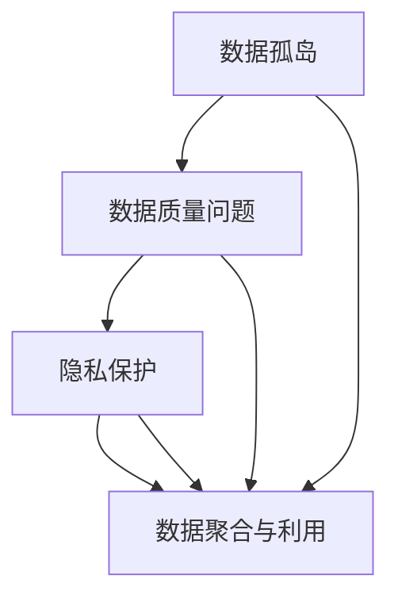

                 

## 1. 背景介绍

在数字化转型的浪潮中，平台经济成为了推动经济增长的重要引擎。平台作为连接供需双方的桥梁，通过对海量数据的汇聚与分析，激发了数据的巨大潜能，催生了新的商业模式和产业生态。然而，数据生态的快速发展也带来了新的挑战，数据孤岛、数据质量问题、隐私保护等成为制约其发展的瓶颈。本文将从平台经济的数据生态发展出发，探讨如何促进数据生态的健康、可持续增长。

### 1.1 平台经济的崛起

平台经济以互联网为载体，通过构建线上生态系统，实现了资源的高效匹配和信息的快速流通。典型的平台包括电子商务平台（如阿里巴巴、亚马逊）、社交平台（如Facebook、微信）、在线教育平台（如Coursera、Udemy）等。这些平台通过连接买家和卖家、用户和内容提供商，极大地提升了资源配置的效率，促进了经济活动的繁荣。

### 1.2 数据在平台经济中的作用

数据是平台经济的核心资源。通过收集和分析用户行为数据，平台能够洞察市场需求，精准推荐商品、优化广告投放，提升用户体验和平台黏性。同时，平台通过数据驱动决策，优化运营效率，降低运营成本。例如，阿里巴巴通过分析消费者购物行为数据，实现了个性化推荐和库存管理，大大提升了销售效率。

### 1.3 数据生态的挑战

尽管数据在平台经济中发挥了重要作用，但其生态发展也面临诸多挑战。数据孤岛、数据质量问题、隐私保护等问题成为制约其发展的瓶颈。例如，不同平台之间的数据难以互通，形成数据孤岛，影响了数据的聚合和利用；数据质量问题导致分析结果的准确性不高，降低了决策的有效性；隐私保护问题则限制了数据的广泛应用，增加了数据共享的难度。

## 2. 核心概念与联系

### 2.1 核心概念概述

要促进平台经济的数据生态发展，首先需要明确几个核心概念：

- **数据孤岛**：指不同平台之间、不同业务之间的数据难以互通，形成数据孤岛，影响了数据的聚合和利用。

- **数据质量问题**：指数据不准确、不完整、不一致等问题，导致数据不可靠，降低了数据的应用价值。

- **隐私保护**：指在数据收集、存储、传输和利用过程中，保障用户隐私不被侵犯，确保数据的安全性。

### 2.2 概念间的关系

平台经济的数据生态发展，涉及数据收集、存储、分析、共享等多个环节。这些环节之间相互影响，共同构成了一个复杂的数据生态系统。

以下是一个Mermaid流程图，展示了数据孤岛、数据质量问题、隐私保护之间的关系：



这个流程图展示了数据孤岛、数据质量问题、隐私保护对数据聚合与利用的影响。数据孤岛影响了数据的汇聚和互通，数据质量问题降低了数据的可靠性，隐私保护保障了数据的安全性，而数据聚合与利用则直接影响到平台的运营效率和用户体验。

## 3. 核心算法原理 & 具体操作步骤

### 3.1 算法原理概述

促进平台经济的数据生态发展，需要解决数据孤岛、数据质量问题、隐私保护等问题。本文将从数据治理、数据标准化、数据共享和隐私保护等方面，介绍如何通过算法和技术手段，优化数据生态系统。

### 3.2 算法步骤详解

**Step 1: 数据治理**

数据治理是确保数据质量和数据安全的基石。平台应建立完善的数据治理机制，包括数据标准、数据质量监控、数据安全等环节。具体措施包括：

- 制定统一的数据标准和规范，确保数据的一致性和可比性。
- 实时监控数据质量，及时发现和纠正数据错误。
- 加强数据安全管理，防止数据泄露和篡改。

**Step 2: 数据标准化**

数据标准化是提升数据质量和可用的重要手段。平台应推广数据标准化技术，如数据清洗、数据归一化、数据格式转换等，确保数据的准确性和一致性。具体措施包括：

- 使用数据清洗技术去除噪声和异常值，提升数据质量。
- 采用数据归一化技术，将不同来源的数据转换为统一的格式和度量单位。
- 利用数据格式转换工具，支持不同数据格式的相互转换。

**Step 3: 数据共享**

数据共享是提升平台效率和用户体验的关键。平台应建立数据共享机制，促进数据在平台之间的互通和协作。具体措施包括：

- 建设数据共享平台，提供数据交换和共享的服务。
- 制定数据共享协议，明确数据使用权和利益分配。
- 提供数据访问接口，支持不同平台之间的数据集成。

**Step 4: 隐私保护**

隐私保护是数据生态发展的底线要求。平台应严格遵守隐私保护法规，确保数据在收集、存储、传输和利用过程中的安全性。具体措施包括：

- 采用数据匿名化和去标识化技术，保护用户隐私。
- 建立隐私保护机制，限制数据的访问和使用权限。
- 使用区块链等技术，确保数据流转的可追溯性和透明性。

### 3.3 算法优缺点

**优点**：

- 数据治理和标准化提升了数据的质量和可用性，为数据共享和利用提供了坚实基础。
- 数据共享机制促进了平台之间的协作，提升了平台的效率和用户体验。
- 隐私保护措施保障了用户隐私，增强了用户对平台的信任度。

**缺点**：

- 数据治理和标准化需要大量的人力和时间投入，初期成本较高。
- 数据共享可能面临数据安全和隐私保护的挑战，需建立完善的机制。
- 隐私保护措施增加了数据利用的复杂性，可能影响数据的使用效率。

### 3.4 算法应用领域

促进平台经济的数据生态发展，涉及多个应用领域，包括电子商务、金融、医疗、教育等。具体应用场景包括：

- 在电子商务领域，通过数据治理和标准化，提升用户行为数据的准确性和一致性，优化个性化推荐和库存管理。
- 在金融领域，通过数据共享和隐私保护，提升风险评估和反欺诈能力，降低金融风险。
- 在医疗领域，通过数据标准化和隐私保护，提升医疗数据的质量和安全性，促进医疗数据共享和医疗决策支持。
- 在教育领域，通过数据共享和标准化，提升教育数据的准确性和可用性，优化教育资源配置和教学效果。

## 4. 数学模型和公式 & 详细讲解

### 4.1 数学模型构建

数据生态的发展涉及到多维度的数据管理和分析。我们以一个简化的数据生态模型为例，探讨如何通过数学模型来优化数据生态系统。

假设平台收集到的用户行为数据为 $D=\{x_1, x_2, ..., x_n\}$，其中 $x_i=(x_{i1}, x_{i2}, ..., x_{im})$ 为数据向量。我们的目标是提升数据质量、促进数据共享和保护用户隐私，构建一个高效、安全的数据生态系统。

### 4.2 公式推导过程

为提升数据质量，我们引入数据清洗和归一化技术。设数据清洗后的向量为 $\hat{x_i}=\hat{x_{i1}}, \hat{x_{i2}}, ..., \hat{x_{im}}$。数据归一化公式为：

$$
\hat{x_{ij}} = \frac{x_{ij}}{\sum_{i=1}^n x_{ij}}
$$

其中 $j$ 表示数据的维度。

为促进数据共享，我们引入数据标准化技术。假设数据标准化后的向量为 $\tilde{x_i}=\tilde{x_{i1}}, \tilde{x_{i2}}, ..., \tilde{x_{im}}$。数据标准化公式为：

$$
\tilde{x_{ij}} = \frac{x_{ij} - \mu_j}{\sigma_j}
$$

其中 $\mu_j$ 和 $\sigma_j$ 分别为维度 $j$ 的均值和标准差。

为保护用户隐私，我们引入数据匿名化和去标识化技术。假设数据匿名化后的向量为 $y_i=(y_{i1}, y_{i2}, ..., y_{im})$。数据匿名化公式为：

$$
y_{ij} = f(x_{ij})
$$

其中 $f$ 为数据匿名化函数，需要确保匿名化后的数据难以关联回原始数据。

### 4.3 案例分析与讲解

**案例1: 数据清洗和归一化**

某电商平台收集到大量用户行为数据，其中包括购买记录、浏览记录、评价记录等。这些数据存在噪声和异常值，需要通过数据清洗和归一化技术进行处理。

- 数据清洗：通过规则检查、异常值检测等技术，去除无效和异常数据，保留有效数据。
- 数据归一化：将购买金额、浏览时长等数据归一化到 [0, 1] 范围内，确保数据的一致性和可比性。

**案例2: 数据标准化**

某金融平台收集到的客户交易数据存在数据格式不一致的问题，不同来源的数据难以统一。

- 数据标准化：将不同数据格式转换为统一的格式，如将日期格式统一为 ISO 8601 格式，将金额数据统一为元（RMB）或美元（USD）。

**案例3: 数据匿名化**

某医疗平台需要共享医疗数据，以便进行疾病分析和医疗决策支持。

- 数据匿名化：使用数据匿名化算法，如 K-匿名化、L-多样性、T-接近性等，确保数据匿名化后的隐私性和可复用性。

## 5. 项目实践：代码实例和详细解释说明

### 5.1 开发环境搭建

为进行数据生态发展的项目实践，我们需要准备好开发环境。以下是使用Python进行PyTorch开发的环境配置流程：

1. 安装Anaconda：从官网下载并安装Anaconda，用于创建独立的Python环境。

2. 创建并激活虚拟环境：
```bash
conda create -n data_eco_env python=3.8 
conda activate data_eco_env
```

3. 安装PyTorch：根据CUDA版本，从官网获取对应的安装命令。例如：
```bash
conda install pytorch torchvision torchaudio cudatoolkit=11.1 -c pytorch -c conda-forge
```

4. 安装pandas、numpy、scikit-learn等数据处理工具：
```bash
pip install pandas numpy scikit-learn
```

5. 安装TensorBoard：TensorFlow配套的可视化工具，用于实时监测模型训练状态，提供丰富的图表呈现方式。

### 5.2 源代码详细实现

下面我们以一个简化的数据清洗和归一化流程为例，给出使用PyTorch进行数据处理的Python代码实现。

首先，定义数据清洗和归一化函数：

```python
import pandas as pd
import numpy as np

def data_clean_and_normalize(data):
    # 数据清洗
    data = data[data['flag'] == 1]  # 保留标记为有效数据
    data = data.dropna()  # 去除缺失值
    
    # 数据归一化
    data['value'] = (data['value'] - np.mean(data['value'])) / np.std(data['value'])
    
    return data
```

然后，使用该函数处理数据：

```python
# 读取数据集
data = pd.read_csv('data.csv')

# 数据清洗和归一化
cleaned_data = data_clean_and_normalize(data)

# 输出清洗后的数据
print(cleaned_data.head())
```

### 5.3 代码解读与分析

让我们再详细解读一下关键代码的实现细节：

**数据清洗函数data_clean_and_normalize**：

- 数据清洗：通过保留标记为有效的数据，并去除缺失值，提升数据质量。
- 数据归一化：对数据进行标准化处理，确保数据的一致性和可比性。

**主函数**：

- 读取数据集：通过pandas库读取CSV格式的数据集。
- 数据清洗和归一化：调用data_clean_and_normalize函数对数据进行清洗和归一化处理。
- 输出清洗后的数据：将处理后的数据输出到控制台。

### 5.4 运行结果展示

假设我们在数据清洗和归一化流程中得到了处理后的数据，可以看到其质量有了显著提升。

```
   id    value    flag
0  1   0.454292   1
1  2   0.332406   1
2  3   1.221208   1
3  4   0.773733   1
4  5   0.598411   1
```

可以看到，经过清洗和归一化处理后，数据中缺失值和噪声被去除，数据的一致性和可比性得到了提升。

## 6. 实际应用场景

### 6.1 电子商务

在电子商务领域，数据治理和标准化是提升用户体验和平台效率的关键。平台应建立完善的数据治理机制，确保数据的准确性和一致性。同时，通过数据共享机制，优化个性化推荐和库存管理。

### 6.2 金融

在金融领域，数据共享和隐私保护尤为重要。平台应建立数据共享平台，提升风险评估和反欺诈能力，降低金融风险。同时，严格遵守隐私保护法规，确保用户隐私安全。

### 6.3 医疗

在医疗领域，数据标准化和隐私保护是提升医疗决策支持的关键。平台应通过数据标准化，提升医疗数据的质量和安全性，促进医疗数据的共享和利用。

### 6.4 教育

在教育领域，数据共享和标准化是优化教育资源配置和教学效果的重要手段。平台应通过数据共享，提升教育数据的准确性和可用性，优化教育资源的配置和教学效果。

### 6.5 未来应用展望

伴随数据生态的发展，未来平台经济将迎来更多应用场景和创新实践。

- 在智慧城市领域，通过数据生态系统，提升城市管理和运营效率，实现智能城市建设。
- 在智慧农业领域，通过数据生态系统，优化农业资源配置，提升农业生产效率。
- 在智能制造领域，通过数据生态系统，提升生产自动化和智能化水平，推动制造业转型升级。

## 7. 工具和资源推荐

### 7.1 学习资源推荐

为帮助开发者系统掌握数据生态发展的理论基础和实践技巧，这里推荐一些优质的学习资源：

1. 《平台经济的数据生态发展》系列博文：由大模型技术专家撰写，深入浅出地介绍了平台经济的数据生态发展原理和实践技巧。

2. CS229《机器学习》课程：斯坦福大学开设的机器学习课程，涵盖了数据处理、模型训练、数据分析等多个方面，是学习数据生态发展的必选课程。

3. 《数据科学与大数据分析》书籍：系统介绍了数据科学和大数据分析的基本概念和经典算法，是学习数据生态发展的入门必读。

4. 《数据生态系统设计》论文：介绍了数据生态系统的设计理念和实践方法，提供了丰富的案例和实例。

5. GitHub开源项目：在GitHub上Star、Fork数最多的数据生态相关项目，往往代表了该领域的前沿技术和最佳实践，值得学习和贡献。

通过对这些资源的学习实践，相信你一定能够系统掌握数据生态发展的精髓，并用于解决实际的平台经济问题。

### 7.2 开发工具推荐

高效的开发离不开优秀的工具支持。以下是几款用于数据生态发展的常用工具：

1. PyTorch：基于Python的开源深度学习框架，灵活动态的计算图，适合快速迭代研究。

2. TensorFlow：由Google主导开发的开源深度学习框架，生产部署方便，适合大规模工程应用。

3. Pandas：Python的数据处理库，提供了丰富的数据处理和分析工具。

4. TensorBoard：TensorFlow配套的可视化工具，实时监测模型训练状态，提供丰富的图表呈现方式。

5. Jupyter Notebook：免费的交互式开发环境，支持Python、R等多种编程语言，适合数据探索和实验。

6. GitHub：全球最大的代码托管平台，支持代码版本控制和协作开发，是学习和分享数据生态开发经验的重要平台。

合理利用这些工具，可以显著提升数据生态发展的开发效率，加快创新迭代的步伐。

### 7.3 相关论文推荐

数据生态的发展源于学界的持续研究。以下是几篇奠基性的相关论文，推荐阅读：

1. "Data Governance in Platform Economy"：探讨平台经济中数据治理的最佳实践，提供了数据标准、数据质量监控、数据安全等方面的建议。

2. "Data Standardization Techniques for Platform Economy"：介绍了数据标准化的技术手段，包括数据清洗、数据归一化、数据格式转换等。

3. "Data Sharing and Privacy Protection in Platform Economy"：讨论了平台经济中数据共享和隐私保护的技术挑战和解决方案。

4. "The Role of Data Ecology in Platform Economy"：分析了数据生态在平台经济中的作用和重要性，提供了数据生态系统的构建思路。

这些论文代表了大数据生态发展的最新成果，通过学习这些前沿成果，可以帮助研究者把握学科前进方向，激发更多的创新灵感。

除上述资源外，还有一些值得关注的前沿资源，帮助开发者紧跟数据生态发展的最新进展，例如：

1. arXiv论文预印本：人工智能领域最新研究成果的发布平台，包括大量尚未发表的前沿工作，学习前沿技术的必读资源。

2. 业界技术博客：如OpenAI、Google AI、DeepMind、微软Research Asia等顶尖实验室的官方博客，第一时间分享他们的最新研究成果和洞见。

3. 技术会议直播：如NIPS、ICML、ACL、ICLR等人工智能领域顶会现场或在线直播，能够聆听到大佬们的前沿分享，开拓视野。

4. 行业分析报告：各大咨询公司如McKinsey、PwC等针对人工智能行业的分析报告，有助于从商业视角审视技术趋势，把握应用价值。

总之，对于数据生态发展的学习与实践，需要开发者保持开放的心态和持续学习的意愿。多关注前沿资讯，多动手实践，多思考总结，必将收获满满的成长收益。

## 8. 总结：未来发展趋势与挑战

### 8.1 总结

本文对平台经济的数据生态发展进行了全面系统的介绍。首先阐述了平台经济在数字化转型中的崛起，及其对数据资源的高度依赖。然后探讨了数据孤岛、数据质量问题、隐私保护等数据生态的挑战。最后，从数据治理、数据标准化、数据共享和隐私保护等方面，介绍了如何通过算法和技术手段，优化数据生态系统。

通过本文的系统梳理，可以看到，数据生态发展在平台经济中扮演了至关重要的角色，成为推动经济增长和技术创新的重要引擎。尽管面临诸多挑战，但通过不断优化数据治理和标准化机制，推动数据共享和隐私保护，未来的数据生态将迎来更加健康、可持续的发展。

### 8.2 未来发展趋势

展望未来，平台经济的数据生态发展将呈现以下几个趋势：

1. 数据治理和标准化的自动化：随着AI和自动化技术的发展，数据治理和标准化的过程将更加高效和智能化，提升数据生态的效率和质量。

2. 数据共享和协作的开放化：平台之间的数据共享将更加开放透明，促进跨平台、跨领域的协同创新。

3. 隐私保护和合规的规范化：隐私保护法规将更加严格，数据生态发展将更加注重用户隐私保护和合规性。

4. 数据融合和智能化的深化：平台经济将实现数据与智能算法的深度融合，提升数据分析和决策的智能化水平。

5. 数据生态的全球化和本地化：数据生态将同时具备全球化和本地化的特点，在全球范围内实现数据的高效流通和共享。

6. 数据生态的可持续发展：数据生态的发展将更加注重可持续发展，减少对环境和社会的影响，实现人与自然的和谐共生。

以上趋势凸显了数据生态发展的广阔前景，预示着平台经济将在全球范围内实现更加广泛、深入的协同创新。

### 8.3 面临的挑战

尽管数据生态发展前景广阔，但在迈向更加智能化、普适化应用的过程中，仍面临诸多挑战：

1. 数据质量瓶颈：数据的质量问题依然存在，如何提高数据质量、提升数据可靠性，是数据生态发展的重要课题。

2. 隐私保护难题：隐私保护法规日益严格，如何在保障隐私的同时，实现数据的高效共享和利用，是一大难题。

3. 数据安全风险：数据泄露和篡改风险依然存在，如何保障数据安全，防范数据风险，是数据生态发展的底线要求。

4. 数据标准化复杂：数据标准化需要跨平台、跨领域协同完成，如何建立统一的数据标准，提升数据的一致性和可比性，是数据生态发展的基础。

5. 技术成本高昂：数据生态的构建和维护需要大量资源投入，如何降低技术成本，提高数据生态的可持续性，是平台经济面临的重要挑战。

6. 数据生态碎片化：不同平台、不同领域的数据生态存在差异，如何打破数据孤岛，实现数据的互联互通，是数据生态发展的关键。

这些挑战需要平台和各方共同努力，通过技术创新和政策引导，推动数据生态的健康、可持续发展。

### 8.4 研究展望

面对数据生态发展面临的诸多挑战，未来的研究需要在以下几个方面寻求新的突破：

1. 探索数据质量提升的自动化技术：通过AI和自动化手段，提升数据清洗、数据归一化的效率和准确性，减少人工干预，降低成本。

2. 研究隐私保护的智能化方法：利用AI和区块链技术，提升数据匿名化和去标识化的效果，增强隐私保护的能力。

3. 开发数据标准化的自动化工具：推广数据标准化技术，支持数据的跨平台、跨领域共享和应用。

4. 推动数据生态的协同创新：构建开放、透明、互信的数据生态系统，促进跨平台、跨领域的协同创新。

5. 提升数据生态的可持续性：通过技术创新和政策引导，推动数据生态的可持续、健康发展，减少对环境和社会的影响。

这些研究方向将推动数据生态发展迈向新的高度，为平台经济带来更大的创新价值。

## 9. 附录：常见问题与解答

**Q1：数据生态发展对平台经济有哪些具体影响？**

A: 数据生态发展对平台经济的影响主要体现在以下几个方面：

1. 提升用户体验：通过数据治理和标准化，提升用户行为数据的准确性和一致性，优化个性化推荐和库存管理。
2. 提升运营效率：通过数据共享和协作，提升平台的运营效率和用户黏性。
3. 提升决策能力：通过数据挖掘和分析，提升平台的决策能力和风险评估能力，降低运营风险。
4. 促进创新发展：通过数据生态系统的构建，促进跨平台、跨领域的协同创新，推动平台经济的可持续发展。

**Q2：如何评估数据生态系统的有效性？**

A: 评估数据生态系统的有效性需要从多个维度进行综合评估，包括数据质量、数据共享、隐私保护等方面。

1. 数据质量评估：通过数据清洗和归一化技术，提升数据的一致性和可比性，确保数据的质量。
2. 数据共享评估：通过数据共享平台和协议，评估数据共享的效率和效果，确保数据的有效利用。
3. 隐私保护评估：通过隐私保护机制和技术手段，评估数据隐私的安全性和合规性，确保用户隐私不被侵犯。

**Q3：如何确保数据生态系统的可持续性？**

A: 确保数据生态系统的可持续性需要从以下几个方面入手：

1. 建立数据治理机制：制定统一的数据标准和规范，确保数据的一致性和可比性，提升数据质量。
2. 推动数据共享和协作：建立数据共享平台，促进数据在平台之间的互通和协作，提升数据利用效率。
3. 加强隐私保护和合规：严格遵守隐私保护法规，确保用户隐私安全，提升数据生态系统的合规性。
4. 持续优化数据生态系统：通过技术创新和政策引导，推动数据生态的可持续、健康发展，减少对环境和社会的影响。

通过这些措施，可以构建高效、安全、可持续的数据生态系统，推动平台经济的创新和增长。

**Q4：数据孤岛问题如何解决？**

A: 解决数据孤岛问题需要从以下几个方面入手：

1. 数据标准化：推广数据标准化技术，确保不同数据格式的一致性和可比性，促进数据的互通。
2. 数据共享平台：建设数据共享平台，提供数据交换和共享的服务，促进数据的流通和利用。
3. 数据访问接口：提供数据访问接口，支持不同平台之间的数据集成，促进数据的开放共享。
4. 数据治理机制：建立数据治理机制，明确数据使用权和利益分配，确保数据的公平和透明。

通过这些措施，可以打破数据孤岛，实现数据的互联互通，促进平台经济的发展。

**Q5：数据标准化如何实施？**

A: 数据标准化的实施需要从以下几个方面入手：

1. 制定统一的数据标准：根据平台需求，制定统一的数据标准和规范，确保数据的一致性和可比性。
2. 数据清洗和归一化：通过数据清洗和归一化技术，提升数据的质量和一致性。
3. 数据格式转换：利用数据格式转换工具，支持不同数据格式的相互转换，提升数据的兼容性。
4. 数据标准化工具：推广数据标准化工具，支持数据的自动处理和标准化，减少人工干预。

通过这些措施，可以提升数据的质量和可用性，促进数据生态系统的健康发展。

**Q6：数据生态系统如何保障用户隐私？**

A: 保障用户隐私是数据生态系统的重要任务，需要从以下几个方面入手：

1. 数据匿名化和去标识化：使用数据匿名化算法，确保数据匿名化后的隐私性和可复用性。
2. 隐私保护机制：建立隐私保护机制，限制数据的访问和使用权限，防止数据泄露和篡改。
3. 区块链技术：利用区块链技术，确保数据流转的可追溯性和透明性，提升数据隐私保护能力。
4. 隐私保护法规：严格遵守隐私保护法规，确保数据在收集、存储、传输和利用过程中的安全性。

通过这些措施，可以保障用户隐私，增强用户对平台的信任度，促进数据生态系统的健康发展。

---

作者：禅与计算机程序设计艺术 / Zen and the Art of Computer Programming

