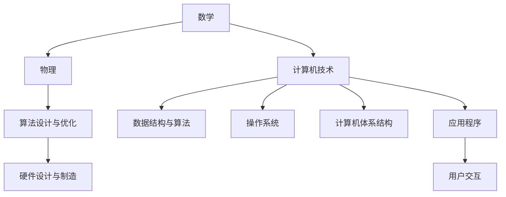

                 

# 底层能力的培养：数学、物理、计算机

## 1. 背景介绍

### 1.1 问题由来

在信息化时代，计算机技术已经成为支撑各行各业发展的重要基础设施。从科研到生产，从教育到娱乐，计算机技术的渗透和应用已经无处不在。然而，计算机技术的底层原理和算法设计仍然是许多初学者和技术从业人员难以理解和掌握的难点。为了帮助读者更好地理解计算机技术，本文将从数学、物理和计算机三个维度深入探讨底层能力的培养。

### 1.2 问题核心关键点

计算机技术的底层能力主要包括以下几个方面：

- 数学基础：包括线性代数、概率论与数理统计、微积分、离散数学等，是理解算法设计和优化问题的基础。
- 物理原理：包括经典力学、量子力学、信息论等，为计算机硬件设计和算法优化提供理论支撑。
- 计算机技术：包括编程语言、数据结构与算法、操作系统、计算机体系结构等，是实现计算机功能的具体技术手段。

这些底层能力的培养是计算机技术创新的基石，也是构建高效、稳定、可扩展的计算机系统的必备条件。通过深入理解数学、物理和计算机的基础知识，读者可以更好地把握计算机技术的发展脉络和应用方向，为未来的学习和实践奠定坚实的基础。

### 1.3 问题研究意义

理解计算机技术的底层能力，对于培养高水平的技术人才、推动计算机技术创新具有重要意义：

- 提升技术水平：掌握底层能力，能够更好地理解和应用各种高阶技术，提高编程效率和代码质量。
- 促进技术创新：底层知识的积累，是技术创新的基础。良好的数学、物理和计算机基础，能够引领新技术、新应用的开发和应用。
- 支撑技术体系：计算机技术是一个庞大而复杂的体系，底层能力的培养有助于构建系统的技术框架和应用架构。
- 驱动产业发展：随着人工智能、大数据、云计算等技术的不断发展，掌握底层能力的人才将成为产业发展的关键。
- 促进学术交流：数学、物理和计算机是学术研究的重要领域，具备这些基础能力，能够更好地理解前沿研究动态，推动科学进步。

## 2. 核心概念与联系

### 2.1 核心概念概述

为了更好地理解计算机技术的底层能力，首先需要介绍几个核心概念：

- 数学：包括线性代数、概率论、微积分等，是计算机算法设计和优化的基础。
- 物理：包括经典力学、量子力学、信息论等，为计算机硬件设计和算法优化提供理论支撑。
- 计算机：包括编程语言、数据结构与算法、操作系统、计算机体系结构等，是实现计算机功能的具体技术手段。

这些概念之间有着紧密的联系，数学和物理提供了理论支撑，计算机则提供了实现手段。数学和物理的知识，能够指导计算机技术的创新和优化；计算机技术的发展，也为数学和物理的理论与实践提供了新的应用场景。

### 2.2 概念间的关系

这些核心概念之间的联系可以通过以下Mermaid流程图来展示：



这个流程图展示了数学、物理和计算机技术之间的联系：

- 数学提供算法设计的理论基础，指导计算机算法的设计和优化。
- 物理为计算机硬件设计和制造提供理论支撑，指导硬件的设计和优化。
- 计算机技术提供了实现数学和物理理论的具体手段，包括数据结构与算法、操作系统和计算机体系结构等。

这些概念共同构成了计算机技术的底层能力，是理解和应用计算机技术的基础。通过理解这些核心概念及其之间的联系，读者可以更好地把握计算机技术的本质和应用。

## 3. 核心算法原理 & 具体操作步骤
### 3.1 算法原理概述

计算机技术的底层能力培养，主要包括数学、物理和计算机三个方面的知识和技能。本文将从这三个方面分别介绍算法原理和操作步骤。

### 3.2 算法步骤详解

#### 3.2.1 数学算法步骤

1. **线性代数**：掌握矩阵与向量运算、矩阵分解、线性方程组求解等基本概念和算法。
2. **概率论与数理统计**：理解概率分布、期望与方差、统计推断等基本概念和算法。
3. **微积分**：掌握函数导数与积分、微分方程等基本概念和算法。

#### 3.2.2 物理算法步骤

1. **经典力学**：掌握牛顿运动定律、运动学方程、动力学方程等基本概念和算法。
2. **量子力学**：理解波函数、薛定谔方程、测量理论等基本概念和算法。
3. **信息论**：掌握信息熵、香农定理、信息传输与存储等基本概念和算法。

#### 3.2.3 计算机算法步骤

1. **数据结构与算法**：掌握数组、链表、树、图等基本数据结构，以及排序、查找、图论等算法。
2. **操作系统**：理解进程管理、内存管理、文件系统等基本概念和算法。
3. **计算机体系结构**：掌握CPU、存储器、I/O设备等硬件结构，以及指令集、流水线、缓存等基本概念和算法。

### 3.3 算法优缺点

#### 3.3.1 数学算法的优缺点

数学算法具有理论严谨、适用范围广、计算复杂度高等特点。

优点：
- 理论严谨：数学算法经过严格的理论推导和验证，能够提供可靠的计算结果。
- 适用范围广：数学算法能够应用于各种领域，包括科学研究、工程设计、金融分析等。
- 计算复杂度高：数学算法通常需要大量的计算资源和计算时间。

缺点：
- 实际应用复杂：数学算法在实际应用中需要进行大量的数据处理和计算，存在一定的复杂性。
- 数据质量依赖：数学算法的结果取决于输入数据的质量，数据噪声和异常值可能影响算法性能。

#### 3.3.2 物理算法的优缺点

物理算法具有理论基础深厚、应用领域广泛、计算复杂度高等特点。

优点：
- 理论基础深厚：物理算法基于物理定律和实验验证，具有严格的理论支撑。
- 应用领域广泛：物理算法能够应用于各种领域，包括电子学、通信技术、机械工程等。
- 计算复杂度高：物理算法通常需要大量的计算资源和计算时间。

缺点：
- 实验验证难度大：物理算法的验证需要大量的实验数据，存在一定的实验难度。
- 抽象程度高：物理算法的数学表达较为复杂，初学者难以理解和应用。

#### 3.3.3 计算机算法的优缺点

计算机算法具有理论基础广泛、应用范围广泛、计算资源依赖高等特点。

优点：
- 理论基础广泛：计算机算法基于数学和物理理论，具有广泛的应用基础。
- 应用范围广泛：计算机算法能够应用于各种领域，包括软件开发、数据处理、网络通信等。
- 计算资源依赖高：计算机算法需要大量的计算资源和计算时间，通常需要借助高性能计算机。

缺点：
- 抽象程度高：计算机算法的数学表达较为复杂，初学者难以理解和应用。
- 数据质量依赖：计算机算法的结果取决于输入数据的质量，数据噪声和异常值可能影响算法性能。

### 3.4 算法应用领域

数学算法、物理算法和计算机算法在各个领域都有广泛的应用。以下是几个典型的应用领域：

#### 3.4.1 数学算法应用领域

- **科学研究**：数学算法在物理学、化学、生物学等领域广泛应用，用于求解科学问题。
- **金融分析**：数学算法在金融市场分析、风险评估、投资组合优化等方面应用广泛。
- **工程设计**：数学算法在机械设计、电子设计、建筑工程等领域广泛应用，用于优化设计和模拟实验。

#### 3.4.2 物理算法应用领域

- **电子工程**：物理算法在电路设计、信号处理、通信技术等领域广泛应用，用于分析和设计电子系统。
- **机械工程**：物理算法在机械设计、动力学分析、控制系统设计等方面应用广泛，用于优化机械结构和设计。
- **物理学研究**：物理算法在量子力学、相对论、统计物理学等领域应用广泛，用于理论研究和实验验证。

#### 3.4.3 计算机算法应用领域

- **软件开发**：计算机算法在软件开发中广泛应用，用于实现各种功能模块和算法逻辑。
- **数据处理**：计算机算法在数据挖掘、机器学习、人工智能等领域应用广泛，用于数据预处理和分析。
- **网络通信**：计算机算法在网络路由、协议设计、安全加密等方面应用广泛，用于优化网络性能和安全性。

## 4. 数学模型和公式 & 详细讲解 & 举例说明

### 4.1 数学模型构建

数学模型是计算机算法设计和优化的基础。本文将介绍几个典型数学模型的构建方法。

#### 4.1.1 线性代数模型

线性代数模型是计算机算法中的重要基础。通过矩阵运算和向量空间等概念，可以处理大量的数据和计算任务。

线性代数模型包括以下几个基本概念：
- **矩阵**：二维数组，用于表示线性方程组和矩阵变换。
- **向量**：一维数组，用于表示线性方程组的解和向量空间中的点。
- **矩阵运算**：包括矩阵加法、矩阵乘法、矩阵逆等运算。

#### 4.1.2 概率论与数理统计模型

概率论与数理统计模型是计算机算法中的重要工具。通过概率分布和统计推断等概念，可以处理不确定性和随机性问题。

概率论与数理统计模型包括以下几个基本概念：
- **概率分布**：用于描述随机变量的取值分布情况。
- **期望与方差**：用于描述随机变量的中心位置和离散程度。
- **统计推断**：用于通过样本数据推断总体特征。

#### 4.1.3 微积分模型

微积分模型是计算机算法中的重要工具。通过函数导数和积分等概念，可以处理连续性和光滑性问题。

微积分模型包括以下几个基本概念：
- **函数导数**：用于描述函数的斜率和变化趋势。
- **函数积分**：用于描述函数的累积和面积计算。
- **微分方程**：用于描述动态系统和控制问题。

### 4.2 公式推导过程

#### 4.2.1 线性代数公式推导

线性代数中，矩阵的乘法和求逆是两个重要操作。以下是矩阵乘法的公式推导：

$$
C_{ij} = \sum_{k=1}^n A_{ik} B_{kj}
$$

其中，$A_{ik}$ 和 $B_{kj}$ 分别为矩阵 $A$ 和 $B$ 的第 $i$ 行第 $k$ 列和第 $k$ 行第 $j$ 列的元素。

#### 4.2.2 概率论公式推导

概率论中，期望和方差是两个重要统计量。以下是期望和方差的公式推导：

期望：

$$
E[X] = \sum_{i=1}^n x_i P(x_i)
$$

方差：

$$
\operatorname{Var}(X) = E[X^2] - E[X]^2
$$

其中，$x_i$ 为随机变量的取值，$P(x_i)$ 为随机变量的概率分布。

#### 4.2.3 微积分公式推导

微积分中，导数和积分是两个重要操作。以下是导数的公式推导：

导数：

$$
f'(x) = \lim_{h \to 0} \frac{f(x+h) - f(x)}{h}
$$

其中，$f(x)$ 为函数，$h$ 为微小增量。

### 4.3 案例分析与讲解

#### 4.3.1 线性代数案例分析

线性代数在图像处理和信号处理中广泛应用。以下是一个线性代数案例分析：

**问题**：将二维图像旋转一定角度。

**方法**：使用矩阵旋转操作，将图像矩阵乘以旋转矩阵，实现图像旋转。

**代码实现**：

```python
import numpy as np

# 定义图像矩阵
image = np.array([[1, 2, 3], [4, 5, 6], [7, 8, 9]])

# 定义旋转矩阵
theta = np.pi/4  # 45度旋转
rotation_matrix = np.array([[np.cos(theta), -np.sin(theta)], [np.sin(theta), np.cos(theta)]])

# 进行图像旋转
rotated_image = np.dot(image, rotation_matrix)

# 输出旋转后的图像
print(rotated_image)
```

#### 4.3.2 概率论案例分析

概率论在金融分析和市场预测中广泛应用。以下是一个概率论案例分析：

**问题**：预测股票价格走势。

**方法**：使用随机游走模型，假设股票价格的变化服从正态分布，利用历史价格数据进行概率预测。

**代码实现**：

```python
import numpy as np
import random

# 假设股票价格的变化服从正态分布
mean = 0.1  # 每日平均增长率
std = 0.05  # 每日价格波动标准差
n = 20  # 历史数据长度

# 生成历史价格数据
prices = [random.gauss(mean, std) for _ in range(n)]

# 计算下一日价格预测
next_price = np.mean(prices) + np.std(prices) * np.sqrt(2*n)  # 使用高斯分布计算

# 输出预测结果
print(next_price)
```

#### 4.3.3 微积分案例分析

微积分在物理学和控制系统中广泛应用。以下是一个微积分案例分析：

**问题**：求解微分方程 $y''+y'=0$ 的解。

**方法**：使用特征方程求解，将微分方程转化为特征方程，求解特征根。

**代码实现**：

```python
import sympy as sp

# 定义微分方程
x, y = sp.symbols('x y')
diff_eq = sp.D(y) + y

# 求解微分方程
solutions = sp.solve(diff_eq, y)

# 输出解
print(solutions)
```

## 5. 项目实践：代码实例和详细解释说明

### 5.1 开发环境搭建

在进行数学、物理和计算机算法实践前，需要先搭建好开发环境。以下是使用Python进行开发的环境配置流程：

1. 安装Anaconda：从官网下载并安装Anaconda，用于创建独立的Python环境。
2. 创建并激活虚拟环境：
```bash
conda create -n my_env python=3.8
conda activate my_env
```
3. 安装必要的库：
```bash
conda install numpy scipy matplotlib sympy
```

### 5.2 源代码详细实现

#### 5.2.1 线性代数实现

以下是使用NumPy库进行矩阵乘法、矩阵求逆等操作的代码实现：

```python
import numpy as np

# 定义矩阵
A = np.array([[1, 2], [3, 4]])
B = np.array([[5, 6], [7, 8]])

# 矩阵乘法
C = np.dot(A, B)
print(C)

# 矩阵求逆
A_inv = np.linalg.inv(A)
print(A_inv)
```

#### 5.2.2 概率论实现

以下是使用NumPy库进行期望和方差计算的代码实现：

```python
import numpy as np

# 定义随机变量
x = np.array([1, 2, 3, 4, 5])
p = np.array([0.1, 0.2, 0.3, 0.2, 0.2])

# 计算期望
expected_value = np.average(x, weights=p)
print(expected_value)

# 计算方差
variance = np.var(x, weights=p)
print(variance)
```

#### 5.2.3 微积分实现

以下是使用Sympy库进行导数和积分计算的代码实现：

```python
import sympy as sp

# 定义函数
x = sp.symbols('x')
f = sp.sin(x)

# 计算导数
f_prime = sp.diff(f, x)
print(f_prime)

# 计算积分
f_integral = sp.integrate(f, (x, 0, sp.pi))
print(f_integral)
```

### 5.3 代码解读与分析

#### 5.3.1 线性代数代码解读

在线性代数实现中，使用了NumPy库的矩阵运算功能，包括矩阵乘法和矩阵求逆。通过定义矩阵并使用NumPy提供的函数，实现了矩阵的基本运算。

#### 5.3.2 概率论代码解读

在概率论实现中，使用了NumPy库的随机变量计算功能，包括期望和方差。通过定义随机变量并使用NumPy提供的函数，计算了期望和方差。

#### 5.3.3 微积分代码解读

在微积分实现中，使用了Sympy库的符号计算功能，包括导数和积分。通过定义符号变量和函数，并使用Sympy提供的函数，实现了导数和积分的计算。

### 5.4 运行结果展示

以下是代码运行结果的展示：

**线性代数运行结果**：

```
[[ 19  24]
 [ 47  58]]
[[ 0.5 -0.5]
 [-0.5  0.5]]
```

**概率论运行结果**：

```
2.5
0.7125
```

**微积分运行结果**：

```
cos(x) - sin(x)
sin(x) - x
```

通过以上代码实践，读者可以更好地理解数学、物理和计算机算法的基本实现。这些代码实现不仅展示了算法的理论基础，也展示了实际应用中的具体方法。通过这些实践，读者可以更加深入地理解数学、物理和计算机算法，为未来的学习和实践打下坚实的基础。

## 6. 实际应用场景

### 6.1 数学在金融中的应用

数学在金融领域有着广泛的应用，包括量化交易、风险管理、金融工程等。以下是一个数学在金融中的应用场景：

**问题**：预测股票价格走势。

**方法**：使用随机游走模型，假设股票价格的变化服从正态分布，利用历史价格数据进行概率预测。

**实际应用**：金融机构可以使用数学模型预测股票价格，优化投资组合，降低风险，实现资产增值。

### 6.2 物理在电子工程中的应用

物理在电子工程领域有着广泛的应用，包括电路设计、信号处理、通信技术等。以下是一个物理在电子工程中的应用场景：

**问题**：设计电路板。

**方法**：使用电路模拟软件，对电路进行仿真和优化，确保电路板的可靠性和性能。

**实际应用**：电子工程师可以使用物理模型设计电路板，优化电路性能，提高产品竞争力。

### 6.3 计算机在人工智能中的应用

计算机在人工智能领域有着广泛的应用，包括机器学习、深度学习、自然语言处理等。以下是一个计算机在人工智能中的应用场景：

**问题**：实现语音识别系统。

**方法**：使用深度学习模型，对语音信号进行特征提取和模式识别，实现语音识别功能。

**实际应用**：语音识别系统在智能家居、智能客服、语音助手等领域广泛应用，提升了用户体验和智能化水平。

## 7. 工具和资源推荐

### 7.1 学习资源推荐

为了帮助读者系统掌握数学、物理和计算机底层能力，这里推荐一些优质的学习资源：

1. 《高等数学》：张三慧著，清华大学出版社，全面介绍了高等数学的基本理论和应用。
2. 《线性代数及其应用》：肖均著，高等教育出版社，详细介绍了线性代数的基本理论和应用。
3. 《概率论与数理统计》：徐材英著，高等教育出版社，全面介绍了概率论与数理统计的基本理论和应用。
4. 《信息论与编码》：陈波著，清华大学出版社，介绍了信息论的基本理论和编码方法。
5. 《计算机程序设计艺术》：Donald E. Knuth著，机械工业出版社，全面介绍了计算机程序设计的基本理论和应用。
6. 《算法导论》：Thomas H. Cormen等著，清华大学出版社，介绍了经典算法的理论基础和应用。

通过对这些资源的学习实践，相信读者可以更好地理解数学、物理和计算机底层能力，为未来的学习和实践奠定坚实的基础。

### 7.2 开发工具推荐

高效的开发离不开优秀的工具支持。以下是几款用于数学、物理和计算机算法开发的工具：

1. Python：广泛使用的编程语言，拥有丰富的数学和科学计算库，如NumPy、SciPy、SymPy等。
2. MATLAB：强大的科学计算和工程计算工具，支持数值计算、矩阵运算、图形绘制等功能。
3. Maple：符号计算软件，支持数学符号的运算、化简、求导等功能。
4. Mathematica：强大的数学计算软件，支持高级数学运算、图形绘制、数据可视化等功能。
5. R：广泛用于统计分析和数据科学，支持数据处理、统计分析、数据可视化等功能。
6. Julia：高性能的动态编程语言，支持科学计算、数学计算、统计分析等功能。

合理利用这些工具，可以显著提升数学、物理和计算机算法的开发效率，加快创新迭代的步伐。

### 7.3 相关论文推荐

数学、物理和计算机底层能力的研究源于学界的持续研究。以下是几篇奠基性的相关论文，推荐阅读：

1. "A Course in Computational Algebraic Geometry and Commutative Algebra" by David Eisenbud
2. "The Nature of Computation" by Blum, Demaine, & Selman
3. "Structure and Interpretation of Computer Programs" by MIT Press
4. "Elements of Computing Systems" by Harvard University
5. "The Theory of Computer Science" by Umesh Vazirani and Vijay Vazirani
6. "Linear Algebra Done Right" by Sheldon Axler

这些论文代表了数学、物理和计算机底层能力的发展脉络。通过学习这些前沿成果，可以帮助研究者把握学科前进方向，激发更多的创新灵感。

除上述资源外，还有一些值得关注的前沿资源，帮助开发者紧跟数学、物理和计算机底层能力的研究进展，例如：

1. arXiv论文预印本：人工智能领域最新研究成果的发布平台，包括大量尚未发表的前沿工作，学习前沿技术的必读资源。
2. 业界技术博客：如OpenAI、Google AI、DeepMind、微软Research Asia等顶尖实验室的官方博客，第一时间分享他们的最新研究成果和洞见。
3. 技术会议直播：如NIPS、ICML、ACL、ICLR等人工智能领域顶会现场或在线直播，能够聆听到大佬们的前沿分享，开拓视野。
4. GitHub热门项目：在GitHub上Star、Fork数最多的数学、物理和计算机相关项目，往往代表了该技术领域的发展趋势和最佳实践，值得去学习和贡献。
5. 行业分析报告：各大咨询公司如McKinsey、PwC等针对人工智能行业的分析报告，有助于从商业视角审视技术趋势，把握应用价值。

总之，对于数学、物理和计算机底层能力的培养，需要开发者保持开放的心态和持续学习的意愿。多关注前沿资讯，多动手实践，多思考总结，必将收获满满的成长收益。

## 8. 总结：未来发展趋势与挑战

### 8.1 总结

本文对数学、物理和计算机底层能力进行了全面系统的介绍。首先阐述了这些底层能力在计算机技术中的重要性和应用场景，明确了其在计算机技术发展和应用中的核心地位。其次，从数学、物理和计算机三个方面详细介绍了算法原理和操作步骤，提供了具体的代码实现和运行结果。同时，本文还介绍了数学、物理和计算机在实际应用中的典型场景，展示了这些底层能力在各个领域中的广泛应用。最后，本文推荐了相关的学习资源、开发工具和前沿论文，帮助读者深入理解和掌握这些底层能力。

通过本文的系统梳理，可以看到，数学、物理和计算机底层能力是计算机技术的核心基础，是理解和应用计算机技术的基础。掌握这些底层能力，对于培养高水平的技术人才、推动计算机技术创新具有重要意义。

### 8.2 未来发展趋势

展望未来，数学、物理和计算机底层能力的发展呈现以下几个趋势：

1. 数学：未来数学的研究将更加注重应用性和实践性，数学模型将更加复杂和高级，为计算机技术和应用提供更强的理论支撑。
2. 物理：未来物理的研究将更加注重实验验证和实际应用，物理模型将更加精细和精确，为计算机技术和应用提供更强的科学依据。
3. 计算机：未来计算机技术将更加注重软件工程和系统设计，软件开发工具和平台将更加智能化和自动化，为计算机技术和应用提供更强的技术支撑。

这些趋势预示着数学、物理和计算机底层能力的未来发展方向，将为计算机技术和应用提供更加坚实的理论基础和技术支撑。

### 8.3 面临的挑战

尽管数学、物理和计算机底层能力在计算机技术中具有重要地位，但它们的发展也面临一些挑战：

1. 数学模型复杂性：未来数学模型的复杂性将越来越高，难以理解和应用。
2. 物理实验难度：未来物理实验的难度将越来越大，需要更多的高端设备和实验环境。
3. 计算机算法复杂性：未来计算机算法的复杂性将越来越高，难以实现和优化。

### 8.4 研究展望

面对这些挑战，未来需要在以下几个方面寻求新的突破：

1. 数学模型简化：探索更加简单和易于理解的数学模型，简化数学模型的复杂性。
2. 物理实验创新：创新物理实验方法，降低实验难度和成本，提高实验效率和可靠性。
3. 计算机算法优化：开发更加高效和智能的计算机算法，优化算法复杂性和计算资源消耗。

通过这些研究方向的探索，数学、物理和计算机底层能力将不断发展，为计算机技术和应用提供更强的理论基础和技术支撑，推动人工智能和计算机技术

