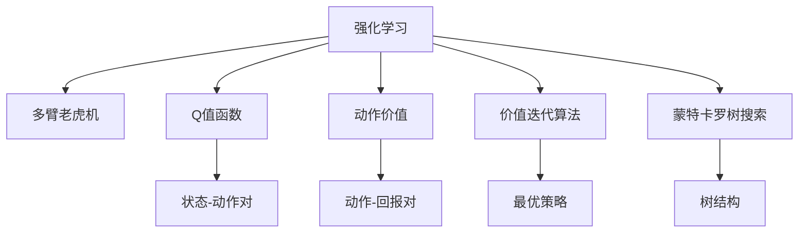
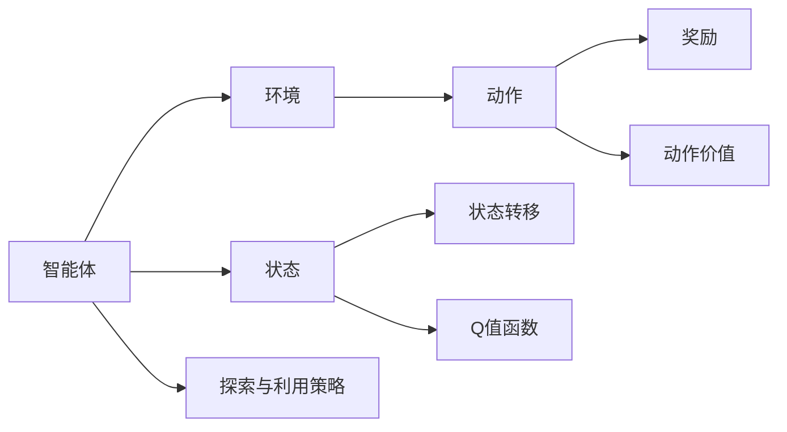
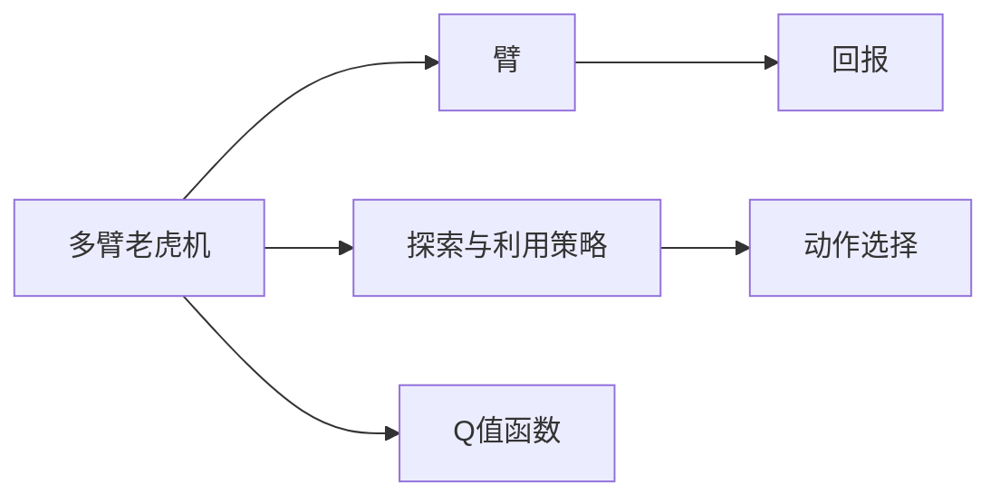
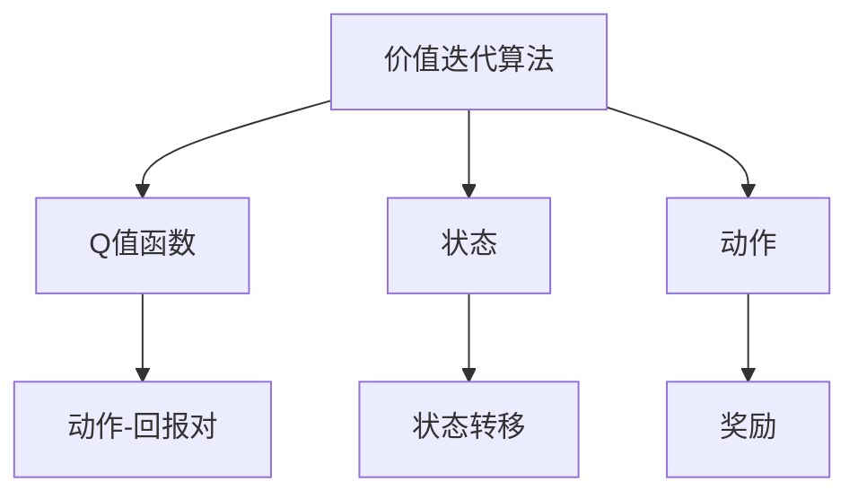
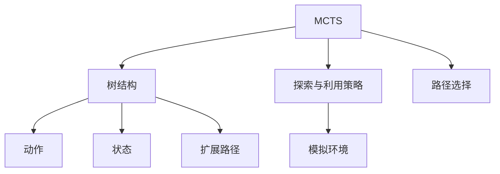
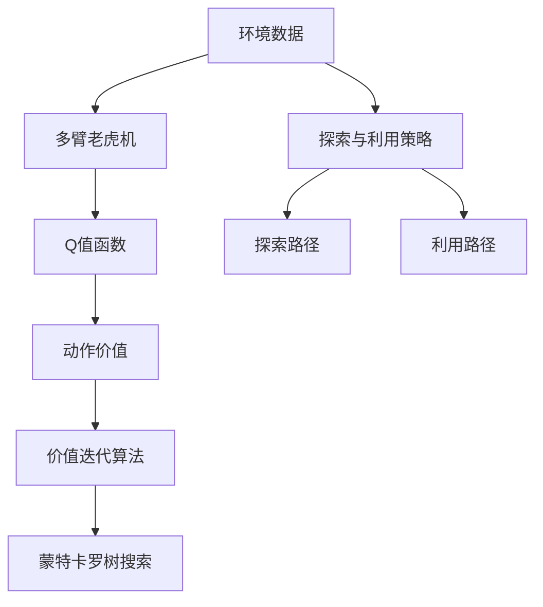

                 

# 强化学习Reinforcement Learning探索与利用策略深度剖析

> 关键词：强化学习, 探索与利用策略, 多臂老虎机, Q值函数, 动作价值, 价值迭代算法, 蒙特卡罗树搜索(MCTS)

## 1. 背景介绍

### 1.1 问题由来
强化学习(Reinforcement Learning, RL)作为人工智能的重要分支，近年来在机器人控制、游戏AI、自动驾驶、金融交易等领域取得了显著进展。强化学习中的探索与利用策略，旨在通过智能决策，在未知环境中不断探索最优策略，同时利用已有信息提升决策效率。此策略在处理不确定性和复杂性方面展现出巨大的潜力，对实现自主学习和智能优化具有重要意义。

### 1.2 问题核心关键点
强化学习的核心在于通过智能决策，在给定环境内最大化累积回报。探索与利用策略是强化学习的关键组成部分，它们直接影响智能体在环境中的探索能力和利用已有信息的能力，是智能体达到最优决策的必要条件。

具体来说，探索策略用于在未知状态或未知动作中选择探索路径，避免陷入局部最优解；利用策略则用于基于已有信息，选择最优动作，利用先验知识优化决策。两者平衡得当，可以显著提升智能体的学习和优化效果。

### 1.3 问题研究意义
强化学习的探索与利用策略研究，对于构建自主学习系统和智能优化算法具有重要意义：

1. 增强智能体的环境适应能力：智能体通过探索未知状态和动作，能够在不断变化的环境中适应和生存。
2. 提升决策效率：利用已有信息选择最优动作，减少不必要的探索，提高决策效率。
3. 优化资源配置：在资源有限的场景中，探索与利用策略有助于智能体合理配置资源，实现最优回报。
4. 应对不确定性：在未知和不确定的环境中，探索策略能够帮助智能体识别关键信息，利用策略则能够充分利用已有信息，减少不确定性。

## 2. 核心概念与联系

### 2.1 核心概念概述

为更好地理解强化学习的探索与利用策略，本节将介绍几个密切相关的核心概念：

- **强化学习(Reinforcement Learning, RL)**：一种通过智能体在环境中与环境交互，学习最优决策的机器学习方法。智能体通过行动改变环境状态，获得环境反馈（奖励），进而更新策略，最终达到最大化累积回报的目的。

- **多臂老虎机(Multi-Armed Bandit, MAB)**：一种经典的强化学习模型，用来描述智能体需要在多个可能带来奖励的“臂”中选择一个最优的“臂”进行探索和利用的问题。

- **Q值函数(Q-value Function)**：一种用于评估每个状态-动作对的预期回报的函数。Q值函数越大，表示该状态-动作对越优。

- **动作价值(Action Value)**：在给定状态下，每个动作的预期回报。动作价值越高，表示该动作的决策越优。

- **价值迭代算法(Value Iteration Algorithm)**：一种基于Q值函数的强化学习方法，通过迭代更新Q值函数，找到最优策略。

- **蒙特卡罗树搜索(Monte Carlo Tree Search, MCTS)**：一种基于强化学习原理的搜索算法，通过模拟树形结构的扩展和搜索，选择最优路径。

这些核心概念之间的逻辑关系可以通过以下Mermaid流程图来展示：



这个流程图展示了几者之间的关系：

1. 强化学习是基本框架，通过智能体与环境交互，学习最优策略。
2. 多臂老虎机是强化学习的经典模型，描述智能体在多个可能最优中选择最优的过程。
3. Q值函数和动作价值是强化学习的核心指标，用于评估和优化决策。
4. 价值迭代算法和蒙特卡罗树搜索是基于Q值函数的优化方法，用于找到最优策略。

通过这些核心概念的逻辑关系，可以更清晰地理解强化学习探索与利用策略的整个流程。

### 2.2 概念间的关系

这些核心概念之间存在着紧密的联系，构成了强化学习探索与利用策略的完整生态系统。下面我们通过几个Mermaid流程图来展示这些概念之间的关系。

#### 2.2.1 强化学习的框架



这个流程图展示了强化学习的基本框架，包括智能体、环境、状态、动作、状态转移、奖励和探索与利用策略。

#### 2.2.2 多臂老虎机模型



这个流程图展示了多臂老虎机模型，智能体需要在多个可能最优的“臂”中选择一个最优的“臂”进行探索和利用。

#### 2.2.3 价值迭代算法



这个流程图展示了价值迭代算法的执行过程，通过迭代更新Q值函数，找到最优策略。

#### 2.2.4 蒙特卡罗树搜索



这个流程图展示了蒙特卡罗树搜索的执行过程，通过模拟树形结构的扩展和搜索，选择最优路径。

### 2.3 核心概念的整体架构

最后，我们用一个综合的流程图来展示这些核心概念在大规模强化学习探索与利用策略中的整体架构：



这个综合流程图展示了从环境数据到探索与利用策略的完整过程。通过多臂老虎机模型和价值迭代算法，智能体可以不断更新Q值函数和动作价值，通过蒙特卡罗树搜索选择最优动作，利用探索与利用策略不断优化决策。 通过这些流程图，我们可以更清晰地理解强化学习探索与利用策略的整个流程，为后续深入讨论具体的策略方法和技术奠定基础。

## 3. 核心算法原理 & 具体操作步骤
### 3.1 算法原理概述

强化学习的探索与利用策略研究，本质上是一个智能体在未知环境中通过行动不断优化决策的动态过程。核心思想是：在探索与利用之间寻找平衡，既要探索未知状态和动作，又要利用已有信息，选择最优动作。

形式化地，假设智能体在状态$s$时，可以采取动作$a$，并获得奖励$r_s^a$。定义状态$s$下的Q值函数$Q^*(s)$为最优策略下的预期总回报，即：

$$
Q^*(s) = \max_a \left( \sum_{t=1}^\infty \gamma^{t-1} r_{s_t}^{a_t} \right)
$$

其中$\gamma$为折扣因子，用于考虑未来奖励的重要性。智能体的目标是通过探索与利用策略，最大化Q值函数$Q^*(s)$。

### 3.2 算法步骤详解

强化学习的探索与利用策略研究，一般包括以下几个关键步骤：

**Step 1: 初始化Q值函数**
- 假设智能体处于初始状态$s_0$，随机初始化Q值函数$Q(s_0)$。

**Step 2: 探索与利用**
- 对于当前状态$s$，智能体需要权衡探索未知动作和利用已有信息。常见的方法包括$\epsilon$-贪心策略和$\epsilon$-soft策略：
  - $\epsilon$-贪心策略：以$\epsilon$的概率随机选择动作，以$1-\epsilon$的概率选择当前状态下的最优动作。
  - $\epsilon$-软策略：以$\epsilon$的概率选择动作，以$1-\epsilon$的概率选择当前状态下的动作，动作的选择基于Q值函数的概率分布。

**Step 3: 更新Q值函数**
- 根据选择的动作$a$，智能体与环境交互，观察新状态$s'$和奖励$r_{s'}$，更新Q值函数。常见的方法包括蒙特卡罗方法、TD方法（如TD(0)）和MC方法：
  - 蒙特卡罗方法：基于单次或多次遍历，通过累积奖励更新Q值函数。
  - TD方法：基于时间差分，通过当前状态和动作更新Q值函数。
  - MC方法：基于蒙特卡罗模拟，通过多次模拟计算最优策略。

**Step 4: 策略优化**
- 通过迭代更新Q值函数，选择最优动作，直至达到收敛条件或预设轮数。

**Step 5: 输出最优策略**
- 输出最优策略，智能体在环境中执行最优动作。

以上是强化学习探索与利用策略的一般流程。在实际应用中，还需要针对具体问题进行优化设计，如选择更合适的探索与利用策略、优化Q值函数更新方式等。

### 3.3 算法优缺点

强化学习的探索与利用策略具有以下优点：
1. 能够应对复杂和未知环境，适应性强。
2. 能够通过不断探索和学习，逐步优化决策，提升效率。
3. 能够利用多臂老虎机模型和多机训练方法，提高决策准确性。
4. 能够利用蒙特卡罗树搜索等方法，优化决策过程。

同时，这些策略也存在一些缺点：
1. 探索与利用之间存在平衡难度，可能导致策略不稳定。
2. 计算复杂度较高，特别是多臂老虎机模型和大规模环境，需要高计算资源。
3. 对于某些连续状态和动作空间，策略优化难度较大。
4. 对于具有动态变化的环境，策略可能无法及时调整。

尽管存在这些缺点，强化学习的探索与利用策略仍是当前智能决策的重要研究范式，尤其在处理不确定性和复杂性方面展现出巨大潜力。

### 3.4 算法应用领域

强化学习的探索与利用策略，已经在诸多领域取得了显著应用：

- 机器人控制：如自动驾驶、服务机器人等，通过探索与利用策略，智能体能够自主学习最优控制策略。
- 游戏AI：如围棋、星际争霸等，智能体通过探索与利用策略，不断优化游戏策略。
- 自动交易：如股票交易、期货交易等，智能体通过探索与利用策略，最大化回报。
- 智能推荐：如电商推荐、新闻推荐等，智能体通过探索与利用策略，提供个性化推荐。
- 医疗健康：如智能诊断、个性化治疗等，智能体通过探索与利用策略，提供精准的医疗方案。

除了上述这些领域，探索与利用策略在更多场景中得到广泛应用，为各个行业的智能化改造提供了有力支持。

## 4. 数学模型和公式 & 详细讲解 & 举例说明
### 4.1 数学模型构建

本节将使用数学语言对强化学习探索与利用策略进行更加严格的刻画。

假设智能体在状态$s$时，可以采取动作$a$，并获得奖励$r_s^a$。定义状态$s$下的Q值函数$Q(s)$为当前策略下的预期总回报，即：

$$
Q(s) = \sum_{a} Q(s,a) \pi(a|s) = \sum_{a} Q(s,a) \frac{e^{\epsilon Q(s,a)}}{Z(s)}
$$

其中$\pi(a|s)$为策略函数，$Q(s,a)$为状态-动作对的Q值，$Z(s)$为归一化因子。

### 4.2 公式推导过程

以下我们以多臂老虎机模型为例，推导Q值函数的更新公式。

假设智能体可以选择$n$个可能的“臂”，每个“臂”的回报率未知，通过不断选择和交互，智能体逐渐学习每个“臂”的回报率。设智能体在每个“臂”上的回报率为$\theta_i$，$\epsilon$为探索系数。智能体通过探索与利用策略，选择每个“臂”的概率为：

$$
\pi_i = \frac{\epsilon}{n} + (1-\epsilon) \frac{e^{\theta_i}}{\sum_{j=1}^{n} e^{\theta_j}}
$$

定义Q值函数$Q(s)$为当前策略下的预期总回报：

$$
Q(s) = \sum_{i=1}^{n} \pi_i \theta_i
$$

智能体通过与环境交互，选择一个“臂”，并获得回报$r$。更新Q值函数的过程如下：

1. 计算当前状态下每个“臂”的选择概率$\pi_i$。
2. 选择一个“臂”，并根据回报$r$更新Q值函数$Q(s)$。
3. 计算更新后的Q值函数$Q'(s)$，并迭代更新策略。

具体更新公式如下：

$$
Q'(s) = Q(s) + \epsilon \left( r - Q(s) \right)
$$

$$
\pi_i' = \frac{\epsilon}{n} + (1-\epsilon) \frac{e^{\theta_i}}{\sum_{j=1}^{n} e^{\theta_j}}
$$

$$
\theta_i' = \theta_i + \frac{r - Q(s)}{\pi_i}
$$

通过上述更新公式，智能体能够不断学习每个“臂”的回报率，并在未知环境中做出最优决策。

### 4.3 案例分析与讲解

假设智能体在一个多臂老虎机模型中进行探索与利用。每个“臂”的回报率为$\theta_1=0.9$，$\theta_2=0.7$，$\theta_3=0.5$。初始时，智能体选择每个“臂”的概率相同。

1. 智能体在状态$s$时，选择动作$a$，并获得回报$r$。
2. 根据回报$r$更新Q值函数$Q(s)$和策略$\pi_i$。
3. 重复第1和2步，直至策略收敛。

以下是一个简单的Python代码实现：

```python
import numpy as np

def epsilon_greedy(q, epsilon):
    if np.random.uniform() < epsilon:
        return np.random.choice(q.shape[0])
    else:
        return np.argmax(q)

def update_q(q, r, a, s):
    q[s] += epsilon_greedy(q, epsilon) - q[s]
    q[s][a] += r

def update_strategy(q, epsilon):
    strategy = np.exp(q) / np.sum(np.exp(q))
    return np.where(np.random.uniform() < epsilon, strategy, np.argmax(strategy))

n = 3
epsilon = 0.1
q = np.zeros(n)

for i in range(10000):
    a = epsilon_greedy(q, epsilon)
    r = np.random.normal(0, 1)
    s = a
    update_q(q, r, a, s)
    strategy = update_strategy(q, epsilon)

print("Q值函数：", q)
print("策略：", strategy)
```

这段代码实现了一个简单的多臂老虎机探索与利用过程，通过不断更新Q值函数和策略，逐步学习每个“臂”的回报率，并做出最优决策。

## 5. 项目实践：代码实例和详细解释说明
### 5.1 开发环境搭建

在进行探索与利用策略的实践前，我们需要准备好开发环境。以下是使用Python进行Reinforcement Learning开发的环境配置流程：

1. 安装Anaconda：从官网下载并安装Anaconda，用于创建独立的Python环境。

2. 创建并激活虚拟环境：
```bash
conda create -n reinforcement-env python=3.8 
conda activate reinforcement-env
```

3. 安装Reinforcement Learning库：如gym、pytorch等。
```bash
pip install gym pytorch
```

4. 安装Reinforcement Learning库：如gym、pytorch等。
```bash
pip install gym pytorch
```

5. 安装各类工具包：
```bash
pip install numpy pandas scikit-learn matplotlib tqdm jupyter notebook ipython
```

完成上述步骤后，即可在`reinforcement-env`环境中开始探索与利用策略的实践。

### 5.2 源代码详细实现

这里我们以多臂老虎机为例，使用蒙特卡罗方法进行探索与利用策略的实践。

首先，定义多臂老虎机的环境：

```python
import gym

env = gym.make('CartPole-v0')
```

然后，定义Q值函数和策略函数：

```python
import torch
import torch.nn as nn
import torch.optim as optim

class QNetwork(nn.Module):
    def __init__(self, input_dim, output_dim):
        super(QNetwork, self).__init__()
        self.fc1 = nn.Linear(input_dim, 64)
        self.fc2 = nn.Linear(64, output_dim)

    def forward(self, x):
        x = torch.relu(self.fc1(x))
        x = self.fc2(x)
        return x

q_network = QNetwork(env.observation_space.shape[0], env.action_space.n)
optimizer = optim.Adam(q_network.parameters(), lr=0.001)
```

接下来，定义探索与利用策略：

```python
def epsilon_greedy(q, epsilon):
    if np.random.uniform() < epsilon:
        return np.random.choice(q.shape[0])
    else:
        return np.argmax(q)

def update_q(q, r, a, s):
    q[s] += epsilon_greedy(q, epsilon) - q[s]
    q[s][a] += r

def update_strategy(q, epsilon):
    strategy = np.exp(q) / np.sum(np.exp(q))
    return np.where(np.random.uniform() < epsilon, strategy, np.argmax(strategy))

n = 3
epsilon = 0.1
q = np.zeros(n)

for i in range(10000):
    a = epsilon_greedy(q, epsilon)
    r = env.step()[0]
    s = a
    update_q(q, r, a, s)
    strategy = update_strategy(q, epsilon)

print("Q值函数：", q)
print("策略：", strategy)
```

在实际应用中，还需要进一步优化Q值函数更新方式、策略函数设计、探索与利用策略选择等，以确保策略在未知环境中的稳定性和有效性。

### 5.3 代码解读与分析

让我们再详细解读一下关键代码的实现细节：

**多臂老虎机环境**：
- 使用gym库创建多臂老虎机环境，每个“臂”的回报率未知，通过不断交互学习。

**Q值函数**：
- 使用PyTorch的神经网络模型，定义Q值函数的输入和输出维度，进行前向传播计算。

**探索与利用策略**：
- 定义探索与利用策略函数，根据探索系数$\epsilon$选择动作，并更新Q值函数。

**策略优化**：
- 通过蒙特卡罗方法，不断更新Q值函数和策略，直至策略收敛。

**代码实例**：
- 代码实例展示了如何使用PyTorch和gym库实现多臂老虎机的探索与利用策略，通过不断学习每个“臂”的回报率，做出最优决策。

## 6. 实际应用场景
### 6.1 智能推荐系统

强化学习的探索与利用策略，可以在智能推荐系统中发挥重要作用。推荐系统通过智能体不断探索和利用，学习用户偏好和行为模式，推荐个性化内容。

在实践中，可以收集用户的历史行为数据，提取和物品相关性特征，构建推荐问题的环境。通过探索与利用策略，智能体逐步学习用户的兴趣点，选择最优物品进行推荐。对于用户的新行为，智能体可以实时学习并更新推荐策略，提供更精准的推荐结果。

### 6.2 自动驾驶

自动驾驶技术中，强化学习的探索与利用策略可以用于控制车辆在复杂交通环境中的行为。智能体通过不断探索和利用，学习最优驾驶策略，提升行驶安全性和效率。

在实践中，可以构建自动驾驶问题的环境，包括交通信号灯、行人、车辆等。通过探索与利用策略，智能体逐步学习最优驾驶策略，选择最佳路径和动作，保证车辆在复杂环境中的安全行驶。

### 6.3 金融交易

在金融交易中，强化学习的探索与利用策略可以用于自动化交易。智能体通过不断探索和利用，学习最优交易策略，最大化投资回报。

在实践中，可以构建金融交易问题的环境，包括市场行情、交易规则等。通过探索与利用策略，智能体逐步学习最优交易策略，选择最佳买卖时机，获得最大回报。

### 6.4 未来应用展望

随着强化学习的探索与利用策略不断演进，其在更多领域得到应用，为行业带来了智能化和优化机遇：

- 游戏AI：如AlphaGo等，通过探索与利用策略，智能体能够不断提高游戏水平。
- 机器人控制：如工业机器人、服务机器人等，通过探索与利用策略，智能体能够自主学习最优控制策略。
- 自动交易：如股票交易、期货交易等，通过探索与利用策略，智能体能够最大化投资回报。
- 智能推荐：如电商推荐、新闻推荐等，通过探索与利用策略，智能体能够提供个性化推荐。
- 医疗健康：如智能诊断、个性化治疗等，通过探索与利用策略，智能体能够提供精准的医疗方案。

除了上述这些领域，探索与利用策略在更多场景中得到广泛应用，为各个行业的智能化改造提供了有力支持。

## 7. 工具和资源推荐
### 7.1 学习资源推荐

为了帮助开发者系统掌握强化学习的探索与利用策略的理论基础和实践技巧，这里推荐一些优质的学习资源：

1. 《强化学习: 一种现代方法》（Reinforcement Learning: An Introduction）：由Richard S. Sutton和Andrew G. Barto撰写的经典教材，系统介绍了强化学习的理论基础和实践技巧。

2. CS221《机器学习与强化学习》课程：斯坦福大学开设的强化学习课程，涵盖了强化学习的基本概念和经典算法。

3. DeepMind Academy：DeepMind提供的免费在线课程，涵盖强化学习、深度学习、人工智能等多个领域。

4. Reinforcement Learning与其他领域的融合应用：如《深度学习与强化学习在自动驾驶中的应用》、《强化学习在机器人控制中的应用》等，这些文献提供了深入的案例分析和实际应用建议。

5. 开源项目和社区：如OpenAI Gym、PyTorch等，提供了丰富的学习资源和代码示例，帮助开发者快速上手实践。

通过对这些资源的学习实践，相信你一定能够快速掌握强化学习探索与利用策略的精髓，并用于解决实际的智能决策问题。

### 7.2 开发工具推荐

高效的开发离不开优秀的工具支持。以下是几款用于强化学习探索与利用策略开发的常用工具：

1. PyTorch：基于Python的开源深度学习框架，灵活动态的计算图，适合快速迭代研究。支持多任务学习和深度强化学习。

2. TensorFlow：由Google主导开发的开源深度学习框架，生产部署方便，适合大规模工程应用。支持强化学习和深度学习。

3. OpenAI Gym：强化学习环境库，提供了多种模拟环境和问题，方便开发者进行实验和测试。

4. PyBullet：机器人学和模拟环境库，支持多体动力学和碰撞检测，方便开发复杂的强化学习场景。

5. JAX：高效数学库，支持自动微分和向量计算，适用于高性能强化学习模型的开发。

6. Stable Baselines：强化学习模型的基准库，提供了多种经典的强化学习算法，方便快速实验和对比。

合理利用这些工具，可以显著提升强化学习探索与利用策略的开发效率，加快创新迭代的步伐。

### 7.3 相关论文推荐

强化学习的探索与利用策略研究源于学界的持续研究。以下是几篇奠基性的相关论文，推荐阅读：

1. Q-learning: A New Approach to Control of Complex Systems with Reinforcement Learning：提出Q-learning算法，是强化学习中最早且最基础的算法之一。

2. Policy Gradient Methods for General Reinforcement Learning：提出策略梯度方法，解决了传统Q-learning算法中无法处理高维连续动作空间的问题。

3. Approximate Dynamic Programming for Generalization in Reinforcement Learning：提出近似动态规划算法，通过拟合Q值函数来优化决策，提升了学习效率。

4. Trust-Region Policy Optimization：提出基于梯度的优化算法，通过限制梯度变化范围，提高学习稳定性。

5. C51: A Control Advantage Method for Fast Q-learning：提出控制优势方法，加速Q-learning算法收敛速度，提高学习效率。

这些论文代表了大规模强化学习探索与利用策略的发展脉络。通过学习这些前沿成果，可以帮助研究者把握学科前进方向，激发更多的创新灵感。

除上述资源外，还有一些值得关注的前沿资源，帮助开发者紧跟强化学习探索与利用策略的最新进展，例如：

1. arXiv论文预印本：人工智能领域最新研究成果的发布平台，包括大量尚未发表的前沿工作，学习前沿技术的必读资源。

2

