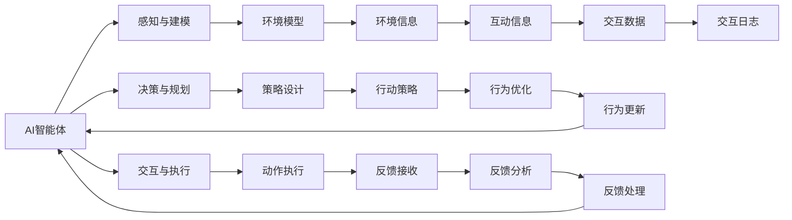

                 

## 1. 背景介绍

### 1.1 问题由来
随着人工智能（AI）技术的飞速发展，AI智能体在数字世界中的作用越来越显著。AI智能体不仅可以处理结构化数据，还能理解和生成自然语言，甚至具有视觉、听觉等多种感官能力。它们在自动化、决策支持、人机交互等领域展现出了巨大的潜力。然而，AI智能体在数字世界中的行为和决策，涉及复杂的算法、机制与环境交互，挑战重重。

### 1.2 问题核心关键点
AI智能体与数字世界的交互，本质上是构建一个高效、可靠且安全的AI系统，使其能够在数字世界中自主学习和适应。这涉及到以下几个关键点：
1. **环境感知与建模**：AI智能体需要具备感知环境的能力，理解环境状态，并建立与环境的动态模型。
2. **决策与规划**：基于对环境的理解，AI智能体需要设计策略和规划路径，以实现特定目标。
3. **交互与执行**：AI智能体需要与环境进行互动，执行动作并接收反馈，不断优化行为。
4. **鲁棒性与安全性**：AI智能体需要在不同的环境和任务中表现出一致的行为，同时避免恶意攻击和偏见。
5. **学习与进化**：AI智能体需要具备学习和进化的能力，随着环境变化和数据积累，持续提升性能。

### 1.3 问题研究意义
研究AI智能体与数字世界的交互，对于推动AI技术的广泛应用具有重要意义：
1. **降低开发成本**：通过高效的交互设计，AI智能体可以在短时间内实现特定功能，减少开发成本和周期。
2. **提升用户体验**：智能体与用户进行自然语言和交互界面的交互，极大提升用户体验和操作效率。
3. **增强决策支持**：通过深度学习和大数据分析，AI智能体可以提供基于证据的决策支持，辅助决策者做出更优选择。
4. **促进创新应用**：AI智能体的交互能力，拓展了AI在各种应用场景中的应用，推动了技术创新和产业升级。
5. **保障系统安全**：设计鲁棒且安全的AI系统，防止恶意行为和偏见，确保数据和交互的安全性。

## 2. 核心概念与联系

### 2.1 核心概念概述
在讨论AI智能体与数字世界的交互时，需要了解几个核心概念及其相互关系：

1. **AI智能体（Agent）**：指能够在数字世界中自主行动和决策的实体。AI智能体可以是虚拟机器人、聊天机器人、自动驾驶汽车等。
2. **数字世界（Digital World）**：指由数字信息组成的虚拟空间，包括互联网、物联网、虚拟现实等。
3. **感知与建模（Perception & Modeling）**：AI智能体通过传感器和算法，感知环境信息，并建立环境模型。
4. **决策与规划（Decision & Planning）**：AI智能体基于模型和目标，设计策略和路径，做出决策。
5. **交互与执行（Interaction & Execution）**：AI智能体与环境进行互动，执行动作并接收反馈，优化行为。
6. **鲁棒性与安全性（Robustness & Security）**：AI智能体需要在各种环境和任务中表现一致，避免被攻击和偏见影响。
7. **学习与进化（Learning & Evolution）**：AI智能体需要具备学习新知识和进化旧知识的能力，随着环境变化提升性能。

这些概念通过交互关系，构成了AI智能体与数字世界交互的核心框架。通过理解这些概念及其相互关系，我们可以更好地设计和管理AI智能体，使其在数字世界中高效、可靠地运行。

### 2.2 概念间的关系

这些核心概念之间的关系，可以通过以下Mermaid流程图来展示：



这个流程图展示了AI智能体与数字世界的交互过程：

1. AI智能体通过感知与建模，理解环境信息，建立环境模型。
2. 基于环境模型和目标，设计决策和规划策略，进行行动设计。
3. 通过交互与执行，执行动作并接收反馈，优化行为。
4. 交互过程中产生的数据和反馈，用于学习与进化，不断提升AI智能体的性能。

通过这些流程图，我们可以更清晰地理解AI智能体与数字世界交互的各个环节及其相互关系。

## 3. 核心算法原理 & 具体操作步骤

### 3.1 算法原理概述
AI智能体与数字世界的交互，涉及多个领域，包括感知、决策、规划、执行等。其核心算法原理包括以下几个方面：

1. **感知与建模算法**：通过传感器数据和深度学习模型，AI智能体感知环境信息，并建立环境模型。
2. **决策与规划算法**：基于模型和目标，设计策略和路径，进行优化决策。
3. **交互与执行算法**：通过自然语言处理（NLP）和机器人学技术，AI智能体与环境进行互动，执行动作并接收反馈。
4. **鲁棒性与安全性算法**：通过异常检测和对抗训练，保障AI智能体的鲁棒性和安全性。
5. **学习与进化算法**：通过强化学习、迁移学习和自监督学习，AI智能体不断学习新知识和进化旧知识，提升性能。

### 3.2 算法步骤详解

**感知与建模算法**：
1. **传感器数据采集**：通过摄像头、雷达、激光雷达等传感器，采集环境信息。
2. **数据预处理**：对采集到的数据进行降噪、归一化等预处理，提高数据质量。
3. **深度学习模型训练**：使用深度神经网络，训练感知模型，如卷积神经网络（CNN）、循环神经网络（RNN）等。
4. **环境建模**：基于感知模型，构建环境模型，如地图、状态空间等。

**决策与规划算法**：
1. **目标定义**：明确AI智能体的目标，如导航、避障、任务执行等。
2. **策略设计**：设计策略，如决策树、深度强化学习（DRL）、蒙特卡罗树搜索（MCTS）等。
3. **路径规划**：使用A*、D*、RRT等路径规划算法，规划动作路径。
4. **动作执行**：执行动作，并进行反馈调整。

**交互与执行算法**：
1. **自然语言处理**：通过NLP技术，实现与用户的自然语言交互，如聊天机器人、语音助手等。
2. **机器人学技术**：使用机器人学技术，实现物理动作执行，如机械臂、无人机等。
3. **反馈处理**：处理环境反馈，如传感器数据、用户指令等，更新模型和策略。

**鲁棒性与安全性算法**：
1. **异常检测**：使用异常检测算法，如离群点检测、时间序列分析等，识别异常行为。
2. **对抗训练**：通过对抗样本生成和防御训练，提高AI智能体的鲁棒性。
3. **安全性分析**：使用形式化验证和安全测试，保障AI系统的安全性。

**学习与进化算法**：
1. **强化学习**：使用Q-learning、SARSA等强化学习算法，训练AI智能体。
2. **迁移学习**：使用预训练模型和微调技术，提高学习效率。
3. **自监督学习**：通过无监督学习，提高数据利用率和泛化能力。

### 3.3 算法优缺点
AI智能体与数字世界的交互算法具有以下优点：
1. **灵活性高**：可以适应不同的环境和任务，灵活设计策略和路径。
2. **性能优越**：通过深度学习和强化学习，AI智能体在感知、决策、规划等方面表现优异。
3. **可扩展性强**：可以拓展到多种应用场景，如自动驾驶、智能家居、智能制造等。

同时，也存在一些缺点：
1. **计算资源需求高**：深度学习和大数据分析需要大量计算资源，制约了实时性和可扩展性。
2. **数据依赖性强**：AI智能体依赖大量标注数据，获取高质量标注数据的成本较高。
3. **安全性问题**：AI智能体需要设计复杂的防御机制，防止恶意攻击和偏见影响。

### 3.4 算法应用领域

AI智能体与数字世界的交互技术，已经广泛应用于多个领域，包括：

1. **自动驾驶**：AI智能体通过感知、决策和规划，实现自动驾驶功能，提高交通安全和效率。
2. **智能家居**：AI智能体通过感知和执行，实现家居自动化，提升生活品质。
3. **智能制造**：AI智能体通过感知和决策，实现生产过程优化和故障诊断，提高生产效率。
4. **医疗健康**：AI智能体通过感知和规划，实现远程医疗、个性化诊疗等功能，提升医疗服务质量。
5. **金融服务**：AI智能体通过感知和决策，实现智能投顾、风险管理等功能，提升金融服务水平。
6. **教育培训**：AI智能体通过感知和交互，实现个性化学习、智能辅导等功能，提升教育效果。
7. **智能客服**：AI智能体通过感知和执行，实现自动客服、情感分析等功能，提升客户服务体验。

## 4. 数学模型和公式 & 详细讲解 & 举例说明

### 4.1 数学模型构建

在AI智能体与数字世界的交互中，数学模型扮演着重要角色。以下将介绍几个核心数学模型及其构建过程。

**感知与建模算法**：
1. **传感器数据建模**：
   - **高斯噪声模型**：传感器数据 $x$ 服从高斯分布 $N(\mu, \sigma^2)$。
   - **马尔可夫模型**：传感器数据 $x_t$ 在时间 $t$ 的条件概率 $p(x_t|x_{t-1}, \theta)$，其中 $\theta$ 为模型参数。
   - **卡尔曼滤波器**：利用观测数据和模型状态，估计状态变量 $x_t$ 的估计值 $\hat{x}_t$。

2. **深度学习模型**：
   - **卷积神经网络**：通过卷积层、池化层、全连接层等结构，提取环境特征 $f(x)$。
   - **循环神经网络**：通过时间步 $t$ 的输入 $x_t$ 和状态 $h_{t-1}$，预测输出 $y_t$，如长短时记忆网络（LSTM）、门控循环单元（GRU）等。
   - **自编码器**：通过编码器 $f(x)$ 和解码器 $g(z)$，将输入 $x$ 映射到隐变量 $z$，再映射回输出 $y$。

**决策与规划算法**：
1. **决策树**：通过树形结构，将决策路径和动作映射为规则。
2. **强化学习**：
   - **Q-learning**：状态动作值函数 $Q(s,a)$ 通过迭代更新，得到最优策略 $\pi$。
   - **SARSA**：状态动作值函数 $Q(s,a)$ 通过动作-状态-奖励-动作的序列，更新策略。
3. **蒙特卡罗树搜索**：通过搜索树扩展和剪枝，优化决策路径。

**交互与执行算法**：
1. **自然语言处理**：
   - **词嵌入模型**：如Word2Vec、GloVe等，将词汇映射到向量空间。
   - **注意力机制**：如Transformer、Self-Attention等，提高模型对输入的注意力分配。
   - **序列到序列模型**：如Seq2Seq、Transformer等，实现序列数据的转换和生成。
2. **机器人学技术**：
   - **逆动力学模型**：通过逆动力学方程，计算关节力矩 $u$。
   - **运动规划算法**：如Dubins路径规划、A*算法等，规划动作路径。
   - **运动控制算法**：如PID控制器、LQR控制器等，实现动作控制。

**鲁棒性与安全性算法**：
1. **异常检测**：
   - **统计分析**：如均值-方差分析、箱线图等，检测异常数据。
   - **机器学习**：如Isolation Forest、One-Class SVM等，检测异常行为。
2. **对抗训练**：
   - **生成对抗网络**：通过生成器和判别器的对抗训练，提高模型鲁棒性。
   - **防御生成对抗网络**：通过生成防御样本，提高模型鲁棒性。
3. **安全性分析**：
   - **形式化验证**：如符号执行、模型检查等，验证系统安全性。
   - **测试用例生成**：如模糊测试、自动测试等，检测系统漏洞。

**学习与进化算法**：
1. **强化学习**：
   - **策略梯度**：通过策略参数 $\theta$ 的梯度，更新策略。
   - **Actor-Critic**：通过策略和价值函数的联合优化，提高学习效率。
2. **迁移学习**：
   - **预训练模型**：通过在大规模数据上预训练模型，加速微调过程。
   - **微调技术**：通过微调模型参数，适应特定任务。
3. **自监督学习**：
   - **自编码器**：通过无标签数据，学习数据表示。
   - **自回归模型**：如GPT、BERT等，生成序列数据。

### 4.2 公式推导过程

**感知与建模算法**：
1. **高斯噪声模型**：
   - $p(x|x_{t-1}, \theta) = \mathcal{N}(x; \mu, \sigma^2)$
   - 其中 $\mu = f(x_{t-1}, \theta)$，$\sigma^2 = \lambda^2$。

2. **卡尔曼滤波器**：
   - 状态方程：$\hat{x}_t = A_t \hat{x}_{t-1} + B_t u_t + v_t$
   - 观测方程：$y_t = C_t \hat{x}_t + w_t$
   - 其中 $A_t$ 为状态转移矩阵，$B_t$ 为控制矩阵，$u_t$ 为控制输入，$v_t$ 为过程噪声，$w_t$ 为观测噪声，$C_t$ 为观测矩阵。

**深度学习模型**：
1. **卷积神经网络**：
   - 卷积层：$\mathcal{F}_{conv}(x) = \sum_k \sum_{i,j} w_k * x_i * x_j$
   - 池化层：$\mathcal{F}_{pool}(x) = \max_i \mathcal{F}_{conv}(x_i)$
   - 全连接层：$\mathcal{F}_{fc}(x) = \sum_i w_i * x_i + b$

2. **循环神经网络**：
   - LSTM单元：$c_t = \tanh(\mathcal{F}_{lstm}(c_{t-1}, h_{t-1}, x_t))$
   - 输出层：$y_t = \sigma(\mathcal{F}_{lstm}(c_t, h_t, x_t))$
   - 其中 $\mathcal{F}_{lstm}$ 为LSTM门控机制。

**决策与规划算法**：
1. **决策树**：
   - 决策规则：$if\ condition\ then\ action$
   - 其中 $condition$ 为状态变量，$action$ 为动作。

2. **强化学习**：
   - Q-learning 更新规则：$Q(s,a) \leftarrow Q(s,a) + \alpha(r + \gamma \max_{a'} Q(s',a'))$
   - 其中 $\alpha$ 为学习率，$\gamma$ 为折扣因子，$r$ 为即时奖励，$s'$ 为下一个状态。

**交互与执行算法**：
1. **自然语言处理**：
   - 词嵌入模型：$z = \mathcal{F}_{word}(x)$
   - 注意力机制：$w = \mathcal{F}_{attention}(z, c)$
   - 序列到序列模型：$y = \mathcal{F}_{seq2seq}(x, w)$

2. **机器人学技术**：
   - 逆动力学模型：$u = \mathcal{F}_{invert}(j, q, v)$
   - 运动规划算法：$\mathcal{F}_{plan}(x, y, \delta)$
   - 运动控制算法：$u = \mathcal{F}_{control}(x, y, z)$

**鲁棒性与安全性算法**：
1. **异常检测**：
   - 统计分析：$\hat{\mu} = \frac{1}{n} \sum_{i=1}^n x_i$
   - 机器学习：$\hat{y} = f(x)$

2. **对抗训练**：
   - 生成对抗网络：$G(z) = \mathcal{F}_{gen}(z)$
   - 防御生成对抗网络：$D(x) = \mathcal{F}_{def}(x)$

**学习与进化算法**：
1. **强化学习**：
   - 策略梯度：$\pi(a|s) = \frac{e^{\mathcal{F}_{str}(theta)}(s)}{\sum_{a} e^{\mathcal{F}_{str}(theta)}(s)}$
   - Actor-Critic：$\pi(a|s) = \frac{e^{\mathcal{F}_{str}(theta)}(s)}{\sum_{a} e^{\mathcal{F}_{str}(theta)}(s)}$

2. **迁移学习**：
   - 预训练模型：$W_{pre} = \mathcal{F}_{pre}(x)$
   - 微调技术：$W_{fin} = \mathcal{F}_{fin}(W_{pre}, x)$

3. **自监督学习**：
   - 自编码器：$z = \mathcal{F}_{auto}(x)$
   - 自回归模型：$y = \mathcal{F}_{reg}(z)$

### 4.3 案例分析与讲解

**感知与建模算法**：
1. **传感器数据建模**：
   - 假设某自动驾驶系统通过激光雷达采集周围环境信息，数据 $x$ 服从高斯分布 $N(\mu, \sigma^2)$。
   - 利用卡尔曼滤波器，对观测数据 $y_t$ 进行状态估计 $\hat{x}_t$，滤除噪声影响。

2. **深度学习模型**：
   - 使用卷积神经网络提取图像特征 $f(x)$。
   - 利用循环神经网络处理时间序列数据 $y_t$，输出预测结果。

**决策与规划算法**：
1. **决策树**：
   - 假设某智能家居系统通过传感器感知室内环境，设计决策树规则，如 $\text{if} 温度 < 20 \text{ and} 湿度 > 60 \text{ then} 打开空调$。

2. **强化学习**：
   - 假设某自动驾驶系统通过Q-learning算法优化路径规划，状态为 $s = (x, v)$，动作为 $a = (u, d)$，即时奖励为 $r = c(u, d)$，更新Q值 $Q(s,a) \leftarrow Q(s,a) + \alpha(r + \gamma \max_{a'} Q(s',a'))$。

**交互与执行算法**：
1. **自然语言处理**：
   - 假设某智能客服系统通过NLP技术实现对话交互，利用词嵌入模型和注意力机制，处理用户输入 $x$，输出回答 $y$。

2. **机器人学技术**：
   - 假设某机械臂系统通过逆动力学模型和运动控制算法，执行抓取任务，动作参数 $u$ 通过 $\mathcal{F}_{invert}$ 和 $\mathcal{F}_{control}$ 计算。

**鲁棒性与安全性算法**：
1. **异常检测**：
   - 假设某金融系统通过统计分析检测异常行为，计算均值和方差，判断异常数据。

2. **对抗训练**：
   - 假设某医疗系统通过生成对抗网络提高模型鲁棒性，生成对抗样本 $x'$ 和防御样本 $x''$，更新模型参数。

**学习与进化算法**：
1. **强化学习**：
   - 假设某智能推荐系统通过策略梯度算法优化推荐策略，更新策略参数 $\theta$。

2. **迁移学习**：
   - 假设某医疗影像系统通过预训练模型加速微调过程，利用预训练权重 $W_{pre}$ 和微调权重 $W_{fin}$，优化模型性能。

3. **自监督学习**：
   - 假设某智能语音助手通过自回归模型生成自然语言，利用自编码器提取特征 $z$，输出语言生成结果 $y$。

## 5. 项目实践：代码实例和详细解释说明

### 5.1 开发环境搭建

在进行项目实践前，我们需要准备好开发环境。以下是使用Python进行PyTorch开发的环境配置流程：

1. 安装Anaconda：从官网下载并安装Anaconda，用于创建独立的Python环境。

2. 创建并激活虚拟环境：
```bash
conda create -n pytorch-env python=3.8 
conda activate pytorch-env
```

3. 安装PyTorch：根据CUDA版本，从官网获取对应的安装命令。例如：
```bash
conda install pytorch torchvision torchaudio cudatoolkit=11.1 -c pytorch -c conda-forge
```

4. 安装Transformers库：
```bash
pip install transformers
```

5. 安装各类工具包：
```bash
pip install numpy pandas scikit-learn matplotlib tqdm jupyter notebook ipython
```

完成上述步骤后，即可在`pytorch-env`环境中开始项目实践。

### 5.2 源代码详细实现

下面我们以自动驾驶系统为例，给出使用PyTorch对感知与建模、决策与规划、交互与执行等算法进行实践的代码实现。

首先，定义感知与建模模块：

```python
import torch
import torch.nn as nn
import torchvision.transforms as transforms
from torchvision.models import resnet18

class PerceptionModule(nn.Module):
    def __init__(self):
        super(PerceptionModule, self).__init__()
        self.resnet = resnet18(pretrained=True)
        self.conv = nn.Conv2d(512, 256, kernel_size=3, stride=1, padding=1)
        self.bn = nn.BatchNorm2d(256)
        self.fc = nn.Linear(256, 256)
        self.relu = nn.ReLU()
        self.fc2 = nn.Linear(256, 2)  # 输出左右方向的偏置

    def forward(self, x):
        x = self.resnet.conv1(x)
        x = self.resnet.bn1(x)
        x = self.resnet.relu(x)
        x = self.resnet.maxpool(x)
        x = self.resnet.layer1(x)
        x = self.resnet.layer2(x)
        x = self.resnet.layer3(x)
        x = self.resnet.layer4(x)
        x = self.conv(x)
        x = self.bn(x)
        x = self.relu(x)
        x = x.view(x.size(0), -1)
        x = self.fc(x)
        x = self.relu(x)
        x = self.fc2(x)
        return x

# 加载感知与建模模块
perception_module = PerceptionModule()
```

然后，定义决策与规划模块：

```python
import torch.nn.functional as F

class DecisionModule(nn.Module):
    def __init__(self):
        super(DecisionModule, self).__init__()
        self.fc = nn.Linear(256, 64)
        self.relu = nn.ReLU()
        self.fc2 = nn.Linear(64, 2)  # 输出左右方向的偏置

    def forward(self, x):
        x = self.fc(x)
        x = self.relu(x)
        x = self.fc2(x)
        return x

# 加载决策与规划模块
decision_module = DecisionModule()
```

接着，定义交互与执行模块：

```python
import torchvision.transforms as transforms
from torchvision.models import resnet18

class InteractionModule(nn.Module):
    def __init__(self):
        super(InteractionModule, self).__init__()
        self.resnet = resnet18(pretrained=True)
        self.conv = nn.Conv2d(512, 256, kernel_size=3, stride=1, padding=1)
        self.bn = nn.BatchNorm2d(256)
        self.fc = nn.Linear(256, 256)
        self.relu = nn.ReLU()
        self.fc2 = nn.Linear(256, 2)  # 输出左右方向的偏置

    def forward(self, x):
        x = self.resnet.conv1(x)
        x = self.resnet.bn1(x)
        x = self.resnet.relu(x)
        x = self.resnet.maxpool(x)
        x = self.resnet.layer1(x)
        x = self.resnet.layer2(x)
        x = self.resnet.layer3(x)
        x = self.resnet.layer4(x)
        x = self.conv(x)
        x = self.bn(x)
        x = self.relu(x)
        x = x.view(x.size(0), -1)
        

